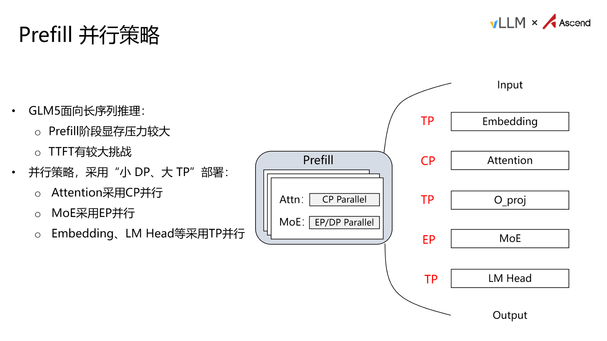
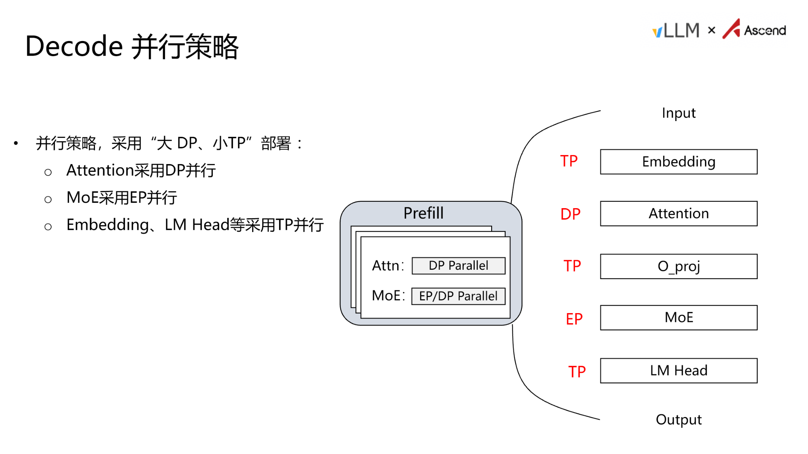
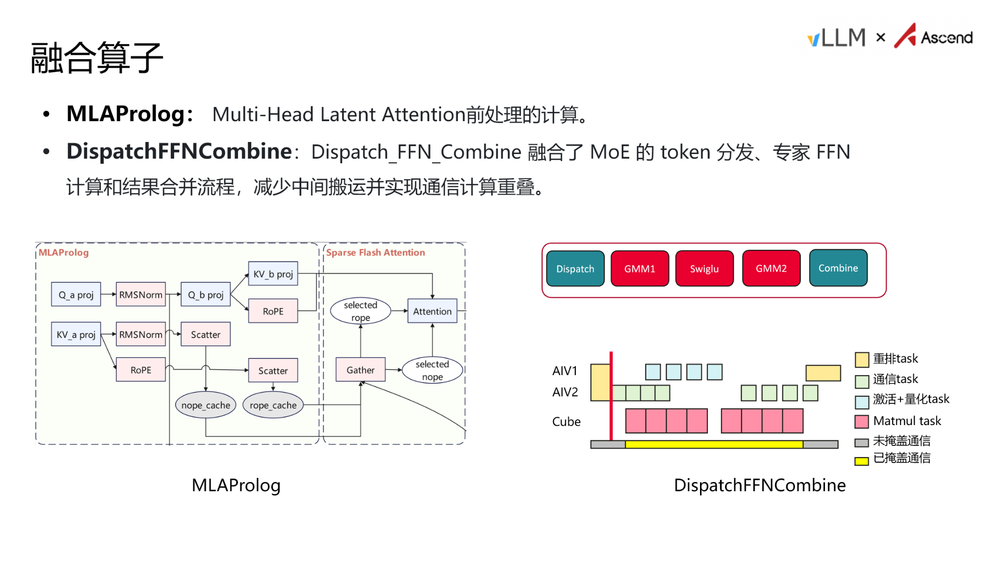

# GLM-5 昇腾推理优化：从架构瓶颈到端到端性能的系统性拆解

**原视频**：[昇腾部署 GLM-5 指南](https://www.bilibili.com/video/BV1eoJJ6eEUv) · **配套资料**：[GLM-5 优化](https://drive.google.com/file/d/1-j3saiDcRuFyPjsDexGDAWN58fU-JvsO/view)

大语言模型推理部署的工程难度，往往不在于单一技术点的攻克，而在于延迟、吞吐与显存三者之间的持续博弈。GLM-5 作为一款采用 MoE（Mixture of Experts，混合专家）架构与独特注意力结构的大模型，在长序列推理场景下将这一博弈推向了极端：Prefill 阶段计算量爆炸、KV Cache 吞噬显存、Decode 阶段通信占比过高——任何单点优化都不足以解决全局问题。

本文基于 GLM-5 在华为昇腾（Ascend）平台上的推理优化实践，沿"指标定义 → 瓶颈定位 → 架构拆分 → 数据压缩 → 算子加速 → 端到端验证"的因果链，系统拆解从分析框架到工程落地的完整路径。

**适读人群**：具备大模型基础，关注推理性能优化、算力部署及底层加速机制的 AI 工程师与架构师。

**前置知识**：

- 了解大语言模型推理的基本过程（Prefill 与 Decode 两阶段）。
- 熟悉常见的分布式并行策略（TP、DP、PP）。
- 对显存带宽、计算密集型与访存密集型任务有基本概念。

**阅读目标**：

1. 掌握大模型推理性能的核心指标及其相互制约关系。
2. 理解 GLM-5 在长序列场景下的结构瓶颈。
3. 学会根据计算与访存特性设计 PD 分离及差异化并行策略。
4. 了解量化、图模式及融合算子在昇腾硬件上的加速原理。

---

## 一、推理优化的核心矛盾与分析框架

> **本节核心问题**：大模型推理优化应该先做什么？如何建立可复用的分析方法？

部署 GLM-5 时，工程师面对的第一个问题不是"怎么优化"，而是"优化什么、为谁优化"。脱离业务目标的优化，只会在延迟和吞吐之间反复摇摆。本节明确四个核心性能指标的制约关系，并给出一套四步分析方法，为后续所有优化决策提供判断依据。

### 四个核心指标与两类阶段

大模型推理性能由四个指标刻画：

| 指标 | 全称 | 决定因素 | 性质 |
|------|------|----------|------|
| **TTFT** | Time To First Token，首 Token 延迟 | Prefill 阶段处理全部输入 prompt | 计算密集，与输入长度正相关 |
| **TPOT** | Time Per Output Token，每 Token 延迟 | Decode 阶段逐 token 生成 | 访存密集，受带宽与显存制约 |
| **吞吐量** | 单位时间生成的 token 总量（TPS） | 系统整体处理能力 | 并发越高通常越大，但存在上限 |
| **并发能力** | 系统可同时服务的请求数 | 显存（HBM）容量上限 | 受 KV Cache 占用直接约束 |

Prefill（推理首阶段，一次性处理完整输入序列）与 Decode（生成阶段，逐 token 输出）性质截然不同：前者瓶颈在算力，后者瓶颈在显存带宽。这意味着同一个优化手段很难同时改善 TTFT 和 TPOT——选择优化方向之前，必须先知道业务更在意哪一端。

### 核心矛盾：延迟与吞吐不可兼得

四个指标之间存在一条根本的权衡链：

> **增大 batch / 并发 → 吞吐↑，但单请求 TTFT、TPOT 同步↑；**
> **追求极低延迟（小 batch）→ 算力喂不满，吞吐↓、单位成本↑。**

这条权衡链的物理根源在于三类资源的共享：

1. **算力**：batch 增大时计算单元利用率提升，但单请求排队与调度开销增加。
2. **带宽**：Decode 阶段多请求共享 HBM 带宽，并发越高，每条请求分到的有效带宽越低。
3. **显存**：权重、KV Cache（Key-Value Cache，推理中缓存的历史键值对）和激活值共同占用 HBM。KV Cache 随并发请求数线性增长，直接决定系统可容纳的最大并发数。

**显存是总闸门。** 无论算力多强、带宽多大，一旦 HBM 被权重和 KV Cache 占满，就无法再接纳新请求。SLO（Service Level Objective，服务质量目标）为 batch size 设了上限，显存为其设了天花板，真正可用的值取两者最小值。

### 四步分析框架

面对任何模型的推理优化，可以按如下四步闭环推进：

| 步骤 | 动作 | 关键输入 |
|------|------|----------|
| ① **定指标与目标** | 明确业务 SLO：输入/输出长度、TTFT 上限、TPOT 上限、目标吞吐与并发 | 产品需求文档 |
| ② **找瓶颈** | 区分 Prefill / Decode，判断 compute-bound 还是 memory-bound，定位卡点 | Profiling 数据 |
| ③ **选策略** | 在并行组合、量化、PD 分离、图模式等手段中对症下药 | 硬件拓扑与框架能力 |
| ④ **量化验证** | 用实测 TTFT / TPOT / 吞吐回看 SLO，迭代调参直至达标 | 端到端 benchmark |

评估每一个优化点时，始终追问三件事：**它解决了哪个瓶颈？改善了哪个指标？付出了什么代价？** 如果回答不清楚，说明优化方向尚未对齐业务目标。

### 最小例子：从 SLO 反推 batch size

假设业务要求 TPOT < 50 ms，单卡 Decode 一步在 batch=1 时耗时 10 ms。若 TPOT 与 batch size 近似线性增长（此处为简化说明的理想情形）：

$$\text{TPOT} \approx t_{\text{base}} \times B / B_0$$

其中 $t_{\text{base}} = 10\,\text{ms}$，$B_0 = 1$。要满足 TPOT < 50 ms，则 $B < 5$。若显存最多支撑 8 条并发，则 batch 上限取 $\min(5, 8) = 5$——SLO 而非显存成为实际约束。反之，若 SLO 放宽到 100 ms 而显存仍只撑 8 条，则显存成为闸门。

> **注意**：上述线性关系仅用于说明反推逻辑。实际 TPOT 与 batch 的关系受硬件调度、算子融合等因素影响，需实测确定。

**结论**：所有推理优化都是在"延迟、吞吐、显存"三角中寻找基于业务 SLO 的平衡点。四步分析框架为后续逐一拆解 GLM-5 在昇腾上的优化手段提供了统一的评判标准。

---

## 二、GLM-5 结构特征与长序列瓶颈定位

> **本节核心问题**：GLM-5 在处理长序列推理时，性能瓶颈究竟出现在哪个环节？

上一节建立了通用分析框架，现在将其应用到具体模型上。GLM-5 并非标准 Transformer，其独特的注意力结构在长序列下会暴露出意料之外的性能热点。

### 模型整体架构：DSA 与 Lightning Indexer

GLM-5 的注意力层采用 **DSA（Decoupled Sparse Attention，解耦稀疏注意力）** 结构，核心思路是将注意力计算中的稠密操作拆解为更稀疏的子操作，以降低长序列的计算开销。

在 DSA 基础上，GLM-5 额外引入了 **Lightning Indexer** 模块。该模块的职责是在长序列中执行高效的索引与筛选：面对大量 token 时，Lightning Indexer 先通过量化和打分，利用 TopK 选择器挑出最相关的 token 子集，再将子集送入后续的注意力计算。

下表还原 PPT 第 9 页展示的数据流核心路径：

| 步骤 | 模块 | 说明 |
|:---:|:---|:---|
| ① | Input Hidden | 接收上一层的隐藏状态 |
| ② | RoPE 应用 | 注入旋转位置编码 |
| ③ | Lightning Indexer | 对序列进行量化打分 |
| ④ | TopK Selector | 从全序列中选出得分最高的 token 子集 |
| ⑤ | Multi-Query Attention | 仅对选中的子集执行注意力计算 |

设计意图是 **先筛后算**——在注意力之前过滤掉大量低相关性 token，缩减实际参与运算的序列长度。

### 长序列下的真实耗时分布

设计意图虽合理，但"筛选"本身也产生开销。PPT 第 9 页给出了 Prefill 阶段长序列场景下的算子耗时占比：

| 排名 | 算子类别 | 耗时占比 |
|:---:|:---|:---:|
| 1 | **LightningIndexerQuant** | **26.53%** |
| 2 | 算子 B | 17.53% |
| 3 | 算子 C | 15.24% |
| 4 | 算子 D | 7.61% |
| 5 | 算子 E | 6.41% |

> *注：部分较小占比的算子标签在材料中难以辨识，仅列出可确认数值。LightningIndexerQuant 即 Lightning Indexer 内部的量化 + TopK 计算。*

一个占比超过四分之一的单一算子，在整条推理链中已属"一家独大"。即使把其他算子全部优化到极致，如果不解决 Lightning Indexer 的开销，整体性能仍被它牢牢卡住。

### 因果链：为什么 TopK 成为瓶颈

1. **输入序列变长** → Prefill 阶段需一次性处理所有输入 token，计算量随序列长度剧增。
2. **Lightning Indexer 对全序列打分** → 量化和打分操作的工作量与序列长度正相关。
3. **TopK 选择的复杂度随序列增长急剧放大** → 在 128K 长上下文场景下，TopK 耗时增长趋势显著（据演讲者口头描述，精确复杂度曲线材料中未给出）。
4. **TopK 耗时超过注意力本身** → 原本用来"减少注意力计算量"的筛选模块，反而成为最昂贵的环节。

| 场景 | 序列长度 | TopK 是否为瓶颈 |
|:---|:---:|:---:|
| 短对话 | ~4K tokens | 否，TopK 开销可忽略 |
| 中等文档 | ~32K tokens | 开始显现，但占比尚可接受 |
| 长上下文 | ~128K tokens | **是，占比达 26.53%，第一大耗时算子** |

**结论**：针对 GLM-5 的长序列优化，首要目标是 Prefill 阶段的 Lightning Indexer / TopK 算子。上述耗时分布来自长序列 Prefill 阶段，短序列或 Decode 阶段的瓶颈分布可能完全不同。

---

## 三、并行策略选择与计算访存特性差异

> **本节核心问题**：Prefill 和 Decode 对硬件资源的诉求截然相反，TP、DP、EP、PP 四种策略如何因阶段而异地组合使用？

明确了 Prefill 阶段的计算热点后，下一步要回答的问题是：如何通过分布式并行策略将这些集中的计算负载分摊到多张卡上？在此之前，需要先厘清两阶段对硬件资源的本质诉求差异。

### Prefill 与 Decode：瓶颈的根本分野

**Prefill** 需对完整输入序列计算注意力。在标准自注意力中，Q、K 矩阵运算量与序列长度的平方成正比，属于典型的 **计算密集型（compute-bound）** 任务，核心指标是 TTFT。

**Decode** 每步只生成一个新 token。历史 token 的 Key 和 Value 已缓存在 KV Cache 中，当前步仅用新 token 的 Q 向量查询缓存。计算量从"序列长度的平方"骤降为"与序列长度成正比"，瓶颈转移到读取 KV Cache 和模型权重所需的**显存带宽**，成为 **访存密集型（memory-bound）** 任务，核心指标是 TPOT。

> **因果链**：自回归特性 → Decode 可复用 KV Cache → 计算量大幅缩减 → 瓶颈由算力转向带宽 → 两阶段需要不同的并行与资源配置。

### 四种并行策略逐项对比

下表整理了 TP、DP、EP、PP 的核心差异（信息来源：PPT 第 5 页）：

| 策略 | 切分对象 | 显存效果 | 通信开销 | 典型场景 |
|------|---------|---------|---------|---------|
| **TP**（Tensor Parallelism，张量并行） | 单个权重矩阵按行/列拆分到多卡 | 权重与激活均摊，省单卡显存 | **高**：每层需 AllReduce | 单机高速互联；缓解 Prefill 计算与显存压力 |
| **DP**（Data Parallelism，数据并行） | 不同卡处理不同请求，各存完整权重 | 权重不省，每卡一份 | **低**：层内几乎无通信 | 提升并发与吞吐；Decode 常用大 DP |
| **EP**（Expert Parallelism，专家并行） | MoE 的不同专家分散到不同卡 | 大幅降低单卡 MoE 权重占用 | **中高**：Dispatch / Combine 需全互联 | MoE 架构必备；通信可与计算重叠 |
| **PP**（Pipeline Parallelism，流水线并行） | 按模型层切段，跨卡或跨节点 | 每卡只放部分层 | **低~中**：仅相邻 stage 点对点 | 跨节点扩展超大模型 |

要点解读：

- **TP** 把一个矩阵乘法拆给多卡，最终通过 AllReduce 汇聚结果。在 Prefill 阶段价值最大——序列长、计算重，TP 既分摊算力也分摊显存，代价是每层都要做一次集合通信。
- **DP** 各卡独立处理不同请求，互不干扰。Decode 阶段单请求计算量极小，扩大 DP 度能直接提升并发数和总吞吐。
- **EP** 是 MoE 模型的刚需。GLM-5 专家数量庞大，不做 EP 则单卡无法容纳全部专家权重。
- **PP** 在 GLM-5 部署中使用相对较少，但当模型规模超出单机容量时仍是必要手段。

### 状态演进：batch size 增大时 Decode 的瓶颈迁移

1. **batch = 1**：单请求每步仅做一次向量与 KV Cache 的点积，计算量极小，时间几乎全花在读取权重和缓存上 → 纯访存瓶颈。
2. **batch = 32**：多请求共享同一份模型权重（权重只需读一次即可为 32 个请求服务），算力利用率提升，但带宽压力仍主导。
3. **batch 继续增大**：部分算子（如 MoE FFN）可能短暂进入 compute-bound 区间，但 Attention 部分因 KV Cache 随序列长度线性增长，始终维持显著的带宽需求。

**结论**：单一并行策略无法同时服务好两个阶段。Prefill 追求低 TTFT，需要更大的 TP 度来加速单请求计算；Decode 追求低 TPOT 和高吞吐，需要更大的 DP 度来提升并发。两者对同一组硬件资源的诉求方向相反——混合部署时任何配置都只能是折中。

---

## 四、PD 分离架构与差异化部署策略

> **本节核心问题**：如何在架构层面消除 Prefill 与 Decode 的资源抢占，并分别定制最优并行策略？

既然 Prefill 和 Decode 对并行策略的需求完全相反，传统的混合部署必然导致资源抢占与妥协。PD 分离架构的引入，正是要从根本上消除这一矛盾。

### PD 混布为何必然产生冲突

在 vLLM（大模型推理加速框架）等推理框架的默认调度中，同一批次里同时包含 Prefill 请求和 Decode 请求。框架通常优先执行 Prefill（因为只有 Prefill 完成才能启动对应请求的 Decode），但 Prefill 的计算时间远长于单步 Decode，导致批次内的 Decode 请求必须等待 Prefill 结束才能推进，TPOT 被直接拉高。

| 维度 | Prefill | Decode |
|------|---------|--------|
| 计算特征 | 计算密集 | 访存密集 |
| 显存压力 | 高——长序列产生大量 KV Cache | 较低——KV Cache 可从 P 节点传输 |
| 核心延迟指标 | TTFT | TPOT |
| 扩容方向 | 增加算力 | 增加并发通道 |

在混布模式下，一套并行参数无法同时满足上述两组截然不同的需求。

### PD 分离的核心机制

**PD 分离（Prefill/Decode Disaggregation）** 的思路直截了当：将两阶段部署到不同的物理节点上，各自独立调度，互不抢占资源。

- **P 节点**（Prefill 节点）专门执行 prompt 的首次计算，完成后将生成的 KV Cache 通过节点间通信传输给 D 节点。
- **D 节点**（Decode 节点）仅负责逐 token 生成，从 P 节点按需接收 KV Cache。

分离带来两个直接收益：**独立弹性伸缩**——TTFT 不达标时可单独增加 P 节点算力而无需调整 D 节点，反之亦然；**针对性并行策略**——两类节点分别选取最适合自身负载特征的方案。

### Prefill 阶段：小 DP、大 TP + CP

长序列场景下，单条请求输入可达数万 token，Prefill 阶段显存压力极大。P 节点的并行策略倾向于"小 DP、大 TP"——减少数据并行副本数，增大单请求内部的模型切分规模。

下图展示了 P 节点内各模块的并行分工，有助于理解不同并行策略在模型数据流中的具体位置：


*图注：Prefill 并行策略——Input 经过 Embedding（TP）、Attention（CP）、O_proj（TP）、MoE（EP）、LM Head（TP）输出。来源：PPT 第 10 页*

图中关键元素解读：

- **Embedding / LM Head → TP**：矩阵乘法通过张量并行切分到多卡，最常规的并行方式。
- **Attention → CP（Context Parallelism，上下文并行）**：这是应对长序列的核心手段。CP 将输入 token 序列按位置维度切分，每张卡只处理一部分上下文。好处有二：单卡需要缓存的 KV Cache 量随切分数线性下降，直接缓解显存瓶颈；CP 的通信与计算之间可以形成 overlap，从而部分掩盖通信开销。
- **MoE → EP**：不同专家分配到不同设备上，通过 All-to-All 通信路由 token，使专家权重不必在每张卡上完整存放。

这套组合的因果逻辑是：长序列 → 显存不足 → 用 CP 切分序列 + EP 切分专家 → 单卡负载可控 → TTFT 达标。

### Decode 阶段：大 DP、小 TP

D 节点的 KV Cache 从 P 节点按需传输而来，自身显存压力较低。此时瓶颈转移到通信占比——TP 越大，每步需要执行的跨卡通信越多，而每次通信搬运的有效数据量却很小，通信占比过高直接拖慢 TPOT。因此 D 节点采用"大 DP、小 TP"策略。

下图展示了 D 节点的并行分工，与上图 P 节点策略形成对照：


*图注：Decode 并行策略——Attention 改为 DP 并行，其余模块保持不变。来源：PPT 第 11 页（原图左侧框标题误标为"Prefill"，实际描述的是 Decode 策略）*

与 Prefill 对比，关键变化集中在 Attention 模块：改为 DP，让每张卡独立处理不同请求。单步 Decode 的序列长度仅为 1，CP 切分已无意义。

两阶段策略差异总结：

| 模块 | Prefill（P 节点） | Decode（D 节点） |
|------|-------------------|-------------------|
| Embedding / LM Head | TP | TP |
| Attention | **CP** | **DP** |
| MoE | EP | EP |
| DP 规模 | 小 | 大 |
| TP 规模 | 大 | 小 |

**结论**：PD 分离为长序列推理提供了架构层面的保障，是实现低 TTFT 与低 TPOT 兼得的前提。需要注意的边界条件是：PD 分离引入了 P 节点向 D 节点传输 KV Cache 的跨节点通信开销。当序列极长时，这部分传输量可能可观，是否成为新瓶颈取决于节点间互联带宽与 KV Cache 的压缩程度——后者正是下一节要讨论的内容。

---

## 五、突破显存墙：量化策略与 C8 KV Cache

> **本节核心问题**：在不增加硬件的前提下，如何进一步压缩显存占用以提升系统最大并发容量？

架构层面的拆分解决了计算资源的分配问题，但单节点的物理显存上限依然存在。当模型权重和 KV Cache 的总量逼近 HBM 边界时，单卡可容纳的并发请求数仍会受限。答案指向两个维度的量化——权重激活量化与 KV Cache 量化。

### 权重与激活量化：W8A8 / W4A8

量化（Quantization）用更低位宽的整数表示原本以 BF16（16-bit Brain Floating Point）存储的权重（W）和激活值（A），减少每个参数的字节数。GLM-5 在昇腾 NPU 上支持两种量化方案，三种精度下模型权重的显存占用对比如下（数据来源：PPT 第 12 页）：

| 精度方案 | 权重位宽 | 激活位宽 | 权重显存占用 |
|----------|---------|---------|------------|
| BF16（原始） | 16 bit | 16 bit | **1 510 GB** |
| W8A8 | 8 bit | 8 bit | **764 GB** |
| W4A8 | 4 bit | 8 bit | **395 GB** |

> 以上为整个模型的权重总量，不含 KV Cache 和中间激活。

从 BF16 到 W8A8，权重占用降至约一半；W4A8 仅为原始的 26%。若坚持 BF16 全精度部署并需在长序列场景下稳定运行，所需资源量远超量化方案。

GLM-5 并非对所有子模块采用统一精度，而是根据各部分对精度的敏感度做区分。PPT 第 12 页展示的配置中，注意力计算的 SFA（Sparse Flash Attention）部分保留 BF16，Lightning Indexer 采用 A8C8（激活 8 bit、Cache 为 int8），其余线性投影和 MoE 专家层采用 W8A8。注意力分数对数值误差更为敏感，这是 SFA 保留高精度的原因。

### C8 KV Cache：把省下来的显存还给并发

权重量化只解决了"静态"占用。在推理服务中，KV Cache 才是显存的动态大户——它与序列长度 × 并发请求数成正比增长。

**C8 KV Cache** 技术将 KV Cache 从默认的 BF16/FP16 压缩为 int8（8-bit 整数）格式存储，每个缓存元素的字节数直接减半。因果链如下：

```
KV Cache 以 int8 存储
    → 每个 token 的缓存占用减少约 50%
    → 相同 HBM 容量可容纳更多 token 的缓存
    → 系统可同时服务更多并发请求（或支撑更长上下文）
    → 整体吞吐提升
```

**最小数字例子**：假设单请求在 BF16 下 KV Cache 占用 200 MB，int8 压缩后约 100 MB。一块空余 16 GB 显存的卡，BF16 下最多容纳 80 路并发，C8 模式下可扩展至约 160 路——并发上限直接翻倍。（此例为说明原理的简化计算，实际数值取决于序列长度、层数和注意力头维度。）

### 精度边界与硬件适配

当前昇腾 910B / 910C 上，C8 仅指 int8。未来 910 系列后续型号将支持 FP8 格式，届时 C8 的含义也会扩展。量化的代价包括：

1. **精度损失**——部分场景下输出质量可能下降，需结合业务容忍度评估。
2. **算子适配**——W4A8 场景下权重以 4 bit 存储、计算以 8 bit 执行，涉及 dequant 过程。当前采用融合算子方式将 dequant 与矩阵乘合并，避免单独调用带来的额外时延。
3. **并非所有子模块都适合低精度**——SFA 仍保持 BF16，说明量化策略需逐模块评估。

**结论**：量化是在固定硬件预算下提升并发能力最直接的手段。权重量化压缩静态占用，C8 KV Cache 压缩动态占用，二者叠加可将系统可部署规模显著提升。但模块级的精度分配与硬件对低精度格式的支持范围，决定了量化策略的实际上限。

---

## 六、底层加速：图模式与定制融合算子

> **本节核心问题**：如何降低算子下发时延并提升 MoE 等复杂结构的执行效率？

显存容量问题缓解后，系统性能的瓶颈可能转移到框架层：每个算子（Operator，神经网络中的基本计算单元）从 CPU 调度到 NPU 的延时累积起来，可能超过算子本身在加速卡上的执行耗时。此外，MoE 在分发、计算、合并各阶段之间会产生大量中间数据搬运。本节拆解两项底层技术：图模式消除调度开销，融合算子消除冗余搬运与通信等待。

### ACL Graph：一次捕获，反复重放

**ACL Graph** 是昇腾平台上对标 NVIDIA **CUDA Graph** 的图模式（Graph Mode）技术。其工作流程可用三步概括：

| 阶段 | 行为 | 收益 |
|------|------|------|
| **捕获** | 首次执行时，框架将一连串算子的 shape、参数和依赖关系记录为一张静态计算图 | 仅发生一次 |
| **编译** | 对图做算子融合、内存规划等离线优化 | 生成高效的下发指令序列 |
| **重放** | 后续每次推理直接将整张图一次性提交给 NPU | 将"逐算子下发"变为"整图一次性下发" |

**为什么对 Decode 尤为关键？** Decode 阶段每步只生成一个 token，单算子计算量极小，CPU 端逐条下发的延时占比可能远超算子执行本身。启用 ACL Graph 后，TTFT 和 TPOT 均可观察到改善。

> **边界条件**：图模式要求算子 shape 在捕获后保持不变；对于动态 shape 场景（如变长序列），通常需要对 shape 做分桶（bucketing）以维持静态图的复用率。

### 融合算子：两个关键案例

GLM-5 在昇腾上落地了多个定制融合算子，其中最具代表性的是 MLAProlog 和 DispatchFFNCombine。下图展示了这两个融合算子的内部结构与执行时序，是理解底层加速原理的关键参考：


*图注：左侧为 MLAProlog 数据流，右侧为 DispatchFFNCombine 的甘特图时序。来源：PPT 第 14 页*

#### MLAProlog——注意力前处理一步到位

Multi-Head Latent Attention（MLA）在进入注意力计算之前，需要完成 Q/KV 的投影（`Q_a_proj`、`KV_a_proj` 等）以及 RoPE 位置编码等一系列预处理。未融合时，这些操作各自作为独立算子依次下发，每次都带来一次 CPU→NPU 调度开销和一次中间 Tensor 的显存读写。

**MLAProlog** 将全部前处理计算融合进单个算子内核，一次调用即完成从投影到编码的全部工作。收益有二：调度开销从 N 次降为 1 次；中间 Tensor 不再写回 HBM，在片上 SRAM 中直接流转至下一步。

#### DispatchFFNCombine——MoE 通算融合

MoE 层的标准执行流为 `Dispatch → GMM1 → SwiGLU → GMM2 → Combine`。其中 Dispatch 将每个 token 路由到对应专家，Combine 将各专家输出按权重合并。若串行执行，Dispatch 和 Combine 涉及跨卡通信，计算单元在等待通信完成时处于空闲。

上图右侧的甘特图清晰展示了优化前后的对比。优化后，通过 Task 级别的重排，将执行拆分到不同硬件单元并行：

| 硬件单元 | 承担的 Task 类型 |
|----------|-----------------|
| **AIV1** | 重排 Task、激活 + 量化 Task |
| **AIV2** | 通信 Task |
| **Cube** | Matmul Task |

关键在于：当 AIV2 执行通信 Task 时，Cube 可同步执行 Matmul Task——即图中"已掩盖通信"区域。理想情况下通信耗时完全被计算掩盖；实际中仍有少量无法重叠的部分，但整体 MoE 层执行效率显著提升。

### MTP：以额外计算换取多 token 产出

**MTP（Multi-Token Prediction，多 token 预测）** 在标准结构之上额外增加一层计算，使每轮 Decode 可输出多个候选 token。

但 MTP 并非越大越好。接受率（Acceptance Rate）随 MTP 值递增而递减：MTP 设置过大时多预测的 token 大部分被丢弃，而额外计算层带来的时延开销却是确定的——净收益为负。需根据实际业务的 token 分布选取合理的 MTP 值。

**结论**：图模式与融合算子分别从调度路径和执行路径两个维度压缩了框架层的无效开销。ACL Graph 将逐算子下发变为整图重放；MLAProlog 和 DispatchFFNCombine 消除了中间数据搬运，并通过硬件单元级别的 Task 并行实现通信与计算的重叠。这些底层技术是突破框架性能天花板、释放硬件算力的必要手段。

---

## 七、端到端性能验证与极端场景分析

> **本节核心问题**：组合上述所有优化手段后，GLM-5 在真实高并发场景下表现如何？哪些测试条件对结果有决定性影响？

经过从架构到算子层面的全方位优化，最终需要在复杂业务场景中验证这些技术组合的端到端收益。以下数据来自 PD 分离部署形态（PPT 第 15 页）：

### 多场景性能全景

| 平均输入 | 平均输出 | Prefix Cache 命中率 | 并行策略（P / D） | 最大并发 | 请求频率 (req/s) | TTFT 均值 (ms) | TPOT 均值 (ms) | TPS |
|:---:|:---:|:---:|:---|:---:|:---:|---:|---:|---:|
| 16K | 1K | 0% | DP4 TP8 / DP8 TP4 | 112 | 1.5 | 30 825 | 22.5 | 1 205 |
| 64K | 1K | 90% | DP2 TP16 / DP8 TP4 | 256 | **0** | **64 367** | 34.1 | 2 354 |
| 128K | 1K | 90% | DP2 TP16 / DP8 TP4 | 120 | 1 | 28 334 | 25.2 | 934 |
| 64K | 256 | 90% | DP2 TP16 / DP32 TP2 | 200 | 4.2 | 8 009 | 21.2 | 932 |
| 64K | 1K | 90% | DP2 TP16 / DP32 TP2 | 200 | 4 | 7 738 | 32.8 | **3 059** |

> *Prefix Cache（前缀缓存）命中率指请求之间可复用的输入前缀比例，命中率越高，Prefill 实际需要重新计算的 token 越少。*

### 逐行解读关键变量

**最高吞吐行（第 5 行）。** 64K 输入、1K 输出、90% Prefix Cache 命中率条件下，Decode 侧扩展至 DP32 TP2——32 路数据并行、每路仅 2 卡张量并行。请求频率控制在 4 req/s，TTFT 降至约 7.7 s，TPS 达到 3 059。这是表中所有场景的吞吐峰值。

**极端 TTFT 行（第 2 行）。** 同为 64K + 90% 缓存命中，但请求频率标注为 0——256 个请求在同一时刻全部涌入 Prefill 节点。此时 TTFT 飙升到 64 367 ms（约 64 秒），比第 5 行高出近一个数量级，而 TPS 为 2 354，并未达到最高。

**128K 长上下文行（第 3 行）。** 输入翻倍至 128K 后，即使请求频率已降至 1 req/s，TTFT 仍为 28 s 级别。序列长度对 Prefill 计算量的影响接近平方级，是 TTFT 最直接的放大因素。

**短输出行（第 4 行）。** 输出长度从 1K 缩短到 256 token 后 TPS 从 3 059 降至 932。TPS 统计的是每秒输出 token 数，当每条请求生成的 token 更少时，即使处理速度相近，输出 token 总量也会下降。TPOT 反而是全表最低（21.2 ms），说明 Decode 本身并未成为瓶颈。

### 瞬间并发的因果链

第 2 行的 64 秒 TTFT 并非系统故障，而是可复现的边界行为：

1. **请求频率为 0** → 256 条 64K 请求在同一瞬间到达 Prefill 节点。
2. P 节点采用 DP2 TP16，仅有 2 个数据并行实例；每个实例需排队处理约 128 条 64K 长序列。
3. 单条 64K Prefill 本身耗时已在秒级，128 条排队后，最后完成的请求等待时间累积至约 64 秒。
4. Decode 节点仅为 DP8 TP4（而非第 5 行的 DP32 TP2），生成阶段并行度偏低。

对比第 5 行：请求以 4 req/s 匀速到达，Prefill 节点始终保持可控队列深度，TTFT 降至 7.7 s；Decode 侧升级至 DP32 TP2 后进一步释放吞吐，TPS 跃升至 3 059。

### 同配置不同打流方式的状态对比

以 64K 输入、1K 输出、90% 缓存命中率为固定条件：

| 对比维度 | 瞬间全量（第 2 行） | 匀速到达（第 5 行） |
|:---|:---:|:---:|
| 请求频率 | 0（一次性涌入） | 4 req/s |
| Decode 并行策略 | DP8 TP4 | DP32 TP2 |
| TTFT | 64 367 ms | 7 738 ms |
| TPOT | 34.1 ms | 32.8 ms |
| TPS | 2 354 | 3 059 |

**TPOT 几乎不受打流方式影响**（差异 < 4%），因为单条请求进入 Decode 后的逐 token 生成速度由硬件和模型结构决定。而 **TTFT 和 TPS 对请求到达模式与 Decode 侧并行度高度敏感**。

### 结论与边界条件

组合 PD 分离、Prefix Cache、大 DP 小 TP 的 Decode 并行策略后，GLM-5 在昇腾平台上可于 64K 长上下文场景实现 3 059 TPS 的输出吞吐。但这一数字成立的前提条件缺一不可：

- **90% 的 Prefix Cache 命中率**——实际业务中能否达到取决于请求的前缀重叠程度；
- **匀速到达的请求流**——瞬间并发会使 Prefill 队列积压，TTFT 退化至分钟级；
- **Decode 侧充分扩展**——DP32 TP2 需要 64 张卡，资源成本不可忽视。

---

## 总结

本文沿"指标定义 → 瓶颈定位 → 架构拆分 → 数据压缩 → 算子加速 → 端到端验证"的因果链，系统拆解了 GLM-5 在昇腾平台上的推理优化路径。核心结论如下：

1. **推理优化是一个系统工程**，需在延迟（TTFT/TPOT）、吞吐（TPS）和显存之间寻找基于业务 SLO 的最佳平衡点。四步分析框架（定指标 → 找瓶颈 → 选策略 → 量化验证）是所有优化决策的前提。

2. **GLM-5 的 Lightning Indexer 在长序列下构成显著瓶颈**。该模块的 TopK 计算在长上下文场景下占据 Prefill 阶段 26.53% 的耗时，是整条推理链的最大单点热点。

3. **PD 分离架构有效解耦了计算密集与访存密集型任务**。Prefill 采用"小 DP、大 TP + CP"分摊计算与显存压力，Decode 采用"大 DP、小 TP"降低通信占比并提升并发。

4. **量化是扩大并发容量最直接的手段**。W4A8 可将权重显存从 1 510 GB 压缩至 395 GB；C8 KV Cache 将动态缓存占用减半，两者叠加显著提升可部署规模。

5. **软硬协同的底层加速不可或缺**。ACL Graph 消除算子下发开销，MLAProlog 和 DispatchFFNCombine 融合算子消除中间数据搬运并实现通信计算重叠，是突破框架层性能天花板的关键。

6. **端到端性能对测试条件高度敏感**。3 059 TPS 的峰值吞吐成立于 64K 输入、1K 输出、90% Prefix Cache 命中率、4 req/s 匀速到达、P: DP2 TP16 / D: DP32 TP2 等特定前提下；瞬间并发可使 TTFT 退化至 64 秒。

**明确局限**：

- 本文性能数据均来自演讲 PPT 公开的测试结果，未包含不同 Prefix Cache 命中率梯度、Prefill 节点更高 DP 配置、以及量化精度损失对输出质量影响的定量评估。
- TopK 耗时在长序列下的增长趋势为演讲者口头描述，精确的复杂度曲线未在材料中给出。
- PD 分离引入的跨节点 KV Cache 传输开销，材料中未公布具体带宽数据或延迟影响。
- 逐模块量化配置（如 SFA 保留 BF16、Lightning Indexer 采用 A8C8）的精度影响需在具体业务场景中单独验证。
