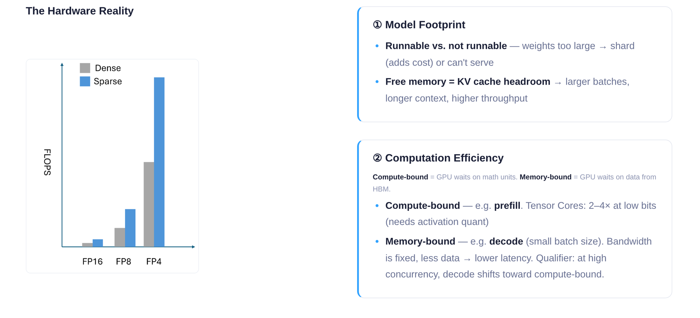
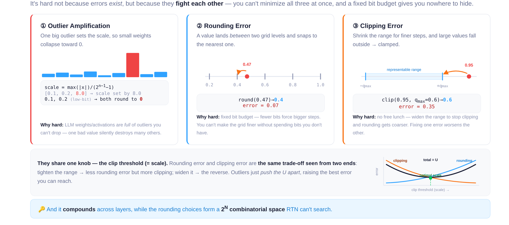
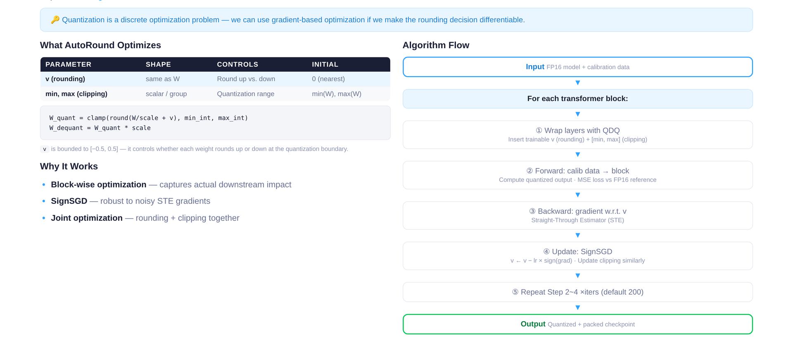
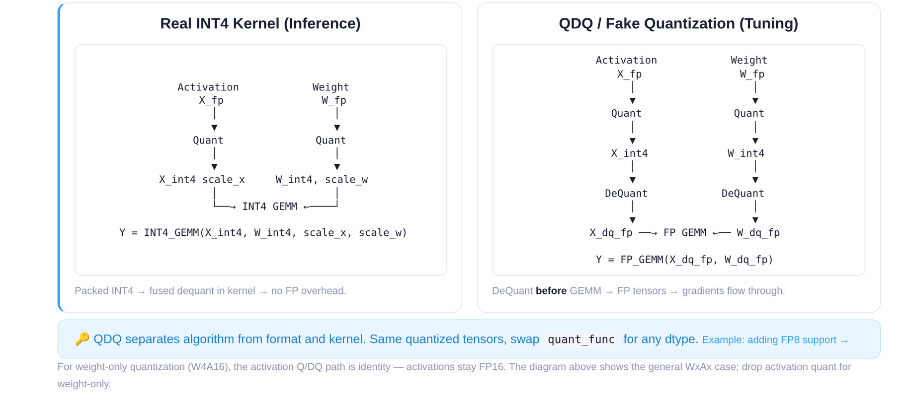
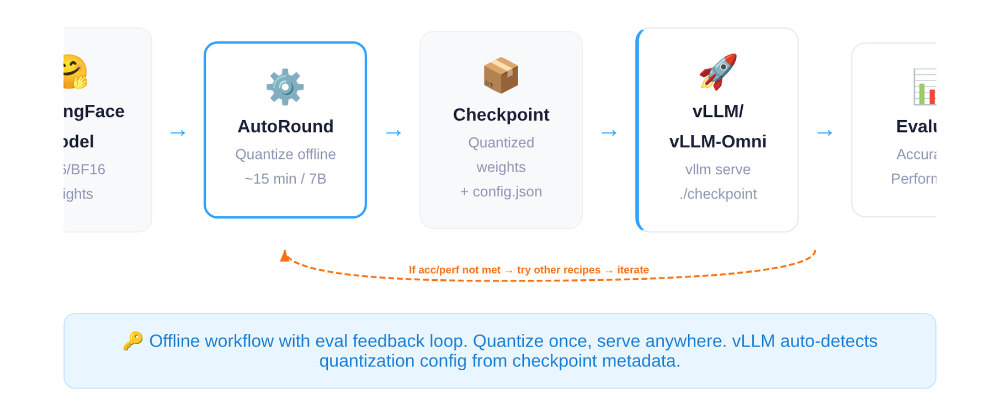
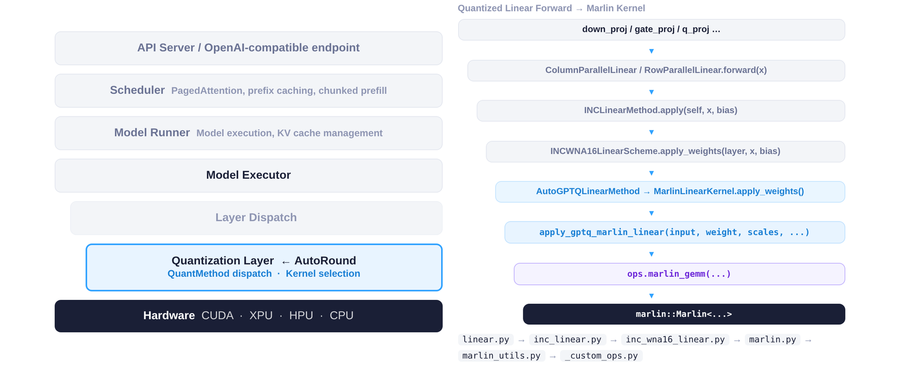
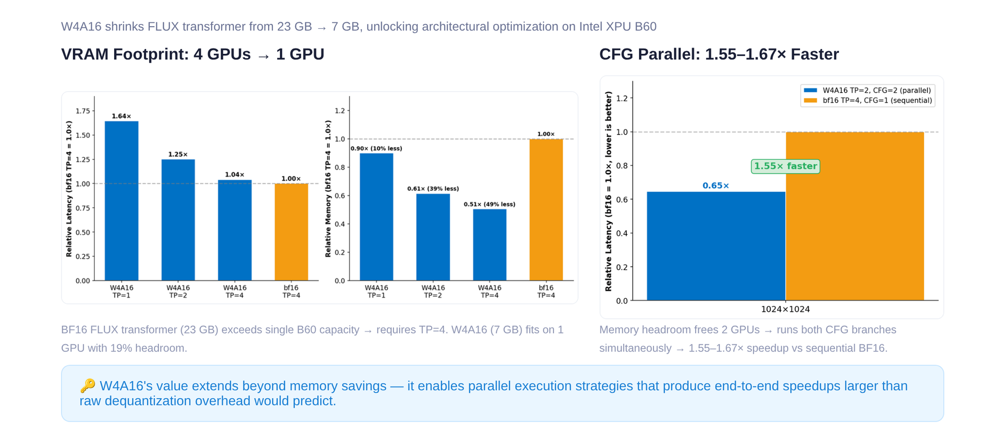
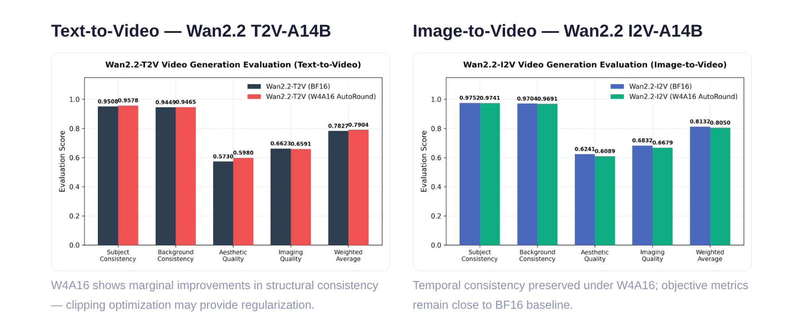
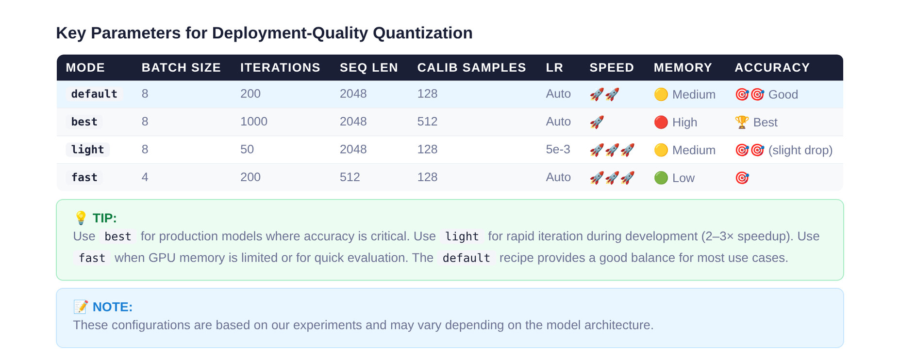

# vLLM 低比特量化实践：AutoRound 核心机制与架构优化

**原视频**：[AutoRound 加速 LLM/VLM 低比特量化部署](https://www.bilibili.com/video/BV1etjE69Efx) · **配套资料**：[配套资料目录](https://drive.google.com/drive/folders/1d0kx6WTJ-KHDMVjCsGvT64H4urwDL7_h)

从截断与舍入的矛盾切入，解析 SignSGD 联合优化与 CFG 并行加速原理。

---

**适读人群**｜熟悉大模型推理部署，希望深入理解量化底层机制与 vLLM 集成原理的后端或 AI 系统工程师。

**前置知识**｜了解浮点数与整数的基本映射关系；熟悉 Transformer 基础结构与显存占用分布；具备深度学习反向传播的基本概念。

**阅读目标**

1. 理解量化过程中舍入误差与截断误差的博弈关系。
2. 掌握 AutoRound 基于 SignSGD 的块级联合优化原理。
3. 明确 QDQ 伪量化在微调阶段与真实 INT4 推理中的差异。
4. 了解显存缩减如何解锁 CFG 并行等架构级加速。

---

## 一、工程矛盾：算力与显存带宽的失衡

**本节要回答的问题：** 在大语言模型（LLM, Large Language Model）和视觉-语言模型（VLM, Vision-Language Model）的推理部署中，真正的瓶颈是什么？低比特量化（Low-bit Quantization）为何不再是可选优化，而是让服务能够运行的物理前提？

### 显存里的零和博弈

GPU 显存是一块固定大小的蛋糕，推理服务需要在两项开销之间分配它：

| 占用项 | 说明 | 与量化的关系 |
|--------|------|-------------|
| **模型权重** | 所有层的参数常驻显存 | 位宽减半 → 占用减半 |
| **KV Cache** | 为每条并发请求缓存注意力的 Key/Value 状态 | 权重越小，剩余空间越大 |

关系直截了当：权重越胖，留给 KV Cache 的空间越少，能同时处理的请求就越少。当权重膨胀到接近显存上限时，甚至连单条请求都无法启动——问题从"跑得慢"升级为"跑不起来"。

### Prefill 与 Decode：两种瓶颈的切换

一次推理请求分为两个阶段，它们面对的硬件瓶颈截然不同：

- **Prefill（预填充）阶段**——一次性处理整段输入 token，矩阵运算密集，属于**计算受限（Compute-bound）**场景，GPU 算力利用率较高。
- **Decode（逐 token 生成）阶段**——每步只产出一个 token，每次读取全部权重却只做少量乘加，属于**显存带宽受限（Memory-bound）**场景，GPU 大量时间花在等待数据搬运上。

当并发请求增多时，Decode 阶段也会逐渐向计算受限方向偏移——带宽和算力同时紧张。

下图从硬件视角展示了位宽与计算效率之间的定量关系，帮助理解"为什么降低位宽能同时缓解算力和带宽两个维度的压力"。

*图注：演讲 PPT 第 7 页。左侧柱状图对比 FP16、FP8、FP4 在 Dense 与 Sparse 执行下的算力增长趋势；右侧两个文本框分别说明模型体积对"能否运行"和 KV Cache 余量的影响，以及 Prefill（Compute-bound）与 Decode（Memory-bound）的瓶颈差异。*

从图中左侧柱状图可以看到：位宽从 FP16 降到 FP8 再到 FP4，可用 FLOPS 呈倍数级上升——同一块 GPU 能在单位时间内完成更多运算。叠加稀疏（Sparse）执行后，提升进一步放大。右侧则提示了两个关键判断维度：模型体积决定"能不能跑"，计算效率决定"跑多快"。

### 一个直觉场景

假设一块 GPU 有 24 GB 显存。某 7B 参数模型以 FP16 存储时权重约占 14 GB，剩余 10 GB 给 KV Cache 和运行时开销。若切换到 4-bit 量化，权重仅占约 3.5 GB，KV Cache 可用空间扩大到 20 GB 以上——并发能力可能提升数倍。与此同时，Decode 阶段每步需要从显存读取的字节数也缩减到原来的四分之一，带宽瓶颈随之缓解。

### 小结

降低位宽同时解决了两个层面的问题：**空间层面**释放显存给 KV Cache 以提升并发；**带宽层面**减少每步数据搬运量以加速 Decode。这是低比特量化从"可选优化"变为"部署刚需"的根本原因。

不过，量化并非无代价。将连续浮点值映射到离散整数级别时，不可避免地引入**舍入误差（Rounding Error）**和**截断误差（Clipping Error）**，两者受共享的缩放因子控制且互相制约。如何在这对矛盾中找到最优平衡点，是接下来需要展开的核心问题。

---

## 二、核心瓶颈：舍入与截断的零和博弈

**本节要回答的问题：** 为什么简单的训练后量化（PTQ, Post-Training Quantization）在极低比特（如 4-bit）下难以维持模型精度？

### 量化的本质：高精度到低精度的有损映射

量化（Quantization）将浮点数映射到更少的离散整数级别，需要两个关键步骤：

1. **缩放（Scaling）**：计算张量最大绝对值与低精度可表示最大值的比值，得到缩放因子 scale。
2. **舍入（Rounding）**：将缩放后的浮点值对齐到最近的整数格点。

两步都会引入误差。问题在于：误差并非一类，而是三类——它们共享同一个控制旋钮，且彼此对抗。

### 三类误差及其博弈

下图将三种误差来源和它们之间的权衡关系直观展示出来，是理解后续优化设计的关键前提。

*图注：三类量化误差示意——离群点放大、舍入误差、截断误差，以及截断阈值控制下的 U 型权衡曲线。来源：演讲 PPT 第 10 页。*

图中包含四个面板，分别对应三种误差和一条博弈曲线：

**面板 ①：离群点放大（Outlier Amplification）。** 柱状图展示了一组权重，绝大多数值集中在 0.1–0.2 附近，但存在一个离群值 8.0。由于 scale 由张量最大值决定，8.0 的存在迫使 scale 极大，小数值在除以 scale 并舍入后全部坍缩为 0，承载的信息直接消失。

**面板 ②：舍入误差（Rounding Error）。** 数轴上，真实值 0.47 落在两个可表示格点 0.4 与 0.5 之间，就近舍入（Round-to-Nearest, RTN）将其对齐到 0.4，产生 0.07 的误差。格点间距越大，舍入误差的期望值越高。

**面板 ③：截断误差（Clipping Error）。** 当主动缩小量化范围以获得更密的格点时，超出范围的值被强制钳位（clamp）。图中 0.95 被截断到 0.6，产生 0.35 的误差。

**底部面板：U 型博弈曲线。** 横轴为截断阈值（clip threshold），纵轴为误差大小：

| 截断阈值 ↑ | 截断误差 | 舍入误差 |
|:-----------:|:--------:|:--------:|
| 增大 | ↓ 更多值落入范围 | ↑ 格点间距变大 |
| 减小 | ↑ 更多值被钳位 | ↓ 格点更密 |

两条误差曲线交叉形成 **U 型谷底**——理论上的最佳折中点。但这个"最佳"仅对单层而言；误差会跨层累积，组合搜索空间随需决策的舍入位数呈指数级膨胀（$2^N$），RTN 对此无能为力。

### 最小例子：4-bit 下的不可调和

假设一个简化的权重向量 `[0.1, 0.2, 0.15, 8.0]`，目标量化为 4-bit 无符号整数（可表示 0–15）。

**策略 A：不截断，保留离群值。** scale = 8.0 / 15 ≈ 0.533。量化后 0.1、0.2、0.15 全部舍入为 0；反量化结果 `[0, 0, 0, 8.0]`——前三个权重的信息完全丢失。

**策略 B：截断离群值至 0.6。** scale = 0.6 / 15 = 0.04。小值有了区分度（反量化结果约为 `[0.12, 0.20, 0.16]`），但 8.0 被 clamp 至 0.6，误差高达 7.4。

两种策略都无法同时保全大小数值。RTN 只能在给定 scale 下做就近舍入，无法在"向上还是向下"这个逐元素决策空间中执行全局搜索。

### 小结

量化误差的根源不在于误差本身的存在，而在于**三类误差共享一个截断阈值作为控制变量，形成了不可同时最小化的零和约束**。在 8-bit 量化时格点足够密，这一矛盾尚可接受；当比特数降至 4-bit 甚至更低时，格点间距急剧增大，离群值与小值之间的博弈变得不可调和。这正是极低比特场景下需要引入**可学习舍入方向与自适应截断范围**的根本原因。

---

## 三、核心设计：基于 SignSGD 的块级联合优化

**本节要回答的问题：** AutoRound（一种训练后量化算法）如何在有限算力预算下，把舍入误差与截断误差纳入同一优化回路？

前一节揭示了矛盾的核心：GPTQ 在单个 Linear 层面补偿舍入误差，AWQ 依据激活分布保护关键权重——两者都只在层级粒度操作，无法同时调节舍入方向与截断范围。AutoRound 的解法是将量化建模为一个**可微的离散优化问题**，在 Transformer Decoder Block 粒度上联合学习最优的舍入偏移和截断边界。

### 优化变量

AutoRound 为每个权重引入一个连续的舍入偏移量 $v$，并把截断边界 $\text{min}$、$\text{max}$ 也作为可学习参数，三者联合调优。下图左侧的表格给出了这三类变量的形状和初始值，右侧展示了块级迭代的算法流程。

*图注：左侧表格列出三类可学习参数（v、min、max）及其形状与初始值；右侧为块级迭代算法流程。来源：演讲 PPT 第 11 页。*

三类参数的含义如下：

| 参数 | 形状 | 控制目标 | 初始值 |
|------|------|----------|--------|
| $v$ | 与权重同形 | 每个元素向上还是向下舍入 | $0$（默认就近舍入） |
| $\text{min}$ | 每组一个标量 | 截断下界 | 校准数据的组内最小值 |
| $\text{max}$ | 每组一个标量 | 截断上界 | 校准数据的组内最大值 |

其中 $v$ 被约束在 $[-0.5,\; 0.5]$ 区间。$v_i > 0$ 时对应权重倾向于向上取整，$v_i < 0$ 时倾向于向下取整。这使得原本不连续的"round-up or round-down"决策变成了连续空间中的搜索。

### 为什么选择块级（Block-wise）优化

AutoRound 不在单个 Linear 层做校准，而是以 **Transformer Decoder Block** 为单位。一个 Block 内包含 Attention 与 MLP 等多个子层，量化误差会在子层之间传播和叠加。块级优化能够让下游子层的误差信号回传到上游权重，从而捕捉层间耦合效应。

与全局优化相比，块级方案的显存占用仅与单个 Block 的参数量成正比。对于拥有数十个 Decoder Block 的大模型，逐块串行处理即可在单卡上完成量化。

### 算法流程

对应图中右侧流程图，每个 Block 的优化步骤为：

1. **Wrap**：将当前 Block 中的 Linear 层替换为 QDQ（Quantize-Dequantize，伪量化）形式，插入 $v$、$\text{min}$、$\text{max}$ 三组可学习参数。
2. **BF16 基准前向**：用原始 BF16 权重对校准数据做一次前向，收集该 Block 的输出作为参考。
3. **QDQ 前向**：用带伪量化的权重再做一次前向，得到量化输出。
4. **Backward**：计算 BF16 参考输出与 QDQ 输出之间的 MSE 损失，回传梯度。
5. **SignSGD 更新**：使用 SignSGD 更新 $v$、$\text{min}$、$\text{max}$。
6. **迭代**：重复步骤 3—5，默认约 200 轮（经验超参）。
7. 当前 Block 优化完毕后，冻结参数，将量化后的输出传递给下一个 Block。

### SignSGD：为什么只用梯度的符号

量化函数本质上是阶梯函数，不可微。实践中使用直通估计器（STE, Straight-Through Estimator）近似梯度，但 STE 梯度的**幅度**噪声很大，其**符号**（正或负）却相对稳定——它已足以指明"当前 $v_i$ 该增大还是减小"。

SignSGD（符号随机梯度下降，Sign Stochastic Gradient Descent）的更新规则为：

$$\Delta w = \alpha \cdot \mathrm{sign}(\nabla_w L)$$

其中 $\alpha$ 为固定学习率，$\nabla_w L$ 为损失对参数的梯度。更新量与梯度幅度无关，每步只做 $\pm\alpha$ 的等幅移动。对于 $v$ 的搜索空间仅有 $[-0.5, 0.5]$，等幅步进天然匹配这一有界离散问题。

### 最小状态演进示例

假设某个权重的浮点值为 $3.3$：

- **默认就近舍入**：$v=0$，量化值为 $3$，舍入误差 $0.3$。
- **经过若干轮 SignSGD**：优化器发现将 $v$ 增大（向上舍入到 $4$）虽然局部误差变为 $0.7$，但整个 Block 输出的 MSE 反而更低——因为下游层对该权重的敏感度较高，$4$ 比 $3$ 的传播误差更小。
- **同时**，$\text{min}$/$\text{max}$ 也在调整，可能适度收窄截断范围以减少异常值对 scale 的拉伸。

三者协同，使 Block 输出的 MSE 在迭代过程中收敛到联合最优点。

### 小结与边界

AutoRound 通过将舍入偏移和截断边界统一为可学习参数，在 Decoder Block 粒度上用 SignSGD 迭代求解，以较低显存和计算代价打破了舍入与截断之间的静态折中。其边界在于：默认 200 轮迭代是经验超参，极低比特（如 2-bit 或 MXFP4）场景下需要 SignRound V2 引入的自适应混合精度与轻量稳定化策略来进一步缩小精度损失（SignRound V2 于 arXiv 2025 发表）。

算法设计在数学上成立后，工程实现中的 QDQ 伪量化机制如何在不引入真实低精度运算开销的前提下完成梯度回传？

---

## 四、数据结构与执行：QDQ 伪量化与真实推理

**本节核心问题：** 同一个量化模型，在离线微调（Tuning）和在线推理（Inference）两个阶段，张量究竟以什么精度参与运算？两条路径为何必须分开设计？

### 两条数据通路的对比

下图将微调阶段与推理阶段的计算流程并排展示，直观揭示了"伪量化"与"真实量化"的本质差异。

*图注：左侧为推理阶段的 Real INT4 Kernel 通路，右侧为微调阶段的 QDQ 伪量化通路。来源：演讲 PPT 第 14 页。*

| 维度 | Real INT4 Kernel（推理） | QDQ / Fake Quantization（微调） |
|------|------------------------|---------------------------------|
| 核心操作 | Kernel 内部融合反量化，直接执行 INT4 GEMM | 先 Quantize 到 INT4，再 Dequantize 回 FP，最后执行 FP GEMM |
| 输出精度 | 低比特结果经融合反量化后回到 FP | 始终保持 FP |
| 是否保留梯度 | 否（纯前向推理） | 是（FP 张量上可回传梯度） |
| 性能目标 | 消除浮点开销，追求吞吐 | 不追求速度，只追求误差模拟的保真度 |

**左侧通路（推理）**：FP 权重在进入 Kernel 前被量化为 INT4，Kernel 内部以整数指令完成矩阵乘，并在写回时完成融合反量化（fused dequantization）。整个过程不产生额外的浮点中间张量。

**右侧通路（微调）**：同样先将 FP 张量 Quantize 到 INT4，但随即执行 Dequantize 把张量"拉回"到 FP 空间，此后参与的仍是标准 FP GEMM。这一"先压后放"的环节就是 **QDQ（Quantize-Dequantize，伪量化）**——它的作用不是加速，而是在 FP 计算图中注入一段"量化噪声"，让后续的 MSE Loss 能感知到低比特带来的精度偏差。

### 微调阶段为何必须走 QDQ

因果链可以用三步描述：

1. **梯度回传需要浮点张量。** 上一节介绍的 SignSGD 优化器需要对 $v$、$\text{min}$、$\text{max}$ 做梯度更新。如果张量已被截断为整数，梯度无法沿计算图回传。
2. **误差模拟需要真实量化函数。** QDQ 中的 Quantize 步骤调用的映射与最终推理 Kernel 一致，因此模拟出的误差是"真实的"。
3. **数据类型解耦带来灵活性。** 当需要支持新的数据类型（如 FP8 或 MXFP4）时，只需实现一个 tensor 级别的 QDQ 函数并注册到 AutoRound，即可评估新 schema 对精度的影响，无需等待对应硬件 Kernel 就绪。

### 配合逐块加载：大模型也能单卡量化

QDQ 通路与 AutoRound 的**逐 Decoder Block 加载**策略天然兼容。量化时主流程将当前 Block 从 CPU DRAM 加载到 GPU VRAM，在该 Block 的每个 Linear 层前后插入 QDQ 节点，迭代优化完毕后 offload 回 DRAM，再加载下一个 Block。由于 QDQ 始终以 FP GEMM 运行，不依赖特定低比特硬件指令，任何支持 FP 运算的 GPU 均可执行。即便面对 600B 参数规模的模型，显存需求也仅等于单个 Block 的大小加上少量激活缓存。

### 最小状态演进

假设某层权重的一个元素原始值为 `w = 0.37`（BF16），scale = 0.05，zero = 8：

| 步骤 | 操作 | 值 |
|------|------|----|
| ① Quantize | 映射到 INT4 范围 [0, 15] | `q = round(0.37/0.05) + 8 = 15`（clamp） |
| ② Dequantize | 反映射回 FP | `w' = (15 − 8) × 0.05 = 0.35` |
| ③ FP GEMM | 用 w' = 0.35 参与矩阵乘 | 引入 Δ = 0.02 的量化误差 |
| ④ Loss & Grad | MSE Loss 感知到 Δ，梯度回传至 scale 参数 | scale 被微调 |

在推理阶段，步骤 ②③ 被融合进 INT4 Kernel，不再产生 FP 中间值。

### 边界与局限

- 对于 **Weight-Only 量化**（如 W4A16），激活侧不做量化，QDQ 仅作用于权重张量。
- QDQ 模拟的精度损失与实际 Kernel 之间可能存在微小数值差异（如舍入模式不同），演讲材料未给出二者的逐层偏差数据。
- 当目标数据类型的硬件 Kernel 尚未就绪时，QDQ 是唯一的精度评估手段；一旦 Kernel 可用，部署阶段应始终切换到 Real Kernel 以获得实际加速。

完成离线量化并导出 Checkpoint 后，接下来需要回答的问题是：这份低比特权重如何被 vLLM 推理框架自动识别并接入底层加速算子？

---

## 五、系统全景：vLLM 架构中的量化拦截与分发

**本节要回答的问题：** AutoRound 产出的 Checkpoint 经过怎样的路径，才能在 vLLM（一个开源 LLM 服务框架）中被自动识别，并最终调用到 Marlin 等高度优化的底层算子？

### 离线量化：从全精度到可部署 Checkpoint

部署起点是一次**离线量化过程**，而非在线推理时的动态转换。下图展示了从全精度权重到在线服务的完整工作流。

*图注：AutoRound 部署工作流——从 HuggingFace 全精度权重到 vLLM 在线服务。来源：演讲 PPT 第 20 页。*

端到端流程中的关键节点：

| 阶段 | 输入 | 产出 | 说明 |
|------|------|------|------|
| 离线量化 | HuggingFace 模型（FP16/BF16） | Checkpoint（量化权重 + `config.json`） | 以 7B 模型为例约需 15 分钟 |
| 加载服务 | Checkpoint 目录 | vLLM / vLLM-Omni 在线引擎 | vLLM 读取 `config.json` 自动识别量化格式 |
| 评估反馈 | 精度与性能指标 | 决策：上线或迭代 | 若指标未达预期，可更换量化方案后重新量化 |

> **注意**：15 分钟的量化耗时特指 7B 规模模型，更大模型耗时会相应增长。

核心产物是一个**设备无关（device-agnostic）的 Checkpoint**。量化后的权重文件可以在 Intel XPU、CUDA GPU、HPU 乃至 CPU 之间共享，只要目标设备上有对应的推理 Kernel 支持即可。

### vLLM 内部：从层分发到量化算子

Checkpoint 被加载后，低比特权重并非简单地以普通 Tensor 参与标准 `forward`。vLLM 在模型初始化阶段依据 `config.json` 中声明的量化元信息，将标准线性层**替换**为专用的量化线性层（Quantization Layer），运行时自动走入优化路径。

下图展示了 vLLM 的架构分层和量化 Linear 的调用栈，帮助理解"层替换"在整个系统中的位置。

*图注：左侧为 vLLM 架构分层，右侧为量化 Linear Forward 到 Marlin Kernel 的调用栈。来源：演讲 PPT 第 8 页。*

**左侧——架构分层（自顶向下）：** API Server 接收请求 → Scheduler 组批调度 → Model Runner 驱动前向计算 → Layer Dispatch 遍历每一层并决定执行路径 → **Quantization Layer（AutoRound）** 在此拦截标准线性运算 → Hardware 执行实际计算。AutoRound 嵌入在 Layer Dispatch 与 Hardware 之间，上层调度无需感知权重是否被量化，实现了**调度与算子的解耦**。

**右侧——调用栈：** 从 PyTorch 层面的线性投影（如 QKV Projection）出发，经过 vLLM 的量化分发逻辑，最终落到 C++ 层的 **Marlin GEMM** 算子——一种针对低比特权重高度优化的矩阵乘 Kernel。Python 层只负责"选择路径"，计算密集部分完全交给 C++ 层完成。

### 最小例子：一次量化推理请求的生命周期

以一个 INT4 量化的 7B 模型为例：

1. **离线**：AutoRound 对 BF16 权重执行量化，`config.json` 标记 `"quant_method": "auto_round"`。
2. **加载**：vLLM 启动时扫描 `config.json`，识别量化方案，将所有适用的 `nn.Linear` 替换为量化线性层。
3. **推理**：请求进入 → Scheduler 组批 → 到达 Attention QKV 投影时，Layer Dispatch 将调用路由到 Quantization Layer → 调用 Marlin Kernel 完成 INT4 × FP16 矩阵乘 → 结果返回上层。
4. **评估**：若精度或吞吐不达预期，回到离线阶段更换配方后重新迭代。

### 小结与边界

vLLM 采用"**元信息驱动的层替换**"策略：离线阶段把量化决策固化进 `config.json`，在线阶段由框架自动完成层替换与 Kernel 分发。需要注意：若 `config.json` 中量化字段缺失或格式异常，vLLM 将回退到标准精度路径；量化层替换发生在模型加载阶段而非运行时，切换方案需要重新加载模型。

系统集成打通后，量化带来的收益不仅是显存的减少——更重要的是，显存缩减可以解锁全新的计算架构优化。

---

## 六、优化原理与性能：显存缩减解锁 CFG 并行

**本节要回答的问题：** 除了"模型变小、能塞进更少的卡"，量化还能如何从架构层面成倍提升推理速度？

### 背景与瓶颈：BF16 下 FLUX 的资源困局

FLUX（一种扩散模型）的 Transformer 部分在 BF16 精度下占用约 **23 GB** 显存。Intel XPU B60 单卡显存为 **24 GB**——即便不加载 VAE、文本编码器等其他组件，单卡也几乎无法放下 Transformer 本身。在不启用 CPU Offloading 的前提下，至少需要 **4 卡张量并行（Tensor Parallel, TP = 4）** 才能启动推理。

4 卡 TP 带来两个代价：一是每次 All-Reduce 引入跨卡通信延迟，Transformer 层数越多通信占比越高；二是每张卡除模型分片外还需维持通信缓冲与中间激活，有效利用率下降。

在扩散模型中，**CFG（Classifier-Free Guidance，无分类器引导）** 需要对同一噪声输入执行有条件分支和无条件分支两次前向计算，再将结果加权合并。BF16 + TP = 4 的配置下，4 张卡的显存已被模型占满，两个 CFG 分支只能**串行执行**，延迟直接翻倍。

### 核心转折：W4A16 把 23 GB 压到 7 GB

对 FLUX Transformer 施加 W4A16（权重 4-bit、激活 16-bit）AutoRound 量化后，权重显存从 23 GB 降至约 **7 GB**，与 4-bit / 16-bit ≈ 1/4 的理论值大致吻合（额外开销来自 Scale、Zero-Point 等元数据）。7 GB 的模型可以放入单张 24 GB B60 卡中，**TP = 1 即可运行**。若机器配备 4 张卡，则每张卡都拥有约 17 GB 空闲显存，为并行策略提供了空间。

### 架构级加速：CFG 并行

**CFG Parallel（CFG 并行）** 的思路是：既然显存足够，就把有条件分支和无条件分支分别放到不同的卡上同时执行。以 TP = 2、CFG = 2 为例：

1. **卡 0 + 卡 1** 以 TP = 2 计算有条件分支；
2. **卡 2 + 卡 3** 同一时刻以 TP = 2 计算无条件分支；
3. 两个分支完成后合并引导结果，进入下一去噪步。

对比 BF16 TP = 4、CFG = 1 的串行路径——4 张卡先算分支 A 再算分支 B——CFG 并行将两次串行前向折叠为一次并行前向。

### 实测数据

下图展示了不同配置下的显存与延迟对比，是量化工程价值的关键证据。

*图注：演讲 PPT 第 25 页。左侧柱状图展示 W4A16 在不同 TP 配置下相对于 BF16 TP = 4 的显存与延迟比；右侧展示 CFG 并行在 1024×1024 分辨率下的加速倍率。*

图中关键数据：

| 配置 | 相对显存 | 相对延迟 | 说明 |
|------|---------|---------|------|
| BF16, TP = 4, CFG = 1 | 1.00×（基线） | 1.00×（基线） | 4 卡串行 CFG |
| W4A16, TP = 1 | 约 0.51× | — | 单卡可运行 |
| W4A16, TP = 2, CFG = 2 | — | 约 0.61×–0.65× | 两分支并行 |

在 **1024×1024 分辨率、Intel XPU B60 硬件**条件下，W4A16 TP = 2 + CFG Parallel 相对于 BF16 TP = 4 串行 CFG，实现了 **1.55–1.67× 的端到端加速**。加速来源可拆解为两部分：TP 从 4 降至 2 减少了通信开销；两个 CFG 分支并行执行使去噪循环的前向延迟近似减半。

### 边界条件

1. 上述数字严格对应 Intel XPU B60（24 GB 显存），不同显存容量和互联带宽的硬件上收益会有差异。
2. 仅展示了 1024×1024 分辨率的结果，更高分辨率下激活显存增大，并行余量减少，加速比可能回落。
3. CFG 并行仅适用于需要多分支引导的扩散模型推理场景，不能直接迁移至自回归 LLM 的 Decode 阶段。
4. 整条链路成立的前提是 W4A16 量化后的生成质量可接受——这正是下一节要检验的内容。

---

## 七、边界情形：视频生成模型的一致性表现

**本节要回答的问题：** 将扩散模型权重从 BF16 压缩到 4-bit（W4A16），生成视频的时空一致性是否会出现可感知的退化？

这一问题之所以关键，在于视频帧间的主体一致性和背景一致性对量化噪声极为敏感——细微的权重偏移可能在时间轴上被逐帧累积放大，最终导致闪烁、形变甚至结构崩坏。

### 客观指标对比

下图对比了 Wan2.2 系列模型在 T2V（Text-to-Video）和 I2V（Image-to-Video）两个任务上的多维度评估得分，用于判断量化是否造成了结构性退化。

*图注：Wan2.2 T2V-A14B 与 I2V-A14B 在 BF16 / W4A16 两种精度下的五项客观指标对比。来源：演讲 PPT 第 24 页。*

关键数值整理如下（加粗项表示量化后得分高于 BF16 基线）：

| 维度 | T2V BF16 | T2V W4A16 | I2V BF16 | I2V W4A16 |
|------|----------|-----------|----------|-----------|
| Subject Consistency | 0.9508 | **0.9578** | 0.9752 | 0.9741 |
| Background Consistency | 0.9449 | **0.9465** | 0.9704 | 0.9691 |
| Aesthetic Quality | 0.5730 | **0.5980** | 0.6241 | 0.6089 |
| Imaging Quality | 0.6623 | 0.6591 | 0.6832 | 0.6679 |
| Weighted Average | 0.7827 | **0.7904** | 0.8132 | 0.8050 |

**T2V 场景**：W4A16 的 Subject Consistency 从 0.9508 上升至 0.9578，Background Consistency 同样有约 0.002 的正向偏移。加权平均从 0.7827 升至 0.7904，量化版本整体略优。唯一轻微下降的维度是 Imaging Quality（0.6623→0.6591），绝对差值仅 0.003。

**I2V 场景**：所有五项指标的 W4A16 得分均略低于 BF16 基线，但下降幅度极小——最大差距出现在 Aesthetic Quality 上，约 0.015。时间一致性相关的两项核心指标降幅均不超过 0.002，说明 4-bit 量化并未在时间轴上引入可累积的退化。

### 为什么量化没有导致画面崩坏

AutoRound 的截断优化在校准阶段联合调整每组权重的截断边界与舍入策略：截断边界收窄使量化区间更紧凑，有效抑制离群值对重建误差的贡献；舍入方向联合优化使每层输出分布与 BF16 基线的逐块误差被最小化。两者叠加后，决定主体轮廓和背景结构的关键特征通道的分布得以保留。

对于 T2V 中出现的微幅提升，一个合理推断是：截断优化在收窄权重范围时客观上起到了类似正则化（Regularization）的作用，削弱了极端权重值对生成帧的干扰。需要强调，这种提升幅度很小，演讲材料将其定性为边缘（marginal）改善，不能作为量化优于全精度的一般性结论。

### 边界条件

演讲材料未给出所用评估数据集的具体规模与采样策略，也未提供更低比特（如 W2 或 W3）下的对应数据。上述结论目前仅适用于 W4A16 精度与 Wan2.2-A14B 规模模型；更小模型或更低比特设定下的表现仍待验证。

---

## 八、局限与实践：硬件原生支持与配置权衡

**本节要回答的问题：** 在实际部署中，量化模型无法获得预期加速的最常见原因是什么？

答案可以归结为两点：底层硬件缺少对目标低比特数据类型的原生 Kernel 支持；量化配方的参数选择与业务场景不匹配。

### 第一道关卡：硬件支持什么

在选择量化方案之前，首先需要确认的不是"哪个精度最低"，而是"目标 GPU 原生支持哪些低比特类型"。如果硬件没有成熟的 Kernel 实现，量化的理论收益只停留在纸面。

以 Intel 当前及规划中的硬件为例：

| 硬件产品 | 原生支持的低比特类型 | 可用时间 |
|---|---|---|
| Intel Arc GPU B60 / B70 | INT8（含 INT4 推理路径） | 已发布 |
| Intel Gaudi | FP8 | 已发布 |
| CRI GPU（下一代） | MXFP4 / MXFP8 | 2026 下半年 |

> **MXFP4**（Microscaling 4-bit Floating Point）是一种微缩放 4 位浮点格式，需要硬件层面的专用矩阵运算单元才能获得吞吐收益。

因果链很清晰：用户将模型量化到 W4 并部署，若 GPU 无 INT4 原生指令，Kernel 会先将 INT4 反量化到 FP16/BF16 再执行通用 GEMM——反量化本身消耗算力与带宽，抵消了低比特存储节省带来的收益，最终体现为"显存省了，速度没变甚至更慢"。

上一节中 FLUX 模型在 B60 上获得 1.55–1.67× 加速，正是因为 B60 原生支持 INT8/INT4 路径。反过来，如果将 MXFP4 量化模型部署到尚不支持该格式的现有硬件上，就不会观察到类似收益。

### 第二道关卡：量化配方的参数权衡

确认硬件可行后，需要根据业务优先级选择量化方案与超参数。AutoRound 提供了四种预设模式，下图列出了它们的参数差异与适用场景。

*图注：AutoRound 提供的 default、best、light、fast 四种预设模式参数对比。来源：演讲 PPT 第 28 页。*

核心参数差异如下：

| 模式 | Batch Size | Iterations | Seq Len | Calib Samples | 适用场景 |
|---|---|---|---|---|---|
| **default** | 8 | 200 | 2048 | 128 | 多数场景的平衡选择 |
| **best** | 8 | 1000 | 2048 | 128 | 生产级精度要求，耗时约为 default 的 2–3 倍 |
| **light** | 8 | 50 | 512 | 128 | 快速验证与开发阶段 |
| **fast** | 4 | 200 | 2048 | 128 | 显存受限环境，牺牲少量精度换取更低峰值占用 |

关键变量的影响方向：

- **Iterations（迭代次数）**：直接决定 SignSGD 优化轮数，`best` 模式提升到 1000 以换取更高精度，校准时间线性增长。
- **Seq Len（序列长度）**：影响校准数据覆盖的上下文范围，从 512 提升到 2048 可改善长文本场景的量化质量，但显存占用相应增加。
- **Batch Size**：`fast` 模式将其从 8 降到 4，峰值显存更低，适合消费级 GPU。
- **学习率**：各模式均默认 5e-3，演讲材料未给出不同学习率的消融实验数据。

**方案选择的一般原则：** 显存优先（边缘部署、大模型上小卡）选 W4A16 等低比特组合；精度优先（生产环境、质量敏感）选 W4A16 搭配较小的 group_size 或 W8A8/FP8；长上下文或视觉语言模型场景可在权重量化基础上叠加 KV Cache 量化。

---

## 结论与局限

1. **量化并非简单的数值压缩，而是舍入、截断与离群点放大三类误差的联合博弈。** 三者共享截断阈值这一控制变量，形成了不可同时最小化的 U 型约束。

2. **AutoRound 将量化建模为可微优化问题。** 通过在 Transformer Decoder Block 粒度上使用 SignSGD 联合学习舍入偏移 $v$ 和截断边界 $\text{min}$/$\text{max}$，在有限算力下打破了传统 PTQ 的静态折中。

3. **QDQ 伪量化是连接算法探索与硬件执行的桥梁。** 微调阶段用 QDQ 模拟误差并保持梯度回传，推理阶段则切换到真实 INT4 Kernel 以消除浮点开销。两条通路的分离使得大模型（如 600B 参数规模）也能在单卡有限显存下逐块完成量化。

4. **量化的工程价值不仅在于减少显存占用。** 以 FLUX 为例，W4A16 将 Transformer 显存从 23 GB 压缩至 7 GB 后，释放的显存被重新投入 CFG 并行，在 Intel XPU B60、1024×1024 分辨率条件下实现了 1.55–1.67× 的端到端加速。

5. **极低比特量化并未破坏视频生成模型的时空一致性。** Wan2.2 的 T2V/I2V 任务中，W4A16 的结构一致性指标与 BF16 基线差异不超过 0.002，T2V 甚至出现了边缘的正向偏移。

6. **最终的推理加速严格依赖于硬件原生数据类型的支持与高度优化的底层 Kernel。** 缺乏对应 Kernel 的硬件上，量化只能节省存储而无法提升吞吐。

7. **尚存的局限：**
   - 性能数字（如 1.55–1.67× 加速、15 分钟量化耗时）高度依赖特定硬件与配置，不可直接泛化。
   - MXFP4/MXFP8 的原生硬件支持（CRI GPU）预计 2026 下半年才能落地，在此之前 INT8 与 FP8 仍是 Intel 硬件上最稳妥的低比特选项。
   - 演讲材料未提供 2-bit 及以下极低比特的系统性精度评估数据，AutoRound 在该区间的表现仍待 SignRound V2 的后续验证。
