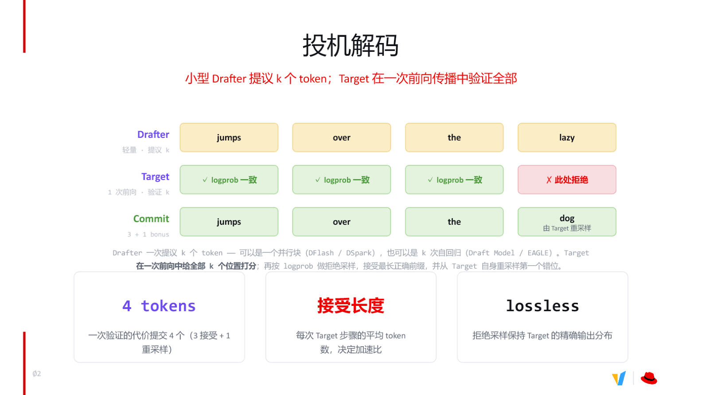
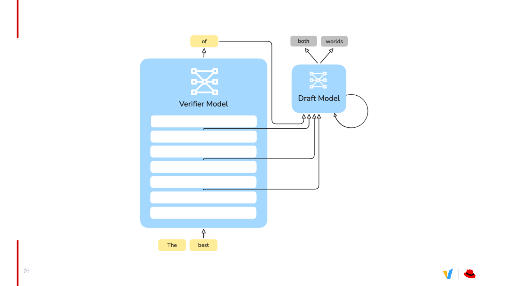
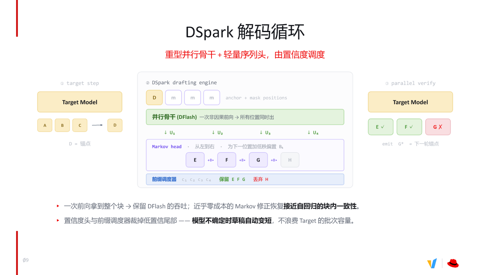
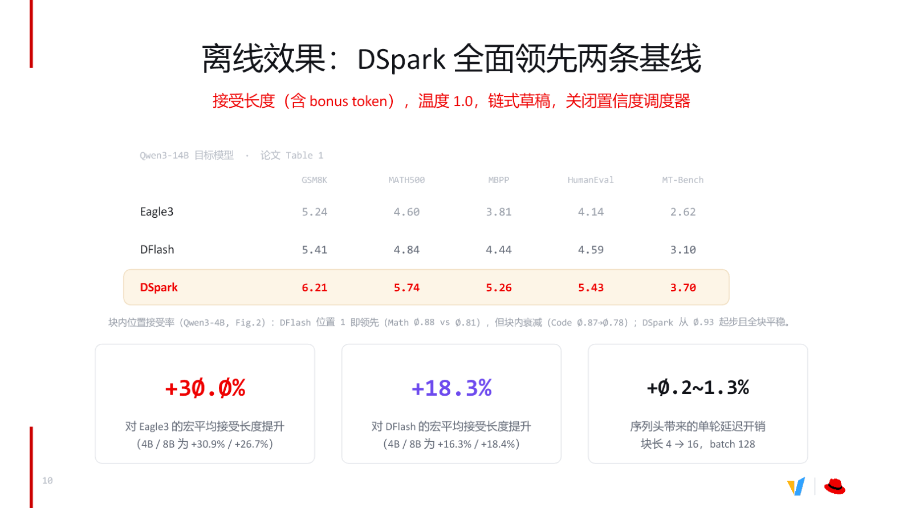
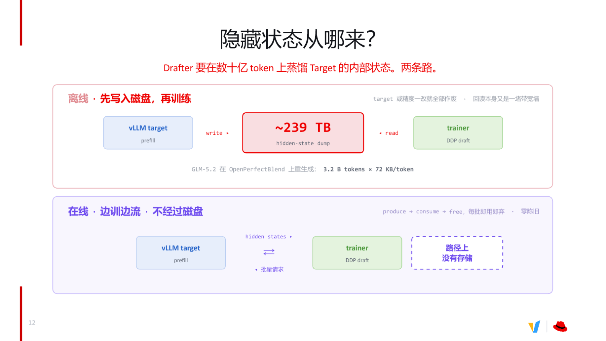
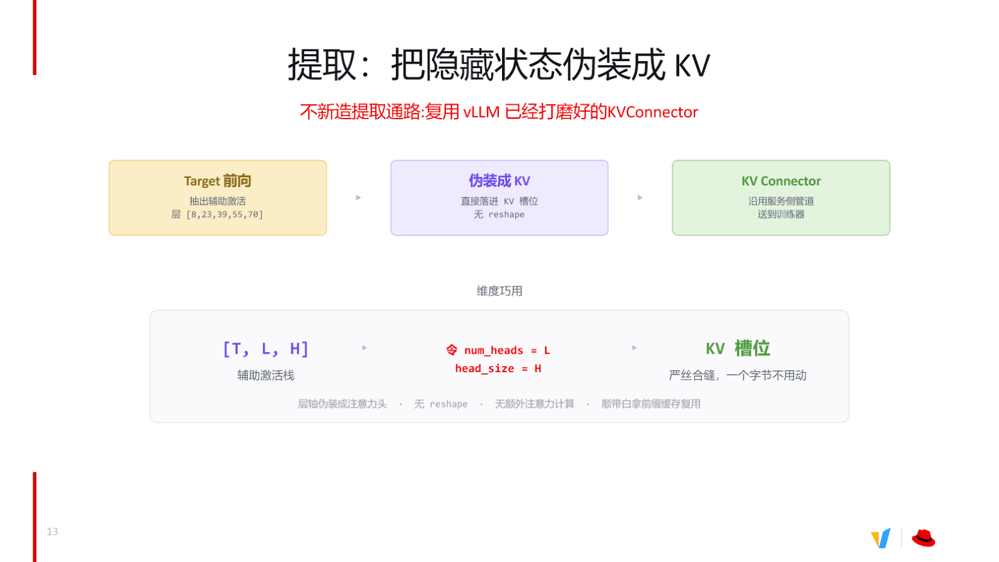
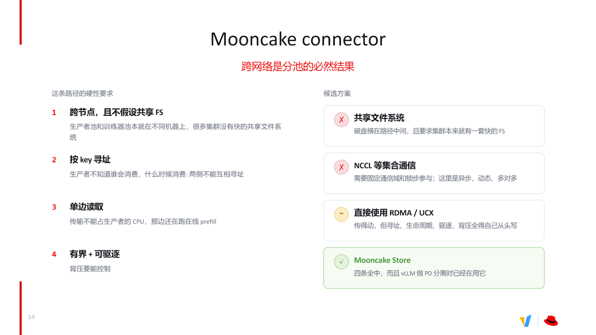
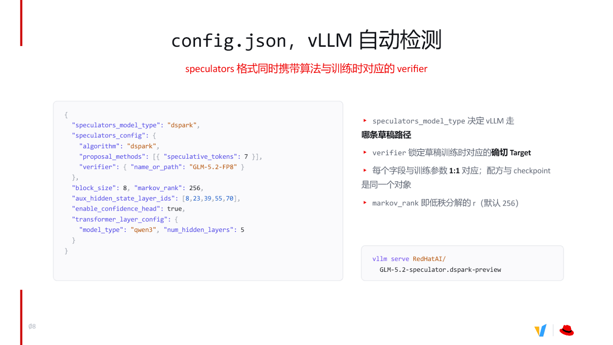

# 大模型推理加速：从隐藏状态提取到 DSpark 投机解码的工程实践

大模型自回归生成的核心瓶颈众所周知——每步只产出一个 token，每步都要把全部参数从显存搬到计算单元，GPU 算力大量闲置。投机解码（Speculative Decoding）通过"小模型猜、大模型验"的范式打破了这一局面，但草稿质量不够高、隐藏状态获取成本过大、集群部署链路不通等工程矛盾，使得真正落地远比算法论文描述的复杂。

本文围绕 Speculators 库与 DSpark 算法，拆解从 Drafter 训练到 vLLM 原生部署的端到端链路：算法层面，DSpark 如何用 Markov Head 以不到 1.3% 的延迟代价换回 18–30% 的接受长度增益；工程层面，在线隐藏状态提取如何复用 KVConnector 管道、Mooncake Store 如何补齐跨节点传输的最后一环。

**适读人群：** 熟悉大模型推理基础，希望深入了解投机解码底层机制与工程优化的后端或 AI 系统工程师。

**前置知识：**

- 了解大模型自回归生成的基本原理
- 熟悉 vLLM 等推理引擎的基本概念
- 对投机解码有初步认知

**阅读目标：**

1. 理解接受长度对投机解码加速比的决定性作用
2. 掌握 DSpark 通过 Markov Head 修正并行生成的原理
3. 了解在线隐藏状态提取复用 KVConnector 的工程巧思
4. 认识 Mooncake Store 在跨节点数据传输中的关键作用

---

## 一、投机解码的工程价值与核心矛盾

### 一次前向产出多个 token

投机解码的核心思路可以拆为三步：

| 阶段 | 角色 | 做什么 | 关键性质 |
|------|------|--------|----------|
| **提议** | 轻量 Drafter（草稿模型） | 快速生成 $k$ 个候选 token | 可自回归（如 EAGLE-3），也可并行（如 DFlash / DSpark） |
| **验证** | Target（目标大模型） | 一次前向传播同时对 $k$ 个位置打分 | 仅需 1 次完整前向，开销约等于生成 1 个 token |
| **提交** | 拒绝采样（Rejection Sampling） | 接受最长正确前缀，并由 Target 重采样第一个不一致位置 | **无损**——Target 的输出分布与不使用投机解码时完全相同 |

"无损"是投机解码区别于量化、剪枝等传统加速手段的根本优势：它不改变大模型的输出质量，纯粹通过减少前向传播次数来换取速度。

### 图解：一次验证提交多个 token

下图展示了投机解码中"提议-验证-提交"的完整过程，帮助理解每个阶段的数据流和判定逻辑。


*图注：投机解码提议-验证-提交流程。来源：演讲 PPT 第 3 页*

逐项拆解图中的关键元素：

1. **Drafter 提议 4 个 token**：草稿模型一次给出候选序列 `jumps over the lazy`。
2. **Target 一次前向验证**：大模型接收全部 4 个候选，在同一次前向传播中分别计算各位置的 log probability。
3. **前 3 个通过**：对于 `jumps`、`over`、`the` 三个位置，Target 的置信度不低于 Drafter 的置信度，通过拒绝采样予以接受。
4. **第 4 个被拒绝**：`lazy` 在 Target 看来 log probability 不够高，被拒绝。
5. **重采样获得 bonus token**：Target 在被拒绝的位置依据自身分布重新采样，产出 `dog`。这个 token 来自 Target 本轮前向已经计算好的 logit，无需额外开销。
6. **最终提交 4 个 token**：3 个接受 + 1 个重采样 = 一次 Target 步骤净增 4 个 token。

### 接受长度：加速比的第一决定因素

整条因果链可以浓缩为：

```
Drafter 快速提议 k 个 token
  → Target 一次前向传播验证全部 k 个位置
    → 验证成本 ≈ 单步生成 1 个 token 的成本
      → 净产出 = 接受长度 α（平均接受的前缀长度 + 1 bonus）
        → 等效吞吐提升 ≈ α 倍
```

这里的关键变量是**接受长度**（Acceptance Length）——每次 Target 步骤平均产出的 token 数。如果 Drafter 猜得不准，频繁被拒绝，接受长度趋近于 1，投机解码就退化为普通自回归生成，反而因为额外运行 Drafter 而浪费算力。

以一个最小例子说明：假设输入上下文为 `The`，Drafter 提议 3 个 token：

| 步骤 | Drafter 提议 | Target 判定 | 结果 |
|------|-------------|-------------|------|
| 位置 1 | `lazy` | ✓ 接受 | 保留 |
| 位置 2 | `dog` | ✓ 接受 | 保留 |
| 位置 3 | `runs` | ✗ 拒绝 | Target 重采样 → `sat` |

一次 Target 前向传播净产出 3 个 token（`lazy dog sat`），等效加速约 3 倍。

### 加速边界

据演讲中分享的工程实测经验，在 vLLM（一个开源的大模型推理和服务引擎）上通常观测到的端到端加速比在 **3–5 倍**左右，具体取决于算法与负载。但投机解码存在一个硬性边界：

> **当推理引擎处于 compute bound（计算瓶颈）状态时，投机解码无法带来收益，反而消耗额外算力。**

原因很直接：投机解码的本质是"用多余算力换取更少的显存搬运次数"。一旦请求并发量很高、GPU 算力已经饱和，就没有多余算力可用。此时建议动态关闭投机解码，将全部计算资源留给 Target 本身。

**小结：** 投机解码以无损方式将每步单 token 的瓶颈拓宽为每步多 token，其加速效果取决于接受长度。接下来的核心问题是：如何训练出更准的 Drafter，以推高接受长度？

---

## 二、现代 Drafter 的进化：从文本到隐藏状态

### 早期方案为何接受率有限

早期投机解码的思路很朴素：拿同系列的小参数模型做草稿——两者都接收相同的自然语言文本，小模型先猜，大模型后验。但小模型和大模型虽然读到同样的 prompt，内部的"理解深度"天差地别。小模型用有限参数猜测下一个词，而大模型的预测来自数十层 Transformer 逐层蒸馏出的丰富语义。纯文本输入下，两者的输出分布偏差难以弥合，**接受率**（Acceptance Rate，每个位置被确认的概率）始终上不去，接受长度也随之受限。

### 关键转折：让 Drafter 窥探 Target 的中间表示

突破始于一个核心洞察——与其让 Drafter 从原始文本重新"理解"一遍 prompt，不如直接把 Target 模型在 prefill 阶段产生的中间结果喂给它。

这里需要定义一个关键概念：**隐藏状态（Hidden States）**，即 Transformer 各层的中间激活值。Target 模型每处理一个 token 序列，都会在每层输出一组向量，这些向量编码了该层对输入文本的语义理解——越深的层抽象程度越高。将若干层隐藏状态抽取出来作为 Drafter 的输入，等于让小模型直接站在大模型的语义基础上做预测，而非从零开始推断。

### 架构：Verifier 与 Draft 模型如何协作

下图展示了 Target（图中标为 Verifier）如何将多层激活传递给 Draft 模型，是理解后续各节的架构基础。


*图注：左侧为 Verifier（Target）模型，右侧为 Draft 模型；箭头表示隐藏状态的传递路径。来源：演讲 PPT 第 4 页*

图中包含两个核心组件和一条关键数据通路：

| 组件 | 角色 | 特征 |
|---|---|---|
| **Verifier Model**（左侧） | 接收原始 token，执行完整前向传播，输出预测并验证草稿 | 层数多、参数量大 |
| **Draft Model**（右侧） | 接收隐藏状态，快速生成多个候选 token | 层数少（3–5 层），推理极快 |

数据流依次为：① Verifier 接收输入 token；② 从 Verifier 的多个层级抽取隐藏状态，传入 Draft 模型；③ Draft 模型据此输出候选 token；④ Verifier 自身也生成预测，与草稿逐 token 比对验证。

用两条路径对比能最清晰地看出差异：

- **纯文本路径**：相同 prompt → 小模型独立理解 → 缺少大模型的中间推理线索 → 输出分布偏差大 → 接受率低
- **隐藏状态路径**：Target prefill 产生多层激活 → Drafter 获得中间语义表示 → 输出分布贴近 Target → 接受率提升 → 接受长度增长

### 不同算法的层数策略

| 算法 | 提取层数 | 说明 |
|---|---|---|
| EAGLE-3（一种经典自回归投机解码算法） | 1 层 | 结构最简，开销最低 |
| DFlash / DSpark | 3–5 层 | 多层融合，语义信息更丰富 |

层数增加带来更丰富的 Target 内部信息，但也意味着更大的激活传输和存储成本。3–5 层是当前高性能 Drafter 的常见选择，在信息量与工程开销间取得了实用平衡。

**小结：** 从自然语言输入切换到隐藏状态输入，是投机解码从"文本级模仿"走向"表示级学习"的分水岭。在此基础上，DSpark 围绕"如何利用这些隐藏状态做更高效的并行草稿"展开了更精细的架构设计。

---

## 三、DSpark 算法：并行骨干与 Markov 修正

### 并行生成为何会"胡言乱语"

自回归生成的核心保障是：每个 token 都能看到它左侧已经确定的所有 token。一旦改为并行生成——一次前向同时产出多个位置——各位置之间互相不知道对方的预测结果，token 间的条件依赖就断裂了。

以一个最小例子说明：用户说 "thank you"，合理回复既包含 "no problem"，也包含 "of course"。自回归模型若在第一个位置输出了 "of"，第二个位置必然选 "course"；但并行生成时，第一位置选了 "of"，第二位置却独立选出 "problem"，拼成 "of problem"——输出退化为无意义组合。这正是 DFlash（一种基于非因果 mask token 的并行投机解码算法）面临的核心瓶颈。

**DSpark**（一种投机解码算法，结合 DFlash 式并行骨干和 Markov Head 建模块内依赖）的设计目标就是：**保留 DFlash 的并行吞吐，同时以极低代价恢复块内一致性**。

### DSpark 解码循环全景

下图是 DSpark 每一轮解码的三阶段全貌，展示了并行骨干、Markov 修正和置信度调度如何协同工作。


*图注：DSpark 三阶段解码循环。来源：演讲 PPT 第 10 页*

#### ① Target Step：确定锚点

Target 模型执行一次自回归前向，输出已接受序列末尾的下一个 token，记为 **D**。D 即本轮草稿的**锚点（anchor）**——后续并行位置的左边界条件。

#### ② DSpark Drafting Engine：并行骨干 + Markov 修正 + 前缀调度

这一步是 DSpark 的核心，内部分三层：

| 层 | 组件 | 输入 | 输出 | 开销 |
|---|------|------|------|------|
| 1 | 并行骨干（DFlash） | 锚点 D + mask positions | 所有位置的 logits U₁–U₄ | 一次非因果前向 |
| 2 | **Markov Head** | U₁–U₄ | 修正后的 token 序列 E, F, G, H | 低秩偏置，近乎零成本 |
| 3 | 前缀调度器 | 置信度 c₁–c₄ | 保留高置信前缀；丢弃低置信尾部 | 仅比较阈值 |

**并行骨干**：锚点 D 与若干 mask 位置一起送入 DFlash，执行一次非因果前向，同时得到 U₁–U₄ 四个位置的 logits，吞吐与原始 DFlash 完全相同。

**Markov Head**（用于修正并行生成 token 依赖关系的轻量序列头）：对 U₁–U₄ 从左到右依次施加**低秩偏置（low-rank bias）**。具体地，位置 k+1 的 logits 会叠加一个由位置 k 的已选 token 决定的偏置项——E 修正后得到 F，F 修正后得到 G，以此类推。Markov Head 本质上是一个轻量的亲和矩阵，学习 token 到 token 的接续概率，因为偏置矩阵是低秩的，附加延迟极小。

**前缀调度器（Prefix Scheduler）**：每个位置同时输出一个置信度分数。调度器从左到右扫描，一旦置信度低于阈值，就将该位置及其右侧全部截断。这使得**模型不确定时草稿自动缩短**，避免将低质量 token 送入 Target 浪费批次容量。

#### ③ Parallel Verify：验证与发射

Target 模型对保留的草稿 token 执行一次并行验证。被接受的直接采纳；第一个被拒绝的位置由 Target 重采样，产出修正 token 作为下一轮锚点，循环重新开始。

### 因果链

```
纯并行生成 → token 间依赖断裂 → 输出一致性下降
  → 引入 Markov Head（低秩偏置，从左到右逐位修正）
    → 恢复块内条件依赖 → 接受率回升
      → 叠加置信度头 → 前缀调度器截断低置信尾部
        → 草稿长度自适应 → Target 验证开销进一步降低
```

### 边界与现状

Markov Head 与置信度头是两个独立机制，可以单独启用或组合使用。目前在 Speculators（一个覆盖训练、转换到 vLLM 部署的投机解码库）训练侧二者均已支持；但在 vLLM 推理端，**置信度头的推理支持尚未完全就绪**，相关工作仍在进行中。因此，当前线上部署主要依赖 Markov Head 修正来提升接受率，置信度调度的实际收益还有待工程侧的进一步验证。

---

## 四、DSpark 性能验证与边界条件

### 离线评测设置

为了公平比较 EAGLE-3（自回归草稿）、DFlash（非因果并行草稿）和 DSpark（并行骨干 + Markov Head）三种策略，评测在以下受控条件下进行：

| 维度 | 取值 |
|------|------|
| 目标模型 | Qwen3-14B |
| 采样温度 | 1.0 |
| 草稿模式 | 链式草稿（chained drafting） |
| 置信度调度器 | 关闭 |
| 块长范围 | 4 → 16 |
| 批大小 | 128 |

温度设为 1.0 意味着采样随机性最大，对草稿模型的预测精度要求更高；关闭置信度调度器则排除了自适应裁剪对结果的干扰，使对比更纯粹地反映草稿质量本身。

### 基准数据一览

下图展示了三种算法在五个代表性任务上的接受长度对比，是判断 Markov Head 实际收益的核心证据。


*图注：离线效果对比——DSpark 在所有基准上全面领先两条基线。来源：演讲 PPT 第 11 页*

指标是**接受长度（含 bonus token）**，即目标模型一次验证后实际采纳的 token 数，数值越大说明草稿越准、加速越明显：

| 数据集 | EAGLE-3 | DFlash | DSpark | DSpark 领先 DFlash |
|--------|---------|--------|--------|-------------------|
| GSM8K | 5.24 | 5.41 | **6.21** | +14.8% |
| MATH500 | 4.60 | 4.84 | **5.74** | +18.6% |
| MBPP | 3.81 | 4.44 | **5.26** | +18.5% |
| HumanEval | 4.14 | 4.59 | **5.43** | +18.3% |
| MT-Bench | 2.62 | 3.10 | **3.70** | +19.4% |

表格下方的宏平均汇总：

- **+30.0%** ——DSpark 相对 EAGLE-3 的宏平均接受长度提升
- **+18.3%** ——DSpark 相对 DFlash 的宏平均提升
- **+0.2\~1.3%** ——Markov Head 引入的单轮延迟开销，块长从 4 增至 16 时逐渐增大，但始终不超过 1.3%

### 为什么 Markov Head 如此高效

1. **块内依赖缺失 → DFlash 精度衰减。** DFlash 采用非因果 mask 并行生成一整块 token，块内位置之间彼此看不到。块内位置接受率数据显示，DFlash 在数学任务上从首位约 0.88 衰减到块尾约 0.78。
2. **Markov Head 注入低秩偏置 → 块内精度恢复。** 从左到右为每个下一位置叠加低秩偏置，修正并行带来的独立性假设误差。同一指标下，DSpark 从约 0.93 起步且全块保持平稳。
3. **位置接受率提升 → 接受长度增加。** 接受长度本质上由各位置接受率的乘积决定：每个位置多几个百分点，最终可累积出 18–30% 的增长。
4. **低秩结构 → 极低延迟开销。** 序列头参数量远小于并行骨干，额外计算仅占单轮推理时间的 0.2–1.3%。付出不到 1.3% 的时间代价，换回 18–30% 的有效 token 增益。

### 待验证与适用边界

- **温度敏感性：** 上述结果均在温度 1.0 下取得。低温时草稿命中率通常更高，DSpark 的相对优势幅度可能变化，但演讲材料未给出低温对比数据。
- **在线端到端延迟：** 此处评测聚焦"接受长度"这一离线指标。实际部署的端到端加速比还受调度器效率、KV 缓存管理等因素影响，需要在线环境另行验证。
- **置信度调度器的叠加效果：** 本表关闭了该调度器，数据仅体现 Markov Head 本身的贡献。

**小结：** 在受控离线条件下，DSpark 以不超过 1.3% 的延迟代价实现了对两条基线的全面领先。然而，训练这样一个高精度 Drafter，首先需要大规模、高质量的隐藏状态数据——这正是工程落地中最大的瓶颈所在。

---

## 五、训练数据瓶颈：离线落盘的带宽墙

### 两条路径的全景对比

Drafter 的知识蒸馏建立在 Target 模型的中间层激活之上，数据规模往往达到数十亿 token。获取这些隐藏状态存在截然不同的两条工程路径。下图给出了离线落盘与在线流式的完整对比，是理解后续两节工程设计的出发点。


*图注：离线路径需经磁盘中转，在线路径直接 produce → consume → free，路径上没有持久存储。来源：演讲 PPT 第 13 页*

图中上半部分展示了离线路径：vLLM Target 执行 prefill 后，将隐藏状态 **write** 到磁盘，形成巨量的 hidden-state dump 文件；训练器再从磁盘 **read** 回这些数据。下半部分是在线路径：vLLM Target 产出的隐藏状态直接以流式方式送达训练器，用完即弃，路径上不存在任何持久化存储节点。

### 离线路径的三重致命瓶颈

| 环节 | 瓶颈描述 | 后果 |
|------|---------|------|
| **写入** | 每个 token 的多层隐藏状态体积巨大，写入磁盘带宽被打满 | 落盘耗时从数小时膨胀到数天 |
| **回读** | 训练时需从磁盘反复读回，磁盘 I/O 远低于显存带宽 | 训练 GPU 长时间空等，利用率骤降 |
| **陈旧** | 落盘数据严格绑定当次 Target 模型权重与精度配置 | 模型或量化方案一旦变更，全部数据作废 |

用一个具体数据锚点来感受规模：以 GLM-5.2 在 OpenPerfectBlend 数据集上重生成为例，累计产出**约 239 TB** 的 dump 文件。这在绝大多数生产环境中都不现实。

更致命的是陈旧问题：假设团队花费数天完成落盘，此时业务侧对 Target 模型做了一次参数微调或量化精度调整，由于隐藏状态与 Target 权重严格耦合，**先前所有落盘数据瞬间失去价值**，必须从零重跑整个提取流程。

### 在线流式的破局思路

在线路径的核心设计极其简洁：训练器向 vLLM Target 发起批量请求，Target 在 prefill 阶段产出隐藏状态后，激活数据被直接消费、随即释放，**每批即用即弃**。离线方案的三重瓶颈被同时消除——无需海量存储、无磁盘回读延迟、激活始终来自当前版本的 Target 模型，天然零陈旧。

在数据量需求方面，通用场景下训练 Drafter 通常准备约 50 万条对话数据（如 Magpie、UltraChat 等）；而针对特定领域的微调场景，经验表明 3 万至 7 万条数据即可取得较好的加速收益（此为演讲中分享的实践经验值，非严格实验结论）。在线流式使得按需获取这些数据成为低成本操作。

**结论：** 离线落盘在存储规模、读写带宽和数据时效性三个维度同时碰壁。在线提取是实际可行的选择，但它引入了新的工程问题——如何在不侵入 vLLM 核心逻辑的前提下，把隐藏状态"搬"出来？

---

## 六、在线提取机制：伪装成 KV 的巧妙设计

### 从"造通路"到"借通路"

最直觉的在线提取做法是在推理引擎里新造一条专用管道，但这意味着深度侵入 vLLM 的调度与内存管理逻辑——工程成本高、升级易冲突。更优的策略是复用引擎已有的高带宽通路。

推导过程分为四步：

1. 新造通路需要重写调度、内存分配和并发控制，维护负担大。
2. vLLM 内部已经为 **KV Cache**（注意力计算中缓存的 Key/Value 张量）打磨了一套成熟的 KVConnector 传输管道。
3. KV Cache 槽位按 `[Token, num_heads, head_size]` 组织；辅助激活栈恰好也是三维张量 `[T, L, H]`。
4. 只要把层轴 `L` 映射到 `num_heads`、隐藏维 `H` 映射到 `head_size`，即可严丝合缝地嵌入现有槽位。

### 维度映射细节

Target 前向时，从指定的中间层（例如第 8、23、39、55、70 层）抽取激活值并沿层轴堆叠，得到一个形状为 `[T, L, H]` 的张量：

| 符号 | 含义 | 对应 KV 槽位语义 |
|------|------|------------------|
| `T` | 当前批次的 token 数 | Token 维——保持不变 |
| `L` | 抽取的层数（如 5 层） | 被视作 `num_heads` |
| `H` | 每层隐藏状态维度 | 被视作 `head_size` |

这一映射不需要任何 `reshape` 或转置操作——内存布局天然一致，引擎将其当作一组"虚拟注意力头"直接写入 KV 槽位并经 KVConnector 送出。

下图展示了伪装的具体映射关系和数据在引擎中的流转路径。


*图注：隐藏状态提取与 KV 伪装机制——层轴充当 num\_heads，隐藏维充当 head\_size，直接落入现有 KV 槽位。来源：演讲 PPT 第 14 页*

图中自上而下展示三个阶段：

- **Target 前向**：从五个指定层抽出激活，堆叠为辅助激活栈 `[T, L, H]`。
- **伪装成 KV**：将 `L` 标记为 `num_heads`、`H` 标记为 `head_size`，无需拷贝或重排即可装入 KV Cache 槽位。
- **KVConnector 送出**：沿用服务侧已有的传输管道，将伪装后的"KV"发送给训练器，还可复用前缀缓存的好处。

### 最小状态演进

假设抽取 5 层、隐藏维度为 4096、当前批次含 32 个 token：

```
原始辅助激活栈形状: [32, 5, 4096]
引擎眼中的 KV 形状: [32, num_heads=5, head_size=4096]
→ 直接写入 KV 槽位，零字节拷贝
→ KVConnector 按常规 KV 传输流程送出
→ 训练器收到后按 [T, L, H] 语义还原使用
```

整个过程中不触发额外的注意力计算，也不修改引擎对 KV Cache 的管理逻辑。

### 边界与局限

这一方案的前提是 KVConnector 的实现要求生产者（Target 推理进程）与消费者（训练器）位于**同一节点**，共享部分内存区域。当模型规模大到单节点无法部署，或训练与推理需要分别放在不同节点池时，这种本地共享内存的约束便成为瓶颈——这正是引入跨节点连接器的直接动因。

---

## 七、跨节点传输：引入 Mooncake Store

### 分池部署带来的传输困境

当 Target 模型达到 Qwen3（千问大模型系列）量级时，GPU 显存几乎不允许推理和训练共存于同一台机器。工程上的解法是**分池**：推理节点专注跑在线 prefill，训练节点专注消费隐藏状态做梯度更新。分池一旦成立，跨网络传输就成了绕不开的问题。

### 四条硬性要求

演讲中明确列出了这条传输路径必须同时满足的四项约束：

| 编号 | 要求 | 现实原因 |
|:---:|------|----------|
| ① | 跨节点，且不假设共享文件系统 | 生产者池和训练器池位于不同机器，许多集群不具备高速共享 FS |
| ② | 按 key 寻址 | 生产者不知道谁来消费、何时消费；两侧无法互相寻址 |
| ③ | 单边读取（one-sided read） | 传输操作不能占用生产者 CPU——它仍在为线上请求服务 |
| ④ | 有界 + 可驱逐 | 若消费者掉线，生产速度超过消费速度时必须能停写和清理 |

其中第④点尤为关键：演讲者提到实际训练中曾出现过消费端停止工作而生产端持续写入、最终磁盘写满的事故。

### 候选方案对比

下图列出了四种候选方案对四项要求的满足情况，是选择 Mooncake Store 的决策依据。


*图注：跨网络传输候选方案及其对四项要求的满足情况。来源：演讲 PPT 第 15 页*

逐一分析：

- **共享文件系统** ✗ —— 磁盘 I/O 横在传输路径中间，且依赖集群预装高速 FS，通用性差。
- **NCCL 等集合通信** ✗ —— 需要固定通信域和锁步参与，而此场景是异步、动态、多对多的拓扑，完全不匹配。
- **直接 RDMA / UCX** ～ —— 带宽足够，但寻址、生命周期管理、驱逐和背压策略全需从零实现，工程量大。
- **Mooncake Store** ✓ —— 四条要求全部满足，且 vLLM 在做 PD（Prefill-Decode）分离时已经集成过该组件，成熟度较高。

### Mooncake Store 的工作方式

**Mooncake**（一种跨网络连接器 / Store）提供跨节点、按 key 寻址、支持单边读取的键值存储能力，专为隐藏状态等中间张量的高速传输设计。其核心特征包括：写入方只需 `put(key, tensor)`，读取方凭 key 即可主动拉取，无需生产者参与调度；同时内置有界缓冲和 TTL 驱逐机制。

一次最小工作流：

1. **vLLM 推理节点**在完成一次 prefill 后，将隐藏状态以 `(request_id, tensor)` 的形式写入本地 Mooncake Store，随即返回继续处理下一请求——CPU 不被传输阻塞。
2. **Trainer 节点**根据已知的 `request_id`（key），通过 RDMA 单边读取从 Mooncake Store 拉取对应张量，整个过程不打断推理侧的任何线程。
3. 若 Trainer 节点长时间未消费，Mooncake Store 按 TTL 策略自动驱逐过期数据，防止内存溢出。

**结论与边界：** Mooncake Store 补齐了集群规模在线提取的关键一环。其适用边界在于依赖 RDMA 网络的可用性；演讲材料未给出跨节点传输的具体带宽或延迟基准数据，实际吞吐还需结合集群网络拓扑评估。

---

## 八、Speculators：端到端的一站式闭环

### 最后一公里的门槛

前面各节讨论了 DSpark 的算法设计、隐藏状态的在线提取和跨节点传输。然而在实际生产中，工程师面对的另一道门槛是：**训练好的 Drafter 如何才能零改造地跑在推理引擎里？** 传统做法通常需要手动编写模型加载逻辑、对齐配置参数、维护格式转换脚本，任何一环出错都可能导致精度或性能回退。

Speculators 库正是为消除这段距离而设计的，它覆盖 **数据准备 → 隐藏状态提取 → 模型训练 → 格式转换 → 推理部署** 的全流程，核心承诺是：**训练产出的 Drafter checkpoint 与 config，无需任何胶水代码即可被 vLLM 原生加载并启动服务。** 它同时支持在线提取、离线提取以及混合模式，也覆盖 MoE（混合专家模型）和 VLM（视觉语言模型）等架构。

### 一份 config.json 如何驱动 vLLM

下图展示了 Speculators 导出的 `config.json` 关键字段以及 vLLM 的自动检测流程，是理解"零胶水"如何实现的核心。


*图注：config.json 核心字段与 vLLM 自动检测机制。来源：演讲 PPT 第 9 页*

图中的 JSON 配置包含以下关键字段，每一项都与训练参数严格对应：

| 字段 | 示例值 | 作用 |
|---|---|---|
| `speculators_model_type` | `"dspark"` | 告诉 vLLM 选择 DSpark 草稿路径 |
| `verifier` | `"GLM-5.2-FP8"` | 锁定训练时对应的 Target 模型标识 |
| `markov_rank` | `256` | Markov Head 中低秩分解的秩，决定块内依赖修正的参数量 |
| `block_size` | `8` | 每次草稿生成的 token 块大小 |
| `aux_hidden_state_layer_ids` | `[8, 23, 39, 55, 70]` | Drafter 在 Target 中抽取隐藏状态的层编号 |
| `enable_confidence_head` | `true` | 是否启用置信度头做提前终止 |
| `transformer_layer_config` | `num_hidden_layers: 5` | Drafter 自身的 Transformer 层数与架构类型 |

图右侧的注释明确指出：**配方（recipe）与 checkpoint 是同一个对象。** 配置文件与权重文件在发布时绑定发行，不存在版本漂移的风险。

### 因果链：为什么能做到"零胶水"

1. **传统痛点**：Drafter 训练脚本与推理引擎各自维护参数定义，工程师必须手写转换层把训练格式映射到引擎能识别的格式。一旦参数名、维度或层号对不齐，接受率骤降甚至推理报错。
2. **Speculators 的解法**：训练结束后直接输出 HuggingFace 兼容的 checkpoint 目录，其中 `config.json` 携带完整的算法类型与训练超参。vLLM 启动时读取 `speculators_model_type`，自动路由到对应的草稿构建逻辑，所有参数从同一份 config 注入。
3. **最终效果**：部署仅需一条命令——`vllm serve <模型路径>`——引擎即按 config 中的字段组装完整的投机解码推理图。

### 最小部署示例

假设已用 Speculators 训练了一个面向 `GLM-5.2-FP8` 的 DSpark Drafter，导出目录为 `RedHatAI/GLM-5.2-speculator.dspark-preview`。部署步骤仅有一步：

```bash
vllm serve RedHatAI/GLM-5.2-speculator.dspark-preview
```

vLLM 读取到 `speculators_model_type: "dspark"` 后，自动以 `markov_rank=256`、`block_size=8` 初始化 Markov Head 和并行草稿骨干。若希望调整低秩分解的秩，只需在重新训练前修改 `markov_rank`，训练完毕后 config 自然携带新值，部署命令不变。

### 边界条件

Speculators 虽大幅降低了投机解码的工程门槛，但存在一条刚性约束：**`config.json` 中 `verifier` 字段标识的 Target 模型必须与训练时使用的 Target 严格一致。** 如果生产环境切换了 Target 版本（例如从 FP8 量化版换到 BF16 全精度版），Drafter 的隐藏状态输入分布将发生偏移，接受率可能显著下降，此时需要重新训练或至少进行微调。演讲材料未给出跨 Target 版本复用 Drafter 时的性能退化数据。

---

## 结论与局限

### 核心结论

1. **接受长度是投机解码加速比的第一决定因素。** 一次 Target 验证中被采纳的 token 越多，前向传播次数减少得越多，端到端吞吐提升越明显。
2. **从文本到隐藏状态的输入升级，是现代 Drafter 获得高接受率的关键。** 提取 Target 模型 3–5 层中间激活进行蒸馏训练，使 Drafter 能复用大模型已完成的语义推理，显著缩小输出分布偏差。
3. **DSpark 以极低开销解决了并行生成的块内一致性问题。** Markov Head 通过低秩偏置从左到右逐位修正，在 Qwen3-14B、温度 1.0、链式草稿、关闭置信度调度器的受控条件下，相对 EAGLE-3 宏平均接受长度提升 30.0%，相对 DFlash 提升 18.3%，而单轮延迟开销仅 0.2–1.3%。
4. **离线落盘面临存储（约 239 TB 级别）、带宽和数据陈旧的三重瓶颈。** 在线边训边流方案通过即用即弃的数据流彻底消除了持久化存储需求。
5. **在线提取复用 KVConnector 管道，将隐藏状态层轴伪装为注意力头维度，实现了零拷贝、零 reshape 的高性价比工程方案。**
6. **Mooncake Store 补齐了跨节点场景的最后一环，满足按 key 寻址、单边读取、有界可驱逐的全部硬性要求。**
7. **Speculators 库提供了一站式解决方案。** 训练产出的 checkpoint 与 config 可被 vLLM 原生加载，消除了从训练到部署之间的胶水代码。

### 明确局限

- **Compute bound 下无收益。** 当推理引擎的 GPU 算力已饱和时，投机解码无法用算力换速度，反而造成额外开销，此时应动态关闭。
- **置信度头的推理端支持尚未完全就绪。** DSpark 的置信度调度器机制在 vLLM 中仍处于开发阶段，当前线上部署主要依赖 Markov Head 修正。
- **性能数据的适用条件需严格保留。** 30.0% 和 18.3% 的提升数字来自 Qwen3-14B、温度 1.0、链式草稿、关闭置信度调度器、块长 4–16、batch 128 的特定设置，泛化到其他模型和参数时需重新验证。
- **Drafter 与 Target 严格耦合。** 一旦 Target 模型版本或量化方案变更，已有 Drafter 的接受率可能显著退化，需要重新训练或微调。
- **Mooncake Store 依赖 RDMA 网络。** 演讲材料未提供跨节点传输的具体带宽或延迟基准数据，实际吞吐需结合集群网络拓扑评估。
