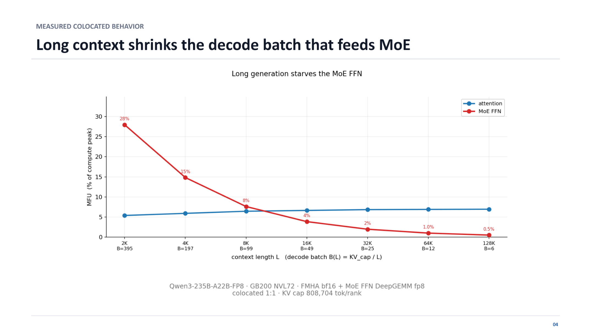
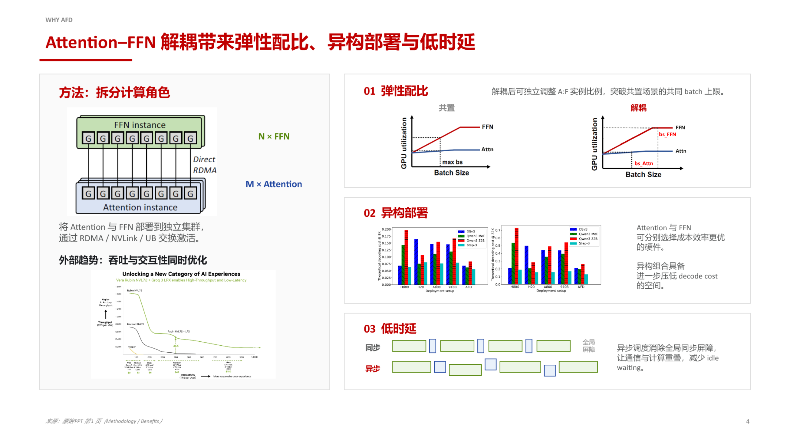
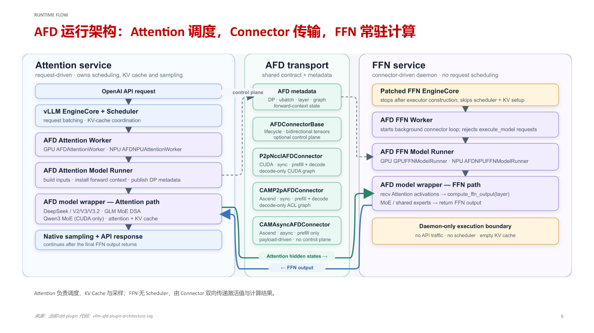
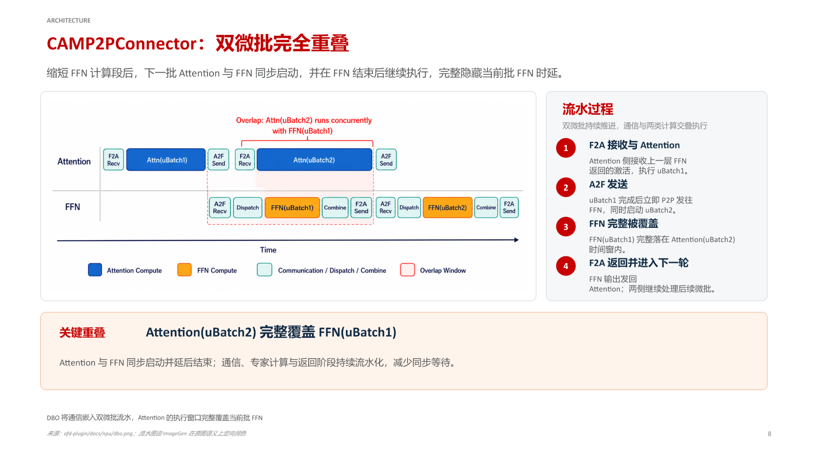
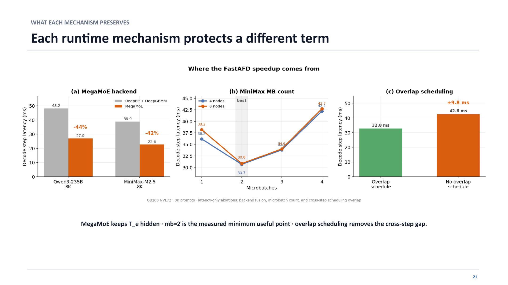
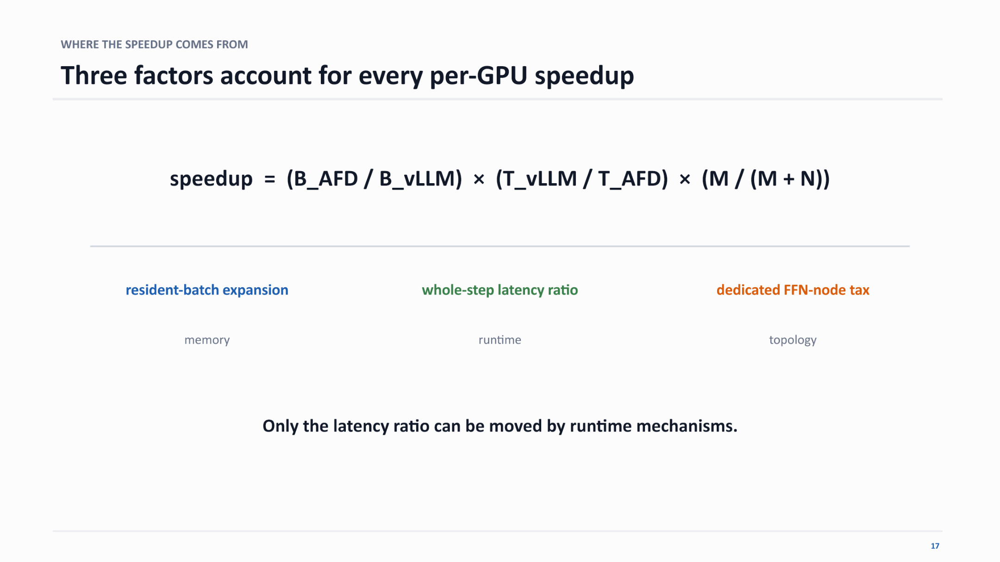
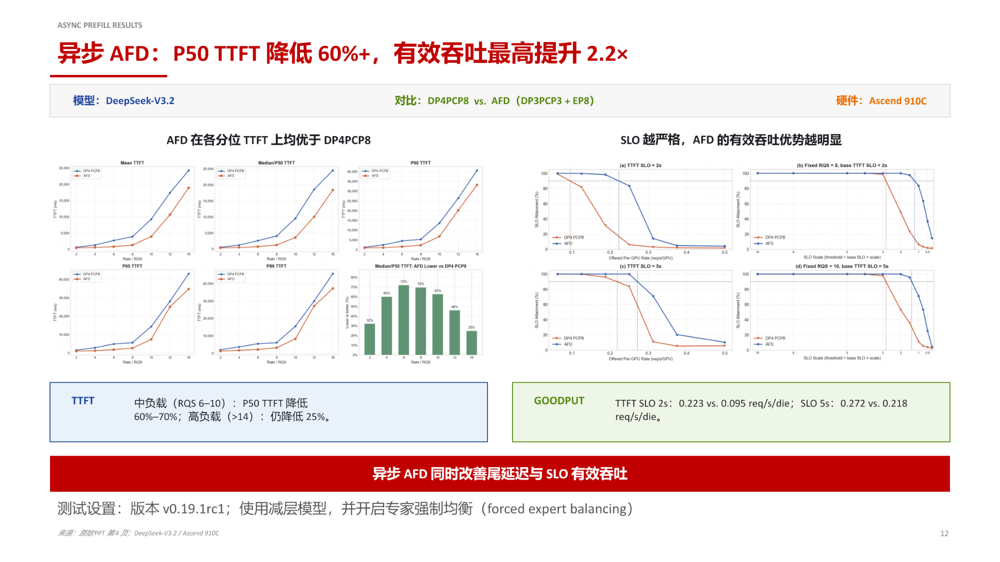

# Memory–Compute Disaggregation for Large-Model Inference: AFD Architecture Analysis and Performance Validation

**Source video**: [Bilibili BV14Jgg6iEhN](https://www.bilibili.com/video/BV14Jgg6iEhN) · **Slides**: [AFD Plugin and FastAFD slide deck](https://drive.google.com/drive/folders/1vNY3v8wxM_O3X90aDlckAyok_wwJUcOX)

As the context window of large language models expands from 4K to 128K, inference systems face more than a linear increase in computation—they confront a drastic amplification of a deep-seated resource conflict: Attention's hunger for GPU memory and MoE's dependence on large batch sizes strangling each other on the same set of GPUs. This article dissects the AFD (Attention-FFN Disaggregation) architecture and its high-performance implementation FastAFD, unpacking the root cause of this conflict, the engineering realization of the disaggregation approach, and the mathematical essence behind the performance gains.

**Target audience:** Backend and AI systems engineers with hands-on large-model inference experience and familiarity with KV Cache and MoE fundamentals.

**Prerequisites:** Understanding the distinction between the Prefill and Decode stages; knowing how KV Cache consumes GPU memory; familiarity with the gated routing mechanism in MoE models.

**Reading objectives:**

- Understand the resource mismatch between Attention and MoE during long-context inference, along with its quantitative manifestation
- Grasp the core design philosophy, role assignments, and data-flow closed loop of the AFD architecture
- Analyze how the dual-microbatch pipeline hides cross-node communication latency at the end-to-end level
- Learn about FastAFD's low-level GPU-side optimization techniques and performance prediction model
- Objectively recognize the limitations and engineering gaps at the current experimental stage

---

## 1. Background and Bottleneck: Why Does Long Context "Starve" MoE?

**Core question of this section:** Why does GPU compute utilization suffer a cliff-like drop during long-context inference? Intuitively, a longer context means more computation and the GPU should be busier—yet measurements show the exact opposite.

### Orthogonal Requirements of Two Module Types

A single Transformer inference step can be decomposed into two core modules:

| Module | Core bottleneck | Key to scaling throughput |
|--------|----------------|--------------------------|
| **Attention** (Self-Attention) | Must read/write the KV Cache (Key-Value Cache); memory footprint grows linearly with context length | Sufficient GPU memory capacity |
| **MoE FFN** (Mixture of Experts Feed-Forward Network) | Each expert's weight matrix is large, yet only a small number of tokens activate it per step | Enough tokens fed in simultaneously so that expert-level GEMMs reach high throughput |

**Attention is memory-hungry; MoE is batch-hungry.** Their resource demands point in nearly orthogonal directions.

### The Causal Chain Under Colocated Deployment

In a traditional colocated deployment, Attention and MoE FFN run on the same set of GPUs, and GPU memory must simultaneously hold the KV Cache and model weights. As context length $L$ increases:

1. **KV Cache bloat**—per-request cache footprint is proportional to $L$, and remaining GPU memory shrinks rapidly.
2. **Concurrent request count is forced down**—total GPU memory is fixed, so the number of simultaneously resident Decode requests $B$ drops roughly as $B \propto 1/L$.
3. **Token batch size received by MoE experts shrivels**—a smaller $B$ means the total token count fed into the FFN per step plummets, and the arithmetic intensity of expert-level matrix multiplications collapses.
4. **Massive GPU compute unit idling**—MoE FFN should contribute the vast majority of floating-point operations, yet its MFU (Model FLOPs Utilization) falls to single digits or even below 1%.

**What determines how many requests Attention can serve is "memory," while what determines MoE efficiency is "request count." Colocated deployment directly transmits the former's memory hunger into the latter's compute starvation.**

### Measured Reality: A Plunge from 28% to 0.5%

To visualize how severe this transmission effect is, the figure below shows the measured MFU curves for both module types as a function of context length under colocated deployment.

*Figure caption: The squeeze effect of long context on Decode batch size and MoE utilization. Test conditions: Qwen3-235B-A22B-FP8 model, GB200 NVL72 (NVIDIA rack-scale system) platform, Attention using bf16 FMHA, MoE FFN using fp8 DeepGEMM, per-rank KV Cache upper limit of 808 704 tokens. Source: presentation slides, page 20.*

Key elements in the figure:

- **Horizontal axis**: context length $L$ (from 2K to 128K), with the corresponding Decode batch size $B$ in parentheses.
- **Vertical axis**: MFU, i.e., actual floating-point throughput as a percentage of hardware peak.
- **Blue line (Attention)**: hovers steadily around 5%–7% throughout, insensitive to context length—Attention itself is a memory-bound operation whose utilization is determined by memory bandwidth.
- **Red line (MoE FFN)**: reaches 28% at $L = 2\text{K}$, $B = 395$; drops to roughly 15% when $L$ doubles to 4K and $B$ halves to 197; then slides continuously—about 2% at $L = 32\text{K}$, and down to 0.5% at $L = 128\text{K}$, a **56× reduction** from the peak.

### State Evolution Comparison

| Context length | Decode batch $B$ | MoE FFN MFU | Attention MFU | State description |
|---------------|-----------------|-------------|---------------|-------------------|
| 2K | 395 | 28% | ≈ 5% | MoE efficiency is reasonable; GPU compute units have work to do |
| 128K | 6 | 0.5% | ≈ 5% | MoE is nearly idle; the vast majority of compute capacity is wasted |

Shrinking from 395 requests to only 6 is not a scheduling policy failure—it is a physical impossibility to fit the KV Caches of more 128K requests into GPU memory at the same time.

**Conclusion:** Colocated deployment transmits Attention's memory bottleneck into MoE's compute bottleneck, and the longer the context, the more severe the transmission. Note that the data above are based on the Qwen3-235B-A22B model and GB200 NVL72 hardware. For smaller models or dense models with fewer experts, the MoE FFN share is lower and the conflict may not be as pronounced. However, given the ongoing trend of mainstream MoE large models toward ever-longer context windows, this structural mismatch has become the primary obstacle to deployment efficiency.

Having established the resource mismatch caused by colocated deployment, the next question is: can this constraint be broken at the physical architecture level?

---

## 2. Core Design: Elastic Ratio and Heterogeneous Deployment in the AFD Architecture

**Core question of this section:** How can the resource binding between Attention and MoE be dissolved at the physical level, allowing each operator type to run at its most efficient operating point?

### The Idea in One Sentence

The approach of AFD (Attention-FFN Disaggregation) is straightforward—split Attention and FFN off the same GPU, deploy them to two independent clusters, and exchange intermediate activations over a high-speed interconnect.

The figure below presents the AFD system overview and three core benefits, providing an overall framework for the sections that follow.

*Figure caption: System overview and three core benefits after AFD disaggregation. Source: presentation slides, page 3.*

The left side of the figure shows the post-split topology: **M Attention instances** and **N FFN instances** each occupy an independent set of nodes, exchanging activation tensors via RDMA, NVLink, or UB (Unified Buffer). The right side lays out the three direct benefits in turn.

### Benefit One: Elastic Ratio—Removing the Shared Batch Size Ceiling

| Dimension | Colocated mode | AFD disaggregated mode |
|-----------|---------------|----------------------|
| Batch size determined by | Attention and FFN share memory; whichever can accommodate fewer requests sets the limit | Each is independent: Attention sizes its batch by KV Cache capacity; FFN sizes its batch by the compute-optimal point |
| A:F instance ratio | Fixed at 1:1 | Adjustable to M:N based on actual workload |
| GPU utilization | When one side is constrained, the other idles | Both sides independently approach peak utilization |

The causal chain is as follows: under colocation, the KV Cache fills up GPU memory and caps the concurrent request count → that concurrency cap simultaneously constrains the batch size available to FFN. After disaggregation, multiple Attention nodes can each complete Self-Attention and then **aggregate** their produced activations onto a single FFN node. If a single Attention node can only sustain 128 concurrent requests due to memory limits, aggregating from 4 Attention nodes gives the FFN an effective batch size of 512—restoring the large-batch compute efficiency that MoE requires.

> **Boundary condition**: The upper bound of elastic ratio is limited by the network bandwidth between Attention and FFN. When activation transfer time exceeds computation time, adding more Attention nodes no longer yields benefit.

### Benefit Two: Heterogeneous Deployment—Selecting the Best-Matched Hardware for Each Operator

Attention is a **memory-intensive** task; ideal hardware should have large HBM capacity and high memory bandwidth. FFN / MoE is a **compute-intensive** task; ideal hardware should have high FP8/FP16 throughput. Under colocation, both operator types must run on the same accelerator model, making it impossible to satisfy both demands simultaneously. After disaggregation, the Attention cluster can use chips with larger memory capacity, while the FFN cluster can use chips with higher compute density. The bar chart on page 3 of the slides illustrates the downward trend in theoretical decode cost across different hardware combinations (because the bar chart details are small, specific numbers should be taken only as directional references). This heterogeneous combination is especially valuable during hardware generational transitions—there is no need to replace the entire fleet; only the bottleneck-side cluster needs to be upgraded.

### Benefit Three: Asynchronous Scheduling—Eliminating Global Synchronization Barriers

In the synchronous mode of colocated deployment, a global barrier is required after each layer's inference completes, with fast nodes waiting for slow ones. AFD naturally enables pipelining: once Attention finishes the current layer, it immediately sends the activation and begins processing the next batch; FFN computes as soon as it receives the data and sends the result back, overlapping communication with computation. This property will be discussed in detail in Section 4 in conjunction with the specific pipeline mechanism.

**Summary:** The core causal chain of AFD is **physical separation → independent scaling → individually efficient**. However, architectural disaggregation also introduces new engineering challenges: the high-frequency cross-node transfer of activations imposes stringent network requirements, and both the control flow and data flow within the clusters must be redesigned—which is exactly what the next section dissects.

---

## 3. Reshaping the Boundary Between Scheduling and Computation: Role Assignment After Disaggregation

**Core question of this section:** What role does each of the Attention and FFN nodes play? How do the control flow and data flow form a closed loop?

### Two Asymmetric Node Types

In a traditional inference engine, every node is both a scheduler and a compute worker. AFD splits these two responsibilities along the natural boundary of Transformer layers, producing a fully asymmetric role assignment.

The figure below shows the runtime architecture after disaggregation, clearly delineating the boundaries and interactions among three zones—Attention service, AFD transport, and FFN service.

*Figure caption: AFD runtime architecture. The left-side Attention service holds the scheduler, KV Cache, and sampling logic; the right-side FFN service degenerates into a scheduler-free daemon process; the middle AFD transport handles bidirectional control-plane and data-plane transfer. Source: presentation slides, page 6.*

### Attention Service: The System's Control Hub

| Responsibility | Description |
|---------------|-------------|
| **API entry point** | Receives and parses external inference requests; the sole user-facing endpoint |
| **Request scheduling (Scheduler)** | Decides which requests participate in the current iteration and how to batch them |
| **KV Cache management** | Allocates and reclaims key-value cache space; maintains per-request context state |
| **Attention computation** | Executes the Self-Attention forward pass |
| **Sampling** | Performs token sampling based on logits and returns results |

Key constraint: **Request state always remains on the Attention side.** The scheduler holds all metadata about each request—whether it is in the Prefill or Decode stage, how much KV Cache space it has consumed, whether it has timed out, and so on. None of this state is transferred across nodes.

### FFN Service: A Pure Compute Daemon

FFN service is stripped of all management functions and degenerates into a daemon process (a persistent background process) driven by the Connector:

- No API traffic—external requests never reach FFN nodes
- No Scheduler—no request-level scheduling decisions are made
- Empty KV Cache—all key-value caches are held by the Attention side
- **Sole action**: receive activations → execute feed-forward / expert computation → return results

This daemon-style design allows FFN nodes to be independently scaled in and out without synchronizing any request-level state, dramatically reducing cluster orchestration complexity.

### Data-Flow Closed Loop: The Complete Path of One Decode Iteration

1. **Attention-side computation**: After the Scheduler forms a batch, Self-Attention is executed, producing the hidden states for the current layer.
2. **Send activations**: The hidden states are sent to the FFN node via the Connector data plane; the control plane simultaneously transmits metadata such as batch dimensions.
3. **FFN-side computation**: The daemon receives the activations and executes the feed-forward network computation (in MoE models: gated routing + expert computation), producing the layer output.
4. **Return results**: FFN sends the computation results back to the Attention service via the Connector.
5. **Continue to subsequent layers**: After receiving the FFN output, Attention proceeds to the next layer's attention computation, or at the final layer performs sampling and returns the token.

Throughout this closed loop, **only post-routing hidden states traverse the network**. The full request context, KV Cache data, and scheduling metadata never cross node boundaries.

### Separation of Control Plane and Data Plane in the Connector

AFD transport is internally divided into two channels: the **control plane** carries coordination information such as `AFD metadata`, ensuring both sides agree on the current batch shape and semantics; the **data plane** carries the actual activation tensor transfers, with different Connector implementations—`P2pNccl`, `CAMP2p`, `CAMAsync`, etc.—selectable based on hardware topology. This separation means that when the underlying transport protocol is swapped, neither the upper-layer scheduling logic nor the FFN execution logic needs modification.

> **Note**: The presentation materials do not provide specific implementation details for the FFN Daemon's thread model or activation buffer management; these need to be further verified against the open-source code.

**Summary:** Disaggregation fully consolidates scheduling authority and data ownership on the Attention node, while FFN degenerates into a stateless compute unit. Both sides can evolve independently, but every iteration requires one round-trip of cross-node activation transfer—how this network transfer overhead is absorbed is the core problem that the pipeline design in the next section addresses.

---

## 4. Dual-Microbatch Pipeline: Hiding Cross-Node Communication Latency

**Core question of this section:** Each layer of inference requires at least two P2P communications (Attention→FFN and FFN→Attention). Will these additional network round-trips cancel out the compute gains from disaggregation?

The answer is: **No.** AFD uses the DBO (Double Batch Overlap) mechanism to embed the communication process within the computation window, almost entirely masking the network latency.

### Core Idea: Split One Batch into Two Microbatches

DBO's design consists of a single step—split the full Decode batch into two equally sized microbatches (uBatch1 and uBatch2) and stagger their execution across the Attention and FFN sides. While Attention is processing uBatch2, the FFN side simultaneously processes uBatch1 and completes the communication return; the two segments of work overlap completely in time. The component that orchestrates this overlap is the CAMP2PConnector, which coordinates P2P communication and microbatch scheduling between Attention and FFN.

### Pipeline Timing

The figure below shows the dual-microbatch overlap operation of the CAMP2PConnector, and is key to understanding how DBO eliminates communication latency.

*Figure caption: CAMP2PConnector dual-microbatch full overlap diagram. Source: presentation slides, page 8.*

The horizontal axis is time; the vertical axis is divided into two swim lanes for the Attention side and the FFN side. The four stages operate as follows:

| Stage | Attention side | FFN side | Communication direction |
|-------|---------------|----------|------------------------|
| ① F2A receive + Attention compute | Receives activations returned from the previous layer's FFN; executes Attention for uBatch1 | Idle or processing residuals from the previous round | FFN → Attention |
| ② A2F send + launch next microbatch | Immediately sends uBatch1 to FFN upon completion; **simultaneously** starts Attention for uBatch2 | Begins receiving uBatch1 | Attention → FFN |
| ③ FFN covered | **Continues executing** Attention for uBatch2 | Fully computes FFN(uBatch1) | — |
| ④ F2A return + enter next round | uBatch2 completes; receives the output of FFN(uBatch1) | Sends result back to Attention | FFN → Attention |

The most critical region in the figure is labeled **Overlap Window**: the execution window of Attention(uBatch2) spans from ② through the end of ③, and the entirety of FFN(uBatch1)'s computation and communication falls within this window. **FFN's latency is fully covered by Attention's computation and does not introduce any additional waiting on the critical path.**

### Minimal State Evolution

Assume the system is currently at layer $l$ of the Decode stage:

1. **$t_0$**: The Attention side receives the output of layer $l{-}1$'s FFN and begins computing Attention(uBatch1).
2. **$t_1$**: Attention(uBatch1) completes; the result is sent to FFN via P2P. The Attention side **does not wait** for FFN's return and immediately starts Attention(uBatch2).
3. **$t_1 \sim t_2$**: FFN receives the uBatch1 activation and performs expert computation. During the same period, the Attention side is processing uBatch2.
4. **$t_2$**: Attention(uBatch2) completes; FFN(uBatch1) has also completed and returned. Proceed to layer $l{+}1$…

The two microbatches advance alternately, and FFN's computation and communication are always masked by the next microbatch's Attention computation.

### Causal Chain

> **Split into microbatches** → **Stagger execution windows** → **Mask communication overhead**

Splitting gives Attention two independent compute units; staggering lets Attention for uBatch2 launch immediately after uBatch1 is sent to FFN; masking ensures FFN's total time is contained within the Attention execution window.

### Boundary Conditions

The premise for DBO to fully hide FFN latency is:

**T_Attn(uBatch2) ≥ T_FFN(uBatch1) + T_comm**

- $T_{\text{Attn}}(\text{uBatch2})$: computation time for Attention to process the second microbatch
- $T_{\text{FFN}}(\text{uBatch1})$: computation time for FFN to process the first microbatch
- $T_{\text{comm}}$: total bidirectional communication time for A2F + F2A

In long-sequence decoding or scenarios with large KV Caches, the Attention computation is ample and the inequality is easily satisfied. Conversely, if sequences are extremely short and Attention finishes very quickly, FFN's computation and communication may not be fully covered, and the pipeline will exhibit bubbles. Additionally, after disaggregation the FFN side handles only pure computation (no longer managing KV Cache), so its execution time is inherently compressed, further relaxing the inequality constraint.

The pipeline mechanism hides latency at the macro level, but on ultra-high-performance GPU hardware, microscopic kernel scheduling overheads remain critical. The next section explores how FastAFD eliminates these hidden costs at the runtime level, one by one.

---

## 5. Low-Level Optimizations: Operator Fusion and Microbatch Tuning in FastAFD

**Core question of this section:** Beyond the macro-level architectural disaggregation and pipeline overlap, will microscopic scheduling overheads on high-performance hardware—kernel launches, GPU memory buffering, inter-step gaps—eat into the theoretical speedup?

FastAFD targets three categories of hidden overhead on GB200 NVL72 (NVIDIA rack-scale system) with dedicated runtime optimizations. Each is presented below alongside ablation experiments.

### Ablation Experiment Overview

The figure below contains three sub-figures, each corresponding to one of the three subsections that follow. The vertical axis in all cases is per-step decode latency (ms); lower is better.

*Figure caption: FastAFD ablation experiments; test hardware GB200 NVL72, prompt length 8K. Source: presentation slides, page 37.*

### Optimization One: MegaMoE Operator Fusion

Traditional MoE inference splits token routing/movement and expert GEMM into separate kernels, each incurring GPU scheduling overhead, with intermediate results requiring temporary storage in GPU memory buffers. MegaMoE fuses both into a single operator: token data flows directly from registers or shared memory into the GEMM computation without landing in global memory.

Ablation data (sub-figure a, comparing the separated operators "DeepEP + DeepGEMM" with the fused MegaMoE operator):

| Model | Separated operator latency | MegaMoE latency | Reduction |
|-------|---------------------------|-----------------|-----------|
| Qwen3-235B | 48.2 ms | 27.0 ms | −44% |
| MiniMax-M2.5 | 38.9 ms | 22.6 ms | −42% |

> The above data were measured on GB200 NVL72 with an 8K prompt.

**Causal chain:** Separated operators → extra buffering + multiple launches → high latency; fused operator → buffering eliminated + fewer launches → latency drops by over 40%.

### Optimization Two: Optimal Microbatch Count Selection

The classical approach to pipeline parallelism is to split a batch into several microbatches to enable compute–communication overlap. More microbatches theoretically increase overlap coverage—but each split introduces scheduling and synchronization costs.

Sub-figure b horizontal axis is the microbatch count (1–4); key readings:

| Microbatch count | 4-node latency (ms) | 8-node latency (ms) |
|-----------------|---------------------|---------------------|
| 1 | 38.2 | 34.8 |
| **2** | **36.2** | **33.9** |
| 3 | 30.8 | 43.3 |
| 4 | 30.7 | 42.2 |

Under the 4-node configuration, latency decreases continuously with more microbatches but with diminishing marginal returns; under the 8-node configuration, **the minimum latency is reached at microbatch count = 2**, and further increases actually cause a significant latency rebound due to inter-node synchronization overhead. A simplified model explains this: per-step latency is approximately $L(m) = C/m + m \cdot d + \text{sync}(m)$, where $C/m$ is the effective compute time per microbatch, $m \cdot d$ is launch overhead, and $\text{sync}(m)$ is synchronization cost. At $m=2$, the compute benefit and additional overhead reach the measured optimal balance, so FastAFD adopts **2 microbatches** as the default configuration.

### Optimization Three: Overlap Scheduling to Eliminate Inter-Step Gaps

Even when computation and communication within a single step are well overlapped, a "dead zone" persists between adjacent Decode steps—scheduling for the next step does not begin until the previous step's results are written back. Overlap scheduling preemptively initiates routing decisions and token prefetching for the next step while the tail-end computation of the current step is still in progress.

Ablation result (sub-figure c):

- Without overlap scheduling: 42.6 ms
- With overlap scheduling: 32.8 ms
- **Per-step savings of 9.8 ms**, approximately 23% of total latency

### Synergy of the Three Optimization Layers

| Mechanism | Overhead eliminated | Typical benefit |
|-----------|-------------------|-----------------|
| MegaMoE operator fusion | Kernel launches + GPU memory buffering | Latency −42% to −44% |
| Microbatch count = 2 | Balance between pipeline bubbles and scheduling overhead | Reaches the measured latency minimum |
| Overlap scheduling | Inter-step gaps | Per-step −9.8 ms |

All three are indispensable: operator fusion compresses the absolute time of each computation, microbatch tuning strikes a balance between overlap and split overhead, and overlap scheduling fills the last remaining gap between steps. These low-level engineering efforts are the necessary conditions for converting theoretical speedup into actual throughput.

> **Boundary condition**: All data were measured on GB200 NVL72 with an 8K prompt. Under different hardware topologies or prompt lengths, the optimal microbatch count and the proportional contribution of each optimization may vary.

---

## 6. Performance and Mathematical Model: Source and Prediction of Speedup

**Core question of this section:** How much real throughput improvement does FastAFD deliver? What is the mathematical essence of the speedup? Can it be accurately predicted in advance?

### Measured Speedup Magnitude

On GB200 NVL72, using two MoE models—Qwen3-235B-A22B-FP8 and MiniMax-M2.5—with input prompt lengths of 8K and 16K tokens in a steady-state decoding scenario, FastAFD achieved a **1.35–1.45× per-GPU decode throughput improvement** over the vLLM baseline. The core metric for decode throughput is TPOT (Time Per Output Token): a lower TPOT means more decode tokens completed per GPU per second, i.e., higher throughput.

| Condition dimension | Specific constraint |
|--------------------|---------------------|
| Hardware platform | NVIDIA GB200 NVL72 |
| Test models | Qwen3-235B-A22B-FP8, MiniMax-M2.5 (both large-scale MoE) |
| Test phase | Steady-state Decode (system already in full-load decoding) |

Discussing speedup numbers outside these conditions is meaningless.

### Three-Factor Decomposition of Speedup

Where exactly does the 1.35–1.45× TPOT improvement come from? The presentation materials provide a formula that decomposes the per-GPU speedup into the product of three independent factors. The figure below shows the structure of that formula.

*Figure caption: Mathematical decomposition of FastAFD's per-GPU speedup, showing the contribution factors along memory, runtime, and topology dimensions. Source: presentation slides, page 33.*

**speedup = (B_AFD / B_vLLM) × (T_vLLM / T_AFD) × M / (M + N)**

#### Factor One: Resident Request Expansion (Memory Dimension)

$B_{\text{AFD}}$ is the number of resident requests on an Attention node after disaggregation; $B_{\text{vLLM}}$ is the corresponding value under the baseline with equivalent GPU memory. After disaggregation, Attention nodes no longer store FFN weights; the freed memory can accommodate more KV Cache entries and thus more concurrent requests. **This factor is approximately 1.5×**—it is the single largest source of speedup, essentially trading topology for memory and memory for concurrency.

#### Factor Two: Full-Step Latency Ratio (Runtime Dimension)

$T_{\text{vLLM}}$ is the TPOT for the vLLM baseline to complete one full Decode step; $T_{\text{AFD}}$ is FastAFD's equivalent TPOT. The DBO pipeline overlaps FFN computation with Attention in time, bringing $T_{\text{AFD}}$ close to the latency of the Attention step alone, so the ratio is > 1. The presentation materials point out that among the three factors, **only the latency ratio can be continuously tuned by runtime mechanisms**—resident request expansion is determined by model structure and memory capacity, the FFN node tax is determined by topology, and only the latency ratio can be improved through scheduling strategies such as DBO.

#### Factor Three: Dedicated FFN Node Tax (Topology Dimension)

$M$ is the number of Attention GPUs; $N$ is the number of additional dedicated FFN GPUs. $M/(M+N)$ is always < 1 and acts as a discount factor for introducing additional hardware. A larger $N$ increases FFN parallelism (benefiting Factor Two) but also increases the node tax (penalizing Factor Three). The optimal $M:N$ ratio depends on the model's Attention/FFN compute ratio and network bandwidth.

### Three-Factor Synergy: Qualitative Example

| Factor | Meaning | Example value |
|--------|---------|--------------|
| $B_{\text{AFD}} / B_{\text{vLLM}}$ | Resident request expansion | 1.50 |
| $T_{\text{vLLM}} / T_{\text{AFD}}$ | Full-step latency ratio | 1.15 |
| $M / (M+N)$ | FFN node tax | 0.85 |

$$
\text{speedup} = 1.50 \times 1.15 \times 0.85 \approx 1.47
$$

The memory benefit (1.5×) is already powerful; the pipeline delivers a 15% latency improvement; and the topology cost (0.85) pulls the theoretical ceiling of $1.50 \times 1.15 = 1.725$ back down to 1.47—consistent with the measured 1.35–1.45× range.

> **Note**: The numbers above are qualitative examples for illustration purposes and are not the exact per-factor values given in the presentation materials.

### Prediction Model Accuracy Verification

The three-factor formula can not only explain results post hoc but also **predict them in advance**. By assuming that FFN latency is fully hidden by the pipeline ($T_{\text{AFD}}$ approximated as the TPOT of the pure Attention step), one can directly use vLLM's per-step profiling data to estimate the decode cycle after disaggregation. Empirical validation shows that this prediction method has an error within **2.2%**.

This means that when engineers decide whether to deploy AFD for a given model, they do not need to build a complete disaggregated cluster; a single performance sampling run in a standard vLLM environment suffices for a high-confidence prediction of the benefit, significantly reducing the trial-and-error cost of architectural decisions.

**Summary:** FastAFD's speedup is not the product of a single optimization but the result of a three-way interplay among memory release (≈ 1.5×), compute overlap (> 1), and hardware overhead (< 1). Memory benefit is the dominant term, runtime optimization is the only continuously improvable knob, and topology cost is a fixed cost that must be accounted for.

---

## 7. Full-Stage Performance and Engineering Status

**Core question of this section:** Beyond steady-state Decode, how does AFD perform during the Prefill stage and in synchronous Decode? What limitations remain on the road to production readiness?

### Asynchronous Prefill: Eliminating the Global Synchronization Barrier

In a traditional data-parallel + pipeline-parallel (DP + PCP) setup, Prefill and Decode share the same set of GPUs. Every global synchronization of a Decode microbatch blocks any in-progress Prefill computation, and TTFT (Time To First Token) degrades as request concurrency increases.

After AFD splits Attention from FFN, Prefill can execute on the Attention nodes independently of Decode batches, no longer blocked by FFN-side synchronization barriers:

> Disaggregation → Prefill launches asynchronously on Attention nodes → global synchronization wait eliminated → TTFT decreases → more requests can be accepted under the same SLO → effective throughput increases.

The figure below compares the asynchronous Prefill scheme with the baseline in terms of TTFT and effective throughput (Goodput), and is the key evidence for assessing AFD's actual benefit during the Prefill stage.

*Figure caption: Asynchronous Prefill performance comparison. Model: DeepSeek-V3.2; hardware: Ascend 910C (Huawei Ascend AI processor); using a reduced-layer model with forced expert balancing enabled. Source: presentation slides, page 12.*

Key elements in the figure:

| Element | Meaning |
|---------|---------|
| **DP4PCP8** | Baseline: 4-way data parallelism × 8-stage pipeline parallelism |
| **AFD (DP3PCP3 + EP8)** | Experimental setup: 3-way DP × 3-stage PCP Attention nodes + 8-way expert-parallel FFN nodes |
| **Left percentile plot** | Shows TTFT from Mean to P99 across percentiles; AFD is lower than the baseline at every percentile |
| **Right Goodput plot** | With SLO on the horizontal axis, shows effective request throughput that meets the TTFT constraint |

Core data points (all obtained under the test conditions described above):

- **Medium load** (request arrival rate RQS 6–10): AFD's **P50 TTFT is reduced by 60%–70%**
- **High load** (RQS > 14): P50 TTFT is still reduced by about 25%; the benefit diminishes under increased concurrency pressure but remains significant
- **Effective throughput**: With a TTFT SLO of 2s, AFD reaches 0.223 req/s/die versus the baseline's 0.095 req/s/die, an improvement of approximately **2.2×**; when the SLO is relaxed to 5s, the gap narrows to 0.272 vs. 0.218 req/s/die

An intuitive rule: **The stricter the SLO, the more pronounced AFD's effective throughput advantage**—under strict SLOs, the baseline drops a large number of requests due to timeouts, whereas AFD's asynchronous scheduling enables more requests to complete within the deadline.

### Synchronous Decode: Modest but Stable Throughput Gains

Beyond asynchronous Prefill, the AFD Plugin also demonstrates positive gains during the synchronous Decode phase. Under the following controlled conditions:

| Condition dimension | Specific constraint |
|--------------------|---------------------|
| Model | DeepSeek-V3.2 W8A8 (weight 8-bit, activation 8-bit quantization) |
| Hardware | Ascend 910C |
| Output length | 512–1536 tokens |
| MoE routing strategy | Forced expert balancing enabled |
| A:F ratio | 64 Attention instances : 16 FFN instances (64A16F) |

The 64A16F ratio delivered a **9%–11%** throughput improvement during the synchronous Decode phase. Compared to the multi-fold gains of asynchronous Prefill, this may seem modest, but it validates that the disaggregated architecture is also effective under pure Decode workloads—even without introducing asynchronous scheduling, the freed memory and restored batch size from elastic ratio alone yield a stable throughput improvement.

### Boundary Conditions That Must Be Acknowledged

Every data point carries strict qualifications; extrapolation beyond these conditions is not rigorous:

1. **Reduced-layer model**: The asynchronous Prefill test did not use the full layer count of DeepSeek-V3.2 but rather a reduced-layer version. Reducing layers lowers per-node computation and communication pressure; results on the full model may differ.
2. **Forced expert balancing**: MoE routing inherently suffers from load imbalance. All tests above enabled a forced balancing strategy so that each expert processes an equal number of tokens. In real inference with this option disabled, load skew across FFN nodes could offset some of the gains.
3. **Hardware-specific**: Data for both asynchronous Prefill and synchronous Decode were obtained on Ascend 910C; no comparison at the same configuration on GB200 NVL72 or other hardware was provided.
4. **Software maturity**: Tests were conducted on vLLM **v0.19.1rc1** (release candidate); the AFD Plugin remains in **experimental** status in the community repository. An open PR does not equate to production readiness.
5. **Dynamic load adaptability**: Tests used fixed request arrival rates and did not cover real-world online scenarios such as bursty traffic or large fluctuations in request length. AFD's stability under dynamic load remains an open question.

---

## Conclusion and Outlook

### Core Conclusions

1. **Long-context inference amplifies the resource mismatch between Attention and MoE.** As context length grows from 2K to 128K, the Decode batch shrinks from 395 to 6, and MoE FFN's MFU drops from 28% to 0.5% (test conditions: Qwen3-235B-A22B-FP8, GB200 NVL72). Colocated deployment directly transmits the memory bottleneck into a compute bottleneck.

2. **AFD achieves elastic ratio through physical isolation.** By deploying Attention and FFN to independent clusters, multiple Attention nodes can aggregate tokens to feed the FFN nodes, restoring the large-batch compute efficiency that MoE requires; this simultaneously permits selecting the best-matched heterogeneous hardware for each operator type.

3. **The Attention side retains all scheduling authority; the FFN side degenerates into a stateless daemon.** Only hidden states are transferred across nodes; request metadata and KV Cache never cross boundaries. This asymmetric design reduces cluster orchestration complexity.

4. **The DBO dual-microbatch pipeline is the key to hiding communication latency.** Splitting the batch into two microbatches allows Attention(uBatch2)'s execution window to fully cover the computation and communication time of FFN(uBatch1), keeping the cross-node round-trip off the critical path.

5. **Low-level runtime optimizations convert theoretical gains into actual throughput.** MegaMoE operator fusion reduces per-step latency by 42%–44%; 2 microbatches strike the optimal balance between pipeline overlap and scheduling overhead; overlap scheduling eliminates inter-step gaps, saving 9.8 ms per step (all measured on GB200 NVL72 with an 8K prompt).

6. **Speedup is jointly determined by three factors: memory, runtime, and topology.** Resident request expansion (≈ 1.5×) is the dominant contributor; full-step TPOT latency ratio is the only continuously optimizable knob; the FFN node tax is a fixed cost that must be accounted for. The product of the three factors was measured at 1.35–1.45× per-GPU decode throughput improvement on GB200 NVL72, with a performance prediction model error within 2.2%.

7. **Disaggregation yields positive gains in both the Prefill and Decode stages.** Asynchronous Prefill, on Ascend 910C with a reduced-layer DeepSeek-V3.2 model and forced expert balancing enabled, reduces medium-load P50 TTFT by 60%–70% and boosts effective throughput by up to 2.2×; synchronous Decode on the same hardware and model delivers a 9%–11% throughput improvement with a 64A16F ratio.

### Current Limitations

- All performance data depend on specific hardware (GB200 NVL72 or Ascend 910C), specific models, and controlled test configurations; cross-platform and cross-model generalizability has yet to be validated.
- The AFD Plugin is currently in experimental status; an open PR does not represent official support or production readiness.
- Tests employed simplifying conditions such as reduced-layer models and forced expert balancing; behavior on full models under dynamic load and natural routing distributions remains an open question.
- FastAFD's performance prediction formula may not apply under hybrid inference (mixed Prefill and Decode) conditions.

Nonetheless, the disaggregated architecture has clearly demonstrated in experimental settings a viable path to breaking the resource mismatch in long-context inference—from resource binding to elastic ratio, and from serial execution to pipelined overlap. Continued engineering maturation in dynamic load adaptation, heterogeneous hardware generalization, and full-model validation is well worth ongoing attention.
