# Turning Cache into a Service Boundary: Kimi-K3 Production Inference Design on vLLM

> From Prefill/Decode disaggregation and distributed KV to four-tier multimodal caching, KDA checkpointing, and EAGLE3 prefix reuse

**Source video**: [Bilibili BV1Wv4k6YEdB](https://www.bilibili.com/video/BV1Wv4k6YEdB/) · **Slides**: [Kimi-K3 Production Serving](https://drive.google.com/drive/folders/1tBUR1z7j8LaEuNjAMTD3gvPU9WIhD3q8)

The challenge of running Kimi-K3 in production goes beyond fitting a 2.8T-parameter model onto GPUs. Once the weights are in place, multi-turn conversations, long contexts, images, tool results, and continuous generation still produce large amounts of runtime state. If that state cannot be retained, computation must be repeated; if the computation stages are not separated, time to first token and per-token latency constrain each other.

This article follows the actual causal chain: it first explains why the model and Agent workloads jointly create capacity and latency pressure, then analyzes Prefill/Decode disaggregation, Mooncake distributed KV, four-tier image caching, Prefill parallelism, KDA checkpointing, and EAGLE3 no-drop, before concluding with Decode parallelism and mixed quantization.

All performance figures in this article come from the presentation materials. Results that lack hardware, workload, statistical methodology, or baseline details are presented with their applicable boundaries intact; localized gains are not extrapolated into end-to-end conclusions.

## Intended Audience and Prerequisites

This article is intended for engineers who have a foundational understanding of large-model inference, GPU parallelism, or distributed systems, but are not yet familiar with the production serving implementation of Kimi-K3.

Readers should already understand:

- Prefill, Decode, and the KV cache in Transformer inference;
- the basic purposes of tensor parallelism, expert parallelism, and data parallelism;
- the basic concepts of MoE, prefix caching, and speculative decoding;
- the differences among metrics such as TTFT, TPOT, throughput, and cache hit rate.

## Learning Objectives

After reading this article, you should be able to:

- explain why Kimi-K3’s model architecture and Agent workloads jointly amplify state pressure;
- understand the architectural motivations for Prefill/Decode disaggregation and a shared KV pool;
- distinguish which segment of duplicated work each tier of the four-tier image cache eliminates;
- understand the granularity mismatches addressed by KDA checkpointing and EAGLE3 no-drop;
- correctly interpret the coverage, TTFT, acceptance-rate, and quantization gains reported in the materials.

---

## 1. The Question Is Not Whether the Model Can Run, but Whether Its State Can Be Retained

The production challenge of Kimi-K3 is not limited to loading the weights onto GPUs. After the weights consume a large amount of GPU memory, multi-turn conversations, long prefixes, and image inputs continue to generate runtime state. At the same time, users expect the first token to arrive quickly and subsequent generation to remain smooth. Capacity, state management, and latency therefore cannot be treated as three isolated problems.

We begin with the model architecture diagram to establish what state and computation paths, beyond the weights themselves, the serving system must support.

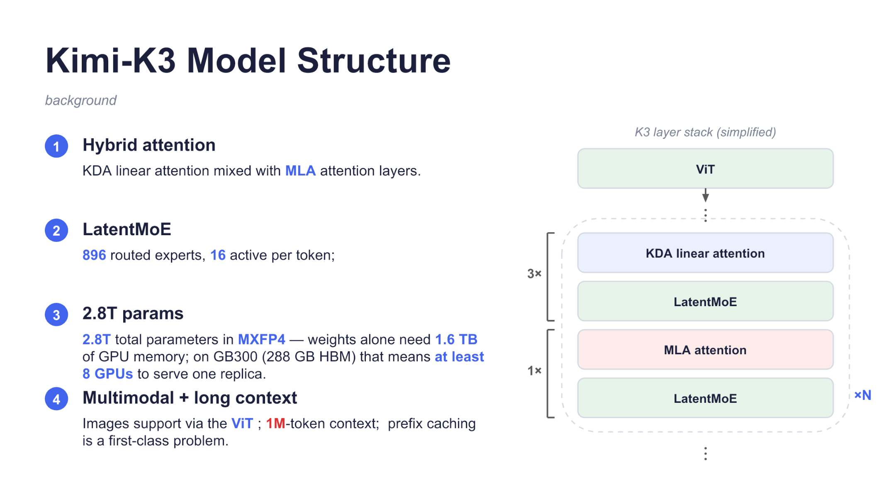

*Figure 1: Simplified Kimi-K3 layer stack and model-scale constraints. Source: presentation slide 2.*

Image inputs first pass through a ViT (Vision Transformer), which converts them into visual representations that the model can process. They then enter the repeated backbone layer groups. The dashed box alternates among three key types of modules:

- KDA: a type of linear attention used in combination with MLA; its recurrent state is the target of subsequent prefix-cache optimization;
- MLA: another attention mechanism in the hybrid-attention architecture;
- LatentMoE: a sparse mixture-of-experts architecture that routes each token to a subset of experts.

The `3×` and `1×` labels on the left indicate the illustrated ratio of KDA to MLA modules, while the full layer group is repeated `×N` times. The slide does not specify N, so the model’s total number of layers cannot be inferred from it.

LatentMoE contains 896 routed experts, of which 16 are activated for each token. Sparse activation reduces the number of experts that an individual token actually traverses, but does not eliminate the need to deploy all expert weights.

The slide describes the model as having 2.8T parameters, with an overall MXFP4 weight format, and states that the weights alone require 1.6 TB of GPU memory. On GB300 GPUs with 288 GB of HBM per GPU, the slide concludes that a single replica requires at least eight GPUs. This cannot be established simply by calculating `1.6 TB ÷ 288 GB`: the materials do not provide a complete derivation covering unit conversion, parallelization granularity, and reserved GPU memory.

More importantly, the 1.6 TB figure refers only to the weight footprint stated on the slide. It excludes the KV cache, activations, communication buffers, and other runtime overhead. The model also supports image input and a context length of up to 1M tokens. The 1M figure is a capability limit, not an indication that all production requests reach this length. It does, however, make the persistent retention of long prefixes an unavoidable systems problem.

A prefix cache avoids repeating Prefill over identical history by reusing inference state for a matching prefix. Prefill is the stage that processes the input context and constructs the state required for subsequent generation; Decode generates the result token by token from that state.

Next, we need to examine the workload diagram, because model size establishes only the baseline capacity requirement. Real requests determine the rate of state growth and the resulting scheduling pressure.

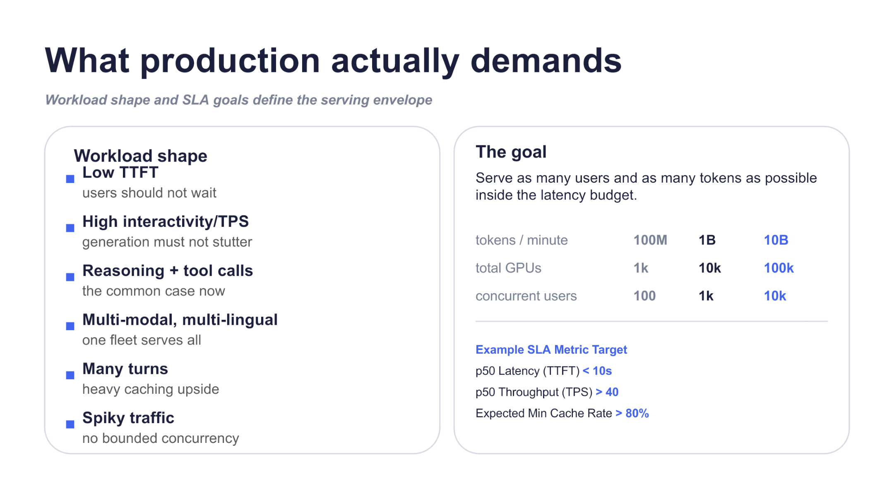

*Figure 2: Production serving workload patterns, scaling targets, and example metrics. Source: presentation slide 3.*

The relationships between the model architecture and production workloads are as follows.

| Production characteristic | Direct constraint | System impact |
|---|---|---|
| Multi-turn sessions | The same history is referenced repeatedly | Caching becomes more valuable, but resident state continues to grow |
| Reasoning and tool calls | Tool results are appended to the context | Prefixes grow longer; repeated Prefill increases when state is lost |
| Multimodal input | Text and images enter the same request | Adds downloading, preprocessing, visual encoding, and Prefill paths |
| Low TTFT | The first token cannot wait too long | Long Prefill computation and queueing time must be controlled |
| Highly interactive generation | Output must remain smooth throughout generation | Decode cannot remain blocked by large batches of input computation |
| Bursty traffic | Request arrival has peaks | Scheduling and cache capacity must withstand short-term spikes |
| Tool-format requirements | Calls must conform to parameters and schemas | Serving objectives also include format correctness |

TTFT (Time To First Token) is the latency before the first token is returned. TPOT (Time Per Output Token) is the time interval between adjacent output tokens. The `p50 TTFT < 10s`, `p50 TPS > 40`, and `Cache Rate > 80%` values shown on the slide are example SLA targets, not achieved benchmark results. The materials also do not define whether TPS is measured per request or in aggregate, or whether Cache Rate is calculated by request, token, or prefix length.

A long session illustrates how state can expand:

1. The user submits a long document and images, and the system performs visual processing and the initial Prefill.
2. The model initiates a tool call, and the tool result is appended to the same session.
3. The user asks a follow-up question, and the model generates from the longer history.
4. Subsequent turns reference the original images and tool results again.

If the historical state remains available as a cache hit, later steps primarily process newly added content. If the cache is evicted because of insufficient capacity, the same history may have to undergo Prefill again. This repeated computation increases TTFT and competes for resources with requests already in Decode.

This chain is a reasonable inference from the materials; the presentation does not provide measured latency for this specific example.

The slide also illustrates scaling tiers of 100M, 1B, and 10B tokens/minute; 1k, 10k, and 100k GPUs; and 100, 1k, and 10k concurrent users. These figures should be treated as planning targets or illustrations. Their tenfold progression does not establish that the system has demonstrated linear scaling.

The production objective therefore changes: the priority is not to maximize the speed of an isolated request, but to continuously expand the number of sessions and tokens that can be served within the latency budget and cache-coverage target. This raises two questions: where historical state should reside, and whether Prefill and Decode should continue sharing the same compute resources.

---

## 2. Separate the Compute Stages First, Then Redraw the KV Flow

Prefill and Decode are stages of the same inference operation, but they have different resource objectives.

Prefill operates on the input context, and long requests create large, concentrated computation. Decode advances one token at a time and is more sensitive to TPOT, batch size, and KV capacity. If both stages share one set of workers, the same resource configuration must accommodate both long-context computation and low-latency generation.

The following system diagram is worth examining first because it places request flow, compute flow, and KV state flow in the same architecture. It also explains why state must move between pools once the stages are separated.

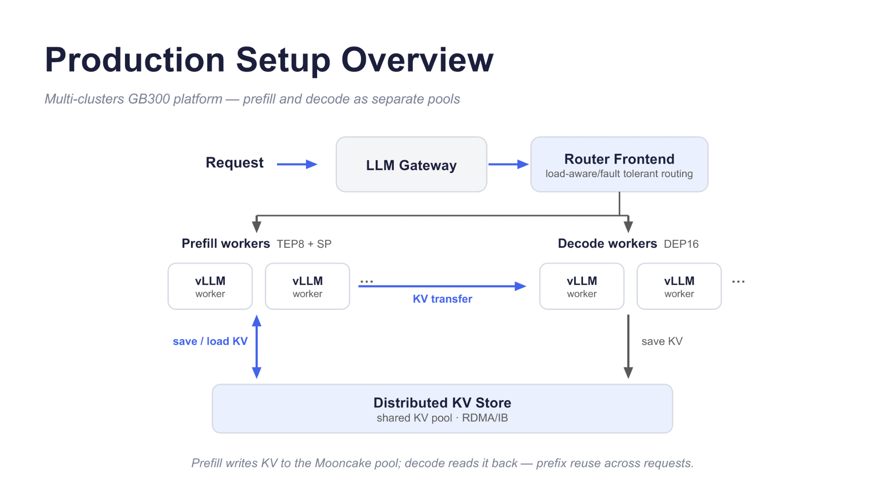

*Figure 3: Requests pass through the gateway and routing frontend into independent Prefill and Decode worker pools, while KV moves between pools through direct transfer or shared storage. Source: presentation slide 4.*

The arrows in the diagram should be understood in three categories.

The first is request flow. Requests enter the `Router Frontend` from the `LLM Gateway`. The materials describe the Router as load-aware and fault-tolerant: it selects workers based on backend state and handles routing problems caused by node failures.

The second is compute flow. Behind the Router are separate Prefill and Decode worker pools. Prefill processes the context and produces KV; Decode retrieves that state and continues generation.

The slide labels Prefill as `TEP8 + SP` and Decode as `DEP16`. It does not expand these abbreviations, so their exact parallel dimensions or GPU counts cannot be inferred from the diagram alone. Later slides provide more explicit Prefill and Decode configurations and should take precedence.

The third is KV state flow:

- Direct `KV transfer`: transfers state newly generated for the current request from Prefill to Decode.
- Distributed KV Store: Prefill writes KV into the shared pool, from which Decode reads it back; existing prefix state can also be reused.

The arrow on the Decode side of the diagram is labeled `save KV`, but the slide footer states that Prefill writes to the Mooncake pool and Decode reads from it. This article follows the semantics stated in the footer while preserving the existence of that apparent discrepancy between the diagram and its accompanying text. The materials do not state whether direct transfer and shared storage run in parallel, are alternatives to each other, or are selected on a per-request basis.

### Two Types of Constraints, Two Design Decisions

| Production constraint | Architectural result |
|---|---|
| Concurrent sessions continuously accumulate historical tokens, and GPU HBM cannot retain all KV | Extend KV beyond the GPU and combine memory from multiple machines into a shared cache pool |
| TTFT and TPOT constrain acceptable batch sizes in a colocated deployment | Separate Prefill and Decode when colocating them cannot simultaneously satisfy efficiency and generation-latency requirements |

The more concurrent sessions and the longer their contexts, the more KV must be retained. The materials do not provide complete per-session token distributions, KV sizes, or a capacity formula, so no universal threshold can be calculated. What can be established is that capacity pressure led to KV-cache offloading and subsequently to a distributed KV Store.

Latency constraints drove stage separation. The presentation describes an early experiment in which Prefill and Decode had not yet been separated and the system used techniques the speaker considered suitable for low latency. To satisfy approximately `TPOT < 25 ms`, the maximum batch size was about four.

This experiment can be reduced to the following state:

1. Four requests jointly enter a colocated worker.
2. Further increasing the batch size may exceed the target TPOT.
3. Decode can no longer amortize overhead by increasing the batch size.
4. Prefill in the same pool is also constrained by this small batch size.

This result only shows that, in an experiment whose model, hardware, and workload conditions were not fully disclosed, the low-latency target limited the ability of a colocated deployment to improve efficiency through larger batches. It cannot be used to calculate GPU utilization and is not a universal threshold for vLLM or other models.

After disaggregation, the Prefill pool can be configured around context computation, while the Decode pool can organize batches around per-token latency and KV capacity. The corresponding cost is that KV is no longer naturally attached to the same local instance: the system must explicitly handle state persistence, location, and transfer.

---

## 3. Mooncake: Organizing Node Memory into a Shared Session Pool

After stage separation, requests remain tied to cache location if historical KV is still retained only on a particular compute instance. Mooncake Store organizes host memory across multiple nodes into a shared KV pool that can be accessed across instances.

We begin with the coverage diagram because it directly shows how the cache boundary expands from GPUs to host-local memory and then to a shared cross-node pool.

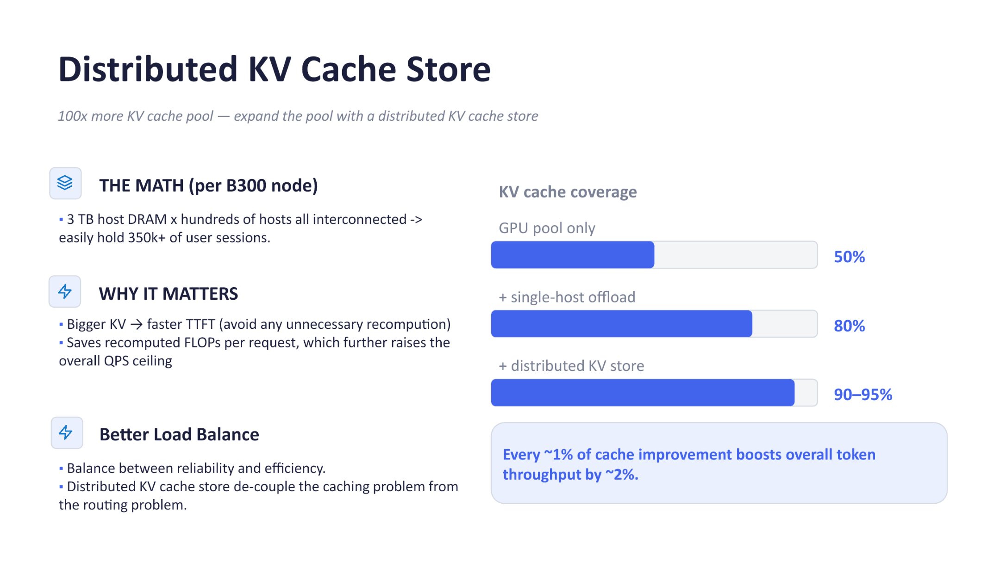

*Figure 4: Comparison of cache coverage for the GPU pool, single-host offload, and the distributed KV Store. Source: presentation slide 6.*

The three progress bars correspond to three capacity boundaries:

| Cache tier | Coverage reported on the slide | Capacity boundary |
|---|---:|---|
| GPU pool only | Approximately 50% | Constrained by GPU-memory capacity |
| With single-host offload | Approximately 80% | KV can be offloaded to host memory on the current node |
| With distributed KV store | Approximately 90%–95% | Host memory across multiple nodes forms a shared pool |

The materials do not provide a precise definition of coverage or disclose the workload, measurement window, or error range. The 50%, 80%, and 90%–95% figures can therefore only be treated as reported results under the conditions represented on the slide, not as hit rates achievable by arbitrary clusters.

### Expanding the Capacity Boundary from the Instance to the Cluster

The slide states that distributed storage can expand the KV cache pool by approximately 100×. Using B300 nodes as an example, it estimates approximately 3 TB of host DRAM per node and states that hundreds of interconnected hosts can accommodate 350k+ user sessions.

Three limitations apply:

- The comparison baseline for “100×” is not defined.
- 350k+ is a capacity estimate under particular cluster conditions.
- The materials do not provide per-session KV size, context length, cache precision, replication strategy, or metadata overhead.

The 350k+ session figure therefore cannot be independently recomputed from 3 TB. What the figure supports is the direction of scaling: KV changes from a local GPU or single-host resource into a resource jointly provided by the entire storage cluster.

The Mooncake deployment example in the presentation is as follows:

| Deployment element | Example configuration or responsibility |
|---|---|
| Compute scale | Two GB300 NVL72 racks |
| Control plane | 2 Mooncake Master replicas and 3 etcd replicas |
| In-node Store | Two stores of approximately 380 GiB RAM each, organized by NUMA |
| Data path | KV moves between nodes via RDMA |
| vLLM engine | Can be independently upgraded, scaled, or restarted |

Once the lifecycles of Mooncake Store and the vLLM engine are separated, KV that has already been offloaded to an independent Store instance is not lost merely because a compute instance exits. However, the materials provide no replication strategy, fault-injection results, recovery time, RDMA latency, or cross-rack cost, so they do not establish that storage-failure risk has been eliminated.

### How KV Hits Affect TTFT and QPS

The first benefit chain occurs in Prefill:

> Historical KV hit → skip recomputation of the corresponding prefix → lower TTFT

For example, consider a long session routed to a new vLLM instance. If that instance can retrieve matching historical KV from Mooncake Store, it does not need to reprocess the full history merely because its local cache is empty.

The saved computation creates a second chain:

> Avoid Prefill recomputation → save FLOPs → admit more requests onto compute resources → raise the QPS ceiling

The slide reports an empirical relationship: an approximately 1% cache improvement corresponds to an approximately 2% increase in overall token throughput. The materials provide no applicable range, error estimate, or causal decomposition, so this relationship cannot be extrapolated into a universal linear formula.

During the Q&A, the speaker also gave an example of a text-only session without images: more than approximately 20–30 turns, with roughly 300–600 output tokens and 2k–4k input tokens per turn, for a total length of approximately 100k–200k tokens. Within this range, approximately 90% was considered a reasonably objective cache target. The example helps explain why retaining long sessions is valuable, but it does not necessarily use the same statistical definition as the 90%–95% coverage in the diagram.

### How Shared State Reduces Routing Conflicts

Without shared storage, the Router often pursues two objectives simultaneously:

- route the request to a less-loaded instance;
- route the request back to the instance that retains its historical KV.

These objectives can conflict. The instance holding the cache may already be busy, while an idle instance lacks the corresponding state and would need to repeat Prefill.

A shared KV pool changes the relationship:

> KV is readable across instances → requests need not remain pinned to an instance solely for local hits → the Router can focus more heavily on instance load

“Decoupling” here does not mean that the Router can completely ignore cache location or transfer cost. It means that prefix reuse no longer strictly depends on returning to the original compute instance. Whether remote retrieval is preferable to recomputation still depends on prefix length, network cost, and concurrent traffic.

The speaker stated that, under the specific production traffic they observed, traffic from distributed KV and Prefill/Decode disaggregation had not yet made IB bandwidth a primary bottleneck. One explanation was that requests spend most of their time in Decode and that concurrency limits are generally reached through KV-pool capacity first. This is only an empirical observation from a particular deployment; the materials provide no network topology, bandwidth-utilization figures, or stress-test data.

Mooncake expands storage for model state that has already been generated. Before an image reaches LLM Prefill, however, it still goes through downloading, preprocessing, and visual encoding. Distributed KV alone cannot eliminate this repeated path.

---

## 4. Why Does the Same Image Need Four Cache Tiers?

Multi-turn Agent requests repeatedly carry the same image URLs. A single request may contain up to approximately 150 images. This is an upper-bound description: it does not mean that every turn contains exactly 150 images or that all of those images are distinct.

An image that misses every cache tier follows this path:

`URL → HTTP fetch → raw bytes → decode/resize/normalize → pixel tensor → ViT embedding → merge prompt → LLM Prefill → prefix KV`

This path contains four distinct data products: raw bytes, pixel tensors, visual embeddings, and model KV. They reside at different computational boundaries and therefore cannot be replaced by a single unified cache layer.

The following diagram is worth examining because it explicitly identifies what each cache tier stores and exactly which work a hit allows the system to skip.

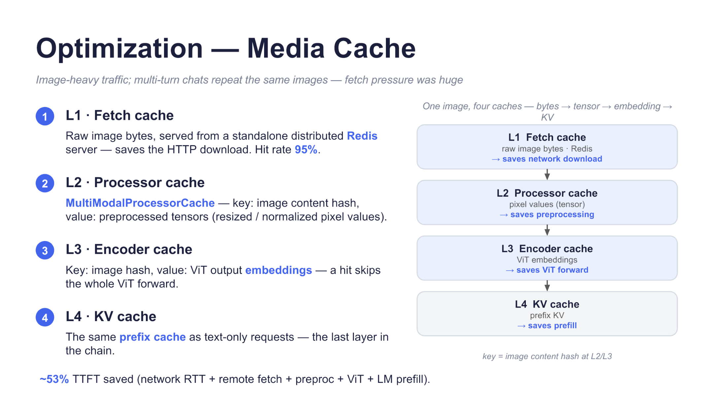

*Figure 5: L1 through L4 cache bytes, tensors, embeddings, and KV, respectively. Source: presentation slide 9.*

The arrows in the diagram represent the progressive transformation of the data format. The later the hit occurs in the path, the more processing stages can be skipped.

| Tier | Cached value | Key explicitly stated in the materials | Work eliminated on a hit |
|---|---|---|---|
| L1 Fetch cache | Raw image bytes | Complete key structure not specified | HTTP download and associated waiting |
| L2 Processor cache | Preprocessed pixel tensor | Image-content hash | Decoding, resizing, and normalization |
| L3 Encoder cache | ViT embedding | Image hash | ViT forward |
| L4 Prefix KV cache | Prefix KV | Reuses the text prefix-cache mechanism; complete key structure not specified | LLM Prefill for the matched prefix |

L1 is deployed in a separate distributed Redis system. After an L1 hit, the system must still perform image preprocessing, ViT encoding, and LLM Prefill, but the remote download is removed from the critical path.

L2 uses `MultiModalProcessorCache` to cache preprocessed tensors by image-content hash. It protects the image-decoding and preprocessing path.

L3 stores ViT embeddings. On a hit, the visual encoder forward pass can be skipped. At the time of the presentation, the Encoder cache was still described as incomplete and undergoing internal production experiments, so it cannot be characterized as a fully mature and broadly deployed capability.

L4 stores prefix KV. When the complete prefix formed by the image embedding and text prompt satisfies the matching conditions, the system can reuse the corresponding model state and skip that portion of LLM Prefill. It reuses the prefix-cache mechanism for text requests rather than defining a separate image-KV system.

Consider two turns that use the same image A. In the first turn, all four tiers miss:

1. Download A and write its raw bytes to L1.
2. Decode, resize, and normalize A, then write the tensor to L2.
3. Execute the ViT forward pass and write the embedding to L3.
4. Merge the prompt, execute Prefill, and write the prefix KV to L4.

When the second turn carries A again, the system continues from the deepest result that produces a hit:

- If only L1 hits, preprocessing, ViT, and Prefill are still required.
- If L2 hits, processing continues from the pixel tensor.
- If L3 hits, the visual embedding is retrieved directly.
- If L4 also hits, the corresponding LLM Prefill can likewise be skipped.

The four cache tiers therefore do not redundantly store the same data. They separately protect network, image-preprocessing, visual-encoder, and language-model resources.

The slide reports a 95% hit rate for the L1 Fetch cache. This figure cannot be used to infer the hit rates of L2, L3, or L4. The slide also reports that the full four-tier path saves approximately 53% of TTFT in aggregate; the presentation gives an approximate example of a reduction from about 20 seconds to about 10 seconds.

The materials do not provide hardware, sample size, baseline definition, or latency percentile, nor do they attribute the gain among the individual tiers. The 53% figure can therefore only be treated as an aggregate report for the complete path. It cannot predict arbitrary production traffic and cannot be presented as the independent gain of any individual cache tier.

The four-tier media cache moves the reuse boundary to stages before Prefill. Newly added text, prefix changes, and cache misses will still trigger Prefill. The next issue is how to shard the remaining computation and why KDA state remains constrained by block boundaries.

---

## 5. The Prefill Parallelism Backbone: Why Computation Remains Sharded

Kimi-K3 Prefill includes both hybrid-attention and MoE computation. The system needs to avoid restoring and retaining complete token representations on every rank too early after attention, as this may increase duplicated computation and communication in the intermediate residual and MoE paths.

The production configuration uses TP8+EP8 with Sequence Parallelism enabled:

| Mechanism | Sharded object | Responsibility in Prefill |
|---|---|---|
| Tensor Parallelism (TP) | Tensor dimensions of operators | Processes hybrid attention with TP8 |
| Expert Parallelism (EP) | MoE experts | Distributes experts across ranks with EP8 |
| Sequence Parallelism (SP) | Token sequence | Ensures that each rank retains only its own token shard along intermediate paths |

The materials do not provide the exact process-group mapping for TP8 and EP8. The two values therefore cannot be multiplied to infer 64 ranks, nor can it be asserted that they reuse the same eight-rank group.

The following execution diagram deserves particular attention because it shows how a complete representation becomes token shards through reduce-scatter and how the complete representation is restored before the next layer.

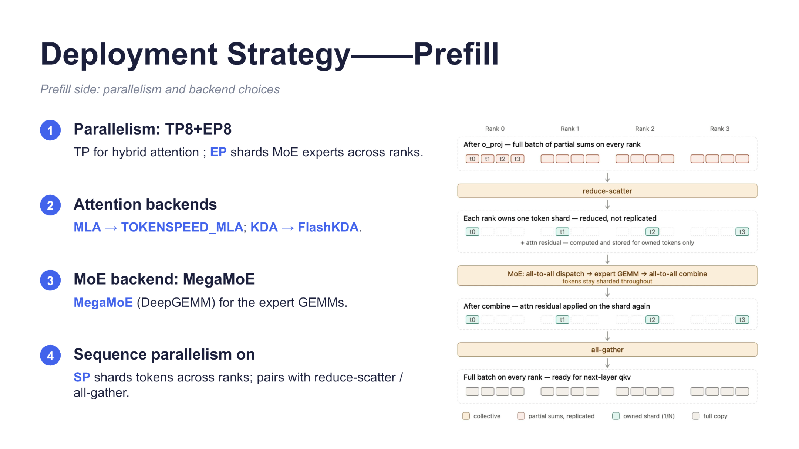

*Figure 6: Prefill-side parallel configuration, compute backends, and Sequence Parallelism data flow. Source: presentation slide 10.*

The diagram uses Rank 0 through Rank 3 to explain the process. This is only an instructional illustration; the production configuration remains TP8+EP8.

1. **Complete representations and partial sums**  
   Upon entering the layer, each rank performs tensor-parallel computation over the complete token set. After the attention `o_proj`, each rank holds partial sums produced by its local computation rather than the final complete output.

2. **reduce-scatter**  
   The partial sums pass through reduce-scatter, which performs summation reduction and distributes the results along the token dimension. The final result for each token is placed only on the rank that owns that token.

3. **Initial token shards**  
   After reduce-scatter, each SP rank retains only a subset of the global tokens. This token ownership describes the initial sharding before MoE dispatch; it is not equivalent to all inputs on which that rank subsequently executes expert GEMMs.

4. **MoE dispatch**  
   Tokens are sent via all-to-all dispatch to the ranks holding their target experts. EP determines where experts reside, while SP determines which tokens each rank holds before dispatch. After the all-to-all, an expert rank may receive tokens from multiple SP ranks.

5. **expert GEMM and combine**  
   A rank holding experts performs matrix multiplication on all tokens routed to its local experts. The token count is no longer limited by the size of its initial token shard. An all-to-all combine then returns the results to the original owner of each token.

6. **Final all-gather**  
   After the MoE results are merged with the residual, the system performs an all-gather to restore complete token representations for QKV computation in the next layer.

With four illustrative ranks and eight tokens, the minimal state progression is:

| Rank | Tokens initially held after reduce-scatter and before dispatch |
|---|---|
| Rank 0 | \(t_0,t_1\) |
| Rank 1 | \(t_2,t_3\) |
| Rank 2 | \(t_4,t_5\) |
| Rank 3 | \(t_6,t_7\) |

At this point, each SP rank initially owns two tokens. After all-to-all dispatch begins, ranks holding experts process tokens routed to their local experts from different ranks; the actual number is no longer limited to two. After the expert GEMM completes, combine returns the results to the original owner of each token. The complete representation from \(t_0\) through \(t_7\) is restored by all-gather only before QKV computation in the next layer.

The materials also identify the corresponding compute backends:

- MLA uses `TOKENSPEED_MLA`;
- KDA uses `FlashKDA`;
- expert GEMM uses `MegaMoE`, based on DeepGEMM.

The materials provide no throughput, TTFT, GPU-memory usage, or scaling-efficiency data comparing these backends or TP8+EP8+SP against other configurations. This section can therefore establish only the execution structure, not quantified performance gains.

This parallelism backbone distributes Prefill computation, but it does not ensure that state can be reused at arbitrary positions. KDA recurrent state remains constrained by prefix-block boundaries, which may cause the same tokens to be executed repeatedly for state alignment.

---

## 6. KDA Checkpointing: Capturing Reusable State During a Single Forward Pass

KDA must cache the recurrent state accumulated over the prefix. The old path could obtain reusable state only at predetermined boundaries. To place state on a block or partial-unit boundary, it had to replay the relevant tokens through additional forward passes. The slide summarizes this amplification as two forward passes for align mode and three for partial mode, corresponding to approximately 2–3× Prefill work.

The objective of Checkpoint mode is to let FlashKDA export recurrent state at specified positions during a single complete forward pass, removing the need to execute the same tokens repeatedly merely to capture state at the required boundaries.

We first examine the old path to distinguish between “a longer input sequence” and “replaying the same tokens for state alignment.”

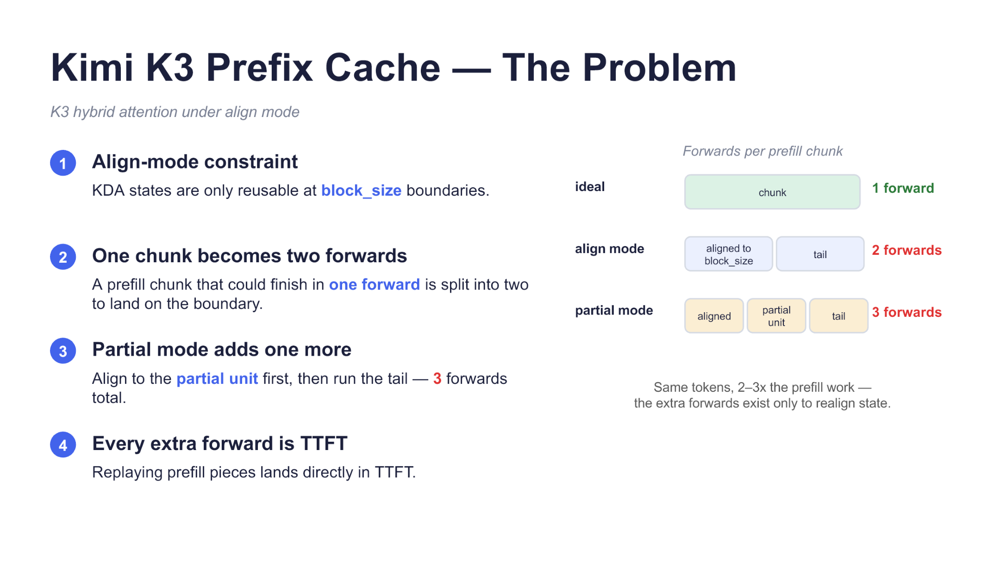

*Figure 7: Forward-pass counts and Prefill-work comparison for the ideal mode, align mode, and partial mode. Source: presentation slide 11.*

The three rows represent the same logical Prefill chunk, not three inputs of different lengths:

| Mode | State-alignment requirement shown on the slide | Number of forward passes | Meaning of work amplification |
|---|---|---:|---|
| Ideal mode | No extra execution is required for intermediate state boundaries | 1 | The entire chunk completes in one pass |
| align mode | State is required at the `block_size` boundary | 2 | Relevant tokens are replayed for boundary alignment; the slide reports approximately 2× Prefill work |
| partial mode | State is also required at finer partial-unit boundaries | 3 | One additional alignment replay is introduced; the slide reports approximately 3× Prefill work |

The two or three forward passes must not be interpreted as an ordinary partition of the chunk into non-overlapping segments. If the tokens were merely divided into several non-overlapping intervals and processed sequentially, that would not explain the approximately 2–3× Prefill work stated on the slide. The central mechanism indicated by the materials is that the old implementation caused the same tokens to participate in additional forward passes to obtain reusable KDA state at specified boundaries.

The slide does not provide enough detail to reconstruct the exact token intervals covered by each replay, so no interval formula should be invented. The only state progression that can be established is:

```text
The same logical Prefill chunk
    ├─ Ideal mode: 1 forward pass
    ├─ align mode: 2 forward passes for block_size state alignment
    └─ partial mode: 3 forward passes in total after adding partial-unit alignment
```

The “2–3×” figure on the slide therefore describes amplification in Prefill work or forward-pass count. It does not mean that the number of input tokens increases, nor does it imply that end-to-end TTFT necessarily increases by exactly two to three times.

Next, we examine the checkpoint diagram to understand how the new path exports intermediate state without interrupting computation.

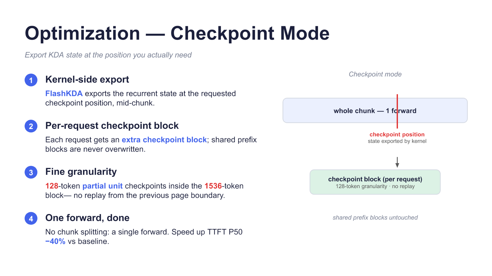

*Figure 8: Intermediate-state export in Checkpoint mode and the per-request checkpoint block. Source: presentation slide 12.*

The horizontal bar in the diagram represents the entire chunk, while the vertical line marks the `checkpoint position`. When the modified FlashKDA kernel reaches that position, it exports the recurrent state without terminating the forward pass, then continues processing the remaining tokens.

The state is written to a `checkpoint block` maintained independently for each request. This serves two purposes:

- State generated in the middle of a request does not overwrite shared prefix blocks.
- State no longer needs to be obtained through additional forward passes and token replay.

The new path can be summarized as:

```text
Complete chunk ─────────── single forward ───────────> complete
                              │
                    checkpoint position
                              │
                    export recurrent state
                              │
                  per-request checkpoint block
```

The causal relationship is:

> FlashKDA supports mid-pass state export → boundary state no longer depends on additional forward passes → the same tokens do not need to be replayed for alignment → each chunk returns to a single forward pass

The slide specifies a block size of 1536 tokens and a partial unit of 128 tokens. These correspond to 12 granularity units, but this establishes only their granularity relationship; it does not show that the implementation necessarily stores 12 independent checkpoints.

The slide reports that Checkpoint mode reduces TTFT P50 by 40% relative to an undefined baseline. The presentation also describes the online observation as an approximately 40% reduction relative to the previous implementation. This figure applies only to TTFT P50. The materials do not provide hardware, request length, concurrency, cache hit rate, sample count, or tail latency such as P95 and P99. It therefore cannot be extrapolated to average latency or throughput across all workloads.

The approach also has a cost: each request requires an additional checkpoint block, increasing memory consumption, but the materials do not quantify its size or aggregate overhead.

KDA checkpointing solves the granularity problem of exporting KDA state. However, the ability to reuse target-model state at fine granularity does not mean that speculative-decoding draft KV is determined entirely by the prefix. The final EAGLE3 draft slot also depends on the token after the prefix ends, creating another granularity mismatch.

---

## 7. Why EAGLE3’s One-Position Misalignment Sacrifices an Entire Cache Block

EAGLE3 is a speculative-decoding method that uses target-model hidden states to generate draft tokens. Its draft inputs are shifted by one position relative to the target sequence, so the final draft slot is not fully determined by the shared prefix.

We begin with the dependency diagram because the central issue is not the cache implementation itself, but which token the last slot semantically depends on.

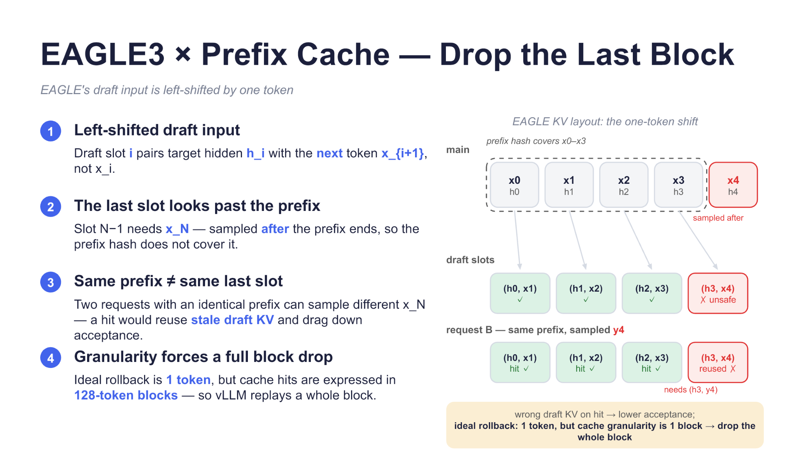

*Figure 9: The first three draft slots are determined by the prefix, while the final slot depends on the sampled result after the prefix ends. Source: presentation slide 13.*

Let the target-model prefix be \(x_0,\ldots,x_3\), with corresponding hidden states \(h_0,\ldots,h_3\). Draft slot \(i\) uses \(h_i\) and the next token \(x_{i+1}\):

\[
\text{draft\_slot}_i=(h_i,x_{i+1})
\]

The mapping is as follows:

| Draft slot | Determined by the prefix? | Reason |
|---|---:|---|
| \((h_0,x_1)\) | Yes | Both inputs are within the prefix |
| \((h_1,x_2)\) | Yes | Both inputs are determined by the prefix |
| \((h_2,x_3)\) | Yes | Both inputs are determined by the prefix |
| \((h_3,x_4)\) | No | \(x_4\) is sampled after the prefix ends |

Consider two requests with the same prefix. Request A samples \(x_4\) after the prefix, leaving \((h_3,x_4)\) in the cache. Request B may sample \(y_4\), in which case it actually requires \((h_3,y_4)\).

If B directly reuses A’s final slot, stale draft KV may reduce draft acceptance—the proportion of draft tokens accepted by the target model. This should not be described as producing an incorrect final output, because the target model still verifies the draft and can reject mismatched candidates.

From the semantic dependency, only one token theoretically needs to be rolled back. However, vLLM prefix-cache hits operate at a granularity of 128-token blocks and cannot mark only the final token within a block as a miss:

\[
\text{Final slot is uncertain}
\rightarrow
\text{Ideal rollback of 1 token}
\rightarrow
\text{Actual granularity is a 128-token block}
\rightarrow
\text{Entire tail block is dropped by default}
\]

Dropping the tail block does not invalidate the entire prefix cache; only the final matching block containing the unsafe last slot is discarded.

### no-drop: Choosing Between Greater Reuse and Acceptance-Rate Risk

`disable_eagle_block_drop` is an optional switch. When enabled, vLLM no longer drops the already matched tail block, adopting the no-drop strategy. This creates more opportunities for prefix reuse but retains the risk that the final slot may be stale.

The following experimental chart must be read within the scope of the test. It answers only what happened in a two-turn MT-Bench A/B test and does not establish that no-drop is appropriate for every workload.

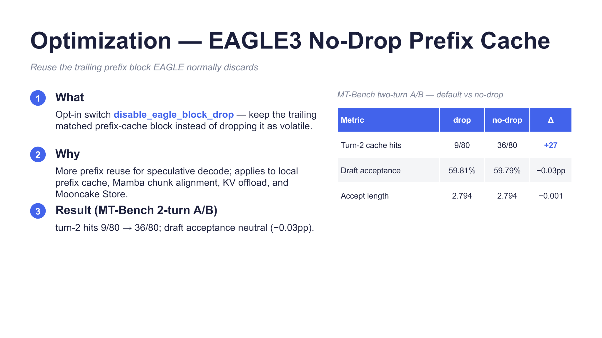

*Figure 10: MT-Bench two-turn A/B comparison between dropping the tail block by default and using no-drop. Source: presentation slide 14.*

The PPT reports:

| Metric | drop | no-drop | Difference labeled in the PPT |
|---|---:|---:|---:|
| Second-turn cache hits | 9/80 | 36/80 | +27 |
| Draft acceptance | 59.81% | 59.79% | −0.03pp |
| Accept length | 2.794 | 2.794 | −0.001 |

Second-turn cache hits increased from 9 to 36, an increase of 27 hits—not 27 percentage points.

The displayed Draft acceptance values change from 59.81% to 59.79%, while the difference is reproduced from the PPT as −0.03pp. Both Accept length columns display 2.794, yet the table reports a difference of −0.001. These apparent discrepancies may result from display rounding; the original table must not be “corrected” based only on the visible values.

This A/B test shows that, in this constrained scenario, no-drop increased tail-block hits while changes in acceptance rate and acceptance length were small. However, the materials do not provide hardware details, randomness controls, request-length distributions, or significance tests. “Small changes” therefore cannot be elevated into a claim of statistical equivalence.

No-drop is thus a workload-dependent tradeoff:

- When prefixes repeat frequently and recomputing the tail block is expensive, greater reuse may be worthwhile.
- When continuations branch frequently, stale final slots may reduce acceptance more noticeably.
- Whether to enable it should be decided from actual acceptance rates and cache benefits, rather than treating it as a universal default.

After the prefix tail-block issue is addressed, overall Decode concurrency remains constrained by KV capacity, attention execution, and the cost of per-token linear projections.

---

## 8. Completing the Decode Path: Capacity-First Parallelism and Mixed Quantization

The primary Decode constraint is not merely the speed of one computation step, but whether enough historical state can be retained for the target batch size. KV-cache consumption increases with context length and concurrency.

The slide describes Decode as `capacity-bound`. This should be understood to mean that the deployment is constrained first by KV capacity; it does not imply that compute, memory bandwidth, and inter-GPU communication can never become bottlenecks under other workloads.

We begin with the Decode component diagram to place the parallel layout, attention backends, and speculative decoding in the same execution path.

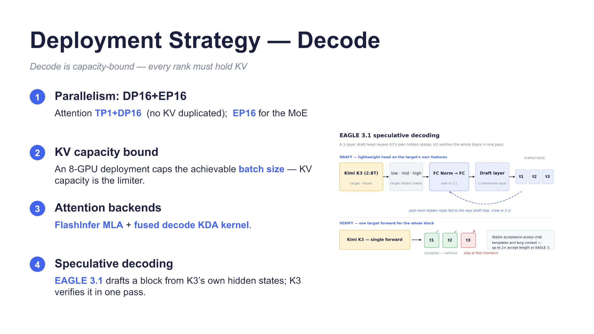

*Figure 11: Decode organizes DP16, EP16, attention kernels, and EAGLE 3.1 around KV capacity. Source: presentation slide 15.*

Attention uses `TP1+DP16`: Tensor Parallelism is 1, Data Parallelism is 16, and the slide notes “no KV replication.” What can be established is the slide’s description of this layout; it cannot be expanded into a claim that no state is replicated anywhere in the entire system.

MoE uses `EP16`, organizing expert computation with 16-way Expert Parallelism. `DP16+EP16` describes different parallel dimensions and cannot be added together to infer 32 GPUs.

The slide also mentions both DP16 and an “8-GPU deployment” without explaining the deployment level at which each applies. This uncertainty must be preserved. What the materials do support is that Decode-side parallel configurations are evaluated around KV capacity, and that the maximum batch size of the 8-GPU deployment described on the slide is constrained by KV capacity.

The attention backends include:

- FlashInfer MLA for MLA;
- a fused decode KDA kernel for KDA.

The slide gives only the final backends selected and provides no benchmark comparisons among candidate kernels. Their individual contributions to throughput or latency therefore cannot be determined.

EAGLE 3.1 generates draft blocks from Kimi-K3 hidden states, after which the target model verifies candidates in a single forward pass. The minimal execution process is:

1. Kimi-K3 produces the current hidden state.
2. The draft side generates candidate tokens.
3. Kimi-K3 verifies the candidate sequence in one forward pass.
4. The continuously matching portion is accepted, stopping at the first mismatch.

The actual benefit depends on draft length and acceptance rate. The materials do not provide a fixed draft-block length, relative performance gain, or additional GPU-memory overhead.

### Two Quantization Configurations in a Single Checkpoint

Finally, we examine the quantization diagram to distinguish among checkpoint organization, the correctness conclusion for fused GEMMs, and localized performance results.

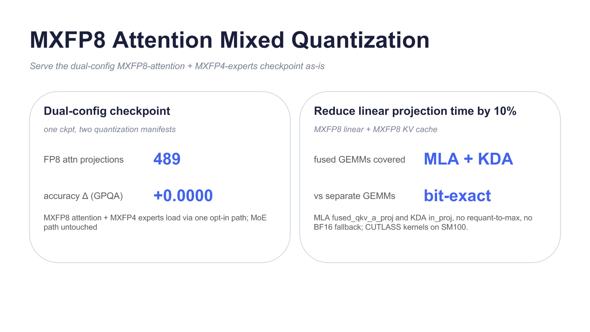

*Figure 12: Loading method for a dual-configuration checkpoint, fused-GEMM coverage, and localized metrics. Source: presentation slide 16.*

Mixed quantization uses an organization described as “one checkpoint, two quantization manifests.” The configurations shown on the slide include:

- 489 FP8 attention projections;
- MXFP8 attention;
- MXFP4 experts;
- an optional mixed-quantization loading path.

“MoE path untouched” means that the newly added loading path did not modify the existing MoE compute path; it does not mean that the experts are unquantized.

The slide reports that MXFP8 attention covers fused GEMMs for MLA and KDA. For this part of the implementation, the materials establish only that it is bit-exact relative to separate GEMMs. The associated performance evidence must be bounded item by item:

| Metric | Supported conclusion | Conclusion that cannot be extrapolated |
|---|---|---|
| GPQA accuracy Δ `+0.0000` | No difference was observed at the precision displayed on the slide | Mathematically zero error, or unchanged accuracy on other benchmarks |
| `bit-exact` | Fused GEMMs are bitwise identical to separate GEMMs | Bitwise identity to the original BF16 or FP16 model |
| Linear-projection time reduced by `10%` | Local projection time decreased using CUTLASS kernels on SM100 | Total Decode latency or end-to-end throughput improved by 10% |

The 10% linear-projection result does not disclose batch size, sequence length, baseline latency, repetition count, or error range. It also cannot be added directly to gains from speculative decoding, caching, or the parallel layout.

The available materials therefore establish three types of design:

- selecting the Decode parallel layout around KV capacity;
- matching MLA and KDA backends to the per-token execution pattern;
- reducing the cost of selected computation paths through EAGLE 3.1 and mixed quantization.

The available evidence does not support a complete end-to-end acceleration ratio.

---

## Conclusion: The Optimization Target Is the State Lifecycle

The designs used in Kimi-K3 production inference all revolve around one question: can state produced by prior computation continue to be reused at the correct time, location, and granularity?

- The 2.8T parameters, long context, hybrid attention, sparse MoE, and image input jointly compress the space available for runtime state, while multi-turn Agent requests continuously expand the history that must be retained.

- Prefill/Decode disaggregation addresses their differing resource objectives: Prefill centers on long-context computation, while Decode centers on per-token latency and KV capacity. Once they are separated, KV movement and persistence become explicit system responsibilities.

- Mooncake Store separates KV from the lifecycle of an individual compute instance. Shared state both reduces prefix recomputation and weakens the conflict between cache hits and load balancing.

- The four-tier media cache moves the reuse boundary upstream from LLM KV to image bytes, preprocessed tensors, and ViT embeddings. Caching only the final KV cannot eliminate repeated work before images enter Prefill.

- KDA checkpointing addresses state-export granularity: it lets FlashKDA export recurrent state during a single forward pass, avoiding replay of the same tokens to align blocks and partial units.

- EAGLE3 no-drop addresses the mismatch between semantic dependencies and cache-block granularity. In the constrained A/B test, it increased tail-block hits but retained the risk that a stale final slot could reduce draft acceptance.

- Decode’s DP/EP layout, specialized kernels, speculative decoding, and mixed quantization act on capacity or localized computation costs. Their respective figures cannot be added together into an end-to-end gain.

## Evidence Limitations

The source materials still omit several categories of data that are important for production conclusions:

- The SLA, coverage, and empirical cache relationship lack a unified statistical definition.
- Multiple latency results lack hardware, request length, concurrency, sample count, and tail-latency details.
- Mooncake does not disclose the costs of remote retrieval, replication, cross-rack transfer, or failure recovery.
- The memory consumed by KDA checkpointing’s additional per-request block is not quantified.
- EAGLE3 no-drop is evaluated only in an MT-Bench two-turn A/B test and lacks broader workloads and significance information.
- The Decode slide does not explain the deployment-level relationship between DP16 and the 8-GPU deployment.
- The 10% quantization result applies only to linear-projection time using CUTLASS kernels on SM100.
- The materials provide no end-to-end comparison of latency, throughput, and resource cost that aggregates all localized optimizations.

Within these boundaries, a clear engineering method emerges: first identify the stage at which state is produced, then decide whether it should remain on the GPU, in local host memory, in shared storage, or in an earlier media-processing tier. Next, configure compute resources around the distinct bottlenecks of Prefill and Decode, and align cache granularity as closely as possible with the true semantic dependencies.
