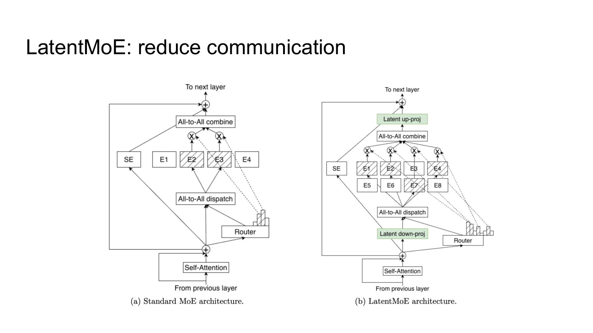
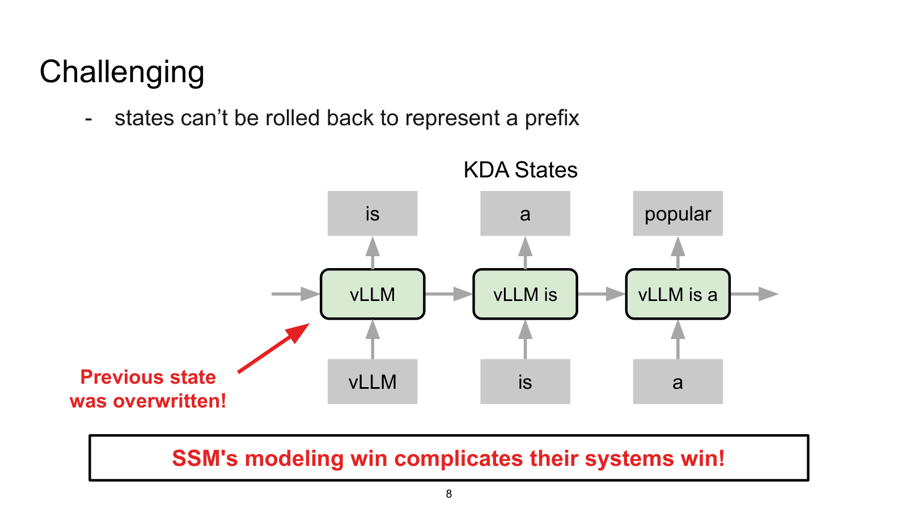
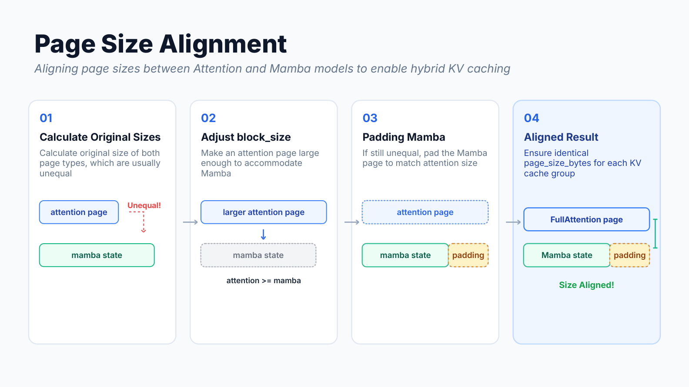
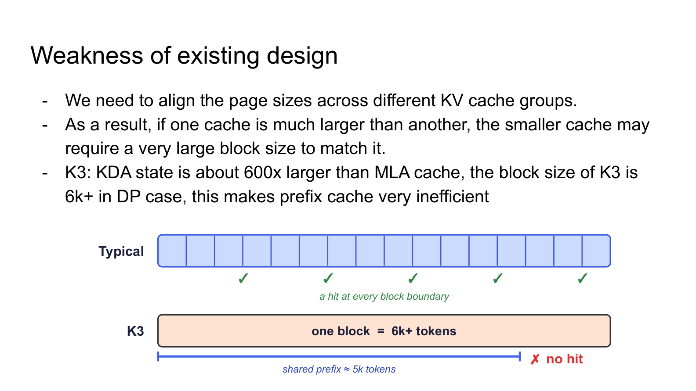
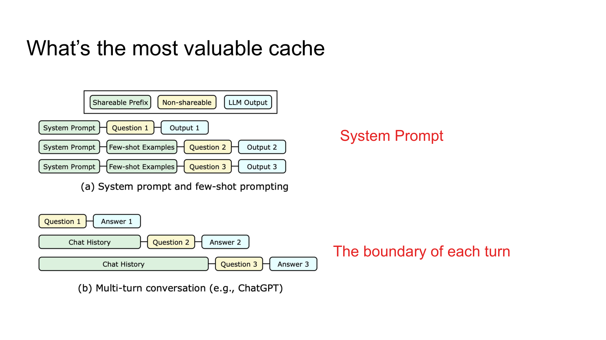
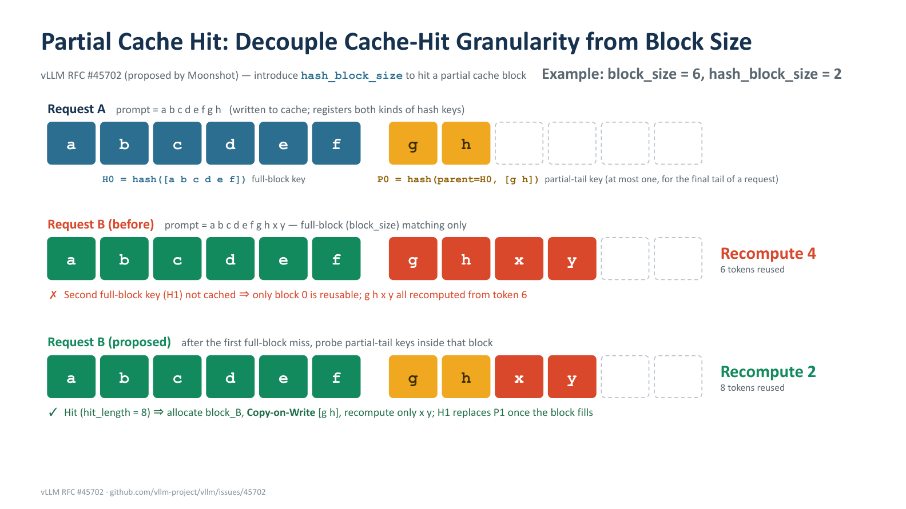
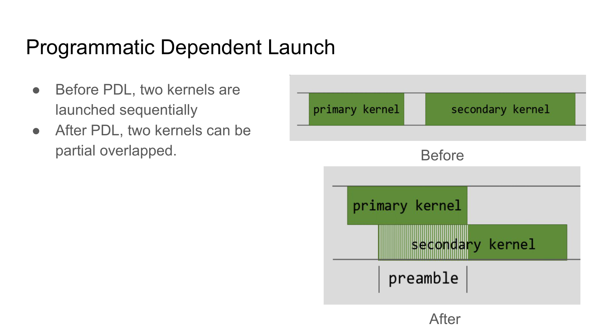
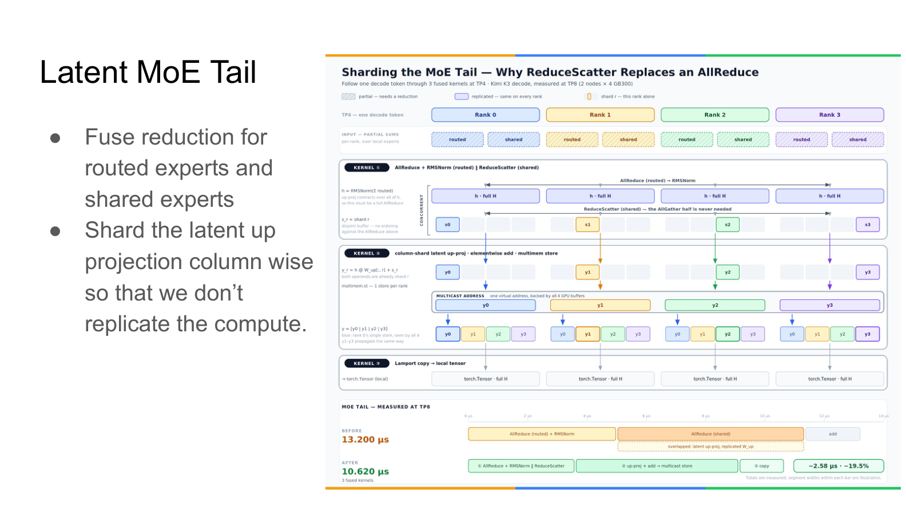
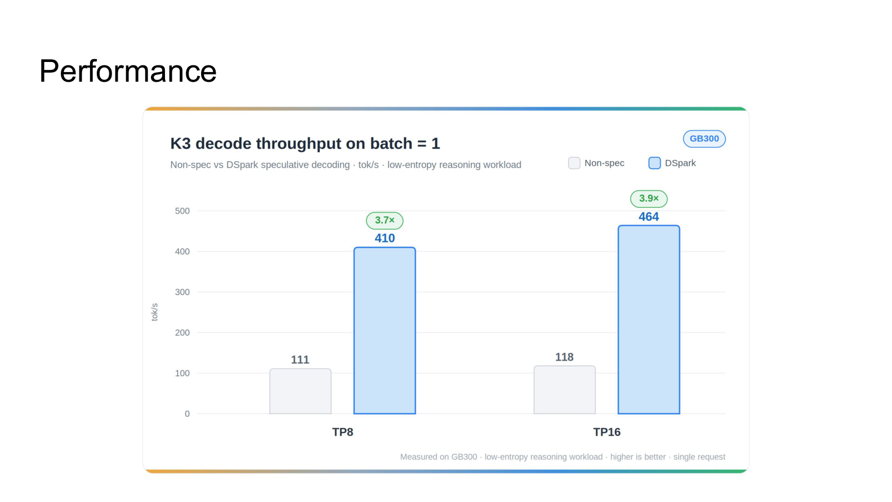

# Kimi K3 Inference Backend Evolution: System Redesign from Hybrid Architecture to Maximum Throughput

> An in-depth analysis of vLLM's memory management and operator optimization under the KDA and LatentMoE architectures

**Source video**: [Bilibili BV11z3m63ECo](https://www.bilibili.com/video/BV11z3m63ECo) · **Slides**: [Kimi K3 vLLM Tech Share](https://drive.google.com/file/d/1-oeVWJytNNXV_DuFTKxH_oo5I4bm_1Em/view)

Kimi K3 pushes total parameter count from 1.04T to 2.78T while introducing two new architectural elements: KDA and LatentMoE. This hybrid design controls communication and memory overhead at the model level, yet triggers a cascade of failures at the inference-system level—the append-only assumption for KV Cache writes is violated, physical block sizes are forced to balloon beyond 6,000 tokens, and prefix cache hit rates plummet. This article traces the full causal chain—"model architecture → memory allocation → caching strategy → operator execution → performance validation"—to dissect the vLLM team's engineering countermeasures end to end.

**Target audience**: Backend and AI systems engineers with a foundation in large-model inference who are interested in the vLLM framework, KV Cache management, and low-level operator optimization.

**Prerequisites**:

- Understanding of the standard Transformer KV Cache mechanism
- Familiarity with vLLM's PagedAttention fundamentals
- Basic knowledge of MoE (Mixture of Experts) routing principles

**Reading objectives**:

1. Understand the challenges that KDA's state-overwrite behavior poses to conventional inference frameworks
2. Master the alignment strategy used by the hybrid memory allocator to handle heterogeneous states
3. Learn how partial cache hits decouple physical block size from logical cache granularity
4. Gain insight into the application of PDL and ReduceScatter in low-latency operators

---

## 1. Architectural Evolution and Breaking the Communication Bottleneck

**Core question for this section**: When an MoE model's total parameter count grows from 1.04T to 2.78T and its layer count increases from 61 to 93, the data volume moved by All-to-All (a collective communication operation used in MoE to dispatch and aggregate expert computation results across devices) nearly doubles. What did Kimi K3 do at the model level to prevent inference-time communication costs from exploding in proportion to parameter count?

### K2 → K3: Communication Pressure from the Scale Leap

The table below is compiled from the K2/K3 comparison data in the presentation slides:

| Metric | Kimi K2 | Kimi K3 | Change |
|------|---------|---------|------|
| Layers | 61 | 93 | +52% |
| Total parameters | 1.04T | 2.78T | +167% |
| Activated parameters | 32.6B | 104.2B | +220% |
| Training context length | 128K | 1M | ×8 |
| Attention mechanism | MLA | Hybrid KDA-MLA | — |

Three key observations: **Activated parameters grow 3.2×**, meaning substantially more parameters participate in each forward pass. **An additional 32 layers** are added, each containing one attention and one MoE sub-layer, with every MoE sub-layer requiring two rounds of All-to-All communication. **Context length expands 8×**, proportionally increasing the number of tokens transported per All-to-All call. Had K3 retained K2's standard MoE structure, the combined growth in layer count and context length alone would have multiplied total communication volume several-fold.

### LatentMoE: Dimensionality Reduction at the Routing Inlet, Restoration at the Outlet

K3 introduces LatentMoE to address this communication pressure. The core idea: **compress the hidden-state dimensionality before the Router dispatches tokens, and restore it after the All-to-All aggregation.**

To build an intuitive understanding of this structural difference, the following figure compares the dataflow of standard MoE and LatentMoE—pay particular attention to the additional projection step inserted before and after the Router:


*Figure: Dataflow comparison of standard MoE (left) and LatentMoE (right). Source: presentation slide 5*

**Standard MoE (left)**: The attention output is fed directly to the Router, dispatched to the respective experts via All-to-All dispatch, processed through FFN computation, and then aggregated via All-to-All combine. Both dispatch and combine move data at the full model hidden-size dimensionality.

**LatentMoE (right)**: A **Latent down-proj** (dimensionality-reducing linear projection) is inserted before the Router; per the example in the presentation, this can reduce dimensionality from 512 to 256. Experts complete their computation in the lower-dimensional space, and the All-to-All combine aggregates the still-low-dimensional tensors. Finally, a **Latent up-proj** (dimensionality-restoring linear projection) recovers the original dimensions.

The benefits are twofold: All-to-All transfer bytes shrink proportionally with dimensionality, and FFN matrix-multiplication FLOPs within each expert decrease in tandem. The cost is two additional local linear projections, which are far cheaper than the cross-device communication saved. With a 2× dimensionality reduction, for example, All-to-All communication volume drops by approximately 50%.

### Hybrid Attention: Division of Labor between KDA and Gated MLA

LatentMoE addresses the communication problem within the MoE module. On the attention side, K3 switches from K2's pure MLA (Multi-Head Latent Attention, an attention mechanism that compresses KV Cache through a latent space) to **Hybrid KDA-MLA**:

- **KDA** (Kimi Delta Attention): A gated linear-attention variant that behaves similarly to the state recursion of Mamba (a state-space model)—it does not require maintaining a full KV Cache, making it more memory-friendly for long contexts.
- **Gated MLA**: Adds gating to K2's MLA, preserving precise retrieval capability over the full context.

The two attention types are interleaved across the 93 layers, enabling the model to extend context from 128K to 1M without storing a full KV Cache at every layer.

LatentMoE compresses communication and computation through dimensionality-reducing projections; Hybrid KDA-MLA alleviates long-context memory pressure through its mixed mechanism. The model-level balance sheet is settled—but the introduction of KDA creates unexpected trouble for the underlying system by fundamentally changing the write semantics of hidden states.

---

## 2. State Overwrite: How KDA Breaks Traditional KV Cache

**Core question for this section**: How does KDA manage hidden state during inference? Why does it render vLLM's (an open-source high-throughput LLM inference engine) memory management strategy entirely ineffective?

### The "Append-Only" Contract vs. the Overwrite Reality

Under standard attention mechanisms such as MLA, processing a new token requires only **appending** its Key/Value vectors to the end of the existing cache; historical cache entries are never modified. vLLM's core memory management is built squarely on this assumption. KDA's behavior is diametrically opposed:

| Property | Standard Attention KV Cache | KDA Hidden State |
|------|-------------------|-------------|
| Write pattern | Append-only | In-place overwrite |
| History mutable? | No | Yes—entire state overwritten each step |
| Rollback to prefix | Truncate the tail | Cannot recover an intermediate state from the current state |
| Cache growth with sequence length | Linear growth | Fixed size, but content changes continuously |

vLLM treats the KV Cache as a log that only grows forward, whereas KDA maintains a register that is repeatedly refreshed.

### Visual Walkthrough of the Overwrite Process

The following figure shows how KDA's state evolves while processing an input sequence. The red arrows clearly mark where prior states are overwritten—this is the root cause of all subsequent system issues:


*Figure: KDA hidden-state evolution. Red arrows annotated "Previous state was overwritten!" Source: presentation slide 7*

Key elements in the figure:

- **State boxes**: Labeled left to right as `vLLM`, `vLLM is`, `vLLM is a`, representing the hidden-state snapshot after processing each successive token.
- **Red arrow**: Points to the first state box, indicating that upon processing `is`, the state encoding only `vLLM` has been overwritten and is no longer accessible.
- **Bottom conclusion**: "SSM's modeling win complicates their systems win!"—the modeling advantage of state-space models creates difficulties for systems engineering.

### Causal Chain: From Overwrite to Management Failure

```
KDA overwrites the entire state in place at every forward step
        ↓
Old state is lost; cannot roll back from current state to an arbitrary prefix
        ↓
vLLM's "continuous growth + append-only" assumption no longer holds
        ↓
Two core mechanisms fail simultaneously:
  ├─ Memory management: cannot allocate/free pages at token granularity
  └─ Prefix cache: cannot truncate the tail to reuse a shared prefix
```

### Minimal State-Evolution Example

| Step | Input Token | State Content | Rollback Possible? |
|:---:|:---:|:---:|:---:|
| 1 | `vLLM` | S₁ = f(S₀, `vLLM`) | — |
| 2 | `is` | S₂ = f(S₁, `is`) | ✗ S₁ overwritten |
| 3 | `a` | S₃ = f(S₂, `a`) | ✗ S₂ overwritten |

If another request also begins with `vLLM is`, the system needs S₂ as its starting point, but only S₃ remains in physical memory. Under standard KV Cache, the KV entries for the first two rows are still intact in the page table and can be shared directly; under KDA, recomputation from scratch is the only option.

KDA's hidden state is a fixed-size tensor that is sequentially overwritten—this fundamental difference renders vLLM's paged memory allocation and prefix-caching logic unable to be reused directly. To serve both MLA's append-write semantics and KDA's overwrite semantics within the same system, the underlying GPU memory allocation logic must be redesigned.

---

## 3. Heterogeneous Memory Management: Least Common Multiple and Alignment Strategy

**Core question for this section**: How can KDA and MLA states—vastly different in size and structure—be managed fragment-free within the same GPU memory pool?

### One Memory Pool, Two Radically Different State Types

Each layer in K3 may be either an MLA layer or a KDA layer; the intermediate states they produce differ completely in structure and size:

| State Type | Logical Content | Typical Characteristics |
|---------|---------|---------|
| MLA KV Cache | Per-token appended Key-Value pairs | Grows linearly with sequence length; append-only, never modified |
| KDA State | Conv state + SSM state | Fixed size; updated in place at every step |

The system's first-order strategy is **unified tensor, dual view**: physically, the same KVCacheTensor is always allocated; for MLA layers it is interpreted as a Key-Value sequence, and for KDA layers it is interpreted as an interleaved arrangement of Conv and SSM states. The allocation path is entirely uniform; the upper-level Cache Manager decides how to interpret the semantics.

### LCM-Based Paging

The unified tensor solves semantic mapping, but the byte count required per page differs across state types. If a separate page size were set for each type, mixed allocation would inevitably produce external fragmentation.

The solution: set the physical page size to the **Least Common Multiple (LCM)** of all possible allocation sizes, so that every type can evenly subdivide an LCM page into an integer number of logical sub-pages.

Illustrated with simplified numbers: suppose three cache types exist—Full Attention requires 1 KB per token, Sliding Window requires 2 KB, and KDA state requires 3 KB.

$$\text{LCM Page Size} = \text{lcm}(1,\;2,\;3) = 6\;\text{KB}$$

A single 6 KB page can be partitioned into 6 × 1 KB logical pages, 3 × 2 KB logical pages, or 2 × 3 KB logical pages, with zero fragmentation.

### Four-Step Alignment Procedure

In practice, MLA KV Cache pages and KDA states are almost never exact multiples of each other. The following figure shows the four steps used in vLLM to align both state types to a common page size—pay particular attention to the multiplication operation in Step 02 and the padding region in Step 03:


*Figure: From computing raw sizes, to scaling up block\_size, to padding, and finally achieving a uniform page\_size\_bytes. "Mamba state" in the figure corresponds to the same overwrite-style KDA state in the K3 context. Source: presentation slide 11*

**Step 01 — Compute raw sizes.** Calculate the byte counts for the Attention page and the KDA state separately. The figure depicts them as two unequal-height colored blocks, annotated "Unequal!"

**Step 02 — Scale up block\_size.** Multiply the Attention page's `block_size` (the number of tokens contained in one physical page) by successive integers (×2, ×3, …) until the Attention page byte count **equals or exceeds** the KDA state byte count. The figure marks this with an "attention ≥ mamba" arrow.

**Step 03 — Pad to match.** A small residual difference may remain between the scaled Attention page and the KDA state; zero-byte padding is appended to the KDA state tail so that it exactly equals the Attention page size. The small green block in the figure represents this padding region.

**Step 04 — Alignment complete.** Both types now share an identical `page_size_bytes` and a common physical page table. The allocator exposes only a single page granularity to the rest of the system.

### Causal Chain and Overhead Bounds

> Heterogeneous states have unequal sizes → separate management causes severe fragmentation → use LCM as the unified physical page size → KDA state is far larger than a single-token KV entry → repeatedly double the Attention block\_size until it surpasses the KDA state → pad the KDA state to match → all types share a single page size.

The additional memory overhead from padding is approximately **1%–2%** (the estimate given in the presentation)—a small price for vastly simplified management.

However, the `block_size` that was forcibly multiplied to make the Attention page accommodate the KDA state causes the number of tokens per physical page to become extremely large. This side effect directly impacts the hit rate of the Prefix Cache (a mechanism that reuses previously computed states)—the extreme physical block sizes imposed by forced alignment become the focus of the next section.

---

## 4. Cache Failure Crisis: The Cost of a 6,000-Token Block Size

**Core question for this section**: Why does the cache hit rate for system prompts and multi-turn conversations plummet after memory alignment?

### Block Bloat Caused by the Alignment Rule

In a typical inference engine, the KV Cache is partitioned into fixed-size physical blocks. The Prefix Cache hit-detection logic is: **the system considers a cache hit only when a request's prefix exactly fills one or more complete physical blocks.** Smaller blocks mean finer hit granularity and more reuse opportunities.

K3 contains states from both attention types, with an enormous disparity in size: the KDA state is roughly **600×** larger than the MLA state. Under a configuration with DP (Data Parallelism) enabled, the LCM alignment operation pushes the physical block size up to **6,000+ tokens**.

### An Extreme but Real Failure Scenario

The following figure visually contrasts prefix-cache behavior between a typical model and K3—note the position in the K3 diagram where a 5,000-token prefix is judged as a Miss:


*Figure: Top—a typical model with physical blocks of only a few hundred tokens; the shared prefix spans multiple block boundaries and hits at each one. Bottom—K3 with blocks exceeding 6,000 tokens; a 5,000-token prefix fails to reach the first block boundary and is judged as a Miss. Source: presentation slide 14*

Top: A typical model's physical blocks are only a few hundred tokens; the shared prefix crosses multiple block boundaries, triggering a cache hit (green ✓) at each one. Bottom: K3's physical blocks span 6,000+ tokens; a 5,000-token system prompt is insufficient to fill the first block, so **the cache judges it as a Miss and recomputes everything**.

### Why the Most Valuable Caches Fail First

The following figure marks the two categories in online serving that are most worth caching yet are the first to fail due to block bloat:


*Figure: (a) System prompt as a shared prefix across multiple requests; (b) turn boundaries in multi-turn conversations as critical cache-reuse points. Source: presentation slide 15*

- **System prompts**—shared by all user requests under the same application; their token count is typically in the hundreds to low thousands, well below the 6,000-token block boundary.
- **Turn boundaries in multi-turn conversations**—the (N+1)-th turn's request resends the history of the preceding N turns; ideally only an incremental computation is needed. But if the cumulative token count from the first N turns is not aligned to a block boundary, the cache likewise cannot hit.

These two scenarios cover the vast majority of reusable computation in production and are precisely the first to suffer when block granularity is too coarse.

### Causal Chain

```
MLA compresses KV → per-token state is extremely small
KDA gated linear attention → per-token state is ~600× that of MLA
Engine unifies page size → MLA block is forced to scale up to align with KDA
Under DP mode, block size > 6,000 tokens
→ Shared prefixes shorter than 6,000 tokens cannot reach a block boundary
→ Prefix Cache judges Miss → massive redundant recomputation
```

**Boundary condition**: When the input sequence itself is very long (e.g., 128K tokens), the prefix easily crosses block boundaries and the hit rate does not drop significantly. The problem concentrates in **short- to medium-length shared prefix** scenarios—which are precisely the main battleground for multi-turn dialogue and system-prompt reuse in production. To fundamentally resolve this contradiction, the traditional binding of "cache-hit granularity must equal physical block size" must be broken.

---

## 5. Fine-Grained Cache Redesign: Partial Hits and Block-Aligned Scheduling

**Core question for this section**: How can cache-hit granularity be brought down to an arbitrarily controllable level without shrinking the physical block?

### Prerequisite: Why State Must Land on a Block Boundary

KDA accumulates new-token information into a fixed-size hidden state at every step and **retains only the final state**—unlike Full Attention, it cannot roll back on a per-token basis. If the engine wants to cache the hidden state at a given position, it must ensure that position falls exactly on a complete block boundary.

The solution leverages Chunk Prefill (a technique that processes the prompt in fixed-size chunks): the scheduler splits each request's prompt into chunks that are integer multiples of `block_size` and performs forward passes chunk by chunk. At the end of each chunk, the hidden state falls precisely on a block boundary and can be directly registered as a reusable cache entry. Only the final tail chunk that does not fill a complete block is exempt from the alignment constraint.

### The Contradiction: Coupling Between Block Granularity and Hit Granularity

Under the alignment scheme above, a single block may contain thousands of tokens. Suppose Request A fills one complete block (simplified here to 6 tokens: `a b c d e f`), then computes 2 additional tokens `g h` without filling the second block. Traditional Prefix Cache registers a hash key only for the first full block; the incomplete block containing `g h` has no key and **cannot be hit by subsequent requests**.

When Request B arrives with a prompt that shares the first 8 tokens `a b c d e f g h` with A and appends `x y`, the engine can only reuse the first 6 tokens because the second block's key does not exist; `g h x y` are all recomputed. In real scenarios, this "tail" may be a suffix of a system prompt spanning thousands of tokens, making recomputation extremely expensive.

### Core Design: Partial Cache Hit

Moonshot proposed the **Partial Cache Hit** mechanism in vLLM RFC #45702, introducing a parameter `hash_block_size` that is independent of `block_size`, thereby fully decoupling cache-hit granularity from physical block size.

The following figure contrasts the old and new strategies—note how Request A registers a partial tail key, and how Request B's hit behavior differs between the two strategies:


*Figure: Top—Request A's cache write (including a partial tail key); middle—Request B under traditional full-block matching; bottom—Request B under the new scheme. Source: presentation slide 16*

#### Request A (Cache Write)

| Element | Meaning |
|------|------|
| Blue block `a b c d e f` | First physical block, full; registers full-block key `H0 = hash([a b c d e f])` |
| Yellow block `g h` | Partially filled tail of the second physical block |
| `P0 = hash(parent=H0, [g h])` | **Partial-tail key**: uses the preceding full-block key `H0` as the parent hash and hashes the tail token sequence again |

`hash_block_size` (2 in this example) determines the minimum granularity of the tail hash.

#### Request B — Traditional Scheme (Full-Block Matching Only)

Request B's prompt is `a b c d e f g h x y`. After hitting the full-block hash `H0` for the first 6 tokens, the engine looks for the next full-block key—it does not exist. It reuses 6 tokens and recomputes 4.

#### Request B — New Scheme (Partial-Tail Probing)

1. After the full-block `H0` hits, the engine continues to probe for the partial-tail key `P = hash(parent=H0, [g h])`—**hit**; hit\_length extends to 8.
2. A new physical block `block_B` is allocated for Request B.
3. Via **Copy-on-Write** (a technique that creates an independent copy upon write to avoid shared-data conflicts), the state corresponding to `g h` is copied from Request A's block into `block_B`, keeping the two requests isolated.
4. Only the 2 new tokens `x y` need to be forward-computed within `block_B`.
5. Once `block_B` is full, the full-block key `H1` replaces the temporary partial-tail key, allowing subsequent requests to hit at full-block granularity.

8 tokens reused, only 2 recomputed—a 50% reduction in recomputation compared to the traditional scheme.

### Boundary Conditions and Limitations

- **At most one partial-tail key per request**: Only the trailing incomplete block receives a key, preventing hash-space explosion.
- **Larger discard range after alignment**: The presentation notes that the current design discards at the granularity of the aligned block rather than a single true block in hybrid models, leaving room for further hit-rate optimization.
- **Choice of hash\_block\_size**: Too small increases the number of hash probes; too large reduces the benefit of partial hits. The presentation materials do not provide a recommended production value.
- This mechanism has been merged into the vLLM mainline (RFC #45702) and significantly improves cache hit rates for models with large `block_size` values.

With the architectural obstacles in memory and caching cleared one by one, the system now has a correct operational foundation. The final challenge shifts from correctness to performance: squeezing the absolute minimum per-step inference latency out of the GPU.

---

## 6. Extreme Latency Optimization: Kernel Overlap and Communication Primitive Replacement

**Core question for this section**: In low-concurrency scenarios (e.g., batch size = 1 during the decode phase), a single kernel often cannot saturate all compute units, leaving GPU resources idle. Meanwhile, the choice of communication primitive at the tail end of TP introduces redundant computation. How can latency be further reduced at the operator-execution level?

### Kernel Overlap: PDL Compresses Idle Bubbles

PDL (Programmatic Dependent Launch) is a feature provided by NVIDIA: **it allows a second kernel to launch before the first kernel has finished writing its output, executing preliminary computation that does not depend on upstream data.**

The following figure contrasts the kernel execution timelines before and after enabling PDL—note how the idle gap between the two kernels is filled by the preamble phase:


*Figure: Left—sequential launch with an idle gap between the two kernels; right—PDL mode, where the second kernel's preamble phase overlaps with the tail of the first kernel. Source: presentation slide 21*

| Phase | Without PDL | With PDL |
|------|--------|--------|
| Primary kernel execution | Fully sequential | Unchanged |
| Inter-kernel gap | Idle time present | Filled by preamble |
| Secondary kernel launch | Waits for primary to finish | Launches early; computes indices first |

Causal chain: Each thread block needs to compute data offsets (indices) at launch; these offsets depend only on the block ID and thread ID, not on the actual data written by the upstream kernel → PDL lets the second kernel launch early and complete index computation (preamble phase) → a synchronization barrier is inserted to confirm that the primary kernel's output is ready → the secondary kernel reads the data directly and continues computation, bypassing the original sequential wait.

**Applicability boundary**: The benefit is most significant when kernel compute density is low and GPU resources have spare capacity; if both kernels are already near-saturating the SMs, overlap may instead slow down the first kernel and must be benchmarked on a per-scenario basis.

### Latent MoE Tail: Replacing AllReduce with ReduceScatter

In TP (Tensor Parallelism)-parallelized MoE structures, each GPU holds a partial result after expert computation. The traditional approach is to perform AllReduce (an all-reduce operation that gives every GPU the sum of all ranks' results). However, in K3's Latent MoE, AllReduce is immediately followed by the latent up-proj (an upsizing matrix multiplication), meaning every GPU receives identical data and then executes an identical GEMM—**pure redundancy**.

The following figure shows the optimized dataflow across 4 ranks—note how ReduceScatter distributes data slices to each rank, and how column-partitioned GEMM eliminates redundant computation:


*Figure: Top half shows the execution path of ReduceScatter → column-partitioned latent up-proj → multimem store; bottom half shows TP8 benchmark data. Source: presentation slide 22*

Key elements in the figure:

- **Rank 0–Rank 3**: 4 GPUs, each holding partial sums from routed experts and shared experts.
- **AllReduce + RMSNorm (routed expert)**: The routed-expert portion still requires AllReduce because the subsequent RMSNorm is a nonlinear operation that cannot be decomposed for independent per-rank computation.
- **ReduceScatter (shared expert)**: **Reduces and scatters** the shared-expert partial sums—each rank receives a complete data slice at a distinct position rather than a full-size replica. ReduceScatter (a collective communication operation that reduces data and scatters the result across ranks) replaces AllReduce here.
- **Column-partitioned latent up-proj**: The upsizing matrix is partitioned by columns across ranks; each rank performs only the column-partition GEMM corresponding to its own data slice.

Causal chain: Matrix multiplication distributes over addition → ReduceScatter first partitions the data, then each rank computes its column-partition GEMM, and the results are concatenated → mathematically equivalent to AllReduce followed by full GEMM → each GPU's GEMM size shrinks to 1/TP of the original, eliminating redundancy. The reduce operations for the two expert types are fused into a single kernel to minimize launch overhead.

**Performance anchor point** (measured under TP8, 2-node × 4-GPU configuration):

| Metric | Before optimization | After optimization | Change |
|------|--------|--------|------|
| MoE Tail execution time | 13.200 μs | 10.620 μs | −19.5% |

**Boundary condition**: The ReduceScatter replacement is applicable only when a linear transformation immediately follows the reduction; if the subsequent operator is nonlinear, AllReduce is still required. The 19.5% latency reduction was measured under a specific TP8 configuration; the presentation materials do not provide comparison data for other TP degrees.

---

## 7. Performance Validation and System Boundary Conditions

**Core question for this section**: How much decode throughput does the entire series of redesigns ultimately deliver on real hardware? And what correctness risks—previously nonexistent—does the pursuit of maximum speed introduce?

### Throughput Benchmarks

Measuring decode throughput requires pinning four conditions: **hardware platform, parallelism degree, request concurrency, and workload type**. The following figure presents benchmark results under strictly defined conditions—the gray-vs.-blue bar comparison directly reflects the speedup from speculative decoding:


*Figure: K3 Decode Throughput (batch = 1). Gray bars: non-speculative decoding; blue bars: DSpark speculative decoding. Source: presentation slide 4*

| Parallelism Config | Non-speculative | DSpark Speculative Decoding | Speedup |
|:--------:|:------:|:---------------:|:------:|
| TP8 | 111 tok/s | **410 tok/s** | 3.7× |
| TP16 | 118 tok/s | **464 tok/s** | 3.9× |

> **Strict applicability conditions: GB300 hardware, batch size = 1, low-entropy inference workload, using DSpark (a speculative decoding paradigm for accelerating K3 inference).**

Several observations:

1. **The non-speculative baselines are close.** TP8 to TP16 improves only from 111 to 118 tok/s; the marginal return of adding parallelism in the single-request scenario is limited—communication overhead nearly offsets the compute gain.
2. **Speculative decoding amplifies the parallelism benefit.** DSpark packs multiple candidate tokens into a single verification forward pass, raising compute density and better utilizing TP16's additional compute capacity. TP16 at 464 tok/s exceeds TP8's 410 tok/s by roughly 13%.
3. **The 3.7×–3.9× speedup carries implicit assumptions.** "Low-entropy inference" means the draft model has a high acceptance rate; switching to a high-entropy generation task will reduce the acceptance rate and significantly shrink the speedup. The presentation materials do not provide comparison figures for a high-entropy scenario.

### Correctness Risks Introduced by Tensor Reuse

High throughput does not come free. The hybrid memory allocator extensively employs **tensor reuse**—the same physical GPU memory is repurposed for different tensors across different inference phases—introducing two categories of risk:

**Risk 1: NaN contamination.** If the reused memory block retains dirty data from a prior computation round (e.g., `Inf` or `NaN`), the new tensor inherits anomalous values in regions not fully overwritten, causing subsequent normalization operations to produce NaN that cascades. The countermeasure is to perform a zero block (memset to zero) on the entire block before reuse.

**Risk 2: Data race between zeroing and RDMA writes.** Under PD disaggregated deployment (Prefill-Decode disaggregation), the Decode node asynchronously receives KV Cache written by the Prefill node via RDMA. If the scheduler happens to select the same memory block for zeroing, two write paths—the local zeroing kernel and the remote RDMA write—enter a **data race**, leaving the block's final content unpredictable.

```
Tensor reuse (saves memory) → requires zeroing (prevents NaN) → zeroing races with RDMA (in PD scenarios) → data race
```

The presentation materials identify these problems but do not disclose the specific synchronization or isolation solutions. A reasonable conjecture is that the fix involves explicit synchronization between memory-block state tagging and RDMA completion events, but this remains speculative—no primary source confirms it.

---

## Conclusions and Limitations

1. **Kimi K3's hybrid architecture (KDA + LatentMoE) simultaneously controls communication overhead and long-context memory growth at the model level**, but also breaks the traditional KV Cache append-only assumption, triggering a cascade of challenges for the inference system.
2. **The hybrid memory allocator resolves heterogeneous-state coexistence through LCM page alignment**, with padding overhead of only about 1%–2%, achieving a unified allocation path.
3. **A side effect of alignment is that physical block sizes inflate to 6,000+ tokens (under DP mode)**, causing short- to medium-length shared prefixes to almost never trigger a cache hit.
4. **The combination of Partial Cache Hit (RFC #45702) and Chunk Prefill successfully decouples cache granularity from physical block size**, using partial-tail keys and Copy-on-Write to recover state-reuse rates for system prompts and multi-turn conversations.
5. **Low-level operator optimizations deliver measurable gains**: PDL compresses idle bubbles between kernels; replacing AllReduce with ReduceScatter reduces MoE Tail latency from 13.200 μs to 10.620 μs (−19.5%) under TP8.
6. **Under the strict conditions of GB300 hardware, batch size = 1, low-entropy inference workload, and DSpark speculative decoding**, K3 decode throughput reaches 410 tok/s at TP8 and 464 tok/s at TP16. These numbers cannot be generalized to other hardware, concurrency levels, or workload conditions.
7. **Tensor reuse introduces correctness risks of NaN contamination and data races**, particularly in PD disaggregated deployments where conflicts arise with RDMA writes. The tension between high throughput and strong consistency remains a core contradiction that subsequent engineering iterations must continue to resolve.
