# Running 128K-Sequence MoE RL on 32 H100s: Memory Decoupling, Communication Overlap, and Configuration Convergence

*Using Qwen3.5-35B-A3B as an example, this article breaks down a combined optimization path from a 127.53 TFLOPS/GPU baseline to nearly 190 TFLOPS/GPU.*

Reinforcement learning requires frequent adjustments to rewards, rollouts, data recipes, and hyperparameters. If every experiment requires a new blind search over parallel configurations, the cost of systems-level trial and error may spiral out of control before the cost of algorithm validation does.

This article examines a clearly bounded case: running Qwen3.5-35B-A3B with a 128K global sequence on 32 H100 GPUs. The goal is not to find the peak configuration at an arbitrary cluster scale, but to explain how to address dynamic activations, full logits, static model states, and MoE communication in sequence—and how to converge a highly coupled parallelism search into a reusable training recipe.

> All experimental figures, architectural descriptions, and performance conclusions in this article come from the presentation slides and transcript. Where design motivations are discussed without controlled experiments, the evidentiary limits are explicitly noted.

## Intended Audience and Prerequisites

This article is intended for engineers with a basic understanding of distributed training, Transformers, and GPU performance who are not yet familiar with configuring long-sequence MoE RL workloads or with Megatron’s engineering implementation.

Readers should ideally already understand:

- The basic concepts of data, tensor, and pipeline parallelism;
- Transformer forward and backward passes, activations, and cross-entropy computation;
- MoE expert routing, dispatch, expert GEMM, and combine;
- The differences among static model-state memory, dynamic activation memory, compute time, and communication time.

Prior knowledge of the specific implementations of Megatron, FSDP2, or chunked EP is not required.

After reading this article, you should be able to:

- Explain the coupling among PP, TP, EP, CP, recomputation, and local sequence length;
- Distinguish the bottlenecks addressed by full recompute, Linear CE, FSDP2, and chunked EP;
- Correctly interpret critical-rank traces, single-layer proxy experiments, and the complete combined optimization path;
- Reduce a four-dimensional blind search over PP, TP, EP, and CP to a small number of constraint-driven decisions;
- Understand why primitive-based design reduces the scope of optimization integration and validation.

---

## 1. Defining the Problem: RL Needs More Than Another Pretraining Configuration

The first question is: why does this case require a dedicated RL recipe instead of simply reusing a set of pretraining parameters?

MoE, or Mixture of Experts, is a sparse model architecture. After routing, tokens are dispatched to different experts for expert computation, and the results are then combined. In addition to standard Transformer computation, MoE introduces routing, cross-device dispatch/combine operations, and expert load-balancing challenges.

An RL recipe is more than a configuration file. It is a set of training choices that can start reliably and be reused by subsequent experiments, covering resource scale, parallelism combinations, memory strategies, and runtime parameters.

### Workload Differences Come Before Parallelism Parameters

The engineering priorities of pretraining and RL can be summarized as follows:

| Workload | Typical resource organization | Primary engineering objective | Variables to explore |
|---|---|---|---|
| Pretraining | Long-running, large-scale single jobs | Maintain stable throughput | Tuning is still required, but sustained resource utilization matters more during execution |
| RL | Limited resources divided among multiple experiments | Run experiments concurrently, iterate quickly, and lower the startup barrier | Rewards, rollouts, data recipes, and hyperparameters |

These are merely workload tendencies. They do not imply that pretraining requires no experimentation or that RL does not care about throughput. The real difference is that RL often explores algorithms, data, and system configurations simultaneously. If every candidate experiment must first undergo a lengthy search over parallelism combinations, substantial GPU time will be spent merely figuring out how to get the job running.

### Three Numbers Define the Problem Together

Why examine the following figure? Because the model, hardware, and sequence length must be considered together to define what “runnable” means in this article.


*Figure 1: The case is jointly bounded by the model, GPU count, and global sequence length. Source: presentation slide 5.*

The three metric cards in the figure specify:

- **Qwen3.5-35B-A3B MoE**: The training target. This slide does not further distinguish between total and active parameter counts, so per-GPU state occupancy cannot be inferred from the model name alone.
- **32 H100 GPUs**: The available resource limit. Model states, long-sequence activations, and MoE communication must all be handled within this scale.
- **128K global sequence length**: The global sequence definition. It is not equivalent to the length of a single prompt, a single rollout, or the local sequence length on one GPU.

The slide also does not specify the H100 memory variant, training precision, or batch size. Therefore, 32 H100s and 128K should be treated only as the boundaries of this case, not as a capacity conclusion applicable to arbitrary MoE models.

These three constraints form a direct engineering causal chain:

> RL requires multiple approaches to be explored in parallel  
> → Each experiment has access to limited resources  
> → Long sequences and MoE jointly increase memory and communication pressure  
> → Repeating the system-configuration search for every experiment slows iteration  
> → A stable, reusable runtime recipe is therefore required.

For example, suppose a team wants to compare two rewards, two rollout recipes, and two sets of hyperparameters. Even without expanding the combination space further, this requires launching multiple training runs. If every run begins with another blind search over parallel configurations, some combinations will immediately OOM, while others may run but remain bottlenecked by communication or scheduling. In that situation, the cost of trial and error—not algorithmic complexity—is often the first thing to become unmanageable.

The core problem addressed in this article is therefore: how can we find, on a fixed set of 32 H100 GPUs, a runtime point for Qwen3.5-35B-A3B that supports a 128K global sequence, starts reliably, and can be reused by subsequent RL experiments?

---

## 2. Why the Baseline Is Difficult to Tune: Mapping Six Observables to Five Types of Pressure

This section does not ask which degree of parallelism should be made as large as possible. Instead, it asks which resource currently constrains the configuration and which mechanism should absorb that pressure.

The following must be considered together:

- PP: Pipeline Parallelism;
- TP: Tensor Parallelism;
- EP: Expert Parallelism;
- CP: Context Parallelism;
- Activation recomputation strategy;
- Local sequence length, meaning the local sequence actually handled by a single GPU.

Local sequence length is the combined result of the other choices rather than a fully independent tuning knob.

### Establishing a Common Coordinate System with Five Types of Pressure

Why examine the following matrix? Because it projects different parallelism strategies onto the same set of resource dimensions, preventing configurations from being judged solely by memory consumption.

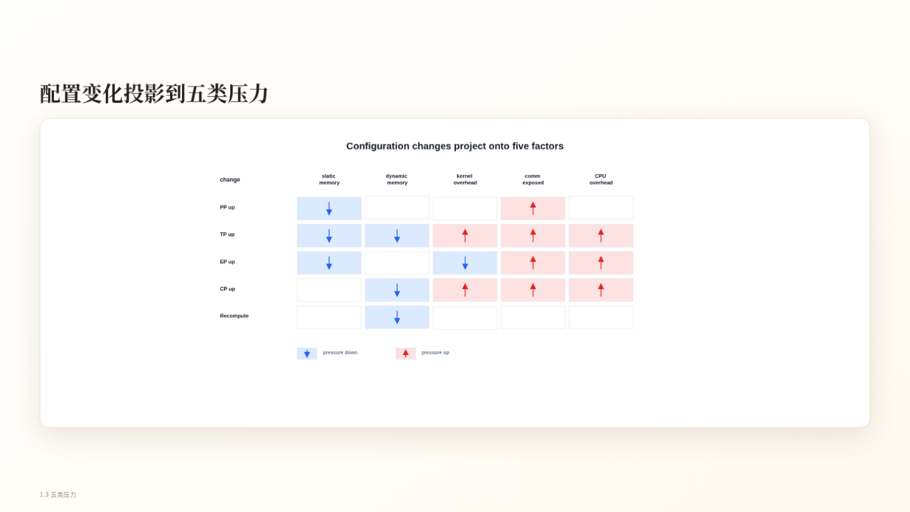

*Figure 2: Arrows indicate the direction in which pressure changes; a blank cell does not mean the effect is zero. Source: presentation slide 7.*

The five categories of pressure are:

- **Static memory**: Memory occupied by model states such as parameters, gradients, and optimizer states;
- **Dynamic memory**: Memory usage that varies with sequences, batches, and intermediate activations;
- **Kernel overhead**: Efficiency loss caused by fragmented computation or degraded matrix shapes after partitioning;
- **Exposed communication**: Communication time that cannot be hidden by computation and therefore enters the critical path directly;
- **CPU overhead**: Host-side pressure from kernel launches, communication scheduling, and similar operations.

Reading the matrix dimension by dimension:

**Increasing PP** partitions the model into more pipeline stages, primarily reducing the static state handled by each stage, but it also increases pipeline bubbles. PP does not reduce dynamic memory as directly because pipeline scheduling may require some stages to retain activations from multiple microbatches simultaneously.

**Increasing TP** can reduce both static and dynamic memory, but it also partitions matrices into narrower pieces, potentially degrading kernel shapes. Collective communication increases accordingly, while shorter and more fragmented computation makes CPU scheduling overhead easier to expose.

**Increasing EP** reduces the number of experts held by each rank, lowering static memory and changing the workload size of grouped GEMMs. The cost is that dispatch and combine require more all-to-all communication, increasing exposed communication and CPU pressure. The transcript also notes that expert imbalance may increase dynamic memory, but the slides do not quantify this relationship.

**Increasing CP** directly partitions the sequence and primarily relieves dynamic memory pressure. At the same time, local computation becomes shorter, potentially increasing pressure from kernels, communication, and CPU scheduling.

**Enabling recomputation** trades repeated forward computation for retaining fewer activations. The directly supported benefit in the source material is lower dynamic memory, not lower static memory.

These arrows indicate only the direction of the effect. They are not tied to specific starting and ending configurations, nor do they imply that the magnitude remains constant across models and hardware.

### Why Local Sequence Length Amplifies the Coupling

The presentation uses a simplified relationship. Let the global sequence length be \(S\):

\[
S_{\text{local}}=\frac{S}{TP\times CP}
\]

For example, when \(S=128K\), \(TP=2\), and \(CP=2\):

\[
S_{\text{local}}=\frac{128K}{2\times2}=32K
\]

If CP is increased from 2 to 4, the local sequence length is further reduced to 16K. This generally helps with dynamic memory, but it also means that each local computation lasts for less time, making kernel launches, communication, and CPU scheduling more difficult to hide behind sufficiently long compute intervals.

Local sequence length is therefore a result of TP and CP, but it also feeds back into kernel shapes and the amount of exposed communication. Although PP and EP do not appear in this simplified formula, they change stage partitioning, expert computation, and communication topology. Recomputation changes which activations must be retained.

The resulting causal chain is:

> Parallelism and recomputation configuration  
> → Per-GPU model-state and activation sizes  
> → Local sequence length and kernel shapes  
> → Whether communication can be hidden by computation  
> → Whether CPU scheduling becomes exposed.

This is only the simplified relationship used in the presentation and should not be generalized into a universal formula for all sequence-parallel implementations. The `local_tokens` value in the later logits example must likewise be interpreted according to the definition used on that slide; it should not be conflated with the local sequence length used here.

### Practical Consequences in the Configuration Matrix

Why examine the following configuration matrix? Because it demonstrates a direct consequence of this coupling: many combinations are not merely “somewhat slower”—they cannot run at all.

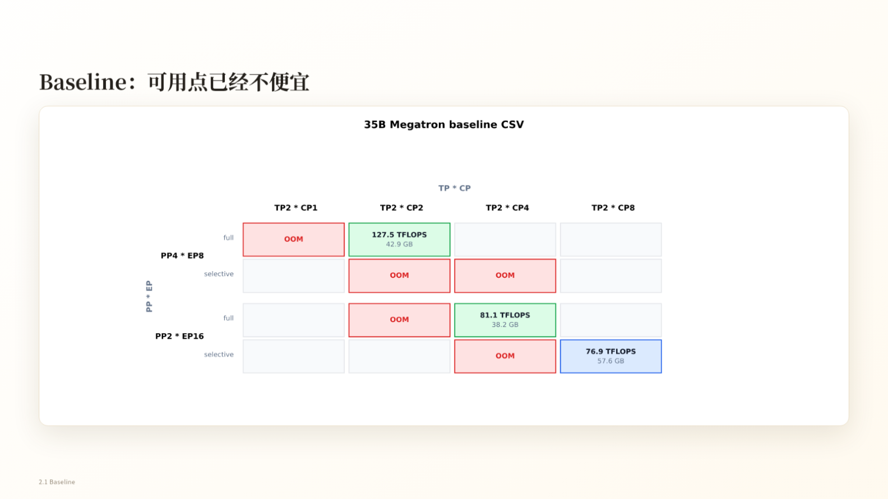

*Figure 3: The horizontal axis is TP×CP, while the vertical axis groups configurations by PP×EP and recomputation strategy; red cells indicate OOM. Source: presentation slide 9.*

In the 35B Megatron baseline, `PP4×EP8 + full recompute + TP2×CP2` is one runnable point. The slide reports:

- 127.5 TFLOPS/GPU;
- 42.9 GB peak memory.

Several surrounding cells are OOM. However, different cells often change multiple parallelism parameters simultaneously, so they cannot support single-variable causal attribution. Blank cells only mean that the slide provides no result; they cannot be labeled as OOM or untested without evidence.

The slide does not fully specify the TFLOPS measurement methodology, GPU count, sequence length, batch size, or memory-capacity limit. It can therefore demonstrate that the search space is highly coupled and contains many OOM configurations, but not that any one parallelism dimension provides a fixed benefit.

PP also introduces an additional scheduling boundary. An example from the Q&A states that if `PP=8` and there are only eight microbatches, the pipeline bubble is approximately 50%, with compute time and bubble time being roughly equal. This figure is supported only by the transcript and applies only to that example; it cannot be generalized into a fixed efficiency figure for PP=8.

The baseline therefore yields the first clear lesson: separate resource responsibilities before comparing throughput. The conflict between dynamic activations and local sequence length must be addressed first, leading to a seemingly counterintuitive choice—accepting full recomputation.

---

## 3. The First Counterintuitive Choice: Trading Full Recomputation for a Larger Local Sequence

This section answers the following question: why choose full recompute despite knowing that it increases computation?

First, distinguish between two strategies:

- **Full recompute**: Discard the corresponding activations after each layer’s forward pass and rerun the required computation when backpropagation reaches that layer;
- **Selective recompute**: Recompute only some operations while retaining the remaining activations.

The source material does not provide the complete coverage of selective recompute, so this article does not infer a specific list of operators.

### Why “Less Recomputation” Can Trigger Cascading Pressure

Avoiding full recompute saves recomputation FLOPs but requires retaining more activations. For long sequences, this can create the following chain:

> Retain activations  
> → Dynamic memory remains under pressure  
> → Local sequence length must be reduced  
> → CP must be increased  
> → Local computation becomes more fragmented  
> → Kernel and CPU launch overhead becomes easier to expose  
> → CUDA Graph is also pulled into the coupled tuning scope.

CUDA Graph reduces CPU kernel-launch overhead by recording and replaying GPU scheduling. Along this path, it is not an isolated switch. Instead, it becomes a prominent optimization only after the chain of “insufficient memory—increased partitioning—fragmented computation.”

However, the source material does not provide controlled comparisons of throughput, memory, and latency for this path under an otherwise identical configuration. The description above is therefore a chain of design trade-offs, not a quantitative conclusion.

### Path B: Free Activations First, Then Lengthen the Local Compute Window

Why examine the following figure? Because it shows both the benefit chain of full recompute and the cost that must be paid.

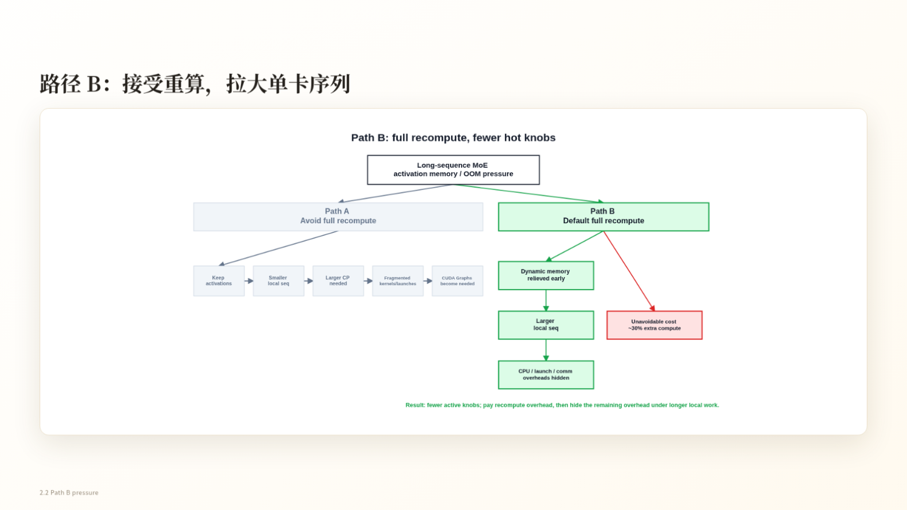

*Figure 4: Path B trades additional computation for earlier release of dynamic memory and a larger local sequence length. Source: presentation slide 11.*

The benefit path in the figure contains three key stages:

1. **Relieve dynamic memory pressure earlier.**  
   Activations are no longer retained for an extended period after each layer’s forward pass. The memory released here is activation memory—not parameters, gradients, optimizer states, or all loss-side allocations.

2. **Allow a larger local sequence length.**  
   Once dynamic memory is freed, the system can reduce sequence partitioning that was performed solely to suppress activation peaks, allowing each GPU to process a longer local sequence.

3. **Provide a longer hiding window.**  
   As local computation lasts longer, CPU scheduling, kernel launches, and communication gain opportunities to overlap with computation, reducing the fraction exposed on the critical path.

The other branch in the figure represents the cost: approximately **30% additional computation**. This is the approximate FLOPs cost reported in the source material; it does not mean that end-to-end training time must increase by 30%. If the larger local sequence improves kernel workload granularity and hides some scheduling and communication overhead, the relationship between additional computation and final training time will not remain a simple one-to-one correspondence.

Likewise, “hiding overhead” does not mean that the overhead disappears. The actual outcome still depends on compute duration, communication timing, and the achievable degree of overlap.

The essence of full recompute is to trade a predictable recomputation cost for dynamic memory, then use the freed capacity to increase per-GPU workload. But it directly addresses only activations. Once the activation peak is reduced, full fp32 logits and static model states become the next memory constraints.

---

## 4. Removing Two More Memory Peaks: Linear CE and FSDP2

After increasing the local sequence length, the memory problem shifts from “how many activations must be retained” to two other sources:

- Full `logits` that may be materialized during loss computation;
- Long-lived parameters, gradients, and optimizer states.

These have different lifetimes and arise for different reasons, so they must be handled separately.

### Linear CE: Avoiding Materialization of Full Logits

`logits` are the outputs expanded along the vocabulary dimension before cross-entropy. Define:

- `local_tokens`: The number of local tokens under the loss-computation convention currently in use;
- `vocab_partition`: The size of the vocabulary partition handled by the current rank;
- Each fp32 element occupies 4 bytes.

If the implementation generates and retains full fp32 logits, the estimated memory usage is:

\[
M_{\text{logits}}
=
\text{local\_tokens}
\times
\text{vocab\_partition}
\times
4\ \text{bytes}
\]

Why examine the following figure? Because it shows that merely reallocating partitioning between TP and CP does not necessarily reduce the product that determines the size of full logits.

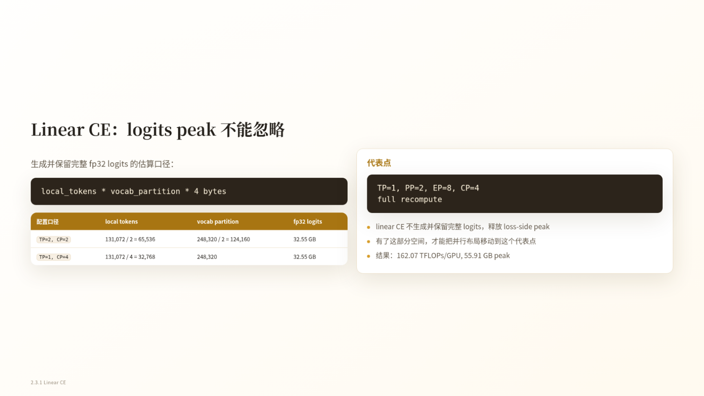

*Figure 5: The full-logits estimation formula, two TP/CP partitioning schemes, and a representative configuration after adopting Linear CE. Source: presentation slide 12.*

The slide gives two examples:

| Configuration | `local_tokens` | `vocab_partition` | Full fp32 logits |
|---|---:|---:|---:|
| TP=2, CP=2 | 65,536 | 124,160 | Approximately 32.55 GB |
| TP=1, CP=4 | 32,768 | 248,320 | Approximately 32.55 GB |

For the first configuration:

\[
65{,}536\times124{,}160\times4
\approx32.55\ \text{GB}
\]

For the second configuration:

\[
32{,}768\times248{,}320\times4
\approx32.55\ \text{GB}
\]

When the partitioning share of TP and CP is reallocated between the token and vocabulary dimensions, one local dimension may shrink while the other grows proportionally, leaving their product unchanged.

Linear CE, or Linear Cross Entropy, directly targets this peak. It organizes the linear output and cross-entropy computation so that full logits do not have to be generated and retained. Its significance is not that approximately 32.55 GB is allocated and then freed, but that this complete tensor never needs to become an intermediate state.

The 32.55 GB figure cannot simply be subtracted from peak training memory. The lifetimes of logits, activations, temporary buffers, and communication tensors may partially overlap, and the overall peak depends on actual execution timing. The source material also provides no otherwise identical controlled experiment with only Linear CE disabled.

After adopting Linear CE, the slide gives the following representative layout:

- TP=1;
- PP=2;
- EP=8;
- CP=4;
- Full recompute;
- 162.07 TFLOPS/GPU;
- 55.91 GB peak memory.

Because the parallel configuration also changes, the 162.07 TFLOPS/GPU result cannot be attributed to Linear CE alone. The reliable conclusion is that Linear CE addresses the materialization of full logits. If an implementation already uses chunking, fusion, or another path that avoids full materialization, this memory estimate cannot be applied directly.

### FSDP2: Reducing Long-Lived Static States

After the large loss-side tensor is removed, parameters, gradients, and optimizer states remain long-lived. This static state cannot be eliminated through activation recomputation; its size depends on the number of state replicas and the sharding strategy.

Why examine the following figure? Because it compares the sharding responsibilities of the distributed optimizer and FSDP2 and reports their memory difference under the same listed configuration.

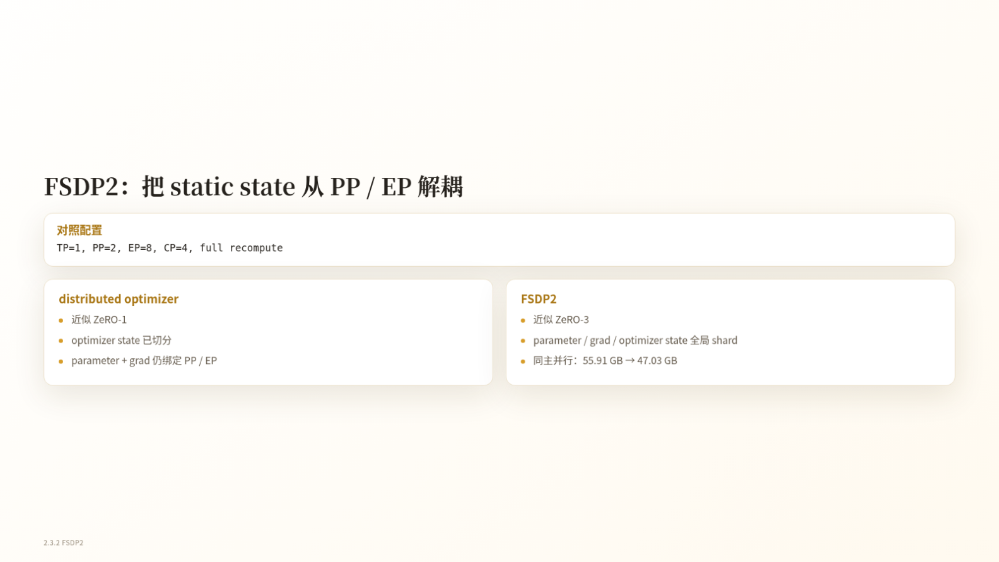

*Figure 6: State responsibilities and memory comparison between the distributed optimizer and FSDP2. Source: presentation slide 13.*

The slide summarizes the two approaches as follows:

| Approach | Optimizer states | Parameters and gradients | Slide analogy |
|---|---|---|---|
| Distributed optimizer | Sharded | Still constrained by the PP/EP topology, with corresponding redundancy retained | Approximately ZeRO-1 |
| FSDP2 | Globally sharded | Also globally sharded | Approximately ZeRO-3 |

“Approximately ZeRO-1” and “approximately ZeRO-3” are analogies intended to clarify the sharding level. They do not mean that these implementations are strictly equivalent to the standard ZeRO schemes.

Under the listed configuration of `TP=1, PP=2, EP=8, CP=4, full recompute`, the slide reports that peak memory falls from 55.91 GB to 47.03 GB, an absolute reduction of:

\[
55.91-47.03=8.88\ \text{GB}
\]

The slide does not provide throughput, communication volume, or the complete measurement methodology under the same configuration. Therefore, the 8.88 GB figure supports a reduction in static memory but cannot be used to infer an end-to-end performance benefit.

More importantly, FSDP2 reallocates responsibilities among the parallelism dimensions:

| Dimension | Primary responsibility in this case |
|---|---|
| CP | Adjust local sequence length to balance capacity and compute granularity |
| EP | Adjust MoE computation and communication |
| PP | Serve as an optional fine-tuning mechanism for peak memory or extreme performance |
| TP | Remain outside the default recipe and be re-enabled only for a clear model- or hardware-specific reason |

This is not a universal rule for all models and clusters. At larger scales, the communication scope of FSDP2 itself may become a constraint.

At this point, full recompute handles activations, Linear CE handles full logits, and FSDP2 handles static states. Once the system is no longer tuned primarily around OOM, the critical path naturally shifts to exposed all-to-all communication in MoE dispatch/combine.

---

## 5. From Serial All-to-All to Chunked EP: How Overlap Windows Emerge

This section answers the following question: under the full-recompute path, how can overlap between MoE communication and expert computation be re-established?

A typical MoE forward pass includes:

1. `dispatch`: Use all-to-all to send tokens to the ranks hosting their experts;
2. `grouped GEMM`: Perform grouped matrix multiplication for the experts;
3. `combine`: Use all-to-all to return expert outputs to the originating ranks.

FSDP2 does not automatically hide these two communication operations. The previous 1F1B overlap also depends on interleaving between different microbatches or pipeline stages, and the presentation argues that it does not fit the current full-recompute path.

The problem therefore becomes: without eliminating all-to-all, how can we recreate windows in which communication and computation can make interleaved progress?

### Token Chunking Provides Scheduling Freedom

Why examine the following figure? Because it illustrates the minimal mechanism of chunked EP: dependencies within each chunk remain unchanged, while opportunities for interleaving across chunks are introduced.

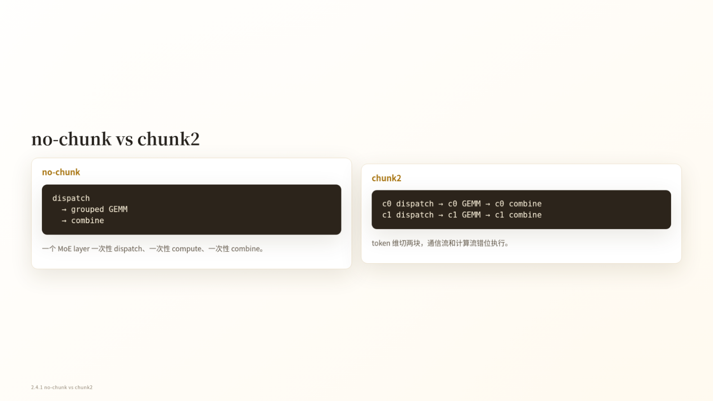

*Figure 7: An MoE layer is split into two chunks along the token dimension. Source: presentation slide 16.*

The no-chunk path is:

```text
dispatch(all tokens)
    → grouped GEMM(all tokens)
    → combine(all tokens)
```

The three steps have direct data dependencies. GEMM must wait for dispatch, and combine must wait for GEMM. Even when communication and computation use separate CUDA streams, a single large batch contains no independent work that can make progress concurrently.

Chunk2 divides the token dimension into `c0` and `c1`:

```text
c0 dispatch → c0 GEMM → c0 combine
c1 dispatch → c1 GEMM → c1 combine
```

Each chunk still follows the same internal dependencies, but the two chunks can be staggered:

- Once `c0` enters grouped GEMM, the communication stream has an opportunity to advance `c1 dispatch`;
- When `c1` enters computation, the communication stream can advance a combine whose dependencies have already been satisfied;
- Some all-to-all communication can therefore enter the time window occupied by another chunk’s expert computation.

The mechanism can be condensed as follows:

> Token chunking  
> → Smaller units of communication and computation  
> → Communication from one chunk becomes schedulable while another chunk computes  
> → Communication and computation streams make staggered progress  
> → Some all-to-all communication is no longer fully exposed.

The two logical chains in the figure do not mean that `c0` and `c1` run fully in parallel from beginning to end. Each chunk’s GEMM must still wait for its own dispatch, and its combine must still wait for its own GEMM. Chunking also adds scheduling, synchronization, and operator invocations; the source material does not quantify these fixed costs.

### Forward Trace: The Critical Window Shrinks from Approximately 10.06 ms to 7.81 ms

Why examine the following trace? Because it maps the abstract idea of “dual-stream overlap” onto an actual timeline.

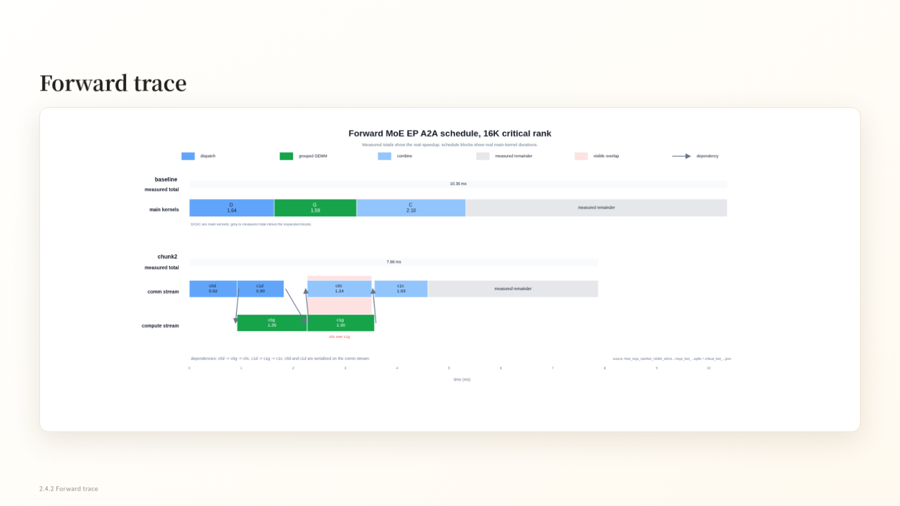

*Figure 8: Forward MoE EP all-to-all scheduling comparison under the 16K critical-rank condition. Source: presentation slide 17.*

In the figure, the communication stream handles all-to-all operations, while the compute stream handles grouped GEMMs. Cross-stream arrows indicate data dependencies: a successor operation cannot begin before the arrow reaches it. CUDA waiting regions indicate that an operation is still waiting for dependencies or execution conditions and should not be treated as useful computation.

In the baseline, dispatch, grouped GEMM, and combine are arranged mostly serially, with a measured total of approximately **10.06 ms**.

With chunk2, the two grouped GEMMs make staggered progress with multiple communication segments, yielding a measured total of approximately **7.81 ms**. The observed window is shortened by approximately:

\[
10.06-7.81=2.25\ \text{ms}
\]

This demonstrates effective overlap within the forward window of this critical rank, but it does not mean that all-to-all has been completely hidden. Waiting regions remain in the figure, and the result is neither an average across all ranks nor the duration of a complete training step.

### Backward Trace: Chunk dgrad and Delay wgrad

Why examine the following figure? Because backward scheduling must determine not only when communication occurs, but also when dgrad and wgrad occupy the compute stream.

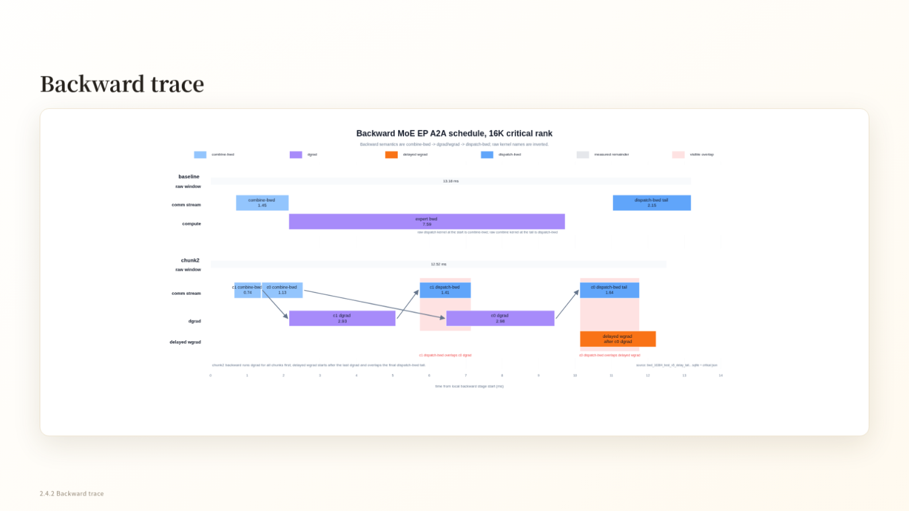

*Figure 9: Backward MoE EP all-to-all scheduling comparison under the 16K critical-rank condition. Source: presentation slide 18.*

Here:

- **dgrad** is the gradient computation for input data or activations;
- **wgrad** is the weight-gradient computation.

The baseline raw window is approximately **13.83 ms**.

Chunk2 advances dgrad chunk by chunk, interleaving one chunk’s dgrad with backward all-to-all operations whose dependencies have already been satisfied for another chunk. Wgrad is moved into a delayed-wgrad region and executed after the critical communication and dgrad path has advanced, preventing it from occupying the compute stream too early.

The chunk2 raw window is approximately **10.81 ms**, a reduction of:

\[
13.83-10.81=3.02\ \text{ms}
\]

However, the raw window may not cover the completion of all backward work. The delayed wgrad still has to execute, so the 3.02 ms reduction cannot be interpreted directly as the savings for the complete backward pass or full training iteration.

### Fusing Recomputation Forward and Backward Remains an Ideal Schedule

The presentation also shows a timeline explicitly labeled **ideal**. It organizes the recomputation forward pass and backward pass into a continuous schedule: the forward grouped GEMM is immediately followed by chunked dgrad, backward communication enters the communication stream once dependencies are satisfied, and wgrad remains delayed.

This timeline shows that chunk boundaries could potentially extend across the “recomputation forward–backward” transition, thereby enlarging the overlap window. However, it represents a target mechanism rather than a measured end-to-end result. The source material does not report the complete latency, throughput improvement, or training-step speedup for this fused schedule.

The essence of chunked EP is therefore to trade token chunking for scheduling freedom. Its benefit depends on local sequence length, expert load balance, the relative durations of communication and GEMM, and the additional launch and synchronization costs.

---

## 6. How to Read the Evidence: Single-Layer Trends, the Full Path, and Attribution Boundaries

The forward and backward traces establish only that the mechanism works within a local window on the 16K critical rank. Determining whether the benefit grows with sequence length requires a sequence sweep, while evaluating the final level reached by the full approach requires examining the combined optimization path.

These three forms of evidence have different scopes:

| Evidence | What it can answer | What it cannot answer |
|---|---|---|
| Critical-rank trace | Whether local timing on the critical rank forms an overlap | Average latency across all ranks or full-training-step speedup |
| Single-layer proxy experiment | Trends for a single sparse MoE layer as sequence length grows | Full-model memory or end-to-end throughput |
| Combined-path summary | Whether the complete approach advances the runtime point to higher throughput | The independent speedup of each technique |

### Single-Layer Proxy Experiment: Larger Relative Gains Observed at Longer Local Sequences

The experimental target is one sparse MoE layer from Qwen3.5-35B-A3B. Only forward+backward is measured; attention and other Transformer layers are not included.

Why examine the following figure? Because the main point is not any single data point, but the difference in slope between the baseline and optimized memory curves.

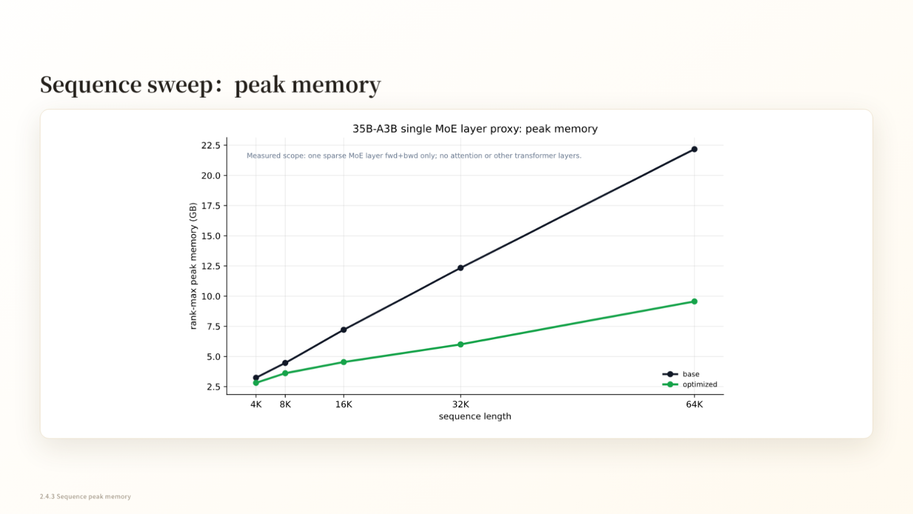

*Figure 10: Rank-max peak memory for a single sparse MoE layer at different local sequence lengths. Source: presentation slide 20.*

The vertical axis uses **rank-max peak memory**: peak memory is recorded for every rank, after which the maximum is taken. This metric is suitable for determining whether the most memory-constrained rank prevents the system from running, but it is not the average memory usage across all GPUs.

The horizontal axis covers local sequence lengths of 4K, 8K, 16K, 32K, and 64K. Both curves rise with sequence length, but the optimized curve has a lower slope. At 64K, approximate readings from the figure are:

- Baseline: approximately 22.2 GB;
- Optimized: approximately 9.6 GB.

These values are approximate readings from the figure and should not be presented as exact measurements supplied by the slide. The more defensible conclusion is that, in this single-layer proxy experiment, the gap between the two memory curves widens as the sequence length increases.

The corresponding relative speedups for single-layer forward+backward are:

| Local sequence length | Speedup relative to baseline |
|---:|---:|
| 4K | 7.8% |
| 8K | 8.5% |
| 16K | 12.9% |
| 32K | 18.4% |
| 64K | 24.0% |

These data show that the relative benefit increases with local sequence length over the measured range. One possible explanation is that longer local compute intervals amortize fixed scheduling and operator-invocation costs while providing more work for chunk scheduling and communication overlap. However, the existing sequence sweep cannot independently prove this mechanistic explanation or exclude other implementation factors.

In particular, the 24.0% result at 64K applies only to forward+backward for this single sparse MoE layer. It excludes attention and cannot be restated as a 24.0% speedup for the complete training step.

### Combined Path: How to Interpret “Nearly 190 TFLOPS/GPU”

Why examine the following figure? Because it simultaneously shows changes in optimization methods, parallel configurations, throughput, and peak memory. Omitting any one of these columns can lead to incorrect attribution.

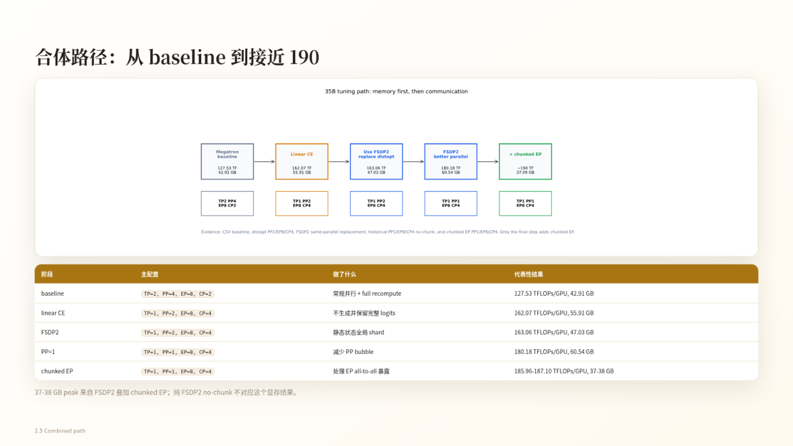

*Figure 11: An optimization path in which throughput, peak memory, and parallel configuration all change. Source: presentation slide 22.*

The slide reports the following representative stages:

| Stage | TP/PP/EP/CP | TFLOPS/GPU | Peak memory |
|---|---|---:|---:|
| Baseline | 2/4/8/2 | 127.53 | 42.91 GB |
| Linear CE | 1/2/8/4 | 162.07 | 55.91 GB |
| FSDP2 | 1/2/8/4 | 163.06 | 47.03 GB |
| PP2→PP1 | 1/1/8/4 | 180.18 | 60.54 GB |
| Chunked EP | 1/1/8/4 | 185.96–187.10 | 37–38 GB |

The transition from the first stage to the second not only introduces Linear CE but also changes TP, PP, and CP. The difference between 127.53 and 162.07 therefore cannot be attributed entirely to Linear CE.

Under the same listed parallel configuration, the FSDP2 stage moves from 162.07 to 163.06 TFLOPS/GPU, while the clearer change is the reduction in peak memory from 55.91 GB to 47.03 GB. The comparison does not provide the complete throughput measurement conditions, so the performance difference should not be decomposed further.

The path then changes PP from 2 to 1. The slide reports that throughput reaches 180.18 TFLOPS/GPU while peak memory rises to 60.54 GB. Because this remains a stage transition within a combined path, the available material cannot rigorously attribute the throughput difference to reduced pipeline bubbles, nor can it establish that the PP adjustment was enabled solely by the memory change in the previous stage.

The chunked EP stage retains `TP=1, PP=1, EP=8, CP=4`, with both higher throughput and approximately 37–38 GB of peak memory observed. Together with the earlier single-layer mechanism and traces, this confirms that chunking provides scheduling granularity for overlapping communication and computation. However, there is no controlled experiment that isolates chunked EP’s independent contribution to the final change in peak memory.

The flowchart on the slide summarizes the final result as approximately **190 TFLOPS/GPU and 37.09 GB**; the table records the more specific range of **185.96–187.10 TFLOPS/GPU and 37–38 GB**. The former is an approximate summary, while the latter is the representative range shown on the slide. They cannot be combined into the claim “exactly measured at 190 TFLOPS/GPU.”

These results therefore support the following conclusion:

> The combined approach advances representative throughput from 127.53 TFLOPS/GPU to nearly 190 TFLOPS/GPU, with approximately 37–38 GB of peak memory observed in the final stage.

They do not support the following claim:

> Linear CE, FSDP2, reducing PP, and chunked EP each contribute a specific independent amount of speedup or memory savings.

The entire path should be understood as a combined optimization, rather than decomposing differences between adjacent stages into the benefits of individual techniques.

---

## 7. Converging the Search Space: From a Four-Dimensional Blind Search to a Constraint-Driven Recipe

Once the combined path has been shown to work, the next question is how to avoid continuing to exhaustively enumerate PP, TP, EP, and CP.

The core method is not to search for optimal values first, but to assign each dimension a responsibility and then use memory and communication constraints to eliminate unnecessary degrees of freedom.

Why examine the following figure? Because it compresses the four-dimensional coupled search on the left into three ordered configuration decisions on the right.

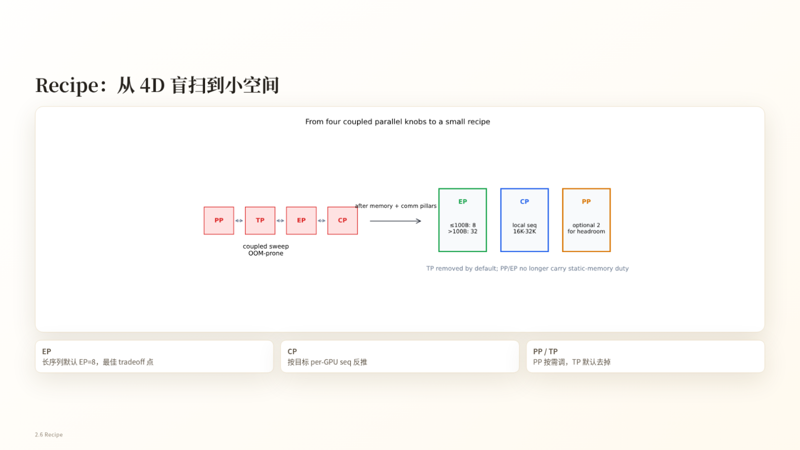

*Figure 12: Narrowing the parallel-configuration space using memory and communication constraints. Source: presentation slide 23.*

The arrows in the figure do not represent tensor flow. They represent the process by which the search space converges:

1. First, determine EP under MoE communication and topology constraints;
2. Then derive CP from the target local sequence length;
3. Finally, decide whether PP is needed to provide additional memory headroom;
4. Remove TP from the default recipe.

### Step 1: Establish a Default Starting Point for EP

The current case uses `EP=8` as the default compromise instead of continuing to treat EP as a free search dimension.

Increasing EP reduces the number of experts held by each rank, but it changes the scope of all-to-all communication and may worsen expert load imbalance. EP is constrained first by MoE communication and topology, not by a simple rule that more GPUs should always imply a larger EP value.

The figure also includes an EP threshold expressed in units of `B`, but the source material does not define what `B` means. The article therefore cannot convert it into tokens, batch size, or parameter scale.

### Step 2: Derive CP from the Target Local Sequence Length

This case aims to keep the local sequence length on each GPU within 16K–32K. Using the simplified relationship from the presentation:

\[
S_{\text{local}}
\approx
\frac{S_{\text{global}}}{TP\times CP}
\]

With the default `TP=1`, a 128K global sequence gives:

| CP | Simplified estimated local sequence length | Position |
|---:|---:|---|
| 4 | 32K | Upper bound of the target interval |
| 8 | 16K | Lower bound of the target interval |

The CP candidates can therefore first be narrowed to 4–8 rather than beginning with a blind search across many combinations.

This is only the minimal reverse-calculation example. The actual mapping still depends on the specific implementation and other parallel dimensions, so this formula should not be treated as a complete memory and execution model.

### Step 3: Use PP Only for Optional Headroom and Keep TP Disabled by Default

In the current recipe:

- `PP=2` is enabled only when additional memory headroom is needed;
- TP remains disabled by default unless there is a clear model- or hardware-specific reason to use it;
- TP is reintroduced only when new capacity or topology constraints emerge.

The final decision rules can be condensed as follows:

1. Start with `EP=8` by default;
2. Derive CP from a target local sequence length of 16K–32K per GPU;
3. Evaluate `PP=2` only when memory headroom is insufficient;
4. Re-enable TP only when a clear constraint requires it.

This parallel configuration depends on four technical pillars:

| Technical component | Primary resource problem addressed |
|---|---|
| Full recompute | Trade additional computation for a larger local sequence length |
| Linear CE | Avoid the full fp32-logits peak |
| FSDP2 | Shard parameters, gradients, and optimizer states |
| Chunked EP | Handle exposed MoE all-to-all communication |

These four components have a compositional relationship; the table does not imply a strict order of execution.

This method applies only to the current model, 32 H100 GPUs, a 128K global sequence, and the implementation context of the presentation. It provides a way to narrow the search space, not a universally optimal configuration for all MoE clusters.

---

## 8. Turning Optimizations into Primitives: Reducing the Radius of Integration and Validation

Even after the configuration space converges, engineering changes may still span multiple training paths. This section asks: how can FSDP2, Linear CE, and chunked EP be integrated in a way that supports localized development and paired validation?

Combining FSDP2 with multidimensional parallelism affects process groups, parameter gathering, gradient sharding, optimizer states, checkpoints, and recomputation. Combining chunked EP with full recompute changes dispatch/combine timing, forward and backward dependencies, delayed-wgrad placement, and buffer lifetimes.

The source material does not quantify development time or the amount of code changed, but it clearly indicates that the primary cost lies in engineering integration and validation rather than in whether the underlying kernels can perform the computation.

### Runtime, Model, and Primitive Layers

Why examine the following figure? Because it represents the organization of engineering responsibilities, not tensor data flow during training.


*Figure 13: Megatron-Lite reorganizes the system while reusing the underlying kernels from Megatron-Core. Source: presentation slide 26.*

The three layers are responsible for:

- **Runtime**: How the training protocol and runtime process advance;
- **Model**: Connecting and composing the capabilities required by the model;
- **Primitive**: Providing replaceable loss, state-sharding, or communication capabilities.

The arrows in the figure indicate architectural organization: Runtime uses the composed primitives through Model. They do not indicate communication direction, memory timing, or tensor-transfer timing.

This organization creates a smaller validation loop:

> Define capability boundaries  
> → Replace the implementation locally  
> → Perform paired comparisons under fixed measurement conventions  
> → Recompose after validation passes  
> → Reduce the scope of integration and regression testing.

The source material does not provide formal interface definitions for the three layers, so specific class structures or invocation constraints cannot be inferred.

### Three Optimizations Correspond to Three Types of Primitive

| Optimization | Primitive boundary | Primary validation concern |
|---|---|---|
| Linear CE | Loss | Loss correctness and the logits peak |
| FSDP2 | Optimizer/state sharding | Sharding of parameters, gradients, and optimizer states |
| Chunked EP | MoE communication | Whether all-to-all overlaps with computation |

This is a mapping of functional boundaries, not an execution order.

Linear CE answers whether the loss is correct and whether the full-logits peak is reduced. FSDP2 answers whether states are sharded as expected. Chunked EP answers whether dispatch/combine timing creates effective overlap. Their inputs, outputs, and test metrics differ, so the same set of performance figures cannot be used interchangeably across them.

### Paired Testing: Validate Correctness and Performance Separately

The development loop proposed in the presentation contains four steps:

1. **Skill**: Read the primitive’s documentation to confirm its capability boundaries and validation methodology;
2. **Change**: Modify the local implementation;
3. **Paired test**: Run the new and old implementations as a pair;
4. **Compose**: After the test passes, compose the new primitive back into the model.

The paired test checks four metrics:

- `loss`: Whether the losses align;
- `grad`: Whether the gradients align;
- `peak`: Whether peak memory matches expectations;
- `time`: Whether execution time regresses or improves.

Here, `loss` and `grad` concern numerical correctness, while `peak` and `time` concern resources and performance. Performance improvements cannot substitute for numerical correctness, and passing numerical checks does not mean that performance targets have been met.

The source material does not provide error tolerances, random seeds, control baselines, test hardware, the success rate of automated modifications, or the proportion of cases requiring manual intervention. Paired testing can therefore currently be understood only as a validation framework, not as evidence that a complete automated acceptance standard has already been established.

The speaker also claims that Megatron-Lite and Megatron-Core reuse the same underlying kernels and therefore have completely identical performance and accuracy. The transcript further suggests that the lightweight path may be faster after removing some CPU-side conditional checks. These claims lack same-configuration benchmarks, error ranges, and independent validation. Identical kernels alone do not automatically imply identical end-to-end behavior, and “may be faster” remains a hypothesis requiring validation.

Megatron-FSDP, training-oriented mega kernels, multi-LoRA, QAT, broader model support, asynchronous rollout, and weight resharding are all future plans and must not be treated as delivered and validated capabilities.

---

## Conclusion and Limitations

The value of this optimization path lies not in simply stacking techniques, but in assigning each category of resource pressure a relatively clear handling mechanism.

1. **The primary challenge of long-sequence MoE RL is runnability and experimental efficiency.**  
   Supporting a 128K global sequence on 32 H100 GPUs establishes a stable starting point for concurrent experiments and rapid iteration; it is not a discussion of peak performance after scaling the cluster without limit.

2. **PP, TP, EP, CP, and recomputation cannot be optimized independently.**  
   Together, they change static memory, dynamic memory, kernel granularity, exposed communication, CPU overhead, and local sequence length. A single runnable point cannot establish a single-variable causal conclusion.

3. **Full recompute trades additional computation for a larger local sequence length.**  
   The source material reports a cost of approximately 30% additional computation. It directly relieves activation memory and does not mean that training time must increase by 30%.

4. **Linear CE and FSDP2 address two different kinds of peaks.**  
   Linear CE avoids materializing full fp32 logits. FSDP2 shards parameters, gradients, and optimizer states so that static memory no longer depends primarily on PP and EP.

5. **Chunked EP creates communication-overlap windows through token chunking.**  
   The forward reduction of approximately 10.06→7.81 ms and backward raw-window reduction of approximately 13.83→10.81 ms demonstrate only local timing improvements on the 16K critical rank. They cannot be extrapolated into an average speedup for the complete training step.

6. **The combined path is effective, but individual contributions cannot be extracted from differences between stages.**  
   The representative result advances from 127.53 TFLOPS/GPU to nearly 190 TFLOPS/GPU; the table’s final range is 185.96–187.10 TFLOPS/GPU with 37–38 GB of peak memory. Because parallel configurations change between stages, these results cannot be used to calculate each technique’s independent contribution.

7. **The recipe and primitives reduce the search radius for runtime configurations and the validation radius for engineering changes, respectively.**  
   The current approach defaults to EP=8, derives CP from a target local sequence length of 16K–32K per GPU, uses PP=2 when needed, and keeps TP disabled by default. On the engineering side, loss, state sharding, and MoE communication are separated into primitives that can be tested in pairs.

Finally, three evidentiary boundaries must be preserved: the memory and speedup sweeps cover only forward+backward for a single sparse MoE layer; the forward and backward traces cover only the 16K critical rank; and the final recipe applies only to the current model, 32 H100 GPUs, and the implementation context of the presentation. It is a constraint-driven search methodology, not a universally optimal answer for every long-sequence MoE training workload.
