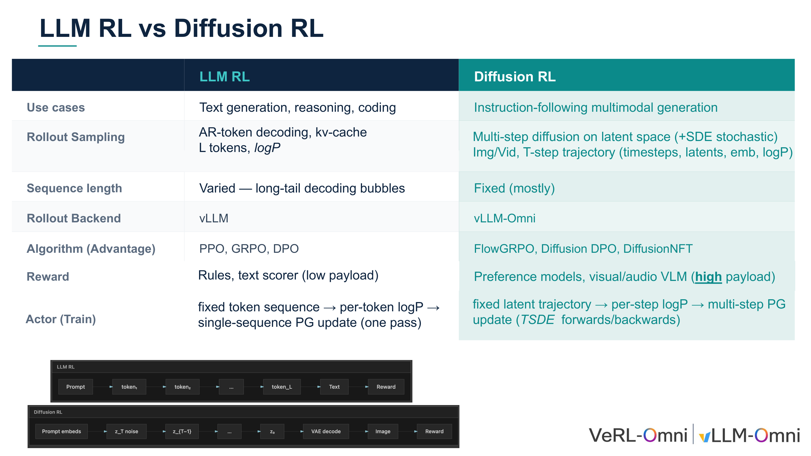
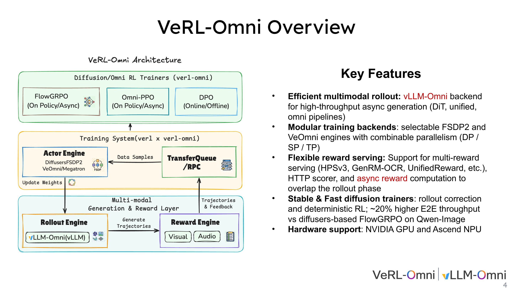
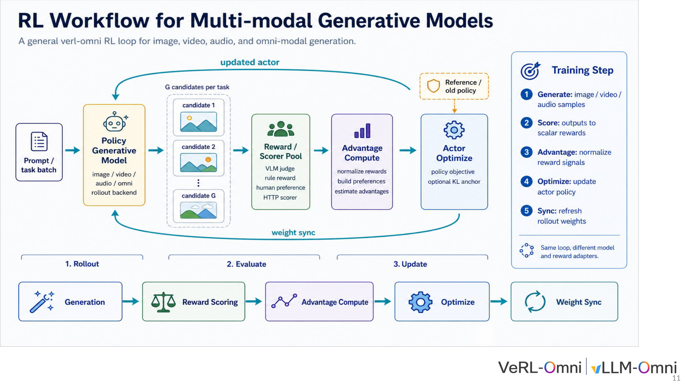
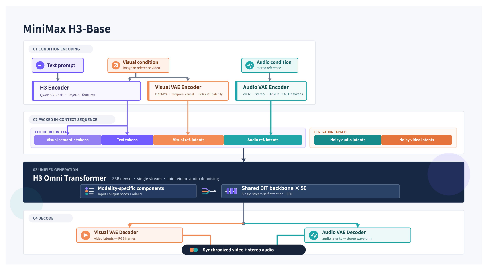
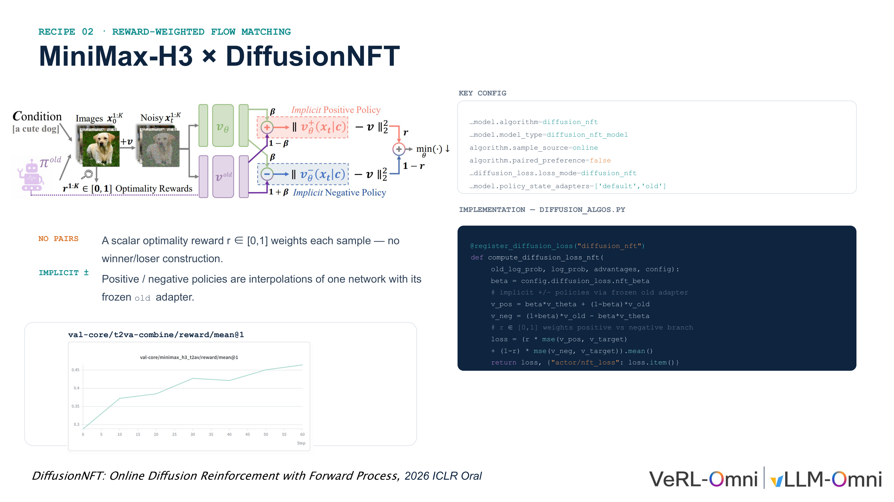
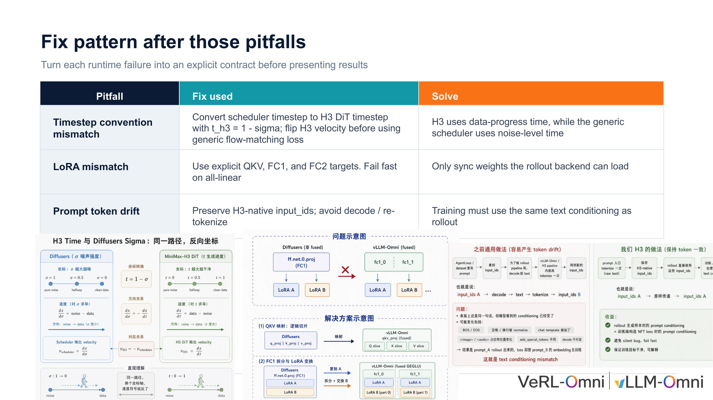
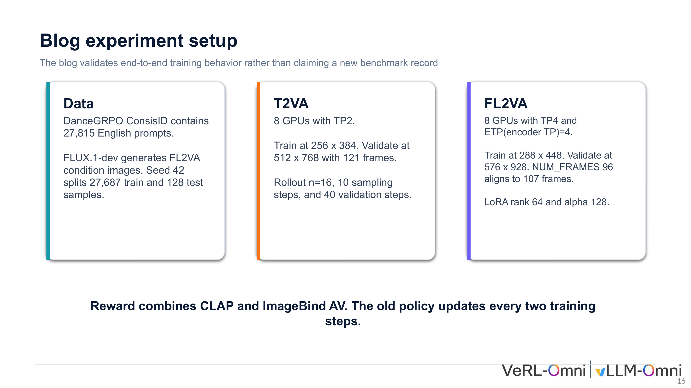
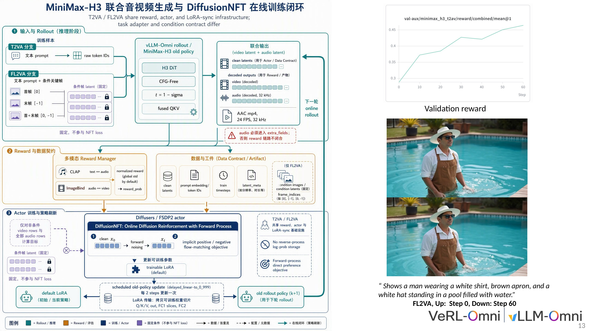
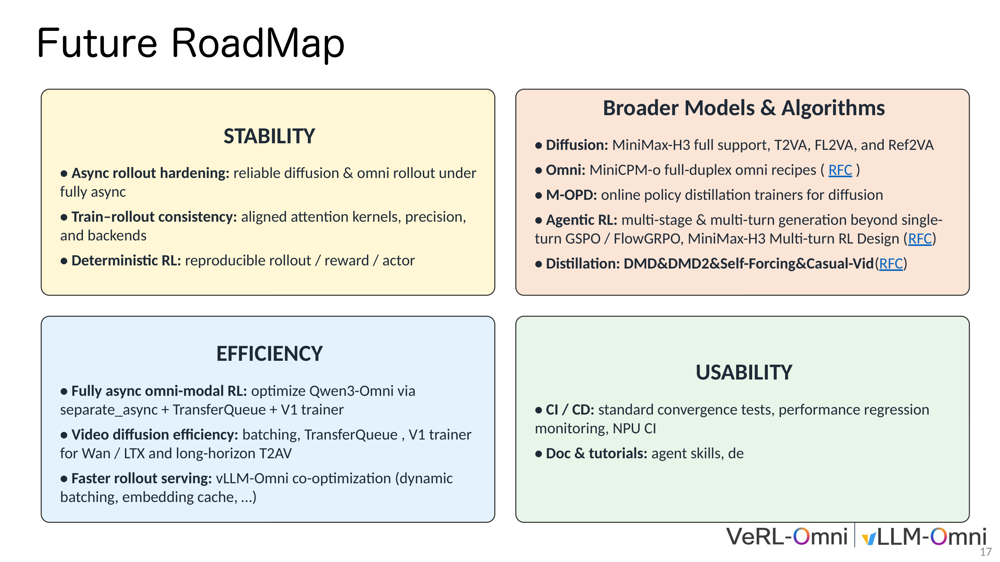

# Engineering Analysis of Multimodal Reinforcement Learning: VeRL-Omni Architecture and MiniMax-H3 Training Report

> **A Full-Stack Dissection from Low-Level Data Flow to GPU Memory Optimization**

**Source video**: [Bilibili BV1skYQ63EPW](https://www.bilibili.com/video/BV1skYQ63EPW) · **Slides**: [VeRL-Omni × MiniMax-H3 RL slides](https://drive.google.com/file/d/1yIzssbjSZQOL8SQvLfjKb6ZyK_k2Tyeb/view)

Reinforcement learning training for text-based large language models has matured into a well-established pipeline. However, when the same framework is applied to image generation, video generation, or even joint audio-video generation, fundamental differences in the underlying generation paradigm trigger a cascade of engineering mismatches—incompatible sampling backends, broken memory scheduling, and non-reusable training update logic. This article takes the open-source framework VeRL-Omni and the 33B-parameter MiniMax-H3 model as its central thread, starting from paradigm differences and proceeding layer by layer through architecture design, algorithm selection, engineering debugging, memory partitioning, and throughput optimization, to comprehensively dissect the key decisions and implementation details of post-training for multimodal diffusion models.

**Target Audience**: AI systems engineers, large model training researchers, multimodal algorithm engineers.

**Prerequisites**:

- Reinforcement learning fundamentals (policy gradient workflows of PPO / GRPO)
- Diffusion model principles (denoising iterations and flow matching)
- Distributed training fundamentals (tensor parallelism / LoRA fine-tuning)

**Reading Objectives**:

1. Understand the structural differences in low-level data flow between text RL and diffusion RL
2. Master VeRL-Omni's three-engine decoupled architecture and asynchronous communication mechanism
3. Identify three classes of latent failures—timestep misalignment, weight synchronization errors, and token drift—when integrating multimodal models into a general-purpose framework
4. Learn parallel partitioning strategies for large-parameter encoders under limited GPU memory, and throughput optimization methods for memory-bandwidth-bound scenarios

---

## I. Paradigm Conflict: Reinforcement Learning Differences Between Text Generation and Multimodal Diffusion

### Why the Same Training Stack Breaks Down

In the domain of text-based large language models, reinforcement learning based on PPO/GRPO already follows a standard workflow: the model decodes token by token in an **autoregressive (AR)** manner, and after sampling is complete, a single policy gradient update is applied to the entire sequence. However, when engineering teams attempt to port the same framework to image or video generation tasks, they immediately encounter a fundamental conflict in the underlying generation paradigm—**diffusion models (generative models that gradually restore target data from random noise through multi-step denoising)** do not produce discrete token sequences but instead perform multi-step denoising in a continuous latent space. The shape and length characteristics of their sampling trajectories, as well as their gradient backpropagation paths, are fundamentally different from AR decoding.

The figure below presents a side-by-side comparison of the two paradigms across multiple dimensions in RL training, with a schematic of the two generation pipelines shown at the bottom. This serves as the starting point for all engineering decisions throughout this article.

*Figure: Overview comparison of LLM RL and Diffusion RL, including the two generation pipeline schematics below. Source: Presentation slides, page 3*

The upper half of the figure is a multi-row comparison table; the lower half shows two generation pipelines:

- **LLM RL pipeline** (top): Prompt → token-by-token decoding → text → reward
- **Diffusion RL pipeline** (bottom): Prompt embedding → noise → multi-step denoising to obtain latent variables → VAE decoding → image → reward

The three most critical dimensions of difference are as follows.

### Difference 1: Sampling Method and Trajectory Structure

| Dimension | LLM RL | Diffusion RL |
|-----------|--------|-------------|
| Sampling process | AR token decoding, accelerated by KV-Cache | Multi-step denoising in latent space, may include SDE noise |
| Trajectory output | 1D token sequence + per-token log-probabilities | T timesteps × latent variables × per-step log-probabilities |

AR decoding generates only a single scalar token per step, whereas each step of diffusion sampling outputs a complete latent variable tensor whose size depends on the image resolution. This creates a fundamental divergence in memory footprint and throughput characteristics during the rollout phase: the bottleneck in text RL is long-tail decoding bubbles, while the bottleneck in diffusion RL is the batch storage and transfer of T-step trajectories.

### Difference 2: Sequence Length—Variable vs. Fixed

Text generation produces highly variable sequence lengths—short responses may be only a few dozen tokens, while long reasoning chains can reach thousands. The resulting **decoding bubbles**—where shorter sequences within the same batch idle while waiting for longer ones to finish—are a primary optimization target for inference engines such as vLLM.

In diffusion models, the number of denoising steps T is determined before inference (e.g., 20 steps, 50 steps), and all samples within the same batch have identical trajectory lengths. Fixed length eliminates decoding bubbles but introduces a new challenge: each denoising step is a full forward pass, with computational density far exceeding that of single-token decoding. Traditional vLLM techniques such as KV-Cache scheduling and continuous batching have no utility in this scenario.

### Difference 3: Training Update Path

- **LLM RL**: Freeze the token sequence, compute per-token log-probabilities, and execute a single policy gradient update.
- **Diffusion RL**: Freeze the latent variable trajectory, compute per-step log-probabilities, and execute multi-step policy gradient updates—requiring T steps of forward/backward propagation.

Multi-step updates cause the computational cost of a single training iteration to scale linearly with T, imposing memory scheduling demands far beyond those of text-based scenarios.

### Framework Positioning

The compounding effect of these three differences has a direct consequence: existing vLLM-based LLM RL frameworks cannot handle diffusion models—the sampling backend is mismatched, memory scheduling breaks down, and the training update logic cannot be reused. This is precisely the engineering starting point of **VeRL-Omni** (an open-source multimodal RL training framework designed specifically for diffusion and omni models). It replaces the inference backend from vLLM with **vLLM-Omni** (a high-throughput asynchronous rollout backend for efficient multimodal generation within VeRL-Omni), and at the algorithm layer supports specialized algorithms including **FlowGRPO** (an RL algorithm adapted for diffusion models), Diffusion DPO, and **DiffusionNFT** (an online diffusion RL algorithm that leverages the forward process and scalar optimality rewards, eliminating the need to construct win/loss pairs).

> **Summary:** The framework assumptions of text RL—variable-length discrete sequences, KV-Cache scheduling, single-step policy gradients—fail comprehensively when confronted with multi-step, fixed-length continuous latent variable trajectories. VeRL-Omni's core positioning is to bridge this paradigm gap at the system architecture level. The next step is to show how it coordinates three heterogeneous workloads—inference, scoring, and training—at the architectural level.

---

## II. Architecture Deconstruction: VeRL-Omni's Asynchronous Multimodal Data Flow

### How Three Heterogeneous Workloads Coexist in a Single Pipeline

A single iteration of multimodal RL involves three types of computation: **trajectory generation** requires high-throughput inference, **reward scoring** may invoke external vision-language models or rule engines, and **policy optimization** is standard gradient backpropagation. The three differ significantly in their demands for memory, compute, and communication bandwidth. If executed synchronously in serial, latency in any single stage blocks the entire pipeline.

VeRL-Omni's response is to map the three workloads to three independently schedulable engines, connected by asynchronous queues so that downstream stages can begin before upstream stages have fully completed.

### Three Engines + Asynchronous Channels

The figure below shows the overall system architecture of VeRL-Omni. Pay attention to the data flow between the three engines and the asynchronous channels that connect them.

*Figure: VeRL-Omni architecture overview, showing the three major engines of the training system and their interconnections. Source: Presentation slides, page 4*

The figure is divided top-to-bottom into an algorithm layer and a training system layer. The key components are as follows:

| Layer | Component | Responsibility |
|-------|-----------|----------------|
| Algorithm Scheduling | Diffusion/Omni RL Trainers | Selectable algorithms including FlowGRPO, Omni-PPO, DPO, etc. |
| Actor Engine | Diffusers / **FSDP2** (PyTorch Fully Sharded Data Parallel strategy) | Policy parameter storage and gradient updates, supporting DP/SP/TP combined parallelism |
| Rollout Engine | vLLM-Omni | High-throughput asynchronous generation |
| Reward Engine | Visual / audio scorers | Multi-dimensional scoring |
| Data Channel | **TransferQueue** / RPC | Cross-engine asynchronous data transfer |

Three core arrows represent the unidirectional data flow: ① **Weight synchronization** (Actor → Rollout): after each optimization round, the latest policy weights are pushed to vLLM-Omni; ② **Trajectory dispatch** (Rollout → Reward): candidate samples are sent to the reward engine for scoring; ③ **Data return** (Reward → Actor): scored trajectories and reward signals are returned via TransferQueue to form training data.

### Single-Batch Lifecycle: Five-Step Closed Loop

The figure below decomposes a single iteration into five ordered steps, with the bottom timeline summarized into three major phases. This is key to understanding the data flow timing.

*Figure: Complete workflow for multimodal RL training, showing the five-step cycle from prompt input to weight synchronization and the three-phase timeline. Source: Presentation slides, page 11*

**Phase 1 · Rollout (Generation)**

- **Step 1 — Generate**: A batch of prompts enters the policy model, and vLLM-Omni produces G candidate samples for each task.

**Phase 2 · Evaluate (Evaluation)**

- **Step 2 — Score**: The G candidates enter the Reward/Scorer Pool, which supports VLM judges, rule-based rewards, human preference signals, and general-purpose HTTP scorers working in parallel. Key design: **asynchronous reward computation**—scoring overlaps in time with the next rollout round, preventing GPU idle time.
- **Step 3 — Advantage**: Rewards are normalized, preference pairs are constructed, or advantage functions are estimated to provide signals for the policy gradient.

**Phase 3 · Update (Update)**

- **Step 4 — Optimize**: The Actor Engine computes the policy objective function, with optional KL anchoring to constrain the magnitude of policy drift.
- **Step 5 — Sync**: Updated weights are synchronized back to the Rollout Engine, and the loop enters the next iteration.

### TransferQueue's Asynchronous Pipelining Mechanism

TransferQueue is the asynchronous data channel connecting the Reward Engine and the Actor Engine. When the reward engine completes scoring for a subset of samples, it can immediately push the finished data into the queue without waiting for the entire batch; the Actor Engine side pulls available data from the queue to begin preprocessing. This mechanism transforms the serial "generate → score → return" pipeline into pipelined execution and is a critical scheduling technique for improving end-to-end throughput.

### Throughput Anchor Point

On **Qwen-Image** (a diffusion generation model supported by VeRL-Omni), VeRL-Omni achieved approximately **20% end-to-end throughput improvement** compared to the Diffusers-based FlowGRPO implementation (as noted in the written annotation on slide 4). The improvement comes from two sources: generation acceleration from replacing native Diffusers inference with vLLM-Omni, and the temporal overlap between asynchronous reward computation and rollout. Note that the presentation materials did not provide latency breakdown details or quantitative comparisons across different model scales; this figure applies only to the specific comparison condition of Qwen-Image + FlowGRPO.

> **Summary:** VeRL-Omni parallelizes the three heterogeneous workloads of trajectory generation, reward scoring, and policy optimization through three-engine decoupling and the TransferQueue asynchronous pipeline. Approximately 20% throughput gain was validated in the Qwen-Image scenario. With the general architecture in hand, the next step is to deploy it on a truly complex multimodal model—MiniMax-H3—to test the framework's capacity under extreme conditions.

---

## III. Target Model: MiniMax-H3's Unified Generation Mechanism and Challenges

### The RL Challenges of Three Modalities Sharing a Single Backbone

Is VeRL-Omni's general architecture sufficient to handle a truly complex multimodal model? MiniMax-H3 provides an extreme test case: it simultaneously accepts text, visual, and speech conditional inputs and uses the same set of parameters to generate synchronized audio and video. When RL training faces such a massive and coupled state space, memory budget, computational overhead, and cross-modal reward alignment each constitute independent challenges.

### Architecture Overview

The figure below shows MiniMax-H3's complete data flow from condition encoding to unified generation to audio-video decoding. Understanding this flow is the foundation for all subsequent engineering decisions.

*Figure: MiniMax-H3 architecture overview, showing the complete pipeline from three-modal condition encoding through the shared DiT backbone to audio-video decoding. Source: Presentation slides, page 8*

The figure is divided from left to right into four stages: **Condition Encoding → Packed In-Context Sequence → Unified Generation → Decode**.

### Condition Encoding: How Three Input Streams Converge

The **condition encoding module** is responsible for converting heterogeneous text, visual, and speech signals into unified latent space representations for input to the shared backbone network.

| Modality | Encoding Path | Output Form |
|----------|--------------|-------------|
| Text | Deep hidden features extracted via a 32B-parameter language model | Text condition vectors |
| Visual | Dual-branch—one branch extracts semantic features via the same language model, the other obtains visual latent codes via a visual **VAE** (Variational Autoencoder, an encoder that maps pixels to a low-dimensional continuous latent space) | Visual conditions + visual latent codes |
| Speech | Via Audio VAE, converting audio signals to discrete latent codes | Speech latent codes |

The three outputs are assembled into a packed sequence, with dedicated token IDs demarcating modality boundaries, then driven through causal attention for autoregressive generation. The condition encoding stage alone involves a 32B-scale encoder and two VAEs, making memory consumption already substantial on the encoding side.

### Unified Generation: Shared DiT Backbone

The central block in the figure is labeled H3 Omni Transformer, i.e., the **DiT** (Diffusion Transformer, a generative architecture combining the diffusion process with Transformer attention) backbone network, comprising **50 layers and 33B dense parameters**. Latent variables from all modalities interact within the same backbone through shared attention weights and **AdaLN** (Adaptive Layer Normalization) modulation parameters. The output of the **unified generation module** is split into visual and speech channels, each sent to the corresponding VAE Decoder to reconstruct pixels and waveforms, respectively.

### Three Layers of Pressure on RL Training

1. **Memory pressure**: The 33B dense model cannot fit on a single GPU at full precision; RL training additionally requires storing reference policy weights and optimizer states. The 32B encoder likewise needs to reside in memory or be offloaded on demand (the solution is detailed in Section VI).
2. **Computational overhead**: Forward-backward propagation through a 50-layer Transformer, compounded by multi-step denoising iterations, makes the computational cost of a single rollout far exceed that of pure text autoregressive generation.
3. **Cross-modal reward alignment**: Video quality, audio-visual synchronization, and semantic consistency each require different evaluation metrics. When these are compressed into a single scalar reward, gradient directions across modalities may conflict.

Consider the simplest degenerate case—text prompt only, no reference video, no speech condition—the visual and speech encoding paths still need to be initialized (with empty token padding), and the full forward computation of the 33B backbone cannot be skipped. Even with degenerate inputs, the computational cost remains virtually unchanged.

> **Summary:** MiniMax-H3 unifies three modalities into a shared DiT backbone with 33B parameters and 50 layers, achieving synchronized audio-video generation at inference time, but also carries memory demands, multi-step diffusion computation, and cross-modal reward conflicts directly into the RL training loop. Facing a model of this scale, traditional preference alignment methods that rely on constructing win/loss pairs are difficult to apply directly due to sampling efficiency constraints, necessitating an algorithmic path that bypasses paired data.

---

## IV. Algorithm Mapping: DiffusionNFT and Scalar Optimality Rewards

### The Cost of Paired Preference Data in Continuous Generation Spaces

In preference alignment for large language models, constructing "winner / loser" response pairs is relatively straightforward. However, when switching to continuous action spaces such as images or video, the same prompt can generate a near-infinite number of pixel combinations. Pairwise evaluation is expensive and noisy, and the number of pairs that must be constructed grows combinatorially with the number of candidates.

DiffusionNFT offers an alternative path: a **scalar optimality reward** $r \in [0,1]$ directly weights each sample, compressing the preference signal from "a comparison between two samples" to "a quality score for a single sample." MiniMax-H3's multimodal RL training is based on precisely this algorithm, integrated into VeRL-Omni.

### Mechanism Overview

The figure below illustrates the reward-weighted flow matching principle of DiffusionNFT, including the construction of implicit positive and negative policies and the training curves. This is key to understanding how the algorithm bypasses paired data.

*Figure: Algorithm architecture, key configurations, and training curves for MiniMax-H3 × DiffusionNFT. Source: Presentation slides, page 12*

The figure contains three blocks from left to right: the left side shows the pipeline from conditional inputs to candidate sampling, the center shows the interpolation formulas for the implicit positive policy $v_{\text{pos}}$ and implicit negative policy $v_{\text{neg}}$, and the right side shows actual training code snippets and configuration switches. The curve at the bottom shows the upward trend of average reward during training.

### Implicit Positive and Negative Policies: One Network, Two Roles

DiffusionNFT does not train two independent policy networks. Instead, it linearly interpolates the current policy $v_\theta$ with a frozen old adapter $v_{\text{old}}$ to implicitly construct a positive policy and a negative policy:

$$v_{\text{pos}} = \beta \, v_\theta + (1 - \beta) \, v_{\text{old}}$$

$$v_{\text{neg}} = (1 + \beta) \, v_{\text{old}} - \beta \, v_\theta$$

Here, $\beta$ (in code: `config.diffusion_loss.nft_beta`) controls the mixing ratio between the new and old policies. The larger $\beta$ is, the more the positive policy leans toward the current network, and the further the negative policy moves away from the current network. $v_{\text{old}}$ is frozen at the beginning of each update round, serving as an anchor to prevent the policy from drifting too rapidly.

In the configuration, `policy_state_adapters=['default','old']` corresponds to the two roles—`default` is the trainable current adapter, and `old` is the frozen copy.

### Scalar Reward–Driven Loss Function

The final loss weights the positive and negative branches using the scalar reward $r$:

$$\mathcal{L} = r \cdot \text{MSE}(v_{\text{pos}},\, v_{\text{target}}) + (1 - r) \cdot \text{MSE}(v_{\text{neg}},\, v_{\text{target}})$$

The higher $r$ is, the greater the weight on the positive policy branch, pushing the network toward "generating better samples"; the lower $r$ is, the more the negative policy branch dominates, pushing the network away from "generating poor samples."

### Minimal Example: Behavior at Extreme Values

**When $r = 1$ (perfect-score sample):** $\mathcal{L} = \text{MSE}(v_{\text{pos}},\, v_{\text{target}})$. Only the positive policy branch is optimized; the network is reinforced in the direction of the current adapter, equivalent to performing standard **flow matching** (a generative method that learns a continuous velocity field to map a noise distribution to a data distribution) regression on this high-quality sample.

**When $r = 0$ (zero-score sample):** $\mathcal{L} = \text{MSE}(v_{\text{neg}},\, v_{\text{target}})$. Only the negative policy branch is optimized. Since the coefficient of $v_\theta$ in $v_{\text{neg}}$ is $-\beta$, the gradient direction effectively pushes $v_\theta$ away from the velocity field corresponding to this sample, producing a "repulsion" effect.

**When $0 < r < 1$:** The two branches are mixed proportionally, forming a continuous "attraction / repulsion" gradient field—no discretization into binary labels is needed, and the reward signal is fully preserved.

### Why DiffusionNFT Was Prioritized for Integration

According to the VeRL-Omni engineering team's explanation in their technical talk, DiffusionNFT eliminates the ODE-to-SDE conversion required by FlowGRPO, instead directly adding noise to clean images in the reverse direction and learning that process, resulting in lower integration complexity. This is also why it was the first algorithm deployed in MiniMax-H3 training.

> **Boundary:** The presentation materials did not provide recommended ranges for $\beta$ or ablation study data. The configuration item `paired_preference=false` is a required switch to enable this algorithm; if mistakenly set to `true`, it falls back to paired preference logic. Furthermore, the entire mechanism depends on the accuracy of $r$—having lost the calibration provided by relative comparisons, the precision requirements on the absolute values from the reward model are higher. With the theoretical algorithm determined, actual engineering deployment encounters multiple latent convention conflicts between the framework and the model, which must be investigated one by one.

---

## V. Engineering Debugging: Timestep Alignment and Token Drift Fixes

### Three Latent Convention Conflicts

During the process of integrating MiniMax-H3 into VeRL-Omni, a typical phenomenon was observed: the loss curve appeared to be decreasing, yet generation quality declined or even collapsed into completely non-semantic noise. The root cause was not a flaw in algorithm logic but rather three latent convention conflicts between the model and the framework. These do not trigger errors at compilation or startup; they manifest silently at runtime in the form of "failure to converge" or "semantic loss."

The figure below consolidates the root causes and fix strategies for all three classes of engineering failures, serving as the entry point for this section's analysis.

*Figure: Three critical engineering pitfalls and their fixes during MiniMax-H3 post-training. Source: Presentation slides, page 14*

| Failure Type | Root Cause | Fix Strategy |
|-------------|------------|--------------|
| Timestep convention mismatch | H3 uses data-progress time; the generic scheduler uses noise-level time | Convert $t_{H3}=1-\sigma$; flip the velocity field |
| LoRA weight partitioning inconsistency | The rollout backend packs QKV and FC layers differently from the training end | Explicitly specify QKV / FC1 / FC2 targets; synchronize only loadable weights |
| Prompt token drift | Re-decoding and re-tokenization introduce extra control tokens | Preserve H3's native `input_ids`; disable decode/re-tokenize |

### 5.1 Timestep Convention Mismatch: Time Axes Running in Opposite Directions

**Problem:** Flow Matching–based diffusion models interpolate between noise and data via a time variable $t$, but different implementations define the semantics of $t$ in diametrically opposite ways:

- **Generic diffusion schedulers** (Diffusers, etc.): $\sigma$ goes from 1 to 0, where $\sigma=1$ is pure noise and $\sigma=0$ is clean data.
- **H3 DiT**: Uses data-progress time, where $t=0$ is noise and $t=1$ is the complete video.

If the scheduler's $\sigma$ is passed directly into H3, the model performs noise addition at timesteps where it should be denoising, completely flipping the velocity field direction. The loss value may still decrease—because the network has the capacity to fit a velocity field in any direction—but the generated content has diverged entirely from the target distribution.

**Fix mechanism:** VeRL-Omni inserts an arithmetic conversion between the scheduler output and the H3 forward computation: $t_{H3} = 1 - \sigma$, and simultaneously negates the velocity field output by H3, ensuring that the gradient direction remains consistent with the generic flow matching loss. This operation does not modify the network structure or weights; it is purely a numerical mapping.

**Boundary:** This fix applies specifically to the "data-progress time" convention. When integrating other diffusion models, the time axis direction must be verified first; otherwise, the same conversion may introduce a new error.

### 5.2 LoRA Weight Partitioning Inconsistency: Matrix Layout Conflict Between Training and Inference Ends

**Problem:** During the RL training loop, the training end and the rollout backend must frequently synchronize **LoRA** (Low-Rank Adaptation, an efficient fine-tuning method that trains only a small number of incremental parameters) delta weights. However, the two ends store the same layer differently:

- **Training end**: Q, K, V projection matrices are stored independently; the FC layer is a single complete weight matrix.
- **vLLM-Omni**: To accelerate inference, Q, K, V are packed and merged into a single matrix; under tensor parallelism, the FC layer is split into multiple shards, and the shard ordering may be reversed relative to the training end.

When LoRA is automatically injected using wildcard targets such as `all-linear`, the two ends have inconsistent internal structure definitions for "layers with the same name," causing weight synchronization to fail silently—the rollout end effectively uses stale or misaligned weights, and policy gradient updates are rendered void.

**Fix mechanism:** ① LoRA injection points are strictly declared as three explicit target categories: QKV, FC1, and FC2, rather than using wildcard matching. ② During synchronization, the partitioning relationship between training and rollout ends is mapped target-by-target, including shard order rearrangement. ③ If any target cannot be loaded on the rollout end, execution terminates immediately (fail fast), preventing silent fallback.

**Minimal example:** The training end holds the complete FC1 matrix; vLLM-Omni splits it into `shard_0` and `shard_1`, and the ordering may be flipped. The synchronization logic must partition and reorder according to the rollout end's rules before writing, so that the LoRA delta takes effect correctly during inference.

### 5.3 Prompt Token Drift: Latent Bias Introduced by Round-Trip Encoding and Decoding

**Problem:** **Token drift (Prompt Token Drift)** refers to inconsistency between the text condition encoding used during training and that used during rollout, causing the model to "see" a semantically shifted prompt across the two stages.

The previously standard practice was: after obtaining `input_ids` from the dataset, the rollout end subjects them to a round-trip path of decode → concatenate chat template → re-tokenize. This process introduces extra control tokens (such as chat template markers), causing the re-encoded sequence to deviate from the original.

**Causal chain:** Deviated token sequence → altered condition vector → diffusion model generates samples that deviate from training-end expectations → reward signal loses its stable anchor → policy update direction becomes erratic → macroscopically manifests as semantic loss or quality oscillation.

**Fix mechanism:** VeRL-Omni shares the same H3 native `input_ids` between the training and rollout ends, completely bypassing the decode/re-tokenize step. The core constraint: the text condition used for training must be identical to that used for rollout.

### Debugging Checklist and Summary

The three failures occur respectively at the mathematical convention layer (timestep direction), the engineering interface layer (weight layout), and the data flow layer (token encoding/decoding), collectively forming a standard debugging checklist for multimodal diffusion RL integration. The shared lesson is: before integrating any new model into a general-purpose framework, the three implicit contracts—timestep semantics, weight partitioning mapping, and token flow consistency—should be verified one by one, converting runtime silent failures into explicit startup-time validations.

With logical correctness issues resolved, the engineering bottleneck shifts to the physical hardware's memory constraints.

---

## VI. Breaking the Memory Wall: Parallel Partitioning Strategies for Large-Parameter Encoders

### A Single Encoder Consuming an Entire GPU

MiniMax-H3's text encoder has a parameter scale of 32B. A rough estimate at bf16 precision puts the static weights alone at approximately 64 GB of memory—already approaching the physical limit of a single H100 (80 GB). During training, optimizer states, activations, and other model components must be layered on top.

According to the presenter's explanation during the technical talk, without enabling encoder-level parallelism, peak memory usage on GPU 0 alone exceeded 100 GB. This is a classic **memory wall** (the phenomenon where single-device physical memory becomes the hard ceiling for training) problem.

### Solution: ETP—Tensor Parallelism Designed Specifically for Encoders

**Tensor Parallelism (TP)** is a technique that partitions individual operators along specific dimensions across multiple GPUs for parallel execution, simultaneously reducing per-GPU memory usage and distributing the computational load. Building on this, VeRL-Omni introduces **ETP (Encoder Tensor Parallelism)**—tensor parallelism enabled independently and specifically for the encoder, with a parallelism degree configurable separately from that of the backbone network.

The relationship between the two:

| Dimension | TP (Backbone Tensor Parallelism) | ETP (Encoder Tensor Parallelism) |
|-----------|----------------------------------|----------------------------------|
| Target | Video generation backbone (33B DiT) | Text encoder (32B) |
| Partitioning objective | Distribute backbone computation and memory | Resolve encoder memory bottleneck |
| Independently configurable | Yes | Yes |

Key causal chain: 32B encoder weights → single-GPU memory overflow (>100 GB) → introduce ETP to partition encoder parameters → each GPU holds only 1/ETP of the encoder weights → memory drops to a feasible range. With ETP=4, each GPU needs to store only the encoder weight share corresponding to approximately 8B parameters.

### Experimental Anchor Point: FL2VA Training Configuration

The figure below shows the specific configuration and training setup for the FL2VA validation experiment. It serves as the data anchor for understanding how ETP functions in actual training.

*Figure: Parallelism strategy and resolution settings for the FL2VA training experiment. Source: Presentation slides, page 16*

The core parameters of VeRL-Omni's publicly shared FL2VA (First/Last-frame-to-Video-Audio) validation experiment are as follows:

| Parameter | Configuration Value |
|-----------|-------------------|
| Number of GPUs | 8 |
| Backbone TP | 4 |
| ETP (Encoder TP) | **4** |
| Training resolution | 288 × 448 |

It should be noted explicitly: **the purpose of this configuration is to validate the correctness of end-to-end training behavior, not to pursue benchmark rankings.** The 288×448 training resolution is an engineering compromise dictated by memory budget constraints.

The ETP=4 setting directly reflects the additional memory pressure from the 32B encoder. In scenarios where the encoder parameter count is smaller, standard TP is sufficient to cover the memory requirements of the entire model, and no independent ETP dimension is needed. However, when the encoder scales to 32B, a single TP degree cannot simultaneously accommodate both the backbone and the encoder—blindly increasing TP adds communication overhead to the backbone, while not increasing it means the encoder cannot fit. The engineering value of ETP lies in decoupling the parallelism degrees of the two, allowing them to be tuned independently.

> **Boundary:** The presentation materials did not provide exact per-GPU memory values after enabling ETP=4. The quantitative impact of the cross-GPU All-Reduce communication introduced by ETP on encoder forward latency was also not provided. If GPU memory shrinks further or the encoder continues to grow, whether ETP > 4 or even pipeline parallelism stacking is needed remains to be validated through engineering experimentation. With memory constraints resolved, computational efficiency becomes the new focus, particularly the memory-bandwidth-bound problem under small batch sizes.

---

## VII. Performance Leap: Continuous Batching to Break Through the Memory Bandwidth Bottleneck

### Why Compute Units Sit Largely Idle Under Small Batch Sizes

During the actual rollout phase, a practical contradiction quickly surfaces: at a batch size of 1, the GPU's floating-point compute units are barely being fed, and the system performance bottleneck falls on memory read/write bandwidth.

| Bottleneck Type | English | Meaning | Typical Manifestation |
|----------------|---------|---------|----------------------|
| **Compute bound** | Compute bound | GPU compute capacity is exhausted first | Increasing batch size increases latency linearly |
| **Memory bound** | Memory bound | Memory bandwidth is exhausted first | Compute units idle waiting for data transfer |

The determining criterion is **arithmetic intensity**—the number of floating-point operations per byte of memory access. When arithmetic intensity falls below the hardware's compute-to-bandwidth ratio threshold, the system enters a memory-bound state.

During denoising inference, diffusion models require a full read of the entire Transformer's weights at each step. When the batch size is only 1, the weight transfer overhead is borne entirely by a single sample, resulting in extremely low arithmetic intensity. Based on the presenter's empirical testing: video generation models (such as MiniMax-H3) may still be in a compute-bound state at a single sample (because the per-step computation itself is enormous), whereas image generation models—with lighter per-step computation—more easily fall into the memory-bound regime, where compute units are far from saturated and bandwidth has already become the bottleneck.

### Engineering Approach: Request-Level Continuous Batching

**Continuous batching** is a scheduling strategy that has been widely validated in inference serving: when a request completes or a gap appears, a new request can immediately fill the vacant compute slot without waiting for the entire batch to finish.

vLLM-Omni employs **request-level batching**—individual generation requests are split and interleaved for scheduling. The core advantages are:

1. **Simple to implement**: Only requires bucketing requests at the scheduler level, with no operator-level modifications.
2. **Avoids resolution heterogeneity issues**: In image generation, different requests often have different resolutions, making it difficult to directly assemble them into a regular batch; request-level scheduling naturally circumvents this limitation.
3. **Improves bandwidth utilization**: When multiple requests execute in an overlapping fashion, the compute phase of one request can overlap with the memory access phase of another, effectively hiding transfer latency.

### Quantified Gains and Boundary Conditions

According to the presenter's experience shared during the Q&A session (oral statement, not a formal benchmark test), enabling request-level continuous batching on image models reduced rollout generation time by approximately **50%**. The following caveats should be noted:

- **Hardware dependency**: The magnitude of the benefit depends on the specific GPU's compute-to-bandwidth ratio; devices with "very strong compute but relatively weak memory bandwidth" benefit the most.
- **Model scale**: The smaller the model, the lower the per-step arithmetic intensity, and the more pronounced the improvement from enabling this feature.
- **Video model limitations**: Video generation models such as MiniMax-H3 have far greater per-sample memory consumption than image models, and if the model itself is compute bound, there is no bandwidth-level benefit.
- The presentation materials did not provide detailed comparison data across different GPU models or resolutions.

> **Summary:** The performance bottleneck under small batch size scenarios is fundamentally a memory-bound problem caused by insufficient arithmetic intensity. Request-level continuous batching improves bandwidth utilization by interleaving multiple requests, without substantially increasing memory consumption. At this point, all components—from asynchronous data flow, engineering debugging, memory partitioning, to throughput optimization—are in place. The final step is to connect them into a complete end-to-end training closed loop.

---

## VIII. Closed Loop and Evolution: Joint Audio-Video Training and Future Architecture

### Online Closed-Loop Training for Joint Audio-Video Generation

The ultimate challenge of multimodal RL is not optimizing any single modality in isolation but enabling video frames and audio waveforms to improve cooperatively within the same training loop. This imposes three engineering requirements: ① Visual and auditory latent variables are generated at different frequencies (video frame rate and audio sample rate differ by orders of magnitude), necessitating a unified data contract; ② The reward signal must simultaneously evaluate cross-modal consistency; ③ Policy updates must be decoupled from high-throughput inference.

### End-to-End Closed-Loop Overview

The figure below is an overview of MiniMax-H3's complete training closed loop, encompassing the full data flow from inference generation to reward computation to policy update. It is the panoramic view for understanding how all components ultimately work in concert.

*Figure: MiniMax-H3 end-to-end online training closed loop, covering the three phases of Rollout, Reward, and Actor Update. Source: Presentation slides, page 13*

The closed loop is divided into three sequential phases:

**Phase 1 · Rollout:** vLLM-Omni loads the H3 DiT model and generates video latent variables and audio latent variables in parallel. Two task modes are supported—T2VA (Text-to-Video-Audio, text condition only) and FL2VA (First/Last-frame-to-Video-Audio, with additional first and last frame image conditions injected). Both modes share the reward model, Actor network, and LoRA synchronization infrastructure, differing only in task adapters and condition contracts.

**Phase 2 · Reward:** The reward manager simultaneously invokes two cross-modal evaluation models:

- **CLAP** (Contrastive Language-Audio Pretraining): Measures the semantic match between generated audio and text descriptions.
- **ImageBind** (a multimodal binding model): Measures cross-modal consistency between generated audio and video frames.

The two scores are combined to form the scalar reward signal. Critical engineering constraint: audio data must enter the data contract via the `extra_fields` field; otherwise, neither CLAP nor ImageBind can access the audio input, and the reward pipeline will break.

**Phase 3 · Actor Update:** The Actor network performs parameter updates using DiffusionNFT. After training, the LoRA weights are synchronized back to the rollout engine's old policy using a **delayed update mechanism**—the old policy is updated every 2 steps rather than synchronously at every step, to prevent abrupt policy jumps that would cause sudden shifts in the rollout distribution.

From the validation reward curve on the right side of the figure, it is evident that generation quality for the FL2VA task improves continuously during training.

### Future Evolution Roadmap

The figure below presents VeRL-Omni's future development directions along four dimensions, with each quadrant addressing a class of system bottleneck.

*Figure: VeRL-Omni future roadmap, organized along four dimensions: stability, algorithm breadth, efficiency, and usability. Source: Presentation slides, page 17*

1. **Stability**: Advancing asynchronous rollout hardening, training-inference consistency alignment (across attention kernels, precision, and backends), and deterministically reproducible RL workflows.
2. **Algorithm breadth**: Extending from single-round generation to **Agentic RL** (a reinforcement learning approach supporting multi-stage and multi-turn generation) for multi-step compound tasks, while also introducing approaches such as online policy distillation.
3. **Efficiency**: Achieving fully asynchronous multimodal RL by eliminating synchronization blocking between rollout and training through TransferQueue + next-generation trainer architecture, and jointly optimizing dynamic batching and embedding caching for vLLM-Omni.
4. **Usability**: Establishing a CI/CD framework with standardized convergence testing and performance regression monitoring.

> **Boundary:** If audio is not correctly written to `extra_fields`, the closed loop breaks at the reward phase. Conditional latent variables (e.g., first and last frames in FL2VA) are frozen; RL cannot correct their quality. The presentation materials did not provide the weight ratio between CLAP and ImageBind in the joint reward. The Agentic RL and policy distillation items mentioned in the roadmap are currently at the community RFC or exploration stage and have not been fully implemented.

---

## Conclusion

**Core Findings:**

1. **The generative paradigm difference is the fundamental contradiction in multimodal RL.** The variable-length discrete token sequences of autoregressive models and the fixed-step latent variable trajectories of diffusion models are comprehensively incompatible in sampling method, memory characteristics, and gradient backpropagation paths. VeRL-Omni resolves this conflict at the architectural level by replacing the inference backend (vLLM-Omni) and supporting specialized algorithms.

2. **Three-engine decoupling + asynchronous data flow is the key system design abstraction.** Mapping trajectory generation, reward scoring, and policy optimization to independent engines, with TransferQueue enabling pipelined execution, yielded approximately 20% end-to-end throughput improvement under Qwen-Image + FlowGRPO conditions.

3. **DiffusionNFT's scalar reward weighting mechanism effectively avoids the combinatorial explosion of paired data construction.** Through implicit positive/negative policy interpolation and continuous weighting with $r \in [0,1]$, preference alignment can be deployed at low cost in continuous generation spaces.

4. **Timestep alignment, LoRA weight synchronization, and token drift are the three major latent failure sources in multimodal diffusion RL integration.** They occur at three respective levels—mathematical conventions, engineering interfaces, and data flow—and do not surface at compilation time. They must be caught through systematic debugging checklists with explicit validation before startup.

5. **ETP (Encoder Tensor Parallelism) is a targeted strategy for addressing large-parameter encoder memory bottlenecks.** In the scenario of MiniMax-H3's 32B text encoder, ETP decouples the encoder's parallelism degree from the backbone, enabling end-to-end FL2VA training validation under an 8-GPU configuration with TP=4 + ETP=4.

6. **The memory-bandwidth-bound problem under small batch sizes can be mitigated through request-level continuous batching.** This strategy yields more significant benefits on image generation models; empirical data suggests approximately 50% reduction in rollout time (the specific gain depends on the GPU's compute/bandwidth ratio and model scale; this figure comes from the presenter's oral sharing rather than a formal benchmark test).

7. **The end-to-end training closed loop depends on joint cross-modal reward signals from CLAP and ImageBind.** The mechanism of delaying old policy updates by 2 steps is an important design for maintaining online RL training stability.

**Limitations and Open Questions:**

- The 20% throughput improvement was validated only under Qwen-Image + FlowGRPO conditions; quantitative results for other modalities and algorithms have not been disclosed.
- No public data exists for the cross-GPU communication latency introduced by ETP or the exact per-GPU memory usage after enabling ETP.
- The 50% rollout acceleration comes from the presenter's experience sharing and lacks controlled conditions specifying GPU model and resolution.
- Roadmap items such as Agentic RL and online policy distillation are still at the community exploration stage and have not been implemented in practice.
- Neither the weight ratio between CLAP and ImageBind in the joint reward nor sensitivity analysis of $\beta$ in DiffusionNFT were provided in the presentation materials.
