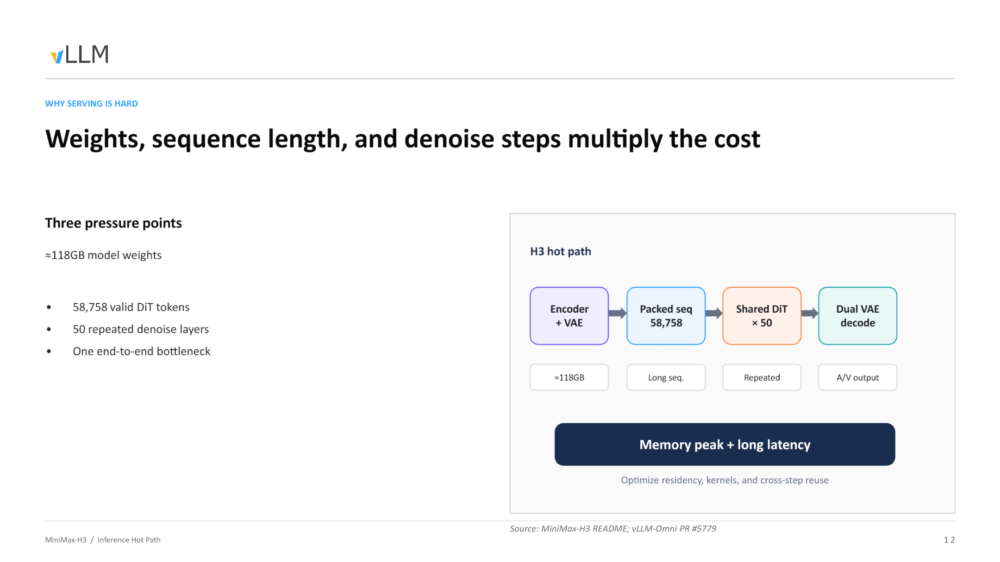
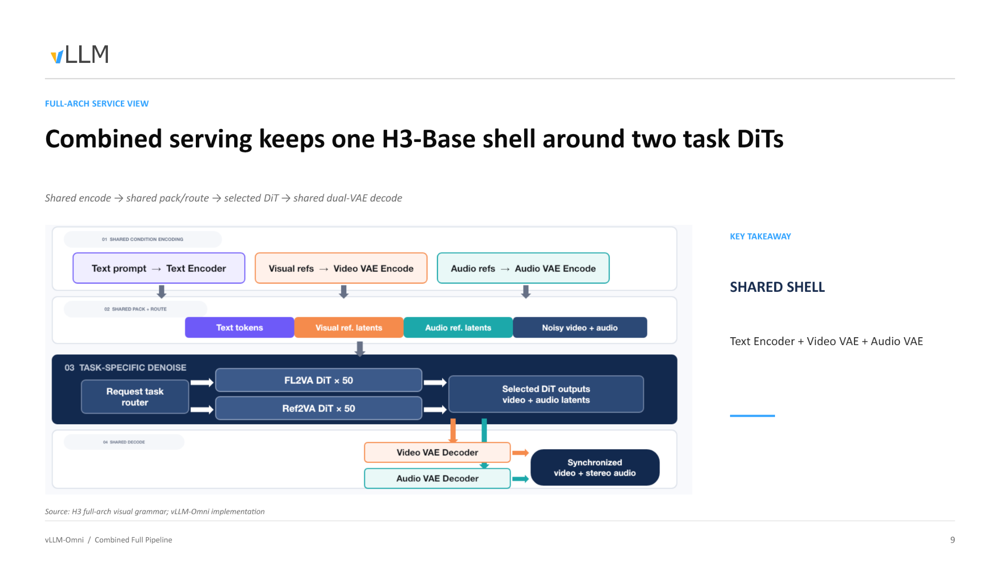
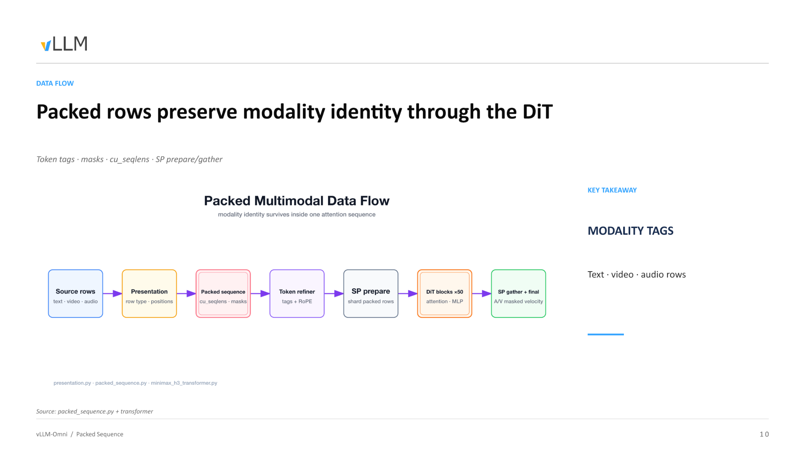
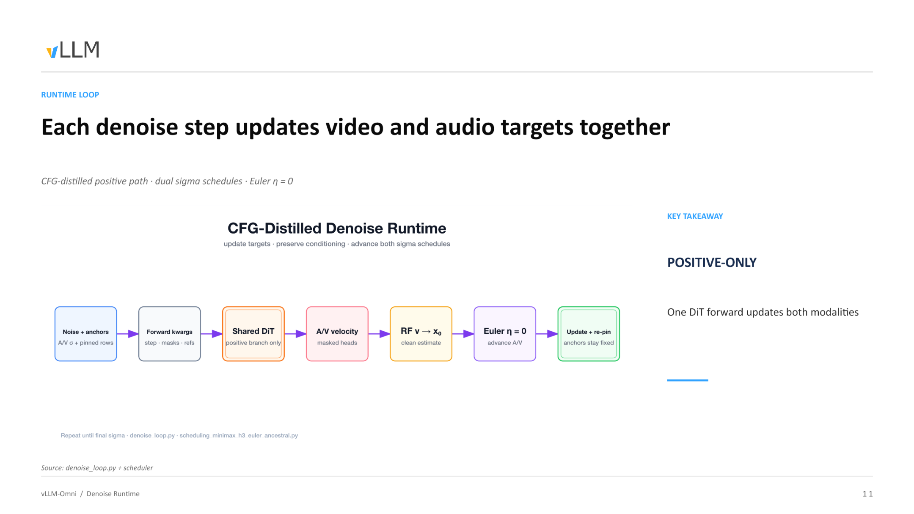
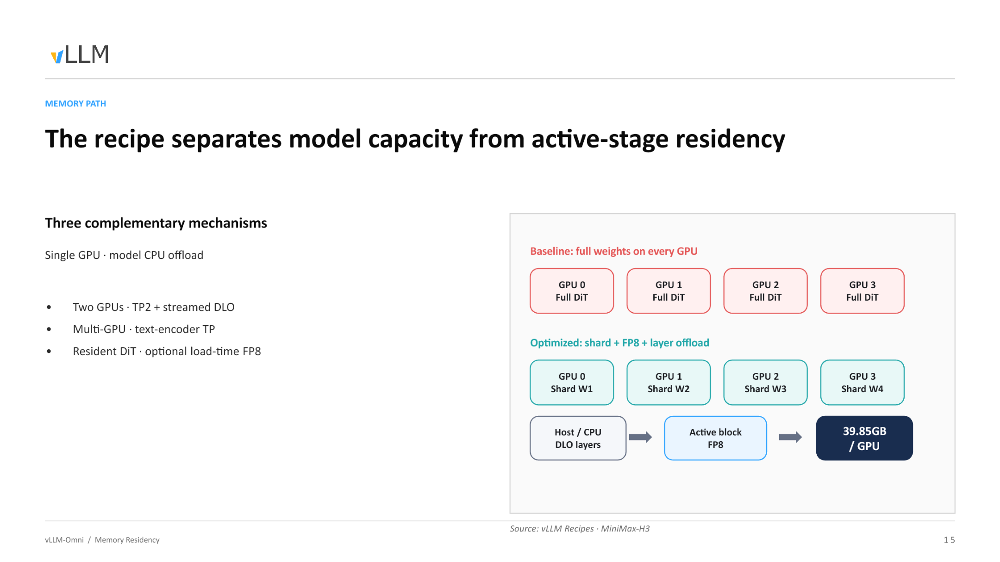
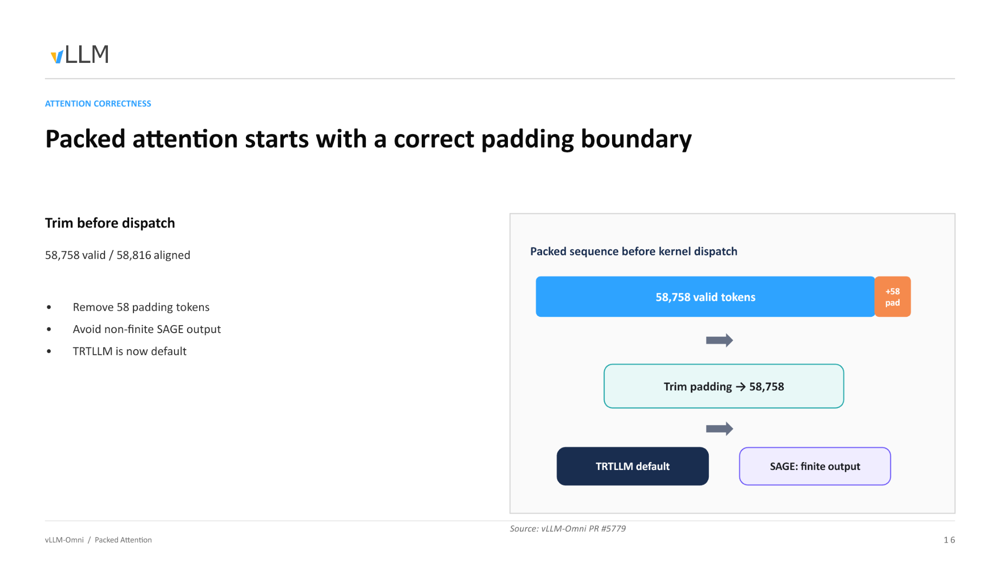
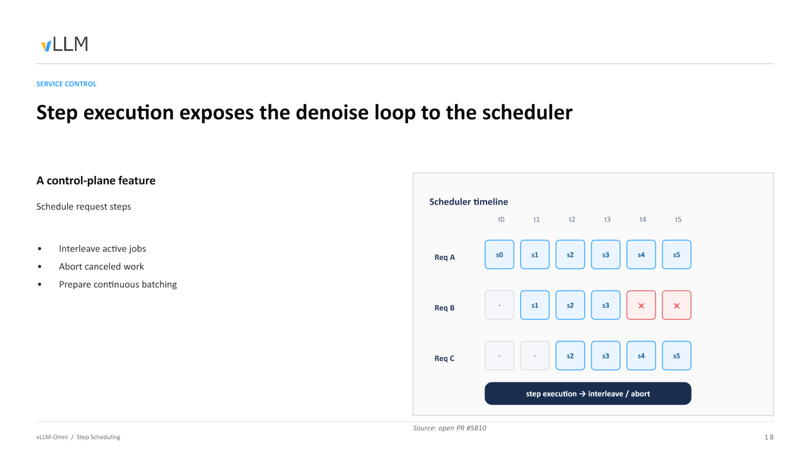
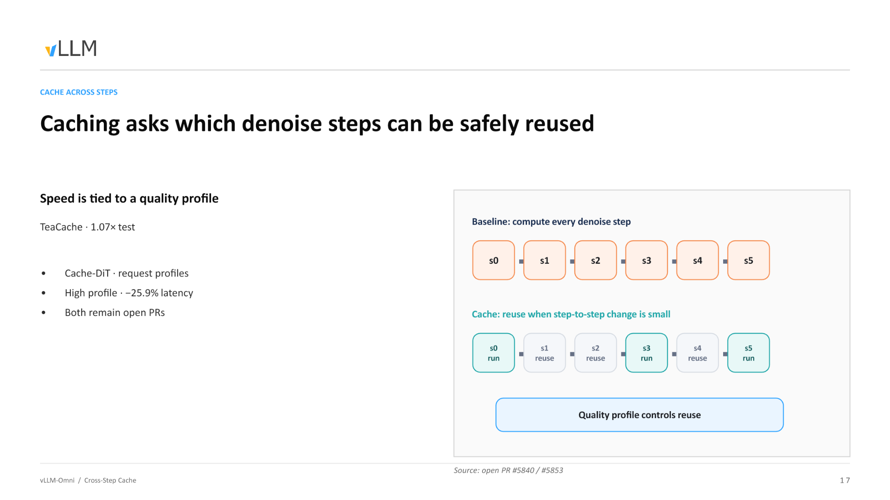
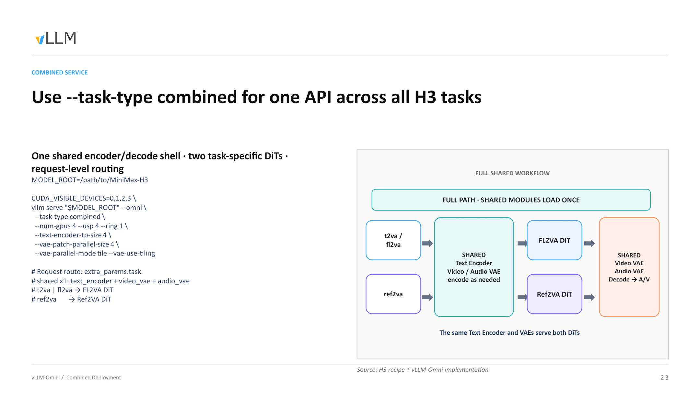

# 生产环境下的音视频联合生成：MiniMax-H3 与 vLLM-Omni 架构解析

**从 118 GB 显存瓶颈到多任务混合调度的全链路优化实践**

**原视频**：[MiniMax-H3 × vLLM-Omni](https://www.bilibili.com/video/BV1xmuT6dE1M) · **配套资料**：[配套资料目录](https://drive.google.com/drive/folders/18FfuwaP_OB-JRoTzlY6n-svYGnW2lBAT)

---

当视频生成模型开始同时输出画面与立体声时，部署工程师面对的不再是"单个算子慢"这样的局部问题，而是一道由模型体积、序列长度和迭代次数三重叠加而成的系统性难题。MiniMax-H3 用一个共享的 DiT（Diffusion Transformer，扩散变换器）将视频帧与原生立体声波形放进同一条去噪链路，在算法层面实现了严格的音画同步；vLLM-Omni 则在推理服务层面为这个庞然大物设计了从显存卸载到步级调度的完整工程方案。本文沿着"瓶颈在哪 → 架构怎么拆 → 数据怎么流 → 显存怎么省 → 算子怎么稳 → 延迟怎么压 → 部署怎么落"的因果链，拆解这套联合生成系统的核心设计与工程权衡。

**适读人群**：具备大模型推理基础，希望了解多模态 DiT 联合生成机制与生产级部署优化的 AI 系统工程师。

**前置知识**：

- Diffusion Transformer（DiT）的基本概念——噪声调度、去噪循环、速度参数化
- vLLM 推理框架的基本架构——调度器、Worker、模型执行器
- 张量并行（Tensor Parallelism, TP）与 CPU 显存卸载（Offloading）的原理

**阅读目标**：

1. 理解 MiniMax-H3 音视频联合生成的统一架构设计及其带来的系统性开销
2. 掌握 vLLM-Omni 在多任务路由与共享组件上的显存复用策略
3. 洞悉 DLO、步级调度与跨步缓存等推理优化机制及其适用边界

---

## 一、统一架构与 118 GB 显存墙

> **本节问题**：音视频联合生成模型在上线部署时，为什么会同时撞上显存峰值与推理延迟两道墙？

### 为什么必须统一？

传统做法将视频和音频交给两个独立的生成模型分别处理，再用后处理对齐音画时序。这条分离路径的缺陷在于：两条采样链各自独立，时序对齐只能"事后追赶"，效果不稳定。

MiniMax-H3 选择了一条更激进的路线——**用同一个 33B 参数的 DiT 同时处理视频帧与原生立体声波形**。端到端流程可概括为四步：

| 阶段 | 组件 | 输出 |
|------|------|------|
| 条件编码 | Qwen3-VL（2B 文本-视觉编码器） | 文本与图像条件向量 |
| 序列打包 | 视频 latent + 音频 latent + 文本 token 拼接 | 一条包含 58,758 有效 token 的混合序列 |
| 去噪主体 | 共享 33B DiT × 50 步 | 音视频联合速度场（velocity） |
| 解码 | 双路 VAE（Video VAE + Audio VAE） | 同步的视频帧与立体声波形 |

> VAE（Variational Autoencoder，变分自编码器）在此分别负责视频与音频的潜空间编解码。

统一路径让音画在每一步去噪中共享注意力上下文，从机制上保证时间对齐。然而，这也意味着所有模态的计算代价被叠加到**同一条推理热路径**上。

### 热路径的三重乘数

下图展示了推理主链路上三个压力源如何逐级放大开销，是理解后续所有优化手段的起点。


*图注：推理热路径的三大压力点及其叠加关系。来源：演讲 PPT 第 12 页。*

图中从左到右依次为条件编码、序列打包、DiT 去噪和双 VAE 解码四个阶段，各阶段下方标注了主要开销类型：

1. **≈ 118 GB 模型权重**——编码器（Qwen3-VL, 2B）、共享 DiT（33B）与双路 VAE 解码器三部分合计。仅将它们全部常驻 GPU 显存，就已逼近甚至超出单卡（80 GB A100 / H100）的物理上限。
2. **58,758 有效 DiT token**——视频 latent、音频 latent 与文本 token 拼接后的序列长度。注意力计算的显存与 FLOPs 随序列长度呈超线性增长，单次前向传播本身便十分昂贵。
3. **50 步去噪循环**——DiT 的全部层需要**反复执行 50 次**（每步一次完整前向）。58,758 token 的注意力计算不是做一遍，而是做 50 遍。

三者的关系不是简单相加，而是**乘数效应**——任何一个维度的增长都会按比例放大其余两个维度带来的负担。

### 从输入到 OOM：一条请求的显存膨胀轨迹

1. **文本输入**——用户提交一段视频生成 prompt，文本 token 量级在几十到几百。
2. **条件编码**——Qwen3-VL 将文本编码为条件向量；视频与音频的初始噪声 latent 被采样生成。编码器权重需要加载。
3. **序列拼接**——视频 latent、音频 latent 与文本条件向量被打包为 58,758 token 的长序列，激活显存随之飙升。
4. **50 步去噪**——33B DiT 对长序列执行 50 轮前向传播，每轮都需要完整的模型权重常驻及中间激活。峰值显存在此阶段达到顶点。
5. **双 VAE 解码**——去噪完毕后，音频与视频 latent 分别送入各自 VAE 解码器。若 DiT 权重仍驻留显存，叠加解码器权重后将触发 OOM。

第 4 步是绝对瓶颈：它同时需要 118 GB 级别的权重驻留、58,758 token 级别的激活缓存，以及 50 次迭代的时间开销。

### 结论

统一 DiT 在算法层面解决了音画同步问题，却在系统层面制造了一道由权重体积、序列长度和去噪步数三重叠加的显存墙。要将模型推向生产环境，必须在架构上将各阶段解耦，对显存驻留、计算内核和跨步复用分别施策。

> **边界条件**：58,758 token 为演讲材料中给出的有效 DiT token 数值，实际序列长度可能随输入分辨率和时长变化。118 GB 为近似值，具体取决于精度配置与是否同时加载双任务权重。

既然全量加载 118 GB 权重不可行，系统如何通过架构设计减少多任务场景下的冗余显存占用？

---

## 二、共享外壳与多任务动态路由

> **本节问题**：在支持文生视频、参考视频续写等多种任务时，如何避免为每种任务各加载一个完整模型？

### 两种任务，两套 DiT，一个共性

MiniMax-H3 支持两大类视频生成任务，分别对应独立训练的 DiT 权重：

- **FL2VA**（First/Last frame to Video & Audio）：文本或首尾帧驱动的视频音频生成
- **Ref2VA**（Reference to Video & Audio）：参考视频驱动的续写生成

如果为每种任务各启动一套完整服务，Text Encoder 和双 VAE 都要各存一份。关键的结构事实是：**FL2VA 与 Ref2VA 的 DiT 权重不同，但 Text Encoder 和双 VAE 完全一致。** 这就为组件复用提供了基础。

### 组合服务：一次加载，两种能力

vLLM-Omni 据此引入了**组合服务（Combined Serving）**模式，将模型拆为两层：

| 层次 | 组件 | 实例数 | 说明 |
|------|------|--------|------|
| **共享外壳** | Text Encoder、Video VAE、Audio VAE | 单例常驻 | 所有任务复用同一份编解码权重 |
| **任务专用核心** | FL2VA DiT 或 Ref2VA DiT | 按需激活 | 组合模式下两套 DiT 共存于显存 |

下图展示了组合服务的完整管线视图，帮助追踪一条请求从进入到返回结果的完整路径。


*图注：Combined Serving 全链路。数据从左侧共享编码进入，经任务路由器选择 DiT，最后由共享双 VAE 解码输出同步的视频与立体声音频。来源：演讲 PPT 第 9 页。*

沿图中箭头，一次请求的因果链如下：

1. **API 接收**——客户端向唯一的 Video API 发送请求，请求体中携带任务类型字段（如 `extra_params.task`，具体字段名待核验）。
2. **共享编码**——Text Encoder 将文本提示编码为条件向量；如有参考帧或参考音频，相应 VAE 同步完成潜空间编码。此步不区分任务类型。
3. **动态路由**——调度层读取请求中的任务标识：`t2va` / `fl2va` 路由至 FL2VA DiT，`ref2va` 路由至 Ref2VA DiT。
4. **DiT 去噪**——被选中的 DiT 执行 50 步迭代，生成联合的视频-音频潜空间表示。另一套 DiT 在此期间不被调用。
5. **共享解码**——去噪结果统一进入 Video VAE 和 Audio VAE，输出同步的视频帧与立体声波形。

### 启动模式：按需裁剪显存

并非所有场景都需要同时承载两种任务。vLLM-Omni 通过 `--task-type` 参数在服务启动时决定加载策略：

| 启动参数 | 加载的 DiT | 可服务的请求类型 |
|----------|-----------|----------------|
| `--task-type fl2va` | 仅 FL2VA | `t2va`、`fl2va` |
| `--task-type ref2va` | 仅 Ref2VA | `ref2va` |
| `--task-type combined` | FL2VA + Ref2VA | 全部，按请求路由 |

单任务模式下，显存中只驻留一套 DiT 权重加共享外壳；组合模式额外承担第二套 DiT，但仍远低于启动两个独立服务的总和。

### 结论

组合服务通过"共享外壳 + 任务路由"的拆分，将多任务并发的显存增量从"整个模型的倍数"压缩到"仅一套额外 DiT 权重"。该路由逻辑的实现据演讲者提及位于 PR #720（待核验），属于后续迭代补充的能力而非初始版本。

架构层面的组件复用解决了"加载几份模型"的问题。但进入 DiT 内部后，文本、视频、音频三种模态的 token 被塞进同一条序列——DiT 如何在统一序列内区分不同模态？

---

## 三、打包序列与模态身份保持

> **本节问题**：单一的 DiT 网络如何在一条序列中同时处理文本、视频和音频而不发生语义混淆？

### 核心机制：元信息注入

DiT 只有一个统一的 Transformer 骨架，没有为各模态设独立分支。当三种模态的 token 拼入同一条序列后，注意力计算面临一个直觉上的风险——视频帧 token 可能"看见"不属于自己的音频 token。H3 的解法是在物理序列上附加充分的元信息，使模态边界在 50 层 DiT 的前向传播中始终可辨。

下图展示了一条打包序列从构建到消费的完整数据流，是理解模态隔离机制的关键。


*图注：打包序列在 DiT 中的完整数据流。来源：演讲 PPT 第 10 页。*

图中六个阶段及其关键操作：

| 阶段 | 关键操作 | 新增/消费的元信息 |
|------|---------|----------------|
| **Source rows** | 将文本、视频、音频原始行按模态分组 | 行类型（row type） |
| **Presentation** | 为每行记录模态类别与空间/时间位置 | 位置索引（positions） |
| **Packed sequence** | 将上述行拼成一维长序列 | 累积序列长度 `cu_seqlens`、注意力掩码 masks |
| **Token refiner** | 为每个 token 注入模态标签（Modality Tags）并施加 RoPE 位置编码 | tags + RoPE embeddings |
| **SP prepare** | 按序列并行（Sequence Parallelism, SP）维度切分 | 各 shard 的局部 `cu_seqlens` |
| **DiT blocks ×50 → SP gather** | 50 层注意力 + MLP 处理后跨设备聚合 | 输出：音视频掩码速度（masked velocity） |

### 因果链：模态身份为什么能"存活"

1. **模态标签注入**——每个 token 在进入 DiT 前被打上离散标签（text / video / audio）。标签影响 RoPE（Rotary Position Embedding，旋转位置编码）的频率选取，不同模态的位置编码空间彼此独立，从根源上减少跨模态位置信号干扰。

2. **`cu_seqlens` 与 masks 划定注意力边界**——`cu_seqlens`（cumulative sequence lengths，累积序列长度）是一维整型数组，记录打包序列中每条子序列的起止偏移。注意力内核据此生成 masks，确保一条子序列内部的 token 只对同属该子序列的 token 做 softmax 归一化。

3. **SP prepare / gather 保持边界一致**——序列并行将长序列切分到多张卡时，切分逻辑沿 `cu_seqlens` 边界对齐，防止单条子序列被截断到两张卡上导致掩码失效。50 层 DiT 完成后，SP gather 将各 shard 输出重新拼合。

4. **输出端的模态分离**——聚合后的序列仍为一维，但 `cu_seqlens` 和标签始终可查，系统按模态切片取出各自的掩码速度，分别送入对应 VAE 解码。

### 最小例子：`cu_seqlens` 如何标记边界

假设一条打包序列仅包含两种模态——10 个文本 token（索引 0–9）和 20 个视频 token（索引 10–29）：

```
cu_seqlens = [0, 10, 30]
```

第一条子序列覆盖 `[0, 10)`，第二条覆盖 `[10, 30)`。注意力内核计算 token 15（视频）的 attention score 时，只对索引 10–29 范围内的 key 做点积，索引 0–9 的文本 token 被 mask 屏蔽，softmax 后权重为零。

若再加入 15 个音频 token，数组变为 `[0, 10, 30, 45]`，三条子序列各自封闭，互不可见。

### 结论

通过模态标签、`cu_seqlens`、注意力掩码以及与序列并行对齐的切分策略，H3 在一条物理序列中维持了三种模态的逻辑隔离——从输入端的标签注入直到输出端的掩码速度提取，50 层 DiT 全程不会跨模态泄漏。

> **边界条件**：演讲材料未给出当单条子序列长度超过单卡显存容量时 SP prepare 的具体降级策略，也未说明不同模态之间是否存在可选的跨模态注意力路径。

明确了数据结构后，这条包含多模态的打包序列在具体的去噪循环中是如何演进的？

---

## 四、音视频联合去噪的执行流程

> **本节问题**：在扩散模型的生成过程中，视频帧和音频波形是如何实现严格的逐步同步的？

### 运行时循环

下图展示了一次完整去噪步所经历的数据流转，是理解音画同步保证的核心。


*图注：去噪运行时循环示意。来源：演讲 PPT 第 11 页。*

图中七个阶段逐项解读：

| 阶段 | 节点 | 作用 |
|------|------|------|
| ① | Noise + anchors | 将当前步的音视频噪声状态与固定锚点行（Pinned rows）拼成统一序列 |
| ② | Forward kwargs | 注入当前步编号、模态掩码与参考条件 |
| ③ | Shared DiT (positive branch only) | 共享 DiT 仅执行正向分支，一次前向同时处理视频和音频 |
| ④ | A/V velocity (masked heads) | 输出被掩码头分离为视频速度和音频速度两个张量 |
| ⑤ | RF v → X₀ | 利用 Rectified Flow 速度参数化将预测速度转换为干净估计 X₀ |
| ⑥ | Euler η = 0 | 确定性 Euler 求解器（不额外注入随机噪声）同步推进音视频状态 |
| ⑦ | Update + re-pin | 写回更新后的音视频潜变量，将锚点行重新固定为原始值 |

循环从初始 σ（最大噪声水平）开始，逐步降低 σ 至趋近零，每步严格重复上述七个阶段。

### 关键因果链

**为什么只需一次前向传播？** 传统 CFG（Classifier-Free Guidance）需要分别对"有文本条件"和"无文本条件"各做一次前向再加权合并，计算量翻倍。H3 的 DiT 经过 **CFG 蒸馏**（CFG-distilled），将正负分支行为压缩进单一正向路径，一次前向即可同时获得视频和音频的预测速度。

**双 sigma 调度如何共存？** 音频与视频虽共享同一个 DiT，但各自维持独立的噪声调度表 σ\_video(t) 和 σ\_audio(t)。Euler 求解器在阶段 ⑥ 根据各自 σ 值分别计算步长再统一写回，这是两条模态"共享模型"又"各自调度"的关键。

**锚点为何必须重新固定？** 锚点行承载的是参考帧或参考音频片段等已知信息。去噪更新会试图修改序列所有位置，因此阶段 ⑦ 必须将锚点行恢复至原始值，防止参考信号被噪声预测覆盖。

### 状态演进示例

以 3 步去噪为例（实际步数为 50）：

```
Step 3 (σ_max)
  纯噪声 z₃ + 锚点 → DiT 正向 → v₃ → Euler(σ₃→σ₂) → z₂ → re-pin

Step 2 (σ_mid)
  z₂ + 锚点 → DiT 正向 → v₂ → Euler(σ₂→σ₁) → z₁ → re-pin

Step 1 (σ_min → 0)
  z₁ + 锚点 → DiT 正向 → v₁ → Euler(σ₁→0) → x₀ (干净潜变量)
```

最终 x₀ 同时包含视频和音频的潜变量，交由各自 VAE 解码即得像素帧与立体声波形。

### 结论

单次 DiT 前向传播即可完成双模态的速度预测，配合确定性 Euler 求解器在同一时间步内同步推进——这是物理时间轴上绝对同步的根本保证。

> **边界条件**：η 必须为 0，一旦引入随机噪声各自的随机采样将破坏同步性；锚点的 re-pin 不可省略，否则参考信号将在迭代中退化。演讲材料未给出双 sigma 调度表的具体数值。

去噪循环的设计足够优雅，但回到物理现实：50 层 DiT 的全部权重根本塞不进单张 GPU。如何突破硬件瓶颈？

---

## 五、分布式逐层卸载（DLO）

> **本节问题**：如何在显存受限的 GPU 集群上运行约 118 GB 的 DiT 模型？

### 核心思路：容量与驻留解耦

DLO（Distributed Layerwise Offload，分布式逐层卸载）的一句话本质：把"模型的总容量"和"计算时真正需要驻留在 GPU 显存中的数据量"彻底分离——不参与当前计算的 DiT 层卸载到宿主机 CPU 内存，计算时按需流式加载。

下图对比了全量驻留方案与 DLO 优化方案的内存布局差异，直观展示了显存节省的来源。


*图注：左侧 Baseline 方案中每张 GPU 持有完整 DiT 权重；右侧 Optimized 方案将权重切分并卸载，单卡显存占用降至 39.85 GB。来源：演讲 PPT 第 15 页。*

图中关键元素：

| 元素 | 含义 |
|------|------|
| GPU 0–3 / Full DiT | Baseline：每卡各存一份完整权重，留给 activation 的空间极少 |
| Shard W1–W4 | Optimized：权重按张量并行维度切成 4 片，每卡只持有 1/4 |
| Host / CPU — DLO layers | 不参与当前计算的 DiT 层驻留在宿主机 DRAM |
| Active block → FP8 | 当前正在计算的那一层从 CPU 流式传入 GPU，以 FP8 精度驻留，计算完成即释放 |
| 39.85 GB / GPU | 结合 TP2 切片与 FP8 量化后的实测单卡显存占用 |

### 执行流程：三条 Stream 的流水线

DLO 运行时依赖三条并行的 CUDA Stream 协同工作：

1. **Compute Stream**——在 GPU 上执行当前 DiT 层的前向计算。
2. **H2D Stream（Host → Device）**——计算流工作时，提前把下一层权重从宿主机 DRAM 搬运到 GPU。
3. **All-gather Stream**——多 GPU 场景下，每张卡从宿主机取回自己的 Shard 切片，再通过 All-gather 通信拼合为完整层权重供计算使用。计算完毕后，拼合出的完整权重随即丢弃。

因果链归纳：显存不足 → 非活跃层放入 CPU DRAM → H2D 流按需搬运 → 多卡通过 All-gather 共享同一块宿主机内存 → 计算完成即释放 → GPU 上始终只保留一个 Active block 的开销。

### 从单卡到多卡：共享而非复制

早期的单卡 CPU Offload 方案扩展到 8 张卡时，需要在宿主机侧维护 8 份权重副本。DLO 的"分布式"一词正是解决这个问题：**8 张卡共享宿主机上同一份权重**，各自只取自己的 Shard 切片。8 卡数据并行场景下，主机内存占用与单卡几乎一致。

### 结论

DLO 是显存受限设备的生存基石，使得消费级 GPU 集群也能运行百 GB 级别的 DiT 模型。但它本质上是**用 PCIe 带宽换显存空间**——在纯 PCIe 拓扑下，H2D 搬运延迟可能无法被计算流完全掩盖，导致吞吐受限。NVLink 互联可进一步隐藏 All-gather 通信代价；反之，若硬件本身显存充裕，全量常驻权重反而是更优选择。

> **边界条件**：39.85 GB 为结合 TP2 和 FP8 后的数值。演讲材料未给出 DLO 开启前后的端到端延迟对比数据。

显存问题解决后，计算过程中另一个棘手问题浮出水面：面对 58,758 这样不规则的序列长度时，底层 Kernel 会崩溃。

---

## 六、打包注意力的边界裁剪

> **本节问题**：为什么处理 58,758 个有效 Token 时，底层注意力算子会输出非有限（Non-finite）值？

### 矛盾：对齐长度 ≠ 有效长度

GPU 上的注意力 Kernel 在分配共享内存和调度线程块时，要求输入序列长度对齐到特定块大小。对齐后长度为 58,816，而真正携带语义的 Token 只有 58,758——两者之间存在 **58 个 Padding Token**。

| 项目 | 数值 |
|---|---|
| 有效 Token 数 | 58,758 |
| 对齐后长度 | 58,816 |
| 多余 Padding | 58 |

### 因果链：Padding 如何引发崩溃

1. **对齐补零**——为满足 Kernel 内存对齐约束，序列末尾填充 58 个值不确定的 Padding Token。
2. **权重污染**——Softmax 归一化阶段，Padding 位置对应的 Query-Key 点积未被遮蔽，异常数值纳入求和分母。
3. **SAGE 溢出**——TRTLLM（TensorRT-LLM，默认注意力后端）中的 SAGE 算子遇到被污染的 Softmax 分布，产生 NaN 或 Inf。
4. **链式传播**——某一层输出非有限值后，后续所有 DiT 层的残差连接将错误逐层放大，生成结果完全不可用。

关键判断：问题触发条件并非 Padding 的存在本身，而是 **Padding 在 Kernel 内部被当作有效 Token 参与了注意力计算**。

### 修复方式

vLLM-Omni 在 Kernel 派发前执行一次严格的边界裁剪（Trim Padding）：将 58,816 精确截断回 58,758，确保只有有效 Token 进入算子。

下图展示了裁剪操作在流水线中的位置与效果。


*图注：打包序列在 Kernel 派发前裁剪 Padding 的流程。来源：演讲 PPT 第 16 页。*

图中自左向右三个阶段：

- **左侧方块**——"Packed sequence before kernel dispatch"，内部标注 58,758 有效 Token 与 +58 Pad，表示对齐后的原始状态。
- **中间箭头**——执行 "Trim padding → 58,758" 操作，即物理截断多余的 58 个位置。
- **右侧结果**——TRTLLM 作为默认后端，SAGE 算子恢复数值正确性（finite output）。

裁剪操作本身开销极小——仅调整传入 Kernel 的长度参数与指针偏移，不涉及数据拷贝。当有效 Token 数恰好是块大小整数倍时，Padding 长度为零，裁剪退化为空操作。

### 结论

精确的边界控制是长序列多模态 Kernel 保持数值稳定的前提。这是一个看似细微却会导致整条推理链路失败的工程问题。

> **边界条件**：演讲材料未给出其他块大小或不同 GPU 型号下的对齐粒度细节，实际部署应以 TRTLLM 版本的 Kernel 配置为准。

解决了显存和算子稳定性后，如何进一步压榨高端 GPU 的算力，降低 50 步循环带来的长延迟？

---

## 七、步级调度与跨步缓存

> **本节问题**：在显存充足的高端 GPU 上，如何最大化计算利用率并缩短生成时间？

### 高端卡上的真正瓶颈

DLO 通过牺牲 PCIe 带宽换取显存空间。但在算力充裕的高端计算卡上，显存本身并不紧缺，GPU 计算速度远快于 PCIe 传输速度，DLO 引入的通信开销反而制造大量计算空泡，推理吞吐不升反降。开发者在测试中也确认了这一现象。

因此，在这类场景下，优化方向从"省显存"转向两件事：**把空闲算力填满**和**把无效计算砍掉**。

### 步级调度：让去噪循环对调度器可见

传统 Diffusion 推理中，一个请求的全部去噪步骤被当作不可分割的整体——调度器只能等一个请求跑完后才能处理下一个。步级执行（Step Execution）的核心思路是：将去噪循环的每一步暴露给调度器，使其成为可调度单元。这是一个**控制平面特性**，不改变模型计算逻辑，而是改变请求间的编排方式：

| 能力 | 说明 |
|------|------|
| 步级交错 | 不同请求的 step 可组成 batch 并行执行 |
| 即时中止 | 已取消的请求在下一个 step 边界即可停止 |
| 连续批处理 | 为 DiT 实现类似自回归模型的 Continuous Batching |

下图展示了三个请求在时间轴上的交错过程，直观说明步级调度如何提升算力利用率。


*图注：Req A 从 t0 连续执行 s0–s5；Req B 从 t1 加入执行 s1–s3 后被取消（×标记），后续步骤不再占用算力；Req C 从 t2 加入执行 s2–s5。来源：演讲 PPT 第 18 页。*

逐行解读：

- **Req A** 最先到达，从 t0 连续完成 6 个去噪步。
- **Req B** 在 t1 加入，其 s1、s2、s3 与 Req A 对应步骤被组成 batch 一起送入 GPU。t3 结束后用户取消了该请求，调度器在 t4 的 step 边界将其标记为终止，立即释放资源。若无步级调度，Req B 的剩余步骤仍会空跑至完成。
- **Req C** 在 t2 加入，与 A（以及短暂共存的 B）交错执行至 t5。

这种交错的本质等价于 LLM 推理中的 Continuous Batching。该特性目前以 open PR #5810 的形式在推进中。

### 跨步缓存：跳过冗余去噪计算

步级调度解决"把算力填满"，跨步缓存则聚焦"把不必要的计算砍掉"。

在 DiT 去噪过程中，相邻步骤之间的中间特征往往高度相似。跨步缓存的因果链：

1. **观察**——步 s<sub>k</sub> 与 s<sub>k-1</sub> 在 DiT 层的输出差异很小。
2. **决策**——计算两步间的相似度指标，若低于阈值则判定为"可复用"。
3. **执行**——跳过当前步的完整 DiT 层前向计算，直接复用前步结果。
4. **收益**——被跳过的步骤几乎零计算开销，总去噪延迟随之下降。

下图展示了基线与缓存策略的对比。


*图注：上方基线每步都执行完整计算；下方缓存策略中，相似度高的步骤直接复用前步结果，减少实际计算量。来源：演讲 PPT 第 17 页。*

目前 vLLM-Omni 社区正在集成两种跨步缓存算法：

| 算法 | 跳过粒度 | 已披露效果 | 状态 |
|------|----------|-----------|------|
| **TeaCache** | 跳过整个 step | 测试数据显示 1.07× 加速 | open PR #5840 |
| **Cache-DiT** | 跳过 step 内部的特定 layer | High profile 下延迟降低 25.9% | open PR #5853 |

两者并非互斥，作用于不同粒度：TeaCache 决定"这一步要不要整体跳过"，Cache-DiT 决定"这一步里的哪些层可以跳过"。Cache-DiT 的 25.9% 延迟下降对应其 high profile 设定——档位越激进，跳过越多，速度越快，但生成质量的损失也越大。

### 结论

高端 GPU 上的优化核心在于掩盖延迟和减少无效计算。步级调度通过请求交错填满算力空隙，跨步缓存通过跳过冗余计算缩短单请求延迟。二者可叠加使用，但都附带前提——前者需要足够的并发请求量，后者需要在速度与生成质量之间做出显式权衡。

> **边界条件**：开发者提到步级调度在消费级显卡上暂未观测到收益，预期在多卡高端集群场景下更明显。两项缓存技术均处于 open PR 阶段，尚未合并至主分支。演讲材料未给出 Cache-DiT low/medium profile 的具体数据。

当所有调度与算法优化就绪后，最终需要落地到实际的物理集群与部署拓扑中。

---

## 八、4 卡组合部署与物理边界

> **本节问题**：综合所有优化手段，生产环境中如何部署才能实现单 API 支撑全量任务？

### 共享工作流全景

下图展示了组合部署模式的最终形态，所有前述优化手段在此汇聚。


*图注：组合部署的完整数据流——共享模块仅加载一次，请求按任务类型路由至对应 DiT。来源：演讲 PPT 第 23 页。*

图中自左向右分为三个区域：

| 区域 | 包含模块 | 加载次数 |
|------|----------|----------|
| 共享编码壳 | Text Encoder（Qwen3-VL, 2B）+ Video VAE encoder + Audio VAE encoder | 1 次 |
| 任务专用去噪 | FL2VA DiT / Ref2VA DiT | 各 1 份，按请求路由 |
| 共享解码壳 | Video VAE decoder + Audio VAE decoder | 1 次 |

关键观察：共享模块只加载一次。4 张 GPU 的显存中，Text Encoder 和双 VAE 各驻留一份权重，而非按任务重复分配。

### 启动参数锚点

演讲材料给出的最小可运行命令：

```bash
MODEL_ROOT=/path/to/MiniMax-H3

CUDA_VISIBLE_DEVICES=0,1,2,3 \
vllm serve "$MODEL_ROOT" --omni \
  --task-type combined \
  --num-gpus 4 --usp 4 --ring 1 \
  --text-encoder-tp-size 4 \
  --vae-patch-parallel-size 4 \
  --vae-parallel-mode tile --vae-use-tiling
```

核心参数拆解：

- `--task-type combined`：启用组合服务，单进程同时加载 FL2VA 与 Ref2VA。
- `--num-gpus 4 --usp 4 --ring 1`：4 卡 USP（Unified Sequence Parallelism）并行，ring 维度为 1。
- `--text-encoder-tp-size 4`：Text Encoder 采用 4 路张量并行。
- `--vae-patch-parallel-size 4 --vae-parallel-mode tile --vae-use-tiling`：VAE 解码采用 tile 模式分块并行，大分辨率帧切片后分摊到 4 卡。

设计意图：让编码、去噪、解码三个阶段都能均匀利用全部 4 张 GPU，避免某一阶段独占单卡而其余卡空转。

### 请求级路由

调用方通过请求体中的 `extra_params.task` 字段指定任务类型。路由发生在共享编码完成之后、DiT 去噪开始之前——同一时刻不同请求可以走不同管线，服务端无需重启或切换模型。

### 物理边界与工程警示

组合部署将所有优化叠加到一套拓扑上，但叠加本身引入了新的约束：

**1. DLO 在消费级硬件上可能产生负收益。** 当 PCIe 带宽不足时，卸载-回填的延迟可能超过它所节省的显存带来的批处理收益。演讲材料未给出消费级硬件上的具体吞吐对比数据，部署前应自行基准测试。

**2. 跨步缓存加速与生成质量存在严格权衡。** 缓存越激进，跳过的层越多，推理越快，但带来不可逆的质量衰减。在组合模式下，FL2VA 与 Ref2VA 两条管线的最优缓存阈值可能不同，统一配置有过度跳过的风险。

**3. 多种并行策略叠加时存在潜在冲突。** 组合部署同时激活了 USP（去噪阶段）、张量并行（编码阶段）和 tile 分块并行（VAE 阶段）。三种策略对 GPU 间通信模式的需求各异——USP 依赖 all-to-all，张量并行依赖 all-reduce，tile 并行涉及空间分片后的拼接。当硬件拓扑并非理想的 NVLink 全互联时，通信竞争可能成为隐性瓶颈。多项高级特性（如 Continuous Batching、DLO 与跨步缓存）目前均处于 open PR 阶段，同时启用时可能引发冲突。

---

## 结论

1. **MiniMax-H3 通过共享 DiT 实现了音视频的物理级同步生成**——单次前向传播同时输出视频与音频的预测速度，配合确定性 Euler 求解器保证逐步对齐，但也带来了约 118 GB 权重与 58,758 token 长序列的推理灾难。

2. **vLLM-Omni 的组合服务模式通过"共享外壳 + 任务路由"大幅削减多任务并发的显存冗余**——Text Encoder 和双 VAE 单例常驻，FL2VA 与 Ref2VA DiT 按请求级别动态切换，避免了权重的重复加载。

3. **打包序列通过模态标签、`cu_seqlens` 和注意力掩码维持了多模态的逻辑隔离**——三种模态在同一物理序列中共存但互不可见，从数据结构层面保障了 DiT 的正确语义处理。

4. **DLO 为低显存设备提供了生存空间**——结合 TP2 切片与 FP8 量化，单卡显存可压缩至 39.85 GB，代价是引入 PCIe 带宽瓶颈。

5. **步级调度与跨步缓存是高端 GPU 压榨算力的核心武器**——前者通过请求交错实现 Continuous Batching，后者通过跳过冗余去噪步降低延迟（Cache-DiT high profile 下降低 25.9%），但两者均处于 open PR 阶段。

6. **精确的 Kernel 边界裁剪是长序列多模态推理的数值安全前提**——58 个 Padding Token 足以导致整条推理链路的 NaN 崩溃，必须在 Dispatch 前严格截断。

7. **生产环境的部署本质上是在显存容量、PCIe 带宽、生成质量与推理延迟之间寻找基于特定硬件拓扑的最优解**——工程没有通用最优解，只有针对具体互联条件与业务需求的精确妥协。

### 已知局限

- DLO 在消费级 GPU（PCIe 带宽受限）上可能产生负收益，演讲材料未提供该场景的吞吐对比数据。
- 跨步缓存（TeaCache、Cache-DiT）的加速效果与质量衰减严格挂钩，low/medium profile 的具体数据未披露。
- 多项高级特性（Continuous Batching PR #5810、TeaCache PR #5840、Cache-DiT PR #5853）尚未合并至主分支，同时启用可能引发冲突。
- 组合部署模式要求特定硬件拓扑（如 4 卡 NVLink 互联）与正确的请求参数路由才能正常运行。
- 本文分析基于演讲 PPT 与转录材料，部分源码细节（如 `extra_params.task` 字段名、PR #720 的具体实现）标为待核验。
