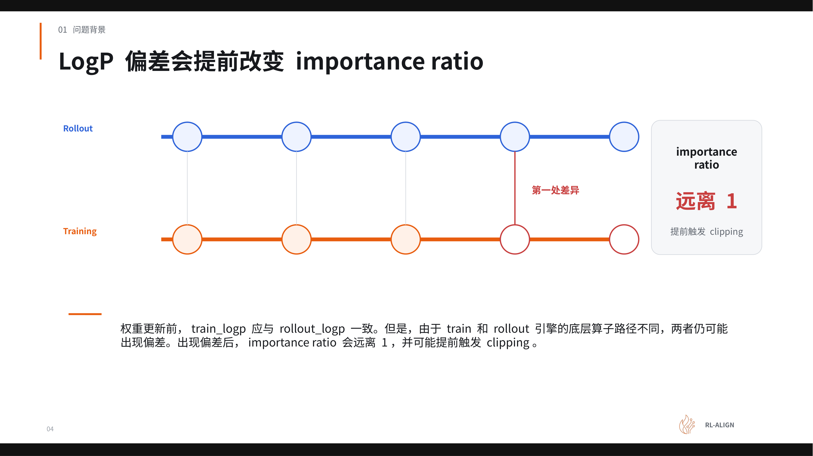
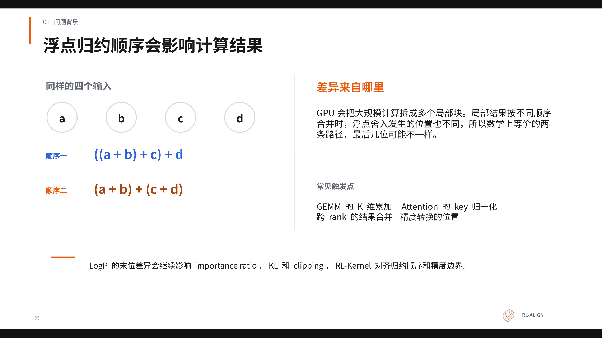
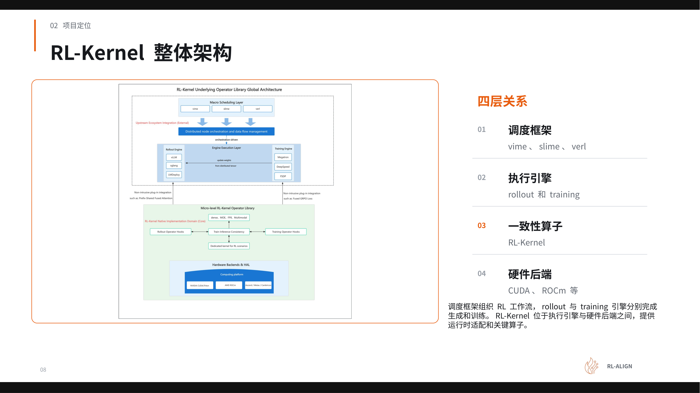
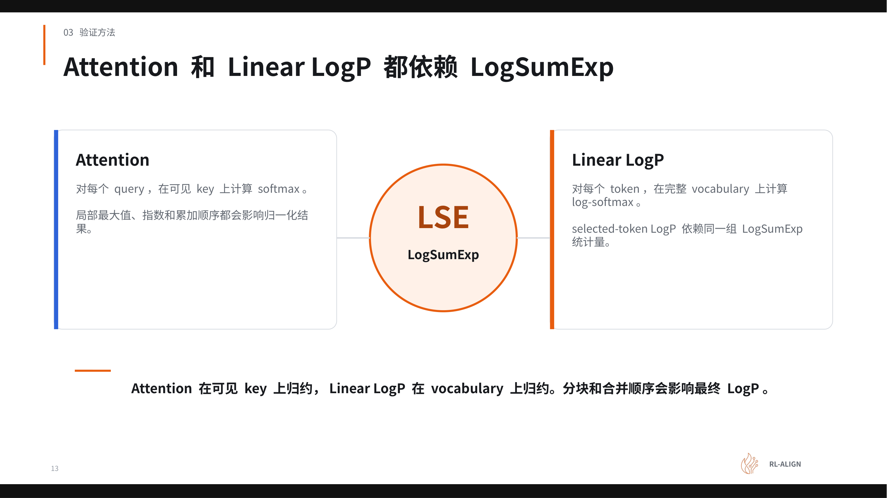
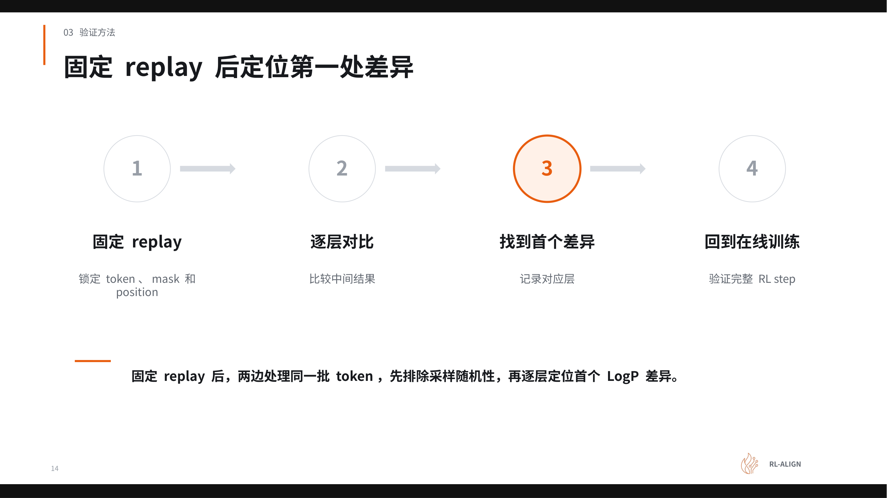
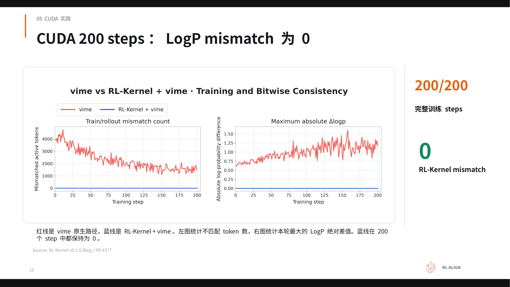
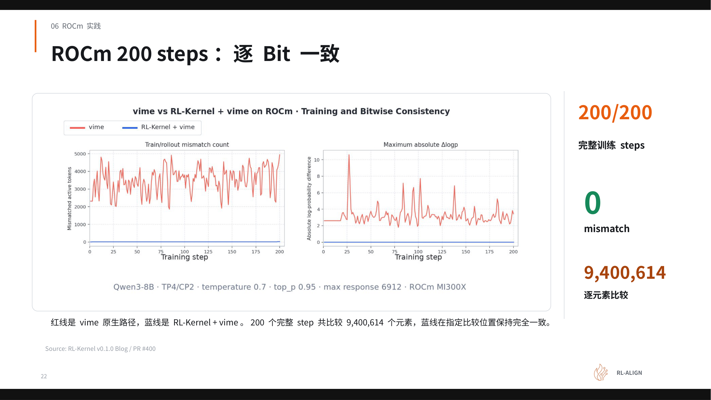
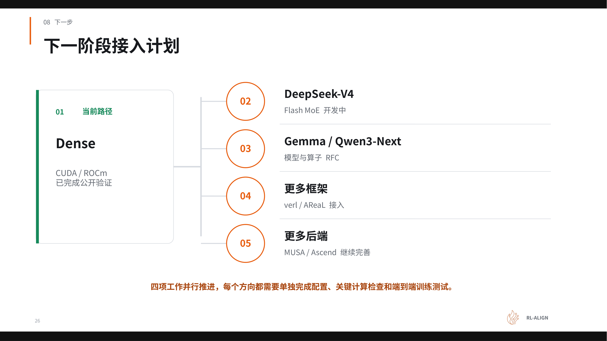

# 大模型强化学习后训练：如何通过 RL-Kernel 彻底消除训推 LogP 偏差

**原视频**：[RL-Kernel：大模型 RL 后训练中的训推一致性](https://www.bilibili.com/video/BV1Ech96cEzW) · **配套资料**：[RL-Kernel v0.1.0 课件](https://drive.google.com/file/d/1geW-HDHSLrnhKV2gRz5q9JuSS1dCdE1z/view)

**从底层算子归约到双平台 0 Mismatch 的工程实践全解**

大模型强化学习后训练的一个隐蔽陷阱是：生成阶段与训练阶段各自计算的对数概率（LogP）在数值上并不相等——即使权重、输入完全相同。偏差源头并非模型参数，而是两套执行引擎在 GPU 浮点归约顺序上的微妙差异。这种末位偏差经 importance ratio 放大后，足以提前触发梯度裁剪，最终破坏训练稳定性。RL-Kernel 项目从算子层面入手，对五类关键归约操作建立严格的数值契约，在 CUDA（H100）与 ROCm（MI300X）双平台上实现了 Qwen3-8B Dense 模型 200 个训练步的零偏差，且未牺牲端到端性能。本文沿依赖与因果关系逐层展开这一工程实践的完整技术细节。

**适读人群**：从事大模型强化学习（RLHF/PPO）、分布式训练系统开发、算子优化及 AI 基础设施建设的资深算法工程师与系统工程师。

**前置知识**：

- 熟悉大模型强化学习后训练的基本流程，包括 Rollout 与 Training 阶段的交替。
- 了解分布式训练中张量并行（TP）与上下文并行（CP）的基本概念。
- 对 GPU 浮点数计算特性（如舍入误差、归约操作）有基础认知。

**阅读目标**：

1. 理解 Rollout 与 Training 阶段 LogP 偏差产生的底层算术根因。
2. 掌握排查分布式训练中数值不一致问题的标准化前置条件与验证方法论。
3. 深入了解 RL-Kernel 如何通过干预五类关键归约算子实现严格的数值对齐。
4. 获取在 CUDA 和 ROCm 平台上实现 200 步 0 Mismatch 的真实工程配置与性能边界。

---

## 一、强化学习后训练的隐蔽危机：LogP 偏差与训练坍塌

### 同一模型、同一权重，为何两次前向结果不同？

在强化学习（Reinforcement Learning, RL）后训练流程中，有一个极易被忽视的前提假设：当权重尚未更新时，Rollout 阶段（RL 中生成 response token 并记录初始对数概率的阶段）与 Training 阶段（重新计算对数概率并求损失的阶段）对同一 token 给出的对数概率（LogP, Log-Probability）应当严格相等。

下表对比了两阶段的关键差异：

| 维度 | Rollout 阶段 | Training 阶段 |
|------|-------------|---------------|
| 执行引擎 | vLLM（高性能推理引擎，负责生成 token 和记录 LogP） | Megatron-LM（分布式训练框架，负责重算 LogP 和权重更新） |
| 输入 | 当前权重 + prompt | 同一版权重 + 完整 prompt 与 response tokens |
| 核心计算 | 逐 token 生成并记录 LogP | 对同一批 token 重算 selected-token LogP |
| 输出 | `rollout_logp` | `train_logp` |

两侧描述的是同一策略、同一时刻、同一 token 上的概率——逻辑上必须相等。然而"模型相同"并不意味着"执行路径相同"。vLLM 与 Megatron-LM 在底层调用的 kernel 实现、batch 组织方式、张量并行布局乃至浮点归约（reduction）顺序均存在差异，这些差异足以让两侧 LogP 产生微小但非零的数值偏差。

### 偏差如何逐步摧毁训练过程

下图展示了偏差从产生到触发训练坍塌的完整因果链。图中蓝色路径为 Rollout 执行流，橙色路径为 Training 执行流；两条路径在同一位置以红色连线标注"第一处差异"，即底层算子分歧点。右侧标注了该分歧沿计算图向下传导的后果。

*图注：Rollout 与 Training 的执行流对比，红色连线标记两套引擎在算子层面产生数值分歧的位置及其传导后果。来源：演讲 PPT 第 4 页。*

从红色标注的分歧点开始，因果链条依次展开：

1. **底层算子路径差异** → `train_logp` 与 `rollout_logp` 出现偏差 Δ。
2. **Importance ratio（重要性比率）偏离 1** — 在 PPO 等策略梯度算法中：$r(\theta) = \exp\!\bigl(\text{train\_logp} - \text{rollout\_logp}\bigr)$。当双侧 LogP 严格一致时 $r(\theta)=1$；一旦存在偏差 Δ，比率变为 $e^{\Delta}$。即使单 token 偏差很小，长序列上多 token 累积后也可显著偏移。
3. **提前触发 clipping（裁剪）** — PPO 裁剪机制将 $r(\theta)$ 限制在 $[1-\epsilon,\;1+\epsilon]$ 内（$\epsilon$ 常取 0.2 左右）。若 Δ 已占用部分裁剪余量，真正由策略改进带来的梯度信号就被过早截断。
4. **训练不稳定乃至坍塌** — 梯度信号被持续压制，模型无法获得有效更新方向；严重时在数百轮迭代内即出现训练崩溃，整轮 RL step 作废、必须从检查点重跑。

### 最小例子：单 token 偏差如何吞噬裁剪余量

以单 token 为例感受放大效应：假设 `rollout_logp = −2.300`，`train_logp = −2.308`（偏差仅 0.008），此时 $r = \exp(-0.008) \approx 0.992$，距裁剪边界尚远。

但在真实场景中，一条 response 可能含数百 token。若每个 token 的偏差方向一致——在固定的算子路径差异下完全可能——ratio 对数会线性累加。假设 200 个 token 各偏差 0.008，则累积对数偏差达 1.6，ratio 约为 $e^{-1.6} \approx 0.20$，已远超 $[0.8, 1.2]$ 的裁剪区间，策略梯度信号被完全截断。

> **注意**：上述数值仅用于演示因果机制，演讲材料未给出实际偏差的精确统计量或 clip ratio 的量化测量。实际偏差幅度取决于模型规模、序列长度、并行度以及浮点归约的具体实现。

### 小结

单机单卡场景下算子路径差异已足以引入偏差；扩展到多机多卡时，张量并行带来的归约顺序变化会进一步增加不确定性。LogP 一致性不是"足够接近即可"的软指标，而是必须追求**零偏差**（0 mismatch）的硬约束——任何系统性微小偏差都会经 importance ratio 放大，最终威胁整条训练流水线的稳定性。

偏差的存在已经明确，下一步需要深入硬件与算术层面，弄清这些微小差异究竟在浮点归约的哪个环节被引入。

---

## 二、偏差的物理根源：GPU 并行计算中的浮点归约陷阱

### 相同输入，为何结果不同？

上一节确认了 Rollout 与 Training 在同一 token 上的 LogP 存在末位数值偏差。这个偏差并非来自模型参数或输入数据，而是源于 GPU 执行浮点运算时一项常被忽视的物理特性——**浮点归约顺序（floating-point reduction order）**：当多个浮点数需要累加时，不同的求和顺序会因舍入位置不同而产生不一致的结果。

### 图解：两条数学等价的归约路径

下图用最简结构说明归约顺序如何改变浮点输出：同样四个输入，两种累加顺序产生不同结果。

*图注：两种归约顺序对比——顺序一为左折叠式串行累加，顺序二为两两分组后再合并。来源：演讲 PPT 第 5 页。*

图中给出了四个输入 a、b、c、d 和两条路径：

| 路径 | 表达式 | 累加步骤数 | 中间舍入次数 |
|------|--------|-----------|-------------|
| 顺序一 | `((a + b) + c) + d` | 3 次串行加法 | 每步 1 次，共 3 次 |
| 顺序二 | `(a + b) + (c + d)` | 2 组并行 + 1 次合并 | 共 3 次，但作用于不同中间值 |

两条路径在实数域完全等价，但在有限精度浮点表示下，**舍入发生的位置（即哪两个数先相加）决定了哪些末位信息被丢弃**。

### 因果机制：从分块并行到末位偏差

GPU 处理大规模矩阵运算时，不会对整条向量做单一的串行累加，而是将计算拆分为多个局部块（tile），各块独立求和后再合并。这一过程形成三步因果链：

1. **分块（tiling）**：一次 GEMM（General Matrix Multiply，通用矩阵乘法）中，K 维——即参与内积的那个维度——被切分为若干段，分配到不同的计算单元。
2. **局部归约（local reduction）**：每个计算单元在各自的段内完成累加，产生局部部分和（partial sum），每个部分和已经历各自的舍入。
3. **全局合并（global merge）**：局部部分和按照特定顺序合并为最终结果。合并顺序不同，最终结果的末位就可能不同。

关键在于：Megatron-LM 和 vLLM 即使计算同一个算子，也往往选择不同的 kernel 实现，对应不同的 tile 大小和合并策略，相当于在上图的"顺序一"与"顺序二"之间做了不同选择。

### 四个常见触发点

演讲材料明确列出了四类最易产生归约顺序分歧的计算环节：

| 触发点 | 归约维度 / 操作 | 分歧原因 |
|--------|----------------|----------|
| **GEMM 的 K 维累加** | 内积维度 K 的分块大小 | 训练与推理 kernel 选择不同 tile |
| **Attention 的 key 归一化** | softmax 分母的求和 | Flash Attention 版本差异导致分块策略不同 |
| **跨 rank 的结果合并** | 张量并行（TP, Tensor Parallelism）AllReduce | 多卡归约顺序取决于通信拓扑 |
| **精度转换的位置** | FP32 ↔ BF16 的截断点 | 先转换再累加 vs. 先累加再转换 |

这四个触发点并非孤立出现。一次前向传播包含数十甚至上百个算子调用，每个算子都可能在末位引入微小差异；差异在后续层的非线性变换中被放大，最终汇聚到 LogP 输出。

### 从单卡到多卡：并行规模放大了什么

单卡场景下，偏差仅来自 kernel 内部的 tile 归约顺序差异。扩展到多卡张量并行时，新增了一个变量——**跨 rank AllReduce 的合并顺序**。不同的 TP 度意味着同一条 K 维被切成不同数量的段，分布在不同 GPU 上；AllReduce 的树形或环形拓扑又进一步改变了部分和的合并次序。即便训练和推理都使用相同数量的 GPU，只要 TP 策略或通信实现不同，末位结果就可能不一致。

### 小结

GPU 并行计算中的浮点归约顺序差异，是导致训推 LogP 在数值末位出现偏差的物理根因。这一差异并非 bug，而是有限精度浮点运算在并行分块后的固有特性。要消除它，仅同步权重远远不够——还必须对齐累加顺序、计算精度以及中间结果的舍入位置。在着手逐算子修复之前，需要先建立一套系统化的排查框架，明确哪些前置条件必须首先对齐。

---

## 三、建立排查基准与系统全景：vime 与 RL-Kernel 的协同

### LogP 不一致，该从哪里查起？

当两侧 LogP 出现偏差时，最直觉的反应是怀疑底层算子。但如果两边加载了不同训练步的权重，或者 prompt 与 response 的拼接边界存在一个 token 的错位，算子层面再怎么对齐也无法消除差异。因此，**排查必须分层进行：先锁定外部条件，再深入内部计算。**

### 五项前置对齐条件

在比较任何一对 LogP 数值之前，需要逐项确认以下五个基础条件全部一致。任意一项未对齐，差异都不能归因于计算路径：

| 序号 | 条件 | 需核对的具体内容 |
|:---:|------|-----------------|
| ① | **权重版本** | Rollout 与 Training 必须对应同一份 checkpoint 和同一个训练步 |
| ② | **输入边界** | prompt、response、目标 token 及有效 mask（active mask）的拼接与截断方式 |
| ③ | **位置信息** | position id、RoPE 参数、causal mask 形状、KV 可见范围 |
| ④ | **逻辑状态** | token 在不同 rank 上的归属、真实词表范围、张量并行分片映射 |
| ⑤ | **随机条件** | 随机种子（seed）与采样状态（sampling state） |

以条件 ④ 为例：当开启 TP 后，同一个 token 的 logit 向量被切分到不同 GPU。如果两侧的分片映射不一致，即使权重完全相同，最终在目标 token 位置取到的概率值也会不同。条件 ⑤ 同理——某些 Dropout 或采样路径受 seed 控制，状态不同步就会引入不可复现的噪声。

> **判定规则**：五项条件全部通过后，残余差异方可向下追溯到执行引擎和算子层面的数值路径。

### 系统全景：四层架构与职责边界

确认外部条件由谁来锁定、内部计算由谁来对齐，需要一张覆盖全链路的架构图。下图展示了从调度框架到硬件后端的四层依赖关系，RL-Kernel 作为独立的算子层插入其中，是消除数值偏差的核心位置。

*图注：RL-Kernel 整体架构。四层自上而下依次为调度框架、执行引擎、RL-Kernel 算子层与硬件后端。来源：演讲 PPT 第 8 页。*

图中四层自上而下形成清晰的依赖关系：

1. **调度框架层（Scheduling Framework）**——包含 vime（调度框架，负责组织 RL 工作流时序、数据流闭环和权重同步）。该层决定*何时做什么*：先 Rollout 生成，再 Reference 打分，再 Actor 训练，最后将更新后的权重同步回推理侧。
2. **执行引擎层（Execution Engine）**——Rollout 侧使用 vLLM，Training 侧使用 Megatron-LM。两套引擎各自拥有独立的 batch 组织、并行策略和 kernel 调度逻辑。
3. **一致性算子层（RL-Kernel）**——位于执行引擎与硬件后端之间，提供运行时适配和关键算子替换。
4. **硬件后端层（Hardware Backend）**——如 CUDA、ROCm（AMD 的硬件后端计算平台）等。不同后端的浮点舍入行为和 kernel 实现可能存在差异，RL-Kernel 需要向下屏蔽这些差异。

箭头方向揭示因果链：调度框架向执行引擎下发任务与数据 → 执行引擎调用 RL-Kernel 提供的算子 → RL-Kernel 将计算指令映射到具体硬件后端。信息单向流动，职责不交叉。

两个核心组件的分工可归结为一句话：**vime 保证两边在同一时刻处理同一批数据，RL-Kernel 保证两边对这批 token 算出相同的 LogP。**

| 维度 | vime 的职责 | RL-Kernel 的职责 |
|------|-----------|-----------------|
| 关注层面 | 宏观时序与数据流 | 微观数值计算 |
| 核心动作 | 组织执行顺序；记录权重版本；完成采样-训练-更新-同步闭环 | 定义算术契约（归一化范围、mask 位置、LogP 计算定义）；恢复 token 逻辑顺序；固定跨 rank 合并顺序；约束精度转换边界 |
| 覆盖的对齐条件 | ①权重版本 ②输入边界 ⑤随机条件 | ③位置信息（部分） ④逻辑状态 + 所有算子级精度规则 |

RL-Kernel 将算子级规则称为**数值契约（Numerical Contract）**——把容易产生训推差异的计算细节明确写下来，两侧引擎必须按同一约定执行。契约覆盖四类内容：算术定义、Token 顺序、结果合并、精度边界。

### 小结

五项前置条件是排查的必经检查点，跳过任何一项都可能导致误判。vime 与 RL-Kernel 互补而不重叠：前者管控外部变量（时序、数据、权重），后者管控内部计算规则（算术、顺序、合并、精度）。本节将排查空间从"整个系统"收窄到"RL-Kernel 的四类数值契约"。接下来深入 RL-Kernel 内部，逐一剖析它如何在关键算子上兑现这些契约。

---

## 四、核心机制剖析：五类归约算子与全局统计量的对齐

### 归约操作为何成为偏差入口

大模型前向计算中，几乎每一层都包含归约（Reduction）操作——沿某个维度将多个局部数值合并为单个全局结果的运算，如求和、取最大值。当 Megatron-LM 和 vLLM 使用不同的 kernel 实现、不同的分块策略或不同的精度转换位置时，即使输入完全相同，归约的中间值和最终输出也可能在末位数位上出现分歧。这些分歧沿网络层逐层传播，最终累积到 selected-token LogP 中。

RL-Kernel v0.1.0 的核心任务，就是识别并锁定所有影响 LogP 的归约路径，使两套引擎对同一批 token 产出一致结果。

### 全景：五类归约及其维度

RL-Kernel v0.1.0 将影响最终 LogP 的计算归纳为五类归约算子，每类沿不同维度将局部结果合并为全局结果：

| 类别 | 归约维度 | 典型差异来源 |
|------|---------|------------|
| **RMSNorm** | hidden dimension | 均值和方差依赖 hidden 维的累加顺序 |
| **Attention** | 可见 key 范围 | softmax 依赖可见 key 的局部最大值与指数求和 |
| **GEMM / SwiGLU** | K dimension | 不同 tile 划分改变局部累加与合并方式 |
| **Linear LogP** | vocabulary | LogSumExp 需在完整词表上归一化 |
| **Collectives** | 跨 rank | 跨卡结果的合并顺序影响末位精度 |

五类共同的模式为：**切分数据 → 局部计算 → 合并结果**。只要分块数量、合并顺序或中间精度在两侧不一致，差异就会进入最终 LogP。

### 焦点：Attention 与 Linear LogP 对 LogSumExp 的共同依赖

五类归约中，Attention 和 Linear LogP 尤为关键，因为它们共享同一类核心统计量——**LogSumExp（LSE）**，即将一组原始分数转换为归一化概率时所需的全局统计量，定义为：

$$\text{LSE}(x_1, \dots, x_n) = \log\!\Bigl(\sum_{i=1}^{n} e^{x_i}\Bigr)$$

实践中为数值稳定性，通常先减去局部最大值 $m = \max(x_i)$，再计算 $m + \log\sum e^{x_i - m}$。

下图展示了两条计算路径对 LSE 的共同依赖结构。左侧 Attention 分支在可见 key 上归约，右侧 Linear LogP 分支在完整词表上归约，中央节点标注它们共享的 LSE 统计量类型。

*图注：左侧 Attention 分支对每个 query 在可见 key 上计算 softmax，右侧 Linear LogP 分支对每个 token 在完整 vocabulary 上计算 log-softmax，中央 LSE 节点表示两者共享的 LogSumExp 统计量类型。来源：演讲 PPT 第 13 页。*

图中三个区域各自承担明确信息：

- **左侧 Attention 框**：一个 query 同时给多个 key 打分，所有分数必须在可见 key 的完整范围内一起做 softmax。局部最大值、指数累加的顺序都直接影响归一化结果。
- **右侧 Linear LogP 框**：模型对整个词表打分后，通过 log-softmax 得到各 token 的对数概率。即使只关心某个 selected-token，其 LogP 仍取决于词表中所有分数汇总后的 LSE——其他位置的分数变化同样改变目标概率。
- **中央 LSE 节点**：两条路径的交汇点。Attention 沿可见 key 归约，Linear LogP 沿 vocabulary 归约，但 LSE 计算的数学结构相同，因而面临相同类型的一致性风险。

### 因果链：分块合并顺序如何改变 LSE

词表或 key 序列被切分到多个块（或多张卡）后，每块独立计算局部最大值 $m_j$ 和局部指数和 $s_j$。合并两块 LSE 的标准步骤为：

$$m = \max(m_1, m_2),\quad s = s_1 \cdot e^{m_1 - m} + s_2 \cdot e^{m_2 - m}$$

浮点运算不满足结合律，因此合并顺序会影响结果。以三个分块为例：引擎 A 先合并块 1 与块 2 再合并块 3，引擎 B 先合并块 2 与块 3 再合并块 1。两次合并过程中 $e^{m_j - m}$ 的指数差值不同，BF16 或 FP32 截断产生的舍入位置也不同，最终 LSE 在末位即可能产生差异。该差异经 softmax 归一化后被放大，直接反映到 selected-token LogP。

RL-Kernel 的应对方式是：**严格规定分块策略与合并顺序**，并明确 FP32 累加的步骤边界与精度转换位置，使两套引擎在每一步的局部最大值、指数和及舍入行为完全一致。

### 多卡扩展：Collectives 引入的额外变量

使用 TP 或 CP（Context Parallelism，上下文并行）时，单个算子的归约范围跨越多张卡，Collectives 成为必须对齐的第五类操作。需要注意：即使通信层本身是确定性的，若各卡交给通信层的局部结果已存在差异，通信后的全局结果也会不同——根源在上游而非通信本身。此外，batch 大小、序列长度和并行度变化时，系统可能选择不同的 kernel 路径，分块数量和合并顺序都随之变化，需要重新验证对齐状态。

### 小结

控制全局统计量——尤其是 LSE——的一致性，是消除训推 LogP 偏差的关键杠杆。RL-Kernel v0.1.0 通过覆盖 RMSNorm、Attention、GEMM/SwiGLU、Linear LogP 和 Collectives 五类归约，将影响 LogP 的完整主路径锁定在统一的分块策略、合并顺序与精度边界之下。机制设计就位后，紧接着的问题是：如何系统性地验证这些对齐修改确实消除了差异？

---

## 五、验证方法论：剥离随机性与逐层精准定位

### 在线训练中的差异为何难以复现

RL 在线训练的每一步都涉及采样——不同的随机种子会生成不同的 token 序列，导致 Rollout 与 Training 之间的输入本身就在变化。当输入不一致时，即使存在算子级数值偏差，也会被采样随机性彻底淹没，工程师无法判断一个微小的 LogP 差异究竟来自算子实现还是输入差异。

这构成了一组工程矛盾：**要在动态变化的在线环境中找到静态的算子缺陷**。解决思路是先把动态因素冻结，再在确定性条件下逐层排查。

### 四步验证流程

下图给出了从锁定输入到回归在线训练的完整闭环流程。图中高亮节点标注了"首个差异"的定位位置——这是整个排查过程的核心目标。

*图注：四步验证流程——从锁定输入到回归在线训练的闭环。高亮圈出的节点为首个发散点。来源：演讲 PPT 第 14 页。*

流程图中四个编号节点的含义如下：

| 步骤 | 操作 | 目的 |
|:---:|------|------|
| ① 固定 replay | 锁定 token、mask 和 position | 排除采样随机性，使两侧处理同一批输入 |
| ② 逐层对比 | 比较每层的中间 tensor 输出 | 缩小排查范围 |
| ③ 首个差异 | 记录第一个输入相同但输出不同的层 | 精确定位根因算子 |
| ④ 回到在线训练 | 修复后运行完整 RL step | 确认修复在动态环境中同样有效 |

### 为什么要找"首个"差异

逐层对比的核心逻辑是因果继承：如果第 $k$ 层输出已经偏离，第 $k+1$ 层即使实现完全正确，其输出也会因为继承了前一层的误差而不同。因此，只有找到**首个发散点**——即输入一致但输出不一致的第一个算子层——才能避免把大量时间花在下游的"继承性"差异上。找到该层后还需进一步检查其内部的精度、归约顺序和 kernel 选择等因素。

### 绝对一致性要求

一个关键的工程判定标准是：**对比结果必须完全一致，而非误差在某个极低范围内即可接受。** 即使单层误差极小，经过数十层 forward 计算后误差会逐层累积，并随 token 序列延长进一步放大。这一标准同样覆盖通信环节——各分块的计算结果必须按固定顺序累加，才能保证跨卡场景下的确定性。

### 从固定 replay 到完整在线验证的闭环

修复算子后，流程并未结束。需要**重新执行固定 replay**，确认该层差异已消除且未引入新的分歧点，最后才回到在线训练环境做端到端检验。将上述过程概括为一个闭环：

1. **冻结输入** → 固定 replay 消除采样变量
2. **缩小范围** → 逐层对比找到首个发散层
3. **修复算子** → 针对精度、归约顺序或 kernel 选择做修正
4. **回归验证** → 先在固定 replay 下确认修复，再回到在线训练做全程检验

### 小结

该方法论的适用前提是能够保存并重放一批固定的权重、token 和 mask。在模型规模极大或跨节点通信路径复杂的场景下，保存完整中间 tensor 的存储开销也需纳入考量——演讲材料未给出具体存储开销数据。固定 replay 是将问题从不可复现变为可复现的关键一步；逐层对比与首个差异定位则将排查复杂度从全模型收敛到单个算子；绝对一致性标准杜绝了误差累积的隐患。这套流程构成了一个可复用的标准化排查方法论。

---

## 六、标杆验证：CUDA 平台上的 0 Mismatch 与性能保全

### 工程矛盾：对齐精度与训练吞吐的跷跷板

前几节建立了消除训推 LogP 偏差的完整技术方案。现在面临两个核心问题：这些对齐机制在真实 GPU 集群上能否兑现"零误差"承诺？为保证确定性而固定归约顺序等限制，是否显著拖慢端到端训练速度？两者之间存在天然张力——收紧浮点累加路径通常意味着牺牲并行度，放松约束又会引入不可控的数值偏差。

### 实验配置

实验选择 Qwen3-8B Dense（稠密模型架构，所有参数在每次前向传播中均参与计算，与 MoE 架构相对）模型，在单节点 8 × NVIDIA H100 80 GB 上运行：

| 配置项 | 取值 |
|--------|------|
| 模型 | Qwen3-8B Dense |
| 硬件 | 1 node，8 × H100 80 GB |
| 并行策略 | TP4 / CP2 |
| 全局批次 | 128 |
| 随机种子 | 1234 |
| 运行步数 | 200 |

对照组为 vime 原生路径，实验组为 RL-Kernel + vime。两组使用完全相同的模型权重、训练数据和超参数。

**关键限定**：演讲者明确指出，性能与工作负载强相关——批次增大、回答变长会改变计算与通信的时间占比，以下结论不可直接外推至其他配置。

### 核心结果：200 步全程零偏差

下图通过两组折线图对比了 vime 原生路径（红线）与 RL-Kernel 路径（蓝线）在 200 个 RL step 中的 LogP 一致性表现。左图为不匹配 token 数，右图为最大 LogP 绝对差值。

*图注：CUDA 平台 200 个 RL step 的 LogP mismatch 跟踪曲线。红线为 vime 原生路径，蓝线为 RL-Kernel + vime 路径。来源：演讲 PPT 第 18 页。*

图中两张折线图横轴均为训练 step（0–200）：

- **左图——不匹配 token 数**：红线在 0 至约 4 000 之间剧烈波动，说明每个 batch 中可能有数千个 token 的概率信号出现训推不一致。蓝线自第 1 步起即贴在零线上，200 步无任何抬升。
- **右图——最大 LogP 绝对差值**：红线在 0.25–1.50 区间持续振荡，意味着单 token 级别最大偏差可超过 1.0。蓝线同样恒零。

两张图共同确认：在给定配置下，RL-Kernel 实现了 200/200 步 **0 mismatch**——没有一个 token 的 LogP 出现训推不一致。红线的波动幅度也反向说明了问题的严重性：数千 token 的偏差足以扭曲策略梯度方向。

### 性能保全：对齐约束与计算融合的对冲

锁定确定性浮点路径理论上会损失吞吐。RL-Kernel 通过六项针对性优化，使端到端性能与 vime 原生路径基本持平：

| # | 模块 | 对齐约束 | 性能补偿机制 |
|---|------|----------|-------------|
| 01 | GEMM | auto 选择 cuBLASLt no-split-K 或 SM90；SM90 让单 CTA 负责一个输出 tile，沿完整 K 维固定顺序累加 | 固定归约消除不确定性，省去 split-K 额外同步 |
| 02 | RMSNorm | 切换为 torch RMSNorm，统一归一化语义 | 消除不同内核实现间的隐式差异 |
| 03 | Attention | FA4 strict core 关闭 split-K；backward 使用 deterministic 路径 | 复用 FA4 已有确定性内核 |
| 04 | FFN | packed gate/up、SwiGLU 与 down GEMM 分段执行 | 复用 packed 权重，减少内存搬运 |
| 05 | LM head / LogP | 训练与 Rollout 各自复用 local logits | 减少重复 LM-head GEMM，产生正向收益 |
| 06 | CUDA IPC 通信 | 单节点 fixed-tree collective；TP1/2/4/8 均使用固定 balanced tree，锁定数据类型与首入位置 | 固定树拓扑消除通信顺序不确定性，保持 IPC 低延迟 |

因果逻辑的关键在于：对齐约束在某些路径上增加了限制（如禁用 split-K），但在另一些路径上推动了更精简的实现——第 04 项的权重复用和第 05 项的 GEMM 去重均属于"因对齐而精简"的正向收益，对冲了确定性约束带来的性能损失。

> **注意**：演讲材料未给出具体吞吐量数字（如 tokens/s）或逐项延迟分解，"端到端性能与原生路径相当"为定性结论。

### 小结

本节结论的适用边界须明确：模型仅覆盖 Qwen3-8B Dense，未涉及 MoE 架构；规模为单节点 8 卡，未测试多节点跨机通信；200 步验证了短期严格一致性，更长训练周期的表现未在当前材料中披露。在这些边界内，核心结论成立：**一致性与高性能并非不可兼得。** 通过逐一锁定算子级确定性路径，并以计算融合与固定通信拓扑补偿开销，RL-Kernel 在 CUDA 平台上证明了零偏差方案的工程可行性。自然的下一个问题是：这套对齐逻辑换到不同硬件后端是否依然有效？

---

## 七、跨平台泛化：ROCm 架构下的逐比特一致性

### 一致性契约是否绑定了特定硬件？

上一节在 NVIDIA H100 上建立的数值契约——固定累加顺序、锁定归约路径、统一精度转换时机——本质上都是对浮点运算确定性的约束。一旦更换硬件后端，指令集、矩阵运算单元和通信原语全部改变，契约中每一条规则都需要在新平台上找到对等实现。

### 实验配置

验证实验在一台 8×MI300X（192 GB HBM3 / 卡）节点上展开：

| 维度 | 取值 |
|------|------|
| 模型 | Qwen3-8B Dense |
| 硬件 | 1 node, 8× MI300X 192 GB |
| 并行策略 | TP4 / CP2 |
| 全局批次 | 8 |
| 随机种子 | 1234 |

**重要差异**：ROCm 侧的 Global Batch 为 8，与 CUDA 实验的 128 不同，因此两套硬件的绝对耗时不可直接横向比较。

### 结果：940 万次逐元素比较，零偏差

下图展示了 ROCm 平台上 200 步训练的逐比特一致性验证。关注红线（vime 原生路径）与蓝线（RL-Kernel 路径）的对比，以及累计比较的元素总数。

*图注：左图为 mismatch count 随训练步的变化，右图为最大绝对 ΔlogP 随训练步的变化。红线代表 vime 原生路径，蓝线代表 RL-Kernel + vime 路径。来源：演讲 PPT 第 22 页。*

图中三个要素值得关注：

1. **红线（vime 原生路径）**：mismatch count 在多个 step 上出现明显波动，最大绝对 ΔlogP 同样非零——这是两套引擎各自执行时数值分歧的直观表现。
2. **蓝线（RL-Kernel + vime）**：在全部 200 个训练 step 中始终紧贴零线，mismatch count 和最大绝对 ΔlogP 均为 0。
3. **9,400,614**：200 步累计进行的逐元素比较总数。在近千万量级的浮点值比对下蓝线无任何偏离，说明一致性并非"统计接近"，而是严格的逐比特相等。

### 六个模块的对等实现

零偏差不会自动发生。ROCm 平台上每个关键算子都需要独立满足数值契约：

- **GEMM**：自研 MFMA（Matrix Fused Multiply-Add，AMD 矩阵运算指令）kernel，固定 chunk 顺序，中间结果以 FP32 精度合并后再写回 BF16，确保累加路径唯一。
- **Attention 默认路径**：采用 AITER/CK non-split strict core 实现，paged decode 阶段固定 CK 路径，消除分支选择带来的非确定性。
- **Attention 可选路径**：基于 Triton 的 chunked attention，固定 block 划分、chunk 顺序与 rescale 合并顺序。
- **FFN**：Triton/MFMA 严格 GEMM 实现，依次执行 packed gate/up、SwiGLU 与 down projection，顺序不可调换。
- **LogP**：各 TP shard 先独立计算局部统计量，再按固定的 vocab tile 顺序合并，避免归约顺序随调度波动。
- **通信与执行**：HIP IPC（进程间通信）负责小数据量传输，RCCL（ROCm Collective Communications Library，AMD 集合通信库）承担较大数据传输；本地采用固定树归约，配合 HIP Graph 与 cache 复用保证执行序确定。

这六条规则与 CUDA 侧的契约在**抽象层面完全对应**——改变的是底层指令和通信原语，不变的是"累加顺序固定、归约路径固定、精度转换时机锁定"这组核心不变量。

在保持 0 mismatch 的条件下，RL-Kernel 在 ROCm 上的端到端耗时与 vime 原生路径基本持平，一致性对齐没有引入显著的性能回退。但需再次强调：此处的"持平"仅限 ROCm 内部纵向对比，不能与 CUDA 侧做横向结论。演讲材料未给出两个平台的具体耗时数值对照。

### 小结

当前验证仅覆盖 Qwen3-8B Dense 模型、8×MI300X 单节点、TP4/CP2 这一组配置，更大规模或 MoE 架构下的表现尚未公开。尽管如此，这组实验证实了一个关键判断：**数值契约的抽象是跨硬件通用的。** 只要在新平台上为每个算子找到满足契约的对等实现，逐比特一致性就可以从一种 GPU 架构平移到另一种。跨平台验证完成后，需要客观审视当前版本的局限，并规划未来的演进方向。

---

## 八、工程边界与演进路线：从 Dense 到 MoE 的下一步

### 已解决的问题与尚未跨越的鸿沟

消除训推 LogP 偏差在 v0.1.0 达到了一个明确的里程碑，但"mismatch 归零"本身只是手段，不是终点。核心矛盾在于：**数值一致性已被证明可达成，而它对长周期 RL 训练收益的实际影响尚缺乏充分证据。**

| 维度 | 已完成验证 | 仍需验证 |
|------|-----------|---------|
| 数值正确性 | 200 个训练 step 内 LogP mismatch 为 0 | 更长训练周期（多组 seed）下 reward 是否稳定提升 |
| 硬件平台 | CUDA 与 ROCm 双平台 | 国产后端（MUSA、Ascend）端到端训练 |
| 模型架构 | Qwen3-8B Dense，单机 | MoE（Mixture of Experts，混合专家）架构、多模态模型 |
| 引擎对齐 | vLLM 与 Megatron-LM 的 selected-token LogP | 多机多卡分布式场景 |

需要特别指出：200 step 的验证窗口足以证明单步数值一致性，但 RL 训练收益通常需要数千甚至上万 step 才能观察到趋势。演讲材料明确将"消除 mismatch 后训练收益是否稳定提升"列为待验证项。

### 四条并行演进分支

v0.1.0 完成了"起点路径"的闭环验证后，项目以四条并行线向外扩展。下图展示了从当前 Dense 路径向四个方向并行推进的分支结构。

*图注：下一阶段接入计划。左侧编号 01 为当前已验证路径，右侧编号 02–05 为四条并行推进方向。来源：演讲 PPT 第 26 页。*

图中各分支的含义与进展：

**分支 02 — DeepSeek-V4（MoE 架构，下一阶段计划接入的模型）。** 优先级最高，核心团队正在开发 Flash MoE 算子。MoE 与 Dense 的关键差异在于：每个 token 仅激活部分专家，路由决策本身可能引入非确定性，需要在 Rollout 和 Training 两侧同步路由逻辑才能维持 LogP 一致。

**分支 03 — Gemma（下一阶段计划接入的模型之一）等更多模型。** 项目已提交 RFC（Request for Comments，变更提案），社区贡献者已开始认领适配工作，优先在 CUDA 和 ROCm 双平台上完成。

**分支 04 — verl / AReaL（异步强化学习框架）等更多框架。** 当前版本以 vime 作为调度框架。接入更多框架意味着 RL-Kernel 需要将自身定位为可插拔的计算层，与上层调度逻辑解耦。

**分支 05 — MUSA（摩尔线程的硬件后端计算平台）/ Ascend 等更多硬件后端。** 每个后端都需要独立验证数值一致性——这正是 v0.1.0 在 CUDA/ROCm 上已经走通的那条完整检查链路。

### 小结

v0.1.0 在最简单的 Dense 单机情形下证明了"训推 LogP 零偏差"的工程可行性。但从 Dense 到 MoE、从单机到多机、从单一框架到生态兼容，每一步都引入新的非确定性来源。训推一致性不是一次性交付的特性，而是一个需要随模型架构、硬件后端和调度框架共同演进的持续工程。

---

## 结论

1. **偏差根因明确**：大模型 RL 后训练中的 LogP 偏差源于 GPU 浮点归约顺序和精度转换位置的差异，而非模型参数或输入数据的不同。这种偏差会经 importance ratio 放大，提前触发梯度裁剪，严重威胁训练稳定性。

2. **排查必须分层**：解决一致性问题之前，须先严格对齐权重版本、输入边界、位置信息、逻辑状态和随机条件五项基础前置条件，否则排查方向会出错。

3. **五类归约全覆盖**：RL-Kernel v0.1.0 通过建立数值契约，对 RMSNorm、Attention、GEMM/SwiGLU、Linear LogP 和 Collectives 五类关键归约算子的分块策略、合并顺序和精度边界进行了统一约束。

4. **双平台零偏差**：在 Qwen3-8B Dense 模型上，RL-Kernel 在 CUDA（8×H100，TP4/CP2，Global Batch 128）和 ROCm（8×MI300X，TP4/CP2，Global Batch 8）双平台均实现了 200 个 RL step 的 0 mismatch。

5. **性能未受显著牺牲**：通过复用 packed 权重、减少重复 LM-head GEMM 和固定树通信拓扑等优化，对齐约束带来的开销被有效对冲，端到端性能与原生路径基本持平。

6. **验证方法可复用**：固定 replay 剥离采样随机性 → 逐层对比定位首个发散点 → 修复后回归在线训练的闭环流程，构成了一套标准化的数值一致性排查方法论。

7. **演进方向清晰**：项目下一步将向 MoE 架构（DeepSeek-V4）、更多模型（Gemma）、更多框架（verl、AReaL）以及更多国产硬件后端（MUSA、Ascend）扩展。

**适用局限**：

- 所有性能与 0 mismatch 结论仅在 Qwen3-8B Dense 模型、特定硬件与特定并行配置下得到验证，不能直接泛化。
- 消除 LogP mismatch 后是否带来训练收益的稳定提升，仍需更长训练周期和多组 seed 的进一步验证。
- CUDA 与 ROCm 实验的 Global Batch 配置不同，两套硬件的绝对耗时不能直接横向比较。
- 演讲材料未给出具体吞吐量数字或逐项延迟分解，"性能持平"为定性结论。
