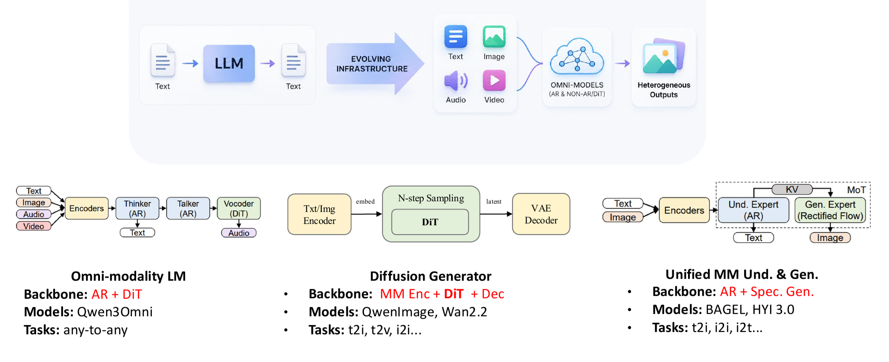
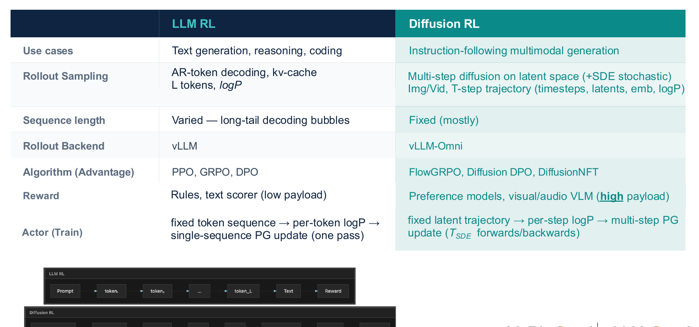
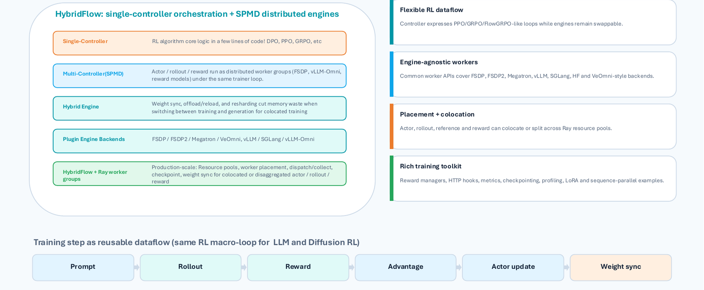
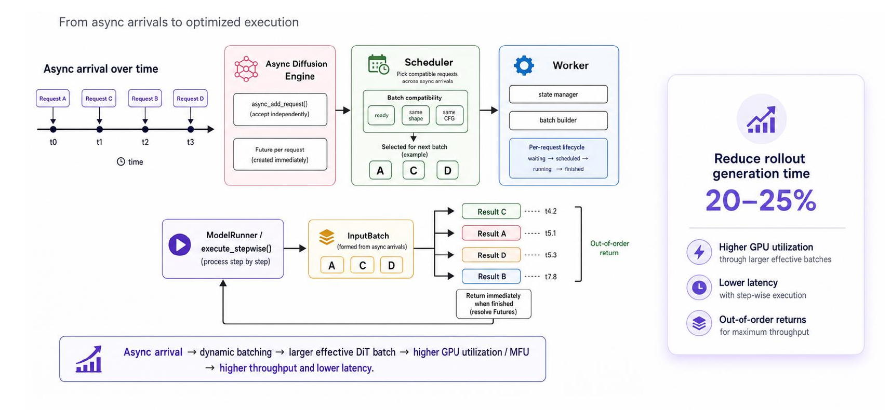
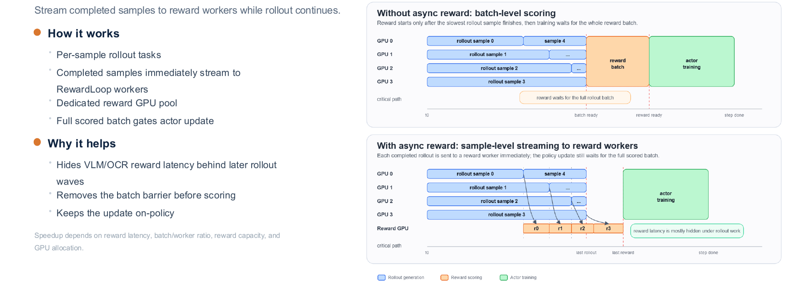
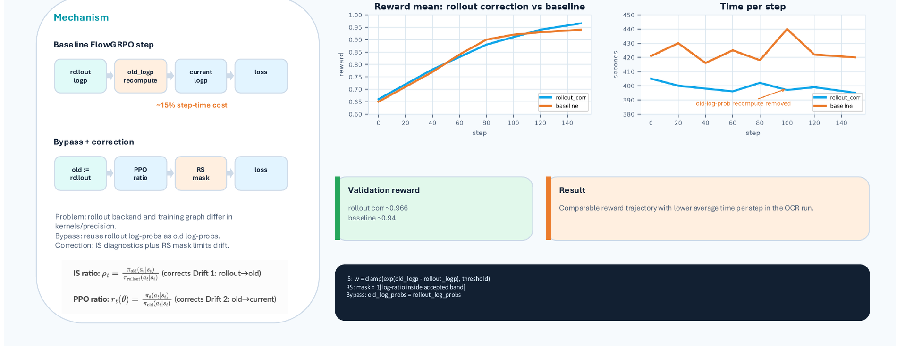
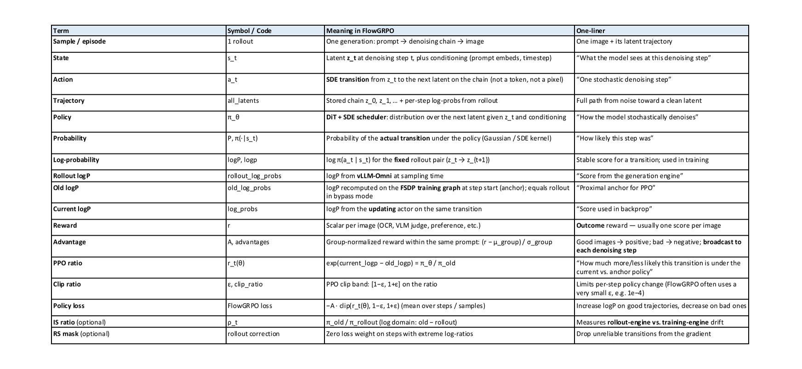
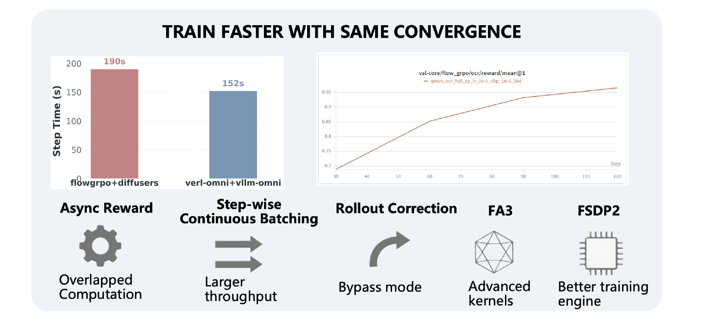
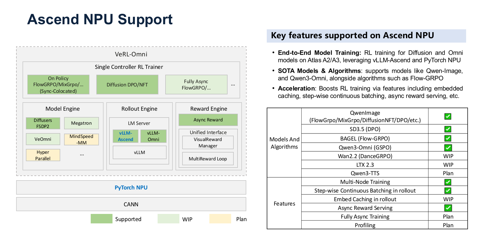

# Core Architecture of VeRL-Omni: System-Level Optimization for Multimodal Reinforcement Learning

**Source video**: [Bilibili BV1qd7n6TEZk](https://www.bilibili.com/video/BV1qd7n6TEZk) · **Slides**: [veRL-Omni Slides](https://drive.google.com/file/d/1T534U3IEK5RzebGZ6sdhLQQ2tXH-pSho/view)

When the training target of reinforcement learning expands from text-only large language models to diffusion models and omni-modal models, the computational characteristics of both the generation and evaluation stages undergo a qualitative shift. Traditional frameworks are designed around the assumption of "fast autoregressive sampling + lightweight rule-based rewards." Once confronted with multi-step denoising trajectories and heavy vision-language rewards, pipeline stalls and resource idling quickly follow. VeRL-Omni is an independent framework split from VeRL precisely to address this structural mismatch—through three core optimizations—asynchronous reward streaming, step-wise continuous batching, and rollout calibration—it compresses per-step training time from 190 s to 152 s on the Qwen-Image scenario, yielding approximately a 20% end-to-end throughput improvement.

This article follows the causal chain of "bottleneck identification → architecture design → layer-by-layer optimization → algorithm mapping → performance validation," providing a thorough analysis of the engineering decisions and technical trade-offs behind this system.

**Target audience**: AI systems engineers and algorithm researchers with a foundation in large-model training who wish to understand system design and performance optimization for multimodal RL (e.g., diffusion models, omni-modal models).

**Prerequisites**:

- Reinforcement learning fundamentals: PPO / GRPO algorithm principles
- Distributed training frameworks for large language models: e.g., Megatron, FSDP
- Basic denoising principles of diffusion models

**Reading objectives**:

1. Understand the core differences in system design between multimodal RL and traditional LLM RL
2. Master VeRL-Omni's HybridFlow architecture and its three core optimizations—asynchronous rewards, continuous batching, and rollout calibration
3. Understand the engineering mapping and boundary conditions of the FlowGRPO algorithm in diffusion models

---

## 1. The Engineering Contradiction of Multimodal RL: A Paradigm Shift from LLMs to Diffusion Models

> **Key question for this section**: Why can't traditional LLM RL frameworks efficiently support training of diffusion models and omni-modal models?

### Diversification of Model Architectures

From text-only LLMs to omni-modal infrastructure, model architectures have diverged into three distinctly different paths. The following figure illustrates this evolution and three representative architecture types, helping us understand the heterogeneity that multimodal RL must contend with.

*Figure caption: Three architecture types for multimodal infrastructure—omni-modal language models, diffusion generators, and unified understanding-generation models. Source: Presentation slides, page 8*

Key feature comparison across the three paths:

| Architecture Type | Core Backbone | Representative Models | Output Modalities |
|---|---|---|---|
| Omni-modality LM | AR Thinker + AR Talker + DiT Vocoder | Qwen3-Omni | Text + Speech |
| Diffusion Generator | Multimodal Encoder + N-step Sampling DiT + VAE Decoder | Qwen-Image, Wan2.2 | Image / Video |
| Unified MM Und. & Gen. | AR Understanding Expert + Rectified Flow Generation Expert | BAGEL | Text + Image |

Key observation: **All three architecture types contain non-autoregressive components**—DiT vocoders, N-step diffusion sampling, or Rectified Flow. The generation process is no longer token-by-token appending but rather multi-step denoising iterations in latent space (the compressed feature space internal to the model). This structural difference is the fundamental reason why traditional LLM RL pipelines break down.

### Item-by-Item Comparison of LLM RL vs. Diffusion RL

The following table juxtaposes the key dimensions of the two RL training scenarios and serves as the direct basis for identifying system bottlenecks.

*Figure caption: Differences between LLM RL and Diffusion RL in sampling, sequence length, backend, algorithm, reward, and training update approach. Source: Presentation slides, page 10*

A row-by-row breakdown of the dimensions that most impact system design:

**Rollout Sampling**: LLM RL performs autoregressive token decoding, producing one discrete token per step; Diffusion RL performs multi-step diffusion sampling in latent space, outputting an entire frame of continuous latent variables per step. The memory footprint patterns and operator scheduling are completely different.

**Sequence Length**: LLM output sequence length is highly variable depending on problem difficulty; the number of denoising steps in diffusion models is typically fixed (marked as "Fixed (mostly)" in the slides), but the computation per step is far greater than a single token forward pass.

**Rollout Backend**: LLM RL commonly uses high-throughput inference engines such as vLLM; Diffusion RL requires a specialized backend capable of hosting multi-step DiT (Diffusion Transformer, the Transformer backbone in diffusion models) inference—referred to as vLLM-Omni in VeRL-Omni.

**Reward Computation**: This is the most easily underestimated bottleneck. LLM RL rewards are often rule matching or lightweight text scorers; Diffusion RL rewards require invoking a VLM (Vision-Language Model), OCR, or preference model to score the generated images/audio, and the cost of a single evaluation can rival that of a complete generation.

**Actor Training (Policy Update)**: LLM RL performs policy gradient updates on a single sequence; Diffusion RL needs to perform joint updates over multi-step denoising trajectories, corresponding at the algorithm level to specialized algorithms such as FlowGRPO (Flow-based GRPO, a GRPO variant adapted for diffusion models).

### The Cascading Causal Chain of Bottlenecks

Linking the above differences together, the blocking path becomes clear:

1. **Generation becomes heavy**—Multi-step DiT sampling causes per-rollout latency and memory usage to grow by multiples;
2. **Evaluation becomes heavy**—VLM/OCR rewards turn the "nearly free" scoring step into another GPU-intensive task;
3. **Pipeline stalls**—Traditional frameworks assume reward computation is far faster than generation and execute both serially on the same set of GPUs; once rewards are equally expensive, the GPUs designated for Actor training are forced to idle for extended periods;
4. **Backend incompatibility**—vLLM's token-level scheduling cannot directly serve DiT inference; forcing an adaptation introduces additional serialization overhead.

The compounded result of these four layers: even when single-card compute capacity is sufficient, overall training throughput remains locked to the slowest stage.

> **Conclusion**: The core contradiction of multimodal RL is that **both the generation and evaluation sides simultaneously become compute-intensive tasks**, breaking the implicit assumption of "lightweight rewards, fast sampling" in LLM RL frameworks. This is the direct motivation for VeRL-Omni to split from VeRL as an independent repository to pursue faster iteration. The comparison above primarily targets image and video diffusion scenarios; for other modalities such as speech, reward load characteristics may differ, and the presentation materials did not provide quantitative data for those cases.

---

## 2. Global Perspective: HybridFlow Architecture and Engine Decoupling

> **Key question for this section**: How can generation, reward, and training—three heterogeneous and time-consuming computation streams—be coordinated under a single controller?

A single training step in multimodal RL involves at least three fundamentally different types of computation:

| Stage | Computation Characteristics | Typical Backend |
|-------|---------------------------|-----------------|
| **Rollout (Generation)** | Autoregressive decoding or diffusion sampling, latency-sensitive | vLLM-Omni |
| **Reward** | Multimodal evaluation, amenable to asynchronous execution | Vision/Audio reward models |
| **Actor Update (Training)** | Gradient computation and parameter updates, memory-intensive | FSDP2 / VeOmni / Megatron |

The three stages differ drastically in GPU utilization patterns, parallelism strategies, and memory requirements. VeRL-Omni's design choice is: **use a single controller to express the global RL logic, while letting each stage run as an independent SPMD (Single Program, Multiple Data—a parallel paradigm where the same program executes simultaneously across multiple devices) distributed worker group**—this is the HybridFlow architecture.

### Architectural Layers and Data Flow

The following figure shows the complete layered structure from controller to engines, helping to understand the responsibility boundaries and interaction patterns of each component.

*Figure caption: HybridFlow layered structure and reusable data flow. Source: Presentation slides, page 11*

Four layers presented from top to bottom:

**Single-Controller Layer**: Located at the topmost level, responsible for expressing the macroscopic logic of the RL algorithm—for example, the loop flow of FlowGRPO, MixGRPO, or DPO (Direct Preference Optimization). The controller itself is an ordinary Python control flow that carries no tensor computation; it only issues instructions such as "execute Rollout," "compute Reward," and "update Actor."

**SPMD Worker Group Layer**: Actor, Rollout, and Reward each form independent distributed worker groups. Within each group, synchronization occurs via collective communication (e.g., NCCL AllReduce); between groups, coordination is handled by the upper-level controller.

**Engine-Agnostic Layer**: Worker groups are not bound to specific backends. The training engine can be FSDP2, VeOmni, or Megatron; the inference engine can be vLLM-Omni or SGLang. When switching hardware or upgrading frameworks, only the engine plugin needs to be replaced—the controller logic requires no modification.

**Ray Resource Pool**: All worker groups run on a Ray cluster, supporting flexible placement and co-location strategies—for example, after Actor training completes, its GPUs can be immediately reused by the Rollout worker group.

The linear flow at the bottom of the figure shows how a single training step is abstracted into a reusable data-flow pipeline:

> **Prompt → Rollout → Reward → Advantage → Actor update → Weight sync**

Regardless of whether the underlying model is a large language model or a diffusion model, this macroscopic loop structure remains consistent; differences are reflected only in the internal engine implementations of each stage.

### Minimal State Evolution: Life Cycle of an Image-Generation Prompt

Taking as an example a single image-generation prompt that includes a reference image, we trace its complete life cycle across different worker groups:

| Step | Worker Group | Action | Output |
|------|-------------|--------|--------|
| ① | Controller | Sample prompt from dataset, dispatch to Rollout group | Prompt batch |
| ② | Rollout group (vLLM-Omni) | Execute multimodal sampling, generate image trajectories | Trajectories |
| ③ | Reward group (visual reward model) | Evaluate trajectory quality | Scalar reward per trajectory |
| ④ | Controller | Aggregate rewards, compute advantage values | Advantage tensors |
| ⑤ | Actor group (FSDP2) | Execute policy gradient update based on advantages | New parameters |
| ⑥ | Controller | Synchronize new weights back to Rollout group | Weight consistency |

Results from steps ② and ③ are passed between worker groups via a TransferQueue or RPC mechanism. The weight synchronization direction in step ⑥ is Actor → Rollout, ensuring the next round of generation uses the latest policy.

### Boundary Conditions

- **Inter-process communication overhead**: Worker group decoupling provides flexibility, but trajectory data (especially images or audio) can become a bottleneck during inter-group transfer. The presentation materials did not provide specific latency data for this stage.
- **Serial constraint of the single controller**: The current data flow is a linear pipeline, with Rollout and Reward executing serially by default. To achieve inter-stage pipeline parallelism, asynchronous scheduling logic must be introduced at the controller level—the "step-wise continuous batching" discussed in the next section and the subsequent "asynchronous reward streaming" are designed precisely for this purpose.
- **Validation cost of engine replacement**: Although the architecture achieves engine-agnosticism at the design level, each new backend still requires adaptation of data formats and communication protocols—it is not zero-cost hot-swapping.

> **Summary**: HybridFlow, through its layered design of "single-controller orchestration + SPMD worker group execution," converges the global complexity of RL training into a reusable linear data flow, while retaining the flexibility to adapt to different model architectures and hardware backends. Next, we dive into the three bottleneck points in the data flow—Rollout, Reward, and Actor Update—to see how VeRL-Omni optimizes each layer.

---

## 3. Generation Optimization: Step-Wise Continuous Batching to Break the Denoising Latency Barrier

> **Key question for this section**: Multi-step denoising in diffusion models causes request arrival and completion times to vary—how can GPU throughput be maximized during the Rollout stage?

Each generation request in a diffusion model must undergo multi-step denoising iterations. Different requests may require different numbers of denoising steps, and latent shapes (i.e., the spatial resolution of intermediate latent variables) may also vary depending on the target resolution. Traditional static batching binds a batch of requests together, requiring a wait until the slowest request finishes before releasing resources—requests with fewer steps are forced to idle along, and the wasted compute becomes padding overhead.

VeRL-Omni's solution is **step-wise continuous batching**: using a single denoising step as the scheduling granularity, the scheduler re-evaluates at every step which requests can be grouped together for execution, enabling dynamic request insertion and out-of-order return.

### Complete Execution Pipeline

The following figure shows the complete timeline from asynchronous request arrival, to scheduler batching, to out-of-order return—the core for understanding this mechanism.

*Figure caption: Asynchronously arriving requests are batched by the Scheduler based on shape and CFG compatibility, executed step-by-step by the ModelRunner, and returned out of order. Source: Presentation slides, page 16*

Five key stages in the figure:

| Stage | Element in Figure | Responsibility |
|-------|-------------------|----------------|
| Asynchronous Arrival | Requests A → C → B → D appearing sequentially on the timeline | Submitted at different times, with varying step counts and latent shapes |
| Async Diffusion Engine | Async Diffusion Engine | Receives requests and buffers them in a pending scheduling queue |
| Scheduler | Selects compatible subsets from the queue | Determines compatibility along two dimensions: latent shape and whether CFG (Classifier-Free Guidance) is enabled |
| Worker / ModelRunner | Executes denoising step by step | After completing each step, checks which requests have reached their target step count |
| Out-of-Order Return | Result C → A → D → B | Requests that finish first release memory first, freeing slots for subsequent requests |

### Why It Saves 20–25%: A Three-Layer Causal Relationship

1. **Shape alignment eliminates padding**: The Scheduler only places requests with identical latent shapes into the same batch, ensuring tensor dimensions match exactly and the effective computation ratio per denoising step approaches 100%.

2. **Step decoupling frees slots**: Requests that have completed denoising are ejected immediately; the vacated slot can be filled by a new request at the very next step, ensuring the GPU is always processing meaningful computation.

3. **Larger effective batch size**: Because slots are continuously reclaimed and replenished, the effective batch seen by the DiT model at each step is typically larger than under a static scheme, leading to higher hardware utilization of matrix multiplication units.

Data from the presentation slides indicate that the above mechanism yields a **20–25%** reduction in Rollout generation time. Note that this figure was not accompanied by specific baseline configuration or hardware model constraints in the materials.

### Minimal Example: State Evolution of Four Requests

| Request | Arrival Order | Denoising Steps | Latent Shape |
|---------|--------------|-----------------|-------------|
| A | 1st | 4 steps | 32×32 |
| C | 2nd | 2 steps | 32×32 |
| B | 3rd | 5 steps | 64×64 |
| D | 4th | 3 steps | 32×32 |

- **Steps 0–1**: A and C arrive first, both with 32×32 latent shapes, and are batched together for the first two steps.
- **End of Step 2**: C requires only 2 steps and completes first, returning its result. D arrives and enters the queue.
- **Step 3**: D (32×32) fills the vacated slot and executes alongside A. B (64×64) has an incompatible shape and must wait for a separate batch.
- **End of Step 4**: A completes and returns. D executes its final step and also returns.
- **End of Step 5**: B completes and returns.

The final return order C → A → D → B differs entirely from the submission order A → C → B → D—the 32×32 slots experience virtually no idle time.

### Boundary Conditions

- **Scenario with maximum benefit**: The greater the variation in step counts across requests and the more dispersed their arrival times, the more frequently idle slots are reclaimed, and the more significant the throughput improvement.
- **Scenario with diminished benefit**: When all requests have identical step counts and shapes and arrive simultaneously, the mechanism degrades to ordinary static batching, with negligible scheduling overhead.
- **Shape fragmentation risk**: When latent shape varieties are too numerous, each kind can only form a small batch, potentially reducing rather than increasing GPU utilization. The presentation materials did not provide a mitigation strategy for this scenario.

> With generation throughput improved, a large volume of samples floods into the reward computation stage. When VLM evaluation latency is equally high, another asynchronous mechanism is needed to eliminate pipeline bubbles at the evaluation stage.

---

## 4. Reward Optimization: Asynchronous Streaming to Mask VLM Latency

> **Key question for this section**: VLM/OCR reward evaluation has extremely high latency—how can it be prevented from blocking the entire training pipeline?

### The Idle Wait Under Synchronous Mode

When the framework launches reward computation only after the Rollout for the entire batch is complete, the timeline looks as follows:

| Stage | Resources Occupied | Parallelizable? |
|-------|-------------------|-----------------|
| Rollout (full batch) | Actor GPU | Yes, but must wait for the last sample to finish |
| **Synchronization barrier** | — | Proceeds to next step only after all samples are ready |
| Reward evaluation (full batch) | Reward Workers / VLM GPU | Parallelizable within the batch, but serial with Rollout |
| Policy update | Actor GPU | Waits for all rewards to return |

Generation lengths vary significantly across samples—a short response may have finished long ago, yet it must wait for the longest sample to complete before all can be sent for scoring together. The evaluation latency is exposed on the critical path as the latency of the entire batch.

### Core Mechanism of Asynchronous Reward Streaming

VeRL-Omni breaks the batch-level synchronization barrier by pushing the granularity down to individual samples:

1. **Immediate triggering**—As soon as any single sample finishes generation, it is pushed to an idle Reward Worker without waiting for other samples in the same batch.
2. **Pipeline overlap**—While early-finishing samples undergo VLM/OCR evaluation on Reward Workers, the Actor GPU continues generating the remaining samples. VLM latency is "hidden" within the time window of subsequent Rollouts.
3. **On-policy consistency**—All samples still belong to the same Rollout batch, generated using the same version of the policy, so updates satisfy the on-policy requirement.

The following figure visually compares the timing of the two modes; pay particular attention to the start time of the Reward entries.

*Figure caption: Left side shows batch-level scoring, where Reward starts only after all Rollouts complete; right side shows sample-level streaming, where completed samples immediately enter the Reward Worker. Source: Presentation slides, page 20*

In the left scheme, all Reward entries are aligned to start uniformly after the Rollout completion line; in the right scheme, each Reward entry begins immediately after its sample completes, forming a temporal overlap region with the remaining Rollouts. The larger the overlap area, the more VLM latency is hidden.

### Minimal Example

Suppose a batch contains 4 samples with Rollout durations of 2 s, 4 s, 6 s, and 8 s respectively, and VLM evaluation takes 5 s per sample.

**Synchronous mode**: All Rollouts finish at second 8 → Reward starts at second 8 with parallel evaluation → completes at second 13, total duration **13 s**.

**Asynchronous mode** (with sufficient Reward Workers): Sample 1 is sent for evaluation at second 2, returns at second 7; Sample 2 at second 4, returns at second 9; Sample 3 at second 6, returns at second 11; Sample 4 at second 8, returns at second 13. The Reward latency of the first three samples is entirely covered by the Rollout phase. When Rollout duration increases further or Reward capacity is ample, total time approaches $\max(\text{Rollout}_\text{total},\;\text{Reward}_\text{last})$, rather than their sum.

### Acceleration Bounds

The actual benefit of asynchronous streaming is highly dependent on the following factors:

- **Ratio of reward latency to Rollout duration**: The slower each VLM evaluation and the longer the total Rollout time, the larger the window available for hiding latency.
- **Ratio of batch size to Worker count**: When Workers are insufficient, samples queue up, reducing the overlap.
- **GPU resource allocation**: Actor and Reward Workers share cluster resources; imbalanced allocation causes one side to idle.

> The presentation materials did not provide end-to-end acceleration numbers for specific hardware configurations; actual gains must be determined through profiling based on the workload and cluster scale. With the blocking issues in generation and rewards resolved, the Actor update stage reveals another overhead—the recomputation of old-policy log-probabilities—which is the bottleneck addressed in the next section.

---

## 5. Training Optimization: Rollout Calibration and Log-Probability Reuse

> **Key question for this section**: Differences in computation graphs between the generation backend and the training backend make recomputing old-policy log-probabilities (old logp) expensive—how can generation-stage data be safely reused?

In PPO-based training, each step requires two log-probabilities: the **current policy log-probability** (current logp) for gradient computation, and the **old policy log-probability** (old logp) for constructing the importance sampling ratio (the ratio of new to old policy probabilities, used to correct the magnitude of policy updates). The standard approach is to run an additional forward pass through the training engine on the generated sequences to precisely compute old logp.

The contradiction is: VeRL-Omni's generation backend (vLLM-Omni) and the training backend are not perfectly consistent in operator kernels and numerical precision. The generation stage already produces per-token log-probabilities, but directly using them as old logp introduces mathematical drift. This creates an engineering dilemma: **recomputation is safe but expensive; reuse is cheap but risky.**

### Baseline vs. Bypass Flow Comparison

The following figure compares the workflows and measured results of the two strategies, serving as the direct basis for assessing the feasibility of this optimization.

*Figure caption: Left side compares the pipelines of the baseline and Bypass approaches; right side shows measured curves for validation reward and per-step duration. Source: Presentation slides, page 17*

**Left side—Workflow comparison**

| Step | Baseline FlowGRPO | Bypass + Correction |
|------|--------------------|---------------------|
| ① Obtain rollout logp | Produced during generation | Produced during generation |
| ② Compute old logp | **Additional forward pass to recompute** | **Directly set old logp := rollout logp** |
| ③ Compute current logp | Training engine forward pass | Training engine forward pass |
| ④ Compute PPO ratio | ratio = exp(current − old) | Same, but old comes from rollout |
| ⑤ Outlier handling | PPO clip | **RS mask filtering** |
| ⑥ Compute Loss | Standard PPO loss | Masked PPO loss |

The key difference is in step ②: the baseline approach requires running an additional forward pass through the training engine over the full sequence to obtain old logp, a step that accounts for approximately **15%** of the total training step time (this data comes from presentation slides page 17, tested under the FlowGRPO scenario). The Bypass approach skips this recomputation and directly reuses the generation backend's output.

**Right side—Validation curves**

On the reward mean dimension, the Bypass approach reaches approximately 0.966, while the baseline reaches approximately 0.94—comparable levels (the slides did not provide confidence intervals, so the absolute difference should not be over-interpreted). On the per-step duration dimension, the Bypass curve is noticeably lower than the baseline, consistent with the 15% savings.

### Causal Chain for Safe Reuse

The PPO ratio is defined as:

$$r_t = \exp\!\bigl(\log\pi_\theta(a_t|s_t) - \log\pi_{\theta_{\text{old}}}(a_t|s_t)\bigr)$$

where $\log\pi_{\theta_{\text{old}}}$ is old logp. If old logp incurs a shift $\delta$ due to kernel or precision differences, the ratio is amplified to $r_t \cdot e^{\delta}$. When $\delta$ accumulates across a long sequence, the ratio deviates significantly from 1.0, violating PPO's trust-region constraint.

VeRL-Omni's countermeasure operates at two levels:

1. **Importance sampling diagnostics (IS diagnostics)**: Compute the importance weight $w = \prod_t r_t$ at the sequence level, monitoring the systematic bias between rollout logp and training logp.
2. **Rejection Sampling mask (RS mask)**: For sequences where $w$ deviates from 1.0 beyond a threshold, the loss weight for that sequence is set to zero—i.e., the sample is discarded entirely, rather than merely clipping the ratio.

Design rationale: **Rather than clipping in ratio space, reject in sample space.** Clipping can only limit the ratio range per token, whereas precision drift tends to accumulate along the sequence dimension; sequence-level rejection provides a more thorough way to isolate anomalous samples.

### Minimal Example

Suppose a 4-token sequence has rollout logp of $[-1.20, -0.85, -2.10, -0.50]$, and the training engine's current logp is $[-1.18, -0.83, -2.08, -0.49]$.

- **Baseline approach**: The training engine additionally computes old logp as $[-1.19, -0.84, -2.09, -0.50]$, which differs minimally from current logp, keeping the ratio close to 1.0.
- **Bypass approach**: old logp is taken directly from the rollout values. With per-token shifts of approximately 0.01–0.02 across 4 tokens, the sequence-level $w$ deviates only slightly from 1.0. The RS mask is not triggered, and the sample participates in training normally.

If a 256-token-long sequence accumulates a consistent directional precision shift at every position, $w$ can deviate significantly from 1.0. In this case, the RS mask discards it, preventing the drift from propagating into the gradient update.

### Boundary Conditions

- **RS mask threshold sensitivity**: Too loose and anomalous ratios leak through, destabilizing training; too tight and too many samples are discarded, shrinking the effective batch size. The presentation materials did not disclose specific threshold values; deployment requires calibration based on the IS diagnostics distribution histogram.
- **Scope of applicability**: This mechanism was demonstrated in the slides for the FlowGRPO scenario; whether it is equally applicable to other algorithms such as MixGRPO was not explicitly stated in the materials.
- **Re-calibration upon backend changes**: Differences in softmax kernels, floating-point accumulation order, or quantization strategies across inference backends all affect the logp shift magnitude; when switching backends, the RS mask threshold may need to be re-calibrated.

> At this point, the three core system-level optimizations have been analyzed one by one. Next, we need to answer a more fundamental question: how is the specific RL algorithm objective function expressed and executed on top of this system abstraction?

---

## 6. Algorithm Mapping: Engineering Implementation of FlowGRPO in Diffusion Models

> **Key question for this section**: How is the standard GRPO reinforcement learning objective accurately mapped onto the continuous denoising process of a diffusion model?

In the LLM setting, the "action" in GRPO (Group Relative Policy Optimization) is generating a token, and the "trajectory" is the complete token sequence—concepts that are clear-cut and discrete. However, the generation process of a diffusion model is a continuous denoising path: starting from pure noise, it produces a clean image through N steps of SDE (Stochastic Differential Equation) solving. FlowGRPO maps every component of standard GRPO onto this path through a rigorous terminology mapping plus two key constraints.

### Core Concept Mapping

The following figure is FlowGRPO's complete terminology correspondence table, projecting standard RL concepts one by one into the diffusion denoising context—it is the foundation for understanding the subsequent formulas.

*Figure caption: FlowGRPO terminology mapping reference table—standard RL terms, symbols, FlowGRPO meanings, and intuitions. Source: Presentation slides, page 34*

The three most critical mappings:

| Standard RL Concept | FlowGRPO Counterpart | Intuition |
|---|---|---|
| **State** $s_t$ | Noisy latent at step $t$ | The "current frame" on the denoising path |
| **Action** $a_t$ | Single-step SDE stochastic denoising transition | The model's prediction and removal of noise in one step |
| **Trajectory** $\tau$ | Complete N-step path from pure noise to clean latent | The complete "painting process" for one image |

Unlike discrete token sampling in LLMs, each action step here is a continuous Gaussian transition—the policy network outputs a denoising mean, rather than logits over a discrete distribution.

### Four-Step Execution Flow

**① SDE Rollout (Trajectory Unrolling)**: Given a prompt $q$, the policy diffusion model performs N-step SDE sampling, generating $G$ denoising trajectories ($G$ candidate images). The log-likelihood $\log p_\theta(a_t \mid s_t)$ is recorded at each step.

**② Group Advantage Computation**: The $G$ candidate images are sent to the visual reward model for scoring, yielding scalar rewards $r_1, \ldots, r_G$. Normalization is performed within the same prompt group:

$$A_i = \frac{r_i - \text{mean}(\{r\})}{\text{std}(\{r\})}$$

The normalized $A_i$ is **broadcast to every denoising step of that trajectory**—because the diffusion model's reward is only available after generation completes, and there is no independent per-step reward signal for intermediate steps.

**③ Clipped Update**: The likelihood ratio is computed at each denoising step:

$$\rho_t = \frac{p_\theta(a_t \mid s_t)}{p_{\theta_{\text{old}}}(a_t \mid s_t)}$$

The same clipping operation as PPO is applied (clip range parameter $\epsilon$ typically set to 0.2), preventing excessively large single-update step sizes. The mapping table distinguishes three types of log-prob: Rollout logP (recorded by the generation engine), Old logP (the proximal anchor point), and Current logP (used for backpropagation under the current parameters)—each frozen or updated at different stages.

**④ KL Anchor (Per-Step KL Divergence Anchoring)**: A per-step Gaussian KL penalty term is added to the loss function, measuring the deviation of the current policy's predicted mean from the frozen reference model at each step. Since the conditional distribution of the SDE transition is Gaussian, the KL divergence between two Gaussians has an analytical closed form and does not require Monte Carlo estimation. The mapping table notes a typical magnitude for the KL penalty coefficient of approximately $1\times10^{-4}$.

### Minimal Example: How a High-Scoring Image Drives an Update

Suppose the prompt is "a cat sitting on a windowsill," and the policy model generates $G=4$ candidate images in one pass, with rewards of $[0.3, 0.9, 0.5, 0.7]$.

- Group mean $= 0.6$, standard deviation $\approx 0.2236$;
- The 2nd image's normalized advantage $A_2 \approx +1.34$ (highest), the 1st image's $A_1 \approx -1.34$ (lowest).

$A_2 = +1.34$ is broadcast to all N denoising steps of the 2nd trajectory. The positive advantage causes the log-probability of each transition along this trajectory to be boosted, making the model more likely to follow this path when facing similar prompts in the future. Conversely, the probability of the 1st trajectory is suppressed. The clipping mechanism ensures $\rho_t \in [1-\epsilon, 1+\epsilon]$, and KL anchoring limits the overall drift magnitude.

### Boundary Conditions

The mapping table marks the importance sampling ratio (IS ratio) and rejection sampling mask (RS mask) as **optional** items, indicating that the current implementation does not mandate these two mechanisms. The specific conditions under which they are enabled were not further elaborated in the presentation materials.

---

## 7. End-to-End Performance and Hardware Generalization: From GPU to NPU

> **Key question for this section**: With the above system-level optimizations stacked, what are the actual throughput gains and hardware adaptability?

To determine whether system optimization is successful, two conditions must be simultaneously met: **reduced step time** and **no degradation in convergence quality**.

### Quantitative Throughput Verification

The following figure presents comparative experiments on the Qwen-Image model, with step time on the left and convergence curves on the right—the core data for evaluating the combined effect of the above optimizations.

*Figure caption: Left bar chart compares per-step training time; right line chart shows validation set OCR reward mean as a function of training steps. Source: Presentation slides, page 5*

**Key elements in the figure**:

| Element | Meaning |
|---------|---------|
| Red bar (190 s) | Per-step duration of the `flowgrpo + diffusers` baseline |
| Blue bar (152 s) | Per-step duration of `verl-omni + vllm-omni` |
| Right-side line chart | Validation set OCR reward mean (`val-core/flow_grpo/ocr/reward/mean@1`), with training steps (30–120) on the x-axis |
| Five annotations at the bottom | Five techniques contributing to the throughput improvement |

Per-step time drops from 190 s to 152 s, a **reduction of approximately 20%**. This improvement comes from the synergy of five techniques: asynchronous rewards eliminating pipeline bubbles, step-wise continuous batching improving inference utilization, the Bypass mode of Rollout calibration reducing redundant forward passes, FA3 (FlashAttention 3) providing a more efficient attention computation kernel, and FSDP2 improving communication and memory efficiency during the training phase.

### Convergence Observations at the Algorithm Level

The right side of the figure above contains only a single curve, recording FlowGRPO's validation set OCR reward mean on VeRL-Omni: it climbs steadily from approximately 0.69 at step 30, crosses 0.93 around step 90, and approaches 0.96 by step 120. The significance of this curve is not that it is "faster" but that its **shape matches the baseline**—the contribution of system optimization is reflected in reduced step time rather than in an altered convergence trajectory, demonstrating that the roughly 20% throughput improvement does not come at the cost of training quality.

Convergence differences at the algorithm level come from a separate set of experiments. Page 27 of the presentation deck separately presents the reward curve for the Diffusion NFT algorithm, whose reward mean exceeds 0.9 at around 60 steps, faster than FlowGRPO over the same span. It bears emphasizing that this is a **convergence efficiency advantage arising from algorithm choice**, a different dimension from the system optimization shown in the figure above; the two curves also come from different experimental charts and should not be compared directly on a single plot.

> **Qualifying conditions**: The 20% improvement is strongly tied to the Qwen-Image model and the `diffusers` baseline; specific hardware configuration and model scale were not explicitly stated in the presentation materials. Benefits may differ when switching to other modalities or different model architectures. The interpretation of Diffusion NFT convergence is based on visual inspection of the presentation chart, and the materials provide no same-axis controlled comparison against FlowGRPO, so confidence is moderate.

### Hardware Generalization: Preliminary Support for Ascend NPU

VeRL-Omni has extended its software stack to Huawei Ascend NPU (Neural Processing Unit). The following figure shows the layered software architecture and feature support matrix.

*Figure caption: Left side shows VeRL-Omni's layered software architecture on Ascend; right side shows the support status table for models, algorithms, and acceleration features. Source: Presentation slides, page 22*

**Software stack from top to bottom**:

1. **Single Controller RL Trainer** — Unified orchestration layer, sharing logic with the GPU version.
2. **Model / Rollout / Reward Engine** — Interfaces with NPU hardware via the vLLM-Ascend and PyTorch NPU backends.
3. **CANN** (Compute Architecture for Neural Networks) — Huawei's low-level operator library and driver layer.

The feature table uses color coding to distinguish three statuses: Supported, WIP (Work in Progress), and Plan. Key observations include:

- **End-to-end training**: Full RL training for Diffusion and Omni model types is marked as Supported.
- **Model coverage**: Key models such as Qwen-Image and Qwen3-Omni have been adapted or are in the WIP stage.
- **Acceleration features**: Key optimizations such as step-wise continuous batching and asynchronous reward serving have begun porting, though some remain in WIP or Plan status.

> **Limitation**: The presentation materials did not provide quantitative performance data on NPU. Current Ascend support should be viewed as "end-to-end workflow functional" rather than "performance-aligned with GPU."

---

## Conclusion and Limitations

Reviewing the causal thread of this article—from bottleneck identification to architecture design to layer-by-layer optimization—the following core conclusions can be distilled:

1. **The core contradiction of multimodal RL is that both generation and reward computation simultaneously become compute-intensive tasks**, breaking the implicit assumption of "lightweight rewards, fast sampling" in traditional LLM RL frameworks. This must be addressed through system-level decoupling and asynchronization.

2. **The HybridFlow architecture converges global complexity into a reusable linear data flow**: a single controller orchestrates macroscopic logic, SPMD worker groups independently execute computation at each stage, and the engine-agnostic design preserves flexibility for backend replacement.

3. **Step-wise continuous batching refines scheduling granularity to individual denoising steps**, achieving a 20–25% reduction in generation time during the Rollout stage through shape alignment, step decoupling, and dynamic slot reclamation (specific baseline conditions were not detailed in the materials).

4. **Asynchronous reward streaming lowers the synchronization barrier from batch granularity to sample granularity**, enabling VLM/OCR evaluation latency to overlap temporally with subsequent Rollouts. The actual benefit depends on the relative ratio of reward latency to Rollout duration and on GPU resource allocation.

5. **The Bypass mode of Rollout calibration skips old logp recomputation**, saving approximately 15% of per-step time in the FlowGRPO scenario. Combined with the RS mask's sequence-level rejection mechanism, precision drift risk is kept within an acceptable range.

6. **FlowGRPO maps discrete token-level GRPO to continuous diffusion models through the correspondence "action = single-step SDE transition, trajectory = complete denoising path"**, with clipped ratios and per-step Gaussian KL jointly constraining update magnitude.

7. **On the Qwen-Image model, the stacked optimizations reduce end-to-end per-step time from 190 s to 152 s** (approximately 20%), while FlowGRPO's convergence curve remains consistent with the baseline; in a separate set of experiments, the Diffusion NFT algorithm exhibits faster convergence, reaching a reward level above 0.9 at around 60 steps.

8. **The end-to-end training workflow on Ascend NPU has been brought up**, but several advanced acceleration features remain in WIP or Plan stages, and the presentation materials did not provide quantitative performance comparison data on NPU.

**Key limitations**: Throughput improvement data are based on a specific model and baseline combination (Qwen-Image + `diffusers`-based FlowGRPO), and must be re-validated when transferred to other scenarios; the optimal setting of the RS mask threshold lacks public guidance and relies on per-scenario calibration during deployment; performance maturity on the NPU side awaits quantitative verification; mitigation strategies for extreme scheduling scenarios such as shape fragmentation remain to be addressed. These open questions leave clear directions for subsequent engineering iterations and community contributions.
