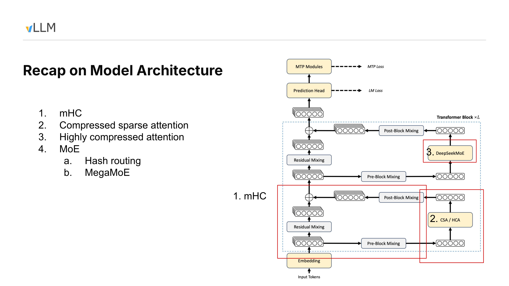
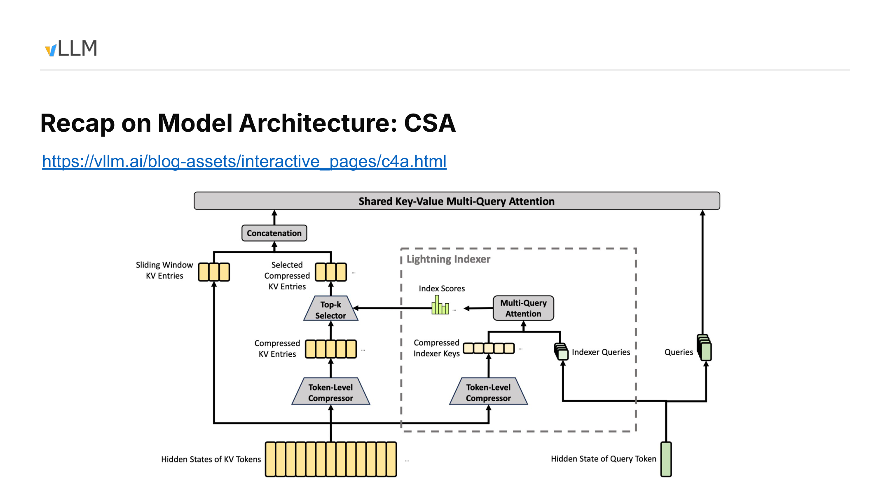
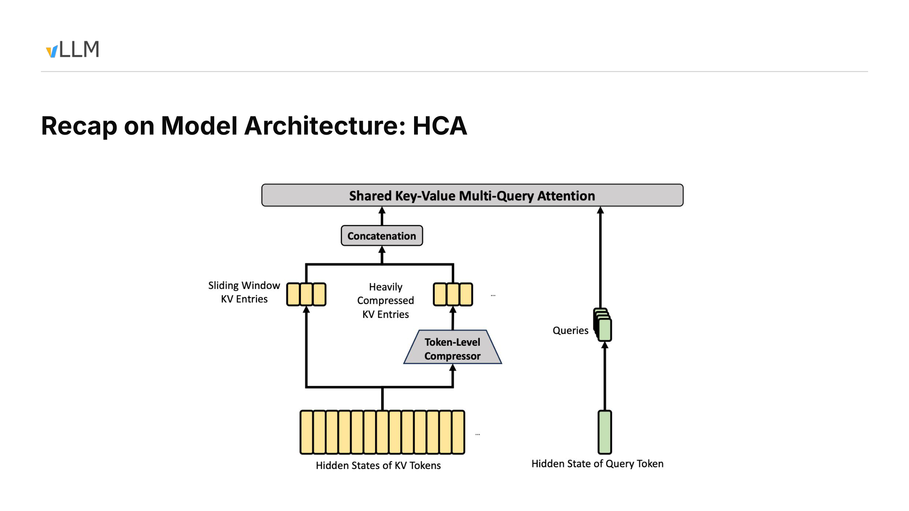
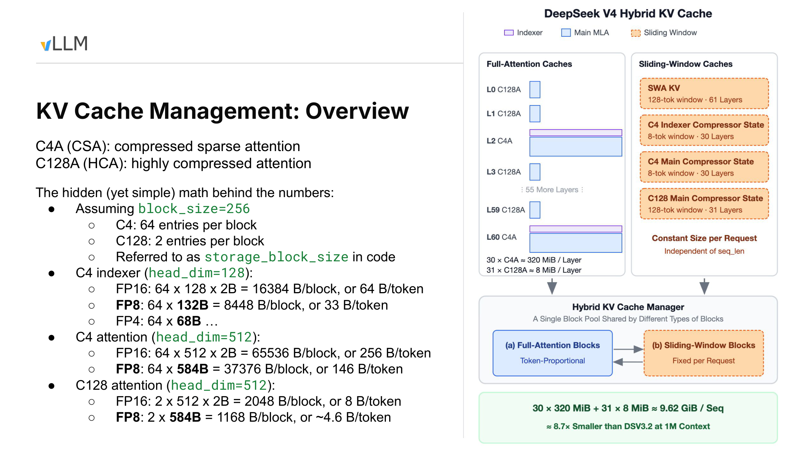
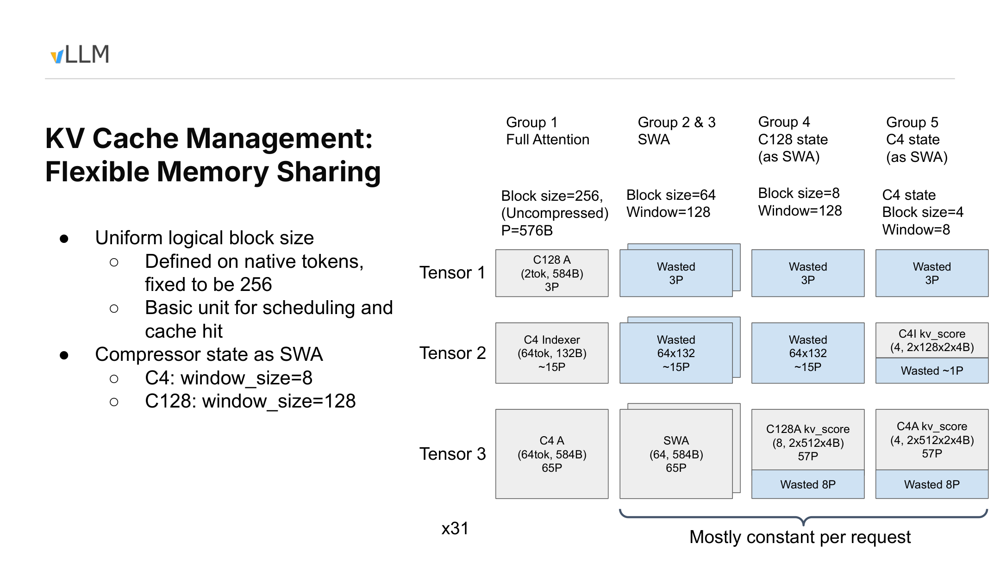
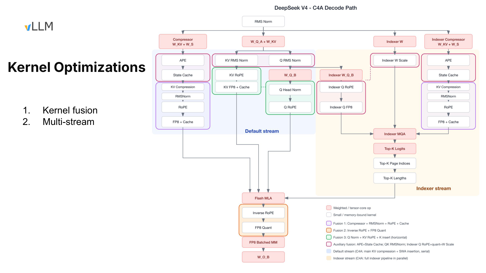
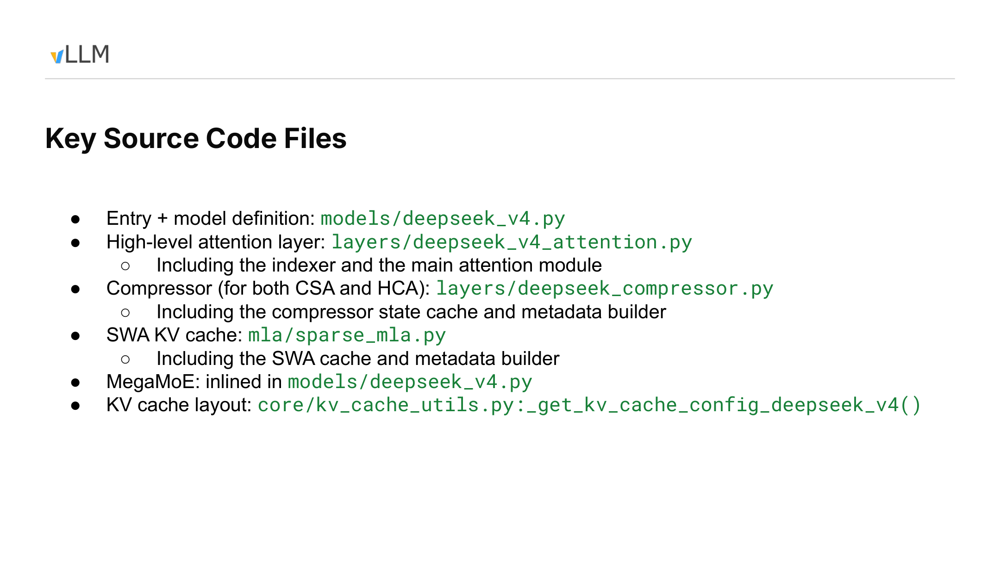

# From Compressed Attention to Executable Inference: How DeepSeek V4 Lands in vLLM

*Understanding the systems engineering behind million-token inference through the causal chain of attention design, heterogeneous caching, memory layout, and dual-stream execution.*

**Source video**: [Bilibili BV17iJF67EaY](https://www.bilibili.com/video/BV17iJF67EaY) · **Slides**: [vLLM DSV4 Internals](https://drive.google.com/file/d/1TtHKTRkL30DngRFmILVSTKriH9h68yJG/view)

Long context begins as a model problem, but it does not end there.

As history grows to the scale of one million tokens, the capacity, memory traffic, and attention computation of a standard KV Cache all continue to increase. DeepSeek V4 reduces this pressure through compressed history, sparse selection, and local windows, but in doing so splits what was once a relatively homogeneous cache into multiple kinds of state, each with different compression ratios, lifetimes, physical sizes, and growth patterns.

Consequently, vLLM’s task is not merely to implement a new attention operator. The system must also answer: How should compressed state be allocated? How are logical tokens mapped to physical entries? How can long requests and large numbers of short requests share GPU memory? How can the Indexer and main attention run concurrently? Which small operators are worth fusing?

Based on the presentation slides and transcript, this article follows the chain of “model architecture → cache capacity → memory layout → Decode execution → source-code entry points.” Content that can be confirmed from the slides is annotated with PPT page numbers. Important figures, performance observations, and future plans supported only by the talk are noted in footnotes. Implementation details, accuracy ablations, and performance conditions absent from the materials are consistently listed as items requiring verification.

## Intended Audience, Prerequisites, and Learning Objectives

This article is intended for engineers who understand the basics of Transformers, attention, and GPU inference but are not yet familiar with DeepSeek V4 or vLLM’s hybrid-cache implementation.

The following background knowledge is recommended:

- An understanding of Prefill, Decode, and the KV Cache in autoregressive inference.
- Familiarity with Multi-Query Attention, MoE, RoPE, FP16, FP8, and GPU kernel launches.
- The ability to distinguish among logical tokens, compressed entries, logical blocks, physical blocks, and allocation-alignment units.
- An understanding that sliding-window caches and caches that grow with the full sequence have different lifetimes.

After reading, you should be able to:

- Explain how CSA and HCA represent long-term history, and why SWA remains indispensable.
- Verify cache overhead from `block_size`, `storage_block_size`, representation dimensions, and data types.
- Understand why heterogeneous state requires a Hybrid KV Cache Manager.
- Locate the synchronization points among the default stream, Indexer stream, and Flash MLA in C4A Decode.
- Distinguish facts shown on the slides, observations stated in the talk, reasonable inferences, and conclusions that still require source-code verification.

---

## 1. The Model Compresses History, but the System Ends Up with More State

When DeepSeek V4 targets a context of approximately one million tokens, it cannot simply enlarge the KV Cache used by standard attention. As the sequence grows, cache capacity, memory traffic, and computation all continue to increase. Even if GPU memory can barely accommodate the data, the inference system may still be unable to schedule it at an acceptable cost.

The model therefore adopts compression and sparsification, which introduces a new systems tension: fewer historical entries are retained, but the number of cache types increases.

Why begin with the overall architecture diagram? Because the model-side origins of compressed history, the Indexer Cache, local windows, compressor state, and the MoE execution path discussed later can all be found in this diagram.



*Figure 1: Overview of the DeepSeek V4 model architecture. Source: presentation PPT, page 2.*

Data flows from `Input Tokens` through `Embedding` into repeated Transformer Blocks. The “×L” in the diagram indicates only that the block is repeated; the layer count cannot be determined from it. The materials also do not provide the tensor shapes, number of experts, or training-loss weights at this point.

Each block contains three groups of designs that must be distinguished.

The first is **mHC**. The materials describe it as a multi-path residual enhancement architecture spanning pre-mixing, residual mixing, and post-mixing paths within the block. Before entering attention or MoE, the multi-path representations are restored to the single-path hidden state required by downstream modules. The speaker’s statement that it “does not affect downstream interfaces” means only that downstream modules still receive a single-path representation; it cannot be extended to mean there is no additional computation, numerical change, or implementation cost.[^T02T03]

The second is the two layer configurations used by the attention branch:

- **CSA (Compressed Sparse Attention, also called C4A)**: compresses history at an approximate ratio of 4:1, then uses an Indexer to select the Top-k entries that participate in the current attention computation.
- **HCA (Highly Compressed Attention, also called C128A)**: compresses history at an approximate ratio of 128:1; its architecture diagram no longer shows the explicit Top-k selection path used by CSA.

CSA and HCA are not two attention paths executed simultaneously within the same layer. They are two layer configurations used by the Transformer Block’s attention branch. In the model statistics shown on the slide, C4A and C128A layers are interleaved across the model; their compression ratios, cache counts, and access patterns all differ.

The third group is **DeepSeekMoE**. The diagram includes Hash Routing and MegaMoE. According to the speaker, the first three layers assign experts to tokens through a fixed hash table rather than selecting them dynamically with a gate, and the speaker relayed a claim from the relevant report that this approach may be easier to train. Because the materials provide no controlled training comparison, this can only be treated as an attributed design description, not an experimental conclusion.[^T03]

MegaMoE points toward the execution layer: it integrates expert computation, communication, and some fragmented operations into larger execution units to reduce fragmented scheduling and kernel launches. The evidence boundaries for this claim are discussed in Section 6.

At the top of the diagram are also a `Prediction Head` and `MTP Modules`, connected to LM Loss and MTP Loss, respectively. The arrows express only the training-objective relationships shown in the diagram. The materials do not specify loss weights or whether MTP is enabled during inference, so no online execution behavior can be inferred from them.

Mapping the model architecture to systems responsibilities yields the following problem map:

| Model architecture | New or modified state | vLLM systems responsibility |
|---|---|---|
| mHC multi-path residual streams | In-block multi-path representations and mixing process | Preserve downstream interfaces and arrange representation transformations |
| CSA layers | Compressed history, Indexer information, and local uncompressed state | Coordinate cache allocation, Top-k selection, and main attention |
| HCA layers | Historical entries with a higher compression ratio and slower growth | Manage storage at a scale different from native tokens |
| DeepSeekMoE | Routing results, expert computation, and communication tasks | Schedule expert paths and reduce fragmented launches |

If the history length is \(N\), temporarily ignoring boundaries and the recent window, the number of CSA compressed entries is approximately \(N/4\), while HCA has approximately \(N/128\). For example, when \(N=128\), they correspond to roughly 32 and 1 compressed historical entries, respectively.

This is only a relationship between entry counts, not a complete GPU-memory accounting. The actual state also includes the Indexer Cache, main-attention KV, compressor state, and **SWA (Sliding Window Attention)** for retaining recent tokens.

Compressed attention does not eliminate cache management. It transforms one homogeneous KV Cache that grows with tokens into multiple types of state with different scales, purposes, and lifetimes. We begin with the more structurally complex CSA to examine why these states arise.

---

## 2. CSA: Why Sparse Selection Is Still Needed After Capacity Compression

CSA simultaneously targets three goals:

- Preserve recent tokens at their original granularity as much as possible.
- Prevent long-term history from continuing to grow in proportion to the native token count.
- Avoid making the current query traverse the entire compressed history during the main attention computation.

CSA therefore uses two levels of reduction:

1. Token compression reduces the number of long-term historical entries actually stored.
2. Top-k selection limits the range of history actually accessed by the current Decode step.

The former controls capacity; the latter controls the computation performed in the current step. Neither can replace the other.

Why examine the following diagram? It divides CSA into two data paths: one produces the KV required by main attention, while the other scores the compressed history. Only by tracing both paths along the arrows can we see the distinction between “storing less” and “reading less.”



*Figure 2: The main KV path and Lightning Indexer path in CSA. Source: presentation PPT, page 3.*

### Main KV Path: Compressed Long-Term History, Direct Access to Recent Tokens

At the lower left of the diagram, KV token hidden states split into two upward paths:

- One path directly forms **Sliding Window KV Entries**, which retain recent tokens near the query.
- The other passes through the **Token-Level Compressor** to form **Compressed KV Entries**, representing earlier history with fewer entries.

In the example from the talk, the main compression ratio is approximately 4:1: every four native tokens correspond to one compressed entry. Adjacent updates use compressor state covering eight tokens and advance in increments of four new tokens.

Even after reducing the entry count to one quarter, compressed history still grows with the sequence. If every current query computes attention against all compressed entries, the computational scale merely grows more slowly; it does not become constant.

### Indexer Path: Deciding Which Historical Entries to Read Now

The **Lightning Indexer** is a lightweight indexing path:

1. Historical hidden states are compressed into **Compressed Indexer Keys**.
2. The current query hidden state produces **Indexer Queries**.
3. The two enter the Indexer Multi-Query Attention shown in the diagram, producing **Index Scores** for candidate entries.
4. The Top-k Selector chooses which compressed history to access in the current step based on those scores.

The selected **Selected Compressed KV Entries** are then concatenated with the **Sliding Window KV Entries** and passed into the main attention path represented by Shared Key-Value Multi-Query Attention.

The final input can be written as:

\[
KV_{\text{actual}}
=
KV_{\text{selected-history}}
\mathbin{\Vert}
KV_{\text{recent-window}}
\]

where \(\Vert\) denotes concatenation.

Thus, the Indexer determines the access locations, while main attention reads the corresponding KV and computes the output. Long-term history is retrieved by relevance, whereas recent tokens are retained directly by the local window.

### How Two Adjacent Compression Updates Connect

The materials confirm three quantities:

- The compression ratio is approximately 4:1.
- The example compressor state covers eight tokens.
- Four new tokens are added between adjacent updates, giving an update stride of four.

The materials do not confirm warm-up behavior, padding, when the first compressed entry is emitted, or boundary-alignment rules. Therefore, the following table represents only two adjacent updates after entering the steady-state update phase, without binding them to absolute token indices.

| Relative phase | New input in this round | Compressor state | Confirmed result |
|---|---|---|---|
| Update \(u\) | 4 new tokens | Uses state within the current coverage range | Forms or updates one compressed entry |
| Between two updates | The next group of 4 new tokens has not yet accumulated | Retains existing state while absorbing new input | New tokens remain visible through Sliding Window KV |
| Update \(u+1\) | Another 4 new tokens | The state window advances by 4 positions while retaining overlapping information | Forms the next compressed entry |

Using an abstract window of length eight to represent the steady state:

```text
Update u:     [a b c d e f g h]
Update u+1:           [e f g h i j k l]
```

Adjacent updates use overlapping state windows. The two windows overlap by four tokens, but the materials do not establish how this overlap affects the semantic coverage of an individual compressed entry.

Two kinds of “window” must likewise be distinguished:

- Eight tokens is the coverage of the C4 compressor state in the example from the talk.
- Sliding Window KV retains recent raw KV, but its exact window length is not confirmed in the materials.

When the real implementation emits its first entry, whether it pads during warm-up, and how it aligns sequence boundaries all require verification against the corresponding source-code version.

This is precisely why SWA must exist: compressed entries are updated at fixed strides, but new tokens must become immediately visible to queries. Recent tokens that have not yet entered the next compression update do not disappear from the context; they remain in Sliding Window KV.

### Responsibility Boundaries Among the Three Mechanisms

| Mechanism | What it changes | What it does not change | Primary purpose |
|---|---|---|---|
| Token compression | Number of long-term historical entries actually stored | Whether the current query accesses all compressed entries | Reduce the growth rate of cache capacity |
| Top-k selection | Range of history accessed by the current computation | Total number of compressed entries already stored | Limit the computation performed by a single attention operation |
| Sliding Window KV | Raw-KV coverage of recent tokens | How long-term history is compressed | Supply local information not yet compressed |

If the original history contains \(N\) tokens, a rough 4:1 conversion gives approximately \(N/4\) long-term entries. The Indexer then selects \(k\) of them to participate in the current computation.

The talk mentioned “up to 512,” but the PPT labels only Top-k and does not confirm whether 512 is a fixed model constant, a default configuration, or a specific example. It therefore cannot be presented as a universal parameter for all CSA configurations.[^T04]

The materials can confirm responsibilities and data flow, but they cannot yet confirm:

- The exact algorithm and compression dimension of the Token-Level Compressor.
- Whether the two compressor paths share parameters.
- The exact length of Sliding Window KV.
- The fixed value of Top-k and how it is configured.
- When the first compressed entry is emitted and how boundaries are aligned.
- The strict semantic coverage interval of an individual compressed entry.

The speaker also distinguished capacity compression from computational sparsity: sparse selection itself does not reduce the historical cache already stored; the KV Cache capacity reduction comes primarily from token compression.[^T06]

CSA uses relatively moderate compression to preserve more historical entries and therefore still needs the Indexer to control the range actually accessed. HCA raises the compression ratio by another order of magnitude, shortening the historical access path shown in its architecture diagram.

---

## 3. HCA: Fewer Historical Entries and a More Direct Access Path

HCA addresses the same problem as CSA: it must retain long-term history while making the most recently arrived tokens immediately visible. The difference is that HCA uses an approximate compression ratio of 128:1, meaning that roughly 128 native tokens correspond to one historical entry.

Why examine the HCA diagram separately? Because the higher compression ratio changes not only capacity but also the access path shown in the architecture diagram: compressed history, the local window, and the current query enter the same main attention module directly, without CSA’s explicit indexing branch.



*Figure 3: Architecture-level data flow of HCA. Source: presentation PPT, page 4.*

The diagram contains four key elements:

1. **Heavily Compressed KV Entries**: highly compressed KV formed by passing historical tokens through the Token-Level Compressor.
2. **Sliding Window KV Entries**: recent tokens that have not yet entered compressed history.
3. **Queries**: generated from the current query hidden state and passed directly into main attention.
4. **Shared Key-Value Multi-Query Attention**: receives the concatenated compressed history and local-window KV.

The HCA data flow can be summarized as:

```text
Heavily compressed historical KV + recent Sliding Window KV
                               ↓
              Shared Key-Value Multi-Query Attention
```

Compared with CSA, this diagram contains no Lightning Indexer, Index Scores, Top-k Selector, or Selected Compressed KV Entries. This proves only that the architecture slide does not show a second explicit indexing path like CSA’s; it does not establish that no masking, layout processing, or other kernel-level optimization exists underneath.

The differences between the two attention designs are as follows:

| Comparison dimension | CSA / C4A | HCA / C128A |
|---|---|---|
| Historical compression ratio | Approximately 4:1 | Approximately 128:1 |
| Explicit Indexer | Shows Lightning Indexer and Top-k | Architecture diagram does not show a CSA-style path |
| How history participates | Selects Top-k from compressed history | Directly concatenates compressed history with local KV |
| Recent tokens | Covered by SWA | Also covered by SWA |
| Primary tradeoff | More entries, requiring scoring and selection | Fewer entries and a direct path, but stronger historical compression |

If exactly 128 compressible tokens have accumulated, they correspond proportionally to one historical entry \(C_0\). Subsequent recent tokens that have not yet formed a new compressed entry remain in SWA:

```text
[C0] + [recent SWA KV] → main attention
```

As more compressible history accumulates, the historical portion can evolve into `[C0, C1]`, which is then concatenated with the local window at that time. This expresses the entry-count relationship; it does not imply that the materials have confirmed the exact emission time, warm-up behavior, or boundary handling.

The 128 in the compression ratio must not be confused with the later `block_size=256` used for scheduling. The former describes the relationship between native tokens and compressed entries, while the latter describes the logical granularity used by the system for scheduling and cache matching.

The speaker described the combination of CSA, HCA, and SWA as a key design for supporting a context of approximately one million tokens while controlling KV Cache size.[^T03T07] However, the materials contain no task-quality comparison, accuracy ablation, or experiment isolating the contribution of each layer type. They therefore cannot establish how 128:1 compression affects different tasks, nor can long-context capability be attributed solely to HCA.

HCA trades stronger historical compression for a more direct architectural path, but the architecture diagram alone cannot tell us exactly how much GPU memory it saves. The next step is to convert compression ratios into per-block, per-token, and per-sequence storage accounting.

---

## 4. Verifying 9.62 GiB from 256-Token Logical Blocks

A compression ratio is not itself a GPU-memory figure. Calculating the cache capacity of a 1M-token request requires at least the following information:

- How many native tokens the scheduler places in each logical block.
- How many compressed entries each logical block stores.
- The representation dimension or actual storage bytes of each record.
- The number of C4A and C128A layers in the model.
- Whether the cache uses FP16, FP8, or another format.

Why examine the following capacity slide? Because it provides the logical block, three cache types that grow with context, and the layer counts, allowing `9.62 GiB/sequence` to be verified from the underlying byte counts.



*Figure 4: Logical blocks, cache categories, and per-block capacity calculations. Source: presentation PPT, page 5.*

First, distinguish two concepts:

- **Logical `block_size`**: defined in native tokens and fixed here at 256.
- **`storage_block_size`**: the number of compressed entries actually stored in one physical cache block. It is 64 for C4 and 2 for C128.

Thus, 256 native tokens correspond to 64 compressed entries in C4 and 2 in C128. Compression changes the amount of physical storage, but scheduling, KV Cache block partitioning, and prefix-cache matching continue to use a uniform logical granularity of 256 tokens.

The diagram shows three cache types that grow with context length:

- C4 Indexer Cache.
- C4 Attention Cache.
- C128 Attention Cache.

The right side also shows SWA KV and compressor state. These are constrained by window limits and, once their limits are reached, mainly behave as an approximately fixed per-request overhead. The slide’s `30×320 MiB + 31×8 MiB` expands only the first three cache types that grow with token count; it does not include the complete total for windowed state.

### FP16: From Block Capacity to Per-Token Overhead

Let:

- \(N\) be the number of native tokens in a logical block, with \(N=256\);
- \(S\) be the `storage_block_size`;
- \(D\) be the per-entry dimension under the FP16 representation;
- \(W\) be the element width, with \(W=2\) B for FP16.

The capacity of one physical block is:

\[
B_{\text{block}}=S\times D\times W
\]

Averaged over each native token:

\[
B_{\text{token}}=\frac{B_{\text{block}}}{N}
\]

Substituting the parameters from the slide:

| Cache category | Entries per block | FP16 block capacity | FP16 per native token | FP8 figure from the slide |
|---|---:|---:|---:|---:|
| C4 Indexer | 64 | \(64\times128\times2=16{,}384\) B | 64 B | \(64\times132=8{,}448\) B/block, or 33 B/token |
| C4 Attention | 64 | \(64\times512\times2=65{,}536\) B | 256 B | \(64\times584=37{,}376\) B/block, or 146 B/token |
| C128 Attention | 2 | \(2\times512\times2=2{,}048\) B | 8 B | \(2\times584=1{,}168\) B/block, or approximately 4.6 B/token |

Using C4 Indexer as an example:

1. 256 native tokens correspond to 64 Indexer entries.
2. Each entry contains 128 FP16 elements.
3. One block occupies \(64\times128\times2=16{,}384\) B.
4. Dividing by 256 gives 64 B/native-token.

A C4A layer also requires the main Attention Cache, so its per-token overhead is:

\[
64+256=320\ \text{B/native-token}
\]

For C128A:

\[
8\ \text{B/native-token}
\]

C4A contains two components in the capacity table because the Indexer and main attention each require a cache. The C128A entry contains only C128 Attention.

### Under What Conditions Does 9.62 GiB Hold?

The statistics on the slide correspond to 30 C4A layers and 31 C128A layers. The presentation also states that the example model has 61 layers, with the first two being C128A and subsequent C4A and C128A layers interleaved. The PPT collapses the intermediate layers, so the complete layer-by-layer order cannot be reconstructed from the diagram alone.

If “1M context” is interpreted as \(2^{20}=1{,}048{,}576\) tokens, each C4A layer requires:

\[
320\ \text{B/token}\times2^{20}\ \text{token}
=320\ \text{MiB}
\]

Each C128A layer requires:

\[
8\ \text{B/token}\times2^{20}\ \text{token}
=8\ \text{MiB}
\]

The total is:

\[
30\times320+31\times8
=9{,}848\ \text{MiB}
\]

\[
9{,}848\div1{,}024
=9.6171875\ \text{GiB}
\approx9.62\ \text{GiB/sequence}
\]

Therefore, `9.62 GiB/sequence` applies only under the following conditions:

- Context length is calculated as \(2^{20}\) native tokens.
- The three cache types that grow with token count use FP16.
- The layer configuration contains 30 C4A layers and 31 C128A layers.
- The accounting covers the C4 Indexer, C4 Attention, and C128 Attention Cache.

If 1M is interpreted as the decimal value of 1,000,000 tokens, the same formula gives 9.848 GB, or approximately 9.17 GiB, rather than 9.62 GiB. The slide uses both `320 MiB/layer` and `9.62 GiB`, corresponding to binary conversion.

### Why FP8 Cannot Be Calculated by Simply Halving the Dimension

The 132 B/entry and 584 B/entry in the FP8 row are actual storage sizes given by the slide, not new `head_dim` values. Therefore, the FP16 values of 128 or 512 cannot simply be halved, nor can 132 and 584 be treated as element counts.

According to the figures on the slide:

- C4A uses \(33+146=179\) B per native token.
- C128A uses approximately 4.6 B per native token.

The speaker further estimated that, for the same 1M-token sequence, using an FP8 KV Cache could save approximately another 50% relative to FP16, reducing GPU-memory consumption to about 5 GB per sequence. This number comes only from the talk and lacks a complete configuration and measurement conditions, so it can be treated only as an estimate.[^T08]

The slide also states that this 1M-context cache is approximately 8.7 times smaller than DSV3.2, but it does not provide the precision, cache composition, or calculation for the comparison baseline. The 8.7× figure must therefore remain confined to the specific scenario on this slide and cannot be generalized into a fixed ratio for the model as a whole.

The FP4 row shows only `64×68B` for the C4 Indexer. There is insufficient information to continue calculating the capacity of a complete layer or sequence.

This accounting demonstrates that a compression ratio must be combined with logical blocks, physical entries, representation formats, and layer counts to produce a verifiable result. It also exposes the next problem: the different caches vary greatly in size and growth behavior, yet must still share the same scheduling and memory-management mechanism.

---

## 5. Hybrid KV Cache Manager: Unified Scheduling, Heterogeneous Packing

The scheduler and prefix cache want requests to advance at a uniform granularity, but the underlying caches exhibit two capacity patterns:

- Full-Attention-class caches grow with the number of context tokens.
- SWA and compressor state are constrained by window limits and, once those limits are reached, mainly behave as an approximately fixed per-request overhead.

Forcing all objects to use the same physical block would reduce GPU-memory utilization. Giving every cache type independent scheduling semantics, however, would complicate prefix caching and request management.

vLLM’s approach is to retain a uniform 256-token logical block while allowing each cache group to use a different physical block size. For window-constrained state, the corresponding window range must also be tracked separately.

Why examine the following layout diagram? The objective is not to reconstruct a complete formula from the blurry small cells, but to understand how heterogeneous caches enter three shared tensors and why the blue `Wasted` regions arise.



*Figure 5: Packing relationships for heterogeneous caches under a unified logical block. Source: presentation PPT, page 6.*

### Three Scales That Are Easy to Confuse

| Concept | Meaning | Role on this slide |
|---|---|---|
| Logical `block_size` | Range of native tokens processed by the scheduler at once | Fixed at 256 and also used as the prefix-cache matching granularity |
| Physical block size | Number of entries actually stored at once by a cache group | Varies by cache type |
| `window_size` | Range of history that a particular SWA or compressor state must cover | Determines the lifetime of window-constrained state |

The following parameters can be confirmed from the slide:

| Cache group | Physical block size | Confirmed `window_size` | Capacity characteristics |
|---|---:|---:|---|
| Full Attention | 256 | Not constrained by a window on this slide | Grows with context |
| SWA | 64 | Not confirmed by the materials | Approximately fixed per request after the window fills |
| C128 compressor state | 8 | 128 | Managed using the SWA approach |
| C4 compressor state | 4 | 8 | Managed using the SWA approach |

The 128 here is the window size of the **C128 compressor state**, not a confirmed universal SWA window length. The materials confirm only that the ordinary SWA group has a physical block size of 64; the exact window length of Sliding Window KV still requires verification through configuration or source code.

C128 state and C4 state are not ordinary KV entries, but both have window limits. They are therefore abstracted as SWA-class caches so that the existing allocation and cache-management mechanisms can be reused.

“Approximately fixed per request” also has a prerequisite: the window must already be full. Before that point, usage still grows as the request progresses, and different cache groups have different fixed upper bounds.

### Three Tensors and Internal Fragmentation

The diagram places heterogeneous caches into three physical tensors. The Full Attention payloads that are relatively clear from the slide and talk include:

- C128A occupies approximately `3P` in Tensor 1.
- C4 Indexer occupies approximately `15P` in Tensor 2.
- C4 Attention occupies approximately `65P` in Tensor 3.

The speaker stated that `1P=576B` and attributed this alignment granularity to kernel memory-access requirements.[^T11] Some of the small text on the slide is unclear, so a complete layout formula should not be reconstructed from the positions of the boxes.

The columns in the matrix on the right represent different cache groups, while the rows represent the three tensors:

1. Group 1, which grows with context, contains C128A, C4 Indexer, and C4 Attention simultaneously, so all three tensors contain valid payloads.
2. SWA uses its own physical block size and maps into the corresponding tensor slots.
3. C128 compressor state uses eight entries per physical block, with a state window of 128.
4. C4 compressor state uses four entries per physical block, with a state window of 8.
5. When a cache group cannot use every slot in the composite layout, the remaining space becomes a `Wasted` region.

The blue regions are not valid model state. They are padding caused by uniform tensor shapes, joint allocation, and alignment requirements—in other words, internal fragmentation.

The materials provide neither a whole-model fragmentation ratio nor measured waste under different batch and request combinations. The local holes shown on the slide therefore cannot be directly converted into overall GPU-memory efficiency.

### Why Long Requests and Large Numbers of Short Requests Need a Shared Pool

Consider two workloads.

The first contains only one long request. As its context grows from 256 to 1024 tokens, it expands logically from one block to four. Full-Attention-class caches continue to request new blocks, while SWA and compressor state stop growing proportionally after their respective windows fill. The primary pressure comes from capacity that grows with token count.

The second workload contains many short requests. Each request may have a short context, but each still needs its own window cache and compressor state. As the number of active requests increases, per-request state may become the bottleneck before long-context caches do.

Let the length of request \(i\) be \(L_i\), and let the number of active requests be \(R\). The capacity trend can be represented approximately as:

\[
M \approx a\sum_i L_i+bR
\]

where:

- \(a\) represents cache cost that grows with token count.
- \(b\) represents per-request cost from windows and compressor state.

A single extremely long request primarily enlarges the first term, while many short requests primarily enlarge the second. This expression describes only the growth relationship; it is not a precise GPU-memory model. Physical block sizes, the extent to which windows are filled, prefix-cache hits, and alignment fragmentation all affect the actual result.

The Hybrid KV Cache Manager allows both kinds of state to share one block pool and adjusts their capacity proportions according to the workload. It addresses the packing question of whether remaining GPU memory should serve more long-context capacity or more highly concurrent requests, but the maximum concurrency for an arbitrary workload cannot be derived from total GPU memory alone.

### Reuse Capabilities and Hit Granularity

After compressor state is managed as SWA, the speaker stated that the system can reuse the existing KV Cache Manager’s memory allocation and prefix caching, while also making cache transfer in disaggregated Prefill/Decode and future offloading support more direct.[^T05T13]

What the PPT explicitly shows is “Compressor state as SWA.” The reuse benefits for prefix caching, PD disaggregation, and offloading come primarily from the talk and cannot be expanded into a fully validated feature list.

Prefix-cache matching currently continues to use a 256-token granularity. The talk also discussed a checkpoint-style tradeoff: for example, saving window state once every 1024 tokens to reduce the number of state snapshots. Under such a hypothetical design, the hit granularity could only be 1024 tokens. The value 1024 is a discussion example, not the current default configuration.[^T13T14]

We now have an answer to where the caches are placed: scheduling continues to use a uniform 256-token logical block, while physical blocks of 256, 64, 8, and 4 adapt to different kinds of state underneath. The next step is to examine how these data are produced, selected, and consumed concurrently during C4A Decode.

---

## 6. C4A Decode: Two Streams Converge Before Flash MLA

CSA divides main-attention preparation and historical selection into two nearly independent tasks. The key execution-layer question is how to overlap the two paths as much as possible while preventing a series of small operators from spending their time on HBM round trips and kernel launches.

Two concepts are required here:

- A **CUDA stream** allows GPU work without direct data dependencies to progress concurrently.
- Small element-wise operators are often constrained by HBM data movement and launch overhead rather than arithmetic throughput.

Why examine the following execution diagram? Because it is explicitly scoped to the **C4A Decode path** and marks the default stream, Indexer stream, three Top-K outputs, and their convergence before Flash MLA.



*Figure 6: Kernel fusion and multi-stream execution in C4A Decode. Source: presentation PPT, page 7.*

### Default Stream and Indexer Stream

The blue region represents the **Default stream**, which handles main-attention inputs, the compressor, and cache-related preparation.

The yellow region represents the **Indexer stream**, which runs the Lightning Indexer to score compressed historical entries and generate selection information.

| Stage | Default stream | Indexer stream | Cross-stream relationship |
|---|---|---|---|
| Input preparation | Main Q/KV, compressor, and cache inputs | Indexer W, Indexer Q, and Indexer compressor | Can progress separately |
| In-stream computation | Normalization, RoPE, cache writes, and related operations | Indexer MQA and candidate scoring | Each preserves its own dependencies |
| Selection output | Waits for information required for sparse access | Produces Top-K logits, page indices, and lengths | Convergence conditions begin to form |
| Sparse attention | Supplies main-attention inputs | Supplies Indexer selection results | Flash MLA waits for both sides |
| Post-processing | Inverse RoPE, quantization, and output computation | Indexing work for this step ends | Returns to the main path |

The Indexer produces three kinds of results:

- **Top-K logits**: scoring information for the selected entries.
- **Top-K page indices**: identify the cache pages to be read.
- **Top-K lengths**: length information listed in the execution diagram; its exact meaning and encoding require verification against the corresponding source-code version.

Flash MLA depends on both the main-attention inputs prepared by the default stream and the selection results produced by the Indexer stream. It is therefore the critical synchronization point for the current Decode step: Flash MLA cannot begin until both sides have completed.

The dual-stream setup indicates only that an opportunity for concurrency exists; it does not mean that all nodes can overlap completely. Actual behavior still depends on input shapes, GPU resource contention, and runtime scheduling.

### Event Sequence of One Decode Step

A single Decode step can be abstracted into five events:

1. Once the hidden state arrives, the default stream begins preparing Q/KV for main attention and advances compressor and cache operations.
2. At the same time, the Indexer stream prepares Indexer W, Indexer Q, and its own compressor inputs.
3. Indexer MQA combines the in-stream inputs, computes candidate scores, and then produces Top-K logits, page indices, and length information.
4. The two streams synchronize before Flash MLA; whichever side finishes first must wait for the other.
5. Flash MLA reads the selected compressed KV and local-window KV, after which its output enters post-processing such as Inverse RoPE and FP8 Quant.

If the default-stream preparation time is \(T_m\) and the Indexer-stream preparation time is \(T_i\), then, ignoring resource contention and synchronization overhead, the ideal lower bound for the parallel preparation stage is approximately:

\[
T_{\text{prepare}}\approx\max(T_m,T_i)
\]

Serial execution would instead take approximately \(T_m+T_i\).

For example, if the two sides require four and three abstract time units, respectively, ideal parallel preparation takes approximately four rather than seven. This example explains only the dependency relationship; it is not a performance measurement from the presentation. Real latency must also include cross-stream synchronization and Flash MLA itself.

### What Each of the Three Fusion Categories Reduces

Multi-stream execution addresses work that could have run concurrently but was serialized. Kernel fusion addresses work that is excessively fragmented.

The first category is sequential-chain fusion:

**Compressor + RMSNorm + RoPE + Cache**

These operations execute along the same data chain. If implemented as separate kernels, intermediate results must be repeatedly written to and read from HBM. Fusion can reduce intermediate-tensor traffic and the number of launches.

The second category is also sequential fusion:

**Inverse RoPE + FP8 Quant**

The Flash MLA output first undergoes inverse rotation and is then quantized. Connecting the two operations avoids writing the Inverse RoPE result into HBM as a standalone intermediate tensor.

The third category is horizontal fusion:

**Q Norm + KV RoPE + K Insert**

These small operations do not necessarily have strict sequential dependencies, but their utilization may be low when launched independently. Horizontal fusion allows different work to share a single kernel launch, reducing scheduling overhead for fragmented tasks.

The slide also shows auxiliary fusions involving APE and State Cache, Q/K RMSNorm, RoPE and quantization for Indexer Q, W Scale, and related operations. They follow two common principles:

- Reduce writes of intermediate values for contiguous data chains.
- Reduce the number of kernels and launch overhead for small independent operations.

This does not imply that all large computations should be fused unconditionally. The optimization rationale in the materials mainly applies to small operators constrained by HBM traffic and kernel-launch overhead.

### Evidence Boundaries for the Inverse RoPE Explanation

**RoPE (Rotary Position Embedding)** injects positional information by rotating representations.

The explanation given in the transcript is that the shared K/V path applies RoPE to a common representation before computation, causing the effect to propagate to V in the output; the Decode path then uses **Inverse RoPE** to cancel this rotation, making the mathematical effect approximate applying RoPE only to K.[^T16]

The PPT confirms that an Inverse RoPE node exists in the execution diagram, but it does not provide the complete formulas or training-side derivation. The causal explanation above should therefore be treated as the speaker’s account, while the exact mathematical implementation still requires source-code verification.

### Performance Figures Cannot Be Separated from Their Conditions

The speaker stated that fusion may provide an approximately 2–4× improvement for small operators constrained by HBM traffic and launch overhead, and that gains may be higher in individual cases. The materials provide no hardware, input shapes, or comparison baseline, nor do they break down the latency or throughput of each fusion. This can therefore be treated only as an empirical observation under particular conditions.[^T16]

MegaMoE follows a similar idea: it fuses expert computation, communication, and some surrounding small operators into larger kernels. The speaker described the entire MoE path as potentially compressible into “approximately one kernel launch,” with the goal of reducing CPU launch overhead and simplifying the calling interface. This is likewise not a throughput conclusion accompanied by complete experimental conditions.[^T03T18]

This slide covers only C4A Decode. The speaker stated that Prefill is relatively simple because it does not read a pre-existing KV Cache, but the materials do not include a corresponding complete execution diagram. C128A is also outside the path described by this diagram.[^T15] The dual-stream organization, fusion combinations, and gain range described here therefore cannot be directly extrapolated.

---

## 7. From Architecture Diagrams to Code: Verification Entry Points and Evidence Boundaries

The preceding analysis establishes relationships among model architecture, cache objects, and execution paths, but architectural interpretation is not equivalent to source-code fact.

Why examine the final diagram? It provides entry points for further verification but does not show a complete call graph. The correct approach is to use each open verification question to enter the relevant file, rather than guessing function behavior from filenames.



*Figure 7: Source navigation for the model, attention, compressor, SWA cache, MegaMoE, and KV Cache layout. Source: presentation PPT, page 8.*

Organized by verification question, the source navigation is as follows:

| Verification question | Suggested entry point | Information explicitly provided by the materials | Still requires source-code confirmation |
|---|---|---|---|
| How the model assembles submodules | `models/deepseek_v4.py` | The model definition is located here | Initialization order, configuration mapping, and forward path |
| How the Indexer connects to main attention | `layers/deepseek_v4_attention.py` | Contains the Indexer and main Attention Module | Output transfer, synchronization, and boundary handling |
| How CSA/HCA maintain compressed state | `layers/deepseek_compressor.py` | Contains the compressor, state cache, and metadata builder | State creation, updates, reuse, and recomputation |
| How the SWA cache participates in execution | `mla/sparse_mla.py` | Contains the SWA Cache and metadata builder | Synchronization rules between SWA and compressed history |
| Where MegaMoE is integrated | `models/deepseek_v4.py` | MegaMoE is inlined in the model file | Corresponding functions and actual fusion boundaries |
| How the special cache layout is generated | `core/kv_cache_utils.py::_get_kv_cache_config_deepseek_v4()` | Provides the layout-configuration entry point | Mapping among logical blocks, physical storage, and allocation results |

One practical reading order is:

1. Begin with `_get_kv_cache_config_deepseek_v4()` to inspect the layout configuration.
2. Trace how that configuration enters the KV Cache Manager.
3. Examine how `deepseek_compressor.py` describes compressed state and metadata.
4. Examine how `sparse_mla.py` describes the SWA Cache.
5. Return to `deepseek_v4_attention.py` and confirm how the two kinds of state enter attention.
6. Finally, inspect how `deepseek_v4.py` assembles the model and MegaMoE.

This is only a verification sequence; it does not mean the materials have already proven the runtime call relationships.

For example, to verify whether compressed entries and recent SWA tokens completely cover the context, one could perform a minimal state trace:

1. Record the cache configuration obtained by one request from the layout entry point.
2. Compare it with the compressor metadata to confirm which tokens are covered by compressed state.
3. Compare it with the SWA metadata to confirm how recent tokens that have not yet formed compressed entries are retained.
4. Return to the attention entry point and confirm that both kinds of state are read correctly during the same execution.

If gaps or overlaps appear between compressed state and SWA state, the architecture diagram alone cannot determine whether they result from padding, window boundaries, layout constraints, or an implementation defect. Verification must continue against the corresponding code version and runtime state.

### Version and Roadmap Boundaries

These source paths are not accompanied by a repository branch, version number, or commit hash. They can represent only the code snapshot corresponding to the talk. Files may move and symbols may be renamed in later versions.

The “May 2026” date on the title slide can be treated only as the time of the presentation, not as the official release date of the model or software.

The talk also proposed allowing the model to customize KV Cache planning and allocation, moving DeepSeek V4’s special logic into model-specific code to reduce its impact on the general-purpose KV Cache Manager and other models.[^T12] Reducing padding further and expanding offloading were also listed as future directions.

These are plans stated at the time of the talk, not released capabilities or delivery commitments.

---

## Conclusion: Million-Token Inference Is a Complete Systems Pipeline

1. **DeepSeek V4’s long-context design is not a single sparse-attention mechanism.** CSA uses approximately 4:1 compression and Top-k selection to control capacity and computation separately; HCA uses approximately 128:1 compression to reduce the number of long-term historical entries; both layer configurations rely on SWA to cover recent tokens.

2. **Capacity compression and computational sparsity solve different problems.** Token compression changes the number of historical entries actually stored, while Top-k selection changes only the range accessed by the current computation. Only the former directly reduces KV Cache capacity growth as the sequence length increases.

3. **Compression transforms a homogeneous KV Cache into a heterogeneous state-management problem.** C4/C128 main caches, the Indexer Cache, SWA, and compressor state have different sizes, windows, and growth patterns, making them difficult to host efficiently with a single physical block size.

4. **The 256-token logical block preserves unified scheduling semantics.** `storage_block_size` and different physical block sizes map the actual storage. Logical granularity, physical block size, and `window_size` are three distinct concepts.

5. **The Hybrid KV Cache Manager dynamically packs state across long-context and high-concurrency workloads.** Long requests primarily consume caches that grow with token count, while large numbers of short requests amplify per-request window and state overhead. A shared pool can adjust capacity proportions, although a unified layout also introduces padding and internal fragmentation.

6. **Flash MLA is the critical synchronization point in C4A Decode.** The default stream prepares main-attention inputs, while the Indexer stream produces Top-K logits, page indices, and lengths. Sparse attention can execute only after both sides complete. The exact field semantics of `lengths` still require source-code confirmation.

7. **Dual streams and kernel fusion optimize the critical path, HBM round trips, and launch overhead.** The approximately 2–4× gains and MegaMoE’s “approximately one kernel launch” both lack complete experimental conditions and can only be retained as conditional observations from the speaker.

8. **9.62 GiB is not a configuration-independent model constant.** It depends on \(2^{20}\) tokens, FP16, 30 C4A layers, 31 C128A layers, and the three token-growing cache types counted on the slide. The approximately 5 GB and 8.7× figures must likewise retain their respective scenarios and evidence limitations.

## Explicit Limitations

The available materials are insufficient to answer:

- How much accuracy or task quality is affected by CSA and HCA, respectively.
- The complete model configuration for Top-k, the general-purpose SWA window length, and the compressor.
- When the first compressed entry is emitted, as well as warm-up, padding, and boundary-alignment rules.
- Whether the two compressor paths share parameters and the exact algorithms they use.
- The strict semantic coverage interval of an individual compressed entry.
- The exact encoded object and field semantics of Top-K `lengths`.
- The actual fragmentation ratio under different batches, request lengths, and cache-hit rates.
- The independent gains from dual streams and each fusion under specific hardware and input shapes.
- The exact commit corresponding to the source-code paths shown in the presentation.
- The implementation status of model-customized cache planning, further padding reduction, and offloading.

What the existing evidence does support is a complete engineering causal chain: compressed attention reduces the number of historical entries but creates heterogeneous caches; a unified logical block preserves scheduling and cache-hit semantics, while differentiated physical blocks carry the actual state; dual-stream execution and operator fusion then integrate those states into an executable Decode critical path.

Million-token inference thereby becomes a systems-engineering problem jointly constrained by model representations, cache planning, memory layout, and GPU execution—not an isolated consequence of a single attention operator.

---

[^T02T03]: Spoken source: transcripts T02 and T03. The description of the mHC architecture and the qualification that it “does not affect downstream interfaces” come from the speaker.
[^T03]: Spoken source: transcript T03. The configuration using Hash Routing in the first three layers and the claim that it “may be easier to train” were both relayed by the speaker.
[^T04]: Spoken source: transcript T04. “Up to 512” is not confirmed by a parameter table in the PPT.
[^T06]: Spoken source: transcript T06. The distinction between the responsibilities of capacity compression and computational sparsity comes from the speaker’s answer.
[^T03T07]: Spoken source: transcripts T03 and T07. The causal attribution of the approximately one-million-token context lacks quality-ablation experiments.
[^T08]: Spoken source: transcript T08. The FP8 claims of “approximately another 50% savings” and “about 5 GB” are estimates.
[^T11]: Spoken source: transcript T11. `1P=576B` and its relationship to kernel memory-access requirements come from the speaker’s explanation.
[^T05T13]: Spoken source: transcripts T05 and T13. The reuse benefits for prefix caching, PD disaggregation, cache transfer, and offloading are not fully detailed on the slides.
[^T13T14]: Spoken source: transcripts T13 and T14. The 1024-token checkpoint is a hypothetical example; the current matching granularity remains 256 tokens.
[^T16]: Spoken source: transcript T16. The mathematical explanation of Inverse RoPE and the approximately 2–4× fusion gain both lack complete formulas or experimental conditions.
[^T03T18]: Spoken source: transcripts T03 and T18. MegaMoE’s “approximately one kernel launch” is a description of an implementation goal, not a complete performance test.
[^T15]: Spoken source: transcript T15. The statement that Prefill is relatively simple is not accompanied by a corresponding complete execution diagram.
[^T12]: Spoken source: transcript T12. Model-customized KV Cache planning and allocation were future plans at the time of the talk.
