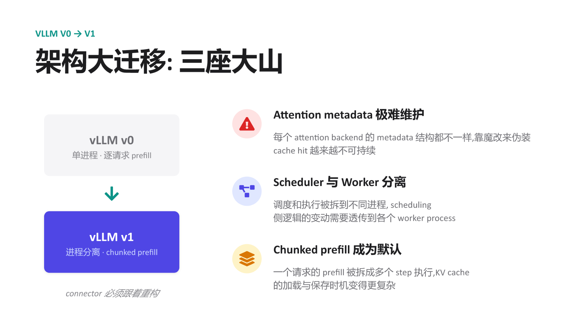
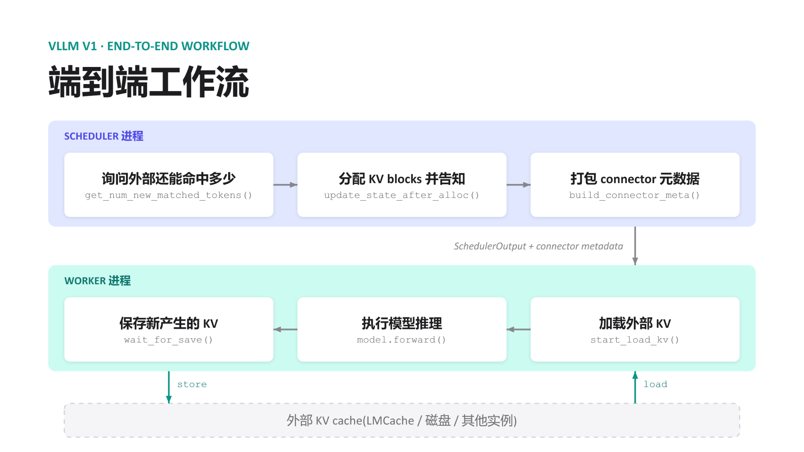
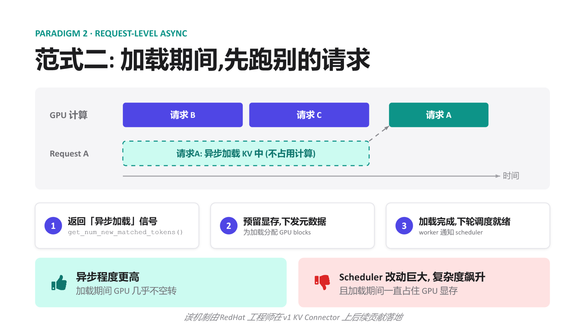
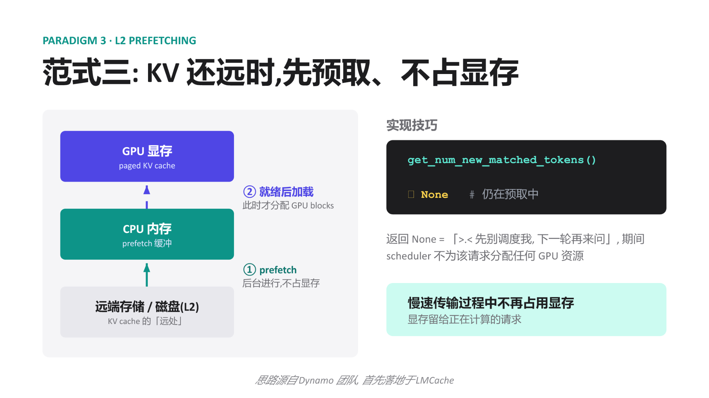
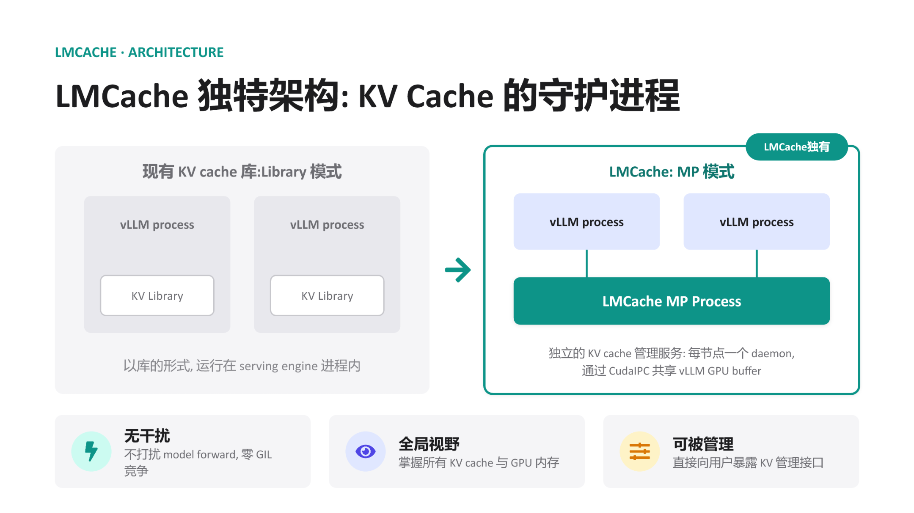
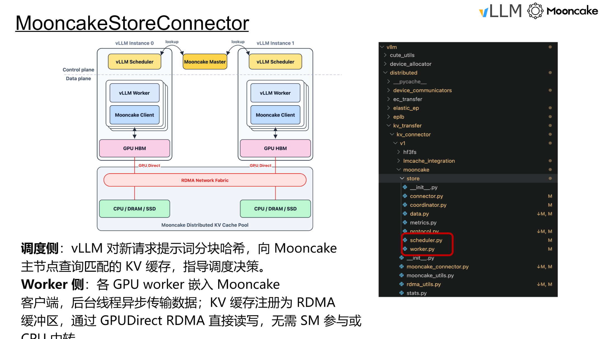
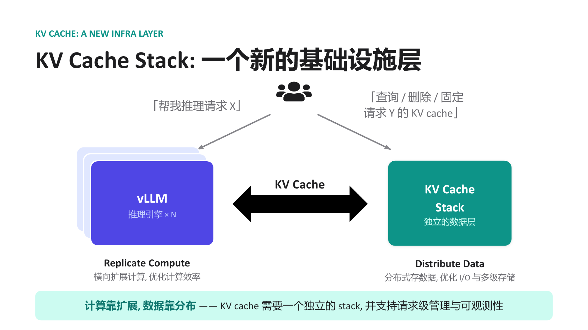

# Deconstructing vLLM KV Connector: From Scheduling Decoupling to Global Zero-Copy Pooling

**Source video**: [Bilibili BV1gRNF6PEc3](https://www.bilibili.com/video/BV1gRNF6PEc3) · **Slides**: [vLLM KV Connector Mini Lesson](https://drive.google.com/file/d/12YJ1xuPpLhBu2Lil-JGJM249FX0y4Ufy/view)

As large-model inference evolves from single-turn Q&A to multi-turn agent interactions, KV Cache size continuously balloons with each conversation turn, quickly exhausting single-node GPU memory. Moving KV Cache out of the engine, sharing it across nodes, and loading it on demand—this sounds intuitively straightforward, yet engineering-wise it demands that the inference engine simultaneously provide clean abstractions across three dimensions: scheduling, transport, and storage. vLLM's KV Connector is the interface layer purpose-built for exactly this. This article traces its architectural evolution from v0 to v1, dissects the three paradigms of asynchronous transfer layer by layer, and ultimately examines how two ecosystem projects—LMCache and Mooncake—achieve zero-copy global pooling via CudaIPC and GPUDirect RDMA.

**Target Audience:** Backend engineers and system architects with a working knowledge of large-model inference who wish to gain a deep understanding of vLLM's underlying architecture, KV Cache optimization mechanisms, and distributed storage system integration.

**Prerequisites:**

- **KV Cache** (Key-Value Cache): Cached key-value pairs generated during large-model inference, used to avoid redundant computation for previously processed tokens.
- **Prefill-Decode (PD)**: The two phases of large-model inference. Prefill processes all input tokens at once and is compute-intensive; Decode generates tokens one at a time and is memory-bandwidth-intensive.
- **vLLM**: A high-performance large language model inference engine and the core system discussed in this article.
- **Chunked Prefill**: A mechanism that splits a request's prefill into multiple steps for execution; this became the default configuration in vLLM v1.
- **LMCache**: A standalone KV Cache management layer that cooperates with the inference engine via a daemon process model.
- **Mooncake**: A KV-Cache-centric distributed storage system supporting PD disaggregation and global KV Cache pooling.

**Reading Objectives:**

1. Understand the engineering context and evolutionary drivers behind externalizing KV Cache in large-model inference.
2. Master the non-intrusive injection architecture and scheduling decoupling principles of the vLLM v1 KV Connector.
3. Deeply analyze the three asynchronous transfer paradigms for hiding I/O latency: layer-wise transfer, request-level async, and L2 prefetching.
4. Learn how LMCache and Mooncake leverage CudaIPC and RDMA to achieve zero-copy global pooling.

---

## 1. The KV Cache Crisis in the Long-Context Era and Early Explorations

> **Question this section answers:** Why does large-model inference need to move KV Cache outside the engine? And why did the early approach in vLLM v0 reach a dead end as the architecture evolved?

### 1.1 KV Cache Bloat Under Multi-Turn Dialogue

In traditional single-turn Q&A scenarios, prefill overhead is a one-time cost. However, when the workload pattern shifts toward **Agentic Workloads**—where the model continuously invokes tools, retrieves context, and reasons again across multiple interaction turns—each turn appends new content to the existing prompt, and the cumulative prefill token count grows significantly with each turn. If KV Cache is recomputed from scratch every turn, prefill latency rapidly becomes the bottleneck in end-to-end response time.

The core question thus surfaces: **Can we retain KV Cache computed in previous turns—or even across requests—and reuse it directly?**

Engine-internal prefix caching can only cover scenarios within the same instance and the same process. Once PD disaggregated deployment or cross-node scheduling is involved, KV Cache must be "moved out"—written to external storage, transferred over the network to another machine, and loaded back into GPU memory. This is the essential origin of the need for external KV Cache.

### 1.2 Inspiration from CacheGen and the v0 Attempt

An early academic representative of this direction is **CacheGen** (published at SIGCOMM 2024), which proposed chunk-based KV Cache compression and external storage mechanisms. This work was initially prototyped on HuggingFace Transformers; to integrate with a real high-performance inference engine, the researchers brought it into vLLM—this was also the original motivation for vLLM to develop the KV Connector.

In the vLLM v0 release, the entire engine ran within a single process, with each request undergoing a full per-request prefill. Under this relatively simple architecture, the KV Connector implementation strategy was: **hack the attention metadata to trick the Worker into believing the relevant tokens had already hit the cache, thereby skipping redundant prefill computation.** The advantage was minimal intrusion into the core codebase—no changes to the scheduler or model forward logic were needed; only the metadata at the attention layer was manipulated.

But the pitfalls were equally obvious: this "fake cache hit" trick was tightly coupled to the internal data structures of the attention backend. Every time the backend changed, the metadata format differed, and maintenance cost scaled linearly with the number of backend variants.

### 1.3 The Great Architecture Migration: Three Mountains

When vLLM evolved from v0 to v1, the underlying architecture underwent fundamental changes, and the old Connector approach broke down accordingly. The following figure summarizes the three core challenges introduced by this migration:


*Figure: Three key challenges facing the KV Connector during the vLLM v0→v1 architecture migration. Source: presentation slides, page 6*

The left side of the figure shows the architectural evolution direction: v0's "single-process, per-request prefill" transforms into v1's "process-separated, chunked prefill." The three challenges on the right are explained one by one below:

| Challenge | v0 State | v1 Change | Impact on the Old Connector |
|-----------|----------|-----------|----------------------------|
| **Attention metadata maintenance** | Single backend; hacking was manageable | Complex attention mechanisms like MLA emerged, each with different metadata structures | Faking cache hits became increasingly unsustainable |
| **Scheduler–Worker separation** | Same process, direct communication | Scheduling and execution split into separate processes | Explicit cross-process propagation of Connector state required; the old approach had no such channel |
| **Chunked prefill as the default** | Prefill completed in one shot | Prefill split into multiple steps | KV Cache load/save timing became fragmented, with no single trigger point |

### 1.4 Causal Chain: Why the Old Approach Was Unsustainable

Connecting the above factors: Agentic Workloads make KV Cache reuse a hard requirement → v0 chose the least-intrusive metadata hacking approach → v1 introduced process separation, lacking mechanisms to pass Connector state across processes → chunked prefill became the default, and step-wise KV Cache loading left the old approach unable to track intermediate states → the emergence of new attention mechanisms like MLA caused maintenance costs of per-backend hacking to skyrocket. The five factors compounded, driving the intrusive design to a complete dead end.

**Core Lesson:** The v0 approach embedded Connector logic within the details of attention execution rather than building it atop a stable abstraction between scheduling and execution. When the underlying architecture changed drastically, such coupling was bound to break.

> **Scope Note:** The presentation materials did not provide specific performance data for the v0 Connector or a list of supported attention backends; the above analysis is based on qualitative architectural reasoning.

---

## 2. Decoupling Scheduling from Execution: The Injection-Based Design of the v1 KV Connector

> **Question this section answers:** In the vLLM v1 architecture where the Scheduler and Worker run in separate processes, how are the "which tokens can be reused" decision and the "move data in and out" execution cleanly separated at the process boundary?

vLLM v1's answer is **injection rather than intrusion**—inserting interface calls at fixed stages of the native scheduling and execution pipelines without modifying any existing core logic of the Scheduler or Worker.

### 2.1 End-to-End Workflow Overview

The following figure illustrates the complete lifecycle of a request as it passes through the KV Connector. Understanding this diagram is a prerequisite for grasping all subsequent async optimizations—every subsequent paradigm is essentially overlapping operations in the time dimension on top of this baseline flow.


*Figure: vLLM v1 KV Connector end-to-end workflow. The upper half is the Scheduler process; the lower half is the Worker process; the bottom represents external KV Cache storage. Source: presentation slides, page 8*

The figure contains the following key elements and flows from top to bottom:

| Step | Process | Operation | Interface Called | Purpose |
|:---:|:---:|------|------|------|
| ① | Scheduler | Query external hit count | `get_num_new_matched_tokens()` | Query how many tokens in the current request's prompt already have KV cached externally |
| ② | Scheduler | Allocate KV blocks | `update_state_after_alloc()` | Decide which blocks to load externally and which to compute locally; complete GPU memory block allocation |
| ③ | Scheduler | Package metadata | `build_connector_meta()` | Pack hit information and block mappings into connector metadata, attached to the `SchedulerOutput` |
| ④ | — | Cross-process message | `SchedulerOutput + connector metadata` | Serialized and sent to the Worker |
| ⑤ | Worker | Load external KV | `start_load_kv()` | Read in the corresponding blocks from external storage based on the metadata |
| ⑥ | Worker | Model inference | `model.forward()` | Normal forward computation, transparent to the Connector |
| ⑦ | Worker | Save new KV | `wait_for_save()` | Write back newly computed KV to external storage |

At the bottom of the figure, bidirectional arrows denote the **load** and **store** data paths, both occurring between the Worker and external storage. The Scheduler never touches actual KV data.

### 2.2 Scheduler Side: Decisions Only, No Data Handling

The Scheduler completes three tasks sequentially within each scheduling step:

1. **Query hits** — Calls `get_num_new_matched_tokens()` and receives an integer indicating how many tokens' KV the external store can provide. The more hits, the less actual computation is needed.
2. **Allocate blocks** — Calls `update_state_after_alloc()`, mapping the hit token range to physical block IDs. This dovetails with vLLM's native block allocation logic, except with an additional marker: "the contents of these blocks will be filled externally."
3. **Package metadata** — Calls `build_connector_meta()` to serialize. The metadata is extremely compact (block ID lists, hit lengths, etc.) and contains no KV tensors.

Once these three steps are complete, the connector metadata is attached to the `SchedulerOutput` and dispatched. For the rest of the Scheduler's logic, these three calls are **purely additive injections**—they do not alter request ordering, preemption policies, or chunked prefill partitioning decisions.

### 2.3 Worker Side: Transport Only, No Decision-Making

Upon receiving the message, the Worker executes in a fixed order: **load → forward → store**. `start_load_kv()` reads the block list marked in the metadata and initiates transfer from external storage; the destination is the local GPU memory blocks already allocated by the Scheduler. `model.forward()` performs normal forward inference. `wait_for_save()` writes newly produced KV back to external storage.

The critical property of this entire pipeline is: **the Worker holds no judgment logic about "whether something should hit."** All it sees is an instruction set of "where to fetch from, where to write to, how much to move."

### 2.4 Minimal State Evolution Example

Suppose a request's prompt contains 8 tokens, and the external store has already cached KV for the first 6:

| Phase | Location | Action | Result |
|:---:|:---:|------|------|
| Query hits | Scheduler | `get_num_new_matched_tokens()` returns 6 | Learns that KV for the first 6 tokens can be fetched externally |
| Allocate blocks | Scheduler | Allocates blocks for 8 tokens; marks the first 6 as "externally filled" | Mapping written into metadata |
| Load | Worker | Transfers KV for 6 tokens in | Corresponding GPU memory blocks ready |
| Forward | Worker | Executes prefill only for tokens 7 and 8 | KV Cache fully covers all 8 tokens |
| Store | Worker | Writes back newly computed KV for 2 tokens to external store | External cache updated to 8 tokens |

The actual compute drops from 8 tokens to 2 tokens; the benefit is directly proportional to the external hit rate.

### 2.5 Design Causal Chain and Limitations

- **The Scheduler holds the global view** (request queue, free block list, external hit information), and it makes the "reuse vs. compute" decision.
- **The Worker holds the hardware pathways** (GPU memory, PCIe/RDMA links), and it performs the actual transport.
- **Connector metadata is the sole cross-process contract**: small in size, semantically precise, and carrying no tensor payloads.

A new external storage backend only needs to implement the six interfaces listed above to "plug in" to the existing pipeline; the Scheduler need not concern itself with the physical location of the KV Cache.

However, it is worth noting that the workflow described above has **synchronous semantics**: load precedes forward, and store follows forward. This means the GPU sits idle during load and store. When external storage latency is high, this idle time becomes a throughput bottleneck. To eliminate this wait, data transport must overlap with GPU computation in the time dimension.

---

## 3. Breaking the I/O Bottleneck: Layer-Wise Transfer and Request-Level Async

> **Question this section answers:** External KV Cache transfer latency often reaches the millisecond range. How can transfer time be hidden within compute time so the GPU stays busy as much as possible?

The vLLM KV Connector has landed two paradigms in succession: **Layer-wise Transfer** and **Request-level Async**. The two present a clear trade-off between "degree of intrusion into the scheduler" and "amount of transfer latency that can be hidden."

### 3.1 Paradigm 1: Layer-Wise Transfer — Fully Transparent to the Scheduler

Core idea: There is no need to wait for KV Cache across all layers to arrive before starting computation. As soon as one layer's transfer completes, that layer's forward pass executes immediately while the next layer's transfer continues in the background.

In this mode, the Scheduler requires no modifications whatsoever—it dispatches requests as usual, and the KV Connector internally orchestrates the "transfer one layer, compute one layer" pipeline within the Worker. This was the earliest built-in scheme of the v1 KV Connector.

**Boundary Condition:** The pipeline can fully hide latency only when "single-layer transfer time ≤ single-layer compute time." If insufficient network bandwidth causes a single layer's transfer to take longer than its computation, the GPU will still stall after finishing that layer's computation while waiting for data.

| Dimension | Layer-Wise Transfer |
|---|---|
| Scheduler modifications | None |
| Transfer granularity | Per-layer KV |
| Latency hiding upper bound | Limited by the transfer time of the slowest layer |
| Memory occupancy characteristics | Layers released/written incrementally; no extra reservation |
| Applicable scenarios | High-bandwidth interconnects (NVLink, RDMA, etc.) or short sequences with small KV |

When the network is slow, the layer-wise approach cannot fundamentally cure GPU stalls—the overlap granularity must be elevated from the layer level to the request level.

### 3.2 Paradigm 2: Request-Level Async — Run Other Requests While Loading

Request-level async shifts the perspective from "intra-request inter-layer pipelining" to "time-slice interleaving across different requests." The following figure illustrates the timing logic of this paradigm—the key is understanding how the "async suspend" and "ready resume" signals bridge the scheduler and the Worker.


*Figure: Timing and three-step signal flow of Request-level Async. Source: presentation slides, page 11*

The timing in the figure can be decomposed into three steps:

1. **Return an async loading signal** — When the KV Connector receives a load request for a given request (Request A in the figure), it returns an asynchronous marker to the scheduler via `get_num_new_matched_tokens()`: "data hasn't arrived yet, but transfer is already in progress."
2. **Reserve memory, suspend the request** — The Scheduler pre-allocates GPU blocks for that request to receive the data later, but **does not** make the GPU wait for those blocks to be filled. The GPU proceeds to execute other ready requests (B and C in the figure).
3. **Loading complete, schedule in the next round** — Once the Worker finishes the background write, it notifies the Scheduler, and the request participates in normal computation in the next scheduling round.

**Minimal scenario:** A batch contains requests A, B, and C, where A needs to pull KV Cache from a remote source. Without async: the GPU waits for all of A's KV to arrive → computes A → computes B → C, fully exposing transfer time. With request-level async: A returns an async signal, the GPU computes B and C first while A's KV is being transferred in the background. If A's loading finishes by the time B and C are done, the next round starts immediately—transfer latency is absorbed by B and C's compute time.

### 3.3 Costs and Boundaries

Request-level async significantly improves GPU utilization but comes with two non-negligible costs:

| Cost | Manifestation |
|---|---|
| **Scheduler complexity explosion** | The Scheduler must understand the new "request is asynchronously loading" state, maintain ready/not-ready queues, and handle edge cases such as load-failure rollback |
| **Prolonged memory occupation** | Pre-reserved GPU blocks remain occupied throughout the entire transfer period without producing inference results; with slow networks or too many concurrent async requests, available memory tightens rapidly |

This mechanism was contributed and landed on the v1 KV Connector by engineers at Red Hat. When external link latency grows further, the pattern of "holding memory while waiting for transfer" becomes a new resource bottleneck, and the system requires more refined prefetching strategies to decouple memory allocation from data transport.

---

## 4. The Memory Defense: The Elegant Implementation of L2 Prefetching

> **Question this section answers:** When KV Cache resides on a remote node and network latency reaches tens of milliseconds, how can slow transfers be made to completely avoid occupying GPU memory?

### 4.1 Two-Stage Transport + Scheduler Deception

The core strategy of **L2 Prefetching** breaks down into two steps:

| Stage | Action | GPU Memory Overhead |
|-------|--------|:---:|
| ① Background prefetch | Remote data transferred to a **CPU memory** prefetch buffer | **Zero** |
| ② Ready-state load | Buffered data copied from CPU to the **GPU memory** paged KV cache | GPU blocks allocated only at this point |

The key: during stage ①, the Scheduler is entirely unaware that the request needs GPU memory. The mechanism achieving this is to have the matching function `get_num_new_matched_tokens()` **return `None`** when the data is not yet ready.

### 4.2 Architecture and Data Flow

The following figure illustrates the three-tier data flow of L2 Prefetching. Understanding "why an additional CPU buffer layer is needed" and "the practical effect of returning None" is the focus of this section.


*Figure: Overall architecture and implementation techniques of L2 Prefetching. Source: presentation slides, page 12*

The figure has three tiers:

- **Rightmost: Remote storage / disk (L2)** — The "far end" of the KV Cache, with non-negligible network latency.
- **Middle tier: CPU memory prefetch buffer** — Serves as an intermediate staging area with ample capacity that does not consume the GPU memory budget.
- **Leftmost: GPU memory paged KV cache** — The final location required for computation and the scarcest resource.

Arrow ① is labeled "runs in the background, zero GPU memory cost," completed by asynchronous I/O and transparent to the Scheduler. Arrow ② is labeled "loaded after ready; GPU blocks allocated only at this point"—only when the data in the CPU buffer is fully ready does the framework report the matched token count to the Scheduler, triggering resource allocation.

### 4.3 Causal Chain of the Matching Function Returning None

1. **Request arrives**: The Scheduler calls `get_num_new_matched_tokens()` for each request pending scheduling.
2. **Prefetch not yet complete**: The function detects that the CPU prefetch buffer is not yet ready and returns `None`.
3. **Scheduler skips**: The semantics of `None` are equivalent to "don't schedule me yet." The Scheduler allocates zero GPU blocks for this request and moves on to other requests in the queue.
4. **Background transfer continues**: Remote data is being transferred to CPU memory without interfering with GPU-side operations.
5. **Prefetch completes**: Once the CPU buffer is ready, the function returns the actual matched token count in the next scheduling round.
6. **Resource allocation and loading**: The Scheduler allocates GPU blocks normally; after the CPU → GPU copy completes, the request enters the compute pipeline.

**GPU memory occupation time is compressed to just the "CPU→GPU copy + compute" window**, completely skipping the most time-consuming "remote→CPU" phase.

### 4.4 Minimal State Evolution

The system has Request A (currently decoding) and Request B (which needs to load KV Cache from a remote source):

| Scheduling Round | Request B Matching Function Return Value | Scheduler's Handling of B | GPU Memory Allocated to B? |
|:---:|---|---|:---:|
| t=1 | `None` (prefetch just started) | Skip | No |
| t=2 | `None` (prefetch in progress) | Skip | No |
| t=3 | `512` (prefetch complete) | Normal scheduling, blocks allocated | Yes |

During rounds t=1 and t=2, the memory blocks that would otherwise have been locked by B are entirely available for active requests.

### 4.5 Benefits and Applicability Boundaries

**Benefits:** Zero memory occupation during slow transfers; GPU memory is fully devoted to requests currently being computed.

**Boundary Conditions:**

- This paradigm assumes CPU memory has sufficient capacity to serve as a prefetch buffer. When a large number of requests prefetch concurrently, CPU memory may become the new bottleneck—the presentation materials did not provide details on buffer capacity management strategies.
- Returning `None` means the request's Time To First Token (TTFT) increases by a full prefetch cycle. Latency-sensitive online scenarios require balancing hit rate against prefetch overhead.
- This concept originated from the Dynamo team's design philosophy and was first implemented in LMCache.

With a well-developed asynchronous transfer interface in place, vLLM gained the ability to integrate powerful external caching systems. LMCache is the first standalone management layer with deep integration.

---

## 5. Toward a Standalone Daemon: LMCache's Contention-Free Architecture

> **Question this section answers:** When the KV Cache management component runs within the same Python process as the inference engine, GIL contention and limited visibility are two inescapable structural problems. How does LMCache break free from these bottlenecks?

### 5.1 Structural Bottlenecks of Library Mode

Most KV Cache management libraries adopt **Library mode**: loading themselves as a module within the serving engine's process. Deployment is simple, but this introduces three progressively deeper problems:

| Dimension | Library Mode Behavior | Root Cause |
|---|---|---|
| **GIL (Global Interpreter Lock) contention** | Python scheduling code for KV transport competes with model forward for the same GIL | Same process, single GIL |
| **Limited visibility** | Each library instance can only see the GPU blocks held by its host process | Process isolation |
| **Cannot be independently managed** | Cannot perform monitoring, upgrades, or restarts on the KV layer alone | Lifecycle bound to the host |

Even when KV transport itself executes asynchronously on the GPU, Python-level metadata operations and callbacks still require acquiring the GIL. As concurrency increases, these small blocks accumulate into observable tail-latency jitter. When two vLLM instances are deployed on the same machine, their respective KV Libraries operate in isolation, unable to share cache entries, resulting in wasted GPU memory and reduced hit rates.

### 5.2 The MP Daemon Architecture

LMCache discards the in-process model and adopts **MP mode (Multi-Process mode)**—extracting the KV Cache management logic into a single standalone daemon process per node that shares GPU buffers with vLLM via **CudaIPC** (CUDA Inter-Process Communication).

The following figure presents the two architectures side by side; focus on the right side to see how the LMCache daemon simultaneously connects to multiple vLLM instances.


*Figure: Left: traditional Library mode, where the KV Library is embedded inside the vLLM process. Right: LMCache MP mode, where a standalone daemon process connects to multiple vLLM instances via CudaIPC. Source: presentation slides, page 16*

On the left, each vLLM process contains its own KV Library block—invisible to one another. The key change on the right: the **LMCache MP Process** is extracted outside all vLLM processes, running as a daemon, connected to multiple vLLM processes via lines representing CudaIPC.

### 5.3 Collaboration Flow

1. **vLLM initiates a request** — When the Scheduler determines that a request needs to read or write KV Cache, the vLLM process notifies the LMCache daemon via a lightweight RPC command containing the target block's token hash and GPU buffer address.
2. **CudaIPC mapping** — The daemon uses CudaIPC to directly obtain a mapping handle to the GPU buffer held by vLLM, enabling it to read and write that GPU memory region within its own process context without going through CPU-side memory as an intermediary.
3. **Zero-copy transport** — The daemon initiates the transfer on its own CUDA stream. Since the operation is entirely completed within the daemon process, the vLLM process's GIL is never touched.
4. **Completion notification** — After the transfer finishes, the daemon informs vLLM via an RPC callback, and the latter updates block metadata in its next scheduling loop.

The vLLM process is responsible for only two ultra-lightweight operations—"send the command" and "receive the notification." The actual movement of KV data is entirely offloaded to the daemon.

### 5.4 Three Architectural Benefits

- **Zero interference** — The daemon has its own Python interpreter and GIL. Even when executing complex cache eviction policies, it incurs no lock contention with model forward.
- **Global visibility** — A single daemon connects to all vLLM instances on the same node, enabling a unified block mapping table. When a second vLLM instance requests the same prefix, the daemon can read directly from the first instance's buffer via CudaIPC without recomputation.
- **Independently manageable** — The daemon exists as an independent process and can expose dedicated management interfaces for cache warming, manual eviction, statistics queries, and more.

### 5.5 Minimal Scenario

vLLM instances A and B run on the same node, sharing a single LMCache daemon:

1. Instance A processes a long system prompt; after prefill completes, the daemon records the GPU block addresses corresponding to that prefix.
2. Instance B receives a new request with the same system prompt. Its Scheduler queries the daemon and discovers that matching KV already exists in A's GPU buffer.
3. The daemon reads from A's GPU memory mapping via CudaIPC and writes into B's target blocks. No CPU memory copy is involved, and neither A's nor B's model forward is blocked.

### 5.6 Boundaries

CudaIPC requires the participating GPUs to be on the same physical node (or at least within the same PCIe/NVLink domain). When KV Cache needs to flow across nodes, the local CudaIPC path no longer applies, and network transport mechanisms such as RDMA are needed. Additionally, the presentation materials did not provide specific throughput or latency benchmarks for the LMCache daemon under high-concurrency scenarios; actual performance characteristics await independent evaluation.

---

## 6. Global Pooling and Hardware Acceleration: Mooncake's RDMA Zero-Copy Implementation

> **Question this section answers:** In a cross-node PD disaggregation architecture, how is peak KV Cache transfer performance achieved?

### 6.1 The Cross-Node Transfer Bottleneck

Under a PD disaggregation architecture, the Prefill node must transfer KV Cache to the Decode node after computation completes. In the traditional path, data must first be copied from GPU memory to host memory (CPU DRAM), then the CPU initiates a network transfer, and the receiving end copies from host memory back into GPU memory. Each cross-node transfer involves at minimum **two PCIe copies + one network transfer**, with the CPU involved throughout. For KV Caches that easily reach hundreds of megabytes, this path quickly becomes a throughput bottleneck.

Mooncake's answer: **Register GPU memory directly as an RDMA (Remote Direct Memory Access) buffer and leverage GPUDirect RDMA to achieve end-to-end zero-copy transfer at the hardware level.**

### 6.2 The Two-Layer Division of MooncakeStoreConnector

The following figure shows the system architecture of MooncakeStoreConnector. The key is understanding how the scheduling side and the Worker side each interact with Mooncake infrastructure, and the data-plane arrow that bypasses the CPU entirely.


*Figure: System architecture and data plane of MooncakeStoreConnector. Source: presentation slides, page 31*

Two independent paths in the figure:

| Plane | Role | Core Action | Interaction Target |
|-------|------|-------------|-------------------|
| **Scheduling side** | Decision-maker | Hashes prompt chunks and queries the Mooncake Master for KV Cache hits | Mooncake Master (metadata node) |
| **Worker side** | Executor | Embeds the Mooncake client; a background thread asynchronously completes actual transfers | Distributed KV Cache pool and other GPU nodes |

The data-plane arrow directly connects **GPU HBM** to the **Mooncake Distributed KV Cache Pool**, labeled "GPUDirect over RDMA Network Fabric"—this path bypasses the CPU.

### 6.3 The Three-Step Causal Chain of GPUDirect RDMA

RDMA allows one machine's NIC to directly read and write another machine's memory without involving either side's CPU. **GPUDirect RDMA** takes this a step further: the NIC can directly access GPU memory, eliminating the intermediate GPU → host memory copy.

What MooncakeStoreConnector does on the Worker side:

1. **Registration phase**: After the vLLM Worker starts up, it registers the GPU memory region containing the local KV Cache as an RDMA buffer, informing the NIC and operating system that "this GPU memory region can be directly read and written by remote peers."
2. **Transfer phase**: Mooncake's Transfer Engine (TE) runs as a background thread and establishes a data channel directly between the two endpoints' GPU HBM using RDMA verbs. **No SMs are involved, and no CPU intermediation occurs.**
3. **Completion acknowledgment**: Once the RDMA operation completes, the NIC notifies the Mooncake client via a Completion Queue, which in turn notifies the vLLM Worker that the KV Cache is ready.

The transfer speed ceiling no longer depends on CPU throughput or the number of PCIe copies, but is **directly bounded by the underlying RDMA network bandwidth**.

### 6.4 Minimal Example: Cross-Node Prefill→Decode Transfer

Node A is dedicated to Prefill, Node B is dedicated to Decode, and the two are interconnected via an RDMA network.

**Step 1: Scheduling-side query.** Node B's Scheduler computes hash values for prompt chunks and queries the Mooncake Master: do these KV blocks already exist in the global cache pool? If they hit, it learns the data resides on Node A's GPU 0.

**Step 2: Worker-side transfer.** The Mooncake client embedded in Node B's Worker initiates an RDMA Read:

```
Node A GPU HBM (source, registered as RDMA buffer)
        │
        │  GPUDirect RDMA Read (NIC directly reads GPU memory)
        ▼
   RDMA Network (InfiniBand / RoCE)
        │
        │  GPUDirect RDMA Write (NIC directly writes to GPU memory)
        ▼
Node B GPU HBM (destination, registered as RDMA buffer)
```

On this path: Node A's CPU does not participate in the transfer; Node B's CPU does not participate in the transfer; neither side's GPU SMs are occupied and can continue executing other inference computations.

**Step 3: Ready notification.** After the RDMA transfer completes, Node B's Worker receives the notification, and the Decode phase immediately uses the arrived KV Cache with no additional intra-GPU-memory copy required.

### 6.5 Performance Advantages and Boundaries

| Aspect | Traditional Path | Mooncake GPUDirect RDMA |
|--------|-----------------|------------------------|
| GPU → host memory copy | Required | **Eliminated** |
| CPU involvement in network send | Required | **Eliminated** |
| Host memory → GPU copy | Required | **Eliminated** |
| SM occupation | Possible | **None** |
| Transfer bandwidth ceiling | Limited by PCIe + CPU scheduling | Limited by RDMA network bandwidth |

**Boundary Conditions:**

- GPUDirect RDMA requires both the NIC and GPU to support this feature, and ideally both should reside in the same PCIe switch domain for optimal performance. Not all deployment environments meet this requirement.
- The presentation materials did not provide specific bandwidth figures or latency benchmark data; actual transfer rates depend on network topology, NIC model, and RDMA protocol type (InfiniBand vs. RoCE).
- Mooncake's distributed KV Cache pool supports multi-tier storage across CPU/DRAM/SSD. Whether full zero-copy semantics can be maintained when KV Cache is loaded from non-GPU tiers requires verification against specific deployments.

---

## 7. The Rise of the KV Cache Stack and Engineering Boundaries

> **Core question of this section:** When KV Cache evolves from an internal state of the inference engine into an independent infrastructure layer, what does the system gain? And what physical ceilings and engineering costs are encountered in real-world deployments?

### 7.1 Paradigm Shift: Orthogonal Scaling of Compute and Data

Looking across all the mechanisms discussed—the Connector interface, asynchronous transfer paradigms, global zero-copy pooling—they ultimately point to the same architectural vision: **treat KV Cache as an independently evolvable data layer.** The following figure materializes this vision as two orthogonally scaling planes.


*Figure: KV Cache Stack conceptual architecture. Source: presentation slides, page 19*

| Dimension | Left: Inference Engine Cluster | Right: KV Cache Stack |
|-----------|-------------------------------|----------------------|
| Scaling strategy | **Replicate Compute** — horizontally replicate instances | **Distribute Data** — distributed storage with multi-tier caching |
| Optimization target | Compute throughput and GPU utilization | I/O bandwidth and storage hit rate |
| Request type | "Run inference for request X" | "Query / delete / pin the KV Cache for request Y" |
| Operations granularity | Instance-level elastic scaling | Request-level management and observability |

The two sides are connected by bidirectional arrows. The inference engine only needs to concern itself with "initiating inference" and "declaring KV Cache operations"; how data is stored, routed, and evicted is entirely pushed down to the Stack layer. This is precisely the underlying prerequisite that enables PD disaggregation: the Prefill node produces KV Cache and writes it to the Stack, the Decode node pulls from the Stack, and the two need not share GPU memory or even the same physical machine.

Causal chain: KV Cache becomes an independent layer → compute nodes become stateless → engine instances can scale horizontally on demand → Prefill and Decode can each be configured with optimal hardware ratios → overall inference cost decreases.

### 7.2 Physical Constraints: Bandwidth Determines the Ceiling

Zero-copy and asynchronous transfers can eliminate superfluous CPU-side overhead, but ultimate throughput is locked by the network hardware topology. Boundary cases to be aware of:

- **Degradation on non-RDMA networks:** On standard TCP/IP links, zero-copy semantics remain usable, but actual bandwidth may drop by an order of magnitude, and the latency benefits of PD disaggregation may be negated by the transfer bottleneck.
- **Hot-cold imbalance across storage tiers:** The KV Cache Stack supports multiple tiers including GPU memory, host memory, and remote storage. When hot-spot requests concentrate on slow tiers, statistical cache hit rate advantages cannot mask the tail latency caused by individual misses.

> The presentation materials did not provide specific network bandwidth thresholds or degradation curves; benchmarking against the actual topology is recommended before deployment.

### 7.3 Engineering Costs: The Proliferation of Async Complexity

Once the KV Cache lifecycle is decoupled from the engine internals, the amount of additional state the Scheduler must maintain increases significantly:

1. **Transfer state tracking** — Each request's KV Cache may be in one of several intermediate states ("sending / arrived / validation failed / pinned"); the Scheduler must design fallback paths for each state.
2. **Request-level management** — The Stack layer must support three classes of operations: "query, delete, pin." The Scheduler must orchestrate not only GPU compute but also reference counting and eviction policies for the distributed cache.
3. **Observability costs** — An independent data layer needs its own monitoring metrics (hit rate, transfer latency, storage watermarks); merged with the inference engine's metric system, the operational dimensionality at least doubles.

These three overheads are virtually imperceptible in single-machine deployments but become the primary reliability challenge in clusters with tens to hundreds of engine instances.

### 7.4 Deployment Evaluation Recommendations

| Evaluation Dimension | Key Metric | Fallback If Not Met |
|----------------------|------------|---------------------|
| Network bandwidth | Whether inter-node unidirectional bandwidth is sufficient to complete KV transfer within a single Decode step | Fall back to co-located PD on the same machine, forgoing disaggregation benefits |
| Scheduling complexity | Depth of the Scheduler's async callback chain and coverage of exception recovery | Downgrade to synchronous blocking transfer, trading throughput for stability |
| Multi-tier storage | Whether the hot tier (GPU memory) capacity can cover the active request set | Shorten maximum sequence length or increase memory allocation ratio |

---

## Conclusion and Limitations

**Core Conclusions:**

1. **KV Cache is evolving from an internal component of the inference engine into an independent data infrastructure layer.** This shift enables compute and data to scale independently, each according to its own optimal strategy.
2. **Decoupling scheduling from execution is the architectural prerequisite for all subsequent optimizations.** vLLM v1 completely separates "when to load" from "how to transport" through six injection-based interfaces, providing a stable abstraction for asynchronous transfer and external storage integration.
3. **Three asynchronous transfer paradigms progressively address GPU idle time.** Layer-wise transfer is zero-intrusion but constrained by per-layer bandwidth; request-level async significantly improves utilization but occupies GPU memory; L2 prefetching fully decouples memory allocation from slow transfers via CPU buffering.
4. **LMCache's MP daemon mode eliminates GIL contention and provides node-level global visibility.** CudaIPC enables zero-copy sharing across vLLM instances.
5. **Mooncake compresses cross-node KV Cache transfer to a single hardware-level end-to-end transfer via GPUDirect RDMA.** In PD disaggregation architectures, the performance ceiling for KV Cache transfer is determined solely by RDMA network bandwidth.
6. **Peak transfer performance is highly dependent on underlying hardware topology support.** GPUDirect RDMA requires both the NIC and GPU to have the corresponding capabilities; performance may degrade significantly in non-ideal network environments.
7. **Asynchronous mechanisms improve GPU utilization while introducing non-linear growth in scheduler complexity.** Transfer state tracking, request-level cache management, and cross-layer observability collectively constitute the primary engineering maintenance cost.

**Explicit Limitations:**

- The presentation materials did not provide quantitative performance comparisons across the asynchronous paradigms; the analysis in this article is based on qualitative architectural reasoning.
- The zero-copy transfer performance of LMCache and Mooncake is strictly constrained by the underlying hardware configuration (e.g., RDMA NIC model, PCIe topology) and may not achieve expected performance in non-ideal environments.
- Request-level async can cause GPU memory to remain occupied for extended periods under slow networks; careful evaluation against system load is necessary during actual deployment.
- In environments where network conditions or operational capabilities fall short, a conservative co-located same-machine deployment may still be the more pragmatic choice.
