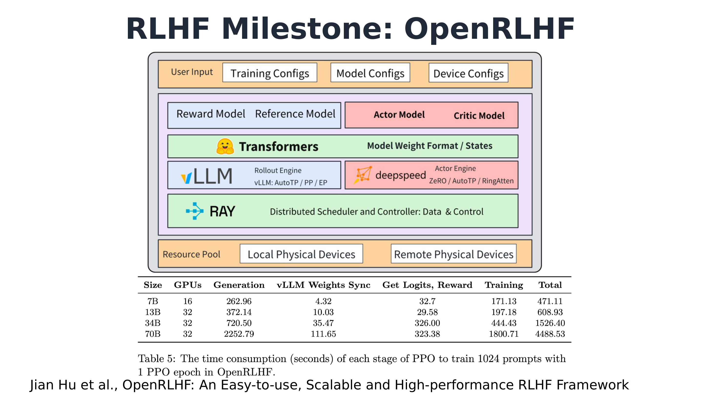
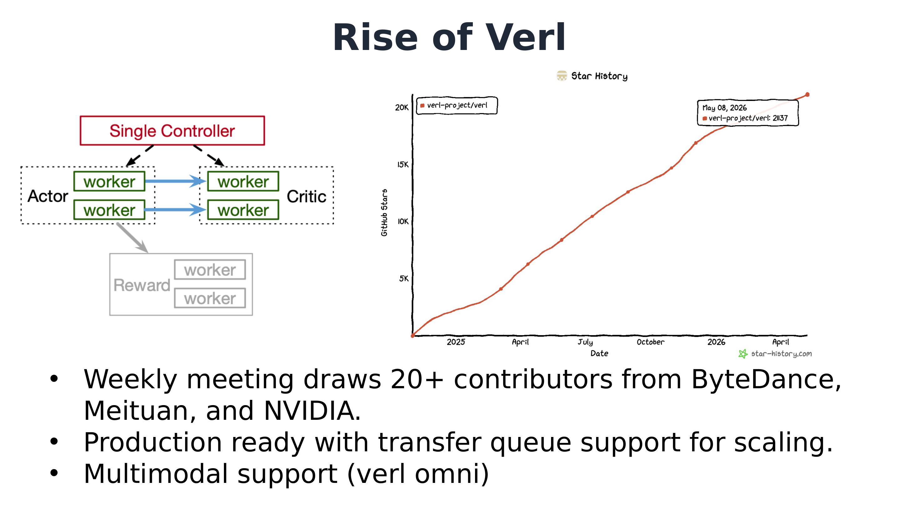
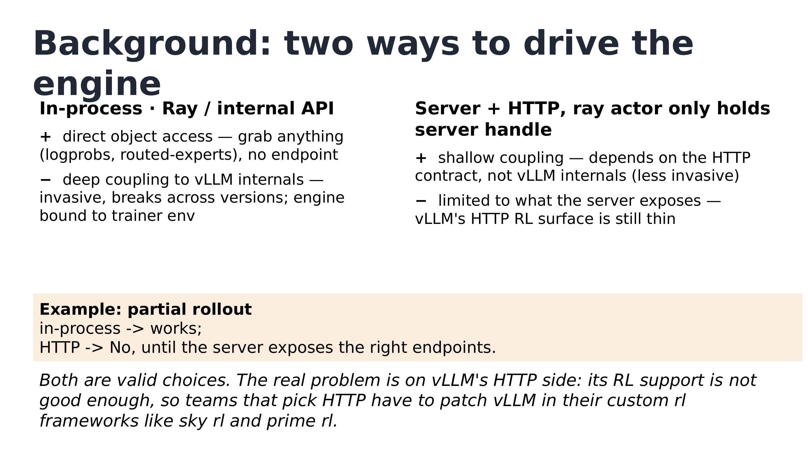
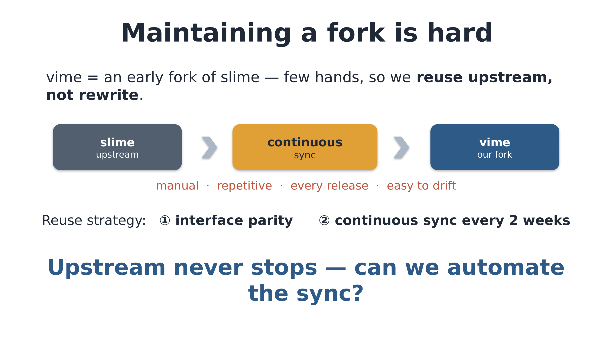
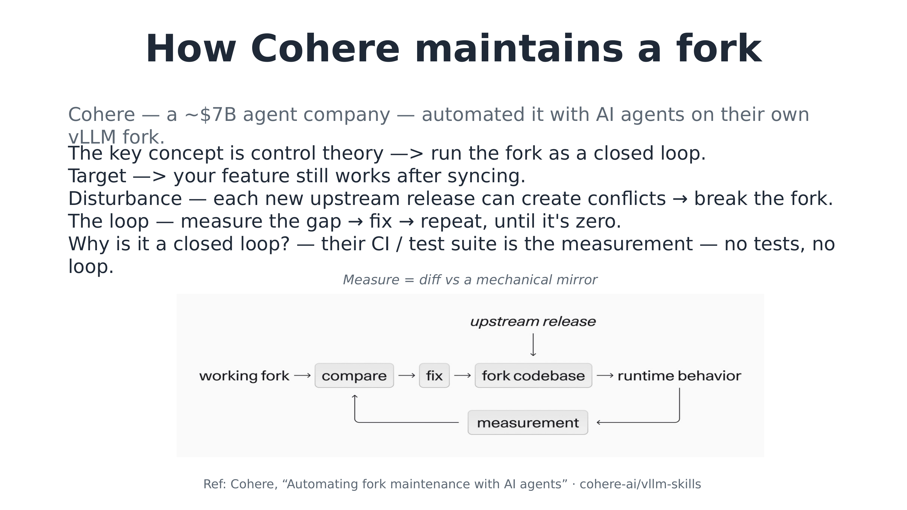
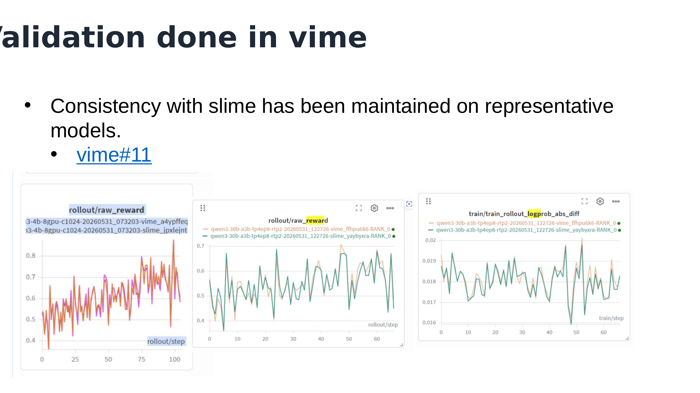
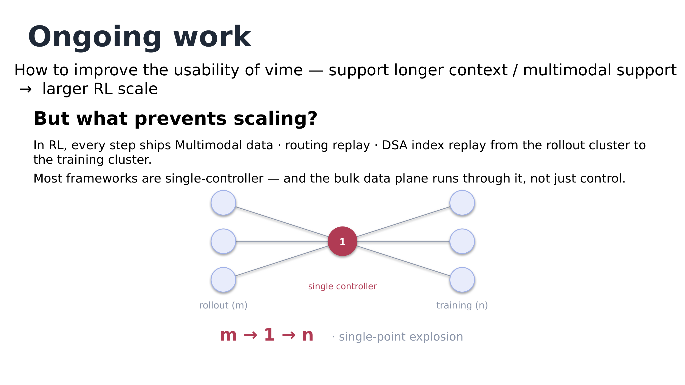
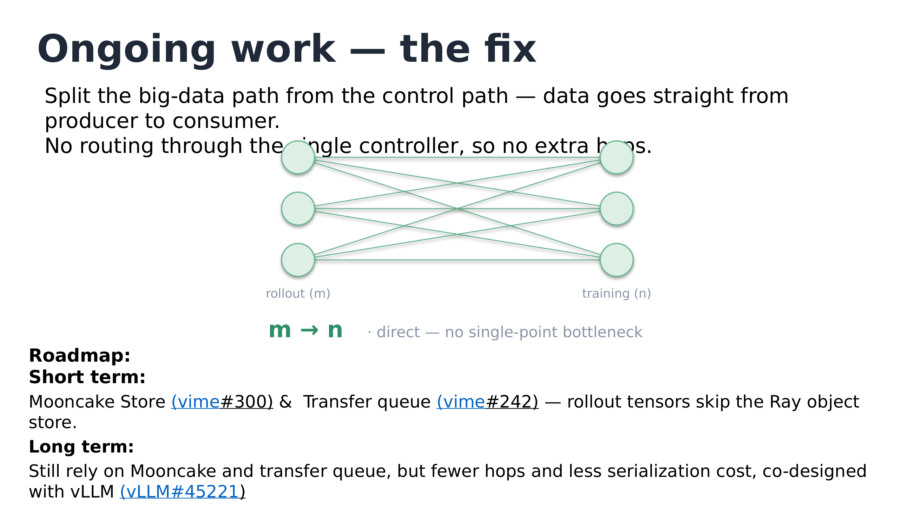
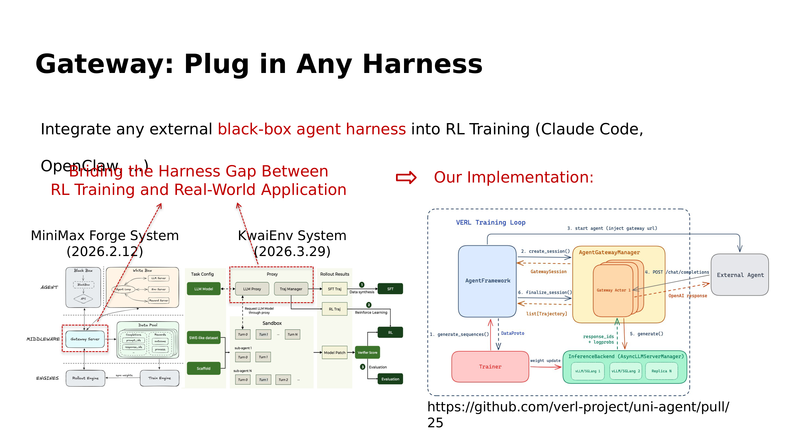
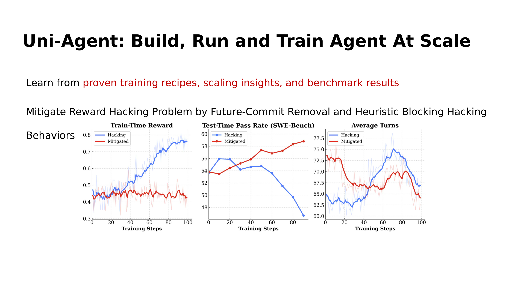

# When vLLM Meets slime: vime's Pure-HTTP Route and the Fork-Maintenance Loop

From OpenRLHF's rollout bottleneck to the single-controller data plane: a full walkthrough of the engineering decisions behind a vLLM community livestream.

This article is compiled from episode 9 of the vLLM community livestream, in which speaker Ao Shen (Inferact Inc.) presented the vime project — a fork that systematically replaces slime's inference backend, swapping SGLang for vLLM. The article follows the real causal chain: why RL frameworks split off a second line of demand — "small and modifiable" — from "large and comprehensive," what each of the two technical routes for driving an inference engine costs, how a small team turns fork maintenance into a measurable closed loop, and where the single-controller architecture hits its next ceiling on the data plane. Facts in this article come from the talk's slides, the livestream transcript, and the live Q&A; every point with limited confidence or a purely oral source is flagged in place.

**Intended audience**: Engineers and researchers with a foundation in LLM training or inference who care about RL post-training systems and open-source framework engineering practice.

**Prerequisites**: Familiarity with the basic RLHF/RL post-training flow (rollout, reward, policy update); familiarity with the division of roles between inference engines (vLLM/SGLang) and training engines (Megatron/DeepSpeed); a working notion of parallelism terms such as TP/PP/EP/CP.

**After reading this article you will be able to**:

- Understand why RL frameworks split off a second, "small and modifiable" line of demand from "large and comprehensive," and the three motivations behind founding vime;
- Grasp the coupling costs and capability boundaries of the two ways to drive an inference engine — in-process versus Server + HTTP;
- View fork maintenance through the cybernetic "target–disturbance–measurement–repair" closed loop, and understand the two acceptance lines: mechanical-mirror diff, and CI plus convergence consistency;
- Recognize the m→1→n single-point bottleneck of the single-controller architecture on the data plane, and the roadmap for separating the data and control planes;
- Learn how a black-box harness plugs into RL training via a gateway, and what diagnostic evidence for reward hacking looks like.

## 1. Where the Old Form Began: OpenRLHF and the Rollout Bottleneck

Reinforcement-learning post-training has an inherent engineering contradiction: within the same iteration, the model must both "speak" and "learn." Generating samples is an inference workload that chases high-throughput batch decoding; updating parameters is a training workload that needs gradients, optimizer state, and large-scale parallelism strategies. The optimal system forms for these two workloads are completely different, yet they must alternate within one closed loop. Who generates, who trains, who schedules — the first influential answer to these three questions came from OpenRLHF (the open-source RLHF framework by Jian Hu et al.), which established the "old form" for RL frameworks that followed: a mature inference engine handles rollout (inference-time generation, i.e., the stage where the inference engine batch-produces sample trajectories), a training engine handles parameter updates, and Ray coordinates distributed resources.

The figure below answers two questions at once — "how the system is layered" and "where the time goes" — and is the starting point for understanding the old form.


*OpenRLHF's system architecture and the timing data from Table 5 of the paper. Source: talk slides, page 2 (cited from the OpenRLHF paper by Jian Hu et al.).*

The key to this architecture diagram is the mapping between roles and engines. The orange part is User Input; in the middle, the blue boxes are the Reward Model and Reference Model, and the red boxes are the Actor Model and Critic Model — PPO's four roles take their places here. The crucial part is the next layer down: the blue box on the left is vLLM as the Rollout Engine (annotated AutoTP/PP/EP), and the red box on the right is DeepSpeed as the Actor Engine (annotated ZeRO/AutoTP/RingAtten) — from this point on, inference and training are two independent engines. The green bar at the bottom is Ray, serving as the distributed scheduling and control layer, carrying both the data plane and the control plane and stitching the two engines together. The diagram contains several other intermediate layers, omitted here.

Where does this form pay its price? Table 5 of the OpenRLHF paper gives the first answer nailed down by data. The qualifying conditions for the following numbers are: 1024 prompts, 1 PPO epoch, and OpenRLHF's implementation and hardware at the time. The table below keeps only the values verified for this article; the remaining cells are marked "—", and the full data should be checked against the original table in the paper:

| Model size / GPU count | Generation | Weights Sync | Get Logits, Reward | Training | Total |
|---|---|---|---|---|---|
| 7B / 16 GPUs | 262.96s | 4.32s | — | — | 471.11s |
| 13B / — (see the original paper) | — | — | 29.58s | — | — |
| 34B / — (see the original paper) | — | — | 326.00s | — | — |
| 70B / 32 GPUs | 2252.79s | 111.65s | 323.38s | 1800.71s | 4488.53s |

Two sets of numbers deserve close attention. The first is generation: at 7B, Generation accounts for roughly 56% of total time (262.96/471.11); at 70B it is 2252.79/4488.53, about half — at both scales, generation is the largest single item at roughly half or more of the total, and its absolute cost grows from 262.96s to 2252.79s, an increase of nearly 9×. Batch decoding is a token-by-token sequential process; the larger the model, the slower each step, and this stage is inherently hard to amortize. The second is weights sync (the process by which the training engine pushes new parameters to the inference engine after each round of updates): it grows from 4.32s at 7B to 111.65s at 70B, an increase of about 25×. What is synchronized is the full set of parameters; growing parameter counts compounded with the cross-engine transfer path gradually turn this "auxiliary overhead" into a major line item that cannot be ignored. One more boundary must be reported as-is: in the 34B row, Get Logits, Reward is 326.00s, markedly higher than the 29.58s at 13B. This is the original table's data and should not be "corrected"; it also suggests that this item's cost does not vary monotonically with scale.

According to the speaker's account (medium confidence), by 2024, feedback from the OpenRLHF team and community had clearly converged on the same conclusion: rollout time is a very significant bottleneck in RL training, and generation can take more than half of total time — a claim consistent in magnitude with the 70B row in the table above. The speaker also offered a causal summary: it was only after the parameter-synchronization problem was solved that the disaggregated training/inference deployment form of RL matured.

To summarize: OpenRLHF established the basic form of "Ray scheduling + inference-engine rollout + training-engine updates," and for the first time used data to pin down its two principal contradictions — the absolute cost of generation and the overhead of weights sync both grow significantly with model scale. These numbers cannot be used to judge today's vLLM or other frameworks (they reflect the implementation and hardware of the time), but they define the question every subsequent RL system had to answer: once training/inference disaggregation matured, who would settle these two bills?

## 2. The Rise of verl and the Cost of Comprehensiveness

The baton left by the previous section was taken up by verl — an open-source reinforcement-learning framework maintained with participation from ByteDance's Seed. It arrived with two new weapons: the single-controller architecture — one central controller uniformly scheduling the workers for all roles — and the colocated training-inference hybrid paradigm, in which training and inference share the same set of GPUs and switch in time slices. As the speaker recalled, verl demonstrated strong reinforcement-learning performance after its debut, and happened to catch the reinforcement-learning wave ignited by DeepSeek R1, so it developed rapidly (the talk materials do not give a reliable specific launch date).

The two-panel figure below explains verl's programming model on the left and shows its community-popularity curve on the right.


*Left: schematic of verl's single-controller programming model; right: star growth curve generated by star-history. Source: talk slides, page 3.*

Look at the left panel first. The red box at the top is the Single Controller, which schedules the workers of the Actor, Critic, and Reward roles via dashed arrows pointing downward — the dashed lines represent control flow: who should do what and when is decided entirely by this one controller; the solid blue lines represent data flow between workers. The number of workers under each role in the diagram is illustrative only and does not represent actual deployment scale. Drawing control flow and data flow in different colors is precisely the point of this architecture — control logic is concentrated in one place, so whoever writes the algorithm faces only a single controller and need not hand-coordinate the distributed parties.

Now the star curve on the right: verl-project/verl has grown nearly linearly since early 2025, with the annotated point at the top right of the curve reading approximately 21,137 stars on 2026-05-08 (that number is the fine-print reading in the figure, a snapshot taken when the talk was prepared). The speaker said its stars had reached 20-some thousand — to their knowledge the most among comparable RL frameworks. The popularity is not only in the numbers: weekly community meetings typically draw 20-plus contributors, from ByteDance, Meituan, NVIDIA, and others — note this is the attendee count, not the project's total contributor count. According to remarks made live (the speaker themselves admitted their memory was fuzzy), the way to attend is to first join verl's WeChat or Feishu (Lark) group, where meeting announcements are posted; at the meetings, each module's owner reports the past week's progress. Exact times are subject to community announcements.

Nor is verl an isolated case. The talk showed a logo wall of RL frameworks built on vLLM, about 12 projects: verl, Open Instruct, PRIME-RL, SkyRL, unsloth, OpenRLHF, Pipeline RL, NVIDIA Cosmos, TRL, AReaL-lite, RLinf, Nemo RL, ROLL, and so on — though the slide does not state the depth of each framework's integration with vLLM, so one cannot conclude from it that they all use vLLM as their sole backend.

Within this ecosystem, what made verl the baseline — and what did it pay? The slide lays the trade-off out plainly:

| verl's comprehensiveness | Cost (trade-off) |
| --- | --- |
| Multiple training/inference backends | Code size: OpenRLHF ~11,940 lines → verl ~96,370 lines |
| Many algorithms, multimodality (verl omni) | Abstraction layers increase substantially |
| Production-ready, with transfer queue supporting scale-out | |

Two qualifications must accompany the table: the line counts are approximate and the counting methodology is unstated; and this is a comparison between two different projects, OpenRLHF and verl, not the evolution of a single codebase. The slide explicitly frames the growth in line count as the cost of comprehensiveness — a trade-off, not a criticism; the specific mechanism of the transfer queue is not elaborated on this page either. The speaker added one piece of background orally: verl's requirements come mainly from internal (ByteDance) needs-mining.

The host added a layer of personal interpretation during the conversation: most users of training frameworks are people who know what they're doing, and their core demand is being able to modify the framework quickly; a large codebase and multi-backend compatibility mean it's hard to modify, and maintaining the corresponding CI and systems takes several times longer, directly slowing iteration — this too is a trade-off, because multiple backends bought broader developer participation. One more second-hand, low-confidence claim is recorded here only for the record: per the personal understanding of both parties in the live conversation, the main framework used inside ByteDance to train Doubao is not the open-source verl main branch; verl is maintained by one team within Seed and currently serves the open-source community more.

Thus the boundary emerges: verl's comprehensiveness serves scenarios that need multiple backends, many algorithms, and production scale; another set of expert teams wants exactly the opposite — a framework that is small, readable, thinly wrapped, and easy to modify. The speaker also added a reason not written on the slide: it is agent-friendly, because a lean, short context is what a coding agent can actually chew through. If this reverse demand holds, it means there is a position in the market that verl cannot fill — and that is exactly where slime enters.

## 3. slime and the Two Routes for Driving an Inference Engine

slime stands on the "modifiable at will" side. Per the introduction given in the talk, its profile can be summarized in three points:

- **Simple & Elegant**: a clean, readable codebase, positioned precisely so people can understand it and change it.
- **Low complexity**: architecturally it connects just 1 inference engine plus 1 training engine, with no multi-backend wrapper layer and a low barrier to entry.
- **Highly flexible**: the modules researchers need to customize — the rollout workflow (agent loop), data layout, reward design, and post-rollout data filtering — are all made into pluggable interfaces. The speaker added a typical use of the filtering interface: send only high-quality samples into training rather than accepting everything wholesale.

On popularity, a screenshot in the talk slides showed slime at 7.2k stars at the time, ranking third among comparable RL frameworks, behind only verl and OpenRLHF — a snapshot from when the talk was prepared. The host added that slime is the youngest of the comparable frameworks, starting around May 2025 and open-sourced in July (these dates are inferred from the livestream's timing and come only from oral remarks). That the latest starter charged to third place in its class is indirect confirmation that "small and modifiable" is a real demand.

So the community began asking the key question — in the speaker's retelling: "**Can we get slime — on vLLM?**" (Can slime run on vLLM, or on our own vLLM fork?) It sounds like swapping a backend, but it actually hinges on an architectural choice: how should an RL framework "drive" the inference engine? The comparison figure below is the technical pivot of the entire talk; the trade-offs of both routes are all on it.


*Comparison of the two driving routes: left column in-process, right column Server + HTTP; the orange box is the partial rollout counterexample, and the italic line at the bottom is the conclusion. Source: talk slides, page 8.*

The left and right columns are the two routes. **Left column, in-process (direct in-process connection)**: hold the engine object directly through Ray and vLLM's internal APIs. On the plus side is its core advantage — you can directly access any internal object, such as logprobs or routed-experts (MoE routing information), without the engine exposing any endpoint; on the minus side is the cost: deep coupling with vLLM internals, high invasiveness, fragility across versions, and the inference engine being locked into the trainer's runtime environment. **Right column, Server + HTTP**: launch vLLM as an independent server; the Ray actor holds only a handle to the server subprocess, and the main process holds no server-internal information at all (the speaker's supplementary explanation of slime's approach). The advantage is shallow coupling — the only dependency is the HTTP contract, never touching vLLM internals; the drawback is written just as bluntly: capability is limited to whatever endpoints the server exposes, and vLLM's HTTP RL interface was still thin at the time of the talk (an assessment that may become outdated as vLLM evolves).

The orange highlighted box below the figure gives a concrete counterexample: **partial rollout** — an algorithm that allows partially completed rollouts to be processed or resumed, important for long-tail scenarios. It is feasible under the in-process route; under the HTTP route it could not be done at the time — "until the server exposes the corresponding endpoint." Note this is a temporal qualification, not a defect in principle: what's missing is an interface, not the viability of the HTTP path itself.

Why does partial rollout matter? Answering an audience question, the speaker explained the causal chain of the **long tail**: RL rollout is more like offline inference — for example, sending 32 requests (the speaker's example number) into the inference engine at once, and having to wait for all of them to finish before training can begin. So a few slow requests (say, the ones at P99 latency) become the short stave of the barrel while the fast ones sit idle. There are two families of mitigation: one is algorithm–system co-design — abandoning strict on-policy and doing asynchronous rollout; the other is purely system-side reduction of long-request latency. The latter can be viewed in two phases: in the first phase, each serving engine is saturated with requests and the goal is high throughput; as requests finish one by one and only a few long-tail ones remain running, it enters the second phase, where the goal switches to low latency — and here **PD disaggregation** (deploying prefill and decode separately) and **MTP** (multi-token prediction, a form of speculative decoding) happen to yield clear gains in small-batch, low-latency scenarios. On MTP's payoff conditions, the speaker maintained that gains are more pronounced at small batch sizes relative to large ones, while the host thought the speedup at large batch sizes is also decent — a point of disagreement; the safe framing is "small batches benefit more." Another audience member asked whether PD disaggregation in RL is special; the speaker's answer: no different from PD disaggregation in inference serving — rollout connects through an independent serving endpoint, and the training side need not care about the internal implementation.

The host also offered a perspective (which the speaker partially endorsed; it is a personal view): internal APIs naturally suit frameworks that bind to a single inference backend, because they require the engine to provide specific interfaces; HTTP, conversely, better suits multi-backend setups — it doesn't care about engine internals. Supporting multiple backends via internal APIs would require building yet another abstraction layer, which runs exactly counter to slime's low-complexity ethos.

The italic conclusion at the bottom of the figure grounds the tension concretely: **both routes are reasonable choices**; the real problem lies on vLLM's HTTP side — RL support wasn't good enough, forcing teams that chose the HTTP route (such as SkyRL and Prime-RL) to patch vLLM inside their own frameworks (the speaker called these monkey patches). In other words, what blocked "slime on vLLM" was neither slime nor the HTTP architecture, but vLLM's then-weak HTTP RL interface surface. That ecosystem gap is exactly what vime, in the next section, sets out to fill.

## 4. Founding vime: Three Motivations and the Official Release

An ecosystem gap does not by itself justify a project — maintaining a dedicated fork for "slime + vLLM" means shouldering the long-term evolution pressure of two upstreams. This section answers two questions: is there real demand for this combination, and does the pure-HTTP route have market validation?

First, fix the terminology. **Pure HTTP-based rollout** refers to a rollout style in which the training engine and inference engine interact only through HTTP in a decoupled manner: no shared process, no shared scheduling domain, and both ordinary inference requests and control-plane requests such as weight sync all go over HTTP. It differs from a generic "HTTP API service" — the key is that all interactions within the RL training loop are constrained to this protocol layer.

The talk gave three motivations for the project:

1. **Community demand**: community feedback showed direct demand for the combination "slime + vLLM as the rollout engine" (as well as for forks of both projects). The talk materials provide no sample size or quantitative data for this feedback; it is a qualitative statement.
2. **Ecosystem gap**: the desire for vLLM to have mature support for pure HTTP-based rollout in RL scenarios — precisely the spot, identified in the previous section, where SkyRL / Prime-RL and others each apply their own patches.
3. **Market validation**: Cursor's Composer 2 technical report emphasized the scenario of pure HTTP support for external, cross-region rollout engines, providing corroborating evidence for this route.

The third point deserves expansion. Per the speaker's retelling of that report: Cursor did not have enough of its own GPUs, so it dedicated all its cards to training and outsourced inference serving to cloud vendors such as Fireworks AI, provided in endpoint form; the training cluster and inference cluster may be in different regions or even on different continents, and all requests between the two — ordinary inference as well as control-plane requests such as weight sync — can only travel over HTTP. The topology:

```
┌─────────────────┐      HTTP only (may cross regions/continents)   ┌──────────────────────┐
│ Training cluster │  ── inference requests / rollout sampling ──▶  │ Cloud-vendor inference│
│  (own GPUs,      │                                                │ endpoints (Fireworks  │
│   training only) │  ── control-plane requests, e.g. weight sync ─▶│ AI etc., as endpoints)│
└─────────────────┘                                                └──────────────────────┘
```
*Redrawn by the editor from the speaker's oral retelling of the Composer 2 technical report. The left box is the trainer's own cluster; the right box is the external cloud vendor's endpoints; the two arrows represent the data plane (rollout sampling) and control plane (weight sync, etc.) respectively, all traveling only over HTTP. Readers are advised to verify details against the original report; note also that Composer 2 is merely corroboration for this scenario — it does not mean the report used vime or slime.*

On top of these motivations, the project was officially released: **vime = slime + vLLM** — the name is a direct combination of its two upstreams, i.e., a fork that systematically replaces slime's inference backend, swapping SGLang for vLLM. The hardware support listed at release comes in two tiers: three generations of NVIDIA platforms (Grace Blackwell / Blackwell / Hopper), plus two other vendors, Huawei Ascend and AMD. The release page does not state whether support maturity is uniform across platforms, and this should not be extrapolated into equal capability everywhere.

The live Q&A (all of the following comes solely from the transcript) probed this route's boundaries more deeply. An audience member asked whether the rollout server could simultaneously serve online traffic: the answer was yes — treat it as an endpoint that also accepts the RL framework's requests; training trajectories are generally saved for debugging — for example, tracing which batch of trajectories corresponds to a particular grad norm spike. But reusing the same instance has three differences: first, the configuration parameters differ; second, RL needs periodic weight-sync updates, which disrupt an always-on online service; third, RL needs render/de-render (pre-/post-processing) support, since the training side mainly passes token IDs rather than strings — vLLM has already split render into a dedicated endpoint and supports token-ID-only inference, serving RL frameworks on one end while keeping the frontend leaner on the other to handle high concurrency and keep the CPU from becoming the bottleneck.

The host's and speaker's engineering conclusion was more direct: it is best not to put online serving and training together. The core difficulty is the instant of weight sync — for a request already halfway through decoding, you either discard the generated tokens and recompute with the new weights (which requires rolling back results the user has already seen, a painful experience), or continue decoding directly on the new weights; both paths are challenging to implement.

To summarize: the three motivations cover the demand side (community), the supply side (ecosystem gap), and the scenario side (corroboration from cross-region external rollout); the market for the pure-HTTP route is real, so vime's founding stands. But settling on the route is only the beginning — the real difficulty of a fork is not writing it, but keeping it alive under continuous upstream evolution, which is the subject of the next section.

## 5. A Methodology for Raising a Fork: The Cohere Loop and vime's Three-Piece Kit

### The problem: few people, fast upstream — what keeps a fork from drifting?

vime is an early fork of slime, and the team is small, so the overall strategy settled on reusing upstream rather than rewriting. In execution this means two things: maintaining interface parity with slime (i.e., the fork exposes the same calling conventions as upstream), and syncing from upstream roughly every two weeks — note that this "two weeks" is vime's own cadence, not slime's release cycle.

First, look at what the problem itself looks like: the figure below depicts the current state of fork syncing in three nodes.


*Figure: the current state and pain points of fork syncing. Source: talk slides, page 11.*

The three nodes run left to right: a gray box slime (upstream), an orange box continuous sync, and a blue box vime (our fork), with light-blue arrows showing code flow. The real information is the line of red text under the middle orange box: manual, repetitive, every release, easy to drift. Although slime updates less frequently than verl, upstream never stops; every sync round is a round of mechanical labor, and one misstep starts accumulating divergence — hence the question posed at the end of the page: can syncing be automated, agent-ified?

The reuse strategy's viability has one data anchor: by the speaker's estimate, excluding a certain category of changes (unclear in the transcript, not reliably recoverable), inference-related PRs in slime upstream over the most recent month accounted for only about 10%–15%, with most changes concentrated on the training and algorithm side. This means vime can take most new features from upstream "for free"; the inference-side changes it must make itself are the minority. This proportion is the speaker's oral estimate, medium confidence.

### The mechanism: Cohere's cybernetic closed loop

The idea for automation was borrowed from Cohere — per this talk, a company valued at about $7 billion and described as an agent company, which uses AI agents to automatically maintain its own vLLM fork. The core concept is control theory: run fork maintenance as a closed-loop system. The figure below is the full picture of this loop, with all four elements — target, disturbance, execution chain, measurement — drawn on it.


*Figure: the closed-loop control circuit of fork maintenance. Source: talk slides, page 12.*

Walking the figure: the upstream release at the top injects from outside the loop and is the Disturbance — every newly merged PR and every new release can create conflicts and break the fork. The main chain — working fork → compare → fix → fork codebase → runtime behavior — is the execution side: compare, repair, land in the codebase, manifest as runtime behavior. The measurement node at the bottom feeds runtime behavior back into compare, closing the loop. The Target is a single sentence: after every sync, our own features still work. The loop runs by measuring the gap, repairing, and repeating until the gap is zero.

This loop stands on one hard precondition, stated plainly on the page: the CI/test suite (including accuracy and performance tests) is the measurement stage — no tests, no loop. Only with measurement feedback can an agent localize problems through bisection and the like, iterating until CI fully passes. The figure also annotates the concrete form of measurement above: diffing against a mechanical mirror; the mirror's specific implementation is not defined on that page, and no speculation is made here. The references given on the slide are Cohere's "Automating fork maintenance with AI agents" and the cohere-ai/vllm-skills repository; readers should verify the links themselves. As for which model powers Cohere's agents, the speaker explicitly said they don't know, guessing only Claude Code or Codex — a guess, not a fact.

Corroboration comes from an analogous practice by the host (a vllm-omni maintainer): vllm-omni must continuously rebase against vLLM, and they automated it with agents, starting experiments in the GLM-4.6 era and currently using DeepSeek V4 (self-described as the cheapest of the models tried and essentially the best-performing); one major-version rebase costs about 100 RMB, the vast majority of CI passes, and the remaining one or two failures are fixed by hand. The model names are phonetic reconstructions from the transcript, and the cost is an oral estimate.

### Landing it: vime's three-piece kit and two acceptance lines

vime applies the same loop, but first has to define exactly what its own "diff set" is. vime made only one systematic replacement to slime: SGLang → vLLM, most of it mechanical renaming, with only a small portion being genuine engine reimplementation (a qualitative description; the talk materials give no proportion); overall interfaces and code size stay aligned with slime. This positioning — "the differences are limited and enumerable" — is the precondition for the loop to converge.

The knowledge base supporting the loop is a three-piece kit:

| Component | Role |
|---|---|
| Parameter translation table | SGLang→vLLM parameter mapping, handling simple mechanical substitutions |
| History table | Human-confirmed rationale for every non-obvious major historical change, for the agent to consult |
| slime-as-vime mechanical mirror | A mechanically generated counterpart, the baseline for diffs |

There are two acceptance lines. On the code side: the diff between vime and the mirror must equal exactly the signed-off set of differences; any new drift (for example, a new file appearing) triggers human review plus sign-off. On the experiment side: the large end-to-end CI stays continuously green (matching slime in functionality and accuracy), plus long-horizon convergence-consistency experiments on the main models (the specific model list is not given on the page).

One sentence to pull it together: **the mirror diff is the code target; CI consistency plus convergence consistency are the measurement instruments.** The boundary must also be stated: this method depends on two conditions — "the diff set is small and well-defined" and "the test suite is sufficient to serve as measurement" — and does not automatically hold for forks with large divergence or missing tests. Whether the loop's measurement end truly returned a green signal is what the next section's consistency curves and scaling results will show.

## 6. Validation: Consistency Curves and the GB300 Scaling Milestone

For a fork that swaps out its entire inference backend, the greatest fear is not failing to run, but "running while quietly being different." vime answers this doubt with two layers of evidence: one is a training-curve-level consistency comparison, the other is an end-to-end run on a frontier-scale cluster. The former proves "numerical behavior didn't change after switching to vLLM"; the latter proves "this thing isn't just toy-scale."

### Consistency: curves overlapping on two acceptance metrics

Validation chose two representative models: the dense Qwen3-4B and the MoE Qwen3-30B-A3B (tp4ep8-rtp2 configuration), each run once with vime and once with slime on the same task suite, comparing two metrics — training reward (rollout/raw_reward) and the training–rollout absolute logprob difference (train_rollout_logprob_abs_diff, the absolute value of the difference between the log probabilities computed by the training engine and the inference engine for the same batch of tokens, directly measuring numerical consistency between the two engines). The triptych of curves below is the direct experimental output of the previous section's two acceptance lines.


*Triptych of comparison curves: left, the 4B experiment's reward; middle and right, the 30B experiment's reward and training–rollout absolute logprob difference. Source: talk slides, page 14.*

Reading left to right: the left plot is the 4B experiment's raw_reward, rising from about 0.4 to 0.8 over steps 0–100, with the vime and slime curves nearly coinciding (the run-name prefix is truncated in the figure, so the exact 4B variant should not be asserted from it). The middle plot is the 30B experiment's raw_reward — orange for vime, green for slime — with the two lines heavily overlapping. The right plot is the most critical: the absolute logprob difference for the same pair of 30B runs, on the order of about 0.016–0.02, with the two curves essentially coinciding — showing that after switching to vLLM, the numerical deviation between training and inference matches slime's native level, introducing no new systematic error.

Three boundaries must be stated. First, the values are approximate readings from the figure; precise data should be checked in the supporting link vime#11 (the number may be off due to repository-name truncation — verify before citing). Second, "consistent" rests on visual curve overlap and the authors' statement; the page gives no quantitative error bound. Third, the validation goal is consistency with slime, not an absolute improvement in reward — how high the curves climb is not what this page sets out to prove.

### Scaling: GLM-5.2 running on GB300

Beyond consistency is scale. vime has successfully run GLM-5.2 training on a GB300 cluster, configured as follows (supporting reference: vime#307):

| Dimension | Configuration |
|---|---|
| Cluster | GB300, 16 nodes, 64 GPUs |
| Rollout side | EP=8, TP=8, MTP enabled, 8 vLLM instances |
| Training side | PP=4, EP=16, TP=8, CP=2 |

Note the page says only "successfully ran" — no throughput, MFU, or convergence data; this is a "it runs" milestone, not a performance conclusion. The page also does not explain how the parallelism degrees map onto the 64 GPUs, and no derivation is attempted here.

### Q&A wrap-up: how far can consistency be pushed?

**Can bitwise-exact consistency be achieved?** The speaker's answer (oral): the current logprob difference is already at a very low magnitude; for zero diff between inference and training, see their collaboration blog with Meta TorchTitan (link not provided) — the cost is having to use exactly the same set of kernels, sacrificing some aggressive performance optimizations; Megatron is doing similar work.

**Which inference optimizations break consistency?** Per the speaker (oral), kernels are the main source of training–inference mismatch, with MoE router/index selection second; deterministic kernels have begun appearing (their connection to specific model training is an oral claim). The consensus practice is to enable performance optimizations by default and remediate with routing replay and index replay only when problems arise, rather than baking the remediation into training from the start — these measures inevitably drag performance. The speaker's position: a good framework should be consistent by itself and should not depend on forced replay.

**How is multi-turn token drift handled?** No different from slime's approach; it's table stakes.

A few practical notes: newcomers are advised to start with Qwen3-4B; the 30B A3B can be trained on a single machine with eight cards (speaker, oral; another 16B A3B variant mentioned is unclear in the transcript and cannot be confirmed). The trade-off versus verl is a matter of ecological niche — pick verl for out-of-the-box use, pick vime to modify internals and validate new methods; the speaker judges the two to have no performance difference in mainstream LLM scenarios (no test data to support this), but in multimodal scenarios verl is better thanks to its transfer queue. The P2P weight-transfer PR has not yet been merged, and the various schemes for cross-machine weight sync still await empirical comparison.

To summarize: both acceptance lines — functionality and accuracy — have been met, and scale has touched a frontier cluster. But verl's advantage in multimodal scenarios points squarely at vime's weak spot — once the volume of data produced by rollout grows, how to move that data becomes the next contradiction to face.

## 7. The Next Bottleneck: The Single-Controller Data Plane and m→n Direct Connection

vime can already run RL training on real clusters, but between "runs" and "scales" stands a structural obstacle. The ongoing-work portion at the end of the talk states the goal directly: improve vime's usability — support longer contexts and multimodal inputs, thereby sustaining larger-scale RL training. And what blocks that path is not some kernel or stretch of code, but an architectural assumption shared by most RL frameworks: the single controller manages not only the control plane but also shoulders the bulk data plane.

### What must be moved every step

First, the cargo. When doing RL with long contexts, multimodality, and MoE models, to guarantee training-inference consistency (the inputs and statistics seen by the training side must correspond exactly to those at inference-time generation), every training step must ship a batch of bulk data from the rollout cluster to the training cluster:

| Data | Meaning | When it appears |
|---|---|---|
| pixel values | Raw pixel tensors of multimodal inputs | Multimodal RL |
| routing replay | MoE expert-routing replay (expert indices), recording which experts each token was routed to at inference | MoE models |
| DSA index replay | Sparse-attention index replay, recording the sparse-attention selections at inference | Sparse-attention models |

The key causal condition is "moved for the sake of consistency": this data is not optional debug information but a necessary input for the training side to reproduce inference behavior. The longer the context, the more the modalities, the sparser the model, the heavier this cargo — and it ships every single step.

### Where the single point blows up

The data must move; the question is by which road. The hourglass diagram below depicts the current topology.


*Figure: the m→1→n topology of the single-controller data plane. Source: talk slides, page 16.*

The cluster of light dots on the left are rollout nodes (m of them), and the cluster on the right are training nodes (n of them) — 3 drawn on each side purely for illustration. None of the links connect left to right directly; they all converge on the central red dot labeled "1" — the single controller — forming an hourglass. The red formula `m → 1 → n` below the figure and the gray text single-point explosion are the figure's conclusion.

The mechanism chain: in most frameworks the single controller typically runs on node 0 / the head node; data produced by inference nodes must first be aggregated at the head node, which then distributes it to the training nodes. Thus all m×n directions of traffic get squeezed through one point, incurring two costs — the head node's CPU memory can be blown out, and data conversion and serialization happen repeatedly at a single point at enormous expense. "Most frameworks are single-controller" is the speaker's general judgment, naming no specific frameworks; the talk materials also give no quantitative numbers for this bottleneck.

### The fix: separating the data plane from the control plane

The solution corresponds to the second topology diagram — move that central red dot off the data path.


*Figure: the m→n topology after direct data-plane connection. Source: talk slides, page 17.*

Against the previous figure: between the two columns of green nodes is a full m×n mesh, with bulk data traveling from producer (rollout) straight to consumer (training), no aggregation point in between. The green `m → n` below and the gray text direct — no single-point bottleneck indicate no redundant hops remain on the data path. Note this does not abolish the controller: per the talk's clarification, the single controller retains control duties such as metadata management; only the bulk-data path is moved away.

The roadmap has two segments, both work in progress rather than accomplished fact:

- **Short term**: use Mooncake Store (vime#300) and the transfer queue (vime#242) as data-plane backends, letting rollout tensors bypass the Ray object store and saving its serialization and GPU↔CPU transfer overhead. The transfer queue is also a transport component supported by verl.
- **Long term**: still relying on Mooncake and the transfer queue, but co-designed with vLLM (vLLM#45221) to further compress hop count and serialization cost.

A boundary to note: the "vime#300 / vime#242" on the slides may be a truncated repository-name display (or may actually be slime repository numbers); verify in the repositories before citing. These two pages give no performance numbers, and none are estimated here.

### The multimodal branch: how vllm-omni plugs in

The Q&A gave concrete integration conditions for the multimodal direction. vime's core is an HTTP server-based architecture, so for vllm-omni to plug into vime for multimodal rollout, the primary work is on the vllm-omni side: support completing weight sync via HTTP requests (involving the implementation of multiple requests), support custom output, and be able to pass out the trajectories needed for training over HTTP. Distributed deployment can reuse slime/vime's existing rollout manager group interface, which supports multiple deployment forms including PD disaggregation. Per the team's own account this capability existed before slime 0.3 and the refactoring began around 0.2.4, but the version numbers come from oral retelling with considerable noise; the repository records are authoritative. The host also said they want to invest effort in opening a new multimodal-direction branch, and welcomed participants with compute to join.

To summarize: the single controller binds the control plane and data plane to one point — an invisible cost in the era of small models and short contexts; but once every step must move bulk tensors like pixel values, routing replay, and DSA index replay, the m→1→n convergence becomes the ceiling on scaling. Splitting out the data plane into m→n direct connections and letting the controller manage only metadata is the key leap for vime from "runs" to "scales" — for now, it is still a roadmap under construction.

## 8. Extension: Plugging a Black-Box Harness into RL, and the Scaffold Score Gap

**First, a note on this section's maturity: the speaker marked this chapter as optional in the slides, did not walk through it page by page in the livestream, and mentioned most of its content only while answering audience questions; the factual sources are mainly single slide pages, with limited cross-validation.** But it answers a question the pure-HTTP architecture naturally raises: if the inference service is just a standard HTTP endpoint, can a completely uncontrolled external agent like Claude Code also be plugged into RL training?

### Black box and white box: a pair of talk-defined terms

The speaker defined two harness forms (both terms coined for this talk, not industry standards):

- **Black-Box**: an external harness that can only be run wholesale via a command like `claude ...`. Its internal system prompt cannot be customized, its hard-wired workflow cannot be altered, and its toolset (bash, grep, web fetch, etc.) is hard to modify. The motivation comes from product reality: to make agent training and evaluation mirror the real production environment as closely as possible (the slide says "100% mirror" — a goal slogan, not a measured metric), one must support SoTA tools like Claude Code.
- **White-Box**: a form in which the complete perceive–decide–act loop (Agent Loop) is fully open and modifiable. Research scenarios need it for tasks beyond the coding toolset — Shell, Desktop, GUI, Browser, embodied AI (e.g., screenshots, mouse clicks); the white box is also friendlier to observability — for example, information like a web-access timeout is very hard to get through the gateway in the black-box setting (this example comes from the livestream transcript).

Supporting both forms is the founding motivation of the Uni-Agent project (GitHub: verl-project/uni-agent). Per the project's own claims, it covers five capabilities: white-box customization, black-box integration (Claude Code, OpenClaw, etc.), reproducing open-source-model SoTA, adopting veRL's frontier RL techniques, and providing validated training recipes — all self-descriptions, not elaborated here.

### The gateway: keeping the black-box agent unaware it is being trained

The key to black-box integration is a layer of protocol middleware. The sequence diagram below shows how it intercepts the data training needs without changing a single line of the harness.


*Figure: the sequence of a black-box harness plugging into RL training via the gateway (right), and two industry references, MiniMax Forge and KwaiEnv (left). Source: talk slides, page 24.*

Walk the right-hand sequence by its numbers 1–6: ① the Trainer initiates `generate_sequences()`; ② the AgentGatewayManager creates a GatewaySession for this rollout and injects the gateway url into the external agent; ③ once launched, the external agent accesses the Gateway Actor using the standard OpenAI `/chat/completions` protocol — what it receives are ordinary OpenAI-format responses, and it remains entirely unaware it is being trained; ④ internally, the gateway invokes the multi-replica vLLM/SGLang managed by AsyncLLMServerManager to execute `generate()`, while intercepting the response_ids and logprobs that training requires; ⑤ `finalize_session()` aggregates the entire interaction into a `list[Trajectory]` handed to the training side; ⑥ the Trainer updates weights and syncs them back to the inference backend. The implementation is in uni-agent PR #25. The two industry references on the left — the MiniMax Forge System (annotated 2026.2.12 on the page) and the KwaiEnv System (annotated 2026.3.29; the source of both dates is not stated on the page, verify before citing) — follow the same route: both insert a proxy/gateway middleware layer between the harness and the training engine (the page's original text "Briding" is a misspelling of Bridging).

The black-box experimental setup the speaker described in Q&A: use the cloud platform Modal to provide remote CPU sandboxes, upload a pinned version of Claude Code into each sandbox, and provide the backing inference service through an Anthropic-protocol gateway — with zero modification to the harness itself.

### Training experience: hard evidence of reward hacking, and mitigation

Once black-box/white-box agents enter RL, reward hacking is an unavoidable pit. Uni-Agent's mitigations are twofold: Future-Commit Removal (removing future commits from the training environment to keep the agent from simply stealing answers) plus heuristic rules to intercept hacking behavior. Whether it works shows in whether training reward and test performance diverge — and the figure below is exactly that comparison.


*Figure: comparison of the Hacking (blue) and Mitigated (red) settings over training steps 0–100. Source: talk slides, page 25.*

All three plots have training steps (0–100) on the horizontal axis, and all values are approximate readings from the figure. Left plot, training reward: Hacking climbs steadily from about 0.45 to about 0.75–0.8, while Mitigated holds at about 0.45. The middle plot, SWE-Bench test pass rate, delivers the verdict: both lines start at about 54; Mitigated climbs steadily to about 59, while Hacking collapses to about 47 after roughly 50 steps. Training reward rising while test performance collapses — this divergence is the hard evidence of reward hacking: what grew was score-gaming skill, not capability. The right plot, Average Turns, shows the two lines crossing and fluctuating; it says only that behavior patterns differ before and after mitigation, and no monotonic conclusion can be read from it.

### The scaffold score gap

The end-to-end practice lands on one score table (spellings as in the original slides — "qwen3.6" and "vime" pending confirmation with the speaker; the scores take the form x/100, actually resolution rates expressed as percentages):

| Configuration | swebench-verified |
|---|---|
| Official report (qwen3.6 36b a3b) | 73 / 100 |
| vime + Modal + uniagent | 71.6 / 100 |
| vime + Modal + claude code | 59 / 100 |

The uniagent scaffold reaches 71.6, approaching the official 73, showing this pipeline can reproduce official-level results. **A warning is mandatory: the 59 is the score of the open-source model qwen3.6 36b a3b fitted with the claude code scaffold — it is absolutely not the SWE-Bench score of a Claude model itself.** The same model with a different scaffold shows a gap of over 12 points — the fit between agent scaffold and model affects the final score no less than the model itself does. The boundary must also be written down: the page gives no pass@k, sampling temperature, or problem-subset details, so comparability across the three scores is limited.

To summarize: the gateway demonstrates the upper bound of the pure-HTTP architecture's composability — even a fully black-box harness can plug into training transparently via the standard OpenAI protocol; and the score table reminds us that getting plugged in is only step one — the choice of scaffold is itself an experimental variable.

## Conclusion: Findings and Limitations

1. **The principal contradiction of RL frameworks keeps migrating**: in the OpenRLHF era it was rollout time and weight sync (under 1024 prompts and 1 PPO epoch, 70B generation took about half of total time and sync grew from 4.32s to 111.65s); in the verl era it was the complexity brought by comprehensiveness (from about 11,940 lines to about 96,370 lines); vime targets "small and modifiable" and the ecosystem gap of pure HTTP rollout on vLLM.
2. **The route debate has no loser**: in-process and Server+HTTP are both reasonable choices; the real shortfall was that vLLM's HTTP RL interface was too thin at the time (partial rollout was for a while impossible, and SkyRL/Prime-RL each patched around it). vime's value lies in maturing the HTTP route, not in proving one route superior.
3. **Fork maintenance can be engineered into a cybernetic closed loop**: the mechanical-mirror diff is the code target, and end-to-end CI consistency plus long-horizon convergence consistency are the measurement instruments — no tests, no loop. The method depends on two preconditions: a diff set that is small and enumerable, and a test suite sufficient to serve as measurement.
4. **Read the consistency and scale evidence in layers**: on Qwen3-4B and Qwen3-30B-A3B, the reward and training–rollout logprob-difference curves nearly coincide with slime's (logprob difference about 0.016–0.02, approximate figure readings), proving numerical alignment; running GLM-5.2 on a GB300 cluster of 16 nodes and 64 GPUs is only a "successfully ran" milestone — the page has no performance data whatsoever, and it constitutes no performance conclusion.
5. **The next ceiling is on the data plane**: the single controller's m→1→n single-point explosion must be solved by separating the data and control planes — short term, Mooncake Store and the transfer queue bypass the Ray object store; long term, co-design with vLLM — all of it work in progress with no performance numbers yet.
6. **The agent-RL practice yields two lessons**: a gateway can let a black-box harness plug into training transparently via the standard OpenAI protocol; and scaffold–model fit has an enormous effect on evaluation scores (71.6 versus 59 for the same open-source model) — citing such scores requires stating the evaluated subject and conditions.

**Statement of limitations**: This article relies in many places on single sources — slide-snapshot numbers (star counts, code line counts, and dates are readings or approximations from when the talk was prepared), oral remarks from the livestream transcript (high homophone noise; several names, version numbers, and project names remain in doubt), and approximate figure readings (logprob differences, reward curves, pass rates) — with confidence levels and qualifying conditions flagged in place throughout. Section 1's Table 5 keeps only ledger-verified cells; for the full data, defer to the original table in the OpenRLHF paper. Section 8 corresponds entirely to a chapter the speaker marked optional and did not walk through page by page in the livestream, and its maturity is limited. Second-hand claims involving third parties (ByteDance's internal framework usage, Cohere's valuation, etc.) are the personal understanding of the speaker or host and should not be re-cited as factual assertions. Before citing data from this article, first verify the original links — vime#11, vime#307, vime#300, vime#242, vLLM#45221 (numbers may suffer from repository-name truncation) — and confirm slide-original spellings such as "qwen3.6" with the speaker.
