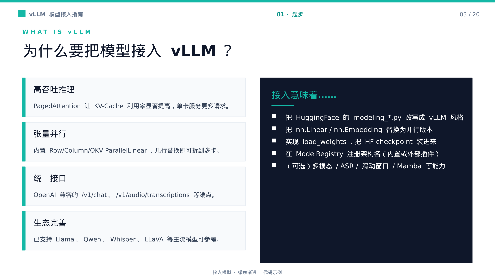
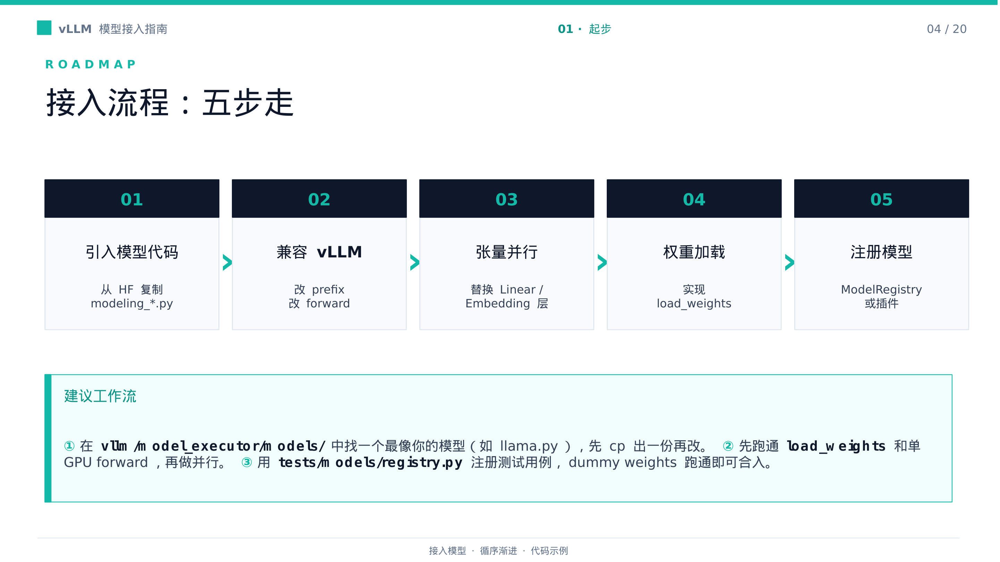
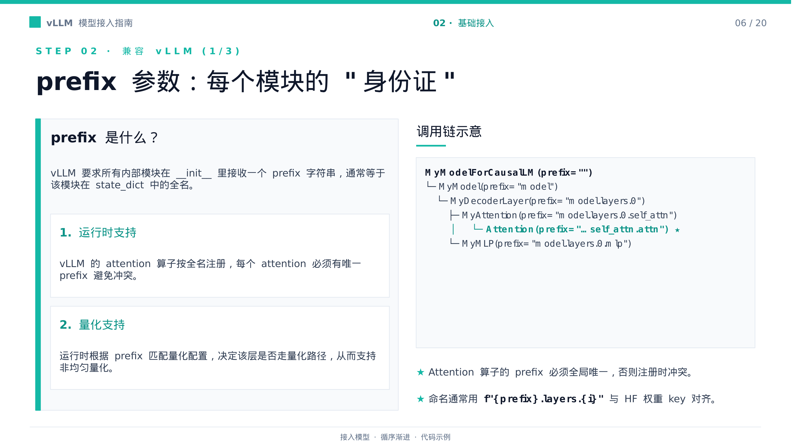
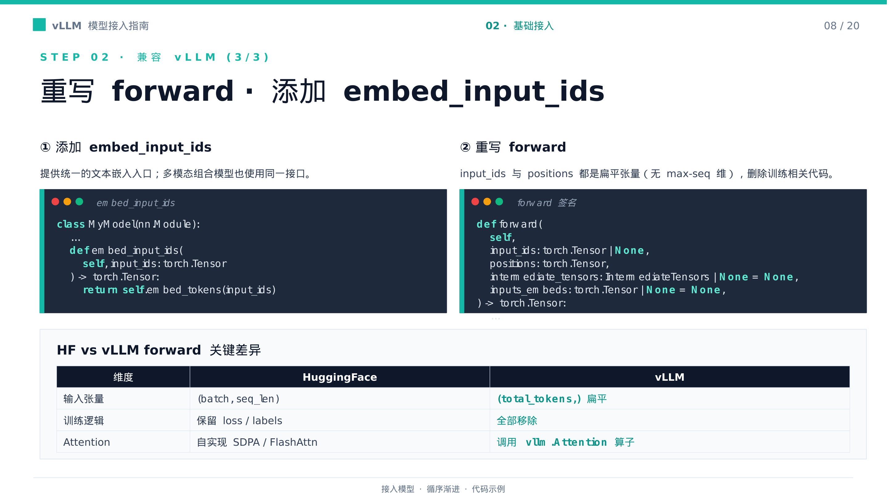
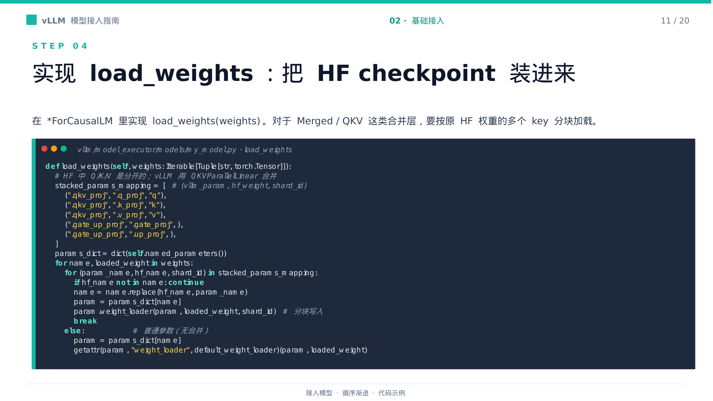
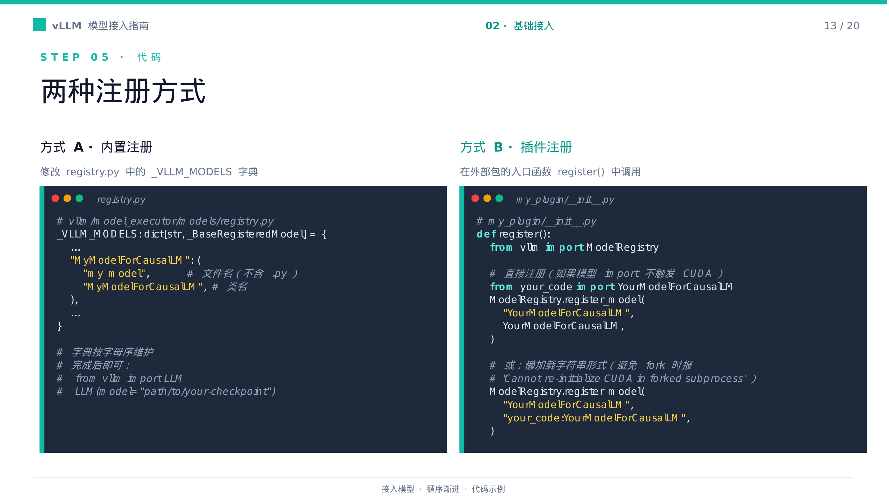
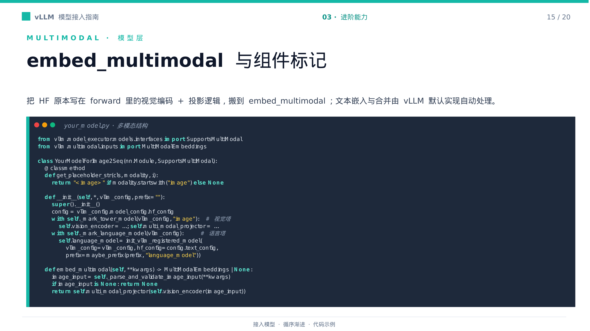
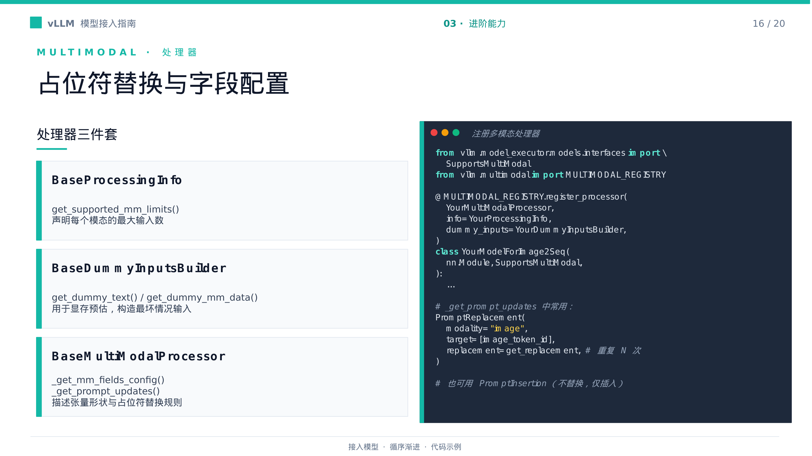
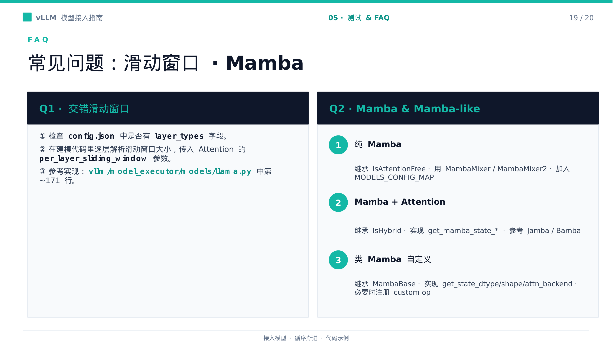

# 从 Hugging Face 到 vLLM：一条可验证的模型接入链路

> 模型在 Hugging Face 中能够推理，只说明原实现成立。要进入 vLLM，还必须让模块命名、运行时输入、并行参数、权重加载、注册信息和测试证据彼此对齐。

**原视频**：[如何在 vLLM 中接入一个模型](https://www.bilibili.com/video/BV1gYL965ERP) · **配套资料**：[vLLM 模型接入指南](https://drive.google.com/file/d/13Iqs2X1CkWLtCbtCUB5bSUPX_bsBZ6IF/view)

本文面向具备 PyTorch、Transformer 与 Hugging Face 基础，但尚不熟悉 vLLM 模型实现的工程师。

## 适读人群与前置知识

阅读前最好能够：

- 阅读 `nn.Module`、`forward` 和 `state_dict`；
- 理解 Embedding、Attention、Q/K/V、FFN 与 LM Head；
- 了解 GPU 显存、张量切分、`all-reduce` 和 `all-gather`；
- 知道 Hugging Face checkpoint 与 `modeling_*.py` 的基本组织方式。

## 阅读目标

读完后，你应当能够：

- 建立从选择参考实现到注册测试的端到端接入路径；
- 理解 `prefix`、扁平 token 输入和 vLLM `Attention` 的协作关系；
- 根据数据布局选择张量并行层，并识别对应的通信边界；
- 理解合并并行参数为什么要求同步改写 `load_weights`；
- 区分注册成功、dummy weights 初始化成功和真实推理正确；
- 识别多模态、ASR、滑动窗口和 Mamba 带来的附加约束。

下文使用三类事实强度：

- **材料事实**：由演讲 PPT 或事实台账直接支持；
- **维护者经验**：来自转写中的工程建议；
- **待核验**：材料没有完整给出，必须结合目标版本与具体模型确认。

---

## 一、先缩小问题：模型接入究竟要改什么

真实的工程矛盾是：一份模型代码可以在 Hugging Face 中运行，却不能直接进入 vLLM 的服务路径。

材料以 PagedAttention——其中用于说明 KV-Cache 利用率的运行时机制——和并行层解释接入价值。但模型不会因为更换运行时便自动满足新接口。开发者仍要处理代码迁移、模块命名、输入布局、并行参数、权重映射和注册测试。

先看下面这张图，是为了把“为什么值得接入”和“模型实际要改什么”分开，避免把材料中的定性动机写成接入后的性能保证。



*图 1：接入 vLLM 的动机与工程工作项。来源：PPT 第 3 页。*

左侧两个节点说明接入动机，右侧四个节点才是模型实现需要完成的工作。两条虚线强调：PagedAttention 和并行层可以解释接入价值，但不能自动解决接口、参数或权重问题。

材料没有给出模型版本、硬件、并行度、并发量、吞吐、延迟或显存数据，因此本文不作量化性能承诺。

### 从相近实现开始

接入时应先在 `vllm/model_executor/models/` 中寻找结构最相近的已有模型，重点核对：

- Attention 和 FFN 的组织方式；
- Q、K、V 以及 gate、up 的权重布局；
- 输入、输出与生成模式；
- 是否包含多模态塔、逐层滑动窗口或特殊状态。

名称相似不等于结构兼容。相近实现只是模板，不能替代对配置、模块层级和 checkpoint 权重键的检查。

如果没有合适模板，再从 Hugging Face 的 `modeling_*.py` 迁移。迁移时要保留原始版权与许可证头，并在确认依赖关系后删除 `loss`、`labels`、gradient checkpoint 等推理不需要的训练路径。

### 五个阶段构成一条依赖链

接下来这张图给出全文地图。之所以先看全链路，是因为接口、并行布局和权重加载并不是彼此独立的改动：前一阶段会直接限定后一阶段的实现方式。



*图 2：模型接入的五阶段主线。来源：PPT 第 4 页。*

从左到右的实线表示主要依赖关系：运行接口决定模型如何构造和执行，并行层改变参数的物理组织，新的参数组织又决定 checkpoint 应当如何写入。

反向虚线说明开发过程并非严格的瀑布流程。例如，设计 `load_weights` 时发现名称无法稳定映射，就可能需要回头调整模块层级或并行参数命名。

更利于故障隔离的验证顺序是：

```text
模型能够构造
→ 单 GPU 权重能够加载
→ 单 GPU forward 能够执行
→ 引入张量并行
→ 完成注册
→ 对照真实行为
```

若单卡 `forward` 尚未跑通便启用张量并行，一次失败会同时涉及输入形状、参数分片和跨卡通信。先建立单卡基线，多卡阶段的问题才更容易收敛到布局与同步路径。

---

## 二、进入运行时：`prefix` 与扁平 token 接口

模型结构相近，不代表运行时契约相同。进入 vLLM 前，至少要回答两个问题：

1. 每个内部模块如何获得稳定且唯一的身份？
2. 模型如何消费调度器提供的扁平 token 流？

前者由 `prefix` 串联，后者集中体现在 `embed_input_ids`、`forward` 和 vLLM `Attention`。

### `prefix` 是模块在命名树中的坐标

`prefix` 是内部模块构造时接收的层级名称，通常应与该模块在 `state_dict` 中的完整路径对齐。它用于形成 `Attention` 的注册全名，也可以参与量化配置匹配。

先看模块树，是因为一个局部名称是否正确，取决于它从顶层到当前节点的完整传播路径。



*图 3：`prefix` 参数沿模块树传播。来源：PPT 第 6 页。*

从 `model` 到 `model.layers.0.self_attn` 的实线表示构造层级。通往 `state_dict`、量化配置和注册表的虚线，则表示同一名称在运行时承担的不同职责。

一个最小命名树可以写成：

```text
model
└── model.layers.0
    ├── model.layers.0.self_attn
    └── model.layers.0.mlp
```

如果第 0 层和第 1 层错误地共用 `model.self_attn`，两个不同的 `Attention` 会得到相同注册名。正确方向是保留真实层级：

```text
model.layers.0.self_attn
model.layers.1.self_attn
```

另一种问题是运行时命名树与 checkpoint 权重树分叉：

```text
运行时：    model.layers.0.self_attn
checkpoint：model.decoder.layers.0.self_attn
```

两者可能指向相近结构，但完整名称并不一致，会给权重映射和量化配置匹配带来歧义。

材料中的构造代码只是传播示意：其中没有完整展示部分 `vllm_config` 的传递方式，空 `prefix` 的拼接还可能产生前导句点。具体辅助函数与构造签名必须按目标版本核验。

### 从二维批次转为扁平 token 流

命名树解决“运行时怎样识别模块”，输入接口解决“调度结果怎样进入模型”。

下面的对照图集中展示三个确定变化：增加嵌入入口、扁平化 token 与位置输入，以及移除训练路径并调用 vLLL `Attention`。



*图 4：Hugging Face 与 vLLM 模型入口的变化。来源：PPT 第 8 页。*

左侧是 Hugging Face 常见的二维批次入口，右侧是 vLLM 面向调度结果的扁平 token 入口。`embed_input_ids` 负责把 `input_ids` 转为文本嵌入，随后由 `forward` 和 vLLM `Attention` 接续执行。

材料明确支持的接口变化如下：

| 接口 | Hugging Face 常见形态 | vLLM 接入形态 |
|---|---|---|
| token 输入 | `(batch, seq_len)` | `(total_tokens,)` |
| 位置输入 | 随批次与序列组织 | 与扁平 token 对应的 `positions` |
| 文本嵌入 | 可能直接调用内部嵌入层 | 提供 `embed_input_ids` |
| Attention | 模型自身实现 | vLLM `Attention` |
| 训练逻辑 | 可能包含 `labels`、loss | 删除推理不需要的分支 |

扁平化不表示请求边界或长度限制消失，只表示这些信息不再由显式的 `batch × max_seq` 入口维度表达。

材料没有展开请求边界元数据，也没有给出所有可选输入和输出的完整形状，因此不能把一维入口约定外推到模型中的每个张量。

本节的完成标准是：名称能够沿真实模块树传播，`Attention` 注册名不冲突，权重路径可以核对，同时模型能够接收扁平 token 输入。此后再引入张量并行，新增变量才主要集中在切分与通信。

---

## 三、从单卡扩到多卡：按数据布局选择并行层

张量并行（Tensor Parallel，TP）用于处理模型权重无法放入单张 GPU 的场景。它沿权重的输入维、输出维或词表维切分参数，让多张 GPU 共同完成一次前向计算。

选择并行层时，不能只看原层是不是 `Linear`，还要追踪四件事：

- 权重沿哪一维切分；
- 当前设备产生完整输出还是局部分片；
- 下一层能否直接消费该布局；
- 哪个位置需要跨卡同步。

下面的表格是本节索引。之所以同时列出参数组织、通信行为和用途，是为了避免仅根据层名机械替换实现。

| 并行层 | 已确认的参数组织 | 已确认的通信行为 | 典型用途 |
|---|---|---|---|
| `ColumnParallelLinear` | 沿输出维切分 | 当前层保留按列分布的输出 | 需要沿输出维切分的投影 |
| `RowParallelLinear` | 沿输入维切分 | 计算后执行 `all-reduce` | FFN 第二层、O-Proj |
| `MergedColumnParallelLinear` | 合并多个列并行投影 | 当前层不立即同步 | 结构匹配的 SwiGLU gate、up |
| `QKVParallelLinear` | 合并 Q、K、V 后并行切分 | 当前层不立即同步；可能涉及 KV-head 复制 | Q/K/V 投影 |
| `VocabParallelEmbedding` | 沿词表维切分 | 执行 `all-reduce` | 输入 Embedding |
| `ParallelLMHead` | 替代 LM Head | 具体布局和通信未在台账中确认 | 输出投影 |

*表 1：并行层的切分、通信与用途。基于 PPT 第 10 页重构。*

表中的“不立即同步”只表示当前层保留分布式输出，不代表后续推理路径不再通信。`ParallelLMHead` 的具体分布式布局也没有在材料中展开，不能根据其他词表并行组件类推。

### 列并行与行并行为什么经常相邻

设线性层为：

`Y = XW`

其中，`W` 的输入维为 `d_in`，输出维为 `d_out`。

如果两张卡沿输出维切分 `W`，可以把权重表示为：

`W = [W₀ W₁]`

两张卡分别得到 `XW₀` 和 `XW₁`，合起来构成沿输出维分布的结果。只要下一步能够继续消费这种分片，当前层就不必立即聚合。

如果沿输入维切分，则输入相应拆成：

`X = [X₀ X₁]`

两张卡分别计算 `X₀W₀` 和 `X₁W₁`。它们只是完整结果的部分和，因此需要通过 `all-reduce` 相加。

由此形成一种典型数据流：

```text
QKV 或 FFN 上投影
→ 沿输出维产生分片
→ 中间计算继续消费分片
→ O-Proj 或 FFN 下投影沿输入维接收分片
→ all-reduce 合并部分和
```

通信位置由数据布局决定，不能只由模块名称推断。

`QKVParallelLinear` 把 Q、K、V 投影合并后切分。材料注明它可能涉及 KV-head 复制，但没有给出触发条件、TP 规模与 KV head 数的关系，也未展示各卡的具体张量形状。

`MergedColumnParallelLinear` 可以合并 SwiGLU 的 gate 和 up 投影，前提是原模型的结构及权重组织与该形式匹配。它不是所有 FFN 第一层的机械替换项。

材料还指出，并行 Linear 支持 `linear_method`，量化方案可以通过该参数注入。这个结论只覆盖并行 Linear，不能扩展到 Embedding、处理器或其他模型组件。

一旦引入 TP，模型参数的名称与物理组织都会变化。下一步必须同步改写 `load_weights`，否则 checkpoint 中分离保存的投影无法正确进入合并参数。

---

## 四、让 checkpoint 对准合并参数

`load_weights` 的核心不是打开 checkpoint，而是建立三者之间的精确映射：

```text
checkpoint 参数名
↔ 当前模型参数名
↔ 合并参数中的逻辑 shard
```

这里的 shard 是目标参数内部的逻辑分片，不等同于 checkpoint 的磁盘文件分片。

先看下面的三段图，是为了把名称匹配和张量写入区分开：前两段由 `load_weights` 负责选择，最后一段由目标参数自己的加载器执行。



*图 5：`load_weights` 与 stacked mapping。来源：PPT 第 11 页。*

左侧三个节点是 checkpoint 中分离保存的 Q、K、V 权重；中间规则同时选择目标参数名和逻辑 shard；右侧的 `weight_loader` 才负责把张量写入正确位置。

例如，源权重名是：

```text
model.layers.0.self_attn.k_proj.weight
```

映射规则将目标名称转换为：

```text
model.layers.0.self_attn.qkv_proj.weight
```

随后携带 `shard_id="k"` 调用目标参数的 `weight_loader`。

写入轴、偏移、目标张量布局以及多卡存储方式没有在材料中展开。这些行为封装在目标加载器中，不能由名称自行推断。

### 合并参数与普通参数的分支

示例使用 Python `for-else` 区分两条路径。遍历单个 checkpoint 权重时，状态变化可以压缩为：

| 判断结果 | 加载动作 | 后续控制流 |
|---|---|---|
| 命中 stacked mapping | 转换目标名称，携带 `shard_id` 调用目标加载器 | `break`，不进入普通路径 |
| 全部 mapping 均未命中 | 查找同名普通参数 | 进入 `for-else` 的 `else` |
| 普通参数有专用加载器 | 调用参数自己的 `weight_loader` | 当前权重完成 |
| 普通参数无专用加载器 | 调用 `default_weight_loader` | 当前权重完成 |

`break` 防止一份权重在合并路径完成后又进入普通路径。进入 `else` 也不表示失败，只表示当前权重不属于已列出的合并投影。

若模型使用 `MergedColumnParallelLinear`，`gate_proj` 和 `up_proj` 也需要写入 `gate_up_proj`。材料能够确认合并关系，但演示页没有给出可读的 shard 标识，因此具体值属于**待核验项**，不能照搬 Q、K、V 的字符串约定。

### 加载没有报错，不等于加载完整

权重验证至少分为三层：

1. 源名称能够映射到当前模型参数；
2. 目标加载器接受张量并完成一次写入；
3. 所有必需参数及内部 shard 均被覆盖，checkpoint 也没有意外遗留。

如果 QKV 映射遗漏 `v_proj`，Q 和 K 仍可能成功写入。只检查单次调用是否报错，无法证明整体覆盖完整。

**维护者经验**建议追踪已加载、未加载和未消费的权重，并优先在结构相近的已有实现上修改 `load_weights`。材料没有提供稳定的检查器 API 或返回值，MoE 的加载算法也不足以在此展开。

当结构、接口和权重路径都已对齐，模型仍需要进入框架的发现机制。接下来要解决注册与测试，但必须明确：被框架找到和行为正确是两个不同结论。

---

## 五、让框架找到模型，并证明行为正确

这一阶段包含两个问题：

- vLLM 如何从 checkpoint 架构名定位模型类；
- 模型被找到以后，怎样证明真实行为正确。

### 内置注册与插件注册

先看双路径图，是为了把架构名、模块、类对象和懒加载字符串放在同一坐标中，从而看清两种注册方式各自负责什么。



*图 6：内置注册与插件注册。来源：PPT 第 13 页。*

内置路径从 checkpoint 架构名进入 `_VLLM_MODELS`，再解析模块文件和模型类。实现位于 `vllm/model_executor/models/`，注册条目按字母序维护，同时还要更新支持模型文档。

插件路径调用 `ModelRegistry.register_model`，无需修改 vLLM 核心代码。它可以直接传入模型类，也可以传入 `"模块:类名"` 字符串。

如果导入模型类会触发 CUDA 初始化，字符串形式可以延迟加载，从而规避 fork 子进程中的 CUDA 重初始化冲突。该形式面向特定导入风险，不是所有插件注册的强制要求。

无论采用哪条路径，注册都只证明架构名能够解析，不能证明配置、权重映射或计算行为正确。

### 测试证据必须分层

下面的矩阵区分了三种测试能够提供的证据。之所以分层，是因为初始化成功、真实数值一致和专项路径正确不能相互替代。

| 分级 | 验证对象 | 可以证明 | 不能证明 |
|---|---|---|---|
| REQUIRED | registry 示例与 dummy weights | 架构可解析，初始化或基础加载路径可执行 | 真实权重及输出正确 |
| RECOMMENDED | 真实生成、logprobs 或 Pooling 对照 | 被覆盖的行为与参考实现一致或接近 | 未覆盖输入与边界情形正确 |
| OPTIONAL | 多模态通用处理与模型专项行为 | 相应处理器或特定路径得到覆盖 | 所有多模态组合正确 |

*表 2：模型注册与正确性测试的证据层级。基于 PPT 第 18 页重构。*

主仓最低测试是在 `tests/models/registry.py` 中加入 Hugging Face 仓库示例，并由 CI 使用 dummy weights 验证初始化或加载路径。

dummy weights 不具有真实模型的数值语义，因此完全可能出现：

```text
架构名解析成功
→ dummy weights 初始化成功
→ 真实权重写入没有报错
→ 输出与参考实现不一致
```

真实行为需要按模型类型验证：

- 生成模型可用 `check_outputs_equal` 比较生成文本；
- 概率行为可用 `check_logprobs_close` 检查 Top-K logprobs；
- Pooling 模型可使用余弦相似度比较输出；
- 多模态通用处理可覆盖 `tests/models/multimodal/processing/test_common.py`；
- 模型专属行为应增加相应专项测试。

材料没有给出 K、logprobs 容差或余弦相似度阈值。

**维护者经验**还建议覆盖端到端运行，并在 PR 中说明运行方法与结果。局部单元测试能够验证组件，却不能单独证明模型已经通过真实服务路径运行。

文本模型至此形成基本闭环。多模态模型则新增了另一条必须闭合的链路：模型计算、占位符展开和资源规划必须使用相同的输入上界。

---

## 六、多模态接入：让嵌入与资源规划使用同一边界

多模态接入不是简单增加一座视觉塔。模型层、处理器层和资源规划必须对同一件事达成一致：一个非文本输入最终会产生多少内容单元和嵌入。

### 模型层：从图像输入得到多模态嵌入

多模态模型首先实现 `SupportsMultiModal`，即声明模型支持多模态输入的接口。原 Hugging Face `forward` 中的视觉编码与投影逻辑，应迁入 `embed_multimodal`。

先看模型层数据流，是为了界定视觉计算、文本嵌入与语言模型之间的边界，避免把处理器职责混进模型前向过程。



*图 7：`embed_multimodal` 与组件标记。来源：PPT 第 15 页。*

实线表示数据转换：图像经过校验和视觉编码，再由 `multi_modal_projector` 转为语言模型可消费的 `MultiModalEmbeddings`。通往语言模型的另一条实线从 `embed_input_ids` 开始，表示文本嵌入随后与多模态嵌入合并。

虚线表示组件角色或初始化关系，不是前向计算步骤。图中仅把 `_mark_tower_model` 指向整体视觉塔，没有假定投影器也接受同一标记；视觉塔与投影器之间的具体标记边界必须按目标实现核验。

语言塔由 `_mark_language_model` 标记，并通过 `init_vllm_registered_model` 初始化。材料确认文本嵌入以及文本与多模态嵌入的合并可由 vLLM 默认实现处理，但这不表示字段筛选和 prompt 更新也会自动完成。

材料没有给出固定图像尺寸、数据类型、空输入返回形式或 `MultiModalEmbeddings` 的完整张量形状。

### 处理器层：把输入上限传递给资源规划

处理器侧包含三个不同角色。下面的职责图值得看，因为它们分别描述输入限制、最坏情况输入和实际 prompt 更新，最终却必须收敛到同一个资源上界。



*图 8：占位符替换与字段配置。来源：PPT 第 16 页。*

图中三条上游路径分别承担不同职责：

- `BaseProcessingInfo` 声明各模态的最大输入数；
- `BaseDummyInputsBuilder` 构造用于显存预估的最坏情况输入；
- `BaseMultiModalProcessor` 描述多模态字段以及占位符更新规则。

三者都需要绑定到相应模型。右侧从最大嵌入通往显存预估和 KV Cache 规划的箭头，表示处理器声明会影响运行时能够预留多少资源。

`_get_mm_fields_config()` 用于描述多模态输入字段或张量配置。转写还提到，它可能参与形状验证、过滤训练字段，并处理 Hugging Face 输出与 vLLM 预期不一致的 batch 维。这些属于模型相关行为，不能写成统一的 API 保证。

`_get_prompt_updates()` 可以返回两类更新：

- `PromptReplacement`：用多模态内容替换目标占位符；
- `PromptInsertion`：保留原内容，并在指定位置插入多模态内容。

若原 prompt 为：

```text
[text_before, image_token_id, text_after]
```

一个图像对应 `N` 个内容单元时，替换结果为：

```text
[text_before, u₁, u₂, …, uₙ, text_after]
```

插入方式则保留 `image_token_id`。若原长度为 `L`，两种方式对应的长度关系是：

```text
replacement_length = L - 1 + N
insertion_length   = L + N
```

材料没有给出 `N`，因此不能补写固定图像尺寸、patch 数或 token 数。

关键因果链可以概括为：

```text
模态输入上限
→ 占位符产生的最大内容数量
→ 最长多模态嵌入
→ dummy 输入必须覆盖该上界
→ 多模态显存预估
→ 剩余 KV Cache 规划
```

PPT 支持 dummy 输入用于估算最大多模态显存占用。转写进一步指出，低估可能使 KV Cache 规划过于乐观，并在运行时触发 OOM；字段或数量错配也可能导致 shape 错误。后两项属于工程风险说明，没有配套实验或数值。

因此，多模态接入的完成标准不是视觉编码器能够单独运行，而是模型输入、prompt 更新和最坏情况资源估算使用同一边界。

---

## 七、分支能力：ASR、交错窗口与 Mamba

ASR、交错滑动窗口和 Mamba 都建立在基础接入链路之上，但它们修改的契约并不相同。

### ASR：声明语言、任务和提示协议

ASR（Automatic Speech Recognition，自动语音识别）在本文中指把输入语音转换为文字或字幕。相关模型需要实现 `SupportsTranscription`，主要契约如下：

| 成员 | 职责 | 边界 |
|---|---|---|
| `supported_languages` | ISO 639-1 语言代码到名称的映射 | 完整范围由模型决定 |
| `supports_transcription_only` | 声明是否只支持转写 | `True` 只是材料中的示例值 |
| `get_speech_to_text_config` | 返回 `SpeechToTextConfig` | 可描述采样率、最长片段和能量切分窗口 |
| `get_generation_prompt` | 根据转写参数构造生成提示 | 具体字段与 token 未完整展示 |

`SpeechToTextConfig` 集中描述音频输入约束，但材料没有给出具体采样率、最长时长或窗口值。

`get_generation_prompt` 可以构造多模态形式或 encoder/decoder 形式的提示，具体字典结构同样需要按模型核验。

ASR 的新增点不是单独增加一个音频张量，而是把语言范围、任务能力、音频限制和提示协议连接起来。

### 交错窗口与 Mamba：按架构分流

下面的决策树区分交错滑动窗口和三类 Mamba 路径。之所以需要先看分流关系，是因为前者属于逐层 Attention 配置，后者涉及架构类型与运行状态管理，不能套用同一扩展模板。



*图 9：滑动窗口与 Mamba 接入路径。来源：PPT 第 19 页。*

决策树左侧处理逐层窗口：读取 `config.json` 中的 `layer_types`，解析第 `i` 层对应的窗口，再把结果传给该层 `Attention` 的 `per_layer_sliding_window`。

如果只读取一个全局窗口，层间差异会在模型构造阶段丢失。材料没有给出 `layer_types` 的具体结构、窗口单位或解析算法。

右侧按架构特征划分 Mamba 接入路径：

- 纯 Mamba 继承 `IsAttentionFree`，并核验应使用 `MambaMixer` 还是 `MambaMixer2`；
- Mamba 与 Attention 混合模型继承 `IsHybrid`，并实现相应的状态接口；
- 无法直接复用标准 Mixer 的类 Mamba 实现，在核验后继承 `MambaBase`，声明状态类型、形状和注意力后端，并在必要时注册 `custom op`。

材料没有完整列出 `get_mamba_state_*` 的方法名，也没有给出状态布局、更新时序和接口签名。第三条路径还要求声明注意力后端，因此不能把所有 `MambaBase` 模型都归入无 Attention 分支。

这些能力是基础链路上的附加契约，而不是可以相互替换的实现模板。最终仍要回到同一验收标准：接口、参数组织、资源规划和行为测试必须同时闭环。

---

## 结论：接入完成意味着证据闭环

- 模型接入不是复制 `modeling_*.py`，而是让模块命名、运行时输入、参数布局、注册信息和测试证据保持一致。

- 推荐先验证单 GPU 的权重加载与 `forward`，再加入张量并行，最后完成注册和分层测试。这一顺序用于减少联调变量，不代表开发过程不会往返迭代。

- `prefix` 同时连接模块层级、Attention 全名注册和量化配置匹配，应沿真实模块树传播，并与 checkpoint 权重路径形成可核对的坐标。

- 并行层由切分维度、输出布局和通信边界决定。列并行可以保留分片输出，行并行需要聚合部分和，不能把所有线性层机械替换成同一种实现。

- 合并并行层改变了参数组织，`load_weights` 必须同步映射 checkpoint 名称、目标参数名和内部 shard。名称命中、单次写入和整体覆盖需要分别验证。

- 注册成功只证明架构名能够解析，dummy weights 只证明初始化或基础加载路径可执行。真实生成、Top-K logprobs、Pooling 与多模态行为仍需专项验证。

- 多模态与 ASR 不只是增加编码器，还会引入字段、占位符、最坏情况资源估算、语言范围和任务协议。

- 交错滑动窗口与 Mamba 应分别按逐层配置和架构特征适配，不能作为可互换的模板。

## 明确局限

本文只依据演讲 PPT、转写和给定事实台账说明接入机制。材料没有提供 vLLM 版本、模型版本、GPU 型号、batch、张量并行度、并发量、精度配置、吞吐、延迟、显存数据或测试阈值，因此不能据此得出量化性能结论。

PagedAttention、KV-Cache 利用率和多卡拆分仅作为定性动机。KV-head 复制条件、`ParallelLMHead` 的具体分布式布局、gate/up 的 shard 标识、视觉塔与投影器的具体标记边界、ASR 配置数值、交错窗口解析细节，以及 Mamba 状态接口和更新时序，均需在目标版本与具体模型中进一步核验。
