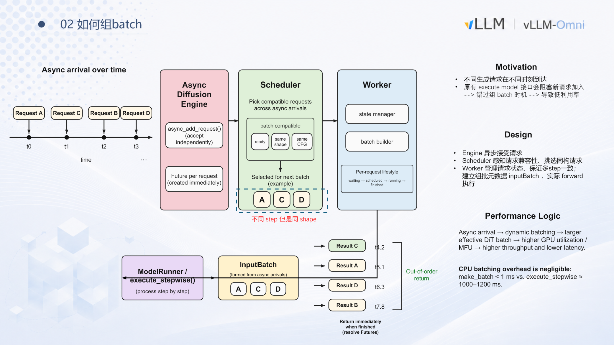
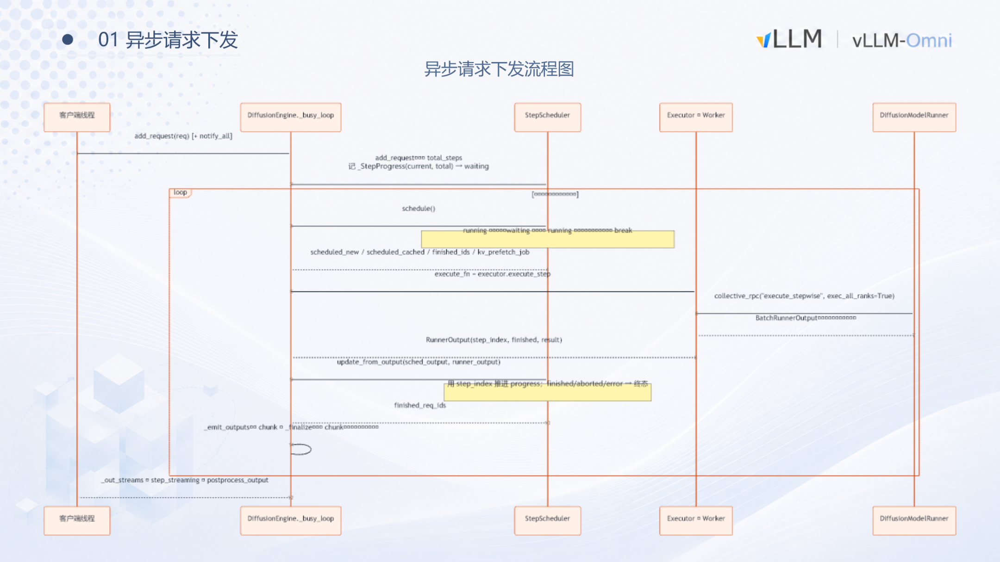
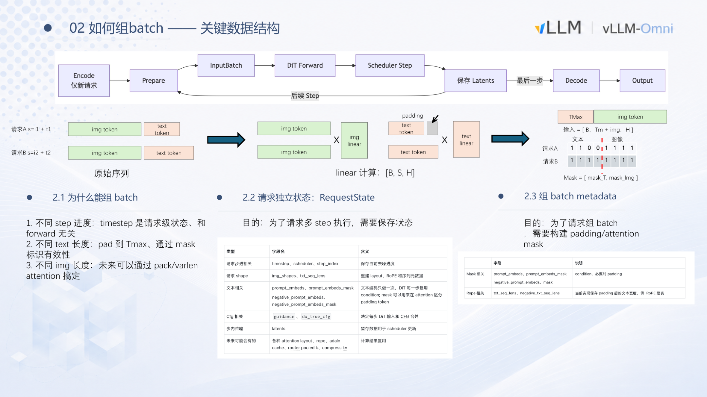
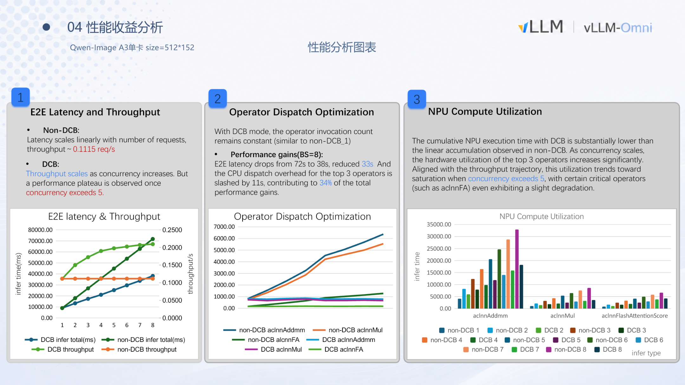
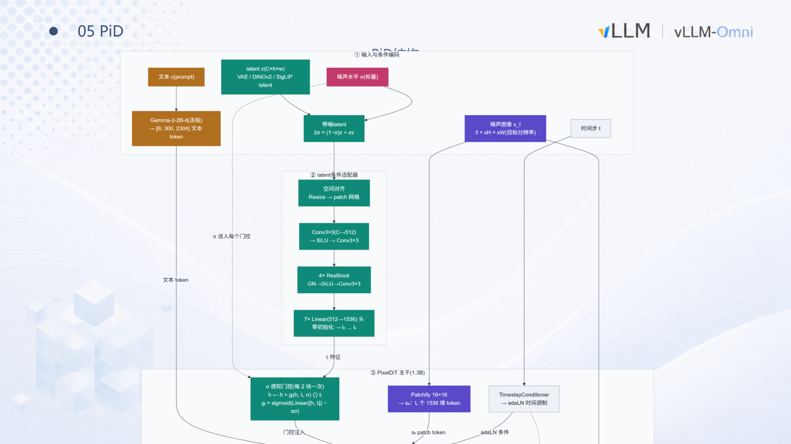
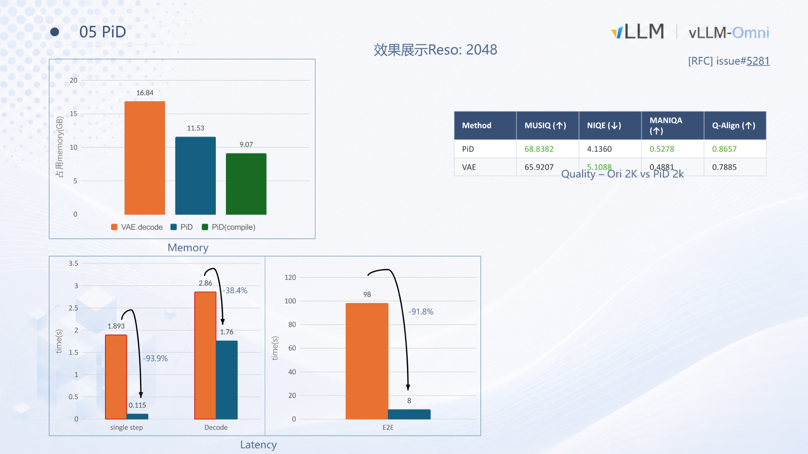

# vLLM-Omni 核心解析：Diffusion 异步批处理与 PiD 架构实践

**原视频**：[vLLM 小课堂（十四）：Diffusion Continuous Batching 详解](https://www.bilibili.com/video/BV189816ZE9C) · **配套资料**：[BilibiliShare 课件](https://drive.google.com/drive/folders/1C6PPfNhHgt0ehIO4v5AW7G2OAeRtYRoK)

扩散模型的在线推理有一对难以调和的矛盾：**小分辨率下 GPU 算力吃不饱，大分辨率下显存和延迟又居高不下**。vLLM-Omni 给出的方案是，先把调度粒度从"整条请求"拆细到"单个降噪步"，在 step 间隙实现动态组 batch 来提升小 shape 吞吐；再引入 PiD（Pixel Diffusion）替代 VAE decode，让主模型始终在小分辨率上推理，由轻量超分模块放大到目标尺寸。本文沿着这条因果链，从阻塞问题出发，逐层拆解异步调度、动态组 batch、异构分辨率处理、性能边界以及 PiD 的机制与实测收益。

**适读人群**：具备深度学习推理基础，关注模型部署与性能优化的 AI 工程师和后端开发者。

**前置知识**：了解 Diffusion 模型降噪流程的基本概念（step、latent、噪声调度），熟悉 batch 推理的一般原理，对 attention 机制有初步认识。

**阅读目标**：

1. 理解传统 Diffusion 同步推理导致的算力闲置根因。
2. 掌握 vLLM-Omni 基于 step 粒度的异步请求下发与动态组 batch 机制。
3. 了解异构分辨率组 batch 的切分与注意力隔离策略。
4. 认识 PiD 如何通过提前结束与上采样，兼顾小分辨率高吞吐与高清图像生成。

---

## 1 同步调度的工程矛盾：为什么 Diffusion 需要异步化？

**本节核心问题：** 传统的 Diffusion 推理接口为何会导致 GPU 算力闲置？

### 请求粒度的同步执行为何成为瓶颈

在 vLLM-Omni 的多阶段流水线中，上游 AR（自回归）阶段完成后，生成请求进入 Diffusion 阶段。改造前，Diffusion Engine 以 **请求粒度** 同步地将任务下发至后端 Worker——即一条请求必须走完全部降噪 step（扩散模型生成过程中的单次去噪计算）才会释放执行通道，后续请求只能排队等待。

这意味着：即使 GPU 在单条请求的计算中存在并行余量，新到达的请求也无法被纳入当前计算。**组 batch**（Dynamic Batching，将多条独立推理请求合并为一个批次并行计算，以提升 GPU 利用率）的前提是"凑齐一批兼容请求"，但在同步模式下这一前提根本无法成立。

### 阻塞如何吞噬组 batch 的机会

下图展示了异步化改造的动机与整体架构。重点关注左上角 **Motivation** 区域所描述的因果链：


*图注：左侧为请求随时间异步到达的示意；中部展示 Engine → Scheduler → Worker 三层职责；右侧说明结果按各自完成时间乱序返回。来源：演讲 PPT 第 5 页。*

图中 Motivation 部分给出了三段因果：

| 序号 | 环节 | 说明 |
|:---:|------|------|
| ① | 不同生成请求在不同时刻到达 | 真实场景中请求天然异步，到达间隔不可预测 |
| ② | 原有 `execute model` 接口阻塞新请求加入 | 执行粒度是整条请求的所有 step，通道被独占 |
| ③ | 错过组 batch 时机 → 低利用率 | 无法将并发请求拼入同一批次，GPU 并行度浪费 |

图中右侧的 "Out-of-order return" 暗示了改造方向：如果能让请求独立完成、独立返回，就能打破"一条请求锁死整个通道"的限制。

### 一个最小时间线：阻塞到底浪费了什么

假设四条请求 A–D 分别在 t₀–t₃ 到达，每条需要执行多个降噪 step。同步模式下：

```
t₀ ──── A 执行全部 step ────── A 完成
                                t_done_A ── B 执行全部 step ── B 完成
                                                                ...
```

请求 B 在 t₁ 就已到达，却必须等到 A 完成后才能开始。每条请求独占 GPU，batch size 始终为 1，矩阵运算单元大量空闲。

若能组 batch：A、B、D 在 Scheduler 判定为"同 shape、同 CFG（Classifier-Free Guidance，无分类器引导缩放系数）配置"后，可被合并为一个 batch 并行执行，有效吞吐随之增长。

### 小结

同步执行模式的本质问题是 **执行粒度与调度粒度错配**：调度以"整条请求"为单位，而 Diffusion 生成天然由多个 step 组成，每个 step 之间存在天然的调度窗口。将粒度从请求级拆解到 step 级，就为动态组 batch 打开了空间。这正是下一节要展开的核心设计。

---

## 2 核心设计：Step 粒度的异步请求下发

**本节核心问题：** 如何将调度粒度从请求级打散到 step 级，让系统在任意两个 step 之间都能插入、终止或返回请求？

### 改造前的瓶颈

改造前，上层 stage（由 FastAPI 服务拉起的请求解析与分发层）将请求同步交给 Diffusion stage 处理。整条链路串行阻塞：

| 环节 | 改造前行为 | 直接后果 |
|------|-----------|---------|
| 下发粒度 | 以 request 为单位同步等待 | 引擎同一时刻只持有一条请求 |
| 批处理 | 无法实现 | GPU 利用率低 |
| 中断响应 | 必须等全部 step 完成才能返回 | 无法提前终止长耗时请求 |

### 整体交互流程

下图是异步下发的时序示意，展示了客户端线程、`DiffusionEngine`、`StepScheduler`、Worker 四个角色之间的消息流转：


*图注：异步请求下发序列图，展示从请求入队、调度、逐 step 执行到结果流式回传的完整路径。来源：演讲 PPT 第 3 页。*

图中自左向右的四条生命线分别对应：上层 stage 的客户端线程（生产者）、`DiffusionEngine._busy_loop`（调度心跳）、`StepScheduler`（队列管理）、以及 Executor/Worker + `DiffusionModelRunner`（消费者）。消息箭头形成了"入队 → 循环调度 → 逐步执行 → 流式回传"的闭环。

### 三段因果链

**① 生产者：入队即返回**

上层 stage 线程拿到一条 Diffusion 请求后，做两件事便结束自身职责：

1. 调用 `_add_prepared_request` 将请求放入 `StepScheduler` 的 waiting 队列，并唤醒后台循环；
2. 调用 `get_output_stream` 获取一个异步输出流句柄，用于后续接收结果。

与改造前的根本差异在于：生产者只负责"放入"和"订阅流"，不再阻塞等待整条请求跑完所有降噪步。首条请求到达时会额外触发 `_check_and_start_background_loop`，完成队列读写所需的线程锁及 asyncio 异步变量的初始化。

**② 调度中枢：`_busy_loop`**

`DiffusionEngine` 内部维护一个名为 `_busy_loop` 的后台线程，是整套异步机制的心跳。其行为可简化为一个无限循环：

1. 从 `StepScheduler` 读取当前可调度的请求（`schedule` / `deschedule`）；
2. 若存在可调度请求，将它们打包送入后端 Worker 执行**一个** step；
3. step 完成后，将中间结果或最终输出写回各请求对应的输出流；
4. 回到步骤 1，开启下一轮循环。

若当前无可调度请求，线程通过 wait/唤醒机制挂起，避免空转消耗 CPU，直到新请求入队时被显式通知。

`StepScheduler` 自身维护 **running** 和 **waiting** 两类队列。每轮循环中，调度器检查 waiting 队列中哪些请求已满足执行条件，将其提升至 running 队列，与现有 running 请求共同构成本轮 step 的批次。

**③ 消费者：逐 step 执行与回传**

Worker 接收到一批请求后，在 tensor 维度将各请求的 **latent**（潜在空间特征，Diffusion 模型降噪过程中处理的中间数据形态）拼接起来，交由 `DiffusionModelRunner` 完成一次降噪计算。计算结果按请求拆分后，经输出流回传给各自的客户端线程。

每完成一个 step，控制权即回到 `_busy_loop`。这为三种操作打开了窗口：

- **插入新请求**：新到达的请求在下一轮循环被拉入 running 队列，随即参与组 batch。
- **终止请求**：上层发出中断信号后，`_busy_loop` 在下一轮循环中将目标请求剔除。
- **返回中间结果**：已走完全部 step 的请求输出最终图像；仍在进行中的请求可输出当前 step 的中间 latent。

### 最小状态演进示例

假设系统初始为空，请求 A 和 B 先后到达：

| 时刻 | 事件 | StepScheduler 状态 | Worker 执行内容 |
|------|------|-------------------|----------------|
| t₀ | A 入队，唤醒 busy_loop | waiting→running: {A} | — |
| t₁ | A 的 step 1 完成 | running: {A} | A step 1 |
| t₂ | B 入队（step 间隙） | waiting→running: {A, B} | — |
| t₃ | A step 2 + B step 1 组 batch 执行 | running: {A, B} | {A, B} 批量执行 |
| t₄ | A 全部 step 结束，输出结果 | running: {B} | B 继续 step 2… |

B 不需要等 A 走完所有降噪步才能加入，它在 t₂ 的 step 间隙被调度器拉入 running 队列，从 t₃ 起与 A 共享同一次 GPU 计算。

### 边界条件

1. **模型越小、step 越快，调度占比越高。** 当单 step 的 GPU 计算本身很短时，毫秒级调度开销不可忽视。
2. **中断响应粒度是"下一个 step 开始前"。** 若单 step 耗时较长，中断的实际延迟等于当前 step 剩余执行时间。
3. 演讲材料未给出 `StepScheduler` 内部的具体优先级规则或单批次最大请求数上限。

**小结**：将调度粒度从 request 下沉到 step，是后续一切批处理优化的基础设施。它赋予 `DiffusionEngine` 在每个降噪步间隙动态增减请求的能力，同时天然支持中断与中间结果流式返回。有了这一灵活性，紧接着要回答的是：在极短的 step 间隙内组 batch，CPU 开销是否会成为新瓶颈？

---

## 3 数据结构与执行：极低开销的动态组 Batch

**本节核心问题：** 每两个 step 之间都要在 CPU 侧完成请求筛选、padding 计算和 mask 构建——这些操作是否会成为新的性能瓶颈？

答案是否定的。根据演讲中的 profiling 数据，组 batch 的核心函数 `make_batch` 耗时 **< 1 ms**，而 GPU 侧 `execute_stepwise` 执行单个降噪步约 **1 000–1 200 ms**。两者相差三个数量级，CPU 调度开销完全被 GPU 计算时间掩盖。

### 不同进度的请求为什么可以放进同一个 batch

组 batch 的前提是合并后不改变各请求的计算语义。扩散模型有三个维度可能不同：

| 维度 | 是否影响 forward | 处理策略 |
|------|----------------|----------|
| **降噪进度**（timestep） | 不影响——timestep 是请求级条件输入 | 每个请求独立记录当前 step |
| **文本长度**（text token 数） | 影响张量宽度 | pad 到当前 batch 内最大长度 $T_{\max}$，配合 attention mask |
| **图像尺寸**（latent 分辨率） | 影响张量高度 | 当前方案要求同 shape 才可合并 |

三条规则合在一起，就是调度器挑选请求时的兼容性判据：**相同 shape、相同 CFG 配置**的请求才会被选入同一批次。

### 关键数据结构：RequestState 与 InputBatch

下图展示了两个核心结构如何协作完成从请求状态管理到统一张量构建的全过程：


*图注：组 batch 数据结构与张量构建流程。来源：演讲 PPT 第 6 页。*

**RequestState——请求级状态容器**

每个进入系统的生成请求都对应一个 `RequestState` 实例，至少保存以下信息：

- **当前 timestep**：已完成的降噪步数，决定下一步使用哪个时间步嵌入。
- **latent 张量**：当前步的中间降噪结果，形状与目标图像分辨率对应。
- **文本 embedding**：经 text encoder 后的条件向量，多 step 过程中保持不变，避免重复编码。
- **CFG 参数**：Classifier-Free Guidance 的缩放系数等配置。

`RequestState` 使请求的生命周期（waiting → scheduled → running → finished）与 GPU 的单步执行完全解耦。调度器只需读取各请求的状态字段，即可判断哪些请求具备合并条件。

**InputBatch——组批元数据与统一张量**

调度器选定一组兼容请求后，Worker 中的 batch builder 将它们拼装为 `InputBatch`，分三步完成：

1. **文本 padding**：假设请求 A 的文本长度为 $s_A$，请求 B 为 $s_B$，令 $T_{\max} = \max(s_A, s_B)$。较短的序列尾部填充零向量，使所有文本张量对齐到 $[B,\; T_{\max},\; H]$。
2. **Mask 构建**：生成 `mask_T`（文本有效位置）和 `mask_Img`（图像 token 有效位置）两组掩码，无效位置在 attention 计算中被屏蔽。
3. **张量拼接**：文本部分和图像 latent 部分沿序列维度拼接，最终输入形状为 $[B,\; T_{\max} + L_{\text{img}},\; H]$。

拼装完成后，GPU 只需执行一次 DiT（Diffusion Transformer）forward 即可同时推进 batch 内所有请求各一步。

### 最小状态演进示例

| 请求 | 目标分辨率 | 文本长度 | 当前 step | CFG |
|------|-----------|---------|----------|-----|
| A | 512×512 | 48 | 3 | 7.5 |
| B | 512×512 | 32 | 1 | 7.5 |
| C | 1024×1024 | 60 | 0 | 7.5 |

**调度器判定**：A 与 B 分辨率相同、CFG 相同，可合并；C 分辨率不同，需单独执行或等待同分辨率请求。

**InputBatch 构建（A + B）**：$T_{\max} = 48$，B 的文本 padding 16 个零向量；latent 形状一致，无需额外处理；timestep 向量为 $[t_A^{(3)},\; t_B^{(1)}]$，各自对应不同降噪阶段的噪声调度值。

GPU 执行一步后，A 进入 step 4，B 进入 step 2。若 A 的总步数为 4，则 A 标记为 finished，其 Future 立即 resolve 并返回结果——返回顺序与到达顺序无关。

### 边界条件与当前局限

1. **同 shape 约束**：不同分辨率的请求无法合并。真实业务中用户请求的目标尺寸往往各异，这会显著限制有效 batch size。
2. **CFG 一致性要求**：不同 guidance scale 的请求也不能合并，进一步缩小可组 batch 的请求池。

**小结**：组 batch 的 CPU 调度开销在当前实现中可以忽略不计，真正制约动态批处理效果的因素是请求之间的形状与配置异构性。当同时存在多种分辨率的请求时，能否将它们放进同一个 batch？

---

## 4 异构分辨率的组 Batch 策略

**本节核心问题：** 当同时到达的请求分辨率各不相同——例如 1024×1024、768×768 和 512×1024——张量形状无法对齐，能否仍然放进同一个 batch 并行执行？

### 从同构到异构：新增的工程矛盾

同构场景下所有 latent 具有相同空间维度，直接沿 batch 维拼接即可。一旦分辨率不同，核心矛盾变为：**latent 张量在空间维上长度不等，无法构成规整的 `[B, S, H]` 张量**。朴素的 padding 对齐会浪费大量计算与显存，串行执行则 GPU 利用率低下。

### 等长 Chunk 切分与重组

关键思路是：**不在原始分辨率上拼接，而是先将每个请求的图像 latent 切分为等长的 chunk，再把所有 chunk 组成 batch 执行。**

1. **计算切分粒度**——对所有请求的图像高度和宽度求最大公约数（GCD），确定 chunk 的空间尺寸。例如三个请求分辨率为 1024×1024、768×768、512×1024，可得 256×256 的 chunk。
2. **切分**——每个请求的 latent 按 chunk 尺寸切分。1024×1024 产生 16 个 chunk，768×768 产生 9 个。
3. **拼接**——所有 chunk 视作独立的"小图像"token 序列，沿 batch 维拼成一个大张量统一送入 DiT block。
4. **合并**——降噪完成后，将属于同一请求的 chunk 按原始位置重新拼合，恢复完整图像。

### 为什么只有 Self-Attention 需要特殊处理

将 DiT block 内的算子按"是否需要跨 chunk 上下文"分为两类：

- **无跨 chunk 依赖**：Linear 层、LayerNorm / RMSNorm、逐元素操作——它们对每个 token 独立运算，切分不影响结果。
- **有跨 chunk 依赖**：**Self-Attention 是唯一例外**。其 Q、K、V 交互范围覆盖同一图像内的所有空间位置；只在 chunk 内部做 attention 等价于施加局部窗口，会导致精度损失。

因此，组 batch 后仅需在 self-attention 这一步做特殊处理，其余算子直接以 chunk 粒度的大 batch 执行。

### Self-Attention 的两种处理方式

**方式一：Attention 前恢复、Attention 后重切（Recover-Scatter）。** 进入 self-attention 之前，将同一请求的所有 chunk 拼回原始分辨率形状；分辨率相同的请求可合并成一个小 batch 一起计算；完成后再拆回 chunk 形态继续后续层。

**方式二：Varlen Attention Mask。** **varlen attention**（Variable-Length Attention，变长序列注意力）允许通过传入 variance mask 精确指定每个 Q token 应与哪些 K/V token 交互，无需物理 recover/scatter，减少数据搬运开销。演讲者指出此功能在其早期工作时尚不可用，属于更新的优化路径。

### 收益来源

组 batch 的收益**主要来自 attention 以外的所有算子**。Linear、Norm、element-wise 操作在 chunk 粒度下组成更大 batch，GPU 计算单元更充分利用。Attention 阶段通过上述两种方式保持精度，不额外引入收益但也不引入损失。

### 边界条件

- **GCD 过小时**：分辨率差异极端会导致 chunk 数量激增、attention 恢复开销增大，收益可能被抵消。
- **VAE Decode 仍串行**：VAE decode 属于 memory-bound 操作，组 batch 收益有限，当前仍为串行执行。

**小结**：通过 GCD 驱动的等长 chunk 切分，异构分辨率请求可以在除 self-attention 外的全部算子上共享 batch 执行，在精度无损的前提下提升 GPU 利用率。机制设计完成，接下来需要通过实测数据验证其在不同分辨率下的真实收益。

---

## 5 性能与瓶颈：组 Batch 的收益边界在哪里？

**本节核心问题：** 开启组 batch 后，吞吐量和延迟在所有分辨率下都能获得显著提升吗？

答案是否定的。收益大小取决于单张图片生成时 GPU 算力的饱和程度：shape 越大、算力越满，组 batch 能释放的空间越小。以下数据均基于 Qwen-Image 模型在昇腾 A3 单卡上的实测。

### 1024×1024：算力已饱和，收益近乎为零

在 1024×1024 分辨率下，未开启组 batch 时，吞吐维持在约 **0.0127 req/s**。开启后微升至 **0.0131 req/s**，提升不到 4%，基本落入测量误差范围。

| 指标 | 未开启 | 开启 | 变化 |
|------|-------|------|------|
| 吞吐（req/s） | ≈ 0.0127 | ≈ 0.0131 | ≈ +3% |
| 延迟增长趋势 | 线性 | 近似线性（斜率略降） | 极小 |

原因直观：1024×1024 下每一步的矩阵运算量足以把计算单元"喂饱"，瓶颈在算力本身（compute bound）而非调度间隙。

### 512×512：小 shape 释放显著红利

分辨率降到 512×512 后，情况发生质变。Batch Size = 8 时：

| 指标 | 未开启 | 开启（BS=8） | 变化 |
|------|-------|-------------|------|
| 吞吐（req/s） | ≈ 0.1115 | ≈ 0.20 | ≈ +45% |
| E2E 延迟（s） | 72 | 38 | −33 s |

小 shape 下每张图片的单步计算量不足以占满硬件，留出大量空闲周期。组 batch 将多个请求的 latent 拼接后一次送入计算，正好填补了这些空闲。

### 收益拆解：33 秒里的 11 秒来自哪里？

通过对 Top-3 耗时算子（`aclnnAddmm`、`aclnnMul`、`aclnnFA`）的 profiling，可将收益拆为两部分：

1. **算子下发开销摊销**：未开启组 batch 时，每张图片的每个 step 都需要 CPU 独立向加速卡下发一整套算子调用。开启后，多个请求共享同一轮下发，调用次数与单请求时基本持平。这一项直接节省 **11 秒**，占总收益的 **34%**。
2. **计算利用率提升**：剩余约 22 秒（66%）来自硬件计算单元的更充分利用。

下图的三组子图分别对应延迟与吞吐、算子下发耗时、NPU 利用率：


*图注：左图为开启与未开启组 batch 在不同并发度下的 E2E 延迟与吞吐对比；中图为 Top-3 算子下发耗时随并发增长的变化；右图为 NPU 计算利用率柱状图。来源：演讲 PPT 第 9 页。*

图中几个关键信号：

- **左图**：未开启组 batch 的延迟曲线呈严格线性上升，吞吐横线不动；开启后延迟斜率明显更低，吞吐折线稳步爬升。
- **中图**：未开启时的下发耗时随并发线性膨胀，开启后几乎保持水平——印证了算子调用次数不随 batch size 增加。
- **右图**：`aclnnAddmm` 与 `aclnnMul` 在组 batch 模式下随并发上升提升显著，但 `aclnnFA`（FlashAttention 算子）在高并发时出现轻微下降，暗示注意力计算在该硬件上存在额外调度瓶颈。

### 并发度 > 5 后的平台期

无论吞吐曲线还是 NPU 利用率，**并发度超过 5** 之后增长均趋于平缓。硬件利用率已逼近上限，继续增大 batch size 只增加显存占用而无法换取更多吞吐。实际部署中，batch size 设为 5–8 是一个合理的工作点。

### 小结

| 条件 | 组 batch 收益 | 瓶颈所在 |
|------|-------------|---------|
| 大 shape（1024×1024） | 极小（< 4%） | 计算 bound，算力已饱和 |
| 小 shape（512×512），并发 ≤ 5 | 显著（吞吐 +45%，延迟 −33 s） | 算子下发 + 算力空闲 |
| 小 shape，并发 > 5 | 边际递减，进入平台期 | 硬件利用率趋于饱和 |

组 batch 的收益本质来源于"填补算力空闲 + 摊销下发开销"，当这两项空间被压缩到极限，收益即触顶。以上数据基于昇腾 A3 单卡测试，不同硬件平台的饱和点可能不同。

这就引出了一个实际矛盾：小分辨率下组 batch 效果拔群，但用户往往需要高清大图。有没有一种方式，既能在小 latent shape 上高效推理，又能最终输出高分辨率图像？

---

## 6 机制深化：PiD 提前结束与特征上采样

**本节核心问题：** 能否在小 latent 上完成主要降噪，再把结果"放大"到高分辨率？

**PiD**（Pixel Diffusion，像素空间扩散）正是为此而设计。它替换传统 VAE decode 阶段，允许在降噪中间步提前结束，并利用小分辨率特征生成高分辨率像素图像。

### 从标准流程到提前结束

典型的 Diffusion 图像生成包含三段：

| 阶段 | 操作空间 | 作用 |
|------|---------|------|
| VAE encode | 像素 → latent | 将输入映射到低维潜在空间 |
| 多步降噪（step 0 … N-1） | latent | DiT Block 逐步去噪 |
| VAE decode | latent → 像素 | 将最终 latent 还原为像素图像 |

PiD 的切入点在第三段：它**替换** VAE decode，并且不要求降噪跑满全部 N 步——可以在 **N-2、N-4** 等中间步提前结束，把此时的 latent 交给 PiD 处理。主模型推理步数随之缩减，降噪阶段计算量相应降低。

### PiD 内部结构：三路输入、一路高清输出

下图展示了 PiD 模块内部的数据流。重点关注三条输入路径如何汇入 PixelDiT 主干：


*图注：PiD 模块结构及数据流。来源：演讲 PPT 第 11 页。*

图中三条输入路径与一个主干网络：

1. **latent 输入（左侧）**：来自主模型降噪过程的中间 latent。先经过**条件适配器**（latent condition adapter），内部由 Resize → Conv3×3 → ResBlock → Linear 组成，将主模型的 latent 表征转换为 PixelDiT 主干能识别的特征格式。条件适配器是 PiD 中唯一与主模型强耦合的部分——更换主模型需重新训练适配器，而主干可以复用。

2. **文本 Embedding 输入（上方）**：使用冻结的 Gemma-2-2B 模型对文本 prompt 编码，产生 text tokens。文本信息的作用是控制上采样过程中的细节重绘——小分辨率 latent 本身不携带高频细节，放大后的纹理、边缘需要文本语义引导生成。

3. **目标分辨率噪声图像（右侧）**：PiD 自身准备一张与目标输出尺寸一致的纯噪声图像。例如主模型在 512×512 下降噪，PiD 执行 4× 上采样时噪声图像为 2048×2048。

三路信息汇入 **PixelDiT 主干**（约 1.3B 参数），通过交叉注意力（cross-attention）在目标分辨率的噪声图像上进行降噪，直接输出高分辨率像素图像。PiD 并非简单插值，而是一个以超分辨率为目标训练的扩散模型，在像素空间（而非 latent 空间）执行降噪，因此完全绕过了 VAE decode。

### 因果链

```
小分辨率 latent（如 512×512）
  ↓  条件适配器翻译
PixelDiT 可读取的特征
  ↓  + 目标分辨率纯噪声（如 2048×2048）+ 文本 tokens
交叉注意力降噪
  ↓
高分辨率像素图像（2048×2048）
```

### 最小例子：512 → 2048 的状态演进

以 4× 上采样为例，假设主模型总降噪步数 N = 20：

| 步骤 | 发生位置 | 分辨率 | 说明 |
|------|---------|--------|------|
| step 0–17 | 主模型 DiT | 512×512 latent | 组 batch 运行，享受高吞吐 |
| step 18（即 N-2） | 主模型 → PiD | — | 提前结束，latent 传入 PiD |
| PiD 多步降噪 | PixelDiT | 2048×2048 像素 | 在目标分辨率噪声图上生成高清结果 |

主模型少跑了 2 步降噪，且始终在小分辨率上运算；高分辨率的生成开销转移到了体量更小的 PiD 上。

### 模型体量与边界

据演讲者口述估计，PiD 的主干加上文本编码器整体**不到 3B** 参数，在显存占用上远小于主模型。PiD 支持 **4× 和 8×** 的上采样倍率。但需要注意：

- PiD 在**像素空间**降噪，目标分辨率很高时其自身显存消耗也会显著增长。
- 条件适配器与主模型耦合，更换主模型后需重新训练适配器，PixelDiT 主干保持不变。
- 演讲材料未给出更大上采样倍率下的质量与性能数据。

**小结**：PiD 通过将高分辨率生成从 VAE decode 中剥离，交由轻量级像素空间超分扩散模型完成，使主模型得以在小分辨率 latent 上组 batch 运行。接下来看它在实际部署中的资源节省与质量表现。

---

## 7 性能与局限：PiD 的工程收益与应用场景

**本节核心问题：** PiD 在 2048 分辨率图像生成任务中究竟能带来多大的资源节省？这些收益是否以牺牲图像质量为代价？

### 2048 分辨率下的实测数据

下图包含 PiD 在显存、延迟和质量三个维度的量化对比，用于判断其工程可行性：


*图注：PiD 效果展示——显存占用、延迟和图像质量的量化对比。来源：演讲 PPT 第 12 页。*

**显存占用**

| 方案 | 显存 (GB) | 相对 VAE decode 节省 |
|------|-----------|---------------------|
| VAE decode | 16.84 | — |
| PiD | 11.53 | ≈ 5.3 GB（约 31.5%） |

PiD 将实际降噪运行在 512 分辨率的输入 latent 上，中间激活显著更小。

**延迟表现**

- **单步延迟**下降约 **93.9%**——输入只有 512 分辨率，每步计算量约为原始的 1/16（分辨率平方缩减）。
- **端到端延迟**降低约 **91.8%**——综合降噪与解码两个阶段的缩减，整体时间不到原来的十分之一。

> 演讲材料未给出上述测试的具体 GPU 型号与批大小配置，百分比变化比绝对值更具参考意义。

**因果链**

```
输入 latent 分辨率从 2048 降到 512
  → 中间激活张量大幅缩小
    → 显存下降 ~5 GB，单步延迟降低 ~94%
  → 解码由 VAE 卷积换成轻量 Diffusion
    → 端到端延迟总计降低 ~92%
```

### 图像质量：互有胜负

PPT 给出了四个无参考图像质量指标的对比：

| 指标 | PiD | VAE | 更优方 | 含义 |
|------|-----|-----|--------|------|
| MUSIQ ↑ | 68.84 | 65.92 | PiD | 多尺度感知质量 |
| NIQE ↓ | 4.14 | 5.11 | PiD | 自然场景统计偏差，越低越好 |
| MANIQA ↑ | 0.528 | 0.488 | PiD | 多维注意力质量 |
| Q-Align ↑ | 0.866 | 0.789 | PiD | 对齐质量评分 |

四个量化指标上 PiD 均略优。但演讲者明确指出：**主观视觉感受上两者各有千秋**。例如 VAE 解码在某些场景下纹理质感更细腻，而 PiD 有时色彩更鲜明但细节处偶有拼接痕迹。PiD 因为是"小分辨率生成大分辨率"，本质上会做一定程度的细节重绘，文本 embedding 对新增细节的控制并非完美。PiD 并非无损替代，在对图像保真度有严格要求的场景中需逐案评估。

### 三大适用场景

| 场景 | 关键约束 | PiD 的作用 |
|------|---------|-----------|
| **边侧受限硬件推理** | 单卡仅 24 GB 或 48 GB 显存 | 将 2048 分辨率任务的显存降至 ~11.5 GB，使其在消费级 GPU 上可行 |
| **小 shape 组 batch 提升吞吐** | 服务端追求吞吐最大化 | 用更小的 latent shape 做组 batch，GPU 利用率更高 |
| **超高清图片生成** | 需要 4K/8K 输出 | 利用 4× 和 8× 上采样特性，在不爆显存的前提下输出超高分辨率 |

在边缘推理场景中，传统 VAE decode 的 16.84 GB 峰值显存几乎占满一张 24 GB 显卡的可用空间。切换到 PiD 后释放出的空间足以容纳中等规模的语言-视觉主干。

---

## 结论与局限

### 核心结论

1. **异步请求下发是一切批处理优化的基石。** 将调度粒度从整条请求细化至单个降噪步（step），使 `DiffusionEngine` 在每个 step 间隙都能动态插入或终止请求，天然支持中断与中间结果流式返回。

2. **动态组 batch 的 CPU 开销可以忽略。** `make_batch` 耗时 < 1 ms，相比 GPU 单步执行的 1 000–1 200 ms，两者差三个数量级。

3. **组 batch 在小分辨率下收益显著，在大分辨率下收益受限。** 512×512 下 BS=8 时吞吐提升约 45%、延迟下降 33 秒（其中 34% 归功于算子下发开销摊销）；1024×1024 下提升不到 4%，算力已饱和。

4. **异构分辨率可通过 GCD 等长 chunk 切分实现混合 batch。** 仅 self-attention 需要特殊处理（Recover-Scatter 或 varlen mask），其余算子直接以 chunk 粒度并行执行。

5. **PiD 以极小的质量波动换取巨大的资源节省。** 在 2048 分辨率下，显存从 16.84 GB 降至 11.53 GB，端到端延迟降低 91.8%，为边缘设备推理和超高清生成提供了低延迟、低显存的新路径。

6. **PiD 的核心价值在于解耦主模型推理分辨率与输出分辨率。** 主模型始终在小 latent 上高效组 batch，高分辨率生成交由不到 3B 参数的轻量超分模块完成。

### 明确局限

- **大分辨率组 batch 收益有限**：1024×1024 及以上分辨率下算力已饱和，批处理无法释放更多空间。并发度超过 5 后收益进入平台期。
- **同 shape + 同 CFG 约束**：不同分辨率和不同 guidance scale 的请求无法合并，限制了实际可组 batch 的请求池规模。
- **PiD 图像质量非无损**：量化指标上 PiD 占优，但主观评价因场景而异，细节处偶有拼接痕迹或过曝倾向。
- **条件适配器与主模型绑定**：每更换一次主模型，需重新训练 PiD 的条件适配器。
- **硬件基准单一**：文中性能数据均基于 Qwen-Image 模型在昇腾 A3 单卡上的测试，不同硬件平台的饱和点与收益曲线可能显著不同。
- **PiD 自身的显存扩展问题**：PiD 在像素空间降噪，当目标分辨率极高时，PiD 自身的显存消耗能否通过组 batch 进一步优化，仍有待验证。
