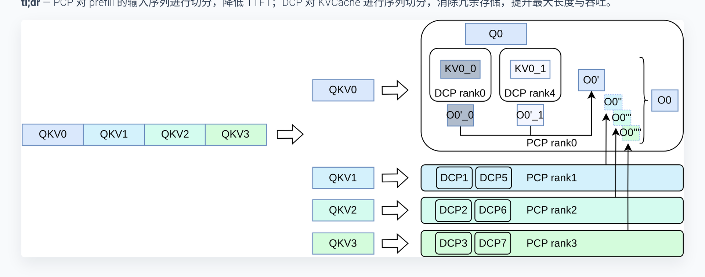
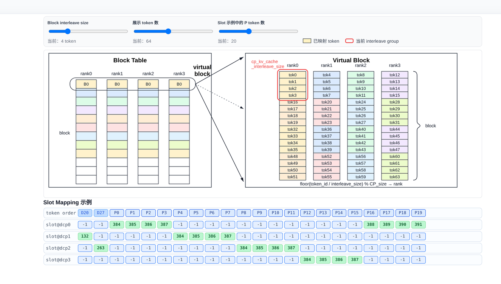
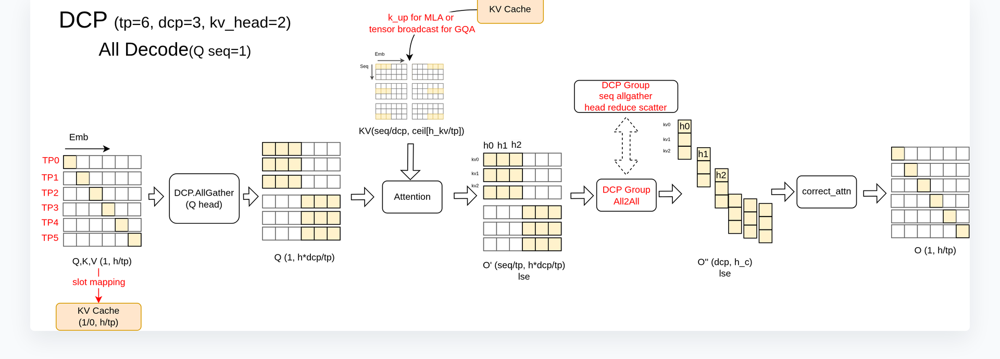
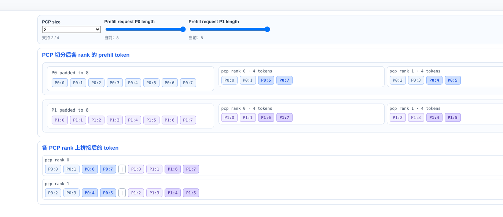
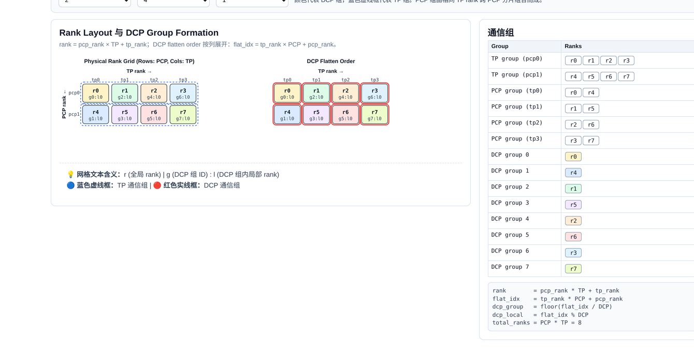
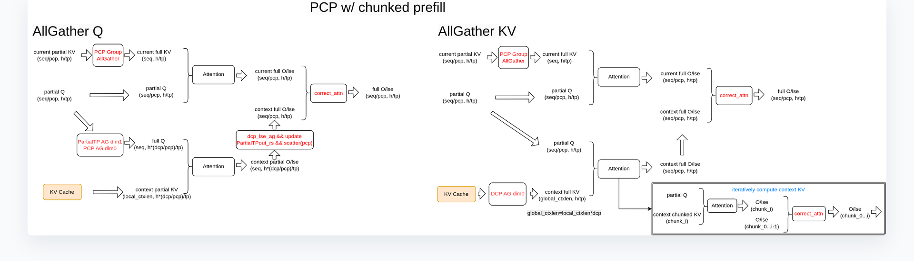
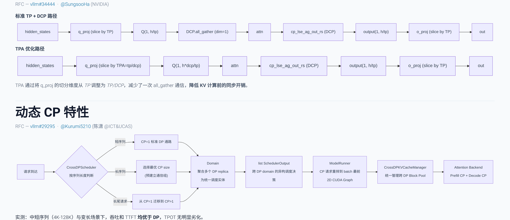

# Breaking the Long-Sequence Inference Bottleneck: A Deep Dive into vLLM's Distributed Context Parallelism Architecture

**Source video**: [Bilibili BV1W1L96KEf5](https://www.bilibili.com/video/BV1W1L96KEf5) · **Slides**: [CP-Viz materials](https://drive.google.com/drive/folders/1rB8y5eBGRJDa3SXaHo_U1FjKaeUjEeMw)

As the input context of large models grows from 4K to 128K and even to the million-token scale, KVCache memory consumption and Attention computation explode in tandem. Neither traditional tensor parallelism nor data parallelism can cope on its own. To address this, vLLM introduces a Context Parallelism (CP) framework—distributing KVCache across GPUs via DCP during the Decode phase, partitioning input sequences for parallel computation via PCP during the Prefill phase, and leveraging TPA together with dynamic routing to extend the benefit range from ultra-long sequences down to medium and short ones. This article traces the causal chain of "why partition → how to manage memory → how data flows → how to balance load → how to optimize communication → how fast it actually runs," dissecting the engineering design layer by layer.

**Target audience**: AI systems engineers who are familiar with the fundamentals of large-model inference (e.g., tensor parallelism, KVCache) and wish to gain a deep understanding of distributed system design and performance tuning for ultra-long contexts.

**Prerequisites**:

- KVCache mechanics and memory footprint estimation
- Tensor Parallelism (TP) fundamentals
- Architectural differences between GQA (Grouped-Query Attention) and MLA (Multi-Head Latent Attention)
- Basic collective communication primitives such as AllGather and ReduceScatter

**Learning objectives**:

1. Understand how DCP eliminates KVCache redundancy through interleaved storage
2. Master PCP's sequence partitioning and load-balancing strategies during the Prefill phase
3. Compare the data-flow differences between GQA and MLA architectures in distributed context parallelism
4. Clarify the communication–computation trade-offs in long-sequence inference and the dynamic optimization approaches

---

## 1 The Engineering Bottleneck of Long-Sequence Inference and the CP Architecture Landscape

### Questions this section answers

Why do traditional TP and DP (Data Parallelism) fail in ultra-long-context scenarios? How does vLLM break the deadlock at the system level?

### Two bottlenecks tightening simultaneously

Consider two core inference metrics:

| Metric | Full Name | Governed by |
|--------|-----------|-------------|
| **TTFT** | Time To First Token | Computation volume and degree of parallelism in the Prefill phase |
| **TPOT** | Time Per Output Token | KVCache memory access and memory footprint in the Decode phase |

Longer sequences impose a dual pressure:

1. **Prefill phase**: Attention computation grows quadratically with sequence length. A single GPU's compute capacity cannot complete full prefill within an acceptable time, causing TTFT to degrade rapidly.
2. **Decode phase**: The KVCache (Key-Value Cache—the cached historical key-value pairs in the attention mechanism) size per request scales linearly with sequence length. At the 128K scale, a single request's KVCache can consume all available memory on one GPU, drastically reducing batch capacity and collapsing throughput.

TP can partition model weights but cannot reduce the per-request KVCache replica on each GPU—every GPU still maintains a full copy of the KV cache, leaving memory redundancy unresolved. DP assigns different requests to different GPUs but cannot address the memory and compute bottlenecks of a single long sequence. Simply stacking TP or DP alone cannot fundamentally resolve this core contradiction.

### The CP architecture landscape: Partitioning along the sequence dimension

vLLM's approach is to partition along the **sequence dimension**, splitting context parallelism into two complementary mechanisms:

- **DCP (Distributed Context Parallelism)**: During the Decode phase, KVCache is distributed across GPUs along the token dimension, eliminating redundant replicas and increasing the maximum supported sequence length and overall throughput. This feature was originally contributed by ChaoHong from Moonshot AI (PR #23734).
- **PCP (Pipeline Context Parallelism)**: During the Prefill phase, the input sequence is split into multiple chunks and distributed across different PCP ranks for parallel computation, directly compressing TTFT.

The following figure shows which inference phase PCP and DCP each act upon, and how they work together—it serves as the entry point for building a global data-flow intuition:

*Figure: CP feature overview—PCP partitions the input sequence during the Prefill phase; DCP partitions KVCache during the Decode phase. Source: Presentation slide 3*

Using the configuration shown in the figure as an example, let us break down each step:

1. **Input sequence partitioning**: The original input QKV is divided into multiple segments and sent to different PCP ranks. Each rank computes only a subset of the full sequence, reducing TTFT by approximately a factor equal to the number of ranks.
2. **Cross-GPU KVCache distribution**: Each DCP rank holds KV for only a portion of the tokens, no longer retaining a full copy.
3. **Partial result aggregation**: Q is combined with the KV shards on different GPUs to compute intermediate outputs, which are then aggregated into the complete result.

### Causal chain

> **Sequence gets longer → KVCache bloats (memory wall) + Attention computation surges (compute wall)**
> → **DCP distributes KVCache along the token dimension → per-GPU memory usage drops to 1/N**
> → **PCP partitions the input sequence → Prefill computation is parallelized → TTFT decreases**
> → **The two mechanisms compose orthogonally → dual decoupling of memory and compute**

It is worth noting that DCP has no impact on the inference computation during the Prefill phase itself—it only changes the storage mapping when KV is written into the KVCache (modifications to slot mapping and the block table), adding no extra computational overhead to Prefill.

### Minimal intuitive example

Suppose a single request of 8K tokens is served by a system with 4 GPUs forming one DCP group:

- **Without DCP**: Each GPU stores a complete 8K KVCache → 4× total redundancy.
- **With DCP**: Each GPU stores only 2K tokens of KVCache → per-GPU memory drops to 1/4 of the original, and the freed space can accommodate more concurrent requests.

**Conclusion**: The essence of the CP architecture is to break the implicit assumption that "every GPU holds the complete KVCache," achieving distributed partitioning of storage and computation along the sequence dimension. DCP addresses the memory bottleneck; PCP addresses the compute bottleneck. The two are orthogonal and stack on top of each other.

---

## 2 DCP Core Design: Interleaved Storage and Virtual Block Management

### Questions this section answers

After KVCache is partitioned along the sequence dimension and distributed across multiple GPUs, the originally contiguous Block Table on a single GPU must become aware of "which tokens belong to me and which do not." If the management granularity is chosen poorly, one either ends up with a large number of sparsely filled blocks containing only a few tokens, or transmits massive amounts of invalid data in PD disaggregation (Prefill-Decode Disaggregation—an architecture that separates prefill and decode onto different nodes) scenarios. DCP resolves this contradiction through two key designs: **Virtual Block** and **Interleave Size**.

### Virtual Block: Logical merging of cross-GPU blocks

In standard vLLM, each GPU maintains a mirrored Block Table with identical contents. After introducing DCP, different GPUs store KV for different tokens, so the Block Tables are no longer symmetric. To allow the upper-layer block allocation and Prefix Caching hit logic to continue working correctly, DCP introduces the Virtual Block—the physical blocks corresponding to each rank within the same CP group are merged into a single logical virtual block whose size is `block_size × CP_size`.

When the upper layer allocates virtual blocks based on the total sequence length of a request, it can precisely calculate the number of physical blocks the local GPU actually needs, avoiding allocation bias caused by cross-GPU distribution. Meanwhile, Prefix Caching compares prefixes at the virtual-block granularity, ensuring the integrity of hit determination.

### Interleave Size: Controlling the interleaving granularity

At what granularity are tokens assigned to each rank? DCP uses the **Interleave Size** parameter to control this. Given a token ID, the rank to which it is assigned is determined by the following formula:

> **Variable definitions**: `token_id` is the positional index of the token within the sequence; `interleave_size` is the number of tokens consecutively assigned to the same rank at a time; `CP_size` is the number of GPUs in the CP group.

$$
\text{rank} = \left\lfloor \frac{\text{token\_id}}{\text{interleave\_size}} \right\rfloor \bmod \text{CP\_size}
$$

**Numerical verification** (`interleave_size = 4`, `CP_size = 4`):

| Token Range | Computation | Target Rank |
|:-----------:|:-----------:|:-----------:|
| tok 0–3 | ⌊0/4⌋ % 4 = 0 | rank 0 |
| tok 4–7 | ⌊4/4⌋ % 4 = 1 | rank 1 |
| tok 8–11 | ⌊8/4⌋ % 4 = 2 | rank 2 |
| tok 12–15 | ⌊12/4⌋ % 4 = 3 | rank 3 |
| tok 16–19 | ⌊16/4⌋ % 4 = 0 | rank 0 (new round) |

Every 4 consecutive tokens are assigned to the same GPU, and after four groups the cycle returns to rank 0, forming an interleaved round-robin pattern.

### Diagram: Actual mapping of the Block Table and Slot Mapping

The following figure is key to understanding DCP's write logic—it shows how each rank's physical slots are distributed when the interleave size is 4, and how the Slot Mapping index distinguishes between tokens that "should be stored" and those that "should be ignored":

*Figure: Interleaved distribution of the KVCache Block Table across 4 ranks, with a Slot Mapping example. Source: Presentation slide 6*

The upper half of the figure shows the distribution of tok0–tok63 within a Virtual Block—every 4 tokens are placed contiguously in the physical slots of the same rank, with the four ranks alternating in turn. The lower half shows the Slot Mapping table with the concrete index mapping:

- **Decode Token D20** (token\_id=20): ⌊20/4⌋ % 4 = 1, landing on **rank 1**, mapped to physical slot range 384–387.
- **Decode Token D27** (token\_id=27): ⌊27/4⌋ % 4 = 2, landing on **rank 2**.
- **Tokens not belonging to the local GPU**: Their Slot Mapping values are set to **-1**. When the backend writes to KVCache and encounters -1, it simply skips the entry without performing any storage operation.

Each GPU only needs a single scan of the Slot Mapping array to distinguish "what to store" from "what to ignore," with no additional cross-GPU coordination required.

### Practical considerations for PD disaggregation

DCP's earliest implementation used `interleave_size = 1`, distributing tokens in a round-robin fashion one at a time. This causes significant communication waste in PD disaggregation scenarios: the PD disaggregation architecture transfers KVCache between Prefill and Decode nodes in units of whole blocks. Suppose `block_size = 16` and `CP_size = 4`. When there are only 16 tokens, a single block could theoretically hold them all. However, with `interleave_size = 1`, these 16 tokens are scattered across 4 GPUs with 4 tokens each; each GPU's block is only 25% filled, yet must be transmitted in its entirety—communication volume is amplified 4×, producing 75% wasted space.

The solution is to **set `interleave_size` equal to `block_size`**. Earlier blocks are filled as fully as possible before rotating to the next GPU. Only the last GPU may end up with a partially filled block, and completely empty blocks do not need to be transferred at all, drastically reducing communication overhead.

> The configuration advice for PD disaggregation scenarios described above comes primarily from the speaker's verbal elaboration; the presentation slides did not detail the quantitative effects of this configuration.

### Summary and boundary conditions

Virtual Block and Interleave Size together constitute DCP's static memory mapping layer: the former keeps block allocation and prefix matching logically consistent, while the latter provides a tunable knob between memory contiguity and communication efficiency. One caveat: when `interleave_size` does not evenly divide `block_size`, tokens from different ranks may interleave within the same block—the presentation materials did not provide specific handling details for this scenario.

---

## 3 DCP Data Flows Under Different Architectures: GQA vs. MLA

### Questions this section answers

The memory mapping solves the problem of "where data is stored." The next critical question is: during the Decode phase, each GPU holds only a portion of the sequence's KVCache—how does the current GPU's Query "see" the historical KV information on the other GPUs? GQA and MLA provide fundamentally different answers—the former moves Q, the latter moves KV. Understanding their divergence is key to grasping DCP's communication overhead.

### Prerequisite: DCP's hard parameter constraint

Before discussing data flows, a configuration red line must be stated clearly:

$$\text{DCP\_size} \times \text{KV\_head} \leq \text{TP\_size}$$

The very rationale for DCP's existence is that when the TP size exceeds the number of KV heads, redundant KVCache storage appears across GPUs. GQA models typically have 2, 4, or 8 KV heads; once the TP size exceeds this value, redundancy is inevitable. MLA is even more extreme—after compression, the KVCache is fully redundant across all GPUs (effectively equivalent to KV head = 1). Violating the inequality above means that KVCache cannot be partitioned without overlap within the DCP group, and the system will reject the configuration at initialization.

### GQA path: AllGather on Q

The following figure shows the Decode data flow under a typical configuration of TP=6, DCP=3, KV\_head=2—it is the central diagram for understanding how tensor shapes are progressively transformed in the GQA path:

*Figure: GQA Decode data flow (TP=6, DCP=3, KV\_head=2, Q seq=1). Source: Presentation slide 12*

The core path in the figure consists of three steps:

| Stage | Operation | Tensor Shape Change | Explanation |
|-------|-----------|---------------------|-------------|
| ① Q expansion | DCP.AllGather (Q head dimension) | `(1, h/tp)` → `(1, h×dcp/tp)` | Q heads are exchanged among GPUs within the group so that each GPU's Q covers all heads in the group |
| ② Attention | Local computation | Q `(1, h×dcp/tp)` × KV `(seq/dcp, h/tp)` → O' | Each GPU performs attention using the expanded Q against its local KV shard |
| ③ Output aggregation | DCP Group All2All | O' → O `(1, h/tp)` | AllGather along the seq dimension + ReduceScatter along the head dimension, corrected via `correct_attn` |

**Causal chain**: TP partitions Q heads across GPUs → DCP further partitions KVCache along the sequence dimension → a single GPU's Q fragment can only match the heads of the local KV and cannot see the sequence shards on other GPUs → Q heads must first be AllGathered within the DCP group so that each GPU holds enough Q information to read its local KV → after Attention, an All2All (a collective communication operation where each GPU simultaneously sends to and receives from all other GPUs) aggregates the distributed partial results into the complete output.

**Minimal example**: 6 GPUs numbered 0–5; DCP=3 groups GPUs {0, 1, 2} into one DCP group. GPU 0 originally has only `h/6` Q heads; after AllGather it obtains `h×3/6 = h/2` heads. At the same time, GPU 0 stores only about 1/3 of the sequence's KVCache. After Attention produces a partial O', the three GPUs execute All2All: AllGather along the sequence dimension reconstructs the full sequence, and ReduceScatter along the head dimension restores it to `h/6`. Ultimately, each GPU obtains the correct `(1, h/tp)` output.

### MLA path: Aggregating KVCache instead of moving Q

MLA handles this in a fundamentally different way from GQA. **The speaker explicitly stated during the presentation that the diagrams on slides 12–13 depicting "DCP performing AllGather on heads" contain a drawing error for the MLA case—the MLA path does not perform AllGather on Q.**

The actual flow is as follows:

1. **Distributed KVCache storage**: Same as GQA—each GPU holds KV for only a portion of the sequence via interleaving, with shape `(seq/dcp, h_c)` (where `h_c` is MLA's compressed latent dimension).
2. **reorg\_kvcache**: Through a workspace mechanism, an AllGather along the sequence dimension is first performed on the KVCache across all GPUs within the DCP group, followed by a `local_gather` operation that reorders the interleaved KVCache into a contiguous, per-request layout while removing empty padding caused by uneven storage lengths across GPUs.
3. **Local Attention**: The reordered KVCache is compact and contiguous, and Attention is computed directly with the local GPU's own Q—no communication on Q is needed.
4. **Iterative aggregation**: Through batched iteration over the workspace (fetching a portion of KV at a time), computation is performed and accumulated round by round, avoiding activation memory explosion from loading an overly long context all at once.

### Trade-off comparison between the two paths

| Dimension | GQA Path | MLA Path |
|-----------|----------|----------|
| Communication target | Q (head dimension) | KVCache (sequence dimension) |
| Communication volume characteristics | Small data volume when Q seq=1 | KVCache grows with sequence length; communication volume is larger |
| Additional computation | All2All + correct\_attn | reorg\_kvcache reordering + batched iteration |
| Design rationale | Many Q heads, few KV heads—moving Q is more economical | After MLA compression, KV head ≈ 1—moving Q is pointless; reusing the workspace batching pattern is more natural |

The core trade-off is this: GQA has few KV heads but many Q heads, and during Decode the Q sequence length is only 1, so the communication volume of AllGathering Q is far smaller than shipping the entire KVCache. After MLA's compression, the effective KV head count is 1—AllGathering Q would have no heads to expand, nor would it fit MLA's existing workspace batching pattern, so the approach pivots to aggregating KV instead.

> The internal implementation of `reorg_kvcache` in the MLA path involves cross-rank interleaved index mapping. The speaker also noted that this is one of the harder-to-read parts of the codebase; specific details require further verification against the source code.

---

## 4 PCP Core Design: Head-Tail Concatenation for Sequence Partitioning

### Questions this section answers

DCP addresses the memory and throughput challenges of the Decode phase, but the Prefill phase for long sequences still faces a compute bottleneck from full Attention. PCP partitions the input along the sequence dimension to parallelize Prefill computation—however, Attention carries a Causal Mask (a lower-triangular matrix that allows each token to attend only to itself and preceding positions), and naïve contiguous partitioning leads to severely imbalanced computation across GPUs. How does PCP eliminate this imbalance?

### The root cause of imbalance

Dividing a sequence of length $N$ evenly into $K$ contiguous blocks, the effective Attention computation for the $i$-th block (with $i$ starting from 0) is roughly proportional to the area it covers in the lower-triangular matrix. Block 0 has only a very narrow triangular region, while block $K{-}1$ fills nearly the entire square region. Assigning contiguous blocks directly to different ranks means the last GPU's load can be several times that of the first, and GPU utilization drops significantly due to the "wait for the straggler" effect.

### Head-tail concatenation strategy

PCP employs a partitioning method called **Chunk Swap** (also commonly known as Zigzag): the sequence is first divided into $2K$ small blocks, and then symmetrically paired—the head block and the tail block with matching indices are assigned to the same rank. Taking PCP Size = 3 as an example, the sequence is split into 6 chunks with the following assignment rules:

| Rank | Assigned Chunk IDs | Intuition |
|:----:|:------------------:|:---------:|
| 0 | Chunk 0 + Chunk 5 | Shallowest + Deepest |
| 1 | Chunk 1 + Chunk 4 | Second-shallowest + Second-deepest |
| 2 | Chunk 2 + Chunk 3 | Two middle chunks |

Each head-tail pair covers approximately complementary effective computation areas under the Causal Mask's lower triangle: the head block's area is small, the tail block's area is large, and their sum tends toward equality, making the FlashAttention (a memory-efficient Attention algorithm) workload roughly uniform across all ranks.

### Minimal state progression: PCP Size = 2

The following figure shows the complete partitioning process for two Prefill requests with PCP Size = 2—it is key to understanding how Chunk Swap actually operates in multi-request scenarios:

*Figure: Prefill token distribution across ranks after PCP partitioning (PCP Size = 2). Source: Presentation slide 18*

Step-by-step breakdown (using request P0 with a length of 8 tokens as an example):

1. **Alignment**: Each request's length is first aligned to an integer multiple of $2 \times \text{PCP Size} = 4$. In this case, P0's length is exactly 8, so no additional padding is needed.
2. **Equal-sized chunking**: P0's Tokens 0–7 are divided into 4 chunks, each containing 2 tokens: Chunk 0 = \[0, 1\], Chunk 1 = \[2, 3\], Chunk 2 = \[4, 5\], Chunk 3 = \[6, 7\].
3. **Head-tail pairing**: Rank 0 receives Chunk 0 (Tokens 0, 1) and Chunk 3 (Tokens 6, 7); Rank 1 receives Chunk 1 (Tokens 2, 3) and Chunk 2 (Tokens 4, 5).
4. **Final layout**: After concatenation, Rank 0 holds the sequence `[0, 1, 6, 7]`, and Rank 1 holds `[2, 3, 4, 5]`. Rank 0's head segment (Tokens 0, 1) attends only to a very small triangular region under the Causal Mask, while its tail segment (Tokens 6, 7) must attend to many preceding tokens—one small, one large; Rank 1's two segments fall in the middle of the sequence, with moderate computation. The total effective Attention area on both ranks is therefore approximately equal.

### Metadata changes induced by partitioning

Head-tail concatenation is not simply "send half as many tokens"—it changes nearly all Attention-related metadata on each GPU:

- **Position IDs**: No longer a monotonically increasing sequence, but a concatenation of head-segment and tail-segment positions, directly affecting the computation of positional encodings such as RoPE.
- **Q Length**: The Query length on each rank is approximately halved.
- **QV Length (historical KV length)**: Requires corresponding truncation and reassembly; the head segment corresponds to a short history of KV while the tail segment's is long, resulting in an asymmetric distribution.

### PCP communication group topology

PCP introduces communication groups independent of TP. In the rank partitioning hierarchy, PCP partitioning precedes TP: physical GPUs are first grouped along the PCP dimension to receive different sequence fragments, and then Attention heads are further partitioned along the TP dimension within each group. The following figure helps illustrate the nesting and reuse logic among the various communication groups:

*Figure: Physical Rank Grid and the formation rules for each communication group. Source: Presentation slide 16*

The left side of the figure represents physical ranks in a row-column grid (rows correspond to PCP, columns to TP), while the right-side table lists the rank IDs belonging to each TP, PCP, and DCP communication group. A key point to note: when DCP Size equals PCP Size, the DCP communication group coincides with the PCP communication group, and the sequence-level KVCache partitioning is performed only within the PCP group. PCP itself does not control the interleaved storage of KVCache—that responsibility remains with DCP.

### Summary and boundary conditions

The head-tail concatenation strategy effectively flattens the computational skew caused by the Causal Mask at very low implementation cost (requiring only reordering of token indices and metadata), and is a critical prerequisite for scaling PCP to multi-GPU Prefill. However, it introduces a direct consequence: the Query sequence on each rank is non-contiguous and incomplete. When the input sequence is extremely long and further Chunked Prefill (splitting an overly long input sequence into multiple chunks for incremental processing) is required, the non-contiguous Q makes chunk boundaries and communication patterns considerably more complex.

---

## 5 Complex Communication in Long Prefill: The Choice Between AllGather Q and AllGather KV

### Questions this section answers

In DCP's Decode scenario, each GPU holds the complete Q sequence—only the KVCache is partitioned. But with PCP introduced, **Q is also partitioned along the sequence dimension**. This means that in Chunked Prefill scenarios, a single GPU has neither the complete Q nor the complete KVCache, and cannot independently compute the full Attention. How is the missing side made whole?

### Data-flow comparison of the two paths

vLLM implements two communication paths for this purpose: **AllGather Q** and **AllGather KV**, each restoring the complete Attention result by completing a different side of the data. The following figure presents the two approaches side by side—AllGather Q on the left, AllGather KV on the right—and is essential for grasping their core differences:

*Figure: Two communication strategies for PCP under Chunked Prefill—AllGather Q on the left, AllGather KV on the right. Source: Presentation slide 23*

| Dimension | AllGather Q (left) | AllGather KV (right) |
|-----------|--------------------|----------------------|
| Initial communication | AllGather Q within the PCP group to obtain Full Q | AllGather KV Cache within the DCP group to obtain Full KV |
| Precondition for Attention computation | Full Q + Partial KV → degenerates to the DCP long-Prefill flow | Partial Q + Full KV → degenerates to the TP Prefill flow |
| Subsequent aggregation | KV-side communication within the DCP group to accumulate context information | Current Q computes directly against the full KV; no additional sequence completion needed |

### AllGather Q path: Completing the query sequence

The core logic is to **first let each GPU see the complete Q, then reuse the existing DCP flow for distributed computation on the KV side**:

1. **PCP group AllGather**: Each GPU's Partial Q is concatenated into Full Q within the PCP group.
2. **Local Attention**: Full Q is combined with the local GPU's Partial KVCache for one round of Attention, yielding a partial result.
3. **DCP group communication**: KVCache information from the other GPUs is gathered within the DCP group, effectively obtaining the full context.
4. **Result aggregation**: The local Attention output and the context Attention output are merged to produce the final result.

### AllGather KV path: Iteratively completing the context

The approach is reversed—**first let each GPU see the complete KVCache; Q is partial but needs no completion**:

1. **DCP group KV AllGather**: KVCache from all GPUs is collected so that each GPU obtains the full context.
2. **Local Attention**: Partial Q is combined with Full KV; Q queries only its corresponding segment of the sequence, and the computation result is directly the final result.
3. **Output update**: The QKV computation result for the current chunk is merged with the context portion in a single update.

The "Iterative Computation" label on the right side of the figure corresponds to the process of transferring KVCache in blocks and progressively accumulating results in long-context scenarios. This approach reuses the AllGather workspace and DCP communication logic already present in MLA.

### Why are two approaches needed?—The communication cost crossover point

The communication overhead of the two paths depends on the respective data volumes of Q and KV, and these two quantities trade off against each other under different operating conditions:

- **AllGather Q communication volume** is proportional to Q's sequence length. In Chunked Prefill, when `max_num_batched_tokens` is set large, the current chunk's Q becomes long and communication cost rises.
- **AllGather KV communication volume** is proportional to the size of the context's KVCache. However, after head-dimension partitioning, the actual data volume for short contexts may be smaller than a full chunk of Q.

**The crossover point occurs when**: the batch is large and the chunk is long—Q's data volume exceeds the partitioned KV's, making AllGather KV more efficient. Conversely, when the context is extremely long but the current chunk is short, AllGather Q incurs less communication.

> The presentation materials did not provide specific communication volume formulas or quantitative comparison data; the above analysis is based on the speaker's qualitative description of the applicable scenarios for each approach.

### Summary and applicability boundaries

The communication challenge of PCP under Chunked Prefill is essentially the compounded dilemma of "Q is incomplete" and "KV is incomplete." AllGather Q reduces the problem to the DCP flow; AllGather KV reduces it to the TP flow. The two are complementary rather than substitutive, and an ideal engineering implementation should dynamically select between them at runtime based on the batch token count and context length.

One important note: Ring Attention (a long-sequence Attention method that passes KVCache through ring-based communication), commonly used in the academic literature, could theoretically solve a similar problem, but vLLM has not adopted this approach to date. The AllGather Q approach has been merged into the mainline; the AllGather KV approach (especially targeting the MLA architecture) is being advanced through subsequent PRs.

---

## 6 Breaking Through Short-Sequence Degradation: TPA Optimization and Dynamic Routing

### Questions this section answers

By this point, both long-sequence Prefill and Decode have corresponding parallelism strategies. However, the CP feature introduces at least two additional collective communication rounds during the Decode phase. When sequences are short, the latency of these communications far exceeds the computational savings from KVCache partitioning, causing TPOT to actually worsen. Empirical measurements show that **sequence lengths must exceed 128K before a positive TPOT benefit can be observed**. How can CP's effective range be pushed down from ultra-long sequences to medium and short ones?

### Root cause of degradation: AllGather cost along the hidden dimension

In the standard TP+DCP path, the `q_proj` (Query projection layer) weights are partitioned along the TP dimension. After computation, an AllGather along the hidden dimension is required to reassemble the sharded results into the complete tensor before proceeding to subsequent KV computation.

The cost of this AllGather is not just the communication itself. Because the concatenation occurs along the hidden dimension rather than the outermost dimension, the runtime often needs to first execute a transpose or contiguous operation to make the memory layout contiguous, introducing multiple additional operators. The Decode phase is inherently memory-bound, and the impact of these extra operators on TPOT is substantial.

### TPA: Trading redundant computation for communication elimination

TPA (Tensor Parallel Size Attention) takes the following core approach: **in the `q_proj` layer, the partitioning granularity is changed from TP to TP/DCP**. This way, each GPU directly obtains a full TP-size output after completing the Q projection, eliminating the need for the AllGather along the hidden dimension and the accompanying transpose operations.

The upper half of the following figure contrasts the standard path with the TPA path, while the lower half shows the scheduling logic of dynamic CP—addressing short-sequence degradation from the operator level and the scheduling level, respectively:

*Figure: The upper half compares two data-flow paths—the standard path requires an AllGather after Q projection before entering KV computation, while the TPA path eliminates that step entirely. The lower half shows how dynamic CP routes requests based on sequence length. Source: Presentation slide 28*

| Stage | Standard TP+DCP Path | TPA-Optimized Path |
|-------|----------------------|--------------------|
| `q_proj` partitioning dimension | TP | TP / DCP |
| Post-Q-projection communication | AllGather + transpose | **None** |
| State before entering KV computation | Complete hidden\_states | Complete hidden\_states |
| Additional computation | None | Q projection computation increases (weights not fully partitioned) |

The trade-off is increased computation in the Q projection layer, since each GPU must process a larger weight shard. However, because the Decode phase is memory-bound, this additional computation can be hidden by pipelining, with manageable impact on overall latency. The net effect: **one AllGather and its associated operator overhead are eliminated, significantly narrowing TPOT degradation**.

> The TPA feature had an RFC and PR submitted at the time of the presentation but had not yet been merged into the vLLM mainline. The specific merge version requires verification.

### Dynamic CP: Adaptive routing based on sequence length

TPA reduces the cost of individual communication rounds, but for truly short sequences (e.g., below 4K), any CP communication is a net loss. Dynamic CP addresses this contradiction at the scheduling level: **it allows the system to switch on demand between DP and different CP sizes**, rather than being globally locked to a single parallelism strategy.

Referring to the lower half of the figure above, incoming requests follow one of three paths:

1. **Short sequences** → Routed to the standard DP path with CP=1, introducing zero CP communication and avoiding degradation.
2. **Long sequences** → Based on preset thresholds, the optimal CP size is selected, and multiple DP replicas are aggregated into a single CP group to reap KVCache partitioning benefits.
3. **Long-tail requests** (existing requests undergoing continued Decode or long Prefill) → Support dynamic migration from CP=1 to CP>1 at runtime, switching communication strategies on the fly.

### Effect and boundaries

With the combined optimization of TPA and dynamic CP, **the advantageous sequence range for the CP feature drops from 32K down to 4K**. For medium and short sequences in the 4K–128K range, as well as mixed-length scenarios, the system achieves a better balance between throughput and latency.

Caveats to note:

- The presentation materials did not provide precise TPOT comparison figures after TPA optimization; the above conclusion is from the speaker's verbal summary.
- The threshold configuration for dynamic CP (when to switch from DP to CP, and which CP size to select) relies on preset parameters; the presentation did not elaborate on automatic tuning strategies.
- The dynamic CP feature was still at the PR stage at the time of the presentation and had not been fully merged into the mainline.

**One-sentence conclusion**: TPA reduces communication rounds at the operator level; dynamic CP isolates short-sequence communication losses at the scheduling level. Together, they transform CP from "a special-purpose measure only for ultra-long sequences" into "a general-purpose capability that benefits medium and short sequences as well."

---

## 7 Performance Boundaries and Deployment Best Practices

### Core question of this section

In real production environments, how much benefit do DCP and PCP respectively deliver? Where are their applicability boundaries?

### DCP: The critical switch for unlocking ultra-long sequences

DCP's most intuitive benefit is breaking through the single-sequence inference length barrier. Because KVCache is distributed across multiple GPUs, a single GPU's memory no longer imposes a hard ceiling on context length.

In the empirical cases mentioned during the presentation, enabling DCP under the following hardware conditions can push single-sequence inference length to **1M tokens**:

| Hardware Environment | Number of GPUs | Achievable Sequence Length | Notes |
|---|---|---|---|
| Huawei 910C (single-node A3) | 8 GPUs | 1M tokens | Explicitly mentioned in the presentation slides |
| NVIDIA H200 | 8 GPUs | 1M tokens | Speaker cited community test results |

> **Qualifying conditions**: The 1M-token figure represents the upper limit in a single-sequence scenario, based on "common models" mentioned in the presentation materials (specific model names and parameter counts were not provided). When serving multiple shorter sequences concurrently, DCP's core value shifts to increasing total KVCache capacity, thereby supporting higher concurrency.

### PCP: A balanced strategy between DP and TP

PCP's performance positioning can be summarized in one sentence: **Latency is better than DP but slightly worse than TP; throughput is better than TP but slightly worse than DP.** It carves out a middle path between the two classical parallelism strategies.

The causal chain behind this positioning is as follows:

1. **Compared to DP**: PCP splits a single request's sequence across multiple GPUs, reducing the effective KV volume each GPU must process and lowering per-request latency. However, due to the additional cross-GPU communication introduced (e.g., AllGather), latency cannot scale linearly down to DP's theoretical lower bound, and throughput also cannot surpass that of a DP deployment at the same scale.
2. **Compared to TP**: TP requires synchronous communication in every layer's matrix operations, resulting in high communication frequency; PCP's communication occurs only at the Attention stage's KVCache level, keeping total communication volume relatively manageable and delivering better throughput. However, TP naturally achieves load balance in every computation, while PCP is subject to distribution variance of the sequence across different ranks, leaving a latency gap.

**Optimal benefit range**: Medium-to-long sequence scenarios, with input lengths roughly in the **32K–256K token** range, and concurrency levels close to the system's optimal throughput, where the effect is most pronounced.

### Inapplicable scenarios and known limitations

- **Short-sequence scenarios**: The additional communication introduced by DCP causes latency degradation. The presentation slides indicated 128K as the approximate threshold where the latency benefit turns from negative to positive (reducible to 4K after TPA optimization).
- **Concurrency far exceeding system throughput**: Scaling out DP instance count is the correct solution. PCP is better suited for the window where "concurrency is close to but has not significantly exceeded the system's optimal throughput."
- **Incomplete adaptation for certain advanced features**: The speaker explicitly mentioned that CP adaptation for frameworks such as MTP / EAGLE (a speculative decoding algorithm) is still at an early stage, and PRs for features like DSV4 adaptation are in progress.

### Architecture selection decision path

1. **Does the sequence length exceed what a single GPU's memory can accommodate?** Yes → DCP must be enabled.
2. **With DCP enabled, is there a further need to reduce TTFT?** Yes, and concurrency pressure is moderate → Stack PCP on top.
3. **Are sequences generally short (< 32K) with extremely high concurrency?** → Prioritize pure DP; do not introduce context parallelism for now.

The core value of PCP lies in providing a deployable engineering option for the middle ground where "TP throughput is insufficient and DP latency is too high."

---

## Conclusion and Limitations

### Core conclusions

1. **DCP and PCP compose orthogonally, restructuring the memory and computation distribution logic for long-sequence inference.** DCP distributes KVCache along the token dimension to eliminate memory redundancy; PCP partitions the input sequence using head-tail concatenation to ensure load balance. Together, they achieve dual decoupling of memory and computation.

2. **Interleaved storage and virtual block management form the foundation of DCP's fine-grained partitioning.** Interleave Size provides a tunable knob between memory contiguity and communication efficiency; aligning it with Block Size in PD disaggregation scenarios can substantially reduce wasted transfers.

3. **GQA and MLA architectures require differentiated DCP data flows.** GQA reads distributed KV by AllGathering Q heads; MLA aggregates distributed KVCache via `reorg_kvcache` and then computes locally. The core trade-off depends on the relative numbers of Q heads and KV heads.

4. **PCP's Chunk Swap strategy flattens the computational skew caused by the Causal Mask at very low implementation cost**, preventing multi-GPU Prefill's GPU utilization from dropping significantly due to the asymmetry of the lower-triangular matrix.

5. **The AllGather Q and AllGather KV paths in Chunked Prefill scenarios are mirror images of each other.** The optimal choice flips under different batch sizes and context lengths; engineering implementations should support dynamic switching at runtime.

6. **TPA reduces communication rounds at the operator level; dynamic CP isolates short-sequence losses at the scheduling level.** Together, they push CP's advantageous range from 32K down to 4K, evolving distributed context parallelism from an "ultra-long-sequence exclusive" into a more general-purpose capability.

7. **Distributed inference is moving from static parallelism strategies toward fine-grained, adaptive routing architectures based on request characteristics.** Sequence length, concurrency, and model architecture jointly determine the optimal combination of parallelism strategies—no single configuration fits all scenarios.

### Known limitations

- The performance conclusions in this article (e.g., the 1M-token upper limit, the 128K TPOT benefit threshold, the 4K lower bound for advantage) are all based on specific hardware conditions described verbally by the speaker (single-node 8-GPU H200 / Huawei 910C) and lack systematic quantitative comparison charts. Actual deployment results should be validated against specific models and hardware.
- Implementation details of the MLA path's `reorg_kvcache`, the complete code for the AllGather KV approach, the TPA feature, and the dynamic CP scheduling strategy were still at the PR or RFC stage at the time of the presentation (late May 2026) and had not been fully merged into the vLLM mainline. The mechanisms described in this article may differ from the final merged versions.
- CP adaptation for speculative decoding frameworks such as MTP / EAGLE, DSV4 adaptation, and other features are still in progress; users should follow the latest community developments.
- The diagrams on slides 12–13 of the presentation regarding the MLA DCP data flow contain drawing errors (corrected verbally by the speaker). Readers referencing the original slides should be aware of inconsistencies between the diagrams and the text.
