# From HTTP to the Next Token: How a vLLM Request Crosses Three Execution Boundaries

> A single-request lifecycle analysis based on vLLM `releases/v0.20.0`, limited to `VLLM_USE_V2_MODEL_RUNNER=0`

**Source video**: [Bilibili BV1yrJH6pEFQ](https://www.bilibili.com/video/BV1yrJH6pEFQ) · **Slides**: [Companion materials](https://drive.google.com/drive/folders/19ev33HDcBC_1Cu5x78AjUWsZB33bJeox)

From the client’s perspective, a chat completion is simple: submit messages and wait for text. vLLM, however, must handle three problems that operate at entirely different rhythms—the HTTP interface organizes semantics per request, the scheduler allocates resources across requests, and the GPU aims to execute dynamic batches continuously.

A request therefore does not “enter the model and return along the same path” through a synchronous call stack. It first undergoes rendering, tokenization, and optional multimodal processing in the API Server, then crosses a process boundary into the Engine Core. The Core schedules the GPU Worker through repeated `step()` calls. Finally, a separate shared output path converts tokens back into text and routes the result to the originating request.

This article explains that protocol by following the actual causal chain rather than reproducing the presentation chronologically or slide by slide.

## Intended Audience and Prerequisites

This article is intended for engineers who understand Transformer inference, asynchronous services, and GPU fundamentals but are not yet familiar with vLLM’s internal request path. Before reading, you should ideally understand:

- the basic meanings of tokens, logits, prefill, and decode;
- the differences among asynchronous generators, in-process queues, and inter-process communication;
- how the KV Cache reuses historical attention state during autoregressive inference;
- Python call stacks and a small amount of PyTorch-style pseudocode.

## Learning Objectives

After reading, you should be able to:

- build a global mental model of the three execution boundaries: API Server, Engine Core, and GPU Worker;
- understand why a request is split into `EngineInput` and `SamplingParams`;
- trace the transformations among `SchedulerOutput`, `InputBatch`, `ModelRunnerOutput`, `EngineCoreOutputs`, and `RequestOutput`;
- explain how scheduling decisions, the KV Cache, and persistent batch state jointly support continuous batching;
- locate model forward execution, structured constraints, sampling, and CPU/GPU synchronization;
- understand how the shared output loop routes batched results to per-request generators;
- determine how structured output, speculative decoding, cancellation, LoRA, and parallel topologies constrain the main loop;
- distinguish architectural facts, reasonable inferences, and performance claims unsupported by the source material.

---

## I. Why an HTTP Request Cannot Be Sent Directly to the Model

An HTTP interface is designed around per-request semantics: each client submits its own messages and waits independently for a result. GPU inference operates at a different rhythm: multiple requests must be scheduled continuously, the model advances only part of each request’s state in every iteration, and requests finish at different times.

If network connections, request scheduling, and device computation were locked into the same call stack, slow clients, dynamic batches, and multi-iteration generation would constrain one another. vLLM therefore divides the main path into three execution boundaries and uses three kinds of concurrent loops to maintain their independent rhythms.

Start with the global diagram, because every data object and call relationship discussed later can be placed within these three boundaries.

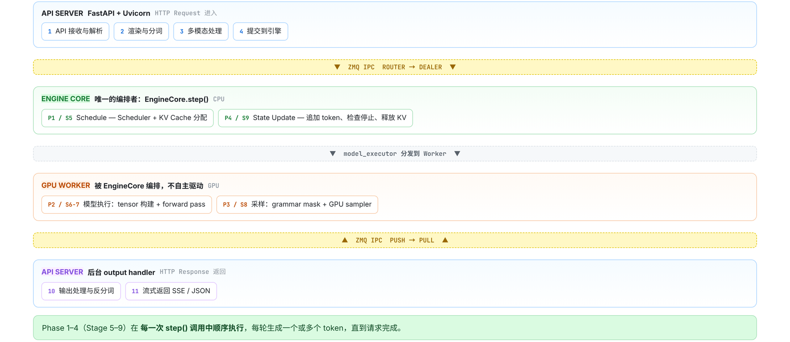

*Figure 1: The main cross-process path of a single request. Source: presentation slide 4.*

The regions in the diagram have the following responsibilities:

- The blue **API Server** receives HTTP requests and performs parsing, rendering, tokenization, multimodal processing, and engine submission. After results return, it also handles output processing, detokenization, and SSE or JSON response assembly.
- The green **Engine Core** orchestrates a single inference iteration. `EngineCore.step()` organizes Schedule, Model Execution, Sample, and State Update in sequence. As long as unfinished requests remain, the Core continues to the next iteration.
- The orange **GPU Worker** performs the device-side work arranged by the Core, including input-tensor preparation, model forward execution, and sampling. It does not drive the main loop autonomously.
- The yellow **ZMQ** layer provides inter-process communication between the API Server and the Engine Core. Requests enter the Core through `ROUTER → DEALER`, while outputs return to the API process through `PUSH → PULL`.
- The purple path represents results returning to the client after background output processing.

These arrows represent logical data flow only, not actual proportions of execution time. Box sizes also cannot be used to infer throughput, queue capacity, GPU memory usage, or data volume.

### What Each of the Three Loop Types Advances

An asynchronous generator is a calling pattern that can wait for new results and `yield` multiple times. It is well suited to expressing “one request receives output incrementally,” but not to performing global scheduling or directly controlling the GPU.

| Loop | Upstream producer | Consumption and output | Process |
|---|---|---|---|
| Per-request `generate()` | The shared output processor writes results to the request’s `RequestOutputCollector` | Retrieves `RequestOutput` from its dedicated collector and repeatedly `yield`s until the request finishes | API process |
| Shared Output Handler | The communication layer receives outputs returned by the Core over ZMQ and writes them to `outputs_queue` | Consumes `outputs_queue`, calls `process_outputs()`, and dispatches results to per-request collectors | API process |
| `run_busy_loop()` | Requests arrive through the Core’s ZMQ input channel | Processes control messages, invokes an engine step, and writes the iteration’s results to `output_queue` | Core process |

Several similarly named objects must be kept distinct:

- `output_queue` resides in the Core process and receives the current iteration’s Core output;
- `outputs_queue` resides in the API process and receives data returned across the process boundary;
- A `RequestOutputCollector` is created for each `request_id` and consumed by one `generate()` call.

Therefore, `generate()` neither reads ZMQ directly nor waits on the GPU directly.

Consider requests A and B arriving at the same time. The API side first creates a separate collector for each request and then submits both requests to the Core. The Core repeatedly executes `step()`. One iteration may advance A and B simultaneously and produce one or more tokens for each. The results pass through the Core’s `output_queue`, ZMQ, and the API’s `outputs_queue`, after which the shared Output Handler dispatches them by request. Only then do the `generate()` calls for A and B retrieve their respective results.

Even if A’s client consumes output slowly, the Core’s scheduling loop does not have to remain in the same call stack as A.

This produces the first central causal chain:

```text
Per-request interfaces require independent waiting
    ↓
Cross-request computation requires unified scheduling
    ↓
The GPU executes only after a batch plan has been formed
    ↓
Three execution boundaries and three loop types are decoupled through queues and ZMQ
```

Also note that the number of `step()` calls is not equal to the number of output tokens. A single `step()` may produce one or more tokens, and a request usually requires multiple iterations.

All implementation descriptions in this article are limited to vLLM `releases/v0.20.0` with `VLLM_USE_V2_MODEL_RUNNER=0`; the main GPU path uses `v1/worker/gpu_model_runner.py`. These conclusions cannot be applied directly to the V2 Model Runner and do not represent the actual process topology of every parallel deployment.

---

## II. Before a Request Enters the Engine: Rendering, Tokenization, and the Multimodal Branch

The `ChatCompletionRequest` accepted by `POST /v1/chat/completions` combines two fundamentally different categories of information:

| Information category | Typical fields | Transformation result |
|---|---|---|
| Content input | `model`, `messages`, and media entry points such as image, audio, and video | `EngineInput`, the model input that the engine can process |
| Generation configuration | `temperature`, `max_tokens`, stopping conditions, `logprobs`, `response_format` | `SamplingParams`, the generation and sampling policy |

Therefore, preparing a request for the engine involves more than “turning a string into tokens.” The API layer must split the protocol-facing request into two paths:

```text
Content and media → Renderer → EngineInput
Generation config → Parameter conversion → SamplingParams
```

Both are subsequently passed to `AsyncLLM.generate()`.

### The Respective Responsibilities of the Serving Layer and Renderer

The following diagram is worth examining first because it distinguishes two layers that are easy to conflate: which component orchestrates preprocessing, and which component actually performs rendering and input construction.

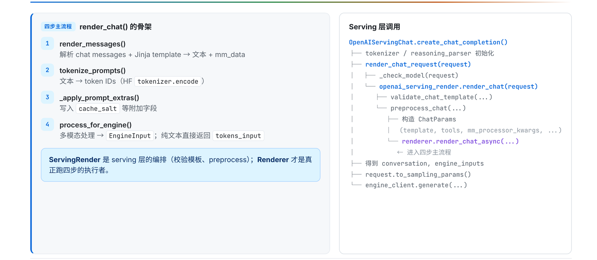

*Figure 2: The four-step rendering skeleton and its position in the Serving layer. Source: presentation slide 9.*

The responsibility chain on the right can be divided into four layers:

1. `ServingChat` receives `ChatCompletionRequest` and coordinates health checks, request rendering, and sampling-parameter conversion.
2. `ServingRender` validates the chat template and orchestrates chat preprocessing.
3. `Renderer` performs message rendering, tokenization, and engine-input construction.
4. `AsyncLLM` is the client-facing interface to the Engine Core, but it does not share the same execution boundary with the Engine Core.

`ServingRender` and `Renderer` are therefore not the same layer of abstraction. The former determines which template to use and how preprocessing is entered; the latter transforms the request’s concrete content into data consumable by the engine.

The Renderer’s logical process can be summarized in four steps:

| Step | Input | Primary behavior | Output or effect |
|---|---|---|---|
| `render_messages()` | `messages` | Normalizes messages and applies the Hugging Face chat template | `prompt` or `prompt_token_ids`, potentially including `mm_data` and `mm_uuids` |
| `tokenize_prompts()` | Text prompt or existing tokens | Invokes the tokenizer when encoding is required | Token IDs |
| `apply_prompt_extras()` | Tokenized prompt | Adds supplementary information such as `cache_salt` | Enriched prompt object |
| `process_for_engine()` | Tokens and optional multimodal data | Constructs input consumable by the engine | Plain-text `tokens_input` or multimodal input |

These names express a logical order. The actual entry points include asynchronous functions, so this sequence does not imply that all four steps are synchronous calls.

### How a Plain-Text Request Becomes `tokens_input`

Consider a minimal request:

```json
{
  "model": "example-model",
  "messages": [
    {"role": "user", "content": "Explain the KV Cache"}
  ],
  "temperature": 0.7,
  "max_tokens": 128
}
```

The content-side state progression can be condensed as follows:

```text
messages
  → prompt rendered with the chat template
  → prompt_token_ids
  → supplementary fields such as cache_salt are added
  → tokens_input
```

`render_messages()` first places the roles and content into the chat template associated with the model. If the output remains text, `tokenize_prompts()` then invokes the tokenizer to encode it. If upstream processing has already produced `prompt_token_ids`, this stage skips `tokenizer.encode()`.

`prompt` and `prompt_token_ids` represent optional paths and are not guaranteed to exist simultaneously.

Next, `apply_prompt_extras()` adds supplementary information such as `cache_salt`. When execution reaches `process_for_engine()`, if no multimodal data is detected, the Renderer packages the tokens as `tokens_input`, which the downstream engine can accept.

Meanwhile, configuration such as `temperature` and `max_tokens` does not enter the token-processing path. It is converted into a separate `SamplingParams` object. The Renderer “returning” here means only that preprocessing is complete; it does not mean that model inference has begun.

### Where Multimodal Requests Actually Branch

A multimodal request contains media such as images, audio, or video. The message-parsing stage can already carry this data, but plain-text and multimodal requests do not follow two completely independent pipelines beginning at the HTTP route.

The critical branch occurs in `process_for_engine()`:

```text
No multimodal data → tokens_input
Multimodal data present → _process_multimodal_async() → mm_input
```

The key point in the following diagram is not any particular media operator, but which parts of the transformation are handled by Hugging Face and which are handled by vLLM.

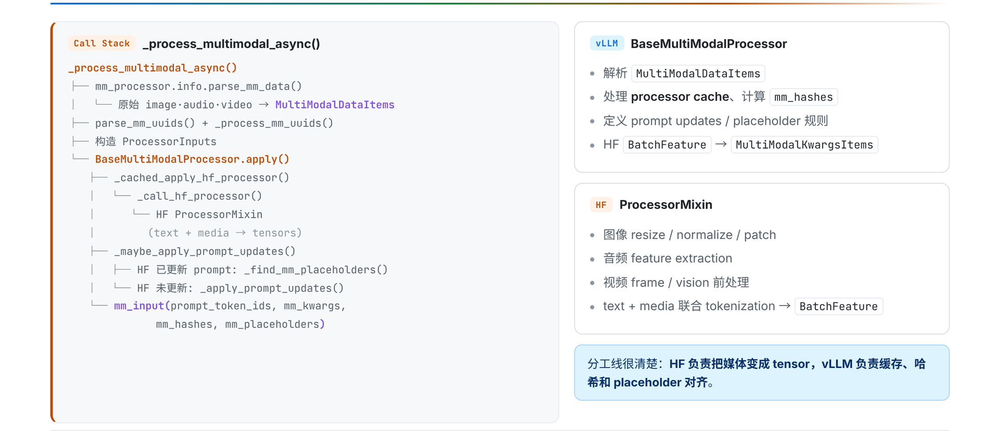

*Figure 3: Collaboration between vLLM BaseMultiModalProcessor and Hugging Face ProcessorMixin. Source: presentation slide 11.*

From left to right, the pipeline consists of five segments:

1. Raw images, audio, and video are parsed into `MultiModalDataItems`.
2. Multimodal UUIDs are parsed and processed, then combined with media data to form `ProcessorInputs`.
3. `BaseMultiModalProcessor.apply()` invokes Hugging Face `ProcessorMixin` under vLLM’s orchestration.
4. Hugging Face performs model-specific media preprocessing and joint text-plus-media tokenization, producing `BatchFeature`.
5. vLLM continues with caching, hashing, prompt updates, and placeholder alignment, then converts `BatchFeature` into `MultiModalKwargsItems`.

The responsibility boundary between the two processor types is:

- The Hugging Face processor knows the media preprocessing and joint tokenization required by the specific model.
- vLLM integrates the result into the inference service’s data structures, cache system, and prompt-alignment machinery.

Hugging Face does not independently construct the entire input outside vLLM. Its processor is still invoked and orchestrated by vLLM’s multimodal pipeline.

The resulting `mm_input` can be summarized through four representative fields:

- `prompt_token_ids`: prompt tokens after joint processing;
- `mm_kwargs`: media arguments consumed by the multimodal model;
- `mm_hashes`: hashes used in multimodal cache-related processing;
- `mm_placeholders`: mappings between media content and placeholder positions in the prompt.

This is only a field summary, not a complete type declaration for `EngineInput`. The source material also provides no media-tensor shapes, cache capacities, hit rates, or preprocessing latencies.

At this point, the HTTP request has merely become “computable”: its content has become engine input, and its generation options have become `SamplingParams`. The objects still reside on the API side; they have not crossed a process boundary, and no model forward execution has occurred.

---

## III. Establishing the Return Path Before Sending the Request: How Asynchronous Submission Routes Results

After input normalization, the system must solve another problem: a request executes across a process boundary, but its result must return precisely to the `generate()` coroutine that originated it.

The following diagram should be read from both sides: the left side shows request submission, while the right side shows output collection. The two paths share a `request_id` but do not share a synchronous call stack.

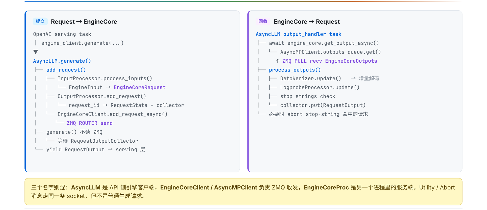

*Figure 4: Request submission and output collection are performed through two independent paths. Source: presentation slide 12.*

After the Serving layer calls `AsyncLLM.generate()`, the internal submission process performs the following steps in order:

1. `InputProcessor.process_inputs()` converts `EngineInput` into `EngineCoreRequest`.
2. `OutputProcessor.add_request()` creates a `RequestState` and a per-request `RequestOutputCollector` keyed by `request_id`.
3. Only then does `EngineCoreClient.add_request_async()` send the request to the Engine Core through ZMQ `ROUTER`.

The roles of four key data objects are as follows:

| Data object | Stage | Primary role | Representative contents |
|---|---|---|---|
| `EngineInput` | After API-side preprocessing | Aggregates rendered and tokenized engine input | Tokens, multimodal information, embeddings |
| `EngineCoreRequest` | Before cross-process submission | Request representation accepted by the Engine Core | Prompt, `SamplingParams`, multimodal features |
| `EngineCoreOutput` | When returned by the Engine Core | Carries newly generated results | Token IDs, finish reason, logprobs |
| `RequestOutput` | After API-side processing | Per-request result exposed to the Serving layer | Text, token IDs, logprobs, finished |

These fields are likewise only a summary of the data flow.

### Why the Collector Is Created First

`OutputProcessor.add_request()` creates the following for each request:

- `RequestState`: stores the per-request state needed for continued API-side output processing;
- `RequestOutputCollector`: the collector from which the corresponding `generate()` waits for and consumes results.

The minimal state progression is:

```text
Register request_id=r1
  r1 → RequestState(r1)
  r1 → collector(r1)

Send ADD(r1)
  → Engine Core

Core returns EngineCoreOutput(request_id=r1)
  → shared Output Handler
  → process_outputs()
  → collector(r1)
  → generate(r1) is awakened
  → yield RequestOutput
```

The control flow confirms that collector registration occurs before the ZMQ send. Therefore, a deterministic local routing target already exists before the Core can begin producing output.

Describing this design as “preventing output loss” is a reasonable inference from the control flow, not a conclusion backed by failure statistics in the source material. The material provides no out-of-order experiments, queue capacities, or related performance data.

If `r1` and `r2` exist simultaneously, they also do not each read from a separate ZMQ connection. An independent Output Handler receives all `EngineCoreOutputs`, processes them, and writes them to the corresponding collector by `request_id`. Adding concurrent requests creates additional per-request state and collectors, not a collection of competing ZMQ consumers.

### What Happens After a Request Enters the Core

`EngineCoreProc.run_busy_loop()` first processes control messages from the input channel:

- `ADD`: adds a new request;
- `ABORT`: cancels an existing request;
- `UTILITY`: an auxiliary operation not elaborated upon in the material.

Only after processing these messages does it invoke `_process_engine_step()`. An `ADD` request ultimately enters `waiting` through `Scheduler.add_request()`.

Entering `waiting` means only that the request is eligible for scheduling. It does not mean that the request will necessarily enter the current batch. Selection still depends on the token budget, sequence capacity, and KV Cache resources.

The following boundaries should always be kept distinct:

```text
Request across processes: ROUTER → DEALER
Output across processes: PUSH → PULL
Within the API process: outputs_queue
Within the Core process: output_queue
Per-request delivery: RequestOutputCollector
```

---

## IV. How the Scheduler Turns the Waiting Queue into the Current GPU Batch

`EngineCore.step()` repeatedly advances active requests, but it does not hand every queued request directly to the GPU in each iteration. It first calls `Scheduler.schedule()` to answer three mutually constrained questions:

1. Which requests should be selected for this iteration?
2. How many tokens should be computed for each request?
3. Is the KV Cache sufficient to support that computation?

A single `step()` can be condensed into four phases:

| Phase | Primary action | Artifact or state change |
|---|---|---|
| Schedule | Select requests and allocate token quotas and KV Cache blocks | `SchedulerOutput` |
| Model Execution | Prepare inputs and execute the model forward pass | Logits stored temporarily |
| Sample | Apply constraints and sample from the logits | `ModelRunnerOutput` |
| State Update | Append tokens, check stopping conditions, and update state | Releases the KV Cache on completion |

The scheduler only constructs the “execution plan for this iteration”; it does not execute the model computation itself.

### How RUNNING and WAITING Requests Enter the Same Batch

The key point in the following diagram is the relationship between its left and right sides: the left shows how the two request categories undergo resource checks, while the right shows how those decisions are materialized as `SchedulerOutput`.

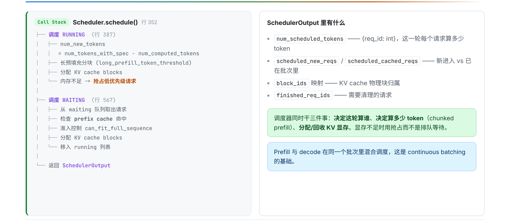

*Figure 5: The two request paths in `Scheduler.schedule()` and representative fields of `SchedulerOutput`. Source: presentation slide 16.*

`RUNNING` means that a request has entered the execution set; it does not mean the request can only be in the decode phase.

- **Prefill** is the computation phase that processes prompt tokens.
- **Decode** is the phase that uses existing context to generate additional tokens.

For a `RUNNING` request, the scheduler must:

1. calculate the number of tokens that can be scheduled in the current iteration;
2. split long prefill workloads;
3. allocate KV Cache blocks for the tokens about to be computed;
4. handle preemption when insufficient GPU memory blocks are available.

KV Cache blocks are partitioned resources that hold attention key-value caches. The material does not provide the block size, actual address layout, the value of `long_prefill_token_threshold`, preemption priorities, or recovery costs.

A `WAITING` request goes through the following process:

1. retrieve a candidate from the waiting queue;
2. check the prefix cache;
3. check sequence capacity;
4. allocate KV Cache blocks;
5. move the request into `running` if the conditions are satisfied.

Therefore, moving from `waiting` to `running` is not a simple first-in, first-out operation. The prefix cache, sequence capacity, and availability of KV Cache blocks all affect selection for the current iteration.

### How `SchedulerOutput` Describes the Execution Plan

| Field | Meaning in the current iteration |
|---|---|
| `num_scheduled_tokens` | Maps request IDs to token counts, representing each request’s computation quota for this iteration |
| `scheduled_new_reqs` | Requests newly entering the execution set in this iteration |
| `scheduled_cached_reqs` | Requests already in the execution set that continue participating in this iteration |
| `block_ids` | Mapping between requests and KV Cache blocks |
| `finished_req_ids` | Identifiers of completed requests whose state must be cleaned up |

Downstream components do not need to rescan the waiting queue or independently decide how many tokens each request should compute. They only need to execute the request classifications, quotas, and block mappings already determined by the Scheduler.

These are still representative fields, not a complete type definition.

### A Minimal Scheduling Example with Three Requests

Suppose three requests are currently present:

| Request | State before scheduling | Current phase | Result for this iteration |
|---|---|---|---|
| A | `RUNNING` | decode | Receives a quota and continues execution |
| B | `WAITING` | prefill | Passes cache, capacity, and KV checks and moves into `running` |
| C | `WAITING` | prefill | Remains waiting because insufficient KV Cache blocks are available |

The current `SchedulerOutput` contains both A and B:

- A is a request already in the execution set.
- B is a request newly added in this iteration.
- Both receive quotas in `num_scheduled_tokens`.
- `block_ids` records the KV Cache blocks they use in this iteration.
- C does not satisfy the resource conditions and therefore does not enter model execution in this iteration.

The same batch can consequently contain A’s decode work and B’s prefill work.

**Continuous batching** means that requests at different lifecycle stages can jointly form the current batch. The GPU does not have to wait for every request in an entire batch to finish prefill before they all enter decode together.

The material does not provide the global token budget, specific quotas, batch size, or number of KV blocks. What can be confirmed here is the structural mechanism, not the percentage of throughput improvement.

### How the KV Cache Forms a Cross-Iteration Feedback Loop

```text
Phase 1: Schedule requests and allocate blocks
    ↓
Phases 2/3: Execute the forward pass and sample
    ↓
Phase 4: Release blocks when requests finish
    ↓
Next iteration, Phase 1: Continue scheduling based on newly available capacity
```

If resources are insufficient in Phase 1, the scheduler may preempt a request and return it to `waiting`. When a request finishes in Phase 4, it releases its KV Cache allocation, changing the capacity available in the next iteration.

Continuous batching therefore means more than “combining requests.” It depends jointly on scheduling decisions, the KV Cache lifecycle, and persistent state across iterations.

---

## V. From `SchedulerOutput` to Logits: Inside GPUModelRunner Execution

The scheduler only describes “what to compute in this iteration.” Before actual execution, the discrete requests, token quotas, and KV block mappings must be transformed into batched tensors that the GPU can consume.

First consider the following three-layer responsibility diagram, because Worker, GPUModelRunner, and Model are often loosely grouped together as the “model execution layer,” even though they manage entirely different kinds of state.

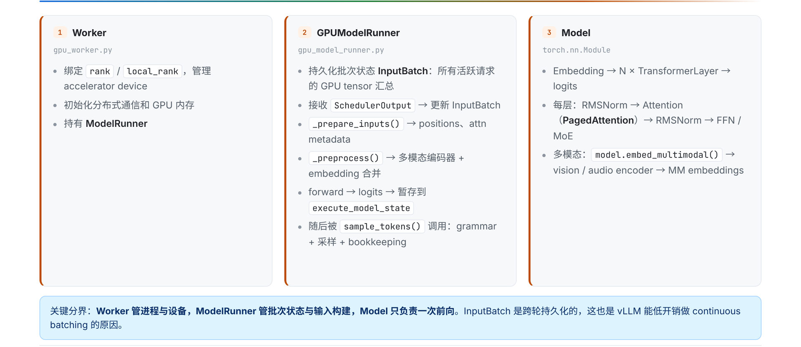

*Figure 6: Three components and their call relationships during model execution. Source: presentation slide 17.*

| Component | Objects held or managed | Core responsibility | What it does not handle |
|---|---|---|---|
| Worker | Rank, device, distributed communication, GPU memory, ModelRunner | Establishes the device and parallel execution environment | Does not directly organize request batches |
| GPUModelRunner | Persistent `InputBatch`, execution state | Updates batch state, constructs inputs, processes multimodal data, invokes the forward pass, and connects it to sampling | Does not implement layer-by-layer Transformer computation |
| Model | Network layers and model parameters | Performs one model forward pass | Does not manage scheduling, request lifecycles, or sampling |

“Model performs only one forward pass” describes a responsibility boundary; it does not mean a request executes only one forward pass. After entering decode, a request usually spans multiple `step()` calls. Each iteration may form a new batch and invoke the Model once.

### Why `InputBatch` Persists Across Iterations

`InputBatch` aggregates the GPU state corresponding to currently active requests and persists across iterations. Its role can be understood by observing the state progression of two requests:

| Time | Request A | Request B | Change to `InputBatch` |
|---|---|---|---|
| Start of iteration \(k\) | In decode | Not yet executing | Retains A |
| After scheduling in iteration \(k\) | Continues decode | Newly admitted and executing prefill | Adds B while retaining A |
| Iteration \(k+1\) | Retained if unfinished; removed if finished | Enters decode or continues prefill | Removes completed entries and retains all other active entries |

A new request can be added without discarding existing decode requests, and a completed request does not continue occupying active batch state. The “retain, add, remove” behavior of `InputBatch` allows the batch to change with each scheduling iteration.

### How `execute_model()` Materializes the Scheduling Result

The following diagram should be read as a call tree: the left side shows persistent-state and input-tensor updates, while the right side shows multimodal encoding and the two forward-execution branches.

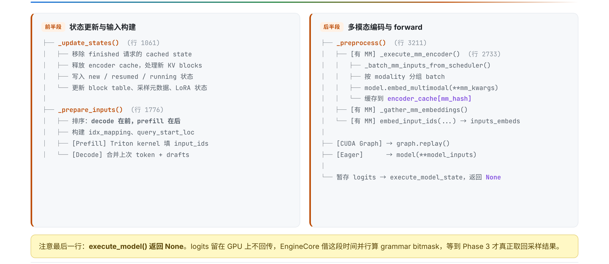

*Figure 7: The `execute_model()` call tree from state updates to temporarily stored logits. Source: presentation slide 18.*

The main path can be summarized as:

```text
SchedulerOutput
  → _update_states()
  → _prepare_inputs()
  → _preprocess()
  → Model forward
  → execute_model_state
```

First, `_update_states()` materializes the scheduling result in GPUModelRunner’s persistent state. It:

- cleans up cached state for completed requests;
- updates the KV block table;
- updates sampling metadata;
- updates LoRA state;
- handles newly created, resumed, or continuing requests;
- cleans up the corresponding encoder-cache state.

Therefore, `SchedulerOutput` is not passed directly to the Model. It first changes GPUModelRunner’s understanding of the current active batch.

Second, `_prepare_inputs()` constructs the inputs that actually participate in the current iteration’s computation. The batch layout given by the material is:

```text
decode first, prefill second
```

It also constructs auxiliary tensors such as `idx_mapping` and `query_start_loc`. This ordering does not imply that prefill and decode must execute in two separate forward passes; they can still be part of a single model invocation.

The two input types are prepared differently:

- Prefill uses a Triton kernel to populate `input_ids`.
- Decode combines the previous token with draft tokens.

The latter corresponds to candidate tokens carried across iterations by speculative decoding. The material provides no Triton kernel configuration, thread organization, tensor shapes, or related performance data.

Returning to the two-request example: in iteration \(k\), A’s decode input occupies the front of the batch, while B’s prefill input occupies the back. Auxiliary index tensors describe the query boundaries of the individual requests. Requests at different lifecycle stages can thus share one batched forward pass without losing their respective sequence boundaries.

### How Multimodal Embeddings Enter the Main Model

If a request contains multimodal content, GPUModelRunner groups it by modality and invokes:

```python
model.embed_multimodal(**mm_kwargs)
```

The encoded result is written to `encoder_cache` under the `mm_hash` key. The system then gathers the required multimodal embeddings, merges them into `inputs_embeds`, and passes them to the language-model backbone.

Two kinds of cache must not be conflated here:

- `encoder_cache` stores multimodal encoding results.
- The KV Cache stores historical key-value state from autoregressive attention computation.

The material shows only the `encoder_cache[mm_hash]` indexing relationship. It does not specify the hash algorithm, collision handling, cache capacity, or eviction policy.

### Two Forward Paths and One Logits Destination

Once input preparation is complete, model forward execution selects one of two paths:

- The CUDA Graph path calls `graph.replay()`.
- The eager path calls `model(**model_inputs)`.

These are alternative branches, not two stages executed sequentially in the same iteration.

The logits produced by the forward pass are not returned directly by `execute_model()`. Instead, they are stored temporarily in `execute_model_state`; on this path, `execute_model()` returns `None`.

This is a staged interface contract:

```text
execute_model() returns None
≠ no computation result exists

Actual meaning:
logits remain in execution state until sample_tokens() consumes them
```

When model execution is submitted non-blockingly, the CPU can simultaneously prepare the grammar bitmask required for structured output. Sampling then waits for GPU completion through `future.result()`. However, the diagram in the material has no time scale and provides no overlap duration, so no performance gain can be calculated from it.

---

## VI. From Logits to State Transitions: How Sampling Closes a `step()`

At the end of model forward execution, the system has logits—the scores of candidate tokens in the vocabulary. Closing a `step()` requires three additional actions:

1. Modify the candidate space according to request configuration and grammar constraints.
2. Select a token from the processed logits.
3. Write the token back into request state and decide whether the request should enter another iteration.

### How Logits Become Tokens

The following diagram should be read in arrow order while keeping two branching relationships in mind: grammar and logits processors modify scores first, while random sampling and greedy decoding are alternative paths.

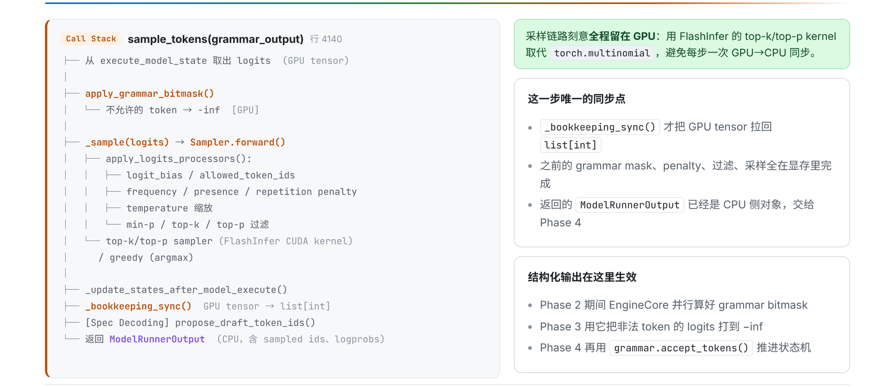

*Figure 8: Sampling, synchronization, and output formation. Source: presentation slide 19.*

The path can be condensed as:

```text
execute_model_state.logits
    → grammar bitmask
    → logits processors
    → top-k/top-p or greedy/argmax
    → _bookkeeping_sync()
    → ModelRunnerOutput
```

`sample_tokens()` first retrieves the logits stored on the GPU. If a request includes structured-output constraints, the system applies a **grammar bitmask**: the current grammar state produces a token-availability mask, and the logits of invalid tokens are set to negative infinity.

Consider three abstract candidates:

| token | Original logit | Allowed by grammar | Constrained logit |
|---|---:|---|---:|
| A | 4.2 | Yes | 4.2 |
| B | 5.1 | No | \(-\infty\) |
| C | 3.7 | Yes | 3.7 |

B originally had the highest score, but after being forbidden by the grammar, it can no longer be sampled. The constraint is not a post hoc validation of the final text; it changes the candidate set before sampling.

Next, `apply_logits_processors()` continues processing the scores. The categories listed in the material include:

- `logit_bias`;
- `allowed_token_ids`;
- frequency, presence, and repetition penalties;
- temperature;
- min-p;
- top-k;
- top-p.

Not every request enables every processor.

After processing, execution enters one of the sampling branches:

- Random sampling can use FlashInfer’s top-k/top-p GPU kernel.
- Deterministic generation uses greedy/argmax.

These are alternative paths.

`_bookkeeping_sync()` then converts GPU tensors into a CPU-side `list[int]`, producing a `ModelRunnerOutput` that contains sampled IDs and optional `logprobs`. The material calls this the only synchronization point in the `sample_tokens()` path. That conclusion cannot be extended into a claim that “the entire request lifecycle contains only one CPU/GPU synchronization.”

### How the Scheduler Advances Request State

After obtaining the sampled IDs, `Scheduler.update_from_output()` performs the following steps:

1. appends the sampling result to `request.output_token_ids`;
2. checks EOS, `max_tokens`, and `stop_token_ids`;
3. invokes `grammar.accept_tokens()` for structured output;
4. if the request has finished, releases its KV Cache and generates an `EngineCoreOutput`.

For structured output, the bitmask and `accept_tokens()` drive state transitions in opposite directions:

```text
Grammar state G0
  → compute mask(G0)
  → mask invalid tokens
  → sample token A
  → grammar.accept_tokens(A)
  → grammar state G1
```

The current grammar state determines which tokens can be selected in this iteration; the sampled token determines the grammar state of the next iteration.

Stopping logic is distributed across two execution boundaries:

- The Engine Core handles EOS, `max_tokens`, and `stop_token_ids`.
- The API side checks stop strings after detokenization and may send an abort to the Core only when a stop string matches.

Therefore, completion of token-level stop checks in the Core does not mean that every string-level stopping condition has also been processed.

### Why Structured Output and Speculative Decoding Are Not Local Switches

The following diagram should be read by comparing the two paths: structured output spans request parameters, constraints, and grammar state, while speculative decoding spans adjacent iterations.

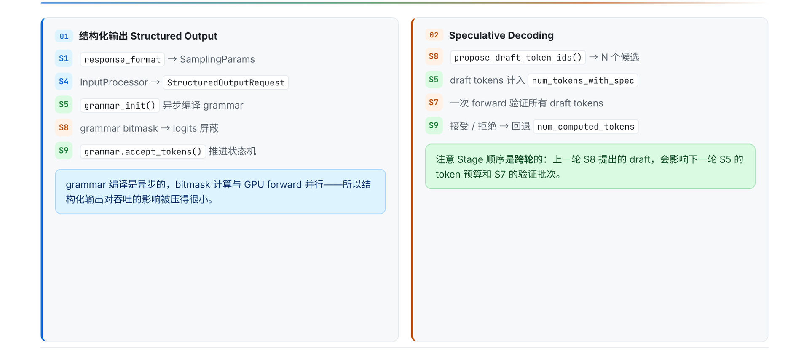

*Figure 9: Where structured output and Speculative Decoding appear in the pipeline. Source: presentation slide 25.*

Structured output begins with `response_format`:

```text
response_format
  → SamplingParams
  → StructuredOutputRequest
  → asynchronous grammar initialization
  → grammar bitmask constrains logits
  → grammar.accept_tokens() advances state
```

It is not a single Boolean switch on the sampler, but a path extending from API request semantics to per-token state transitions.

**Speculative Decoding** has cross-iteration dependencies:

```text
Previous iteration: propose draft tokens
                         ↓
Next iteration: include drafts in the token budget
                         ↓
                validate candidates in one forward pass
                         ↓
                accept or reject them and correct computation state
```

The critical element is the arrow from one iteration to the next. Once draft tokens have been generated, their complete semantics cannot be resolved independently within the current sampling function. In the next iteration, the Scheduler must account for them in the budget, the model forward pass must validate them, and state update must decide whether to accept or reject them and adjust `num_computed_tokens` accordingly.

Therefore, describing speculative decoding merely as a “faster sampler” omits the state required for correctness: pending drafts, the next iteration’s budget, validation results, and corrections to computation progress.

The material provides no draft count, acceptance rate, fallback formula, or reproducible acceleration data. Only the cross-iteration mechanism can be confirmed here.

---

## VII. From Tokens Back to Text: How the Shared Output Loop Serves Per-Request Responses

After token IDs have been produced, the client still cannot see text. The Core’s batched results must cross back into the API process, undergo incremental detokenization and string-based stopping checks, and then be routed per request.

The return path is:

```text
EngineCoreOutputs
  → Core output_queue
  → ZMQ PUSH / msgpack
  → ZMQ PULL
  → API outputs_queue
  → process_outputs()
  → RequestOutputCollector
  → AsyncLLM.generate()
```

The Engine Core first writes results into its own process-local `output_queue`, then sends them over ZMQ to the API process’s `outputs_queue`. The shared Output Handler consumes all these outputs. After processing, it dispatches each result to the corresponding collector according to `request_id`.

The following diagram should be read from left to right: the left side shows how tokens become `RequestOutput`, while the right side shows the default and fallback paths for incremental detokenization.

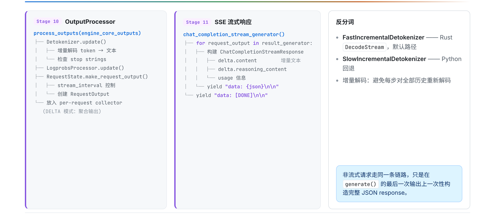

*Figure 10: Output is updated from tokens into per-request results and then packaged as a streaming response; the right side shows the default and fallback detokenization paths. Source: presentation slide 22.*

### Stage 10: From Newly Generated Tokens to `RequestOutput`

`process_outputs()` performs four key tasks:

| Step | Purpose |
|---|---|
| `Detokenizer.update()` | Incrementally detokenizes newly generated tokens |
| `LogprobsProcessor.update()` | Updates the relevant output when the request asks for `logprobs` |
| Stop-string check | Evaluates string-based stopping conditions after text becomes available |
| `RequestState.make_request_output()` | Combines text, completion state, and optional information into `RequestOutput` |

Incremental detokenization does not decode the complete token history again in every iteration. The default path uses `FastIncrementalDetokenizer`, backed by the Rust `DecodeStream`; when unavailable, it falls back to the Python `SlowIncrementalDetokenizer`.

Suppose the cumulative token sequence over three iterations is:

| Iteration | Cumulative sequence | Newly added in this iteration |
|---|---|---|
| 1 | `[t₁]` | `t₁` |
| 2 | `[t₁,t₂]` | `t₂` |
| 3 | `[t₁,t₂,t₃]` | `t₃` |

In the third iteration, the system processes the newly added `t₃` using the existing decoding state rather than starting over from `t₁`. The material provides no performance comparison between the fast and slow paths and does not elaborate on the specific buffering rules of `stream_interval`.

String-based stopping conditions can be evaluated only after text is available. Therefore:

```text
stop_token_ids → checked by token on the Core side
stop strings   → checked after detokenization on the API side
```

When a stop string matches and the request in the Core still needs to be terminated, the API side may send an abort. It would be incorrect to say that every completed request triggers a reverse cancellation.

After processing, the `RequestOutput` is placed in the corresponding collector. `AsyncLLM.generate()` consumes only its own collector: it continues to `yield` while the request is unfinished and exits after completion.

### Stage 11: Where Streaming and Non-Streaming Paths Diverge

The streaming path converts each `RequestOutput` into a `ChatCompletionStreamResponse` and then encodes it as a `data` frame in Server-Sent Events (SSE).

Response deltas can include `content`, `reasoning_content`, and optional `usage`. The following illustrates only the general shape and is not a complete set of fields:

```text
data: {"delta":{"content":"The system"}}

data: {"delta":{"content":" has completed"}}

data: [DONE]
```

`[DONE]` indicates the end of the SSE stream.

A non-streaming request does not bypass the preceding inference, cross-process return, or output-processing path. It consumes the results from `generate()` in the same way, but assembles the complete JSON only after the final output arrives.

Thus, streaming and non-streaming share the same primary generation path and differ mainly at the final response-assembly boundary:

```text
The same RequestOutput stream
  ├─ Streaming: package each result as SSE
  └─ Non-streaming: wait for the final output, then assemble JSON
```

The material does not elaborate on error frames, disconnection behavior, the complete chunk format, queue capacities, or communication latency.

---

## VIII. Constraints Beyond the Main Path: Cancellation, LoRA, Multiple GPUs, and Evidence Boundaries

The main loop is not driven solely by token generation. Cancellation changes when a request exits, LoRA changes batch admission and graph-specialization conditions, and parallel topology changes both Worker collaboration and routing across EngineCore instances.

### Why Abort Cannot Interrupt the Current Forward Pass

The following diagram should be examined across the API, Core, and Worker layers to understand cancellation messages. The LoRA path on the right shows how one request parameter can affect both the Scheduler and GPU execution conditions.

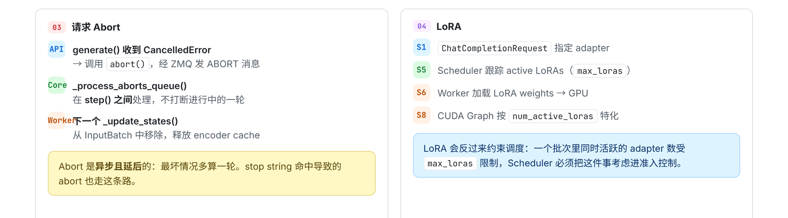

*Figure 11: How request cancellation and LoRA constrain the main loop. Source: presentation slide 26.*

The cancellation path is:

1. The API layer’s `generate()` catches `CancelledError`.
2. The API calls `abort()` and sends `ABORT` over ZMQ.
3. The Engine Core processes the cancellation between two `step()` calls.
4. The Worker removes the request from the persistent `InputBatch` and cleans up the corresponding encoder cache during the next `_update_states()`.

Abort is therefore an asynchronous control message, not a preemptive GPU interrupt.

If request R is canceled in the middle of the current forward pass, the current device execution does not stop immediately. If the message misses the current iteration’s state-processing point, R may execute for at most one additional iteration before being removed from the batch. This is an upper bound implied by the flow; it does not mean every cancellation executes an extra iteration, nor can it be converted into a fixed duration.

### How LoRA Enters Scheduling and Execution Conditions

A LoRA (Low-Rank Adaptation) adapter enters the system through `ChatCompletionRequest`:

```text
Request specifies an adapter
  → Scheduler tracks active LoRAs
  → constrained by max_loras
  → Worker loads the corresponding weights onto the GPU
  → CUDA Graph is specialized by num_active_loras
```

The following can be confirmed:

- Active LoRAs participate in the Scheduler’s batch constraints.
- The number of simultaneously active adapters is limited by `max_loras`.
- The Worker handles device-side weight loading.
- CUDA Graph specialization conditions include the number of active LoRAs.

The material does not provide the value of `max_loras`, loading latency, GPU memory cost, or performance impact. Specialization by the number of active adapters also does not mean that each adapter name necessarily corresponds to a separate graph.

### What TP, PP, and DP Change

The following diagram should be read as two categories of problems: TP and PP concern how a group of Workers collaboratively completes the same forward pass, while DP introduces multiple EngineCore instances and request routing.

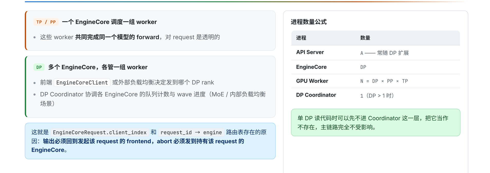

*Figure 12: Parallel topologies, process counts, and request-routing state. Source: presentation slide 27.*

Under Tensor Parallelism (TP) and Pipeline Parallelism (PP), one EngineCore manages a group of Workers that collaborate on the same model forward pass. The intra-group partitioning is transparent to the frontend request, whose routing target remains that EngineCore.

With Data Parallelism (DP), multiple EngineCore instances exist, and each EngineCore manages a group of Workers. The EngineCoreClient or an external load balancer must first select the target DP rank.

The relationship for the number of GPU Workers given by the material is:

\[
N = DP \times PP \times TP
\]

Here, \(N\) denotes the number of GPU Workers. For example, when \(DP=2\), \(PP=1\), and \(TP=4\), the formula yields 8 Workers.

This cannot be extended into the claim that “8 physical GPUs are required,” because the material does not establish that Workers and physical GPUs always have a one-to-one correspondence. The number of API Servers is denoted by \(A\), but the material also provides no fixed relationship between \(A\) and DP.

When `DP>1`, a DP Coordinator also exists to coordinate queue counts and wave progress rather than directly executing model forward passes.

DP routing must preserve two kinds of state:

- `EngineCoreRequest.client_index`: identifies the frontend to which output should return;
- the `request_id → engine` routing table: records which EngineCore actually owns each request.

The former supports output delivery, while the latter ensures that an abort is sent to the correct DP rank. These states do not solve model-computation problems; they solve request-ownership problems in a multi-EngineCore environment.

### Evidence Boundaries and Source-Code Reading Order

This article can confirm the mechanisms and their potential implications:

- Abort may allow a canceled request to execute for at most one additional iteration.
- LoRA adds batch-admission constraints, GPU weight loading, and CUDA Graph specialization conditions.
- TP and PP change how Workers collaborate on a forward pass.
- DP adds EngineCore selection, output-return routing, and cancellation-routing state.

However, the material provides no hardware, model, batch, degree of parallelism, workload, end-to-end latency, throughput, GPU memory usage, or benchmark methodology. It therefore cannot support a definitive speedup or performance-benefit claim.

Statements in the Q&A that speculative decoding is “close to three times faster” or “approximately 2.7” lack the model, hardware, candidate count, acceptance rate, and test methodology. They should be treated only as low-confidence verbal information and are excluded from this article’s performance conclusions.

To verify the analysis against the source code, read in the following order:

1. the process boundaries among the API Server, Engine Core, and GPU Worker, including both ZMQ endpoints;
2. Chat Completions request parsing and the Renderer;
3. `EngineCore.step()`;
4. the Scheduler’s `schedule()` and `update_from_output()`;
5. `GPUModelRunner.execute_model()` and `sample_tokens()`;
6. `OutputProcessor`, the Detokenizer, and the SSE generator.

Source-code line numbers change between versions. Function names and data flow are the primary navigation anchors; line numbers shown in the presentation should not be treated as a stable API.

---

## Conclusion: One Chat Generation Is a Cross-Iteration Protocol

- A chat request is not a synchronous function call. It is a multi-iteration protocol maintained jointly by three execution boundaries—the API Server, Engine Core, and GPU Worker—along with shared channels and per-request state.

- The API Server first performs chat-template rendering, tokenization, and optional multimodal processing, then separately creates engine input and `SamplingParams`. This stage determines which information is visible to downstream scheduling and execution.

- `OutputProcessor` creates `RequestState` and `RequestOutputCollector` before sending the request. The shared receiver uses them to route results by `request_id`, while `AsyncLLM.generate()` consumes only its own collector.

- `EngineCore.step()` closes one iteration through Schedule, Model Execution, Sample, and State Update. `SchedulerOutput` and the persistent `InputBatch` allow prefill and decode to enter the current batch together.

- `execute_model()` returning `None` does not mean that no result exists. Logits are stored in `execute_model_state`; only after subsequent sampling are CPU-side outputs formed at the synchronization point described by `_bookkeeping_sync()`.

- Structured output constrains the candidate tokens in each iteration through grammar state. Speculative decoding carries draft tokens into the next iteration’s budget, forward validation, and state correction, giving it an explicit cross-iteration dependency.

- The shared Output Handler receives outputs centrally, incrementally detokenizes them, checks stop strings, and dispatches them to per-request collectors. Streaming SSE and non-streaming JSON reuse the same primary inference and output path.

- Cancellation, LoRA, and DP/TP/PP are not isolated peripheral features. They constrain the main loop through cross-iteration state cleanup, batch admission, device-side weights, graph specialization, and request routing.

## Explicit Limitations

All implementation conclusions in this article apply only to the analyzed vLLM `releases/v0.20.0` material with `VLLM_USE_V2_MODEL_RUNNER=0`. The function responsibilities and execution relationships described here cannot be generalized directly to the V2 Model Runner or other versions.

The stages, boxes, and arrows in the source material represent logical relationships only and do not encode time proportions. The available evidence also lacks sufficient information about hardware, models, batch sizes, sequence lengths, degrees of parallelism, and workload conditions. Consequently, this article makes no quantitative performance guarantees regarding throughput, latency, GPU memory usage, CUDA Graphs, FlashInfer, structured output, or speculative decoding.
