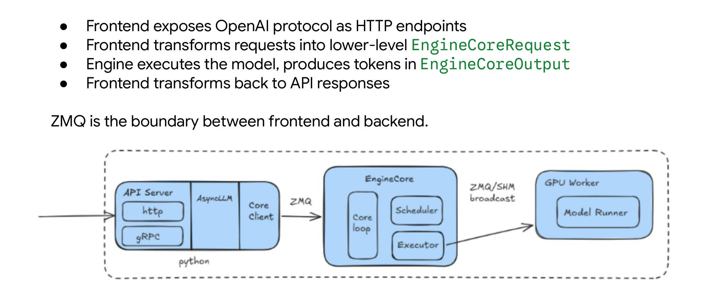
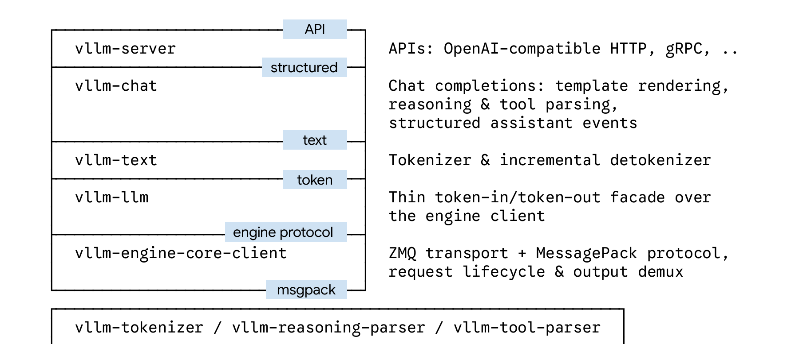
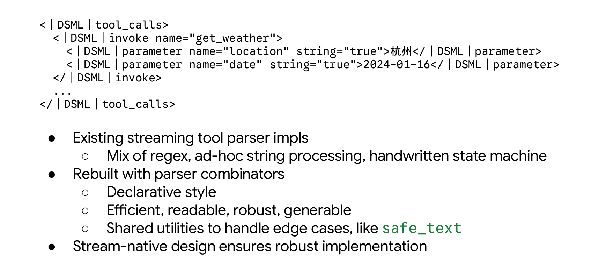
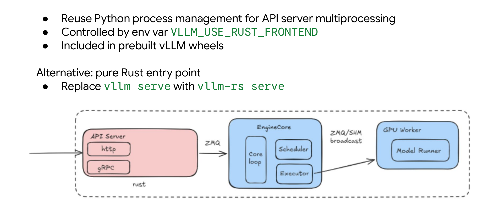

# 突破 Python 性能瓶颈：vLLM Rust 前端架构演进与核心原理解析

**从 ZMQ 边界设计到 Stream-Native 流式处理的高并发大模型推理实践**

**原视频**：[Rust 前端重构](https://www.bilibili.com/video/BV19fJJ6AE6W) · **配套资料**：[vLLM Rust Frontend Introduction](https://drive.google.com/file/d/14cm6XyvY4dQjuBeY2pCn28macviA4PWx/view)

GPU 的推理算力每代翻倍，模型服务的吞吐上限却开始被另一个瓶颈卡住——运行在 Python 中的 API Server 前端。vLLM 团队给出的破局方案是：以 ZeroMQ 消息边界为切口，将 CPU 密集型的前端层整体迁移到 Rust，同时保持 Python GPU 引擎一行不动。本文从工程矛盾出发，逐层拆解这一架构演进的设计动因、分层结构、流式原生范式、工具解析机制、部署路径与极端并发下的实测数据，并明确当前的功能边界与未来方向。

---

**适读人群**　具备一定大模型部署经验，熟悉 Python 且对系统性能优化和高并发架构感兴趣的后端或 AI 工程师。

**前置知识**

- 了解大模型推理的基本流程（Tokenization → 推理 → Detokenization）
- 熟悉 Python GIL 对并发性能的影响及多进程架构的局限性
- 了解基本的进程间通信（IPC）与 ZeroMQ 概念

**阅读目标**

1. 理解 vLLM 引入 Rust 前端的工程背景与核心矛盾
2. 掌握基于 ZMQ 的前后端分离架构设计及其优势
3. 理解 Stream-Native 架构在处理流式输出时的单一数据源原则
4. 获取在极端并发场景下的性能基准数据及适用边界

---

## 一、矛盾显现：GPU 算力溢出与 Python 前端瓶颈

**本节核心问题：** 当 GPU 侧的推理延迟持续降低、吞吐持续攀升时，系统的性能天花板会转移到哪里？

### 前端做的事情远超一个 HTTP 转发层

许多人对 vLLM 前端的第一印象是"接收请求、透传给引擎"。实际上，随着模型种类和应用场景的膨胀，前端承担的 CPU 密集型职责已经相当厚重。下表列出了前端在一次典型 Chat Completions 调用中需要完成的工作：

| 阶段 | 典型操作 | CPU 密集特征 |
|------|---------|-------------|
| **API 层** | Schema 校验、错误处理、SSE（Server-Sent Events，服务端推送事件）流式分块 | 字符串解析与序列化 |
| **输入处理** | 应用 Chat Template 将结构化对话展平为字符串；Tokenization（分词）；多模态图片加载与预处理 | 每个模型有独立模板与参数，需逐请求执行 |
| **输出处理** | 增量 Detokenization（将引擎返回的 raw token 逐步还原为文本）；Stop String 检测；按模型特定语法提取 Tool Call 并结构化 | 高频逐 Token 循环，不同模型走不同的 Tool Call Parser |
| **运维功能** | 请求生命周期管理、取消处理、跨 Data-Parallel rank 的负载均衡路由、Metrics 采集 | 涉及全局状态协调 |

关键观察：**上述几乎每一项都是纯 CPU 运算**，而非等待 GPU 的空闲 I/O。当并发请求增多时，这些工作会密集争抢 CPU 时间。

### 因果链：GPU 越快，Python 越吃力

1. **GPU 推理加速**——硬件厂商与引擎侧持续优化，Token 间延迟不断降低，可支撑的吞吐不断增高。
2. **前端压力同步上升**——引擎每秒产出更多 Token，前端就必须以更高频率执行 Detokenization、Tool Call 解析、SSE 分块等操作。
3. **Python 固有限制被放大**——三个特性在此场景下形成叠加瓶颈：
   - **GIL**（Global Interpreter Lock，全局解释器锁）：同一时刻只有一个线程执行 Python 字节码，并发处理请求时无法真正并行。
   - **动态类型（Dynamic Typing）**：运行时类型检查带来额外开销，高频循环在解释执行下存在显著性能劣势。
   - **GC**（Garbage Collection，垃圾回收）：不可预测的暂停使高并发下的尾延迟难以控制。
4. **Multi-processing 绕路的代价**——为突破 GIL，Python 通常依赖多进程方案。但多进程意味着独立的内存空间、进程间通信开销，以及更复杂的状态协调逻辑——这本身就是一笔不小的"架构税"。

与之形成对比的是 Rust：**无 GIL、无 GC，可在单进程内实现高并发，内存管理在编译期确定**，这些特性天然适合高吞吐前端场景。

### 不只是速度：Agentic 时代对正确性的要求

性能并非唯一驱动力。当今的 LLM 工作负载已从简单问答转向 **Agentic 场景**——长对话、多轮 Tool Call、Structured Output（结构化输出）。在 Agent 循环中，前端的任何细微错误（类型不匹配、Tool Call 解析遗漏、流式输出截断）都会中断整条执行链，且难以从外部恢复。

Python 的弱类型特性使得许多低级错误只能在运行时暴露；Rust 的编译器以严格著称，大量此类问题在编译期即被拦截。与此同时，AI 辅助编码工具的成熟大幅降低了 Rust 的上手门槛——早期坚持 Python 的核心理由是"降低贡献者门槛"，而今这一权衡已发生逆转：**当贡献者可以借助 AI 高效编写 Rust 时，编译期的严格检查反而成为大型社区协作的质量护栏。**

### 小结

Python 前端在 vLLM 早期发展中发挥了巨大作用，其生态亲和力是项目快速壮大的关键因素。当前的瓶颈并非在所有负载下都已显现，而是一个随 GPU 算力增长和前端职责膨胀而不断逼近的上限。Rust 重写的范围被严格限定在前端侧——引擎和 GPU 侧依然运行成熟的 Python 代码，不受影响。

既然 Python 前端已成为瓶颈，如何在不破坏现有成熟 Python GPU 推理引擎的前提下进行替换？

---

## 二、架构破局：基于 ZMQ 的前后端物理隔离

**本节核心问题：** 如果前后端代码耦合在同一个进程、同一种语言里，语言替换几乎不可能干净完成。vLLM 用什么机制把前端与后端拆开？

### 全景架构

下面这张图展示了 vLLM 整体服务栈在部署态下的三层组件关系与通信边界，是理解后续所有设计的基础。


*图注：vLLM Serving Stack 分层结构。来源：演讲 PPT 第 3 页。*

图中从左到右依次呈现三个层次：

| 层次 | 组件 | 所属进程 | 主要职责 |
|------|------|----------|----------|
| **前端** | API Server：HTTP/gRPC Endpoint → AsyncLLM → Core Client | 独立进程 | 暴露 OpenAI 兼容接口，将结构化请求转为底层 `EngineCoreRequest` |
| **后端** | EngineCore：Core Loop → Scheduler → Executor | 独立进程 | 管理 KV Cache、调度请求、驱动模型前向推理 |
| **GPU 工作节点** | GPU Worker → Model Runner | 可跨节点 | 执行实际的模型计算，生成 Token |

连接前端与后端的箭头标注为 **ZMQ**（ZeroMQ，高性能异步消息库）；连接 EngineCore 与 GPU Worker 的箭头标注为 **ZMQ / SHM broadcast**。三个层次运行在不同进程甚至不同机器上，彼此通过序列化消息交互，而非共享内存地址空间中的函数调用。

### 因果链：ZMQ 如何使语言替换成为可能

1. **引入 ZMQ 消息队列** → 前端与后端不再共享 Python 解释器、不再共用 GIL。
2. **建立进程间通信边界** → 前后端的唯一契约退化为两种消息格式：`EngineCoreRequest`（前端→后端）和 `EngineCoreOutput`（后端→前端）。
3. **契约与实现语言无关** → 只要新前端能正确构造和解析这两种消息，后端完全不需要知道前端是 Python 还是 Rust。
4. **后端 Python GPU 引擎原封不动** → 替换工作的 scope 被严格限制在 ZMQ 边界的左侧。

在本地部署场景下，ZMQ 使用 IPC 协议，延迟极低；在分布式部署场景下则切换为 TCP，保持同一套消息格式不变。

### 状态演进：一次请求的生命周期

以 `/v1/chat/completions` 为例，请求在 ZMQ 边界两侧的流转过程如下：

```
用户 HTTP 请求
    │
    ▼
[前端] API Server 接收 JSON，校验 Schema，
       应用 Chat Template 展平为 prompt
    │
    ▼
[前端] Core Client 封装为 EngineCoreRequest
    │
    ▼
  ──── ZMQ (IPC / TCP) ────
    │
    ▼
[后端] Core Loop 反序列化，Scheduler 分配 KV Cache 并排入批次
    │
    ▼
[后端] Executor 驱动 GPU Worker 完成前向推理，逐步产出 Token
    │
    ▼
[后端] 封装为 EngineCoreOutput
    │
    ▼
  ──── ZMQ (IPC / TCP) ────
    │
    ▼
[前端] API Server 将 Token Stream 转换为 SSE Chunk，流式返回
```

ZMQ 边界被跨越恰好两次：一次发送请求，一次接收输出。前端的所有 CPU 密集型工作封闭在边界左侧；后端的所有 GPU 密集型工作封闭在边界右侧。

### 结论与边界

ZMQ 消息边界是实现异构语言协同的关键基石：它将系统一分为二，使得前端可以独立替换为 Rust（或任何能构造合法消息的语言），而后端不受影响。但需要注意，这种隔离也意味着前端的工作并不"薄"——API 校验、多模态输入处理、模型参数适配、Token Stream 到 SSE Chunk 的转换等逻辑全部落在前端一侧。

确立了通信边界之后，Rust 前端内部是如何组织以应对这些复杂职责的？

---

## 三、核心设计：Rust 前端的五层分层架构

**本节核心问题：** 一个符合 OpenAI 格式的 HTTP 请求，从进入 Rust 前端到被序列化为引擎可消费的二进制消息，中间经历了哪些阶段？

### 架构全景

为理解请求在前端内部的完整旅程，先看这张分层架构图——它展示了 Rust 前端自顶向下的五层模块堆叠，以及底部独立的模型专属组件。


*图注：Rust 前端分层架构。来源：演讲 PPT 第 8 页。*

图中左侧是纵向堆叠的五层蓝色模块，右侧标注了每层的输入输出语义和关键协议。底部另有三个独立模块，负责模型相关的具体实现。核心原则是：**每一层只讲一种"语言"，层间通过明确定义的接口通信。**

### 五层逐级拆解

| 层（自顶向下） | 输入形态 | 核心职责 | 输出形态 |
|---|---|---|---|
| **vllm-server** | HTTP / gRPC 请求 | 暴露 OpenAI Compatible 端点；未来可扩展更多 API 风格 | 统一的结构化会话表示 |
| **vllm-chat** | 结构化会话 | Chat Template 渲染、Reasoning 解析、Tool 解析、将文本输出转为结构化 Assistant Event 流 | 结构化事件流 |
| **vllm-text** | 纯文本 | Tokenization、增量 Detokenization、Stop String 判定 | Token 序列 / 文本 |
| **vllm-llm** | Token 序列 | 对引擎客户端的薄封装（thin facade），屏蔽底层编码细节，暴露 Rust-native 接口 | 引擎协议级请求 |
| **vllm-engine-core-client** | 引擎协议消息 | ZMQ 传输、MessagePack（MsgPack，一种高效二进制序列化格式）编解码、请求生命周期管理、批量输出的 demux | MsgPack 二进制帧 |

**vllm-server** 直接面向用户，将不同协议的外部请求翻译为内部统一表示后向下传递。不同 API 风格仅需在此层做一次轻量映射，底层代码完全复用。

**vllm-chat** 接收完整的对话上下文，完成模板渲染和推理/工具解析。反向数据流中，它把底层产出的纯文本重新组装为结构化事件——这是 Agent 场景中保证 Tool Call 和 Reasoning 链路不中断的关键环节。

**vllm-text** 向上只接收和返回文本，向下只交换 Token 序列。Tokenization 和增量 Detokenization 的边界完整封闭在此层内部。

**vllm-llm** 一层极薄的抽象，将传输编码绑定的结构替换为更 Rust-native 的类型。它也可被外部编排框架（如 Dynamo）以 Rust 库的形式直接调用，绕过 Python 开销。

**vllm-engine-core-client** 负责与 EngineCore 通信的全部细节——ZMQ 连接、MsgPack 编解码、发送请求与接收批量回复、将多请求合并输出按 request ID 拆分（demux）回各自的响应流。

### 模型无关原则

在五层主链路中不存在任何模型特判逻辑。所有模型特有行为——专属 Tokenizer、特定 Reasoning Parser、Tool Parser 的差异实现——被提取到图中底部三个独立模块（`vllm-tokenizer`、`vllm-reasoning-parser`、`vllm-tool-parser`）中，通过 trait / interface 方式接入主链路。新增模型支持只需实现对应 trait，不触碰主干代码。

### 最小例子：一条 Chat 请求的旅程

假设用户发送 `POST /v1/chat/completions`，包含一段多轮对话：

1. **vllm-server** 解析 HTTP 请求体，校验字段后转为内部统一的 conversation 结构。
2. **vllm-chat** 根据模型对应的 Chat Template 将 conversation 渲染为完整 prompt 文本，同时注册好 Reasoning Parser 和 Tool Parser 的回调。
3. **vllm-text** 对 prompt 调用 Tokenizer 生成 Token 序列。
4. **vllm-llm** 将 Token 序列包装为引擎可理解的请求结构。
5. **vllm-engine-core-client** 序列化为 MsgPack 二进制帧，通过 ZMQ 发送给 EngineCore。

反向路径中，EngineCore 的批量输出在第 5 层被 demux 到对应请求，逐层向上还原为 Token → 文本 → 结构化 Assistant Event → HTTP SSE 流。

### 结论与边界

严格的五层分层带来三个直接收益：**职责单一**（每层只处理一种数据形态）、**可复用**（不同 API 协议共享底层实现）、**可独立测试**（任何一层均可单独验证）。需要注意的是，多模态请求的处理目前尚未完全融入这一分层体系，当前五层架构主要覆盖文本模态下的 Chat / Completion 场景。

分层架构解决了请求下发的问题，但大模型推理的核心特征是流式输出——引擎逐 Token 生成结果。Rust 前端如何高效处理这条反向数据流？

---

## 四、数据流转：Stream-Native 的流式原生设计

**本节核心问题：** 许多前端实现同时维护"流式"与"非流式"两条独立代码路径，最终在边界场景下产生不一致结果。vLLM Rust 前端为什么把流式处理提升为一等公民？

### 根本矛盾：引擎是流式的，前端却在分叉

推理引擎每完成一步解码就产出一个新 Token，**原始输出本身就是一条按时间展开的事件流**。当前端需要同时提供 SSE 流式接口和普通 JSON 一次性返回接口时，一个直觉做法是为两种场景各写一套处理逻辑——流式路径在每个 Token 到达时立即推送；非流式路径等所有 Token 就绪后一次性组装。

问题在于：流式路径中解析器只能保守处理当前已有信息；非流式路径拥有完整"上帝视角"，可以做更激进的判断。两套策略会导致同一请求在切换模式后返回不同结果。Python 侧的 Tool Parser 和 Reasoning Parser 中确实存在此类分叉——非流式路径有时因过于贪婪反而出错，流式路径则在另一些场景下过于保守而丢失信息。

### 核心设计：每一层都是流上的变换

Rust 前端的解决方案可以用一句话概括：**整条处理管线以流为唯一数据通道，每一层充当一个流变换器（Stream Transformer）。**

| 层级 | 输入 | 变换动作 | 输出 |
|------|------|----------|------|
| Engine Client | 引擎解码结果 | 将底层协议帧转为标准化输出 | `EngineOutput` 事件流 |
| Text Layer | `EngineOutput` | 将 Token ID 解码为文本增量 | `DecodedTextDelta` 事件流 |
| Chat Layer | `DecodedTextDelta` | 按 Chat Completion 语义组装结构化事件 | `ChatEvent` 事件流 |
| Server Layer | `ChatEvent` | 按 HTTP 格式序列化 | SSE Chunk 或完整 JSON |

每一层的运行模式一致：**接收上游事件 → 更新内部状态 → 判断是否满足 yield 条件 → 向下游推送增量事件。** 状态天然嵌入在每一层的局部上下文中，无需手动维护复杂的状态迁移矩阵。

### 最小状态演进示例

假设引擎依次生成三个 Token：`"Hello"` → `" world"` → `"!"`。

**流式请求**的事件链：

```
Token₁ → delta="Hello"  → ChatEvent{delta:"Hello"}  → SSE: {"choices":[{"delta":{"content":"Hello"}}]}
Token₂ → delta=" world" → ChatEvent{delta:" world"} → SSE: {"choices":[{"delta":{"content":" world"}}]}
Token₃ → delta="!"      → ChatEvent{delta:"!"}      → SSE: {"choices":[{"delta":{"content":"!"}}]}
[done]  → —              → ChatEvent{finish}          → SSE: [DONE]
```

**非流式请求**并不走另一条路径，而是复用同一条管线：所有事件照常经过四级变换并逐个 yield，最终在 Server Layer 处被一次性 **collect**（聚合）为完整 JSON 返回。非流式不过是 **one-shot & collect**——把流跑完，再把结果收拢。核心增量处理逻辑没有任何变化。

### 单一数据源原则

**Single Source of Truth（单一数据源）** 是这套设计的核心保障：

1. 系统中只存在一条处理流水线，不存在独立的非流式分支。
2. 无论请求是否要求流式返回，Token 都经过完全相同的解码、组装和事件化过程。
3. 任何一层的 Bug 修复对两种模式同时生效，不会出现"修了流式、漏了非流式"的情况。

### 结论与边界

Stream-Native 设计将流式处理从"可选功能"提升为"架构基石"，使非流式成为流式的退化特例，从根本上避免了双路径维护带来的边界不一致问题。但这种设计要求每一层的变换都必须能以增量方式工作——对于某些需要"看到完整输出才能决策"的场景（例如复杂的工具调用解析），增量变换器的实现难度会显著上升。这正是下一节要解决的问题。

---

## 五、机制优化：基于解析器组合子的流式工具解析

**本节核心问题：** 面对复杂的结构化输出和工具调用，Rust 前端如何避免传统正则匹配带来的解析错误？

### 工具调用解析为何 Bug 不断

大模型的工具调用（Tool Calling）格式因模型而异——有的采用 JSON，有的使用类 XML 标记（如 DeepSeek V3 的 DSML 格式），有的允许递归嵌套。在 Python 前端中，每个模型的工具解析器各自维护一套正则表达式、临时字符串拼接逻辑和手写状态机，几乎没有代码复用。

这导致 vLLM Python 仓库中频繁出现针对特定模型解析器的 edge-case 补丁。但这些 Bug 的根源并非模型输出了不合法的语法，而是**模型输出了完全正确的标记，前端解析器却无法正确处理**。大量修复工作实际上是在弥补前端自身的解析缺陷。

### 为什么正则表达式在流式场景下失效

核心矛盾在于流式输出的"任意截断"特性：

| 阶段 | 状态 | 正则方案的困境 |
|------|------|--------------|
| 收到 `<dsml` | 不完整标签 | 正则无法匹配半个标签，需额外状态记录 |
| 继续收到 `_tool_calls>` | 标签闭合 | 需回溯拼接，逻辑分散在多处 |
| 收到嵌套内容 | 递归结构 | 正则本身不擅长递归匹配 |
| 收到意外断流 | 异常恢复 | 手写状态机分支爆炸 |

正则表达式是为"一次性完整输入"设计的工具，而流式 Token 流天然是增量、可中断的。强行使用正则，就必须手动维护大量中间状态，每新增一种模型格式就要重写一套逻辑。

### 解决方案：解析器组合子

解析器组合子（Parser Combinators）是一种函数式编程技术——将解析任务拆分为多个小型解析器（如"匹配尖括号""匹配标签名""匹配属性"），再通过组合算子（顺序、选择、重复等）声明式地拼装成完整解析器。

下图展示了 DSML 类 XML 结构的解析实现方式与组合子方案的关键特性，对比了旧方案与新方案在面对截断输入时的行为差异。


*图注：流式工具解析器的新旧实现对比。来源：演讲 PPT 第 10 页。*

图中展示的 DSML 结构类似 XML 标记对，包含开始标签（如 `<dsml_tool_calls>`）、工具名称、参数体和结束标签。Rust 前端针对这种结构，用组合子直接**描述**语法形状，而非用正则去**捕获**文本片段。这带来三个关键优势：

1. **声明式可读**：代码几乎就是语法的直接描述，无需在正则转义和状态变量间跳转。
2. **执行高效**：语法形状在编译期确定，无需运行时编译正则到状态机。
3. **易于扩展**：新增模型的工具解析器时只需描述其语法结构；团队实践中甚至可以用 AI 辅助生成，且几乎一次通过所有上游测试用例。

### 最小例子：截断 Token 的挂起与恢复

假设模型的工具调用起始标记为 `<dsml_tool_calls>`，流式输出产生了以下 Token 序列：

```
Token 1: "<dsml"
Token 2: "_tool_calls>"
```

当 Token 1 到达时，组合子解析器识别出 `<dsml` 可能是特殊标记的前缀。此时触发一个称为 **`safe_text`** 的共享工具函数——它**拦截**该 Token，暂不下发给客户端，因为尚无法判定它究竟是普通文本还是工具调用标记的开头。

当 Token 2 到达，组合子将两段拼合为 `<dsml_tool_calls>`，确认匹配开始标签，随即切换至"进入工具调用体"模式。如果 Token 2 是不匹配的内容（如 `_other_text`），则确认这不是特殊标记，先前拦截的文本被正常释放给客户端。

这种"拦截—等待—确认/释放"的模式在每个流式工具解析器中都会出现。在 Python 方案中每个模型各自实现一遍；而在 Rust 方案中，`safe_text` 等通用模式被提取为共享基础设施，所有模型解析器复用同一套经过充分测试的原语。

### 结论与边界

解析器组合子从根本上消除了"前端引发的工具解析 Bug"这一类问题。由于采用了与整体架构一致的流原生设计，Rust 工具解析器没有"全量回放"路径——每个 Token 直接喂入增量管线，状态机自行迭代。

需要注意：演讲材料未给出组合子方案与 Python 正则方案之间的量化性能对比数据，其核心收益更多体现在**正确性与可维护性**层面。此外，当模型的工具调用语法本身存在歧义时，任何解析方案都无法完全消除错误——组合子解决的是"合法输出被误判"的问题。

架构与机制均已就绪，用户在实际部署时该如何接入这一全新的 Rust 前端？

---

## 六、部署演进：从 Drop-in 替换到纯 Rust 启动

**本节核心问题：** 现有 vLLM 用户如何以最小成本迁移到 Rust 前端？

### 两条渐进式路径

Rust 前端已被合并进 vLLM 主仓库，并随 0.22 版本发布——它不是独立分支，而是主线的一部分。用户有两种接入方式：一条只改一个环境变量，一条彻底告别 Python 启动链路。

为理解两种方式的进程拓扑差异，先看这张纯 Rust 入口的架构图。


*图注：Rust 前端的集成方式与内部进程结构。来源：演讲 PPT 第 11 页。*

图中三个区域分别是 Rust 编写的 API Server、Python 编写的 EngineCore（含 Core Loop、Scheduler、Executor），以及 Python 编写的 GPU Worker（Model Runner）。三者之间的通信边界仍然是 ZMQ 和共享内存。正是因为 ZMQ 把前端与引擎解耦成独立进程，"只替换 ZMQ 前面那个进程"才成为可能。

### 路径一：环境变量 Drop-in 替换

vLLM 的 Python 入口在启动 API Server 时本身就通过外部进程方式管理。Rust 前端利用了这一点：将编译好的 Rust 二进制"伪装"成一个待管理的 API Server 进程，由 Python 侧的进程管理器拉起。

用户唯一需要做的事：

```bash
VLLM_USE_RUST_FRONTEND=1 vllm serve <model> [其他参数不变]
```

设置该环境变量后：

1. Python 入口照常解析命令行参数、初始化 EngineCore；
2. 在 spawn API Server 阶段，检测到环境变量，转而拉起预编译的 Rust 二进制而非 Python 的 UVicorn 服务；
3. Rust 前端通过 ZMQ 与 EngineCore 建立连接，后续请求链路完全由 Rust 处理。

EngineCore、GPU Worker、模型权重加载流程、调度逻辑——ZMQ 以后的部分完全不变。在预构建的 vLLM wheel 包以及官方容器镜像中，Rust 二进制已被打包在内，无需额外编译。

### 路径二：纯 Rust 入口

如果希望把 Python 从启动链路中彻底移除，可以使用独立的纯 Rust 入口：

```bash
vllm-rs serve <model> [参数]
```

此时 Rust 进程作为主进程启动，自行解析参数并拉起 EngineCore（Python）子进程。进程结构变得极其简洁——仅有 Rust 前端和 Python 引擎两类进程。`vllm-rs serve` 在参数兼容性上尽量与 `vllm serve` 保持一致，但与 UVicorn 相关的配置项（如 worker 数量等 Python 特有选项）不再适用。

### 迁移决策表

| 维度 | Drop-in 替换 | 纯 Rust 入口 |
|------|-------------|-------------|
| 启动命令 | `VLLM_USE_RUST_FRONTEND=1 vllm serve …` | `vllm-rs serve …` |
| Python 依赖 | 仍需 Python 做进程管理 | 启动链路无 Python |
| 配置兼容性 | 完全兼容既有参数 | 不支持 UVicorn 特有配置 |
| 打包方式 | 随 wheel / 镜像分发 | 独立 Rust 二进制 |
| 成熟度 | 当前推荐的集成方式 | 面向未来的演进方向 |

### 结论与边界

渐进式的双路径设计降低了迁移门槛：线上服务可以先通过环境变量无感切换，验证稳定后再考虑纯 Rust 入口。纯 Rust 入口目前仍处于演进阶段，启动加速的量化收益尚未在公开基准中披露。

理论上的架构升级是否真正带来了性能飞跃？接下来用极端并发场景下的实测数据给出回答。

---

## 七、性能验证：极端并发下的吞吐与延迟表现

**本节核心问题：** 在 1024 并发连接的极端压力下，Rust 前端相对于 Python 前端在吞吐量和响应延迟上差距几何？

### 实验限定条件

以下所有数据均来自演讲 PPT 所公布的基准测试，限定条件如下：

| 参数 | 取值 |
|------|------|
| 模型 | Qwen3-0.6B（极小模型，目的是将瓶颈压向前端而非 GPU 计算） |
| GPU | 4× GB200 |
| 数据并行度（DP） | 4 |
| 请求发送速率 | 无限（infinite request rate） |
| 并发连接数 | 1024 |

选择 0.6B 这样的小模型并非偶然：当模型本身的 GPU 计算开销极低时，系统的整体吞吐率更容易受到前端能力制约，从而将前端性能差异放大到可观测的程度。

### 场景一：Decode 敏感型负载

该场景模拟典型的流式生成工作模式——输入很短、输出很长，前端需要持续接收和转发大量中间 Token。

**负载特征：** 输入长度 32 Token，输出长度 512 Token，前缀缓存（Prefix Cache）关闭。

**吞吐对比：**

| 前端配置 | 进程数 | 吞吐量 (req/s) |
|---------|:------:|:--------------:|
| **Rust** | 1 | **559.79** |
| Python (asc=16) | 16 | 521.80 |

> *数据来源：演讲 PPT 第 12 页。asc = API Server 进程数。限定条件：Qwen3-0.6B / DP=4 / 4×GB200 / concurrency=1024。*

**延迟表现：** Rust 前端在 P50 和 P90 两个分位数上的 TTFT（Time to First Token，首 Token 延迟）和 TPOT（Time per Output Token，逐 Token 输出延迟）均显著低于 Python 16 进程方案。

**因果分析：** 每个请求需要前端完成 512 次 SSE 流式推送。Python 受 GIL 约束，单进程内的并发 I/O 存在串行化瓶颈，响应在事件循环中排队。开启更多进程虽能缓解排队，但引入了上下文切换开销和跨进程负载均衡不均匀问题。Rust 的 Tokio 运行时在单进程内即可通过多线程 Work-Stealing 调度器真正并行处理数千个连接的 I/O 事件，因此吞吐更高且延迟分布更集中。

Rust 单进程吞吐相比 Python 16 进程高出约 7.3%（(559.79 − 521.80) / 521.80 ≈ 7.3%），而后者动用了 16 倍的进程资源。

### 场景二：Preprocess 敏感型负载

该场景将压力集中在前端的请求预处理环节——输入极长、输出极短，且通过预热的 Prefix Cache 使 GPU 侧的 Prefill 计算开销降至最低。此时 Tokenization、Chat Template 渲染和 HTTP 请求反序列化的耗时成为绝对主导。

**负载特征：** 输入长度约 10,000 Token，输出长度 16 Token，Prefix Cache 已完全预热。

**吞吐对比：**

| 前端配置 | 进程数 | 吞吐量 (req/s) |
|---------|:------:|:--------------:|
| **Rust** | 1 | **837.00** |
| Python (asc=32) | 32 | 785.98 |

> *数据来源：演讲 PPT 第 13 页。限定条件同上。*

**延迟表现：** 即便 Python 扩展到 32 个前端进程，其 P50 和 P90 延迟仍劣于 Rust 单进程方案。

**因果分析：** 对于约 10K Token 的长输入，前端需要执行完整的 Tokenization 和模板渲染，这是 CPU 密集型操作。Python 的 GIL 使得这些操作即使在 asyncio 事件循环中也会阻塞整个线程。唯一的缓解方式是启动更多独立进程，但 32 个进程意味着 32 倍的内存副本和显著的 OS 调度开销。Rust 前端在单进程内通过将 CPU 密集任务分派到独立线程池，配合 Tokio 的异步 I/O 调度器，既避免了阻塞网络层，又无需复制任何进程状态。

Rust 单进程吞吐相比 Python 32 进程高出约 6.5%（(837.00 − 785.98) / 785.98 ≈ 6.5%），而后者动用了 32 倍的进程资源——系统开销之差远大于吞吐百分比所呈现的数值。

**一个值得注意的推断：** 当 Python 前端进程数较少时（如使用默认配置），前端拥塞会导致实际到达引擎的并发请求极少，GPU 处于低利用状态。此时表观的逐 Token 延迟（TPOT）可能反常地低——并非 Python 处理更快，而是系统有效并发度极低的表征，恰恰印证了瓶颈完全落在前端。[合理推断，基于上述吞吐差距推导]

### 关键结论与适用边界

综合两个场景，核心发现可以归纳为：**Rust 单进程即可达到甚至超越 Python 多进程（16～32 个）方能触及的吞吐水平，同时在 P50 和 P90 延迟上均表现更优。**

需要注意的边界条件：

1. **模型规模**：实验采用 0.6B 参数的极小模型，目的在于将瓶颈推向前端。对于 70B 以上的大模型，GPU 推理本身成为主要开销，前端差异对端到端指标的影响会相应缩小——但不会消失，尤其在高并发、流式输出场景下。
2. **硬件配置**：GB200 是当前极高端 GPU，其强大算力进一步压缩了推理时间占比，放大了前端开销的相对权重。在较低端硬件上，差距比例可能减小。
3. **请求速率**：测试使用无限速率发送请求，属于极端压测条件。真实线上服务通常有速率限制，实际差距可能小于上述数值。
4. 演讲材料未给出不同模型规模下的完整对比矩阵，也未公开 P99 等更极端分位数数据。生产环境的容量规划建议在目标硬件和模型上独立验证。

尽管性能卓越，作为一个新兴模块，Rust 前端目前仍存在哪些局限性？

---

## 八、局限与展望：功能边界与网关基座潜力

**本节核心问题：** Rust 前端在当前版本中缺失哪些能力？它的模块化设计如何使其从替代前端演化为企业级基础设施的高性能基座？

### 当前功能缺口

尽管已合并进主仓并随 0.22 版本发布，Rust 前端与 Python 前端在功能覆盖面上仍存在差距：

| 维度 | 已支持 | 尚未支持 |
|------|--------|----------|
| API 端点 | OpenAI Chat Completions | Responses API、Anthropic Messages API |
| 请求参数 | 核心采样参数、logprobs、结构化输出 | `tool_choice`、`n > 1`、Beam Search |
| 运维能力 | 健康检查、指标导出、数据并行 | 认证（Authentication）、Trace Headers |
| 多模态 | 关键模型的多模态链路已跑通 | 更广泛的模型覆盖 |

**多模态支持受限的根因值得单独说明。** Python 生态拥有 HuggingFace Transformers 这一事实标准库来处理各类模型的分词与预处理，而 Rust 生态目前缺乏同等成熟度的对应设施。每新增一个模型的多模态支持，都需要在 Rust 侧进行额外适配，短期内难以做到与 Python 前端的模型覆盖率齐平。

上述缺口并非架构性阻碍，社区已有多个 PR 在逐步填补。

### 从前端到网关基座

Rust 前端更大的战略价值在于其模块化设计使其天然适合成为生产级网关（Gateway）和路由层（Router）的构建基座。

在真实的大规模部署中，几乎没有人直接将 vLLM 暴露给外部流量。典型做法是在前方增加一层 Gateway 或 Router，承担集群级路由、负载均衡、KV Cache 路由、Prefill-Decode 分离调度等职责。现有方案的问题在于**垂直整合度不足**——外部 Gateway 与 vLLM 的接口形状和设计决策不可控，同样的模型适配工作需要在两侧各做一遍，出现问题时修复周期漫长。

Rust 前端的模块化架构恰好为这一困境提供了出路：

1. **组件可复用**——如独立的 `vllm-chat`、`vllm-text` 等 crate，可以被外部 Gateway 项目直接引用。
2. **垂直整合**——Gateway 与 vLLM 前端共享同一套代码，模型适配只需做一次。
3. **性能上限高**——Rust 的性能特征使这些组件可以胜任大规模集群 Control Plane 级别的工作负载。

这条路径指向的终态是：**vLLM 社区生态内的组件即可组合出深度优化的生产级部署方案**，而不必依赖外部 Gateway 再承受接口不一致和跨团队协调的代价。

### 边界条件

Rust 前端**不会**与 Router/Gateway 合为一体。单机部署场景应保持轻量与纯粹，不会因面向大规模生产的功能而增加本地使用的复杂度。Gateway 将作为独立的上层组件存在，但天然复用主仓中的 Rust crate。

---

## 总结

1. **vLLM 引入 Rust 前端是为了解决 GPU 算力提升后暴露的 Python CPU 瓶颈**——GIL、动态类型和 GC 的叠加效应使得前端在高并发下成为系统吞吐的天花板，而多进程绕路方案引入了不可忽视的架构税。

2. **ZMQ 消息边界是前端替换的关键前提**——通过将前后端的唯一契约退化为两种序列化消息（`EngineCoreRequest` / `EngineCoreOutput`），后端 Python GPU 引擎得以原封不动地保留。

3. **五层分层架构实现了职责单一与模型无关**——从 HTTP 协议适配到 MsgPack 传输，每层只处理一种数据形态；模型特有行为被提取到独立 trait 模块中。

4. **Stream-Native 设计消除了流式与非流式的逻辑分叉**——非流式请求仅是流式输出的 one-shot & collect 特例，单一数据源原则从根本上避免了边界场景下的不一致问题。

5. **解析器组合子取代正则表达式和手写状态机**——声明式的语法描述使工具调用解析在正确性和可维护性上获得质的提升，共享原语（如 `safe_text`）消除了跨模型的重复实现。

6. **极端并发基准测试中，单进程 Rust 前端在吞吐和延迟上均显著优于多进程 Python 前端**——在 Qwen3-0.6B / 4×GB200 / 1024 并发的限定条件下，Rust 单进程吞吐分别达到 559.79 req/s（Decode 敏感）和 837.00 req/s（Preprocess 敏感），超越了 Python 需要 16～32 个进程才能接近的水平。但这些数据严格受限于特定硬件、极小模型和极端并发条件，不能直接泛化到所有场景。

7. **当前仍存在明确的功能缺口**——包括 `tool_choice`、Beam Search、Anthropic Messages API 以及受限于 Rust 生态的多模态覆盖不足，但这些并非架构性阻碍。

8. **模块化设计为构建下一代高性能 AI 生产网关提供了坚实基座**——可复用的 Rust crate 组件使得社区有可能在 vLLM 生态内完成从推理引擎到企业级部署方案的垂直整合。
