# Building Hybrid Model Systems: Architectural Evolution and Engineering Practice of an Open-Source Semantic Router

> **From the Semantic Blind Spot of Two-Tier Gateways to Signal-Driven Mixture-of-Models (MoM) Abstraction**

**Source video**: [Bilibili BV13Jeh68Eam](https://www.bilibili.com/video/BV13Jeh68Eam) · **Slides**: [vLLM-SR slides](https://drive.google.com/file/d/1MbB4b1pPO_avIr52DxbxvXQdlvhfFxH7/view)

When enterprises simultaneously interface with dozens of model providers, operate multiple self-hosted inference clusters, and accommodate edge-device deployments, a contradiction that cuts across the entire stack grows ever more acute: every user request carries rich intent information, yet the gateway responsible for scheduling can see only token counts and queue depths—it has zero awareness of what the request "wants to do." This article centers on the vLLM-SR (vLLM Semantic Router) project. Starting from this engineering contradiction, it unfolds layer by layer along the causal chain of "fragmentation diagnosis → semantic-layer positioning → minimum viable validation → signal-driven architecture → multi-model collaboration → industrial evidence → virtualization abstraction," surveying the architectural evolution and key design decisions the open-source community has made in the direction of semantic routing.

**Target audience**: AI infrastructure engineers, backend architects, large-model application developers, and technical leads.

**Prerequisites**:

- Familiarity with foundational concepts of large-model inference (e.g., KV Cache, Prefix Cache)
- Working knowledge of API gateways and load-balancing principles
- A basic understanding of the current fragmentation landscape across open-source and closed-source large-model ecosystems

**Reading objectives**:

1. Understand the structural limitations of traditional two-tier AI gateways when handling complex semantic requests
2. Grasp the system positioning of the vLLM-SR semantic routing layer and its responsibility boundary with the inference engine
3. Analyze the causal progression from static classification to a six-stage signal-driven architecture
4. Understand the engineering implementation of three multi-model collaboration mechanisms: cascade, fusion, and workflow
5. Recognize the deployment value of the Mixture-of-Models (MoM) virtualization abstraction across edge, cloud, and enterprise environments

---

## 1. Compute Fragmentation and the Semantic Blind Spot of Traditional Gateways

### The Engineering Contradiction: Requests Carry Semantics, but the Gateway Cannot See Them

Consider two requests passing through the same gateway:

- **Request A**: `"Hi, what's the weather like today?"` — A simple greeting; any lightweight model can handle it.
- **Request B**: `"Please design a Raft-consensus-based fault-tolerance scheme for the following distributed system and provide pseudocode."` — A complex generation task requiring deep reasoning capabilities.

The two requests may have similar token lengths. The authentication and rate-limiting stages cannot distinguish between them, and the load balancer assigns both to the same high-spec instance based on shortest-queue or cache-affinity heuristics. The result: Request A consumes large-model compute that could have served Request B, while Request B, if routed to a small model, may produce low-quality output due to insufficient capability. **Compute mismatch becomes a systemic problem here, not an occasional incident.**

To understand the root cause of this contradiction, we must first examine the two-tier gateway architecture that has emerged in current AI infrastructure, and then scrutinize the multi-dimensional fragmentation unfolding across the model and compute ecosystem.

### Two-Tier AI Gateway: From Traditional Proxy to Inference Scheduling

The diagram below illustrates the two-tier AI gateway pattern proposed by the community—the baseline architecture used by most enterprises for AI traffic management today.

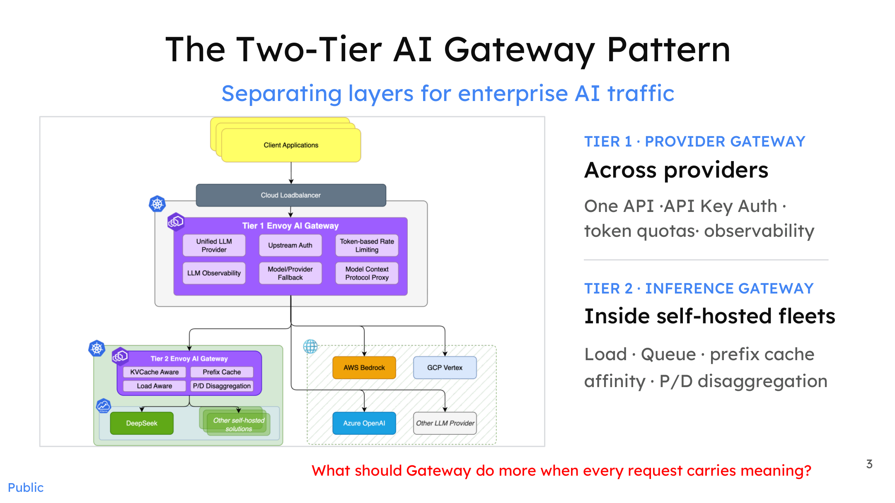
*Figure: Overall architecture of the Two-Tier AI Gateway Pattern. Source: Presentation slides, page 3*

The diagram divides enterprise AI traffic management responsibilities into two independent tiers:

| Tier | Name | Core Responsibilities | Typical Metrics of Concern |
|------|------|---------|-------------|
| **Tier 1** | Provider Gateway | Unified API access, API key authentication, token-level rate limiting, observability | Tokens-per-minute quota, request count |
| **Tier 2** | Inference Gateway | Load awareness within self-hosted clusters, queue scheduling, Prefix Cache Affinity, P/D (prefill/decode) disaggregated routing | GPU queue depth, KV Cache utilization |

The arrows show two traffic paths after requests pass from clients through a cloud load balancer: one flows to external providers (e.g., AWS Bedrock, GCP Vertex, Azure OpenAI, etc.), where Tier 1 handles authentication and rate limiting; the other flows to self-hosted inference clusters (e.g., a GPU fleet running models like DeepSeek), where Tier 2 takes over and performs finer-grained scheduling using backend metrics.

The evolutionary logic of this architecture is clear: a traditional API gateway is essentially reverse-proxy technology (Nginx, Envoy, etc.) extended to new workloads—the backends have shifted from ordinary microservices to model instances deployed via vLLM (a high-throughput large-model inference serving engine), SGLang (an inference engine framework), and similar systems, while rate-limiting granularity has moved from "requests per minute" to "token-level rate limits." Tier 2 emerged because cross-worker, request-level scheduling strategies are fundamentally different from Tier 1's provider-management logic and must be handled independently.

**However, the blind spot of the two-tier architecture lies precisely in this: every scheduling signal—token quota, concurrency count, queue depth, cache hit rate—is a resource-side metric. Not a single one reflects the intent or complexity of the request itself.**

### Four-Dimensional Fragmentation: The Combinatorial Explosion Facing the Gateway

The diagram below, viewed from the perspective prior to introducing a hybrid model architecture, shows the dense cross-connections that have already formed between applications and underlying resources.

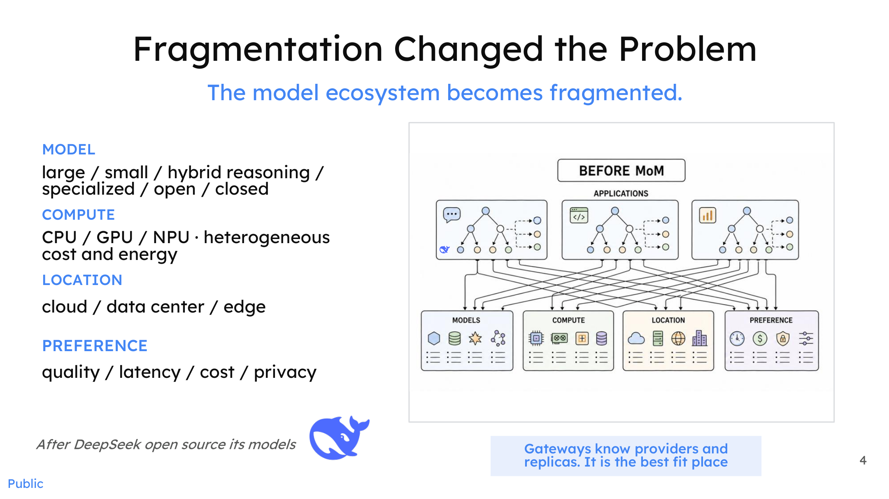
*Figure: Fragmentation changes the nature of the problem—a complex many-to-many mapping forms between applications and resources. Source: Presentation slides, page 4*

Fragmentation unfolds simultaneously along four dimensions:

1. **Model** — Large models / small models / hybrid reasoning / specialized models / open-source / closed-source; capability gaps and architectural differences continue to widen.
2. **Compute** — CPU / GPU / NPU; different hardware exhibits significant differences in cost, power consumption, and model compatibility.
3. **Location** — Cloud APIs, self-hosted data centers, and edge devices each have distinct deployment requirements.
4. **Preference** — Quality-first, latency-first, cost-first, privacy-first; priority rankings differ entirely across business scenarios.

The Cartesian product of these four dimensions turns "which request should go to which model, running on which piece of hardware" into a combinatorial explosion problem. And every scheduling signal available to the two-tier gateway is incapable of reaching the intent and complexity of a request.

### Summary

The two-tier gateway architecture solves the engineering problems of unified provider access and intra-cluster load balancing, but its scheduling vocabulary stops at traffic metrics. Facing a four-dimensionally fragmented ecosystem, token counts and queue depths alone cannot achieve optimal matching of "request → model → hardware." **The gateway must evolve the ability to understand request semantics**—this means inserting a dedicated semantic layer between the existing Tier 1 and Tier 2, transforming a request's intent, complexity, and preferences into structured signals available for routing decisions.

---

## 2. Introducing the Semantic Layer: System Positioning and Responsibility Boundaries of vLLM-SR

### Does a New Component Mean More Coupling?

Inserting a "semantic router" between an existing inference engine and gateway naturally raises an engineering concern: will this increase system coupling, or even cause the router to compete with the inference engine for scheduling authority?

The root of this concern is **ambiguous responsibility boundaries**. Traditional proxies or gateways often perform "which model to choose" and "how to schedule the request" in the same layer. Once the hybrid model pool grows, the input signals for these two classes of decisions are entirely different—the former depends on semantics (intent, domain, risk), while the latter depends on system state (queue depth, KV cache locality, device utilization). Forcibly coupling them means any iteration on one side ripples into the other.

vLLM-SR's answer is: **isolate "which model to choose" into an independent, transparent Semantic Layer, letting it and the downstream inference engine each focus on their own problem.**

### Three Stages in a Request's Lifecycle

The diagram below shows the complete path of a request from entering the unified API to final execution, clearly identifying the semantic router's position in the stack.

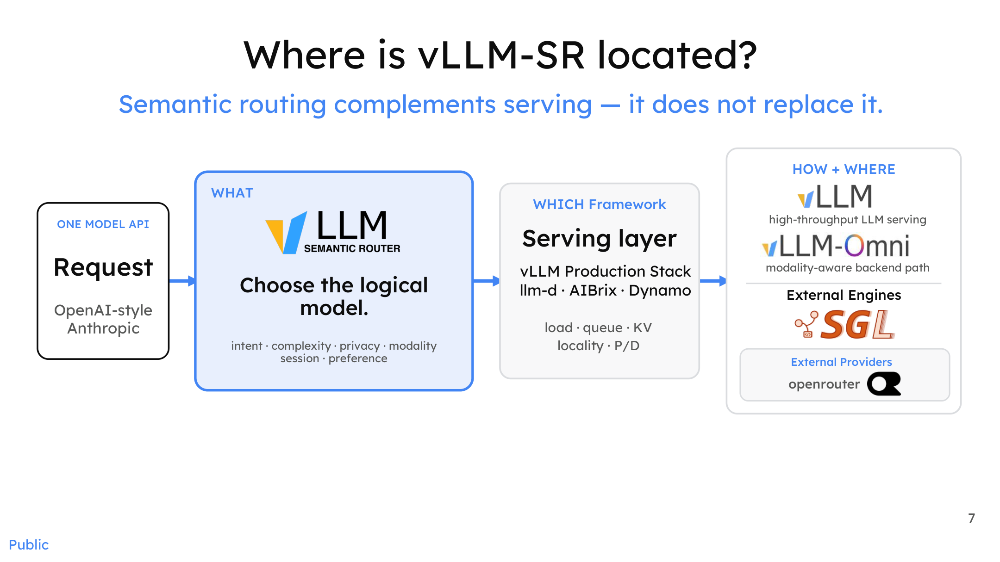
*Figure: System positioning of vLLM-SR, showing the three stages of a request's lifecycle. Source: Presentation slides, page 7*

The diagram partitions a request's lifecycle into three explicit stages:

| Stage | Key Question | Responsible Component | Decision Basis |
|------|---------|---------|---------|
| **WHAT** (what to choose) | Select the logical model | vLLM-SR | Intent, complexity, privacy, modality, session preferences |
| **WHICH** (which framework) | Determine the serving layer | vLLM Production Stack / llm-d / AIBrix / Dynamo | Framework capabilities, modality–backend matching |
| **HOW + WHERE** (how and where to execute) | Load balancing, KV routing, P/D disaggregation | vLLM / SGLang / external providers | Queue length, KV locality, device utilization |

The arrow direction embodies a key causal relationship: a request first reaches the semantic layer, where vLLM-SR determines the logical model based on semantic signals (WHAT), and only then is it forwarded to the specific serving layer and inference engine. The semantic decision occurs *before* execution, not *during* it.

### How the Transparent Semantic Layer Works

The diagram below further illustrates how the semantic layer itself maps request intent to an execution path.

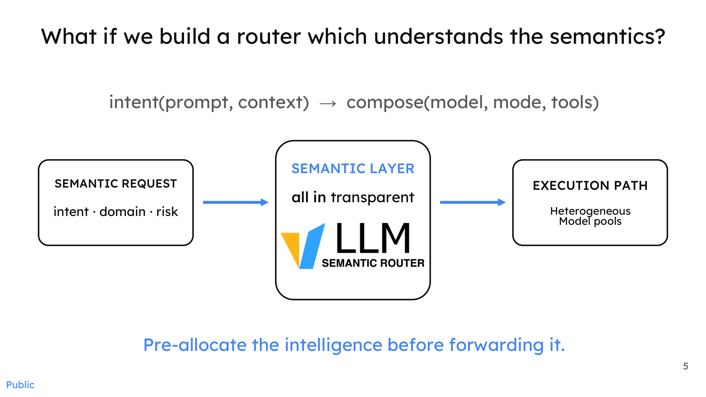
*Figure: The process by which the semantic layer maps request intent to an execution path. Source: Presentation slides, page 5*

On the left side of the diagram, a **Semantic Request** carries three classes of signals: intent, domain, and risk (risk level). The semantic layer in the center translates these signals into a specific **Execution Path** pointing to a logical model in the heterogeneous model pool on the right. The core process can be expressed as:

```
intent(prompt, context) → compose(model, mode, tools)
```

The keyword is "transparent": the semantic layer does not alter the request format, nor does it hold inference state. It performs intelligent pre-allocation before the request is executed, then passes the request in its standard format to the downstream system as-is. From the perspective of downstream vLLM or SGLang instances, what they receive is still an ordinary OpenAI-style or Anthropic-style (Anthropic being an AI model provider) request—they need not be aware that semantic routing exists upstream.

### Minimal Example and Extension

In the simplest single-GPU deployment scenario: a user sends a low-complexity factual retrieval query; vLLM-SR analyzes the intent and maps the request to a lightweight logical model endpoint; the downstream vLLM instance executes according to its own load strategy. The two stages make their decisions independently. If the inference engine is later swapped from vLLM to SGLang, the semantic layer requires no modification—because it only outputs the conclusion of "which model to choose" and does not concern itself with who executes the model.

When the scenario scales to **multi-GPU or multi-node** deployments, the new variable is the heterogeneity of the model pool (different hardware, different regions, different providers). The additional decision dimensions the semantic layer gains are privacy and modality, while the increased complexity of load balancing is entirely absorbed by the serving layer—the two layers iterate at independent cadences without interfering with each other.

It should be noted that the presentation materials do not provide end-to-end latency overhead data after introducing vLLM-SR, so the degree to which the semantic layer is truly "transparent" at a quantitative level still requires validation through future benchmarks.

### Summary

Semantic routing is a **supplement, not a replacement**. By extracting "which model to choose" from the inference engine into an independent semantic layer, vLLM-SR enables both sides to evolve independently along their respective technical trajectories. With the system positioning established, the next natural question is: how much benefit can a concrete routing decision actually deliver?

---

## 3. Minimum Viable Solution: Dual-Branch Routing Based on ModernBERT

### The Dilemma Between Reasoning Capability and Resource Consumption

Models with deep reasoning capabilities typically come with high latency and heavy token overhead, while lightweight, fast models lack accuracy on complex tasks. In real-world traffic, the majority of requests do not require deep reasoning—simple factual queries, format conversions, and basic Q&A account for a substantial share. If all requests are uniformly dispatched to heavyweight models, resources are severely wasted. This leads to the core question: **Can an extremely low-overhead classifier split traffic before requests reach the inference engine?**

### Dual-Branch Architecture

The diagram below shows the complete flow and experimental metrics of this minimum viable approach—the earliest engineering prototype of vLLM-SR.

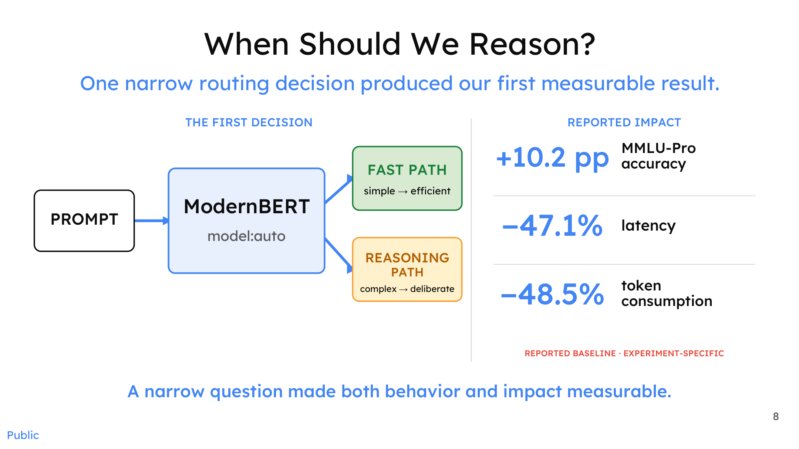
*Figure: Dual-branch routing architecture and experimental metrics. Source: Presentation slides, page 8*

The diagram contains three key elements and one core classification logic:

| Diagram Element | Role | Description |
|---------|------|------|
| **PROMPT** | Entry point | The raw query submitted by the user |
| **ModernBERT** | Classifier | A lightweight classification model based on an encoder architecture (encoder-based model) that performs binary classification on the prompt; inference overhead is typically on the order of milliseconds |
| **FAST PATH** | Fast branch | Labeled simple → efficient; handles straightforward queries |
| **REASONING PATH** | Reasoning branch | Labeled complex → deliberate; handles queries requiring deep reasoning |

The arrow direction reflects the causal chain: the prompt first enters ModernBERT, whose classification result determines which downstream path is taken.

### Why Can a Simple Split Improve Three Metrics Simultaneously?

The benefit of dual-branch routing stems from a clear causal chain:

1. **Eliminating unnecessary reasoning depth**: Simple queries are directed to a fast model, avoiding the triggering of long-chain reasoning processes.
2. **Latency reduction**: The fast model's time-to-first-token and total generation time are both significantly lower than those of the reasoning model.
3. **Token consumption reduction**: Reasoning models produce large volumes of intermediate tokens during their thinking process (e.g., chain-of-thought outputs); bypassing this for simple queries lowers total consumption.
4. **Accuracy actually increases**: Complex queries no longer compete for the same model's attention budget with simple queries, allowing the reasoning model to focus on problems that genuinely require deep thought.

The essence is **matching the model on each path to the task difficulty, rather than forcing a single model to bear the entire complexity gradient**.

### Data Anchor: Results from a Controlled Experiment

In a controlled experiment targeting a specific routing decision (based on the MMLU-Pro benchmark), dual-branch routing produced the following results:

| Metric | Magnitude of Change |
|------|---------|
| MMLU-Pro Accuracy | **+10.2 percentage points** |
| Latency | **−47.1%** |
| Token Consumption | **−48.5%** |

> **MMLU-Pro** (Massive Multitask Language Understanding – Professional) is a multi-discipline evaluation benchmark; here it is used to measure changes in task accuracy before and after routing.

**Essential caveats**: These figures come from a narrowly scoped routing-decision experiment, and the original materials explicitly label them as experiment-specific baselines. The presentation materials do not disclose the names of the compared models, which models were used on each of the two paths, or the scale and distribution of the test set. **Therefore, these numbers should not be directly extrapolated to arbitrary production scenarios.**

### Limitations and Scaling Bottlenecks

Although dual-branch routing produced notable results under the controlled conditions described above, it has clear scalability bottlenecks as a minimum viable prototype:

- **Single-dimension classification granularity**: It performs only a "simple/complex" binary classification and cannot identify the domain of a query (math, coding, etc.) or determine whether it contains safety risks. According to the presenter, the early prototype actually required training three separate encoders for domain classification, jailbreak detection, and token-level annotation, respectively—a single binary classifier quickly proved insufficient.
- **Static decision boundary**: The classification threshold is fixed at training time and cannot dynamically adjust based on real-time load or model availability.
- **Lack of a feedback loop**: The quality of routing decisions cannot be corrected by downstream results fed back; misrouted requests directly cause quality degradation with no mechanism for detection.

### Summary

Dual-branch routing based on ModernBERT validates a core proposition—adding an extremely low-overhead semantic classifier in front of the inference engine is sufficient, under specific conditions, to simultaneously improve accuracy, latency, and cost, three metrics that typically conflict with one another. However, it is fundamentally a coarse-grained, static classifier. When confronting real-world needs such as domain identification, safety filtering, and multimodality, the router must evolve toward a richer signal-processing architecture.

---

## 4. Architectural Evolution: Breaking Through the Static Bottleneck with Signal-Driven Decision Flows

### Why the Static Pipeline Cannot Scale

The initial semantic router employed a serial pipeline: Jailbreak Classifier → PII Token-level Classifier → Domain Classifier. Three models were chained sequentially: a jailbreak hit triggered interception, PII leakage triggered rejection, and remaining requests were dispatched by the domain classifier.

However, when the router attempted to integrate with a dynamic environment where the number of available models was growing rapidly, the serial pipeline exposed a fundamental contradiction: **both the dimensions of admissible signals and the number of selectable models were hard-coded by the pipeline's topology.** According to the presenter, after HuggingFace launched HuggingChat's Omni mode, the platform needed to dynamically select models, but the static pipeline at the time could not support this—the available model pool jumped from single digits to dozens or even hundreds, and a three-step serial pipeline could not cover the space.

This contradiction drove the core architectural transformation: from a static classification pipeline to a scalable **Signal-Driven Decision Architecture**.

### Parallel Extraction of Heterogeneous Signals

The first step in solving the scaling problem is to redefine how the router observes a request. The diagram below shows the structural shift from a serial pipeline to parallel signal extraction.

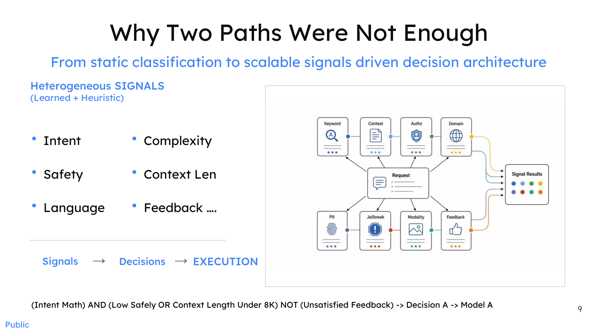
*Figure: A request is processed in parallel by multiple signal extractors; outputs converge into a signal results matrix, which is then passed through Boolean logic to generate a routing decision. Source: Presentation slides, page 9*

The diagram distributes an inbound request to multiple parallel signal extractors—including Keyword, Context, Authz, Domain, PII, Jailbreak, Modality, Feedback, and others—whose outputs merge into a unified **Signal Results** matrix. Signals are explicitly categorized into two types:

| Type | Characteristics | Typical Signals |
|------|------|----------|
| **Heuristic Signals** | 100% deterministic; no model inference required | Keyword matching, context length, language identification, structured fields |
| **Learned Signals** | Probabilistic output; relies on classifiers or encoders | Intent classification, jailbreak detection, PII entity tagging |

The key change is **serial becomes parallel**. The former serial dependency of jailbreak → PII → domain is dissolved: a single request may simultaneously carry jailbreak risk, PII content, and domain-specific characteristics; observations across all three dimensions proceed without blocking one another, each independently producing its signal value. Parallelization yields two direct benefits: lower latency (total latency is determined by the slowest individual extractor rather than the sum of all extractors) and dimensional extensibility (adding a new observation dimension only requires adding an extractor without affecting existing pipelines).

### The Six-Stage Pipeline: From Signals to Models

Signal extraction is only the first step. A complete routing decision must also answer: what do the observations mean? What policy should be executed? Which model should be used? The diagram below decomposes the routing process into six independently iterable stages.

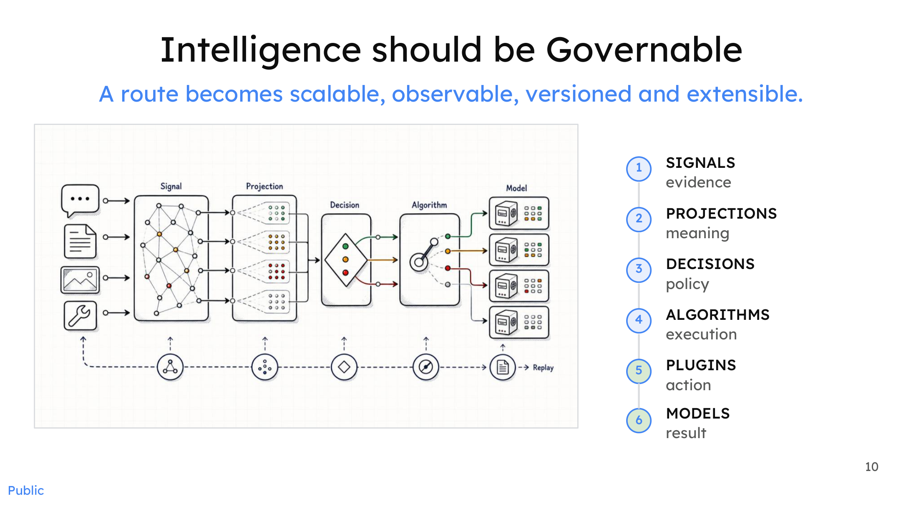
*Figure: The six-stage routing pipeline, enabling observable, versionable, and extensible routing governance. Source: Presentation slides, page 10*

| Stage | Name | Responsibility Keyword | Input → Output |
|:---:|------|-----------|-------------|
| ① | **Signals** | Evidence | Raw request → multi-dimensional signal values |
| ② | **Projections** | Meaning | Signal values → semantic mappings (e.g., mapping token count to "long/short") |
| ③ | **Decisions** | Policy | Projection results → Boolean combination policies |
| ④ | **Algorithms** | Execution | Policies → routing execution logic |
| ⑤ | **Plugins** | Actions | Execution logic → concrete system calls |
| ⑥ | **Models** | Results | System calls → model inference output |

The stages form a unidirectional dependency chain; each stage consumes only its upstream output and produces only its downstream input. The core causal mechanism is **decoupling**: a change at the signal layer (e.g., adding a Feedback signal) does not require modifying decision-layer logic; a policy adjustment at the decision layer does not affect underlying model deployment.

### Boolean Composition: Turning Heterogeneous Signals into Routing Policies

After the projection layer normalizes raw signal values into decidable semantic labels, the decision layer uses **Boolean Logic** to combine multiple conditions into routing policies. The bottom of presentation slide 9 provides an illustrative expression:

```
(Intent = Math) AND (Low Safety OR Context Length < 8K)
  NOT (Unsatisfied Feedback)
  → Decision A → Model A
```

Breaking down each predicate: `Intent = Math` comes from a learned intent classifier; `Low Safety` comes from a low-risk determination by the jailbreak detector; `Context Length < 8K` is a heuristic signal, determinable by simply counting tokens; `Unsatisfied Feedback` depends on historical interaction data.

Boolean expressions can freely combine AND / OR / NOT; the policy space expands exponentially as signal dimensions increase, with no need to modify the pipeline topology. For example, when a safety signal comes online, only a new predicate `Safety = High → reject or escalate to review` needs to be added at the decision layer; the signal-layer extractor is deployed independently and executes in parallel, without altering existing flows.

### Boundary Conditions

- **Signal conflicts**: When learned signals yield contradictory verdicts (e.g., the intent classifier labels a query "math" while the domain classifier labels it "chitchat"), the current materials do not describe a specific conflict-resolution mechanism.
- **Latency overhead**: Although parallel signal extraction theoretically incurs only the latency of the slowest component, if a particular learned classifier has high inference time, its impact on end-to-end latency still warrants attention. The presentation materials do not provide measured latency data for individual extractors.
- **Policy explosion**: The free combination of Boolean conditions can produce a large number of rules when dimensionality is high; how to manage rule versioning and mutual-exclusion relationships is an additional engineering governance challenge.

### Summary

The signal-driven decision architecture decomposes the serial three-step classification into parallel extraction of heterogeneous signals, then transforms those signals into governable routing policies through four intermediate layers: projections, Boolean decisions, algorithms, and plugins. Each layer of the six-stage pipeline has a single responsibility and a well-defined interface; adding observation dimensions or adjusting policies never requires restructuring the global pipeline. This flexible decision-orchestration capability means the router is no longer limited to "selecting one model"—it can orchestrate multiple models to work in concert.

---

## 5. From Single Selection to Collaboration: Micro-Agent Algorithms for Multi-Model Cooperation

### The Ceiling of Monolithic Selection

The core routing action discussed in all preceding sections has been "select the single most suitable model." But a fundamental contradiction exists: **no matter how precise the routing, a single model's capability ceiling does not rise simply because it was selected.** When the intrinsic difficulty of a request exceeds the reliable answering range of any single model in the candidate pool—for example, a composite task requiring reasoning, search, and then verification—a single selection can only yield "the least bad answer," not "a good enough answer."

Breaking through this ceiling requires the router to evolve from **Model Selection** to **Model Collaboration**: orchestrating multiple models in real time within the lifecycle of a single request, trading compute time for output quality. vLLM-SR categorizes such collaboration strategies into four semantic modes, implemented in the form of Looper micro-agents.

### Panorama of Four Collaboration Semantics

The diagram below arranges four modes from left to right by collaboration complexity; each mode corresponds to a different Looper flow and role division.

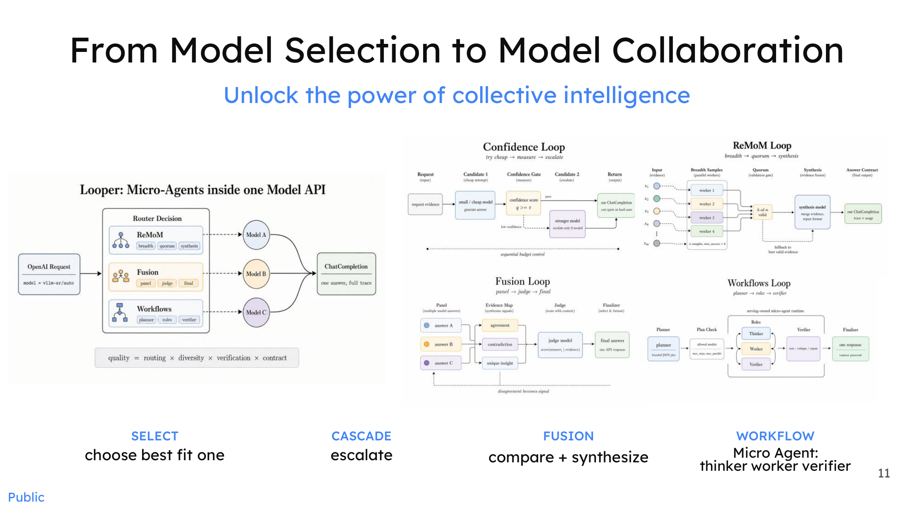
*Figure: The four semantic modes of multi-model collaboration and their internal Looper flows. Source: Presentation slides, page 11*

| Semantic Mode | Core Verb | Number of Participating Models | Loop Condition |
|----------|---------|-----------|---------|
| **SELECT** | choose best-fit one | 1 | No loop; single selection |
| **CASCADE** | escalate | ≥2 (tiered) | Escalate when confidence is insufficient |
| **FUSION** | compare + synthesize | ≥2 (parallel) + Judge | Re-enter when Judge deems result inadequate |
| **WORKFLOW** | plan → execute → verify | ≥3 (role-based) | Re-enter when Verifier rejects |

SELECT has already been discussed in earlier sections; the following focuses on the latter three collaboration algorithms.

### CASCADE: Confidence-Driven Tiered Escalation

The arrow flow of the Confidence Loop in the diagram is as follows: upon arrival, the request is dispatched to the lowest-cost candidate model; after the model returns a result, the system performs a **Confidence Check**; if the threshold is met, the result is returned directly; if not, the request is passed to the next-tier, more capable model, the check is repeated, and escalation continues tier by tier until confidence is satisfied or the most capable model is reached.

The core variables are the **confidence threshold** and the **cost gradient of the candidate models**. A lower threshold means requests are more likely to be absorbed at lower tiers—lower latency and cost, but higher quality risk; a higher threshold pushes more requests up to expensive models. The presentation materials explicitly state this is a **real-time**, per-request algorithm—each request is evaluated independently, with no dependence on offline batch processing—but do not provide specific threshold values or online A/B test data.

### FUSION: Parallel Multi-Model Generation + Judge Synthesis

Fusion takes an approach orthogonal to cascading: instead of serial escalation, it **has multiple models answer the same question simultaneously, then a Judge model synthesizes the final answer**.

The key nodes in the Fusion Loop shown in the diagram are: (1) **Panel** — the same request is broadcast to N candidate models, each generating an answer independently; (2) **Judge** — collects all candidate answers, compares their strengths and weaknesses, and synthesizes a composite response; (3) **Quality Check** — if the Judge's output is qualified, it is returned; otherwise, the loop is re-entered.

The fusion strategy also spawns a **ReMoM Loop** variant: the first layer uses a larger number of models, each reasoning independently; the second layer uses fewer models to perform a second round of reasoning on the previous round's answers; the funnel narrows layer by layer until converging on a single answer—a topology resembling a tournament elimination bracket, where each round converts inter-model diversity into higher-quality consensus.

The new variables introduced by Fusion are the **number of parallel models** and the **choice of Judge model**. A higher degree of parallelism increases answer diversity but linearly increases inference cost; if the Judge itself is insufficiently capable, the synthesized quality may actually fall below that of the best single model.

### WORKFLOW: Role-Based Micro-Agents

Workflow is the most complex collaboration mode, decomposing a single request into multiple role-based subtasks:

- **Thinker / Planner**: Receives the original request, understands the intent, and decomposes it into several sub-problems.
- **Worker**: Takes on a sub-problem, performs inference, and returns a partial result.
- **Verifier**: Aggregates all Worker outputs for correctness verification. If verification passes, the final answer is synthesized and returned; if it fails, the task is sent back to the Thinker for re-planning or to the Worker for re-execution.

This structure is morphologically similar to general-purpose agent collaboration frameworks, but the key distinction is that it runs on the **real-time path at the request level**—every API call can potentially trigger a complete Plan → Execute → Verify loop within a millisecond-to-second time window.

### Minimal Example: Three Collaboration Paths for a Code-Generation Request

Suppose a user submits a code-generation request: "Write a concurrency-safe LRU cache."

- **CASCADE path**: The router first sends the request to a lightweight code model. The system evaluates the result's confidence as low (e.g., missing lock mechanisms) and automatically escalates to a more capable code model for regeneration, repeating until confidence is met.
- **FUSION path**: The request is sent simultaneously to three different code models, each generating its own implementation. The Judge model compares the three codebases, extracts the best segments from each (e.g., Model A's locking strategy + Model B's eviction algorithm), and synthesizes a final version.
- **WORKFLOW path**: The Thinker model decomposes the task into three subtasks—"data structure design," "concurrency control," and "unit tests"—and assigns each to a Worker model specializing in the respective domain. The Verifier detects a deadlock risk in the concurrency-control sub-module and sends that subtask back to the corresponding Worker for remediation. After passing verification, the complete code is assembled.

The cost–latency–quality tradeoffs of the three paths differ: CASCADE is the most economical (most requests are absorbed at low tiers); FUSION has the highest parallel overhead but yields the greatest answer diversity; WORKFLOW has the longest latency but the strongest capability for structured decomposition of complex tasks.

### Summary

The router's function has evolved from static dispatching that "finds the best model for a request" to a real-time algorithmic layer that "dynamically orchestrates multi-model collaboration within a single request." The essence of this evolution is trading **Test-time Compute** (additional computational resources invested during the inference phase to improve output quality) for output quality that surpasses the capability ceiling of any single model. However, each iteration of a collaboration strategy means additional inference overhead—the presentation materials do not provide specific latency increase or quality gain data for each strategy under production workloads, and effectiveness must be validated against actual scenarios.

---

## 6. Industrial Validation: Engineering Evidence That Open-Source Collaboration Surpasses Frontier Monolithic Models

### Can the Performance Ceiling and the Cost Floor Be Broken Simultaneously?

When deploying large language models, enterprises perpetually face a set of opposing constraints—pursuing the highest accuracy means calling the most expensive closed-source frontier models, while controlling costs typically comes at the expense of quality. Multi-model collaboration architectures attempt to break this zero-sum game: the router assigns requests of varying difficulty to models of varying cost, so that the aggregate score approaches or even exceeds that of a single frontier model while directing the majority of traffic to low-cost nodes. The following examines this hypothesis from two dimensions: public benchmarks and industrial deployment.

### Benchmarks: Score Comparisons on Specific Subsets

The diagram below shows a score comparison between multi-model collaboration approaches and closed-source frontier models across three benchmarks; note the subset size for each benchmark.

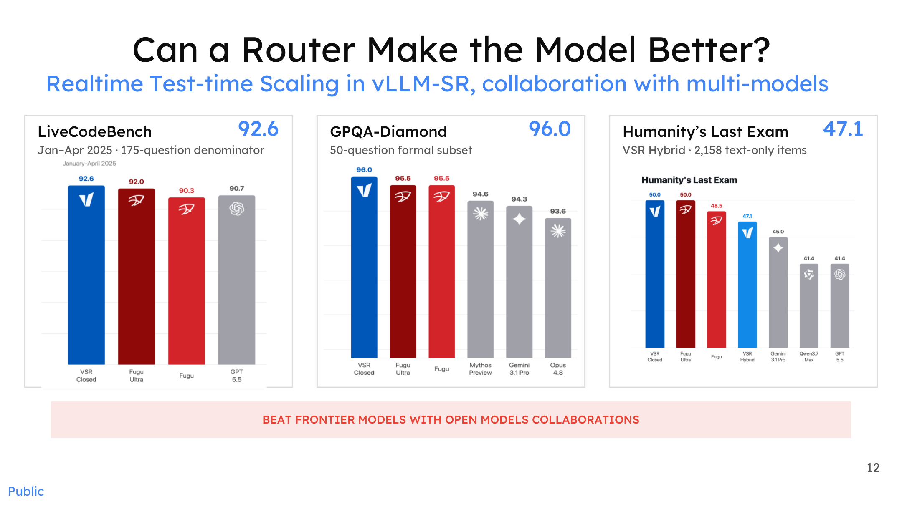
*Figure: Scores of vLLM-SR multi-model collaboration on three benchmarks. Source: Presentation slides, page 12*

The horizontal axis compares **VSR** (in Closed and Hybrid configurations), **Sakana Fugu** (a multi-model intelligent composition system that fuses outputs from multiple open-source models via evolutionary search), and closed-source frontier models such as GPT-5.5, Gemini 3.1 Pro, and Opus 4.8. Key data:

| Benchmark | Subset Size | VSR Closed Score | Comparative Observation |
|---|---|---|---|
| **LiveCodeBench** | 175 problems (Jan–Apr 2025 subset) | **92.6** | Higher than the GPT-5.5 bar in the chart |
| **GPQA-Diamond** | 50 questions (official subset) | **96.0** | Higher than the bars for multiple frontier models in the chart |
| **Humanity's Last Exam** | 2,158 text-only entries | 47.1 (VSR Hybrid) | Does not exceed the highest frontier model in the chart |

> **LiveCodeBench** is a dynamic benchmark for evaluating code generation and reasoning capabilities; **GPQA-Diamond** (Graduate-Level Google-Proof QA) is a graduate-level scientific question-answering evaluation set.

**Causal interpretation**: The VSR Closed scores on LiveCodeBench and GPQA-Diamond both exceed those of multiple frontier models shown in the chart. This is a manifestation of "Realtime Test-time Scaling"—the router selects in real time the open-source model best suited for each question at test time. Different open-source models excel in different sub-domains, and the router's selection advantage becomes visible.

**Boundary conditions**: The subset sizes for the first two benchmarks are small (175 problems, 50 questions), resulting in relatively wide statistical confidence intervals. On the larger Humanity's Last Exam (2,158 entries), VSR Hybrid's 47.1 does not exceed the highest frontier model. In other words, the collaborative architecture's advantage does not hold across all benchmarks; the number of items and domain coverage directly affect the generalizability of the conclusions.

### Industrial Deployment: Microsoft MDASH's Hybrid Routing in Practice

The bottom of the diagram below shows MDASH's deployment data in a cybersecurity scenario, extending the benchmark conclusions into a production environment.

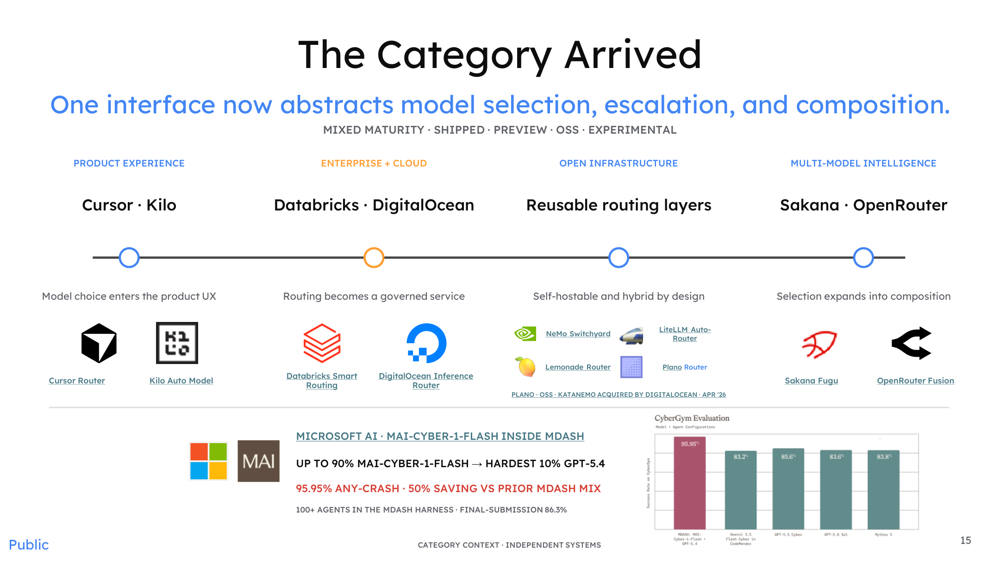
*Figure: Routing category panorama and Microsoft MDASH deployment results. Source: Presentation slides, page 15*

**MDASH** (Microsoft AI's model routing and agent framework for coordinating model scheduling across more than 100 agents) employs a straightforward hybrid routing strategy in a cybersecurity scenario:

> **Up to 90% of requests → MAI-CYBER-1-FLASH** (a lightweight cybersecurity model developed in-house by Microsoft)
> **The most difficult 10% of requests → GPT-5.4**

Key results produced by this traffic split:

| Metric | Value |
|------|------|
| Task success rate (ANY-CRASH) | **95.95%** |
| Cost savings | **~50%** (compared to the prior model combination used in MDASH) |
| Final submission score | 86.3% (within an evaluation framework encompassing 100+ agents) |

**Causal chain**: MAI-CYBER-1-FLASH handles the vast majority of routine security analysis requests at an inference cost far below that of GPT-5.4. The router escalates to GPT-5.4 only when confidence is low or task complexity is high. Approximately 90% of queries in the security domain fall into known patterns or moderate difficulty, which the lightweight model can handle correctly; only long-tail hard cases require frontier model intervention. This is entirely consistent with the core logic of the cascade strategy discussed earlier, except extended from academic benchmarks to a production-grade agent cluster.

**Caveats**: The presentation materials do not disclose MAI-CYBER-1-FLASH's standalone accuracy, nor the specific thresholds used in routing decisions. The 50% cost saving is relative to the prior MDASH model combination, not relative to full-volume GPT-5.4 invocations.

### From Benchmarks to Production: Variable Comparison

| Dimension | Benchmark Scenario | Microsoft MDASH Scenario | Key Variable That Changed |
|---|---|---|---|
| Model pool | Multiple open-source models | In-house model + GPT-5.4 | Closed-source model enters the mix |
| Routing granularity | Per-question | Per-request / per-agent | Agent count > 100 |
| Evaluation metric | Accuracy | Success rate + cost | Cost becomes a first-order objective |
| Subset size | 50–2,158 items | Production traffic (volume undisclosed) | Statistical stability increases substantially |

The core benefit pattern remains unchanged: route the majority of traffic to cost-effective nodes, invoking expensive models only when necessary.

### Summary

On constrained benchmark subsets, open-source multi-model collaboration has already achieved scores surpassing several frontier closed-source models on code and scientific reasoning tasks; in Microsoft's industrial practice, hybrid routing with a 90/10 traffic split achieved a 95.95% task success rate and approximately 50% cost reduction. Both sets of evidence indicate from different angles that the cost-effectiveness advantage of collaborative architectures can be realized under real-world conditions, though generalizability remains bounded by evaluation subset size, domain characteristics, and routing algorithm quality.

---

## 7. The Ultimate Form: Virtualization Abstraction of the Mixture-of-Models (MoM)

### Complexity Is Leaking to the Client Side

After the semantic router successfully splits requests to different models on the backend, a new engineering contradiction surfaces—**what should the client see?** If every caller needs to know which model pools exist in the backend, what hardware each pool is deployed on, and what version the routing policy is, then the optimization gains inside the system will be consumed by integration costs on the frontend. A more realistic scenario is this: downstream callers are often automated Agents, not human developers; they should interface with a single stable model endpoint and bear no routing logic whatsoever.

The **Mixture-of-Models** (MoM)—a single virtual model contract atop a heterogeneous pool of models and compute—is the virtualization abstraction proposed to resolve precisely this contradiction: externally, only a versioned model ID is exposed (e.g., `vllm-sr/mom-balanced-v1`); internally, workload, routing algorithm, and model pool collaborate to achieve global optimization.

> MoM and Mixture-of-Experts (MoE) address problems at different levels: MoE performs sub-network selection *within* a single model; MoM performs dynamic scheduling across models and hardware at the **system level**.

### WRP Co-Design

The diagram below shows the three-layer architecture of the MoM control runtime from the builder's perspective, as well as how the offline–online optimization loop operates.

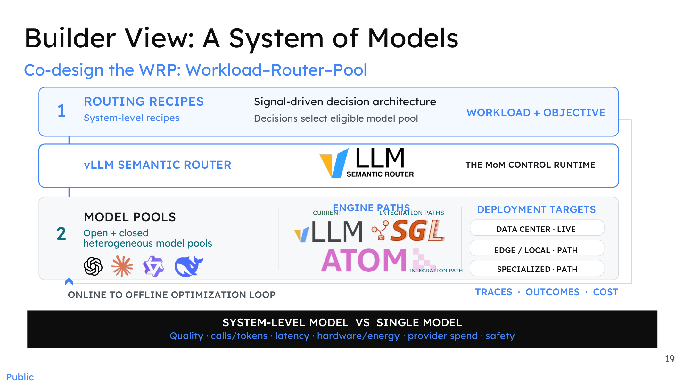
*Figure: The "model system" from the builder's perspective, showing the three-layer structure of WRP co-design. Source: Presentation slides, page 19*

The diagram contains, from top to bottom, three core layers corresponding to the three components of **WRP** (Workload–Router–Pool) co-design:

| Layer | Name | Responsibility |
|:---:|------|------|
| ① | **Routing Recipes** | Encode workload characteristics and optimization objectives into a signal-driven decision architecture that determines which candidate model pool a request enters |
| — | **vLLM Semantic Router (MoM Control Runtime)** | Receives routing-recipe outputs and executes selection, cascade, or collaboration strategies |
| ② | **Model Pools** | Contain heterogeneous open-source and closed-source models, connected via different inference-engine paths to data-center, edge, or dedicated deployment targets |

The arrows at the bottom of the diagram form an **offline–online optimization loop**: Traces (call chains), Outcomes (result quality), and Cost (expenditure) data generated at runtime flow back into the system, driving iterative updates to routing recipes and model-pool configurations. The evaluation dimensions are explicitly listed in the diagram—quality, invocation/token counts, latency, hardware energy consumption, provider spend, and safety.

**Causal mechanism**: Precisely because the three WRP components are packaged into a single runtime, the client can call the entire system as if calling a single-model API—routing logic is invisible to the outside, decision results are imperceptible to the outside, and only the final performance in terms of quality and cost can be observed.

### Binding a Single Model ID to Heterogeneous Environments

The diagram below shows how the same virtual model ID maps to four scenarios: edge, enterprise, cloud, and data center.

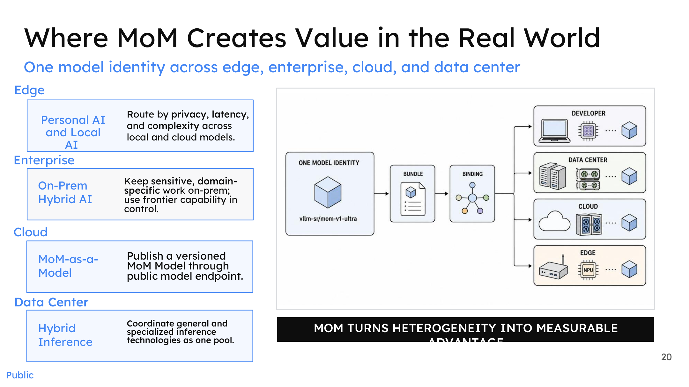
*Figure: MoM scenario value map, showing how a virtual model ID binds to different deployment topologies. Source: Presentation slides, page 20*

On the right side of the diagram, the virtual model ID labeled `vllm-sr/mom-v1-ultra` radiates outward along four binding paths—targeting a developer's local device, a data-center cluster, a public cloud endpoint, and an edge NPU, respectively. The left side breaks down MoM's value proposition by scenario:

| Deployment Scenario | Routing Decision Basis | Typical Benefit |
|----------|-------------|---------|
| **Edge** | Privacy level, on-device latency, task complexity | Sensitive data never leaves the device; simple requests are processed locally |
| **Enterprise (on-premises)** | Domain sensitivity, compliance requirements | Domain-specific tasks stay local; frontier models are called in a controlled manner only when necessary |
| **Cloud** | Versioned releases, elastic scaling | Published through a public endpoint in a MoM-as-a-Model form factor |
| **Data Center** | Unified scheduling of general-purpose and specialized inference technologies | Aggregates compute from multiple inference engines into a single resource pool |

The client always uses the same model endpoint; the backend automatically routes to the most suitable environment and model based on the request's privacy tags, latency budget, and complexity characteristics.

> **Ecosystem context**: LiteLLM (an open-source infrastructure auto-router) already provides similar multi-model proxying capabilities in the community and can be viewed as an early practice node for the MoM concept within the engineering ecosystem.

### Minimal Example: The Call Flow from an Agent's Perspective

Taking an automated Agent as an example, integration requires only three steps:

1. **Register the endpoint**: Add `vllm-sr/mom-balanced-v1` as a model provider in the Agent framework.
2. **Send a request**: Submit a prompt in the standard model API format with no additional routing directives.
3. **Receive the response**: The returned result is identical in form to calling a single model; the Agent cannot perceive what routing decisions were made in the backend.

Establishing trust in a virtual model relies on two evaluation perspectives: the **black-box perspective** (users/Agents compare the virtual model against a baseline single model on standard benchmarks, quantifying latency and cost benefits) and the **white-box perspective** (system operators inspect the runtime internals, observing routing hit rates, per-pool load distributions, safety interception rates, and other system-level metrics). The presentation materials indicate that both perspectives need to be established simultaneously but do not provide specific evaluation data.

### Boundaries and Applicability Conditions

MoM's benefits are positively correlated with the degree of underlying heterogeneity—the more model types, the more diverse the hardware, and the more dispersed the deployment environments, the greater the integration cost reduction and global optimization headroom that a unified abstraction delivers. Conversely, when the deployment scenario is singular (e.g., only a single model in the cloud), the virtualization abstraction layer's value approaches zero and instead adds a layer of indirect invocation overhead.

### Summary

MoM closes the causal chain that runs through this entire article: the initial contradiction was that model capability fragmentation made it difficult for callers to choose; the semantic router achieved intelligent matching of requests to models through intent understanding; and MoM fully encapsulates this matching process, presenting to the outside world a single virtual model contract that promises a stable quality–cost–safety tradeoff. From fragmentation to virtualization, the system completes an architectural leap from "humans choose models" to "the system chooses models on behalf of humans, imperceptibly."

---

## Conclusion

1. **AI infrastructure is shifting from monolithic model serving to a multi-model collaboration paradigm.** Four-dimensional fragmentation across models, compute, location, and preference means no single endpoint can optimally serve all requests.
2. **The semantic blind spot of traditional two-tier gateways is a systemic bottleneck.** Tier 1 and Tier 2 handle only resource-side metrics and have no awareness of request intent or complexity, leading to compute mismatch.
3. **vLLM-SR bridges this blind spot by introducing a transparent semantic layer.** It focuses on "which model to choose" (WHAT) without interfering with the inference engine's execution scheduling (HOW + WHERE)—it is a supplement, not a replacement.
4. **The signal-driven, six-stage architecture moves routing decisions from static classification to dynamic orchestration.** Parallel heterogeneous signal extraction and Boolean combination policies support hot-pluggable dimensions, laying the structural foundation for multi-model collaboration.
5. **Three collaboration strategies—cascade, fusion, and workflow—expand the router's output from "single selection" to "coordination."** They trade Test-time Compute for output quality that surpasses any single model's capability ceiling.
6. **Industrial data show that, in specific scenarios, well-composed model combinations can match or exceed frontier closed-source models at lower cost.** Microsoft MDASH achieved a 95.95% success rate and approximately 50% cost reduction with a 90/10 traffic split.
7. **The MoM virtualization abstraction ultimately shields users from the complexity of heterogeneous underlying compute.** A single model ID binds to edge, cloud, and enterprise environments; clients need not bear any routing logic.

**Limitations and open questions**:

- The benchmark data cited in this article (LiveCodeBench with 175 problems, GPQA-Diamond with 50 questions) come from specific subsets with relatively wide statistical confidence intervals and should not be directly generalized.
- Quantitative data such as the end-to-end latency overhead introduced by the vLLM-SR semantic layer, the measured latency of individual signal extractors, and the latency increase of collaboration strategies under production workloads are not disclosed in the current materials.
- Engineering details including signal-conflict resolution mechanisms, Boolean policy version governance, and trust evaluation frameworks for virtual models await future implementation and validation.
- MoM's benefits are positively correlated with the degree of underlying heterogeneity; in simple scenarios with a singular model pool, the virtualization abstraction may not offer a sufficient return on investment.
